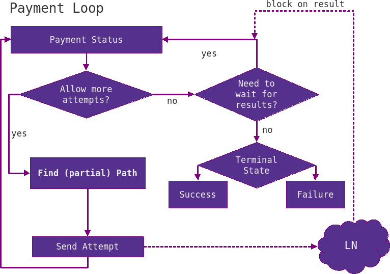
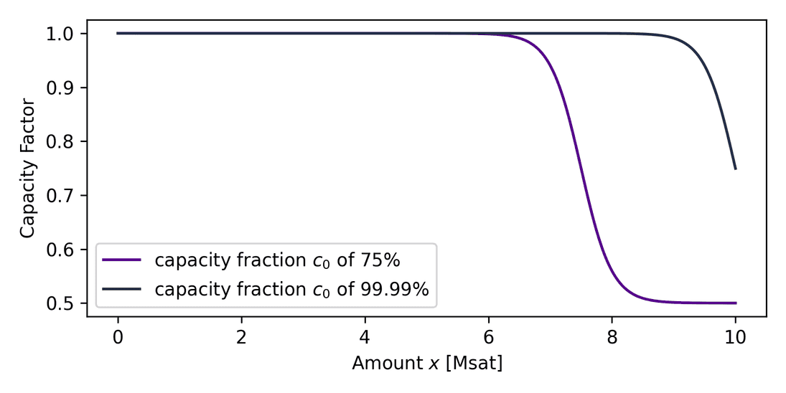

> *作者：Bitromortac*
> 
> *来源：<https://lightning.engineering/posts/2024-04-11-pathfinding-1/>*

闪电网络的承诺是让比特币支付能够得到近乎瞬时的结算。但是，以自治的方式实现这个目标构成了持续的技术挑战，主因是通道余额的不透明，但这也是内化于闪电网络的设计的。在本文中，我们会深入了解闪电网络中的寻路程序（在更广泛的意义上，是支付的规划），尤其是 LND 客户端中的相关实现。我们将讨论现有的、让支付更加可靠的技术，深入解释 LND 如何确定通道的性能，并探索近期的进展，包括一种新增的概率性估算器。

- 图 1. 理清围绕寻路的概念 -

## 发起支付的前提

闪电网络上的支付，在使用时给人的感觉是几乎瞬时完成的，但表象之下，一笔支付的处理涉及许许多多的东西。为了在闪电网络上发起一笔多跳支付，我们大体上要满足两个前提：

1. 我们需要得到一张 “发票（invoice）”，以辨明这一支付的 *接收者*
2. 我们需要一个完全同步的网络拓扑图视角，以详细地了解 *如何* 将支付从发送者路由到接收者

第一个前提可以很容易通过发送者和接收者在支付时候的私下通信（out-of-band communication）得到满足。但第二个前提就更加复杂。

参与闪电网络的节点通过点对点的 gossip 消息来获得网络拓扑信息（也叫 “网络图谱”）。这些消息包括基本的元数据，比如关于通道容量的信息（通过通道 id 间接获得）、关于 HTLC（哈希时间锁合约）的约束（比如其面额的下限或上限）。这些消息还包括一个通道是否已被标记为不可用，以及每个路由者在转发支付时要收取多少手续费。虽然这些消息都是单个单个传输的，但两个对等节点之间可能同时存在多条通道，需要宣告不同的通道约束。在寻路时，支付者的节点需要将这些平行的通道虚拟成一条边，以便估计最糟糕情况下的约束（例如，要被收取的最大手续费率，或者最大的时间锁差值）。通过这些平行的通道来转发支付的路由节点可以自由选择其中任意一条通道，这叫做 “非严格转发”。这是第一个提高路由可靠性的重要步骤。

存在能够在需要的地方提供流动性的良好路由节点，结合能够找到流动性的智能的寻路算法，支付可以更加可靠。理想情况下，基于过往的支付经验以及 gossip 图谱提供的所有信号，规划好的支付应该能够一次尝试就成功。但是，路由节点在各自的动作中并不总是具有完美的效率，这也是为什么我们要预料到通道因缺乏流动性而无法转发的情形。因此，发送支付的程序需要试错的循环。而且，一笔闪电支付不仅可以沿着一条路径转发，还可以分割成多个部分（沿着不完全相同的多条路径转发）。

## LND 中的支付试错循环

本节会简要介绍在 LND 中一笔支付的生命历程。为了启动支付流程，支付方用户需要向 LND 软件传入由接收者生成的发票；发票也可能携带额外的、可以补充网络图谱的信息，例如可选的中间节点提示，可以用来知晓如何走完触达接收者的 “最后一公里”。支付规划也需要知道支付的数额以及接收者节点所指出的协议特性（例如是否支持多路径支付），这些也都包含在发票里面。这时候，我们就可以进入下图所示的支付试错循环了：

- 图 2. LND 中的支付试错循环流程图 -

我们首先要检查支付的状态，这表示一笔支付要发起了，但尚未发起任何尝试，因此我们可以发送新的 HTLC 尝试。然后，我们计算出一条路径及其总支付额（寻路的细节见下文），然后沿着路径，在选定的通道上按方向发送支付。这时候，这次尝试的命运就已经不在我们控制之中了，这笔支付现在 *正在飞行*。这时候我们也不会允许新的尝试，因为总支付额已处于待定状态，我们需要等待对等节点要求结算或表示失败。

最常见的失败原因是 *临时的通道故障*，表明这条路径上的某一些通道缺乏流动性。别的原因包括某一个中间节点下线了，或者支付给某个节点的手续费不够。这都是有价值的信息，我们可以用来优化我们的下一次路径选择。我们通过求解哪一个节点开始汇报错误，来了解这条路径的通畅部分和不通畅的部分。这个信息会被记录在叫做 “[任务控制中心](https://github.com/lightningnetwork/lnd/blob/7d74165296116c14a2bf569ba158e8286f50c0f0/routing/missioncontrol.go#L81-L90)” 的程序中，它会跟踪 成功/不成功 送达的数额，以及它们的时间戳。

如果尝试失败，整个循环会在考量由任务控制中心提供的流动性信息之后、使用新选择的路径继续尝试，直至要么支付成功，要么预估的成功几率下降到某个阈值以下（这一点我们后面细说）。这就是我们要使用多路径支付的时候了。为了增加再一次尝试的成功几率，我们要把支付额分成几个较小额的部分。支付额的分割策略还在持续进步，而支付的可靠性可以通过向协议增加冗余的超额支付来进一步强化（在[这里](https://github.com/renepickhardt/Maximum-Expected-Value-Flows-For-Redundant-Overpayments/)可以看到早期的概念研究）。LND 当前采用分治（divide and conquer）方案，不断将剩余的支付额分成两半。然后，这些部分会同时送出，然后我们等待它们同时结算或者超时。

## 寻路

迄今为之，我们还没触及如何评估及发现合适的路径。给定一个支付额以及目的地，我们如何选出一条可靠又便宜的路径？事实证明，这个问题的设计空间非常大，而且也会产生取舍。

因为多路径支付，从数学上来说，发送一笔闪电支付的根本问题就不是找出一条路径，而是找出一片路网（汇集了多条路径），并且还具有期望中的低机会成本和手续费成本。不过，我们前面也提到，LND 当前使用分治分割策略，以迭代式地找到一片路网，这又将问题回归到了使用 “[戴氏最短路径算法](https://en.wikipedia.org/wiki/Dijkstra's_algorithm)” 找出一条又一条的路径。

戴氏算法是一种广度优先搜索算法，它会用一个优先级队列来跟踪网络中的节点的 “距离”，就像用水波来探索一个被水淹没的迷宫。这个 “距离” 扮演着重要的角色，并且是用多个元素的组合估算出来的。它最终会用路径的累计手续费单位来表达，但这应该被视作一个（我们希望尽可能小）虚拟的手续费，以便作为一种线索，在真实的路由手续费和路径的特定属性之间取舍。

寻路的这个侧面具备最大的研究空间。更准确地说，除了基础手续费和比例手续费，HTLC 的锁定时间和其它开销会有利于（或有害于）更长或更短的路径，乃至节点的响应时间、声誉和物理距离，也可以考虑进来。所有这些因素都可能影响送达一笔支付所需的时间。

## 概率/手续费 取舍

前面两个问题的答案在于路径的成功率估计。取舍手续费和机会成本的问题，就靠[这些参数](https://github.com/lightningnetwork/lnd/blob/758ae6fbecfca6809bf6d51427717245c3c777db/routing/pathfind.go#L1047-L1079)来回答。给定两条路径 $A$ 和 $B$ 的支付额相同、成功几率分别为 $P_A$ 和 $P_B$、路由费分别为 $F_A$ 和 $F_B$，我们可以求出两种情形的预期成本：（1）先尝试 $A$、再尝试 $B$；或（2）先尝试 $B$、再尝试 $A$。我们假定每次尝试失败都会产生一个恒定的机会成本 $O$。这个机会成本并不会真的变成手续费，但我们必须为此付出代价（比如我们要等待），这也是为什么我们认为它也是尝试的成本。

- 先 A 后 B 的预期成本：

  $$F_{AB} = P_A * F_A + (1 - P_A) * P_B * (O + F_B) + (1 - P_A)(1 - P_B) * O$$

- 先 B 后 A 的预期成本：

  $$F_{BA} = P_B * F_B + (1 - P_B) * P_A * (O + F_A) + (1 - P_B)(1 - P_A) * O$$

对比代价，假设 $F_{AB} < F_{BA}$，一些代数运算可以得出不等式

$$F_A + O/P_A < F_B + O/F_B$$

这表明了我们如何可以比较两条路径的虚拟费用，就是用 $O$ 乘以路径成功率的倒数：$F_{O}(P) = O/P$ 。

我们要重点强调，LND 在戴氏优先级队列中考虑总的 *路径* 成功率。另一种表示虚拟成功率代价的方式是 *跳数量* 的负对数成功率 $P_i$ 。如果一种算法要求提供各跳的权重，而非一个表示整条路径的参数，那么后面这种方法会更有优势，可以利用算法的乘法分解特性，得到各跳的参数：$log(1/P) = log(1/\prod_{i}^{hops}P_i) = - \sum_{i}^{hops}log(P_i)$ 。两种方法都会让总的路径成本依赖于单跳成功概率的的乘积：$P = \prod_{i}^{hops}P_i$ 。

在当前的 LND 中，机会成本是由一个常量和一个取决于支付额 $x$ 的比例项决定的：

$$O(x) = attempt\_cost + attempt\_cost\_ppm * x$$

代价 $F_O(P)$ 的意思是：为了知晓一笔支付通过已经尝试过的路径以及另一条未知但可能更便宜的路径成功支付的概率差别，我们要多付多少钱？$O$ 是靠这两个参数计算出来的，它的数值越大，表示我们越倾向于前者（已经尝试过的路径），也即越珍视我们的时间。这个取舍暴露在 [LND 的设定](https://github.com/lightningnetwork/lnd/blob/935e550da67b4df17d29c830c5ea66a02c84af3f/sample-lnd.conf#L1140-L1206) `routerrpc.attemptcost` 和 `routerrpc.attemtpcostppm` 中。此外，在支付时，可以通过 [`QueryRoutes`](https://lightning.engineering/api-docs/api/lnd/lightning/query-routes) 和  [`SendPaymentV2`](https://lightning.engineering/api-docs/api/lnd/router/send-payment-v2) 中的时间偏好参数来调整。

这给了我们 LND 目前在用的最终路径距离度量，如下：

$$F_{path}(x) = F_{fees}(x) + F_{locktime}(x) + F_{O(x)}(P(x))$$

注意，路由费项（$F_{fees}$）考虑 fees of fees，而总的 HTLC 锁定时间会被转化成一个虚拟的手续费（$F_{locktime}$），这个值又通过一个转换因子，跟支付额 $x$ 成正比。再次强调，使用 $F_O(P)$，我们可以表达我们对手续费和可靠性的偏好，从而平衡前两者的影响。

 ## 概率性估计：一种 *先验* 模型

LND 从 [2019](https://github.com/lightningnetwork/lnd/pull/2802) 年开始就将路径的成功概率纳入考量。在这一节中，我们要讨论概率是如何估算的。一种用于估算跳跃成功率、已经得到多轮优化的初步模型叫做 *priori* 模型（这是个拉丁词，表示最早的时候 —— 独立于任何经验），这是用在 LND 中的一个简单但高效的默认估算器。这个概念需要定义一个默认的跳跃成功概率，也就是 *先验* 的成功率（`apriori.hopprob` ），我们假设任何从没尝试过的通道和数额都是这个概率。当前其默认值是 60%，稍微偏向于假设会成功而非失败。这个 60% 的先验成功率只是一个假设，并不代表网络的真实情形，更多只是作为提供未知通道的基础机会成本的办法；成功的尝试可以降低这个机会成本的数值，从而倾向于选择这些路径（而非其它路径）。这给了我们一个非常简单的跳跃成功率 $P(x) = 60\%$，其中 $x$ 是要发送的数额。

回想一下，任务控制中心记录了以往在一定数额和一定跳数下的成功和失败案例，我们可以用来作出偏离于 *先验* 概率的明智决策。如果即将发送的数值低于曾经成功发送过的数值 $x_{success}$，*先验* 估算器会分配一个更高的跳跃成功率，这就给出了一个条件公式：

$$P(x|x_{success}, x_{fail}) = \begin{cases}95\%, & x \le x_{success} \\ 60\%, & else \\ 0 \to 60\%(time \quad decay), & x \ge x_{fail} \end{cases}$$

如果某一跳无法路由某个数值 $x_{fail}$，它会被分配一个惩罚，就是降低其成功率，最低是 0，从而因为 1/P 的关系产生出无穷大的成本，从而绕开这一跳。为了给这条通道一个机会，一定的指数回退时间（`apriori.penaltyhalflife`，默认为一个小时）之后，其 *先验* 成功率会复原。 这跟以前成功的跳相反，后者的成功率会保持在静态的 95% 。这应合了技术规范：应该再次尝试成功过的跳，直至遇上失败、证明其不可用。

为了给出一个例子，我们来对比三条路径，A、B 和 C，每条路径都有一个给定的手续费率和成功概率。我们忽略基础手续费、fees of fees、锁定时间以及基础尝试成本，以简化问题。路线的 A 的路由费率是 0 ppm（百万分之一），曾经失败过，现在的成功概率 $P_A = 10\%$ 。路线 B 的路由费率是 50 ppm，尚未尝试过，$P_B = 60\%$ 。路线 C 的费率是 100 ppm，曾经成功过，$P_C = 10\%$ 。我们假设一次尝试的代价是 1000 ppm，而支付的数额是 100 ksat。

总的虚拟手续费是 $F_{path}(x) = x * fee\_rate + x * attempt\_cost\_rate/P_{path}$ 。因此

$$F_A = 100 ksat * 0 ppm + 100 ksat * 1000 ppm/10\% = 0 sat + 1000 sat = 1000 sat$$

$$F_B = 100 ksat * 100 ppm + 100 ksat * 1000 ppm/60\% = 10 sat + 167 sat = 177 sat$$

$$F_C = 100 ksat * 300 ppm + 100 ksat * 1000 ppm/95\% = 30 sat + 105 sat = 135 sat$$

对比所有的路线，我们可以看出，我们应该再次尝试 C，因为其虚拟手续费较低，并且我们知道，相对于带有不确定性的新路线 B，C 的成功概率使之便宜了 42 聪。路线 A 则因为高机会成本而出局。

到目前为止，这样的 *先验* 模型有一个缺点：*先验* 概率独立于支付数额和通道容量。直觉上，你应该也同意，发送一笔更小的数额，应该有更高的成功率（相比要用到整个通道容量的大数额）。这个问题在最近一个 [PR](https://github.com/lightningnetwork/lnd/pull/6857) 中解决了。*先验* 概率通过乘以一个容量因子，变成容量独立的了：

$$P_{a priori}(x, c) = 60\%*(1 - \frac{0.5}{1 + exp[-(x-c_o(c))/s_o(c)]})$$

- 图 3. 在容量为 10 Msat 的通道中，容量因子 P(x, c) 随支付额 x 的变化而变化 -

这个函数倾向于鼓励小数额，并在支付额逐渐趋近于一个定义好的分数 $c_o(c) = c/c_o$ 与通道容量的乘积时，大幅降低成功率；这个分数是由 `routerrpc.apriori.capacityfraction` 设定来控制的。一个涂抹变量 $s_o(c) = c/s_o$ 则影响成功率下降的速度（[看这个可以交互的样品](https://www.desmos.com/calculator/89aiu9jien)）。因此，将 *先验* 概率与这个因子相乘，将厌恶会用尽通道容量的路径。

## 结论

这是寻路主题系列博客的第一篇，我们介绍了寻路的基本概念，从支付循环及其与路由计算的关系开始。我们深入探究了与路径选择有关的基本元素，并围绕支付成功率的一个简单表示、解决了平衡可靠性与手续费的挑战。这些研究引导我们通过考虑容量来提炼成功率，从而让一个简单的模型成为了一个更高级的模型 —— 使用更严格数学描述的模型。本文包含了来自许多影响了 LND 寻路程序开发的人的洞见和想法，一个不完整的清单是：[Joost Jager](https://github.com/joostjager)、[Roasbeef](https://github.com/Roasbeef)、[Rene Pickhardt](https://github.com/renepickhardt) 和 [yyforyongyu](https://github.com/yyforyongyu) 。非常感谢你们的贡献！敬请期待第二篇，我们会研究双模态寻路、概率估计以及 gossip 信号。

