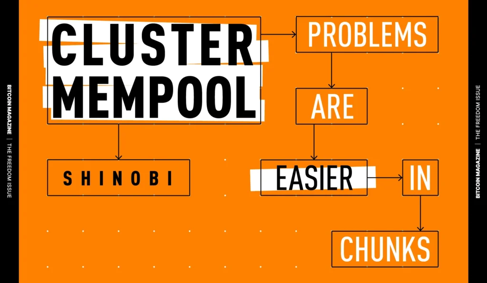
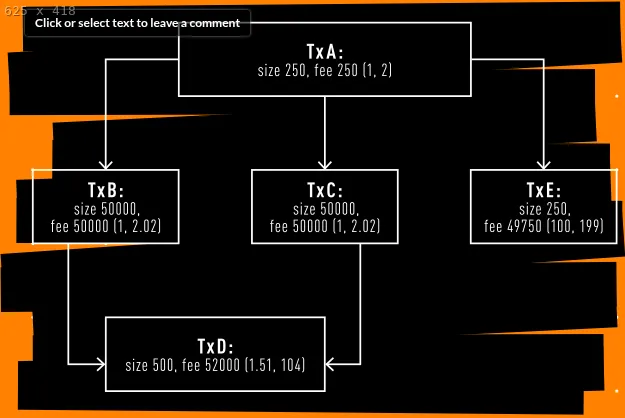
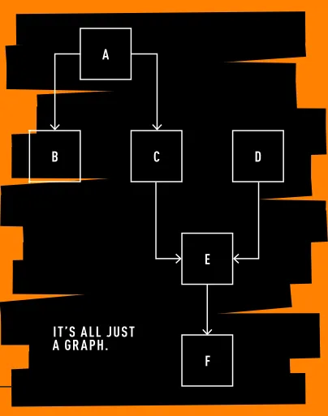
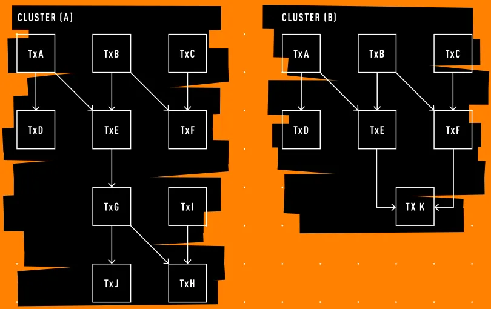

> *作者：Shinobi*
> 
> *来源：<https://bitcoinmagazine.com/print/the-core-issue-cluster-mempool-problems-are-easier-in-chunks>*

“族群交易池（**Cluster Mempool**）” <a href='#note1' id='jump-1-0'>1</a> 是对交易池管理和排序的交易的方式的完全重构，其概念和实现都由 Suhas Daftuar 和 Pieter Wuille 完成。族群交易池的设计目标是简化交易池的整体架构，让交易（在交易池内）的排序逻辑与矿工的激励机制更加一致，同时提升二层协议的安全性。它的实现已经于 2025 年 11 月 25 日在 PR #33629  <a href='#note2' id='jump-2-0'>2</a> 中合并到 `Bitcoin Core` 代码库。

交易池是待处理的交易的一个巨大的集合，出于一些理由，你的节点可能想要追踪这样的集合：估计手续费、验证交易的替代版本，以及构造区块（如果你是一个矿工的话）。

你的节点软件的这一个函数，要服务于许多不同的目标。在 30.0 版本以前，`Bitcoin Core` 以两种方式组织交易池、以协助实现这些目标，这两种方式都来自对任意一笔交易的相对视角：从这笔交易 “往前看”，它与它的子交易的合并手续费率（即所谓的 “后代费率（descendant feerate）”），以及，从这笔交易 “往后看”，它与它的双亲交易和合并手续费率（即所谓的“祖先费率（ancestor feerate）”）。

（译者注：比特币交易的费率通常以 “手续费/（虚拟）字节数” 来衡量。）

这些数值会被用来决定，当交易池满载时，要从中驱逐哪一笔交易；以及，在构造一个新的区块模板时，要先打包哪一笔交易。

## 交易池是如何管理的？

在一个矿工要决定要不要在自己的区块中打包某一笔交易时，TA 的节点会检查这笔交易，并且这笔交易的任何祖先交易都要先进入这个区块、这笔交易才是有效的，还要考虑它们的平均费率以及各交易支付的手续费。如果这组交易能够全部放进一个区块内，又在手续费上胜过其它交易，它们就会被放到下一个区块中。对每一笔交易，都是这样处理。

当你的节点在交易池满载时，要决定从中去除哪一笔交易时，它会检查每一笔交易及其拥有的任何子交易；如果交易池中的其它交易（及其后代）都支付更高的费率，那就删除这笔交易（及其子交易）。

但是，请看上面这个由交易构成的图案例，手续费率都在括号内标明（前面的是祖先费率，后面的是后代费率）。检查交易 E 的矿工，会可能会把它打包到下一个区块，因为这笔小体积的交易支付了非常高的手续费，而且只有一个小体积的祖先交易。但是，如果一个节点的交易池要满了，它会检查交易 A，这笔交易有两个大体积的子交易，都只支付了相对较少的手续费，所以可能会驱逐它，或者说，如果是刚刚收到它，则可能不接纳它进入交易池。

这两种评分，或者说排序，彼此之间是完全对立的。

可是，交易池应该可靠地广播矿工即将打包的交易，用户也应该获得信心：自己本地的交易池能准确地预测矿工即将打包什么。

让交易池以这种方式运作，有重要意义：

- 去中心化挖矿：让 *所有的* 矿工都能知晓最为有利可图的一组交易
- 用户可靠性：准确而可靠的手续费率估计，以及交易确认时延
- 二层协议安全性：可靠而准确地执行二层协议所需的链内结算交易

当前的交易池数据结构及其实现的动作，并不完全与矿工的激励机制一致， 这就带来了盲点，可能会给二层协议的安全性造成问题：一笔交易是否会传播给矿工，是不确定的；同时，这可能推着人们走向不公开的给矿工广播交易的信道，从而让前面这个问题进一步恶化。

在需要替换待确认的交易时，这个问题会更加突出，不管是简单为了激励矿工尽快确认一笔替换交易，还是为了让二层协议能在链内强制执行。

在现有的交易池动作下，替换的成功与否是无法预测的，完全取决于你的交易所形成的图的形状和大小。即使是简单的手续费追加情形，替代交易也可能无法传播，从而失败，即使打包替代交易对矿工来说能赚更多钱。

在二层协议的语境下，当前的处理逻辑可能允许参与者们让一笔必要的祖先交易从各节点的交易池中消失，或者让另一位参与者无法传播一笔必要的子交易到各节点的交易池，因为恶意参与者已经创建了一大堆子交易，或者成功让各节点驱逐了必要的祖先交易。

所有这些问题，都是这些不协调的打包和驱逐评分（以及它们所带来的激励不兼容）的结果。拥有一种单一的全局评分，就能修复这些问题；但是，每收到一笔交易就要全局重新排序整个交易池，也是不现实的。

## 都是图而已

互相依赖交易就是一个图，或者说一系列的有方向的 “路”。当一笔新交易要花费另一笔交易所创建的输出，它就链接到了旧的这笔交易。如果这笔交易又被另一笔新新交易花费，那这笔新新交易就跟前面的两笔交易链接在一起。

在还没确认的时候，想要确认这样的交易的链条，*必须* 先确认较早的交易，然后后续的交易才是有效的，否则，后续交易就是在花费还不存在的输出。

这是理解交易池的一个重要概念：它是有方向、显式排序的。

全部都是图而已。

## 分家组成族群，族群形成交易池

在族群交易池概念中，一个 “族群（**cluster**）”就是一组有方向地彼此关联的待确认交易，也即：族群中的一些交易会花费另一些交易所创建的输出。这就是新的交易池架构的一个基本单元。分析还排序整个交易池是个不现实的事情，但分析和排序族群，就是容易得多的事了。

每个族群都可以切分为 “分家（**chunk**）”，也就是来自族群的较小的交易集合；然后，这些分家会按手续费率由高到低排序（当然，要考虑上述的有方向依赖）。举个例子，在上图的族群 A 中，费率由高到低的分家分别是：[A,D] 、[B,E] 、[C,F] 、[G, J] ，最后是 [I, H] 。

这就允许所有这些分家和族群的预排序，然后实现整个交易池的更加高效的排序。

现在，矿工可以直接从每一个族群中挑出最高费率的分家，然后将它们放到区块模板中；如果区块模板还有空间，就寻找手续费率次高的分家，不断往复，直到区块大概满载，然后找出还能塞进去的少量交易。假设这个矿工知晓所有待打包的交易，上面这个过程得到的大致就是最优的区块模板。

当节点的交易池满载时，它可以直接从每一个分家中找出最低费率的分家，然后删除它们，直到剩余的交易池大小不超过用户配置好的限制。如果这还不够，那就继续寻找倒数第二低费率的分家、驱逐，不断往复，直至交易池大小回落到限制之下。这样做可以消除与矿工的激励机制不兼容的奇怪罕见情形。

交易替换的逻辑也因此大大简化。对比族群 A 和 B ：新的交易 K 替代了交易  G、I、J 和 H 。  唯一需要满足的条件是，新分家 [K] 的费率高于 [G, J] 和 [I, H] ，并且 [K] 要支付比 [G, J, I, H] 更高的手续费，并且 K 替换的交易不能太多。

在族群交易池范式中，交易池的不同应用场景是彼此兼容的。

## 新的交易池构造

这中新的架构，让我们可以简化交易群的限制、移除以往对一笔交易在交易池内的祖先交易的数量限制、代之以一个族群不能超过 64 笔交易、101 k 虚拟字节的统一限制。

这种限制是必要的，为了限制预先排序族群及其分家的计算开销，让节点能够持续运行。

这是族群交易池构造的真正关键洞见。通过确保分家和族群相对较小，你同时让最优区块模板的构造变得便宜、简化了交易替换逻辑（用于手续费追加），并且因此提高了二层协议的安全性、修复了驱逐逻辑。一石多鸟。

模板构造的实时计算不再昂贵而缓慢，手续费追加的结果也不再不可预测。通过修复交易池在不同场景下管理和排序交易的方式之间的激励不兼容，交易池对每个人都变得更有用了。

族群交易池是一个历经多年才开发出来的项目，并且，它会带来实质性的影响：确保有利可图的区块目标向所有矿工开放、可靠且可预测的交易池动作让二层网络协议可以利用、比特币继续是一种去中心化的货币系统。

如果您有兴趣了解族群交易池的实现细节以及工作原理，这里推荐两篇 Delving Bitcoin 论坛帖子：

- 族群交易池的实现概述（以及设计哲学）：https://delvingbitcoin.org/t/an-overview-of-the-cluster-mempool-proposal/393 （[中文译本](https://www.btcstudy.org/2024/01/16/an-overview-of-the-cluster-mempool-proposal/)）
- 族群交易池费率模式如何工作：https://delvingbitcoin.org/t/mempool-incentive-compatibility/553

（完）

## 参考文献

1.https://github.com/bitcoin/bitcoin/issues/27677 <a href='#jump-1-0'>↩</a>

2.https://github.com/bitcoin/bitcoin/pull/33629 <a href='#jump-2-0'>↩</a>