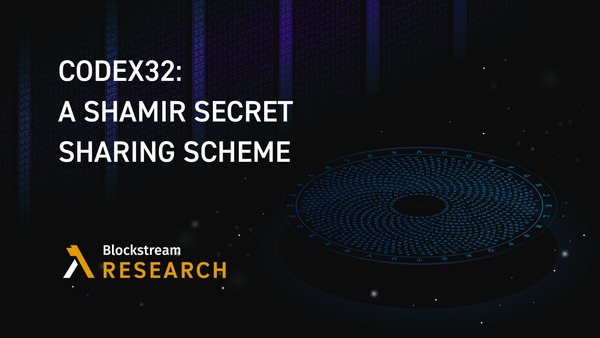
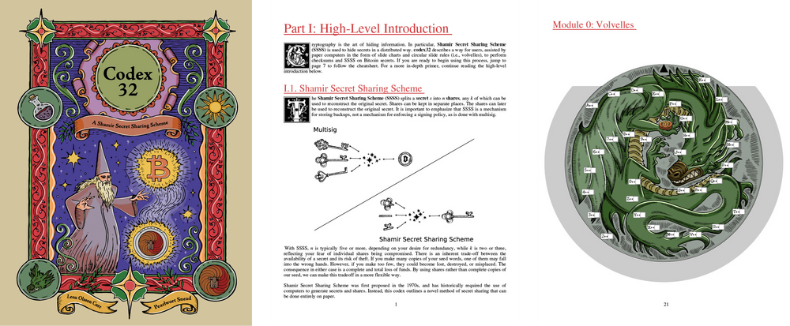

> *作者：Andrew Poelstra*
> 
> *来源：<https://blog.blockstream.com/codex32-a-shamir-secret-sharing-scheme/>*

自 2020 年以来，除了 Blocstream Research，我一直在设想无需电子计算机的密码学。这不算什么新想法：20 世纪以前的密码学都是这样的。但 *现代* 密码学，用到的是几百位的数字和复杂的算法，总是要用到计算机。而且确实有理由这么做：计算机可以在十亿分之一秒内完成人类需要几分钟才能完成的运算。

十亿倍的降速，只是手算密码系统（hand-coumputable cryptosystem）的最微不足道的问题。人类不仅仅不擅长计算，而且他们能同时记住的精确指令的数量也是有限的，而且在阅读这些指令的时候，他们的耐心也是有限的，最后，他们还在长时间执行这样的单调乏味的计算。人类也常常犯错误，即使之前已经成功过许多次，也难保下一次不会犯错误。

但事实证明，抛开保管秘密数据的复杂性，我们依然可以在工作表和一些可以打印、剪裁的简单工具的帮助下，手动运行许多操作。

今天，我们推出了一本小册子《[Codex32：一种 Shamir 私钥分割方案](https://store.blockstream.com/product/codex32-shamir-secret-sharing-scheme-book/?ref=blog.blockstream.com)》，你可以在 Blocksteam 商店里买到。Codex32 包含了用于[检查校验和](https://glossary.blockstream.com/checksum/?ref=blog.blockstream.com)以及私钥分割的工作表（可以撕下来）、可以裁剪和组装的纸上计算机、用来消除骰子的滚动误差的工作表，以及由 Micaela Paez 和 M. Lufti' As'ad 创作的精美图画。

我们会介绍 codex 是怎么工作的，但首先，我们先来解答一个可能从你阅读本文的第一眼开始就萦绕你心头的问题：*为什么要有手算的系统呢？*

- Codex32 背后的假设是，你会用它来生成、检查和分割一个 <a href="https://github.com/bitcoin/bips/blob/master/bip-0032.mediawiki?ref=blog.blockstream.com">BIP32</a> 种子词，从这个种子词你就可以推导出比特币地址。 -

## 为什么要手算？

电子计算机当然非常神奇。它们计算起来比人类快得多，而且不会犯错，它不知疲绝，也不会感到无聊。但超人一般的速度，也意味着人类实际上无法检查它们的活动。

这可不单是一个哲学问题。这就是为什么我们要有一个价值几十亿美元的赛博安全行业，以及开源软件运动。这也是为什么安全研究员坚持要让投票机产生可以手动统计的纸质记录。计算机可能会感染恶意软件，或者代码本身就是恶意的；计算机也会因为侧信道或者失败删除而泄露秘密数据，而且也有可能出 bug。这些问题在软件上的难以解决的，但硬件上也会有同样的问题，如果验证需要复杂的工具和专业知识的话。而且，就像《[The Age of Surveillance Capitalism](https://bookshop.org/p/books/the-age-of-surveillance-capitalism-the-fight-for-a-human-future-at-the-new-frontier-of-power-shoshana-zuboff/9240225?ean=9781541758001&source=IndieBound&title=The+Age+of+Surveillance+Capitalism%3A+The+Fight+for+a+Human+Future+at+the+New+Frontier+of+Power)》一书所说的，即使是 “正确工作” 的计算机，也很有可能是在作不利于用户的事。

每次你替换硬件或者更新软件的时候，这些烦恼都要重头再来一遍。（假如你不更新自己的软件，则这些担心就会无限制地增长。）升级也将兼容性置于风险之中，可能会让你的数据再以无法访问。

在日常生活中，我们基本上都接受，这是走向一个电子化社会的一部分代价，但放到控制着不记名资产（比如比特币）的私钥上，这个代价就太大了。

通过使用纸和笔来计算，我们可以保证，秘密数据不会出现在我们没有写过的地方。我们可以用透明的方式创建属于自己的随机数据。我们也可以选择每一步要花多长时间，从而迷惑 “计时攻击（timing attacks）”。我们可以确信，只要我们的指令是写在 *某个地方* 的（也可以是打印出来的），并存放在一个安全的地方，那么我们的流程就会被保持兼容性。而且这些保证不仅是真实的，还是 *可感* 真实的，可以给我们一种电子计算机永远无法提供的心灵的宁静。

## 脑钱包和纸钱包

这些想法可能会让一些读者想起一些常常在 BitcoinTalk 论坛上被人提起的老想法。比如，“纸钱包”，就是用户把一个种子词（或者私钥）写在一张纸上，并且离线存储。Cryptosteels 和 ColdTi 这样的金属助记词板是这样的想法的自然延伸，它们比纸更有可能在自然灾害和洪水泛滥中保存下来。

离线存储种子词是一个好想法，可以提高你的比特币储备的安全性。建议使用某种[金属](https://store.blockstream.com/product/blockstream-capsule/?ref=blog.blockstream.com)助记词板，虽然无酸纸在干燥、防火的地方也可以用。但在使用这种存储方式的时候，需要在创建更多副本（因此面临更高的失盗风险）和更少副本（面临更高的丢失风险）之间取舍。而 codex 给了用户更大的取舍空间，因为用户可以将自己的秘密数据分割成多个 “碎片”，当且仅当凑够一定数量的碎片，就足以复原秘密数据。

另一个来自相同领域的想法是 “脑钱包”，指的是用户直接记住自己的秘密数据，而不使用实体备份。我们 *强烈* 不支持这样做。这种办法的一个问题在于，它会促使用户选择较弱的种子词：太短的、高度结构化的、甚至是在印刷文本中存在的东西。即使这样的种子词可以用多种方式调整和改造，可能依然不具有足够多的信息来抵御拥有大量计算能力的攻击者。最早的一种比特币骗局就是一个 “帮助” 用户生成这样的弱种子词、使用脑钱包的网站。

终极问题是，人类很难记住具有良好随机性的数据。这种因素使得容易记忆的俗语、诗歌片段和[短故事](https://old.reddit.com/r/Bitcoin/comments/1ptuf3/brain_wallet_disaster/?ref=blog.blockstream.com)同样也让攻击者更容易猜到你的数据。

脑钱包的第二个问题在于，人类的记忆是脆弱的。你很容易自我说服，认为自己是那种永远不会失忆的高智商的人。但智商在你撞到头、发烧、经历创伤，乃至几年之后失去回忆往事的动力时，没有任何帮助。

生成种子词的正确方式就是产生至少 128 比特的均匀随机数据，而正确的存储方式就是不要放在脑子里。Codex 提供了一种通过摇骰子并使用 “[冯·诺伊曼抽取器](https://en.wikipedia.org/wiki/Randomness_extractor?ref=blog.blockstream.com#Von_Neumann_extractor)” 来[消除误差](https://arstechnica.com/gaming/2016/08/how-fair-is-your-d20/?ref=blog.blockstream.com)、生成随机数据的例子。还有别的方式可以从骰子中获得良好的种子，通常叫做 “[*diceware*](https://glossary.blockstream.com/diceware/?ref=blog.blockstream.com)”。

## 手算到底能做些什么事情？

有了这些背景知识，我们说说用户可能想对自己的助记词备份做的一些操作。

- 验证备份的完整性。
- 验证这个备份所控制的资金没有被移动。
- （假设是私钥分割的备份）重新分割备份。
- 复原或者从备份中产生一个新钱包。

一些用户可能想跳过这些关于 “新钱包” 的部分，直接在纸上做所有事情。但不幸的是，[当前没有任何办法](https://bitcoin.stackexchange.com/questions/118933/how-can-i-manually-on-paper-calculate-a-bitcoin-public-key-from-a-private-key/118939?ref=blog.blockstream.com#118939)，可以不需要使用电子设备就能推导出地址或签名交易。但上面这些事，我们是可以做到的。

**验证备份的完整性**。用来长期储存秘密数据的媒介可能会损坏，或者磨损，以至于变得无法阅读。有一种机制可以监测和修复少量的独立错误，叫做 “*错误纠正码*” 或者 “*校验和*”。Codex 提供了工作表，让用户可以创建并验证自己的数据的校验和。如果检验和通过，那么说明一切都完好无损。如果不通过，就说明你在某处犯了一个错误。创建一个校验和需要花费 30 ~ 60 分钟，而且需要做两次，以捕获第一次可能犯下的错误。验证校验和需要花费相同的时间，但只需做一次。

**验证资金未被移动**。没有离线的备份能够检查区块链的状态。相反，我们要使用一个在线的 *仅供观察* 钱包，来监控区块链、发现你的资金的任何移动，但这不需要访问你的秘密数据。

**分割和重新分割备份**。这是 codex32 最有趣也最强大的部分。 codex 提供了工具，可以将一个秘密值分割成多个 “碎片”，只要凑够一定数量的碎片就可以恢复出这个秘密值。标准的门限值是 2-of-3（即分割成 3 份，只要获得其中 2 份就能复原私钥）。只要攻击者得到的碎片数量少于门限值，他们就无法得到这个秘密值。

使用 codex32 的过程是，用户先生成门限数量的随机初始化碎片，然后使用这些碎片，按需推导出额外的碎片，最多可达 31 个。日后，只要得到了足够多的碎片，就可以重构秘密值。

推导的过程保证了，只要你的初始化碎片的校验和有效，那么推导出来的碎片和最终的秘密值也具备有效的校验和。这意味着你可以创建自己的初始化碎片、计算它们的校验和、推导出额外的碎片、验证额外碎片的校验和 —— 不论你在这个乏味过程的哪一步犯了错误，校验和工作表都可以帮你检查出来。

每一个输入碎片需要花费 5 到 10 分钟才能推导出额外碎片，最终的校验和检查需要花费 30 到 60 分钟。

**复原或初始化一个新钱包**。钱包可以取得 codex32 碎片来初始化。这个过程跟现在使用种子词的工作流是完全一样的。

现在，有一个公开的 PR 希望在 Bitcoin Core 里支持 codex32，而 [Bails](https://github.com/BenWestgate/Bails?ref=blog.blockstream.com) 项目所用的 Core 软件已经吸收了这个 PR。多个其它钱包也表示它们希望最终支持 codex32，包括 Blockstream Green、Anchorwatch 和 Liana。这样的支持的技术难度，跟 2016 年支持隔离见证地址的难度相当，有些地方更加简单，因为 codex32 复用了许多相同的逻辑。

## 下一步呢？

Codex32 的下一步是提升钱包的支持。这意味着要优化和打磨 [rust-codex32](https://github.com/apoelstra/rust-codex32?ref=blog.blockstream.com) 代码库，并在 [BDK](https://github.com/bitcoindevkit/bdk/?ref=blog.blockstream.com) 中添加支持。

我们也希望实现纠错逻辑并扩展 [codex32 网站](https://www.secretcodex32.com/?ref=blog.blockstream.com)以支持它，并增加更多的交互功能。当前的纠错功能需要计算机。但至少，对单个的错误，我们希望用查找表实现手动纠错。

Codex 拥有分割秘密值和检查校验和的指令。但它没有为下一步提供足够多的指引：将碎片分给你信任的人，并开发一种方案让他们校验完整性。

我们想建议用户每年都校验自己的碎片，但当前的流程实行起来有点痛苦：你需要重新写出指令，可能要组装一个新的纸上计算机，然后在验证上花费 30 ~ 60 分钟。而且，如果哪里出错了，在缺乏纠错表的时候，你需要从头再来。所以，这是一个不切实际的建议。

但是，我们也想出了一个解决方案：一种不完全的校验和检查  [quickchecks](https://lists.linuxfoundation.org/pipermail/bitcoin-dev/2023-February/021502.html?ref=blog.blockstream.com)（快速检查），但依然可以检测出 99.9% 的错误，而且可以（跟指令、检查表，等等）组合在一张纸上。7 次 qiuckchecks 就相当于一次完整的检验和检查。用户可以保存自己的全套碎片的许多副本，然后每年翻到下一页，按照指令填满它（只需 10 ~ 15 分钟，不需要 30 ~ 60 分钟），然后就毁掉它。

现在，快速检查仅仅存在于数学种。我们还需要位置创建工作表、调整参数，并形成指令。

上述计划离不开一些力气活，但对未来的研究，我们有一些伟大的的立法。对给定的一个种子词，有无可能通过计算哈希值来推导出额外的碎片，就像 BIP 32 那样？有无可能执行一种椭圆曲线惩罚，从而允许推导出地址和签名交易？有无可能实现加密或者握手协议？截至目前，我们都还没有答案。

（完）

