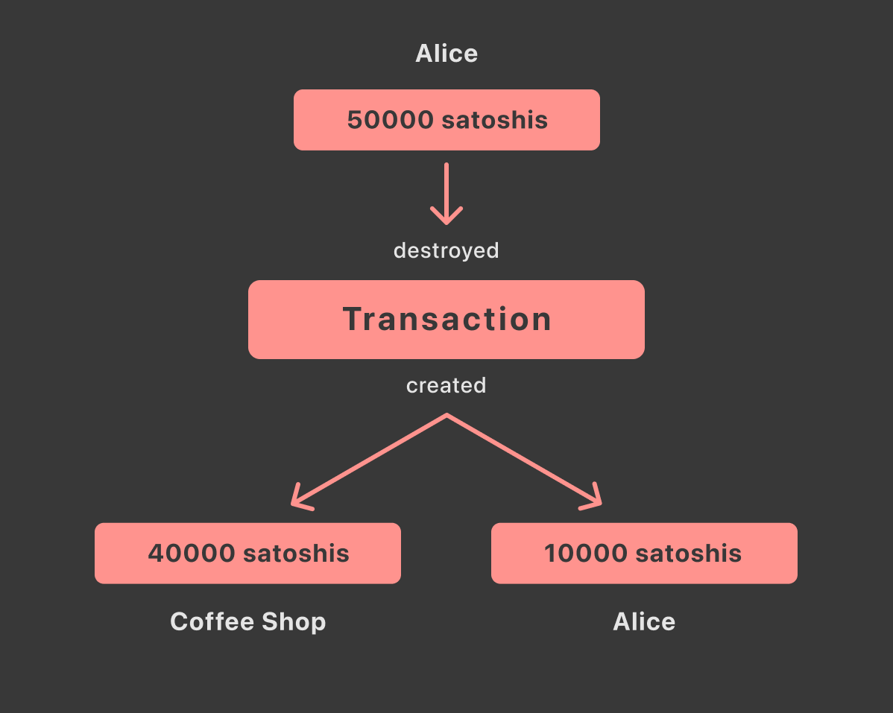

> *作者：Anmol Sharma*
> 
> *来源：<https://blog.summerofbitcoin.org/coin-selection-part-1/>*

本文为 *选币算法科普* 系列的第一篇。

## 什么是 “UTXO”？

UTXO 全称为 “Unspent Transaction Output（未花费的交易输出）”，是对 “一块比特币” 的技术描述。比特币被开发成类似现金的东西，所以 UTXO 就像用户用来购买商品和服务的硬币。

用更准确的技术词语来表述，一个 UTXO 是某一笔交易的其中一个结果。每一笔比特币交易都有一些**输入**（被花费或者说被 “**摧毁**” 的硬币）和一些输出（被 “**创建**” 出来的新的硬币）。

举个例子，设想你的钱包丽有一个硬币（**UTXO**），面值为 5 万聪，而你想要买一杯价值 4 万聪的咖啡。你需要创建一笔交易，给咖啡店老板支付 4 万聪，然后给你自己支付 1 万聪（作为零钱）。所以，这笔交易会取得一个 UTXO，花费它（**摧毁它**），然后创建出两个新的 UTXO。在这笔交易得到比特币区块链的确认之后，你的钱包将仅余一个面额为 1 万聪的硬币（**UTXO**）。

- 注意：在一笔交易中，被摧毁的 UTXO 的总价值必须超过或等于被创建的 UTXO 的总价值 -

## 什么是 “选币算法”？

选币算法指的是在发起一笔链上比特币支付时，选出 UTXO（或者说 *硬币*）作为输入的决定过程。

比特币钱包管理着用户的私钥。因此，钱包可以将私钥与其对应的 UTXO 相关联，形成一个 UTXO 池。一个 UTXO 池由其用户可以花费的所有 UTXO（硬币）组成。

选币算法是支付流程的重要部分。没有选币算法，用户就无法选出最合适的 UTXO，最终只能在一笔交易中使用所有的 UTXO，然后产生一个很大的 “零钱” 输出，并支付不必要的交易手续费。

## 选币算法的目标

选币算法是为经济性、速度和隐私性而优化比特币支付的重要流程。选币算法尝试实现如下一些目标：

### 确认时间

因为区块空间是稀缺资源，矿工会在手续费率（聪/字节）基础上选择进入区块的交易，以最大化自己的收益。更高的手续费将提高交易被打包到下一个区块中的概率，因此可以更快确认。

### 交易手续费

用户也希望手续费代价尽可能低、交易刚好能进入区块就行。好的选币算法不仅要为当前的交易节省手续费，还应该考虑到长期的交易手续费。它应该趁着交易费率较低时花费更多的 UTXO 。

### 隐私性

因为比特币区块链是一个公开的分布式账本，每个人都可以看到得到区块链确认的每一笔交易。有时候，这种模式会导致对金融隐私的侵犯。数据矿工和第三方观察者不应该能够获得用户的数据（比如总余额及其经济活动）。好的选币算法应该使用尽可能少的地址。

### 粉尘输出

因为比特币是一个点对点的分不出网络，每个节点都必须维护一个 UTXO 集（包括所有人的 UTXO）。如果交易的输入数量能大于输出的数量，那就更好了。这意味着长期来看 UTXO 集的大小会缩减。随着比特币得到更多采用，跟踪 UTXO 集的大小非常重要。

###  相互冲突的目标

上面提到的一些目标是有冲突的。例如，像尽可能少给交易费，又想让交易尽快确认，就是天方夜谭。一般来说，支付更多手续费才能缩短确认时间。因此，重要的是在这些目标之间找出平衡点。

## 著名的选币算法

以下是一些著名的选币算法：

- 老币优先（FIFO），也叫 “先修剪老币”（用在一些轻量级的手机钱包软件中）：按确认次数的降序选择 UTXO。
- 新币优先（LIFO）：按确认次数的升序选择 UTXO。
- 纯随机选取（用于 Bitcoin Core）：在所有可用的 UTXO 中按平等的机会选择 UTXO。
- 分支界定法（用于 Bitcoin Core）：先按深度搜索 UTXO，然后选择最少浪费 —— 最大程度避免产生找零 —— 的输入集合
- Knapsack（用于 Bitcoin Core）：按面额排列所有的 UTXO，运行 1000 轮的随机选择，每次以 50% 的概率选择最大的或者最小的
- Greedy（贪婪算法，从面额最小的开始选，或从面额最大的开始选，用在一些轻量级的手机钱包软件中）：按面额的升序或者降序选择 UTXO

## 概述 Bitcoin Core 的选币算法

当前的 Bitcoin Core 使用三种算法：分支界定法、Knapsack 和纯随机选取。这些算法的结果会基于 “**浪费指标**” 来对比，最终选出产生最少浪费的输入集。

### 好处

- 通常可以靠某一种算法来的避免找零
- 从长期来看，可以在低手续费时将花费更多输入，在高手续费时花费更少输入，从而降低整体的手续费
- 很难找出用户花费的模式，尤其是使用了纯随机选取的情况下

### 缺点

- 实现和测试都非常复杂
- 计算密集

### 什么是 “浪费指标”？

“浪费指标” 是 Bitcoin Core 的钱包所用的、对比不同的可能输入集合并选出可以产生最小浪费分数的启发式方法。通常一笔交易都会有多种可行的输入集，浪费指标会基于手续费率、产生找零输出的成本和可选的余量（excess selection amount）选出最理想的输入集。（深入讲解请见本系列文章的 Part-5）。

在下一篇文章中，我们会深入讲解[分支界定选币算法](https://blog.summerofbitcoin.org/coin-selection-for-dummies-2/)的机制。

（完）