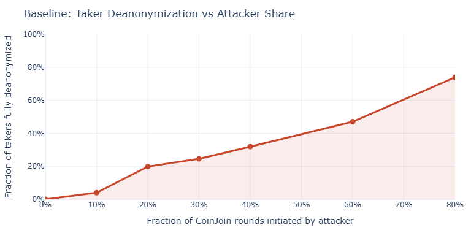
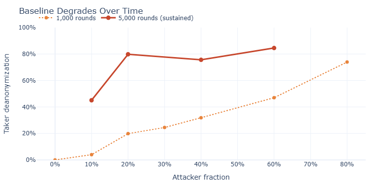
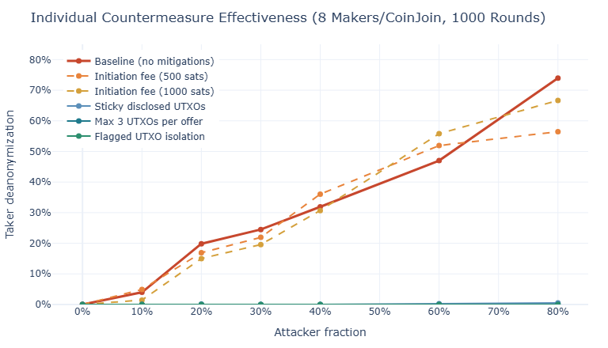
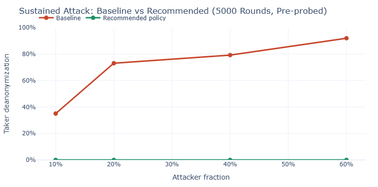
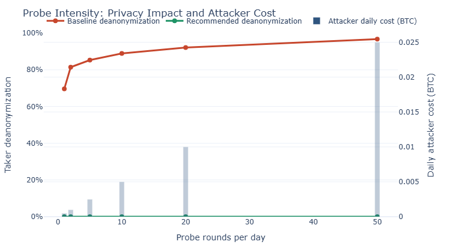
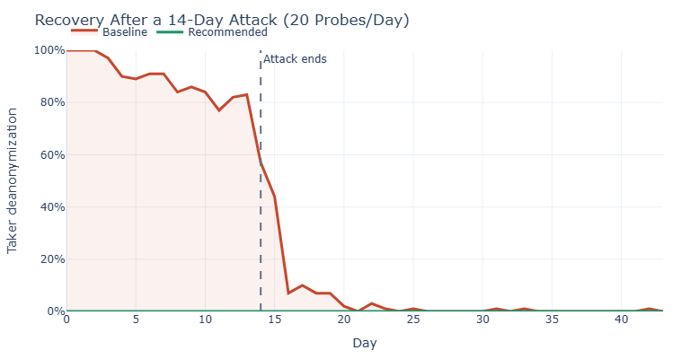

> *作者： m0wer*
>
> *来源：<https://joinmarket-ng.github.io/coinjoin-simulator/>*
>
> *模拟结果生成于 2026 年 4 月 12 日*

## 1. 问题： CoinJoin 中的隐私性

“**CoinJoin**” 是一种合作式的比特币交易，多个参与者将他们的输入和输出合并在一笔交易中。只要处理得当，外部观察者将无法确定哪个输入（的资金）流入了哪个输出，这就提供了 “**交易隐私性**”。

在 JoinMarket 式的 CoinJoin 中，有两个角色：

**挂单人（maker）**是永远在线的机器人，在一个公开的订单簿上广告自己的要价（offer）。每一个挂单人都有一个钱包，切分成多条 “*混淆路径* ”（就是独立的账户，通常是 5 个）。他们在这些混淆路径上分散资金，通过参与 CoinJoin 来赚取手续费。根据他们的 “*忠诚保证金* ” 数量，挂单人会被赋予一定的权重 —— 这是带有时间锁的比特币存款，用来证明他们的投入，并让分身攻击（Sybil attacks）成本更高。

**吃单人（taker）**是发起 CoinJoin 交易的人。他们从订单簿中挑选挂单人、对 CoinJoin 的数额达成一致，然后合作构造交易。吃单人的目标是获得隐私性：在 CoinJoin 之后，他们的输出将跟挂单人的输出无法区分。

一笔有 N 个挂单人的 CoinJoin 交易的**匿名性集合**的大小是 *(N+1)*：观察者将无法辨别出这 N+1 个等面值的输出中，哪一个才属于吃担任。一笔 8 个挂单人参与的 CoinJoin 交易的匿名性集合大小是 9 。

这对于被动的观察者来说，显然成立。但如果是**主动的攻击者**呢？

## 2. 侦测攻击原理

“侦测攻击（probing attack）”利用了 CoinJoin 的协商协议。在一笔 CoinJoin 交易得到签名和广播之前，挂单人必须将自己的输入 UTXO 暴露给吃单人。通常来说，这没什么问题，因为吃单人是诚实的，只是想完成交易。但是**恶意的吃单人**可以利用这个机制：

1. **打探**：攻击者可以跟一个 挂单人发起一个 CoinJoin 邀请，并要求这个挂单人提供尽可能多的资金。那么，这个挂单人就会揭晓自己包含最多金额的混淆路径上的所有 UTXO 。攻击者可以记录下这些信息，然后**放弃**交易。
2. **积累**：攻击者可以跟每一位挂单人重复这种把戏，从而建立其一个关于 *每个挂单人已知 UTXO* 的数据库。
3. **识别**：当一个诚实的吃单人创建一笔 CoinJoin 交易时，攻击者就可以观察出现在区块链上的交易。只要任何一个输入与其已知的一个 UTXO 已知，攻击者就能**识别**出对应的挂单人。
4. **雪崩**：当一个挂单人被识别出来，攻击者同时也就知道了他们的 *同时花费的输入*（该挂单人为交易提供的其它 UTXO），以及他们的 *找零输出*。这些新的 UTXO 也会被添加都数据库，参与对未来 CoinJoin 交易的进一步识别。攻击者的知识会**滚雪球**一样越滚越大。
5. **消除匿名**：只要攻击者可以识别出一笔 CoinJoin 交易中的所有 N 个挂单人，那么剩下的输出就一定属于吃单人。匿名性集合的大小从 N+1 变成了 1 。也就是说，这个吃单人被**完全消除了匿名**。（译者注：严格来说，是这笔 CoinJoin 交易就完全失去匿名化效果了。）

### 现有的保护措施及其局限性。

JoinMarket 已经安排了一种针对打探的保护措施：**PoDLE**（离散对数相等证据）。为了发起一个 CoinJoin 回合，吃单人必须先承诺自己有一个真实的 UTXO ，其价值要大于所请求的 CoinJoin 金额的 20% 。每一个 UTXO 只能用在最多 3 个 PoDLE 承诺中（以允许诚实参与者犯错）。挂单人会将用过的承诺广播给所有人，作为一种黑名单机制。

**问题是**：PoDLE 只能对付偶然的滥用，但一个资源丰富的攻击者可以 —— 在黑名单传播开来之前 —— 同时打探所有挂单人。每一个挂单人都将因为自己承诺可以提供的最大金额而揭晓尽可能多的 UTXO 。攻击者确实用掉了一些 PoDLE 承诺，但回报是，他们得到了每一个挂单人的最大混淆路径的完整快照。我们要模拟的就是这种攻击情形。

## 3. 基准线：有多糟糕？

如果没有 PoDLE 以外的对抗措施，CoinJoin 协议在侦测攻击面前是非常脆弱的。我们模拟了有 100 个挂单人的网络，并根据 JoinMarket 订单簿地实时采样来假设他们地钱包结构。

哪怕攻击者发起的 CoinJoin 回合只占少许比例，也会有大量吃单人被完全消除匿名。如果攻击者的提议占 20%（每 5 个 CoinJoin 回合中就有 1 个是侦测攻击），那么大约 **20% 的吃单人会失去所有隐私性**。如果侦测攻击占到了 40%，就会有 32% 的吃单人失去隐私性。

而且情况会逐渐恶化。因为每一次识别都会揭晓更多 UTXO（雪崩效应），攻击者的数据在每一笔诚实的 CoinJoin 交易完成后也会增长。如果 CoinJoin 回合数量超过 5,000 个，哪怕只有 10% 是侦测攻击，也会产生 **45% 的消除匿名效果**（如果 CoinJoin 回个只有 1,000 个，那么消除匿名效果只有 4%）。这是长期存在的稳态风险。

## 4. 对抗措施

我们检验了六种对抗措施。每一种都针对侦测攻击的不同方面：限制信息泄露、打破链上身份识别，或者提高攻击者的成本。

### 4.1 限制为订单揭晓的 UTXO 数量

**措施**：限制一个挂单人在回应一个 CoinJoin 请求时揭晓的 UTXO 数量。因此，挂单人不会再揭晓自己的最大混淆路径中的全部 UTXO（可能有 5 到 10 个，甚至更多），只会揭晓价值最大的 *N* 个。

**对抗性**：攻击者从每次打探中知道的 UTXO 更少。当最大限量是 3 时，挂单人绝大部分的 UTXO 将保持隐秘，从而让未来的 CoinJoin 交易识别更难命中。

### 4.2 隔离有标记的 UTXO

**措施**：在失败的 CoinJoin 回合（可能是侦测）中已经披露过的 UTXO 会被打上 *标记*。 当一个带有标记的 UTXO 作为输入出现在后续的 CoinJoin 交易中时，其主人**不会**以挂单人身份参与这笔交易。这个标记也会传播到从该输入 UTXO 产生的找零输出中。

**对抗性**：它从根本上打破了链上身份识别。即使攻击者知道一个 UTXO 属于某个挂单人，只要这种知识是从打探中知道的，那它就被污染了，无法用于身份识别。只有从别的渠道（比如通过别的方法识别出挂单人）知晓的 UTXO 才有用。

### 4.3 粘性披露 UTXO

**措施**：在一次打探（失败的 CoinJoin 回合）之后，挂单人要记住哪个 UTXO 公开过了。在后续的 CoinJoin 回合（可能是打探）中，挂单人要重新挂单 *同样的 UTXO*，而不是揭晓新的 UTXO 。这个粘性集合要在这些 UTXO 在成功的 CoinJoin 回合中花费之后才情况。

**对抗性**：重复打探同一个挂单人不会得到新的信息。攻击者无法通过多次打探同一个挂单人获得更多信息。

### 4.4 诚意金

**措施**：在一次 CoinJoin 回合开始时，每个挂单人都收取一份手续费（数额在聪级别），不论交易能否完成都要支付。诚实和恶意的吃单人都会承担这种费用。

**对抗性**：这让打探变得更昂贵。如果每个挂单人收取 500 聪，有 100 个挂单人，那么一次打探就要花费 50,000 聪。一天打探 10 轮，就要花掉 0.005 BTC 了。不过，这是纯粹从经济上劝阻，不会**减少信息泄露**。

### 4.5 合并算法（渐近式）

**措施**：控制挂单人在参与 CoinJoin 时如何挑选输入。这种 *渐进式* 算法会选出满足数额的最少数量的 UTXO，然后加入一个小额的 UTXO 以逐渐归集钱包中的 UTXO 。默认的算法使用贪婪的大额优先逻辑，没有额外属性。

**对抗性**：更少输入意味着更少信息被泄露给任何观察者（也包括攻击者），即使一个挂单人被其它手段识别出来。

### 4.6 披露输入的策略（适应式）

**措施**：挂单人跟踪自己的已经披露的 UTXO（可能已被攻击者看过）。这种 *适应式* 策略会根据积压率动态决定花费已经曝光的 UTXO 还是还未曝光的 UTXO 。当许多 UTXO 都已曝光，这个挂单人会更加激进地参与 CoinJoin，以产生新的输出。

**对抗性**：这将加速已经曝光的 UTXO 的流转，同时保留干净的 UTXO 用于正常用途。

### 单项有效性

下图展示了每一项对抗措施单独对抗侦测攻击的影响，测试环境为每个 CoinJoin 8 个 挂单人，运行 1,000 回合：

| 对抗措施                   | 对去匿名化的影响                                             | 机制                   |
| :------------------------- | :----------------------------------------------------------- | :--------------------- |
| 每次要价最多披露 3 个 UTXO | 消灭了去匿名化                                               | 限制每轮打探得到的信息 |
| 隔离带有标记的 UTXO        | 消灭了去匿名化                                               | 阻碍来自侦测的身份识别 |
| 粘性披露 UTXO              | 几乎消除了去匿名化（在打探占比达 80% 时，去匿名化成功率小于 0.5% ） | 防止重复打探获得增益   |
| 诚意金（500 聪）           | 没有减少去匿名化                                             | 经济成本               |
| 诚意金（1000 聪）          | 没有减少去匿名化                                             | 经济成本               |

三种对抗措施各自都消灭或几乎消灭了去匿名化：限制披露 UTXO 的数量、隔离带有标记的 UTXO，以及粘性披露 UTXO 。诚意金是重要的经济阻遏措施，但自身不足以减少去匿名化。

## 5. 推荐的策略

与其依赖于某一个单项措施，不如合并起来产生深度防御。推荐的配置如下：

| 参数                         | 数值       | 目的                               |
| :--------------------------- | :--------- | :--------------------------------- |
| `每次要价最多披露 UTXO 个数` | `3`        | 限制每轮打探得到的信息             |
| `粘性披露 UTXO`              | `true`     | 防止重复打探获得增益               |
| `隔离带有标记的 UTXO`        | `true`     | 阻碍来自侦测的身份识别             |
| `诚意金`                     | `500`      | 经济劝阻                           |
| `合并算法`                   | `gradual`  | 尽可能减少每轮 CoinJoin 的输入曝光 |
| `披露输入的策略`             | `adaptive` | 高效循环已经曝光的 UTXO            |
| `每轮 CoinJoin 的挂单人数量` | `8`        | 更大的匿名集                       |
| `混淆深度数量`               | `5`        | 钱包分层                           |

### 可持续的抵抗措施

我们在最严酷的条件下测试了上述策略的效果：5,000 回合的 CoinJoin，有一个预先打探过的攻击者（每个挂单人在第一次诚实的 CoinJoin 之前都被打探过，以模拟前述的同步快照攻击）。结果是，不论打探占据了多少比重（从 10% 到 60%），都**没有打破吃单人匿名**。

基准测试时，侦测攻击占比 40% 就可以将 79.2% 的吃单人去匿名化；而在推荐的策略下，去匿名化效果为 0.0% 。

## 6. 攻击经济学

即便攻击者愿意为打探花费比特币，诚意金和限制信息泄露的组合，让攻击者颗粒无收。下图展示了在为期14 天的时间里，攻击的强度对去匿名化和攻击者成本的影响：

在基准测试中，哪怕每天只打探一次，也能实现 70% 的去匿名化。将频率提高到每天 50 次，效果将是 97%，成本为 0.025 BTC 每天。而在推荐的策略下，攻击者不论花费了多少钱，都**无法实现去匿名化效果**。

**光靠诚意金本身是不够的**。即便每个挂单人收取 1,000 聪，攻击者依然可以在侦测攻击占比 80% 时，实现大约  56% 的去匿名化效果。成本会增加，但无法解决基本的信息泄露问题。真正的防御还是要限制攻击者获得信息。

## 7. 从攻击中复原

攻击结束之后，会怎么样？随着诚实 CoinJoin 出现， 挂单人会生成攻击者所不知道的新的 UTXO 。攻击者的数据库将变得过时、身份识别率也会下降。

在为期 14 天、每天 20 次侦测的攻击之后，基准情形要在一周之后才能复原（去匿名化率下降到 5%）。而推荐的策略则从未受到影响：去匿名化率一直都是 0% 。

## 8. 总结

1. **针对 CoinJoin 的侦测攻击是一项真实的隐私性威胁**：没有对抗措施，一个只有少量资源的攻击者就可以根据从站的中获得的信息，去匿名化绝大部分诚实的吃单人。
2. **三种对抗措施单独都是有效的**：限制每次披露的 UTXO 数量、隔离带有标签的 UTXO、粘性披露，每一项自身都足以完全防御去匿名化。它们的有效性在于限制或污染攻击者收集到的信息。
3. **诚意金是必要的，但不足够**：它能提高攻击者的成本，但不会阻止信息泄露，因此也无法防止去匿名化。诚意金与限制信息泄露的措施互补。
4. **建议的策略结合了所有防御措施**：它实现了完全防止去匿名化，甚至在持续的、预先打探、高密度的攻击者也安然无恙。这种防御在所有测试场景下都表现良好。
5. **没有对抗措施，复原会更慢**：在为期两周的攻击结束后，基准情形需要超过 12 天才能恢复。而在推荐的策略下，根本无需恢复。

模拟的原始数据：[github.com/m0wer/coinjoin-simulator](https://github.com/m0wer/coinjoin-simulator) 

收集的数据集：[publish_summary.json](https://joinmarket-ng.github.io/coinjoin-simulator/publish_summary.json) 

生成于 2026-04-12