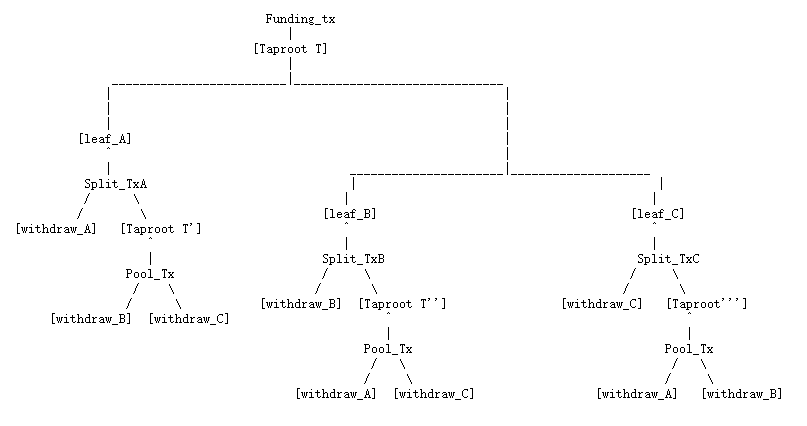

> *作者：Antoine Riard and Gleb Naumenk*
>
> *来源：<https://discrete-blog.github.io/coinpool/>*
>
> *原文发表于 2020 年 6 月。*

我们相信，普通的比特币用户最终也会用上许多的二层协议（闪电网络、金库、继承，等等）。我们有志于发现并解决这些协议的独特指纹，并解决其中的隐私问题。

更具体来说，我们的兴趣是回答下列问题：

1. 二层协议的链上交易会泄露多少隐私？有多少是因为协议定义的元数据（闪电网络域名、瞭望塔，等等）而泄露的？
2. 如何建立比特币指纹及其严重性的清单、提醒协议设计者并厘清威胁模型？
3. 未来的间谍还有可能使用怎样复杂的监控线索？
4. 如何缓解隐私的泄露？是应该让各个协议用自己的方式适配通用的工具箱（隐形脚本、taproot，等等），还是应该涉及一个保密层，将所有信息都封装起来？
5. 如何让解决方案能满足日常使用的需求（更便宜、更易于整合、更安全）？

我们提出了 CoinPool <a href="#note0" id="jump-0">0</a> 作为一种解决方案。虽然我们提出的设计在某种程度上也是一种扩容方案，但我们的重点并不是扩容。这份工作更像是对 *资金池构造能否作为比特币的 TLS、加强链上和链上的隐私性* 的探究。

请在[邮件组的帖子](https://lists.linuxfoundation.org/pipermail/bitcoin-dev/2020-June/017964.html)下面分享你的观点。

## 动机：跨协议的隐私性

让链上 UTXO 的图谱变得更加隐形一向是个难题。我们都知道数额明文显示、输入/输出 关联性和其它元数据会带来的隐私问题。再加上 P2P 网络层面的间谍活动（将交易与 IP 关联起来）以及其它导致真实世界身份曝光的因素，间谍活动可谓猖獗。

比特币上的协议（闪电网络、金库 <a href="#note1" id="jump-1">1</a>、基于 Minicsript 的复杂花费条件、DLC <a href="#note2" id="jump-2">2</a>）对间谍活动的价值更大，因为：

- 每一种协议都会带来新的独特 指纹/元数据 <a href="#note3" id="jump-3">3</a>
- 已知的针对二层协议的间谍技术仅限于简单的启发式方法，但我们不能假设间谍会满足于这种情形

已经有一个百科页面 <a href="#note4" id="jump-4">4</a> 尝试覆盖所有这些问题，但维护起来殊不容易，因为隐私性是一个不断进步的目标。

来看看这个例子：Alice 是一个众所周知的闪电网络商家，其节点是绑定到一个域名的。她总是把通道关闭的输出指向自己的金库地址。如果她在链上有另一个金库地址，具有相同的独特解锁脚本（比如是一个带有具体偏移量的 CSV 时间锁），这个地址就可以用来关联她的交易。并且，因为她的其中一个地址是绑定到一个域名的，现在她所有的资金都会跟她的真实身份关联起来。

理论上，你可以使用 CoinJoin 这样的解决方案来隐蔽跨协议的链上转账。不幸的是，像 CoinSwap 这样健壮的设计基于时间锁，会重度使用链上空间，也就是你要支付额外的手续费来换取额外的隐私（我们下文会讲解）。这些特性暗示着我们没法期待普通用户会默认使用健壮的 CoinSwap。

这也是为什么我们不是去专门设计一套高时延、重度使用链上空间的 CoinJoin 类型的协议，而是提出了 CoinPool，用这套低延迟、通用的链下协议来封装其它协议。CoinPoool 基于共享 UTXO 所有权的概念。它应该可以提升链上隐私，同时避免时延和锁定流动性的问题。如果参与者充分协作的话，CoinPool 也可以减少链上资源的使用（因此有助于比特币的扩容）。

我们相信 CoinSwap 和其它 CoinJoin 都是值得关注的，但我们不得不考虑其中的权衡关系，并根据用户的资源选出最好的工具，让隐私变得触手可及。我们将在后文详细比较 CoinPool 和 CoinSwap。

## 其它动机：链上扩容

虽然扩容并不是这个提议的主要目标，但我们还是想提一句，因为 CoinPool 是一种支付池，所以它有助于链上可扩展性。更具体来说：

1. 共享的 UTXO 所有权允许我们将许多笔资金表示为一个 UTXO，这就降低了 UTXO 集的规模。
2. CoinPool 的设计可以实现资金池内部的链下转账，因此可以通过在链上确认更少的交易来帮助节约空间。
3. CoinPool 为批量处理来自不同用户的交易提供了良好的支持，这也能节约在链上发送交易的数量。

因为 CoinPool 提供了扩容上的好处，用户甚至会为了节约手续费而加入 CoinPool，如此一来隐私就是一个附加的好处。

## CoinPool 设计

CoinPool 必须满足这种 *非交互式任意顺序取款* 属性：在任意时间，不论此前 CoinPool 发生了什么事件，一位参与者都能从 CoinPool 中取出资金到自己指定的地址，并且取款过程不需要其他参与者的协助。

一个 CoinPool 的状态由一个链上的 UTXO（所有参与者注资的一个多签名输出）以及一组由参与者存储的交易（带有签名，让他们可以花费那个 UTXO）组成。这个 UTXO 是一个 Taproot 输出，默克尔树上的叶子表示这个 CoinPool 的参与者。

### 交易

一个 CoinPool UTXO 可以由两种类型的交易来花费：池交易（Pool_Tx） 和退出交易（Split_Tx）。

池交易的作用是让参与者可以合作更新所在 CoinPool 的状态，例如，某个参与者想退出这个池子，或者参与者想在链下内部转账。这种交易会通过 Taproot 的密钥分支来花费 CoinPool UTXO。池交易的签名是 “按需” 交换的，也就是在需要合作更新 CoinPool 状态的时候才收集。在实际案例中，可以由某个参与者来发起请求。

退出交易则是让参与者可以单方面从 CoinPool 中退出，在 TA 无法使用合作性的池交易的时候。这种交易将通过默克尔分支花费 CoinPool UTXO 并产生两个输出：

- 一个 *取款* 输出，支付给发起退出交易的参与者
- 一个 *递归* 输出，支付给新的 CoinPool，新 CoinPool 将包含旧 CoinPool 的所有参与者，除了那个退出的人

单方面的退出交易的设计基于比特币脚本的能耐。主要的挑战在于执行退出交易的第二个输出，保证退出的参与者不能拿走所有的钱。我们将在后文（“扩容” 章节）讲解能在支持更高级的 CoinPool 设计的比特币脚本更新。

眼下，我们将 *仅考虑比特币脚本当前的功能*，在当前的比特币脚本中，退出交易需要来自所有参与者的签名。因为退出交易是单方面的，所以各方要提前为 *所有可能的状态* 交换签名，以满足 *任意顺序取款* 的要求。签名的交换将在创建一个 CoinPool 的时候完成。

### 操作

CoinPool 的操作可以分成三种：创建、更新和取款。

所谓 *创建*，就是一群参与者同意某个池子的条件，并为该池子的注资交易（funding transaction）提供输入（需要提供相应输入的签名），并以 “原子化” 的方式创建这个资金池（如果其他参与者不响应，交易就无法成功构造，响应的参与者的资金也不会被拿走）

所谓 *更新*，就是参与者们同意在资金池内达成新的分布情况（也就是更新默克尔树）。他们可以聚合或者分割默克尔树的叶子，也可以轮换某个叶子的目标输出。例如，某个参与者要求将旧池子中的资金重定向到新的池子并要求所有参与者同意这次更新。前一个状态应该被撤销（revoked），要么是通过序列号（Eltoo），要么是将最新的状态作为一笔子交易添加到前序池交易之后。

至于 *取款*，则是某个参与者在链上发起一笔池交易（在获得所有参与者的签名之后）或者退出交易（单方面即可执行）。此后将形成一个新的 CoinPool UTXO，包含所有剩余的参与者。

作为一种优化手段，可以将涉及多个叶子的更新操作和取款操作合并到一笔交易中。CoinPool 甚至可以允许新的参与者即时 *加入* 一个池子，只不过要考虑一些取舍。

## 交易树图解

我们图解了一棵有 3 个叶子的 CoinPool 交易树。我们是用了一个显然的优化措施：如果只剩下了 2 个叶子，最后一笔交易就无需承诺一棵新的树 <a href="#note5" id="jump-5">5</a>。

## CoinPool 扩容与任意顺序问题

保守的 CoinPool 设计无法很好地扩容：它需要在资金池创建的时候生成剪枝的默克尔树，以便为任意取款组合设置 *递归* 输出。如果一棵树（一个 CoinPool）仅由 Alice、Bob 和 Carol 组成，他们需要建构 (A,B,C)、(A,C,B)、(B,A,C)、(B,C,A)、(C,A,B) 和 (C,B,A) 树。由于复杂性是准阶乘增长的，保守的 CoinPool 超过 10 个叶子就不实用了。

但是，协议可以不必静态地操作每一种可能的情形（也就是预先签名 *每一种* 可能情形所产生的交易组合），而依赖于脚本解释器来动态处理，在各种情形中仅执行一个有效的路径。

为了支持这样的行为，我们要引入一种新的元件来实现一种累加器。累加器是空间节约型的数据集表示方法，可用来检测元素的加入和删除。

这样的仅能删除的累加器，可以通过引入或组合已经提出的元件来实现，比如一种新的 SIGHASH 标签、使用一棵 Taproot 树作为累加器、一个支持模板化操作的承诺位图（bitset），等等。具体的设计有待未来的研究。

这种元件将支持在 *递归* 输出中重新承诺更新后的树，并使其它参与者的余额可以独立于取款的顺序得到保持。

这样的 *递归* 输出应该能够被剩余的退出交易花费。这些交易是预先签名的，而且它们的输出承诺了前序交易的 id。为了缓解这个问题，退出交易应该通过 SIGHASH_NOINPUT（译者注：后来更名为 SIGHASH_AnyPrevOut，是 Eltoo 的核心）来签名，从而使 *递归* 输出称为可能。允许花费的 Tapscript 必须存在于 Taproot 树的叶子集合中。

## 池内沟通与资金池的条件

CoinPool 设计预设了参与者们要定期沟通并交换交易的模板和签名。每次资金池要更新状态时，参与者们都要这样做：从 CoinPool 创建、CoinPol 更新，协作取款。通信信道的选择（mixnet、中心化服务器、公开发布，……）应该在考虑威胁模型、成本和预期时延后决定。

每个 CoinPool 的实例都可以是公开的（方便新的参与者随时加入），也可以是私密的（要通过一些协议外的通信手段才能加入），或者是中间状态（基于我们后文讨论的抗女巫措施）。

## 协议的重绑定

在保守的 CoinPool 设计中，每一笔单方面退出交易都要提前得到所有参与者签名、每一个参与者都要在加入 CoinPool 的时候指定单方面退出的资金接收地址。

但是，参与者也许希望转移自己的 CoinPool 资金到一个新的脚本公钥（scriptPubkey）（举个例子，去开启一个新的闪电网络通道）。为了避免使用一个中介性的单地址链上交易，参与者应该能够轮换退出交易。

为避免需要 CoinPool 的其他参与者签名一次更新，可以使用 SIGHASH_SINGLE 模式来生成一个多签名签名，该签名将覆盖退出交易并充当限制条款（译者注：就是用 SIGHASH_SINGLE 来签名退出交易，且退出交易只设置一个递归输出）。这样一来，任何时候 Alice 都能通过添加一个新的输出并使用 SIGHASH_ALL 模式签名，来终局化自己的退出交易。

因为 CoinPool 的单方面退出操作是带有时间锁的，因此集成对时间敏感的链下协议（例如闪电网络和 DLC）需要额外消息。

最后，当前的交易池设计的局限性也应被考虑在内，从而让交易钉死（mempool pinning）<a href="#note6" id="jump-6">6</a> 这样的问题不那么致命。

## 安全性/隐私性 模式

类似于 CoinJoin，CoinPool 打破了支付的 发送者-接收者可关联性，为用户带来了一些隐私性。输入所有权同一、地址重用、找零地址，这些启发式方法都不能用来分析 CoinPool。间谍必须把资金锁到资金池内才行，甚至还要克服抗女巫措施。CoinPool 的内部转账对外部观察者来说也是不可见的。

一个 CoinPool 的链上隐私效率取决于两个因素：CoinPool 内部的活动和退出活动。如果所有参与者都团结一致，内部转账不会在链上留下任何踪迹。退出活动则总会发送到链上，但如果输出可以重绑定，资金就在可以随时发送到 CoinPool 以外的目标地址（例如冷存储的钱包甚至是另一个池），让 CoinPool 的链上交易的分析比起今天常规交易的分析难得多。

因为攻击者也是有可能加入资金池的，我们必须考虑额外的抗女巫措施（而不仅仅是要求存入资金）。额外的女巫抗性可能需要锁定取款。这种锁不会限制内部更新，所以诚实用户不会受到影响。此外，为 CoinJoin 提出的解决方案可能也会有用（fidelity bonds、PoDle，等等）。

## 用户要求

CoinPool 引入了两种对用户的要求：一种是安全性上的，一种是效率上的。

它需要用户有持久的存储空间。因为单方面取款预设了退出者可以提前获得其他参与者的签名，这些签名以及对应的 Taproot 输出和默克尔分支不能弄丢或被毁坏，否则参与者将不能无需协助就退出资金池。

CoinPool 也需要参与者能在即时访问自己的签名密钥，也即需要私钥保持在线，这就产生了更高的安全风险。

这些要求类似于闪电网络和金库对用户的要求，所以我们相信 CoinPool 参与者的负担也不会太大，它跟其它二层协议是一样实用的。

## 与 CoinSwap 的对比

有一种 CoinSwap 方案被提议作为比特币链上隐私的下一步 <a href="#note7" id="jump-7">7</a>。我们会从抽象属性上比较 CoinPool 和 CoinSwap，因为现在还没有已经部署的 CoinSwap。

CoinSwap 支持隐私强化交易（从链上痕迹来看）；这种交易是作为一种非托管的、原子化的 “交易”  来执行的，参与交易的两方同时给其他人（不是给对方）发送资金。

两方的 CoinSwap 最少只需支付两倍的链上手续费。但是，因为这种最小化的设计会从数额上泄露信息，我们需要使用更高级的 CoinSwap 构造，成本自然也会更高。

因此，CoinSwap 的隐私效率由手续费和 “时间-价值” 参数决定。因此，更低的安全性要求有可能会被节俭的用户广泛使用。CoinPool 的参与者则不然，注资交易的手续费（由所有参与者共同分担）和取款交易的手续费（不论是单方面退出还是协作退出）就是全部了。链下的资金池内状态更新是免费的。

至于可关联性，CoinSwap 打破了 UTXO 所有权的图谱，CoinPool 也有同样的效果，就在资金被取出的时候；但隐藏在池子内部的链下事件甚至有进一步混淆的效果。每一个参与者都可以在池子存活期间内直接相互支付，从而打破了存入资金的输入与取款输出的关联。

CoinPool 的输出是广泛的 taproot 用户集的一部分，因此任何单一输出都有可能被误认为是 CoinPool，甚至可以为非 CoinPool 用户阻碍链上的分析。

不过，CoinSwap 完全打破了输入与输出的关联，而 CoinPool 只是很大程度上混淆了这种关联（类似于 CoinJoin）。CoinPool  可以为链下发生的支付打破关联。

至于用户要求，除了要求私钥在线，CoinPool 要付诸实践，还需要新的基础层元件，也就是 Taproot、SIGHASH_NOINPUT 和只能删除的累加器。CoinSwap 则在当前条件下就可以部署，不过也需要专门的客户端软件。

至于恶意参与者，只要至少一个参与者是诚实的，CoinPool 就能提供一些隐私性（从链上分析的角度看），这跟 CoinSwap 的假设是一样的。如果能给出 CoinSwap 和 CoinPool 的具体配置，还可以作出更准确的间谍成本分析。我们邀请社区开发一个更好的隐私敌手及其资源和工具的模型，来推进隐私强化协议的比较。

虽然我们主张 CoinSwap 和 CoinPool 的不同属性使他们更适合不同的场景，他们可以相互受益：例如，两种技术可能都要依赖于抗女巫机制，或者联盟化的消息传送机制（用于沟通）。

## 结论

我们提出了一种支付池构造 CoinPool 来提高对抗链上数据分析的隐私性。更具体来说，它可以帮助隐藏跟二层协议的使用有关的独特痕迹。

我们尝试把 CoinPool 设计成能够日常使用，而不是一种专门的 CoinJoin 解决方案。CoinPool 不要求用户 *为每一个活动* 支付手续费和使用链上资源。如果 CoinPool 能够得到广泛使用，也会有助于提高链上的吞吐量，虽然我们没有仔细探究这个方面。

CoinPool 是一个表示一棵 Taproot 树的 UTXO，其中的叶子表示着池中资金的花费条件。我们围绕着 *非交互式任意顺序取款* 的要求来设计 CoinPool。

长期来看，CoinPool 似乎是可扩展的、可默认使用的隐私增强技术的强力候选。我们也强调了部署 CoinPool 面临的挑战，最大的一个就是扩容能力。要让它变得可用需要引入新的链上元件。

我们感谢广大的隐私爱好者社区，也强烈依赖于大家的工作。此外，我们也要改写这篇文章的审议者。

## 参考文献

0.就我所知，支付池的概念是由 Greg Maxwell 提出的，虽然我找不到文字证据。我所知的唯一描述就是 Dave Harding 在一次 BitDevs 聚会期间跟我说的。在线下的比特币聚会流行的时候我就已经在了，可见我有多老了。https://lists.linuxfoundation.org/pipermail/bitcoin-dev/2020-April/017793.html <a href="#jump-0">↩</a>

1.https://lists.linuxfoundation.org/pipermail/bitcoin-dev/2020-April/017793.html <a href="#jump-1">↩</a>

2.https://github.com/discreetlogcontracts/dlcspecs/ <a href="#jump-2">↩</a>

3.关于协议的使用会在链上泄露什么信息，见：https://lists.linuxfoundation.org/pipermail/bitcoin-dev/2020-February/017633.html；图解请看：https://b10c.me/mempool-observations/1-locktime-stairs/。 <a href="#jump-3">↩</a>

4.https://en.bitcoin.it/Privacy <a href="#jump-4">↩</a>

5.要是网页没法正确显示，请看这个备份：https://gist.github.com/ariard/ab1e4c3a85e4816be21ee0e0f925e86b。如果有一种通用的交易树及其脚本的记法，并且是易于审核其正确性的，那就好了。不然很难保证这种类型的新协议的正确性。 <a href="#jump-5">↩</a>