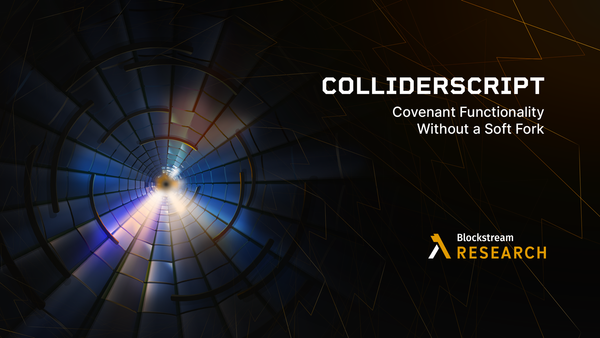

> *作者：Andrew Poelstra*
> 
> *来源：<https://blog.blockstream.com/colliderscript-covenant-functionality-without-a-soft-fork/>*

虽然在过去一两年中，我们见到了许多给比特币增加限制条款（covenant）插件的提议，专家之间一直有一种猜测：也许 *无需* 插件就能实现限制条款。证据来自两个方面：一是以往被认为在脚本中不可能实现的计算取得了越来越多的突破（其顶峰是 BitVM 项目在脚本中实现了所有 RISC-V 指令集的操作码），二是比特币开发者们找到的一系列 “差之毫厘（near miss）”：如果不是因为这个系统的一系列模糊的历史性怪癖，限制条款应该是 *向来能够实现的*。

Ethan Heilman、Avihu Levy、Victor Kobolov 和我已经开发出了一种方案，证明了这种怀疑是有根据的。*我们的方案 [ColliderScript](https://eprint.iacr.org/2024/1802?ref=blog.blockstream.com) 在当前的比特币上开启了限制条款，在相当合理的密码学假设下，每笔交易的大概开销是约 5 千万美元（加上一些硬件的研究和开发）。*

虽然使用 ColliderScript 的成本高得离谱，但建立它是非常便宜的，而且这样做的话（加上一种常规的花费机制，使用 Taproot 就能将两者分开），可能会在量子计算机凭空出现、摧毁比特币系统的事情中 *保住你的比特币*。

我不怀疑，许多读者在看到这里时，已经扬起了眉毛。不过，如果你读完了整篇文章，没准两边眉毛会一样高。

## 限制条款

如果你还不熟悉我们的话题，那么，讨论的背景是，比特币有一种内置的编程语言，称为 “Bitcoin Script”，是用来授权花费比特币的。在最早的时候，Script 包含了丰富的算术操作码，可以用来实现任意计算。但在 2010 年夏天，中本聪禁用了其中许多操作码，以消灭一系列严重的 bug 。（让 Script 回到这个 2010 年以前的版本是 [Great Script Restoration 项目](https://bitcoinmagazine.com/technical/the-great-script-restoration-a-path-forward-for-bitcoin?ref=blog.blockstream.com)的目标；[OP_CAT](https://github.com/bitcoin/bips/blob/master/bip-0347.mediawiki?ref=blog.blockstream.com) 则是同一方向上的一个较为克制的提议。）限制条款的想法 —— 使用脚本来控制钱币的支出数量和目的地的交易 —— 因此[消失](https://bitcointalk.org/index.php?topic=278122.0&ref=blog.blockstream.com)了好几年，又过了很久，人们才意识到这些操作码已经足以实现限制条款。这个时候，社区已经变得很大，对于简单 “重新启用” 这些旧的操作码（跟禁用采取相同的实现方式）变得谨慎。

限制条款是理论上的 Script 构造，允许用户不仅控制一笔钱被花费的条件，还能控制花费的目的地。这是比特币上许多未来构造的基础，从保险柜合约（vault）、限制支出速度的钱包，到新的手续费市场机制（比如 [payment pools](https://rubin.io/bitcoin/2021/12/10/advent-13/?ref=blog.blockstream.com)），以及不那么吸引人的构造（比如[分布式金融和 MEV](https://blog.blockstream.com/miner-extractable-value-mev-and-programmable-money-the-good-the-bad-and-the-ugly/)（[中文译本](https://www.btcstudy.org/2024/11/01/miner-extractable-value-mev-and-programmable-money-the-good-the-bad-and-the-ugly/)））。人们为限制条款的可欲性以及它们对比特币的本性的影响大费唇舌。

在本文中，我将搁置这些辩论，并主张限制条款在今天的比特币上已经能够实现了；我们最终会发现，这是 *如何* 可能的（无需巨大的计算开销和可依的密码学假设）；以及，我们对比特币新插件的辩论不应该被理解为在比特币的 无限制条款时代 和 限制条款时代 之间画上一条明显的分界线。

## 历史

多年以来，在有限的 Script 中找出能够做到不简单事情的创建性方法，成了一项传统。闪电网络就是一个这样的例子，较少人知道的想法还有[概率性支付](https://download.wpsoftware.net/bitcoin/bitcoin-probabilistic-payments.pdf?ref=blog.blockstream.com)以及[哈希函数的碰撞奖励](https://bitcointalk.org/index.php?topic=293382.0&ref=blog.blockstream.com)。模糊的罕见情形，比如 [SIGHASH_SINGLE bug](https://buildingbitcoin.org/bitcoin-dev/log-2011-07-09.html?ref=blog.blockstream.com) 以及在 Script 解释器中使用公钥复原（public key recovery）来获得一个 “交易哈希值”，也被注意到了，并得到了研究，当没有人发现它们有用在哪里。与此同时，比特币自身也演变成更加严谨定义的模样，因此关闭了许多这样的可能性。比如说，隔离见证（Segwit）就消除了 SIGHASH_SINGLE bug，并且将程序数据与 witness 数据显式隔离；Taproot 消灭了公钥复原，后者提供了灵活性，但可能会破坏适配器签名和多签名的底层安全性。

尽管发生了这些变化，对 Script 的钻研还在继续，因为一些顽固分子想象，不论如何，也许能找出一些罕见情形、在比特币中开启限制条款。在 2020 年初，两项研究引起了浪潮。一项是[我的发现](https://blog.blockstream.com/cat-and-schnorr-tricks-i/)，基于签名的限制条款并没有跟公钥复原一起消亡，而且，尤其是，只要我们让一个被禁用的操作码 —— OP_CAT —— 回归，就足以制造出非常高效的限制条款构造。另一项是 [BitVM](https://bitvm.org/?ref=blog.blockstream.com)，这是一种在 Script 中利用多笔交易来制作大型计算的神奇办法，它启发了对单笔交易内基础计算的大量研究。

这两项开发成果都激发了大量关于限制条款的运动和兴奋之情，但也让我们对 Script 的根本局限性有了更清晰的认识。尤其是，看起来，如果不加入新的操作码，限制条款是不可能实现的了，因为交易数据只能通过 64 字节的签名和 32 字节的公钥传入 Script，同时，支持 BitVM 的操作码只能对 4 字节长的对象应用。这一区分被[归纳](https://blog.blockstream.com/script-state-from-lamport-signatures/)为 “小脚本” 和 “大脚本”（[中文译本](https://www.btcstudy.org/2024/07/15/script-state-from-lamport-signatures/)），而找出两者之间的桥梁与发现一种限制条款构造是同义的（至少，我是这么认为的）。

## 函数式加密与 PIPE

也有人注意到，使用一些魔幻的数学，也许只用签名、无需离开大脚本，就能制作限制条款。Jeremy Rubin 曾在他的论文 *[FE'd Up Covenants](https://rubin.io/bitcoin/2024/05/29/fed-up-covenants/?ref=blog.blockstream.com)*  中阐述这个想法；该文描述了如何使用一种叫做 “函数式加密（functional encryption）” 的理论密码学原语来实现限制条款。几个月后，Misha Komorov 提出了一种叫做 “[PIPE](https://delvingbitcoin.org/t/bitcoin-pipes-covenants-on-bitcoin-without-soft-fork/1195?ref=blog.blockstream.com)” 的方案，似乎能够让这种理论成为现实。

这是一项令人激动的进展，但也有两项重大局限性：一，它需要一个受信任的启动仪式，意味着创建限制条款的这个人可以绕过其规则（对于保险柜合约这样的应用来说，不算什么，因为钱的主人信任资金并不会降低自己的安全性；但对 payment pool 这样的应用来说就不能接受了，因为限制条款中的资金并不是限制条款的创建者的）；二，它设计一些前沿的、安全属性尚不明确的密码学。后面这种局限性会随着更多研究出现而消逝，但受信任的启动装置是函数式加密方法天生的。

## ColiiderScript

前面的概述确定了我们现在的起点：我们希望找出一种方法，以 Bitcoin Script 现有的形式来实现限制条款，而且我们认为，做到这一点的方法是找出某种桥梁、沟通 “大脚本” 的签名验证和 “小脚本” 的任意计算。看起来，没有哪个操作码可以直接做到这件事（我们论文的附录 A 根据所有操作码的输入和输出大小作了分类）。这样的桥梁，如果有的话，将是某种构造，能够取一个大体积对象为输入，并证明它与几个小体积对象的拼接完全相等。看起来，基于我们对操作码的分类，这是不可能的。

然而，在密码学中，我们常常会放宽（比如） “完全相等” 这样的概念，转而使用（比如） “计算上不可区分” 或者 “统计上不可区分” 这样的概念。也许，通过使用大脚本内置的密码学构造 —— 哈希函数和椭圆曲线签名 —— 并在小脚本中使用 BitVM 构造来镜像它们，就可以找出一个办法，证明一个大体积数据跟一系列小体积数据 “在计算上不可区分”？在 ColliderScript 中，我们就是这样干的。

到底是怎么做？你不妨回想一下我们前面提到的 “[哈希函数碰撞悬赏](https://bitcointalk.org/index.php?topic=293382.0&ref=blog.blockstream.com)”。这一赏金的前提是任何人都可以 “碰撞” 一个哈希函数，也就是提供两个会产生相同输出的输入，并且可以在大脚本中证明，然后就能拿走赏金。因为哈希函数的输入空间（长度不超过 520 字节的所有字节串）比其输出空间（固定为 32 字节长的字节串）大得多，所以从数学上来说，一定有许许多多的碰撞。但到目前为止，除了 [SHA1 的例外](https://www.reddit.com/r/Bitcoin/comments/5vqd6k/sha1_collision_bounty_has_been_claimed/?ref=blog.blockstream.com)，还没有人 *发现* 比暴力搜索 —— 单纯不断调用哈希函数、检查结果是否与早先的某次尝试一致 —— 更快的寻找碰撞的办法。

这就意味着，平均而言，对于一个 160 比特的哈希函数，比如 SHA1 和 RIPEMD160，用户需要做至少 2^80 次搜索，或者说 100 万的四次方次搜索，才能找出一个碰撞。（在 SHA1 中，如果用户能够使用一种特定形式的输入，就有一条[捷径](https://shattered.io/?ref=blog.blockstream.com)；但我们的构造禁用了这种形式，所以出于我们的目标，这种攻击可以忽略。）这也假设了用户拥有无限多的内存可用；如果从现实出发，工作量还要再乘以 100 倍。

如果我们设想 SHA1 和 RIPEMD160 计算起来可以像比特币 ASIC 矿机计算 SHA256 那么高效，那么上述计算的代价跟挖出 200 个区块是相同的，也即大概是 625 BTC（4600 万美元）。这是很多很多钱，但很多人都能拿出这样一笔钱，所以也是有可能的。

若想找出一个 *三重* 碰撞，也就是三个能得出相同输出的输入，将需要 2^110 次搜索，即使慷慨地假设其内存数量。为了完成 *这样的* 搜索，我们的成本需要再乘以 1600 万 —— 总成本超过 700 万亿美元。这也是很大一笔钱，而且今天可能 *没有人* 有那么多钱。

我们的构造的关键点是：为了证明一系列小体积对象等价于一个大体积对象，我们首先找出我们的目标对象与一个 “等价测试对象” 的哈希碰撞（这样的目标对象，我们假设是可以在一定程度上随机化的，或者，否则我们就要做 “次级原像搜索”，而不是碰撞搜索，那会变得难很多很多）。这些等价测试对象是特殊构造的，所以可以容易在大脚本和小脚本中操作。

然后，我们的构造会在 Bitcoin Script 中检查，我们的大体积对象会跟我们的等价测试对象膨胀（使用跟哈希碰撞悬赏完全相同的方法），且我们的小体积对象系列也会跟等价测试对象碰撞（使用部分从 BitVM 项目中抄袭的复杂构造，详细描述可见论文）。如果这些检查都能通过，那么，要么我们的小体积对象和大体积对象是完全一样的，要么，意味着用户找出了一个三重碰撞：两个对象都跟测试对象碰撞。根据我们前面的论证，这是不可能的。

## 结论

桥接小脚本和大脚本是我们的限制条款构造中最困难的部分。为了从这座桥走向实际的限制条款，还需要少数额外的步骤，但都相对简单。具体来说，一个限制条款脚本首先要求用户使用特殊的 “生成者密钥” 来签名交易，这是可以用 OP_CHECKSIG 操作码来验证的。使用上述桥梁，我们将这个签名打散成 4 字节长的碎片。然后，我们可以验证它的 nonce 也等于生成者密钥，一旦签名被分解，这是很容易做到的。最后，我们使用来自 [Schnorr trick](https://blog.blockstream.com/cat-and-schnorr-tricks-i/) 的技术，从签名中抽取交易数据，然后就能用限制条款想要的任何方式来限制它。

我们还可以做到一些别的事：附录 C 介绍了一种环签名构造，允许钱币被一组公钥的其中之一签名，而无需揭晓是哪一个公钥。在这个案例中，我们使用上述桥梁来打碎公钥，而不是签名。这样做给了我们一个巨大的效率提升（相对于限制条款构造），其技术原因与 Taproot 有关，而且在论文中有详细描述。

最后一个我希望引起关注的应用，在论文的 7.2 章节中有简要讨论：我们可以使用我们的限制条款构造，从一个 Schnorr 签名中提取交易哈希值，然后直接[使用 Lamport 签名](https://rubin.io/blog/2021/07/06/quantum-bitcoin/?ref=blog.blockstream.com)重新签名该哈希值。

为什么要这样做？如上述链接所论证的，这样的 Lamport 签名是交易数据的量子安全签名；如果这种构造是签名一些钱币的 *唯一* 方式，这些钱币就不会惧怕量子计算机的盗窃。

当然，因为我们的构造需要几千万美元来使用，没有人会让这种构造变成唯一的签名方法。但人们如果想要为自己的钱币（在现有的非量子安全的签名方法之上）添加这种构造，是美元障碍的。

然后，如果明天醒来，世界上出现了便宜的量子计算机，可以打破比特币的签名算法，我们也许会提出一种紧急软分叉、禁用所有的椭圆曲线签名，包括 Taproot 密钥花费以及 OP_CHECKSIG 操作码。这会在实质上冻结每一个人的比特币；但如果另一种情形无非是每一个人的钱币都会被自由窃取，那也没什么差别。如果这种禁用签名的软分叉允许 OP_CHECKSIG 操作码在使用生成者密钥时调用（这样的签名已经完全不能提供安全性，而且只对像我们这样的复杂脚本构造有用），那么使用 Lamport 构造的用户就可以计算自由地花费自己的钱币，而不必担心没收和盗窃。

当然，真要通过这种方式来花费，就得先花出去几千万美元，但总好过 “完全不可能”！我们期待随着人们在我们的研究上开发，这一成本会大大降低。

（完）