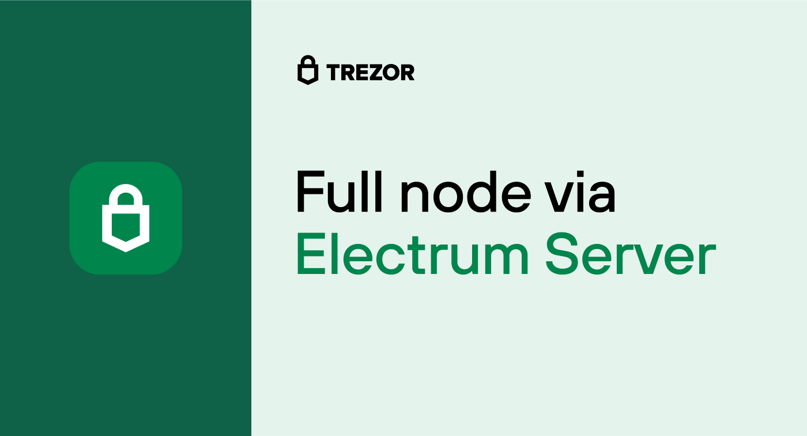
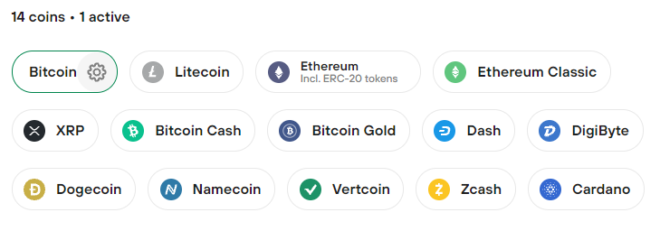
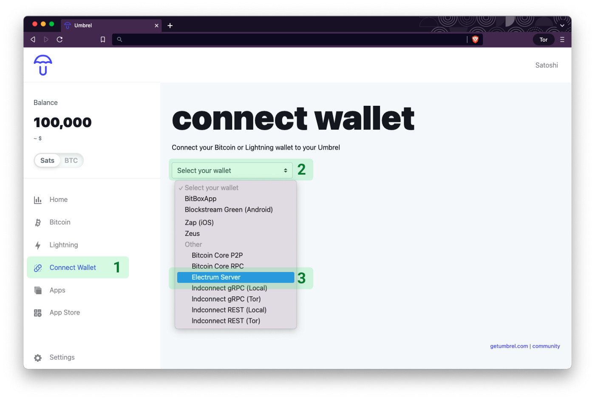
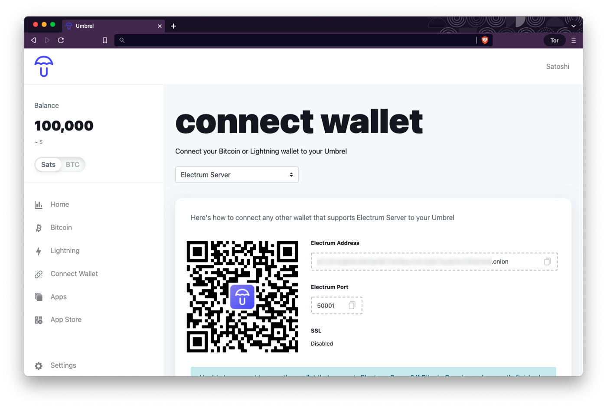
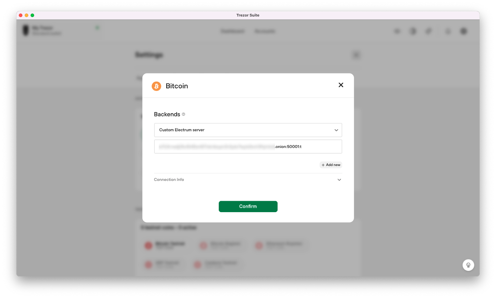
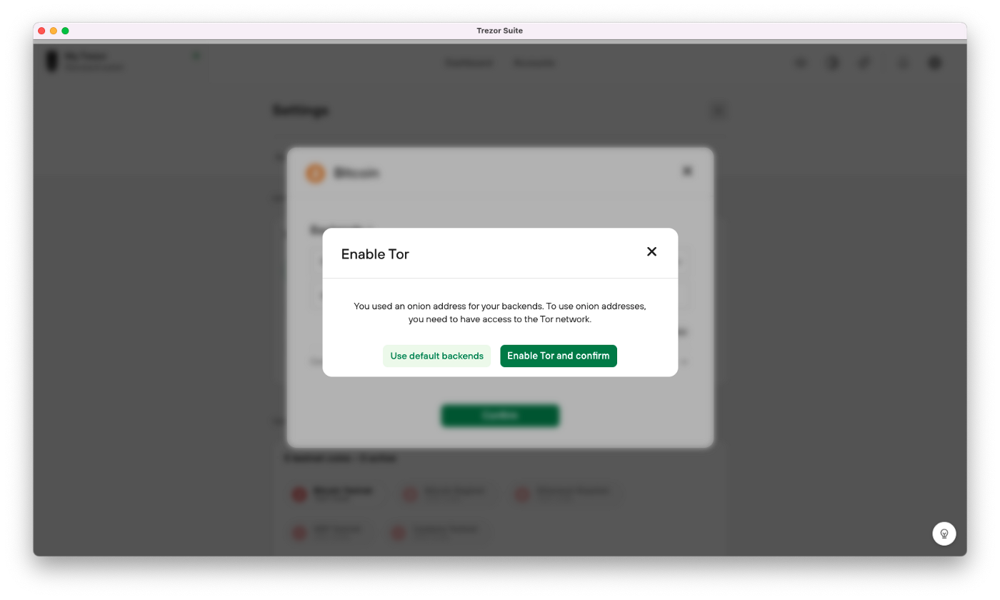
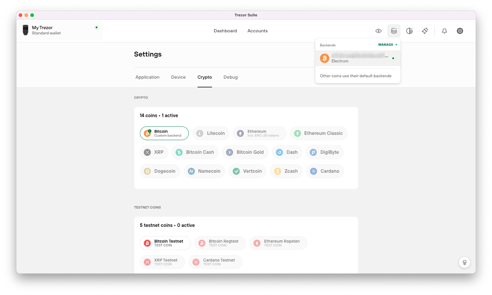

> *作者：SatoshiLabs*
> 
> *来源：<https://blog.trezor.io/connecting-your-wallet-to-a-full-node-edf56693b545>*

为了更好地保护用户的隐私性，[Trezor Suite](https://blog.trezor.io/trezor-suite-update-march-2022-3e1823fa22d7) 现已更新至 22.3.2 版本，让 Trezor 用户可以使用该应用的**桌面版本**连接至任何运行 Electrum 服务器的节点。请注意，你无法通过 Trezor Suite 网页应用连接你自己的节点。Trezor 用户将[硬件钱包](https://trezor.io/?utm_source=Medium.com&utm_medium=referral&utm_campaign=2022-03-22_Full_Node_Electrum_server&utm_content=link)连接至自己的节点后，就可以有效避免将钱包使用数据泄漏给第三方托管商。本文将介绍为何使用自己的节点如此重要，以及如何设置 Trezor Suite。

运行自己的节点可以给予你更多安全感，因为地址和余额之类的数据不会外泄，但是这个概念对部分用户来说或许太过超前。你也可以继续使用默认后端设置，将 Trezor Suite 连接至 SatoshiLabs 的节点，同样能确保安全无虞。这些节点由我们团队直接在开源的 [Blockbook](https://github.com/trezor/blockbook) 软件上运行，不会追踪用户数据。

## 全节点是什么？

节点是能够为整条区块链编制索引、检查和验证新交易的软件。由独立运行的去中心化节点组成的网络正是让比特币具备较高的安全性、可以防止双重花费，而且具有较强的抗逆性（防止整个网络掉线）的原因。全节点需要存储并追踪大量数据，因此还存在另一种轻量级节点，会大幅削减数据量以降低计算要求。

运行全节点意味着要维护比特币区块链的副本，同时持续检查新的交易和区块以便验证。其中最关键的部分是 `bitcoind`，这是一个“无头”软件，既能检索链上数据，又能将数据上链。由于 `bitcoind` 本身操作起来很难，出现了很多基于 `bitcoind` 的全节点功能构建的界面，如 Electrum 服务器、Blockbook 和 Bitcoin Core，来改善用户体验，并实现部分流程的自动化。

### 为什么要运行 Electrum 服务器？

Trezor Suite 后端共有 3 种设置：（1）连接至由 SatoshiLabs 运行的默认节点；（2）连接至运行 Blockbook 的节点；（3）连接至运行 Electrum 服务器的节点。

> Electrum 服务器实现本质上就是一个 `bitcoind` 客户端，根据开源软件钱包 Electrum 的需求设置。

`bitcoind` 和钱包之间多一个软件的好处是，这个软件可以缓存数据，优化性能，并提供法币兑换率之类的其它信息。在默认情况下，`bitcoind` 无法提供一个地址的完整交易历史，因此需要将 Electrum 服务器作为新的一层添加到 `bitcoind` 上，利用其地址索引功能来达到目的。

### 自己运行节点的好处

如果你不想自己运行节点、又想使用区块链，就得连接到其他人的服务器。如果这个服务器有恶意或遭到了攻击，就会向 Trezor Suite 提供不正确的数据，并影响你使用比特币的能力。

连接到第三方节点可能会泄露数据，例如，你正在查询哪些地址和交易。节点主机也有可能泄露你拥有多少比特币之类的信息。使用 Tor 至少可以让你保护自己的身份信息，以免被人知道你是谁，但是你的地址会被关联起来。连接到你自己的节点就能完全防止你的数据被发送至第三方节点运营者。

## 建立自定义全节点连接

如果你已经设置了自己的节点或想要连接到某个运行 Electrum 服务器的公共节点，你需要 3 个数据：连接至哪个地址、连接至哪个端口，以及使用哪个协议（TCP 或 SSL）建立连接。

> **地址**是标识你的节点的 URL、IP 地址或 Tor.onion 地址。**端口**是地址指定用于接受外部钱包连接的连接。**协议**表明是否启用 SSL，即，你的节点和 Trezor Suite 之间的连接是否会加密。

使用这 3 个数据点来构建格式为 `address:port:protocol`的字符串。例如，`electrum.blockstream.info:50001:t`。

你构建好了如上例所示的字符串之后，你只需在 Trezor Suite 中打开**设置菜单**，然后点击“Crypto”页签。将鼠标移动到“Bitcoin”按钮上，点击浮现出的“齿轮”图标，即可打开关于比特币的后端设置。

- 将鼠标移动到“Bitcoin”按钮上，然后点击“齿轮”图标打开后端设置菜单 -

这时，你会看到一个弹出菜单，上面列出了当前已连接后端。点击下拉菜单，选择**自定义 Electrum 服务器**。如果是首次添加，你会看到一个空白输入框。按照上文所示格式输入 URL、端口和协议，然后点击确认。

你也可以设置多个自定义服务器，只需重复上述过程直到所有节点都成功添加为止。

- 添加 TCP、SSL 和 Tor 后端的连接详情 -

你设置好自定义后端后，点击确认以保存设置，然后关闭弹窗。建立连接需要一段时间。在菜单栏的右上角会**出现一个新的图标**，显示一个自定义后端已经设置完成。

- 如图标上绿色标记所示，自定义后端已连接，且 Tor 已启用 -

点击该图标会显示当前已连接节点的详情及其**连接状态**。黄点表示连接还未建立，绿点表示连接正在工作中。点击已连接节点的名称即可重新打开后端设置。

### 使用洋葱地址通过 Tor 连接你的节点

使用洋葱地址可以访问在 Tor 网络上运行的服务器。洋葱地址是长字符串，并未采用传统的 `.com` URL 格式，而是以 `.onion`结尾。

若想通过 Tor 连接到你的后端，你需要一个**洋葱地址**、一个端口和一个协议（洋葱地址始终设置为 TCP，因此协议是 `t`）。一旦你添加了上述信息并点击确认，任何与你的节点的通信都将发生在 Tor 隐私网络上。

在通过 Tor 连接到你的节点时，**务必开启 Tor**，以确保 Trezor Suite 正常运行。如果 Trezor Suite 试图连接的后端位于洋葱地址上，Trezor Suite 将自动提示你开启 Tor。

- 在禁用 Tor 的情况下连接至 Tor 节点 -

如果禁用 Tor，你将无法连接至你的节点，进而无法发送交易和使用其它功能。如果你有多个处于活跃状态的自定义后端，Trezor Suite 会在 Tor 被禁用的情况下尝试连接另一个非洋葱后端。

一次只能连接至一个节点。但是，如果你同时运行多个节点，可以将它们添加到连接列表中，Trezor Suite 会在连接断开时尝试连接其它节点。

## 具体流程示例：将 Trezor Suite 连接至 Umbrel

该实现之所以选择支持 Electrum 服务器，主要原因之一是这常见于现有的家用节点解决方案，例如，运行 Umbrel 的树莓派。我们将说明如何从运行 Umbrel 的设备获取连接详情，以及如何在 Trezor Suite 中填写信息。

首先，你需要从 Umbrel 中获取连接详情。点击侧边菜单栏中的“Connect Wallet”，然后在下拉菜单中选择 “Electrum Server”。

## 识别你的节点

在下一个界面中，你会看到连接节点所需的具体信息。Umbrel 会以 `address:port:protocol` 的格式显示 3 个需要复制的信息。

> **地址**是标识你的节点的 URL、IP 地址或 Tor.onion 地址。**端口**是地址指定用于接受外部钱包连接的连接。**协议**表明是否启用 SSL，即，你的节点和 Trezor Suite 之间的连接是否会加密。

将这些数据复制到 Trezor Suite 中，并使用冒号分隔。如果 SSL 已启用，协议填写`s`；如果 SSL 未启用，协议填写 `t` ，表明是单纯的 TCP 连接。将所有数据相连，你会得到一串类似以下内容的字符：`ex4mpl3avds34zbtf4xustmzei6nlr3g62fz7c7tp7iqemmpwjx7ktad.onion:50001:t`。

你可以一次添加多个后端，但是 Trezor Suite 每次只会连接到一个后端。填写完成后点击确认。

### 通过 Tor 连接

在连接到洋葱地址之前，你必须在 Trezor Suite 中启用 Tor。如果你试图连接到位于洋葱地址的节点，你会收到启用 Tor 的提示。当多个连接可用时，Trezor Suite 将基于是否启用 Tor 切换至合适的连接。

 

**建立连接**

建立连接可能需要一段时间。你可以点击“Backends”图标来检查连接状态。绿点表示正在工作中，黄点表示仍在尝试建立连接。当 Trezor Suite 试图建立连接时，你会在你的比特币账户中看到一条带有刷新连接选项的消息。

## 构建你自己的全节点

运行你自己的全节点不仅有利于整个比特币网络，而且可以让你更清楚地知道自己的交易是如何广播出去的。你可以通过多种方法构建自己的全节点，有的 方法只需要你在电脑上下载一些软件。在决定采用哪种方式时，你需要考虑的因素有空间、噪音、连接可靠性、成本以及你自己的技术能力。

节点应该保持尽可能久的正常运行时间，因为节点必须保持在线才能验证新的交易。很多人选择打造一个专门的机器用来运行他们的节点，无需持续为主计算机供电就能保持节点在线。树莓派就是一个亲民的选择，因为它不仅价格低廉，还能满足节点计算要求。

开源社区已经提供了多个关于如何使用不同硬件构建节点的指南。下面是几个可供参考的方法，各有利弊。

- 在你的家用服务器上安装 [**Blockbook**](https://wiki.trezor.io/User_manual:Running_a_local_instance_of_Trezor_Wallet_backend_(Blockbook))。Blockbook 是一个区块链索引程序，可以安装在 Linux Debian 机器上。设置完成后，你只需进入 Trezor Suite 的 “Bitcoin Backend”设置菜单，从下拉菜单中选择 “Custom Blockbook server”，并添加来自 Blockbook 设置的详细后端信息。

- 对于技术小白来说，**购买现成的节点**是个不错的选择。已经有一些公司推出了即插即用的机器，只需最简单的设置即可运行比特币和闪电网络节点。通常来说，这些现成节点的成本要高于 DIY 节点。

- **树莓派节点**能够以最低成本实现一个简洁、便携的自包含节点解决方案。需要注意的一点是，旧机型通常没有足够多的资源来满足软件运行要求。与 Electrum 服务器捆绑在一起的节点专用操作系统 [Umbrel OS](https://getumbrel.com/) 最起码要第四代树莓派才能运行。请确保你选择的设备适合你想要运行的软件设置。

- 在你的电脑上运行 [**Bitcoin Core**](https://bitcoin.org/en/full-node)。**Trezor Suite 暂不支持 Bitcoin Core**。Bitcoin Core 大概是难度系数最低，且成本最低的入门方法，只需使用普通电脑即可。安装只需要几分钟时间，但是完成首次区块下载需要几天时间，对于任何类型的全节点来说都是如此。

Trezor Suite 的后续更新会进一步扩展全节点的功能，让用户在使用比特币时享有完整的控制权。

（完）