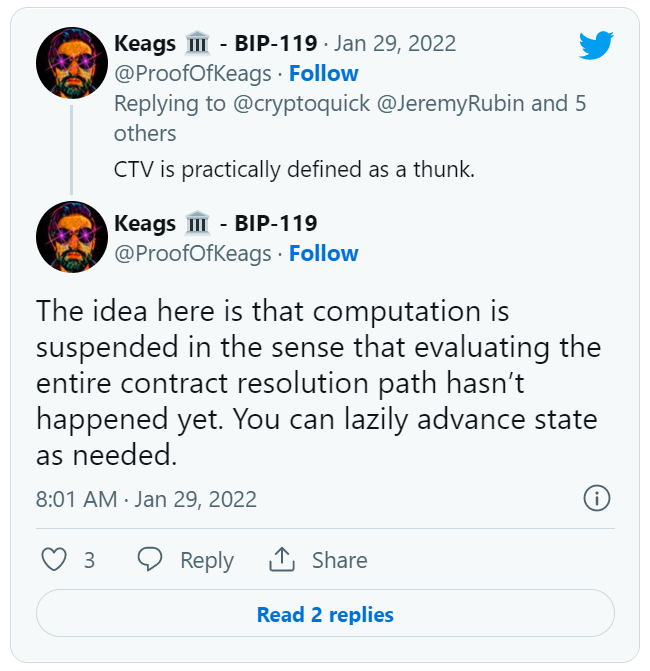
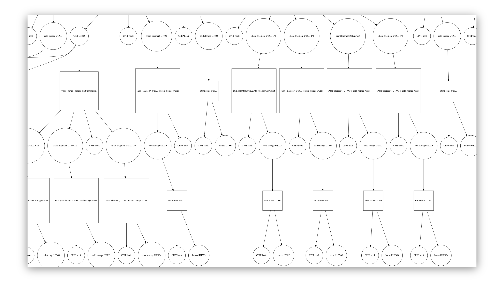
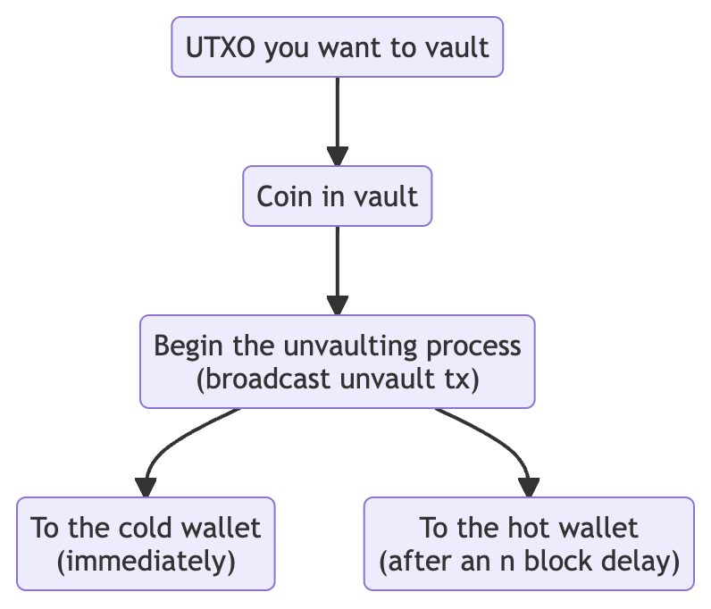

> *作者：Buck Perley*
> 
> *来源：<https://unchained.com/blog/covenants-ctv-bitcoin-custody/>*

“限制条款（covenant）” 最近在比特币的技术和产品讨论中成了一个热门话题。对于刚刚进入比特币世界的新人和没有时间跟踪邮件讨论的人来说，限制条款可能像是一个抽象的、未被充分解释甚至没有必要的话题。实际上，这个主题有非常长的研究历史；如果得到合理的实现，也会带来一些令人激动的好处。当然，也有一些风险需要考虑。

讨论这个主题会涉及很多话题。如果你想跳转阅读，可以看看文章的目录。

## 比特币限制条款研究史

这个主题的源头之一可以追溯到 2013 年，那时候 Gregory Maxwell 提出了比特币限制条款的一种早期版本，并说明 “[估计是个坏主意](https://bitcointalk.org/index.php?topic=278122.0)”。但后来大家开始更严肃地对待这个主题。在 2014 年，[多位主要开发者的一次 IRC 讨论](https://download.wpsoftware.net/bitcoin/wizards/2014/01/14-01-15.log)中，就包含了对限制条款可行性的讨论；而 Möser、Eyal 和 Gün Sirer 署名的一篇名为 “[比特币限制条款](http://fc16.ifca.ai/bitcoin/papers/MES16.pdf)” 的论文也在 2016 年出版并[在 Scaling Bitcoin 大会上宣讲](https://milan2016.scalingbitcoin.org/files/presentations/D2%20-%206%20-%20Emin%20Gun%20Sirer.pdf)。这些工作开始更严肃地对待限制条款如何在比特币中实现、限制条款对比特币保管有何好处的问题（我们后面也会讨论这些话题）。

最近，在 2020 年，Swambo、Hommel、McElrath 和 Bishop 的论文《[使用比特币保险柜的保管协议](https://arxiv.org/abs/2005.11776)》进一步介绍了如何开发模拟了限制条款的一些功能的保险柜（当然会有一些安全上的取舍）。自那以来，已经有许多尝试在比特币脚本中以某种形式支持限制条款的提议：[OP_CHECKSIGFROMSTACK](https://bitcoinops.org/en/topics/op_checksigfromstack/)（CSFS）、[SIGHASH_ANYPREVOUT](https://bitcoinops.org/en/topics/sighash_anyprevout/)（APO）、[OP_TAPLEAFUPDATEVERIFY](https://www.mail-archive.com/bitcoin-dev@lists.linuxfoundation.org/msg10437.html)（TLUV）、[OP_EVICT](https://lists.linuxfoundation.org/pipermail/bitcoin-dev/2022-February/019937.html)、[OP_CAT](https://medium.com/blockstream/cat-and-schnorr-tricks-i-faf1b59bd298)、[OP_TXHASH](https://lists.linuxfoundation.org/pipermail/bitcoin-dev/2022-January/019813.html) 和 [OP_CHECKTEMPLATEVERIFY](https://bitcoinops.org/en/topics/op_checktemplateverify/)（CTV），等等。

因为 CTV 是其中最老的（自 2019 年中开始开发），也是研究最多的，所以我们下文的讨论将围绕着 CTV 类型的限制条款展开。

**需要说明的是，Unchained Capital 的成员对 CTV 软分叉的合理性及其可能激活的路径有不同的立场。所以，这篇文章不应被认为是 Unchained Capital 公司对这两个问题的立场。**

## 那到底什么是限制条款呢？

我们从 “普通” 的比特币交易开始。每一分每一秒，你的比特币都是由一个锁定脚本来保护的。要想花费你的比特币，就必须满足这些锁定脚本所表示的条件。最常见的锁定脚本是这样的：“你不能花这笔钱，除非你能提供一个签名，证明自己拥有与这个公钥相匹配的私钥”。这个公钥就放在锁定脚本中，而相应私钥的签名就能解锁这个脚本。当然，还有一些稍微复杂一些的锁定条件，例如：“在 X 个区块内，你不能花费这笔钱（[时间锁](https://en.bitcoin.it/wiki/Timelock)）”；还比如：“你不能花费这笔钱，除非你能提供这三个公钥中的两个的签名（多签名）”；等等。

“限制条款” 这个词来源于法律，意思是：

> 一种正式的协议或者承诺，通常被包含在一个合约或类似的东西中，要求执行或禁止某种行为；以书面或口头形式订立的契约或规定。

法律限制条款的一个例子是附加在一栋房子的买卖合同中的规定。我们最常在 HOA 协议中看到它，比如你可能会同意不把房子漆成某种颜色。这样，虽然你得到了这个财产的所有权，但在可以做的事情上是受到限制的。

所以，限制条款跟我们在 “普通” 的比特币脚本中情形刚好相反：在普通的比特币脚本中，我们只要满足具体的条件，就可以解锁一个脚本（比如使用某一把私钥来签名一条交易）；而在限制条款中，脚本限制了你可以用这笔钱来做的事（或者是你可以把资金发到哪个地址去）。如 Swambo、Hommel、McElrath 和 Bishop 的论文所指出的，限制条款就是 “执行对未来的比特币交易的限制条件的机制”。

## 那么 CTV 是如何启用限制条款的呢？

CTV 是开发限制条款的 “最简可用协议” 的长期努力的成果 —— 这种最简单的协议应该能实现一组基本的功能，同时避免来自更通用的限制条款设计的风险（关于过于通用的限制条款和递归型限制条款的风险，请见下文的讨论）。这些工作由 [Jeremy Rubin](https://rubin.io/) 领导，成果就是 CTV，“检查交易模板”。

简单来说，CTV 将一个 UTXO 承诺到（锁定到）可以花费它的交易的一个 “模板”，这个模板描述了可以花费这个 UTXO 的环境。在这里，“模板” 这个词是有准确的含义的：未来的交易各字段的一个具体的子集的哈希值。

如果说 “普通” 的比特币锁定脚本说的是 “只有使用某一把私钥签名才能花费这笔钱”，CTV 锁定脚本说的就是 “只有花费它的交易匹配它所注明的狭窄、具象的模板时，才能花费它”（或者更直白地说，要求未来交易数据的一个子集的哈希值跟 CTV 脚本中的哈希值一致）。就像法律上的限制条款可以限制房屋销售给某个人或者说限制 TA 买下房子后可以做什么，CTV 限制条款可以限制这笔资金只能给未来的某一笔交易使用。

乍看起来，这种特性说不上有什么用，甚至是危险的（为什么我会想要限制自己怎么使用比特币呢？），但其实它可以带来一些非常好的效果，尤其是用在自主保管中的时候。经过精心的设计，一个比特币的限制条款很有可能非常有用，而且不会产生当前不存在的任何额外风险和成本。

## 限制条款与保管

人们为基于 CTV 的限制条款提出了许多应用：

- [扩展比特币的交易吞吐量](https://rubin.io/bitcoin/2021/12/10/advent-13/)
- [区块链的拥堵控制](https://rubin.io/bitcoin/2021/12/09/advent-12/)
- [更高效率的谨慎日志合约](https://zensored.substack.com/p/supercharging-dlcs-with-ctv?s=r)
- [信任最小化的贷款](https://twitter.com/lukechilds/status/1489989387186470913?s=12)
- [链上衍生品](https://rubin.io/bitcoin/2021/12/20/advent-23/)
- [闪电通道工厂](https://blog.bitnovo.com/en/bip-119-update-op_ctv/)
- [等等](https://rubin.io/advent21/)

只需对资金用途的小小限制，就可以启用这么多的应用，听起来有点反直觉，但也许最简单的解释方式就是把限制条款理解成推迟执行的一个工具。限制条款允许你提前创建和确认做某件事的交易、然后将实际执行的时间推迟到未来的任意某个时间点（用计算机可选的术语来说，可以认为它是一种 “形实转换程序（[thunk](https://en.wikipedia.org/wiki/Thunk)）”。

### 保险柜的广阔世界

由 CTV 提供的 “延迟执行” 功能的一种用途就是 “保险柜（vault）”。在这个行业中，“vault” 是一个被滥用的词语（甚至我们也管自己的合作托管产品叫 “vault”）。总的来说，你可以认为 “保险柜” 是一个致力于协助自主保管并尽可能少牺牲安全性和可用性的开发领域。它们对我们的讨论非常有用，因为它们既很强大，又很容易理解（不需要太多技术背景），而且可以为 Unchained 的用户提供直接的价值。保险柜刚好也是人们最初为限制条款设想的用途。

作为一个公司，我们的目标是帮助尽可能多的人自主保管自己的比特币。自主保管减少了对中心化第三方（比如交易所和托管式钱包）的依赖，我们认为这是比特币的核心价值之一；在提升了客户的金融个人主权的同时，它还减少了中心化点的故障会造成的影响，从而强化了整个网络。在我们看来，[2-of-3 多签名和合作式托管](https://unchained.com/blog/why-2-of-3-multisig/)是当前实现这些目标的最佳工具。

在我们引导新用户时，我们非常用心教他们安全习惯：如何生成种子词，[如何验证地址](https://help.unchained.com/how-to-verify-receiving-address-on-hardware-wallet)，[如何安全地保管钱包备份和设备并分散在不同的地点](https://unchained.com/blog/how-to-store-bitcoin-seed-phrase-backups/)，等等。当你拥有自我主权并为代际财富负责时，你肯定希望尽可能减少盗窃和丢失的风险。私钥丢失和被盗是没有补救方案的，而且请记住，在一个没有限制条款的世界里，你的比特币财富的唯一的锁，就是在锁定脚本中编码的具体条件。如果一个攻击者获得了解开这个脚本的工具，例如可以访问你的私钥（或者你弄丢了私钥），你就再也不是完全占有解锁这些资金的工具了。

这就突出了使用多签名钱包的时候的一些取舍。其一，你保存自己的私钥和种子词的方式越安全，紧急的时候想要拿回来就越困难。此外，盯上你的钱的精明攻击者可以隐藏已经知道你的私钥的事实，直到能够完全签名你的交易、将所有比特币盗窃一空。因此，许多看重分散保管安全性的人可能依然会选择便利，而非安全性。我们认为这就是实情，因为大部分人依然在使用单签名钱包，甚至更糟糕的中心化托管商，而 Unchained 和 Case 这样的公司明明已经让多签名钱包变得对普通用户足够友好了。这不仅仅是因为便利性，还因为对大部分人来说，复杂性代表着比丢失、被盗和没收更大的风险。

### 模拟基于限制条款的保险柜

那么，我们如何能使用基于限制条款（或类似限制条款操作）的保险柜来优化当前的多签名保管方法呢？思考这个问题的一个角度是，你可能会想要一种办法，能够便捷地花费一定比例的资金（例如：使用单个签名即可花费，使用热钱包即可），而不会让所有资金都处在风险之中；或者，当交易可能意味着盗窃时，可以取消交易。

在最初的 《[使用比特币保险柜的保管协议](https://arxiv.org/abs/2005.11776)》论文中，它使用了一种聪明的时间锁和预签名交易图谱，有效地实现了这个功能。这个系统的一个演示是论文作者之一 Bryan Bishop [用 Python 语言撰写](https://github.com/kanzure/python-vaults)的。

- 一个保险柜系统的交易（<a href="https://diyhpl.us/~bryan/irc/graphviz-transaction-tree.png">完整图谱见此处</a>） -

从功能上来说，这个系统是围绕两个主要阶段建立起来的（它们自身都可以被分割成很多层，就像上图所示的那样）：

1. **建立保险柜**：使用一个公钥来锁定 UTXO；该公钥的私钥必须被可证明地销毁；
2. **解开保险柜**：在销毁那个私钥以前，需要用它来预签名解开保险柜的交易。解开保险柜的操作也包括发布预先签好名的交易。一般来说，解保险柜交易将拥有至少两个花费路径：某一些资金会在一段时间后允许使用一把热私钥来花费，而剩下的资金则会 “回到保险柜中”。还可以设置一个复原路径，在你不想解开保险柜的时候使用。

除了保险柜，这套系统还安排了一个监控解保险柜交易的系统。当监控系统发现了你没有告诉它的交易时，监控系统可以发布一条 P2RW（推到复原钱包）交易，以阻止其他人使用从你手中盗取的热钱包私钥来花费你的资金。如果你授权了一笔解保险柜交易，则解放出来的输出可以在一段时间后使用你的热钱包私钥来花费。

引言原文：“保险柜交易有两种花费路径：一种是在一个时间锁解锁之后，仅凭活跃钱包就可以访问资金；另一种是 P2RW 交易，可以移除活跃钱包访问 ‘被锁入保险柜’ 中的资金，并保证只有复原钱包才能使用它们。” 这给了我们一种办法，在检测出可能的偷盗行为后 “撤销” 他们的行动。

这套方法的一个主要缺点是它依赖于一个预先签名交易的私钥，并且要求摧毁这个私钥，并不是每个人都能做到。假设这个私钥以某种方式复原了出来，那就意味着这个 UTXO 可以被直接花费了，整个系统所有的安全保证也都作废了。拥有一套可以预先承诺可用交易的限制条款系统，将使我们可以解决这种担忧。它也将允许我们以更加安全的手法、编程出更加复杂的交易图谱。

### CTV 赋能的保险柜案例

为了理解 CTV 如何能帮助我们构造上面这样的保管系统，Bitcoin Core 开发者 James O'Beirne 已经开发出了一个使用 CTV 的 “简单保险柜”，可以部署在线上测试环境种了（见 [Simple CTV Vault](https://github.com/jamesob/simple-ctv-vault)）。

用大白话来说，整个流程就像这样：

1. 将你想要锁进保险柜的资金发送到一个使用 CTV 的脚本中；CTV 就预先决定和保证了什么样的交易能花费这个 （CTV）UTXO。说它是有保证的，是因为脚本是承诺到区块链的，不是依赖于预签名交易的安全性假设的。
2. 保存一份 “解保险柜交易” 的拷贝。这笔交易在广播后可以将你的资金转入一种临界状态，既可以在一个预定的时间锁成熟后使用一个热钱包来花费，也可以立即被一个冷存储的复原钱包 “召回”（用于应对误发解保险柜交易或者出错的情形）。
3. 未来某一天，你正在度假，发现自己需要充实旅行资金。
4. 于是你发布解保险柜交易，它会解锁你的资金，让你可以在一段时间后使用热钱包花费这笔钱。
5. 在你无意发布这笔交易时，可能某个攻击者会在获取你的热钱包私钥后尝试盗窃你的资金。因为这段时延，你可以使用冷钱包私钥（也许需要旅行到某个你存放私钥的地点，或者依赖 Unchained 给出另一个签名），并确保那个热钱包私钥无法花费你的资金。

## CTV 保险柜在自主保管中的优势

上面的只是一个简单的保险柜构造，但它可以帮你理解 CTV 到此带来了什么，以及如何延伸它的初始功能。

### CTV 保险柜的特性

- **信任最小化**：你可以信任一个实体（比如 Unchained Capital）为你创建这样的保险柜，而且无需信任他们会销毁你用来预签名交易的私钥，而且你可以很容易地验证花费条件。
- **瞭望塔**：有了最小化下行风险的能力，你就可以信任一个第三方为你充当[瞭望塔](https://bitcoinops.org/en/topics/watchtowers/)，一旦在链上检测到解开保险柜的交易就立即通知你。如果瞭望塔服务也是你的冷存储方案中的一个私钥持有者，可以提前让这个服务准备好签名你的复原交易。

### 简单保险柜模式的延伸

在上面的方案基础上叠加更复杂的保险柜，我们还可以获得这些好处：

- **防火墙**：你不必让保险柜中的所有资金都可以通过热钱包或者冷钱包来花费，你可以设置锁定条件，使得在最糟糕的情况下也只有一小部分资金能被花费（偷盗）（见 Bryan Bishop 在[此处](https://github.com/kanzure/python-vaults/blob/master/vaults/bip119_ctv.py)对 CTV 的演示）。也就是说，（举个例子）解保险柜交易只有 10% 的资金可以被一个热私钥在一段时间后花费（或被冷私钥立即花费），剩下的 90% 会回到另一个由 CTV （使用相同的条件）保护的输出中。当然，这个功能的一个很好的用途是你在私钥被盗后可以得到一个提醒，而不会让所有资金都处于风险之中，本质上就是一个 “[诱饵](https://en.wikipedia.org/wiki/Honeypot_(computing))”。
- **新的商业模式**：你可以围绕钱包复原服务开发出信任最小化的商业模式，安全地预先承诺一笔资金给一个签名服务，仅当你需要他们的签名时才动用。这种模式的一个好处是公司跑路和破产的影响会降低，在你需要他们的签名时扣住你的资金的可能性也较小。
- **更复杂的花费条件**：结合 [taproot](https://bitcoinops.org/en/topics/taproot/)，你可以编程更复杂的花费条件，并且保持隐私，仅在你绝对需要时才曝光；以及，在[多签名聚合](https://bitcoinops.org/en/topics/musig/)时（你需要使用冷钱包复原保险柜的时候）保持隐私。你可以将 CTV 解保险柜交易隐藏在一个 tapscript 叶子中，使之成为你在无法访问私钥时的紧急花费路径。
- **使用 DLC 的条件式花费**：谨慎日志合约（DLC ）让你可以在绑定外部环境（例如价格波动）的花费条件中非交互式地使用第三方断言机。所以，举个例子，你可以创建一个 “[镭射眼](https://bitcoinmagazine.com/culture/bitcoin-laser-eyes-origins) HODL 保险柜”，仅当比特币的价格冲破 10 万美元时你才能花费其中的资金。这个功能对借贷也有非常好的效果。

## 风险和担忧

关于 CTV，值得指出的风险主要有两种。第一种是限制条款普遍存在的问题，第二种是 CTV 实现专有的问题。

### 限制条款的通病

**1. 递归型限制条款和图灵完备性**

特殊设计的限制条款可能会变得过于通用，以至于资金可能永久背负限制条款、不通过硬分叉就永远无法解开。递归型限制条款还有其它令人担忧的问题，包括比特币脚本变成了实质上是在 “调用自己”，这会变得很难分析，并且让给定一笔交易的风险和成本变得更难计算（有时候甚至会无法计算）。此外，它们还可以给网络中的其他人施加额外的、可能会不受限制的验证成本。

开发者社区内似乎还没有对递归型限制条款对比特币来说到底是不是一个问题形成共识。有些人认为你现在也能够永远锁定一笔资金（就像那个著名的 “[划船事故](https://twitter.com/fluffypony/status/943493541182963712?lang=en)” 一样），而且无限循环的代价已经被交易的成本约束了，因为限制条款只能通过交易形成递归（跟以太坊那样的系统是不一样的）。不过，现在依然有许多正在进行的辩论，就像从 2022 年 2 月份开始在比特币定法这邮件组中显现出来的那样：[对递归型限制条款的反对意见](https://lists.linuxfoundation.org/pipermail/bitcoin-dev/2022-February/019885.html)、[不反对意见](https://lists.linuxfoundation.org/pipermail/bitcoin-dev/2022-February/019885.html)（也包括[对反对意见的回应](https://lists.linuxfoundation.org/pipermail/bitcoin-dev/2022-February/019891.html)）。

因为这些担心还没得到解决，CTV 被有意设计成严格可枚举的（而不是递归的），也就是说，一个由 CTV 交易关联起来的图谱**必然**会有终点，而是这种属性是可以验证的。

**2. 黑名单与可互换性**

这实际上是上述担忧的一个子集，而且持续很长实现了。上文提到的 [2013 年 Greg Maxwell 的论坛帖子](https://bitcointalk.org/index.php?topic=278122.0)就讨论到了这一点，而且最近又在关于激活 CTV 的辩论中重新出现，尤其是在长期的比特币布道者 Andreas Antonopolous 的[一个视频](https://www.youtube.com/watch?v=vAE5fOZ2Luw)中出现。这种担心是种，如果你可以限制一个比特币能够花到哪些地方，政府官员就能强迫交易所仅支持提款到他们（政府）可以施加一些控制的限制条款输出中。

但现在人们已经普遍认为这不是一个问题，因为**这种风险在当前就已经存在**。如果一个政府可以控制你把比特币发到哪里去，自然就能控制你如何花费你的比特币。限制条款的风险跟一个政府要求交易所只能把资金发送到由政府控制的多签名输出或者 taproot 输出是完全一样的（[静默支付](https://gist.github.com/RubenSomsen/c43b79517e7cb701ebf77eec6dbb46b8)也可以用于实现监控）。[从 2014 的这次 IRC 讨论以来](https://download.wpsoftware.net/bitcoin/wizards/2014/01/14-01-15.log)，这种担心已经在很大程度上被比特币开发者们打消了。

### 专属于 CTV 的风险

CTV 的 BIP 非常好地介绍了[这种设计的牺牲和风险](https://github.com/bitcoin/bips/blob/master/bip-0119.mediawiki#Design_Tradeoffs_and_Risks)（其中有一些也适用于其它的限制条款设计）。值得提出的主要担忧有三点：

**1. CTV 不够通用**

希望在限制条款中实现非常狭窄的功能的人，和相信通用功能乃至递归特性好处的人，互相不能说服，以至于这成为一个很难克服的棘手挑战。一方面，一些人认为在我们拥有更加强大的、通用的设计之前，不应启用 CTV，因为 CTV 的激活会增加不必要的代码负担（我们不得不维护它）。问题是，又有一些人认为我们不应该使用通用的限制条款设计（上面已经说过了）。所以还不清楚这些设计和研究最终能否产生结果。不过，这个 BIP 确实列举了[未来的升级路径](https://github.com/bitcoin/bips/blob/master/bip-0119.mediawiki#Future_Upgrades)（如果我们想要添加更多更能的话），包括一个版本系统和 CTV 跟未来可能激活的操作码的兼容性。

**2. 搬起石头砸自己的脚**

这种[担心](https://news.ycombinator.com/item?id=17393292)是说，CTV 让资金的锁定变得过于容易，用户一不小心就会搬起石头打自己的脚。最打的风险之一是 CTV 模板约束了你在下一笔交易中可以花费的数量。所以如果输入的价值太高，多余的资金会以手续费的形式 “送给” 矿工；而如果输入的价值太低，就无法花费这个 UTXO ，因为它的面额不足以使预先承诺的交易变成一笔有效交易（输入的价值低于输出的价值）。

这种风险可以通过设置一个非常安全且只会在紧急条件下动用的花费条件来缓解（比如一个 3-of-3 的多签名解锁路径，并且三个私钥分别埋在不同的国家）。事实上，这样的风险在当前也存在，尤其是在你需要预先承诺资金的链下协议（比如闪电网络和 2020 版保险柜协议）中。最终来说，这是一个 UX 设计和避免地址复用的问题。未来也有一些升级，比如 CTV 的新版本或新的操作码（比如 [OP_AMOUNTVERIFY](https://github.com/bitcoin/bips/blob/master/bip-0119.mediawiki#op_amountverify)）可以用来避免这种误伤。

一种类似的意外之失是使用了畸形的 CTV 模板，这种模板是永远无法满足的，因此会永远锁定 UTXO。解决方案也类似。今天也有可能出现这种情形，比如你发送资金到了一个 OP_RETURN 地址中，或者一个 “燃烧地址”（比如 “1BitcoinEaterAddressDontSendf59kuE”）中。

**3. 手续费管理**

这是一种已经存在于许多链下和合约型协议中的问题，这跟比特币的手续费机制有关。当你承诺一笔未来的比特币交易（不论是闪电通道交易还是 CTV 交易）时，问题在于，你不知道未来（这笔交易需要上链时）的手续费市场会是什么样。但因为手续费又是在这笔交易内部支付的，所以你不得不尝试猜测未来要付多少手续费。当前，避免这种困境的最好办法是在交易中包含一个 CPFP（[子为父偿](https://bitcoinops.org/en/topics/cpfp/)）[锚点输出](https://bitcoinops.org/en/topics/anchor-outputs/)，这样你就可以在必要时 “[追加](https://bitcoinops.org/en/scaling/fee-bumping/)” 手续费。还有一些提议是为更高效解决这个问题而提出的，比如 “[手续费赞助](https://bitcoinops.org/en/topics/fee-sponsorship/)”，但需要软分叉来激活。

需要指出的的，更通用的限制条款提议不会受制于这些问题，尤其是那些允许灵活提供交易输入的提议。

## 激活

在写作本文的时候，我有意避免讨论 CTV 的激活方法提议。评价一个比特币升级提议的技术价值，与估量其激活可能性，是完全不同的话题。CTV 和限制条款的风险，跟激活方法的风险是两回事，过去和未来的升级提议都是如此。

## 结语和下一步

我们在这里提供的是一个评估限制条款可以给比特币的自主保管模式带来什么技术功能的使用框架。我们回顾了关于这项技术的讨论的历史背景，以及保管技术的现状，以及限制条款可以帮助弥补的空白。

多签名、合作式托管，以及围绕它们的、有助于支持一个强健生态系统的工具，比如[层级式确定性钱包](https://wiki.trezor.io/Hierarchical_deterministic_wallet)、硬件签名设备、[部分签名的比特币交易](https://bitcoinops.org/en/topics/psbt/)，以及描述符，全部都在让比特币成为有史以来最好的价值储存物和自治货币的道路上扮演着重要角色。理解这些工具是否可能以及如何优化，是为我们的后代保管比特币的重要一环，虽然正确的解决方案依然有待进一步的讨论。

保险柜也只是限制条款的冰山一角。如果你想进一步了解限制条款和 CTV，这里准备了许多资源。上文提到的最早的限制条款论文就是一个很好的起点，尤其是你想学习保险柜和保管应用的话。额外的资源包括：

- 正式的 CTV BIP：[BIP 0119](https://github.com/bitcoin/bips/blob/master/bip-0119.mediawiki)
- [为 Bitcoin Core 引入功能的代码实现](https://github.com/bitcoin/bitcoin/pull/21702)
- 在[线上 signet](https://ctvsignet.com/) 中调试 CTV 合约（这是一个让你可以试用新特性和应用的测试网络）
- 更多资源可以在 [utoxs.org](https://utxos.org/) 中找到（这是一个对 CTV 表达支持的网站）

评估一项技术升级为比特币带来的价值只是整个流程的其中一个步骤，每一个参与其中的比特币人都应该花时间尽可能自我教育。

（完）