> *作者：Kevin Loaec*
> 
> *来源：<https://wizardsardine.com/blog/coldcard-rng-vulnerability/>*


> 这篇博客非常长：
>
> - 第一部分是给 Liana 用户准备的，对多签名钱包的用户也有意义，介绍了相关风险和应对措施。
> - 剩余部分则是关于这个漏洞的技术分析，以及围绕暴力搜索攻击相关的风险，也包含了深度的教育内容。
>
> 如果你不关心 Liana 和多签名钱包，只想知道我们能从这次事件中学到什么教训，那么可以跳过第一部分。
>
> 这篇文章是三个人分头合作写成的。所有第一人称的表述都来自 Kevin Loaec，可能带有个人的偏好和意见。
>
> 为了清晰示意，将不定期添加图片。

**Liana 钱包的用户**：如果你在自己的装置中使用了 Coldcard 签名器，并且设备数量多到足以花费你的资金（比如，在你的 **2**-of-3 多签名装置中用到了 **2** 台 Coldcard 签名器；或是在单签名的主花费路径中使用了 Coldcard），**你需要立即转移资金到一个新的装置中**。

**Coldcard 签名器的用户**：但凡你从 **2021** 以来曾用 Coldcard 生成种子词，不论你使用的型号是 **MK2、MK3、MK4、MK5 还是 Q** ，**你都需要立即转移资金**。就在你浏览这些信息的时候，你的种子词处在被他人暴力搜索发现的风险中。只有在生成时使用了 50 次以上掷骰子输入的钱包，才是安全的，**但这些设备的高级特性依然有缺陷**。在 2021 年以前生成的钱包不受影响。

即使你没有在有风险的 Coldcard 签名器上生成种子词，Coldcard 的多种高级特性也有缺陷。掷骰子并不能完全保护你。

本文力求涵盖不断发展的事态的各个方面，包括尚未被利用但**迫在眉睫**（以小时计）的风险。已经有超过 1000 BTC 被盗走，这还只是开始。

> **修复版固件已经发布，但它无法拯救你以往生成的种子词和钱包**。Coinkite 公司在 7 月 31 日发布了紧急更新：
>
> - Mk3 的 4.2.0 版本；
> - Mk4 和 Mk5 的 5.6.0 版本；
> - Q 的 1.5.0Q 版本。
>
> 各款式的 Edge 版（带有 X 和 QX 后缀的实验性产品）也得到了修复。从这些版本开始，相应的签名器能够正确地生成熵。**但它们无法修复**从有缺陷的故障生成的种子词的缺陷。固件更新自身并不改变你的钱包所面临的风险。

## 章节 1：Liana、Miniscript 和多签名

如果你的密钥都不是用 Coldcard 签名器生成的，那么你是安全的。但凡有任何一个密钥是用 Coldcard 签名器生成的（或者来自一个最初由 Coldcard 签名器生成的助记词），你就可能处在风险之中。

一个 Liana 钱包由多个独立的花费路径组成，决定你有没有风险的是**任意一条花费路径是否可以单靠受到影响的密钥来花费**（如果可以，则你有风险）。如果一条路径中用到的有缺陷的密钥达到了阈值，那这条花费路径就算是有缺陷的。在 Liana 中，“主路径” 是不设时间锁的花费路径。

> 如果你的主路径可以单靠有缺陷的 Coldcard 签名器种子来花费，那请马上遵循下面的迁移指南转移你的资金。如果单靠有缺陷的种子可以花费你的复原路径，也应尽快转移资金，不过时间锁还能保护你一会儿。

在转移资金以前，先阅读本章节的 “**作为一个 Liana 用户我该怎么做**” 部分。

### 如果你使用了 “单继承人” 装置

主路径设置了一个密钥，用于日常花费；第二个密钥仅在一段时延之后才能花费，乃是一个备用路径或者继承人可用的路径。在这种装置中，每条路径都是单签名的，所以没有阈值机制能够保护你：**只要那个密钥是有缺陷的，这条路径就算是被攻破了**。

| 你的有缺陷的 Coldcard 密钥位于何处             | 风险危急性                   | 应对                           |
| :--------------------------------------------- | :--------------------------- | :----------------------------- |
| 主密钥                                         | **迫在眉睫**                 | **马上转移资金，遵循下列指南** |
| **仅**位于复原路径，时间锁已过期，隔离见证钱包 | **迫在眉睫**                 | **马上转移资金，遵循下列指南** |
| **仅**位于复原路径，时间锁已过期，Taproot 钱包 | 只有复原路径有风险           | 转移资金，不要使用复原路径     |
| **仅**位于复原路径，时间锁未过期               | 只要时间锁未解锁，就没有风险 | 转移资金，保持时间锁生效       |
| 没有任何密钥来自 Coldcard 签名器               | 不受此故障影响               | 不需要做什么                   |

因为继承装置通常是长期保持而不使用，有缺陷的复原密钥所带来的风险是真实的，它会变成一个长期不用的钱包的隐患。每次你移动钱币，时延就会重置，可以一直这样做，直到你可以安全迁移资金为止。

### 如果你使用了 “拓展式多签名” 装置

日常花费（主路径花费）需要两个密钥；而在时延结束后，三个密钥（两个日常花费密钥加一个复原密钥）中的任意两个可以花费。

| 你的有缺陷的 Coldcard 密钥位于何处                           | 风险危急性                            | 应对                                     |
| :----------------------------------------------------------- | :------------------------------------ | :--------------------------------------- |
| 只有一个密钥受影响                                           | 没有风险，但降低了安全性              | 在有空的时候，迁移到新得装置             |
| 两个主密钥都有缺陷                                           | **迫在眉睫**                          | **马上转移资金，遵循下列指南** |
| 一个主密钥加复原密钥，时间锁已过期，隔离见证钱包 | **迫在眉睫**                          | **马上转移资金，遵循下列指南** |
| 一个主密钥加复原密钥，时间锁已过期，Taproot 钱包 | 只有复原路径有风险           | 转移资金，不要使用复原路径 |
| 一个主密钥加复原密钥， 时间锁未过期 | 只要时间锁未解锁，就没有风险 | 转移资金，保持时间锁生效 |
| 三个密钥都有问题                                         | **迫在眉睫**                          | **马上转移资金，遵循下列指南** |

不管是哪一种情况，只要使用了 Coldcard 签名器，就规划迁移到新装置，哪怕风险不是近在眼前。

### 对任意 Liana 钱包的普遍应对原则

如果你使用了定制化的钱包条款，那么你要逐一检查每一条花费路径：**有缺陷的种子词的数量是否已达到能够花费这条路径的阈值**；如果达到，则攻击者就有机可乘。接下来两条则可以确定有缺陷的种子词的影响。

首先，有一个专属于 Liana 钱包的陷阱：因为 Mk3 无法运行 Miniscript，所以你很容易假设不用考虑 Mk3 。这是错的！因为你完全有可能用 Mk3 生成一种种子词，然后将它重新导入一个 Mk4 或者 Q（它们是支持 Liana 钱包的）、然后用它来签名交易 —— 但它完全保留了 Mk3 几乎没有熵的缺陷，是所有情形中的最坏情况。所以，分析每一个密钥时，要看的是它在哪里生成的，而不是它现在放在哪个签名器上。

其次，主路径和复原路径**并非同样紧急**。**有缺陷的主路径马上就可以被攻击**，而且你的复原密钥的安全性根本帮不上忙，因为攻击者不需要使用它们。但有缺点的复原路径会受到时间锁的约束：只有钱币静置不动一段时间后，才能是由复原路径来花费；一旦你移动钱币，就会重设这个倒计时；所以经常使用的钱包是保持这个路径常关的。Taproot 也会影响有缺陷的复原路径的危急性。如果你的 Liana 钱包使用 Taproot 地址，哪怕你的时间锁已经过期，也不会立即危及你的资金，只要你不使用这条路径，并且描述符从未公开。如果你使用隔离见证地址，过期的时间锁就意味着风险已在眼前。

### 盗贼并不总是需要描述符

**你是哪种情形？**

假设你在过去曾经花费过钱包，或者发起过刷新时间锁的交易：

- 如果你用在装置中的设备**全部**是 Coldcard 签名器，并且**你的钱包是隔离见证地址**（许多 Liana 钱包的默认选项），那么**描述符的机密性并不能保护你**。你的整个钱包都已处在风险之中。**请立即转移资金**。
- 如果你的装置中**只有一部分**设备是 Coldcard 签名器，或者你使用了 **Taproot 地址**，那么攻击可能性又不一样。描述符的机密性可以部分保护你。当你处在风险之中，在你尝试转移资金的时候，攻击者可能会尝试替换你的交易、盗走**这笔交易的输入**。攻击者**无法**取走未进入这笔交易的 UTXO 。当前（2026 年 8 月 1 日），这种攻击似乎还没有出现，或者依然很罕见。我们预期它会在接下来几天内变得普遍，或者在未来几周内（甚至更快）变得自动化。一旦这种攻击变得普遍，**就别再广播你的交易**。你的唯一保护措施双十使用 Slipstream 这样的 “暗箱” 服务。

假设你从创建钱包以来从未花费过，也从未刷新过时间锁：

- 使用一种 “暗箱” 服务，比如 Slipstream 。**在你的交易暴露之前，你没有风险** —— 假设你从未暴露过你的描述符。

#### **技术解释**

隔离见证钱包会在第一次花费的时候就把完整的脚本公开。但在你花费之前，一个使用隔离见证输出的 Liana 钱币在区块链上只会显示一个哈希值，只看区块链作为信息源的攻击者根本看不出任何东西。但只要你花费一次，这笔交易就会把整个花费条款公开：这个地址的每一个参与者的公钥、每一个阈值以及时间锁。如果所有密钥都是有缺陷的，那么攻击者就能搜索出每一个密钥的扩展公钥，然后重新构造出你的钱包的完整描述符，然后派生出你可能使用的每一个地址。只要一次花费，一个只观察区块链的攻击者就能把握整个钱包的结构。如果其中只有一些密钥是有缺陷的，那么虽然你的交易还是会泄露钱包的结构，并暴露出其中有缺陷的密钥，但你的大部分地址都依然**难以触及**，因为重构出这些地址也需要健全密钥的拓展公钥。

Taproot 钱包则更少暴露，因为它将每一个花费路径都放在一个单独的分支中，交易只会揭晓必须揭晓的那一部分。通过多签名主路径来花费的时候，只会暴露出地址中的这一条路径（以及其中的公钥），而钱包的结构以及你的其它地址都不会暴露；并且，因为每一个地址都绑定了自己的密钥，不同的地址的密钥并不相同，所以攻击者找不到固定的目标。这种分割是 Taproot 的真正优势所在：它限制了交易的暴露范围。

下图展示的是区块链会给 *不知道* 你的地址描述符的攻击者交付什么信息。它讲的是暴露的范围，与最终是否能触及一个弱密钥无关。

| 你的钱包                              | 任何交易的揭晓内容a                                |
| :------------------------------------ | :------------------------------------------------- |
| 隔离见证，所有密钥都来自 Coldcard     | 整个钱包结构都曝光，攻击者**可以复原出你的描述符** |
| 隔离见证，并非所有密钥都来自 Coldcard | 整个钱包结构都曝光，攻击者**无法复原出你的描述符** |
| Taproot                               | 只知道花费路径上的密钥，无法复原出你的描述符       |

Taproot 的优势是严格的限制。如果你的描述符泄露了，那么攻击者可以计算出你所有的地址，并直接找出其中的弱密钥。如给每一条花费路径中的每一个密钥都来自 Coldcard 签名器，那么你的描述符也可以被攻击者重新构造出来。

### 作为一个 Liana 用户，我该怎么做？

如果你面临 “迫在眉睫” 的风险，那么时间非常紧张。你必须马上行动，别等到新的签名器送上门。

创建一个新的 Liana 钱包（点击 Liana 钱包软件界面顶部的 “+” 号），别使用有问题的 Coldcard 签名器。请使用：

- 你持有的其它签名设备
- 或为你的 Coldcard 签名器安装新的固件，并用它生成新的种子词
- 或在 Coldcard 签名器上完全使用骰子生成一个新的种子词
- 或在另一个签名设备上生成一个新的种子词，然后导入你的 Coldcard 签名器

选择有很多。使用 Taproot 地址是个好想法，你可以在 Liana 界面的右上角打开这个功能。但是 Jade 签名器无法使用 Tarpoot 地址，如果你使用 Jade ，那么请使用隔离见证地址。

新建装置之后，备份你的描述符。

在向你的新装置转入资金之前，请先评估你的风险。

- 如果你在旧装置上发送过花费交易或刷新交易，并且旧装置**使用隔离见证地址，并且所有密钥都来自 Coldcard 签名器**，那么请照常转移资金，越快越好。慢一些行动可能会让你的资金被盗，你需要与时间赛跑。
- 如果是其它情形（比如你**从来没有**花费过、也没有刷新过时间锁，或者是你用 Taproot 数值，或者你不仅仅使用 Coldcard 签名器），那么**安全的选择是等待我们提供的一个 Slipstream 工具**（正在开发中）。

你可以从你的旧钱包创建交易（使用 Liana 软件界面顶部的另一个按钮），发送到新钱包的地址。如果你的最佳解决方案就是 Slipstream 工具，那么别广播交易。

当然，如果你的钱包没有迫在眉睫的风险，你可以照常转移资金。

## 章节 2：发生了什么

### 简单回顾随机性

你的比特币私钥完全取决于一个数字，是在创建钱包的那一刻随机取出的，此后就一直使用。这个 128 比特或者 256 比特长的数字可以编码成 12 个或者 24 个词，然后派生出一整棵私钥和地址树。除了猜测出这个数字的统计学不可能性，没有别的东西保护你的比特币。

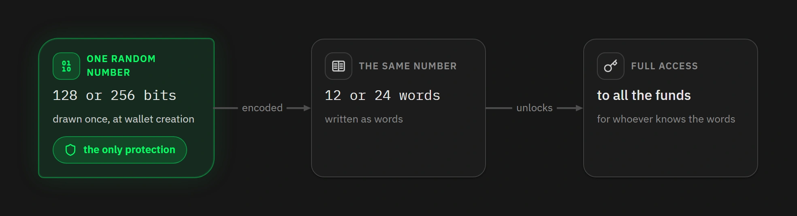

为了安全地生成这个数字（确保获得这种统计学不可能性），签名设备（也就是所谓的 “硬件钱包”）装有一个 TRNG（真随机数生成器），是一种采集真实的物理噪声的硬件，比如电路中的热噪声或者两个振荡器（oscillator）之间的相位抖动（phase jitter）。这是真正的随机性，不可能复现。

而 PRNG（伪随机数生成器）则相反：它是一种完全确定性的算法。你给它一个初始值，它就会吐出一长串的数字，呈现出随机性的统计学特征。但相同的初始值总是能产生完全相同的一串数字。PRNG 不会创建熵（随机性），它只是将种子的熵分散到一个更长的输出中。

记住这个区别，因为所有其它推理都依赖于这一点：TRNG 会收集随机性，但 PRNG 只会转发你在一开始交给它的随机性。如果交给它的种子具有 32 比特的随机性，它的输出也就只有 32 比特的随机性，虽然从长度上看更长一些。

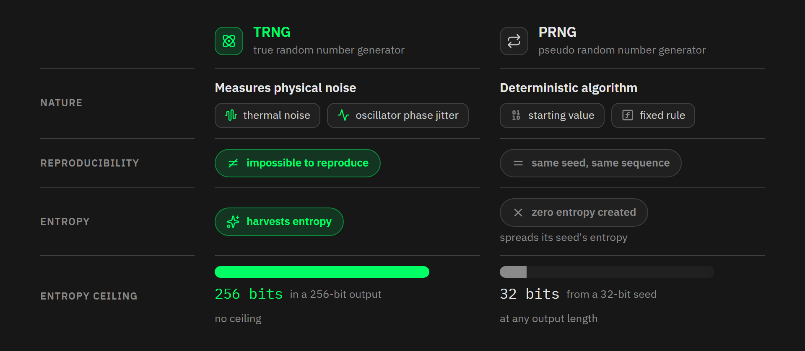

### TRNG 一直在那里，但没有调用它

这就是问题的核心。Coldcard 签名器中的 STM32 芯片确实包含一个 TRNG，并且它工作正常。只是，在生成种子词之前，它完全没有被使用过。

想搞懂我们是怎么得出这个结论的，你必须逐一分析它的调用链条。

> **这些代码来自哪里**？来自三个公开的代码库：固件本身，来自[Coldcard/firmware](https://github.com/Coldcard/firmware)；它所调用的密码学库，[switck/libngu](https://github.com/switck/libngu)；以及运行它们的 MicroPython 语言复刻版本，[Coldcard/micropython](https://github.com/Coldcard/micropython) 。下文中引用的所有东西都来自版本编号为 `bcc2c382` 的固件，是 7 月 31 非常发布的紧急修复之前的最后一个版本，它指向编号为 `537519a8` 的 libngu 以及编号为 `4107246f` 的 MicroPython 。

所有一切都从 `shared/seed.py` 开始，这个函数会建立一个新的种子：

（译者注：下文代码块中的所有中文注释皆为译者所加，是对英文注释的翻译。）

```python
def generate_seed():
    # Generate 32 bytes of best-quality high entropy TRNG bytes.
    # 生成 32 字节的最佳质量的高熵 TRNG 字节

    seed = ngu.random.bytes(32)
    assert len(set(seed)) > 4       # TRNG failure / TRNG 故障

    # hash to mitigate any possible bias in TRNG
    # 哈希以缓解 TRNG 中可能出现的任何偏倚
    return ngu.hash.sha256d(seed)
```

这里的注释承诺了要使用直接来自 TRNG 的最高质量的字节。但我们看下一行。 `ngu.random.bytes` 是用 C 语言实现的，位于一个叫做 `libngu` 的自建密码学库中：

```c
void my_random_bytes(uint8_t *dest, uint32_t count)
{
    uint32_t last = 0;

    while(count) {
        uint32_t chip = CHIP_TRNG_32();

        if(chip == last) {
            // maybe TRNG is not clocked? Fail hard
            mp_raise_OSError(MP_EFAULT);
        }
        last = chip;

        chip ^= my_yasmarang();

        int here = MIN(4, count);

        memcpy(dest, &chip, here);
        dest += here;
        count -= here;
    }
}
```

这里的逻辑是可靠的：取一个来自芯片的硬件生成器的数值，然后将它与一个内部的 PRNG 的输出运行 XOR（异或）运算；这是一种标准的加固操作。问题在于，`CHIP_TRNG_32()` 到底取的了什么。答案依然在 `libngu` 库中：

```c
#ifdef MICROPY_PY_STM
// ports/stm32/rng.c
extern uint32_t rng_get(void);
# define CHIP_TRNG_SETUP()      
# define CHIP_TRNG_32()         rng_get()

# ifndef MICROPY_HW_ENABLE_RNG
# error "get a HW TRNG plz"
# endif
#endif
```

所以，我们追踪到了 `rng_get()` ，这是一个 libngu 自身并没有明确定义的函数，是从 MicroPython 变成语言中取来的；MicroPython 也负责运行固件。这就是所有一切崩溃的地方。

Coldcard 签名器将 MicroPython 的随机性模块替换成了自己的，可以认为是更加保守的。为此，它禁用了 `stm32/COLDCARD/mpconfigboard.h` 中的原来的那个：

```c
// We have our own version of this code.
// 关于这段代码，我们有一个自己的版本。
#define MICROPY_HW_ENABLE_RNG       (0)
```

这个补丁的意思是，当这个标签值为零的时候，MicroPython 不会移除 `rng_get()` 。只是替换成了一个软件仿制品：

```C
#if MICROPY_HW_ENABLE_RNG
uint32_t rng_get(void) { ... return RNG->DR; }         // real physical noise 真实的物理噪声
#else
// For MCUs that don't have an RNG we still need to provide a rng_get()
// function... A pseudo-RNG is not really ideal but we go with it for now
// 在没有随机数生成器的微处理器上，我们依然需要提供一个 rng_get() 函数
// 伪随机数生成器并不理想，但现在只能这么干了
uint32_t rng_get(void) { return pyb_rng_yasmarang(); } // a software PRNG 一个软件 PRNG
#endif
```

这个备用路径是为没有 TRNG 的芯片准备的。但 Coldcard 签名器有。它为一个毫无关系的理由禁用了这个标签，然后悄悄地继承类一个为别的硬件设计的备用机制。

结果是：本应混合物理噪声和一个 PRNG 的操作，实际上混合了两个软件 PRNG 。换句话说，（在使用这些固件时）Coldcard 签名器所生成的种子完全不包含来自物理世界的随机性，哪怕一比特都没有。

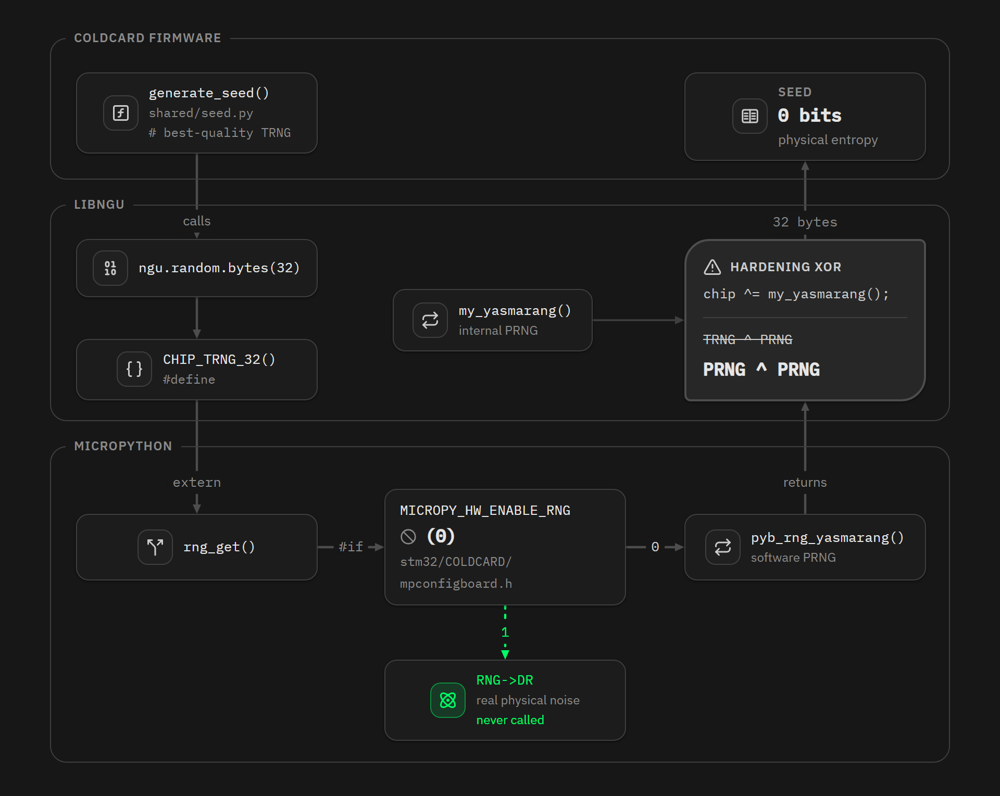

### 以为会生效的把关措施

libngu 的开发者预料到了这个情形。他们添加了一个编译时检查，如果检测到硬件 TRNG 不可用，就拒绝编译固件：

```c
# ifndef MICROPY_HW_ENABLE_RNG
# error "get a HW TRNG plz"
# endif
```

不幸的是，`#ifndef` 检查的只是一个宏（macro，C 编程语言概念）是否存在，而不是它是否为真值。这个宏确实存在，只是数值为 0 。所以检查会悄无声息地通过，在每一个固件上都如此，足足超过 5 年时间。这个把关措施离达到目标只有一字之差：使用 `#if` 而不是 `#ifndef` ，就能启用正确的检查。

### 真正投入生成器的东西

现在，一切都取决于两个 PRNG，那么问题变成了：投入它们的初始值是什么？

第一个，libngu 的 PRNG，从一个硬编码在源代码中的常量开始，在每一台 Coldcard 上都一样：

```c
static uint32_t yasmarang_pad = 0x0a8ce26f, yasmarang_n = 69, yasmarang_d = 233;
static uint8_t yasmarang_dat = 0;
```

它贡献的熵量：0 。完全没有。

第二个，MicroPython 的 PRNG ，是这样初始化的：

```c
pad = *(uint32_t *)MP_HAL_UNIQUE_ID_ADDRESS ^ SysTick->VAL;
n = RTC->TR;
d = RTC->SSR;
```

直说吧：芯片的唯一标识符，结合启动次数计数器，加上时间和生成时刻的内部时钟的亚秒数值。芯片的 ID 从未有意成为一个秘密值，它是完全可以读取的，并且它的每一位数字都是结构化的，编码了批次编号、晶圆号以及圆上位置坐标。这不是 96 比特的随机性，远远远远达不到。

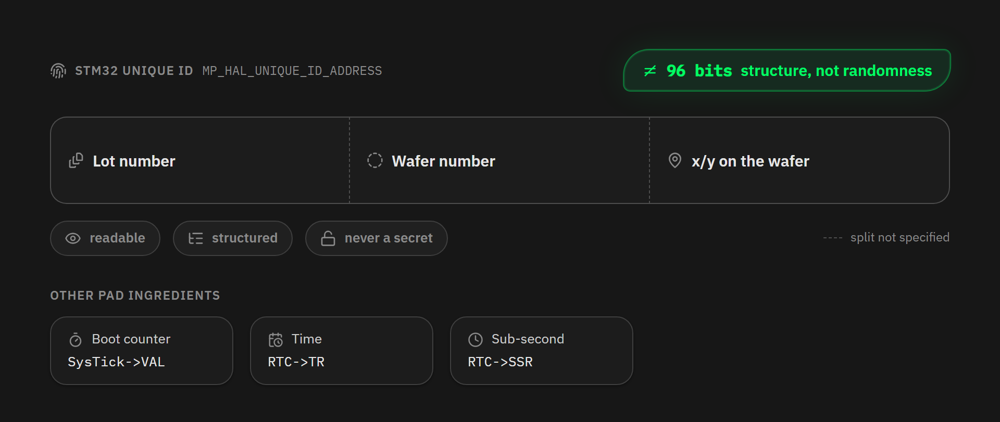

因此，在 Mk3 上，搜索空间缩减到了几十个比特（而不是 256 比特）。在现实中，这意味着攻击者可以枚举可能的种子、计算出相应的地址，然后根据区块链来判断其中是否有资金。根本不需要拿到你的设备。

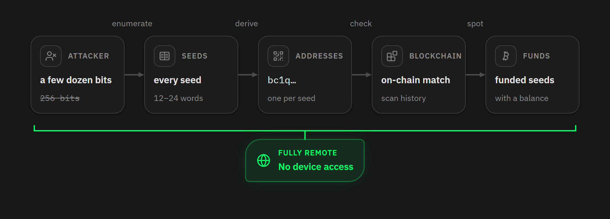

### 广告中的设计与真实的代码

从宣传页看，Mk3 的随机性只有一个来源：微处理器的 TRNG，与一个内部 PRNG 运行 XOR，然后按条件调用 SHA-256 。这是一种合理的设计，也能达到设计目标。熵只能来自一个地方，一切都取决于那一次调用是否真的发生。

但没有。而且 Mk3 没有任何备用方案：它只有一个安全芯片，而且那时候的固件没有从中读取随机数的功能。

为什么这个缺陷一直没有被人注意到，说明书可以提供一种解释。Mk3 时代的主要设计文档，介绍了 PIN 安全性，但完全没有讨论熵和 TRNG 。它唯一提到随机性的地方，是安全芯片会为 挑战-应答 协议生成 nonce ，作为一种抗重放措施（anti-replay measure）。种子词的熵从未作为设计目标而出现，也没有声明，而是当成一个实现细节。

“TRNG” 倒确实出现在这个时期的说明书的别的地方，但只是一笔带过，从而作为种子生成路径的详细描述。其中一个表述与代码是无声的矛盾：“Seed XOR” 这一页声称随机分割模式会从 “Coldcard 签名器的真随机数生成器” 取得字节，但从 2021 年开始，就不再如此了，并且再也没有变过。人们今天引用的三 TRNG 架构来自 Mk4 说明书。

不论如何，结果是一样的。没有明文要求种子的熵必须从哪里获取，所以实现也没有原则可以违反，审计代码的人也没有什么可以作为依据。

Coinkite 公司的事后报告逐一确认了这个故障链条，并且报告的措辞直白到我们都不敢想：大部分的随机性都来自一个他根本不知道其存在于代码库中的 PRNG ，因为这个 PRNG 是从一个子模块输送过来的；精心编写的 TRNG 代码虽然被使用了，但只是偶尔使用、用在不那么重要的事项中。关于把关措施，他解释说自己把这个宏设置为 0 ，以为这意味着两种实现都不会被编译，但并非如此。

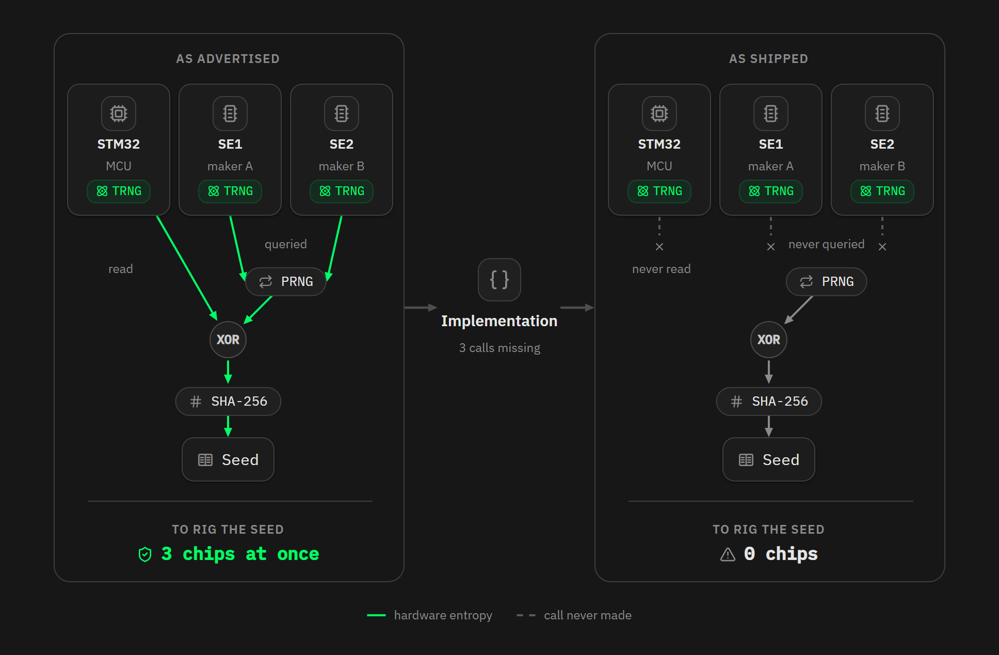

### 退化何时出现

这一转变可以精确地追溯到具体日期，它来自 `b18723dd` 号代码提交，日期是 2021 年 3 月 1 日，标题是简洁的 “First pass w/ libNgU”（使用 libNgU 的第一次提交）。转向 libngu 库，也将把种子词生成从一个直接的硬件调用换成了这个新的调用链条。

在此之前，在固件 3.2.2 以及更早的版本中，代码是这样的：

```python
seed = bytearray(32)
rng_bytes(seed)
```

这个 `rng_bytes` 函数会直接读取硬件生成器的注册器。事实上，这个函数在固件的其它地方仍有使用，比如备份加密，也总是能正确工作。所以 TRNG 没有损坏：只是种子词生成（也只有种子词生成）完全不使用它。

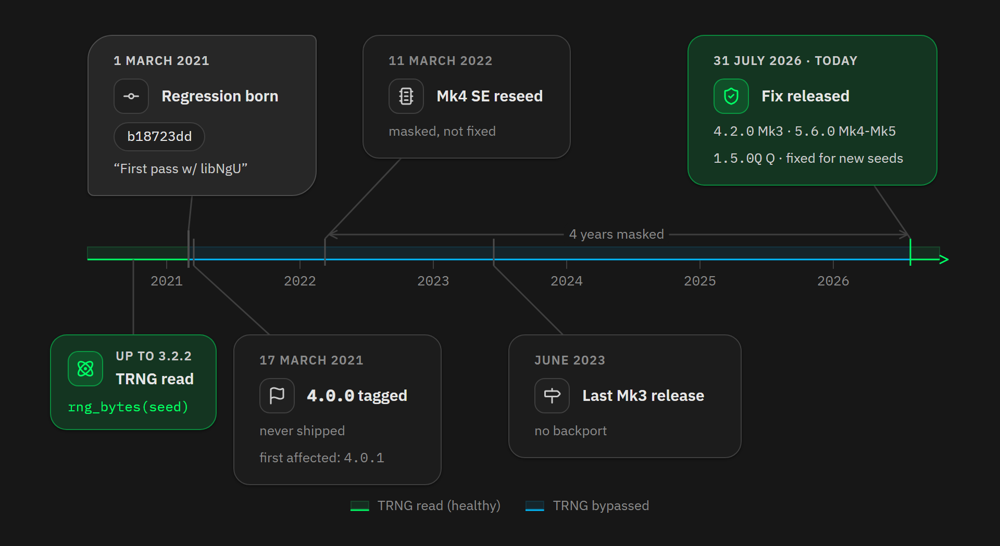

### 为什么 Mk4、Mk5 和 Q 受影响小一些

在 2022 年 3 月 11 日，两次提交向固件添加了一个函数：

```python
def rng_seeding():
    # seed our RNG with entropy from secure elements
    # 将来自安全芯片的熵投入随机数生成器
    import callgate, ngu, ustruct

    a = callgate.read_rng(1)        # SE1
    b = callgate.read_rng(2)        # SE2

    n = ngu.hash.sha256d(a+b)
    n, = ustruct.unpack('I', n[0:4])

    ngu.random.reseed(n)
```

在启动时，设备会查询两个安全芯片、哈希它们的输出，然后将结果投入 PRNG 。它们是真实的硬件随机性，相较于 Mk3，就改变了一切。

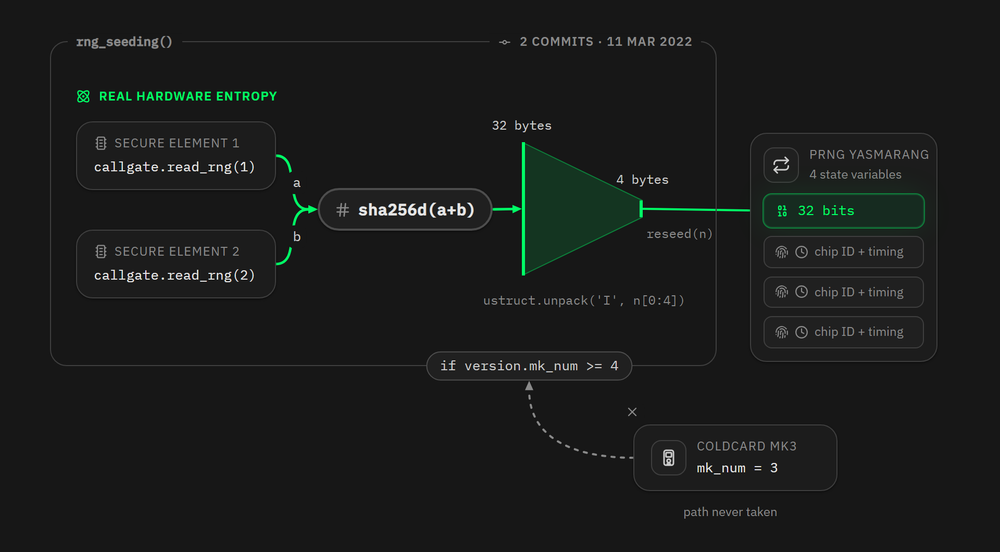

不过，还是要指出三个问题。

其一，`ustruct.unpack('I', ...)` 这个函数只会取 4 个字节。注入的熵只有 32 比特，而 `reseed()` 只会用它来覆盖生成器的四个状态变量中的一个。

其二，这个函数放在一个检查的后面：`if version.mk_num >= 4`，并且这是故意的。`rng_seeding()` 会同时读取安全芯片 SE1 和 SE2，而 Mk3 没有 SE2 ，所以这个调用在 Mk3 上完全无法使用。它从来就不是没有给 Mk3 装上的修复措施，而是只有较新的硬件才能承载的额外一层。

其三，代码提交的描述是很温和的，“使用来自两个安全芯片的随机数，给 RNG 提供随机性”，并且变更日志中没有出现任何安全修复条目。一切都表明，这只是偶然的加固措施，而不是对同一漏洞的修复，而 Coinkite 公司也确认了这一点，他们说：“我们一直到今天才注意到这个漏洞” ，并将安全芯片混熵说成是 “一个备用措施的备用措施” 。问题的根源从未发现，在任何款式上都没有，这就是为什么 Mk3 的超过 4 个新固件（一直更新到 2023 年 6 月）都带有这个致命的漏洞。这个偶然的额外层只是掩盖这个问题掩盖了 4 年。

那么对这些签名器款式来说，意味着什么呢？Coinkite 公司的事故报告称 Mk3 有缺陷种子词的实质搜索空间大约是 40 比特，在 Mk4、 Mk5 和 Q 上则大约是 72 比特，两个数字都显然是粗糙的。提供一些背景：在普通硬件上搜索 40 比特的空间只要几个小时，72 比特超出了业余人士的能力，但无法应对财力雄厚的攻击者 —— 而设计目标是 128 比特。

Block 公司的工程团队对 Mk4 的批评更为严厉。他们的分析指出，上述 reseed（“种子重新采集”）方法并没有采用来自安全芯片的输出的完整哈希值，也没有形成一个密码学 DRBG（确定性随机比特生成器），也没有重新采集 MicroPython 那一部分的备用措施的种子，也没有重设其它 Yasmarang 状态词。在这些设备上，安全芯片的贡献被限制在 2^32 种可能性，平均来说攻破它们需要 2^31 次尝试。

这个 “72 比特” 的结论，是假设攻击者既不知道芯片的 ID，也不知道启动的次数。如果一个攻击者可以匹配这两个数字 —— 对于被针对的受害者来说，并不是异想天开的假设 —— 那就只剩下 32 比特的熵，来自种子重新采集，只要 2^32 次搜索就能穷尽。所以，诚实的说法是，Mk4、 Mk5 和 Q 的攻击成本介于 “昂贵” 和 “便宜” 之间，取决于攻击者对你的设备掌握了多少信息，而且不论如何都远远少于 128 比特。

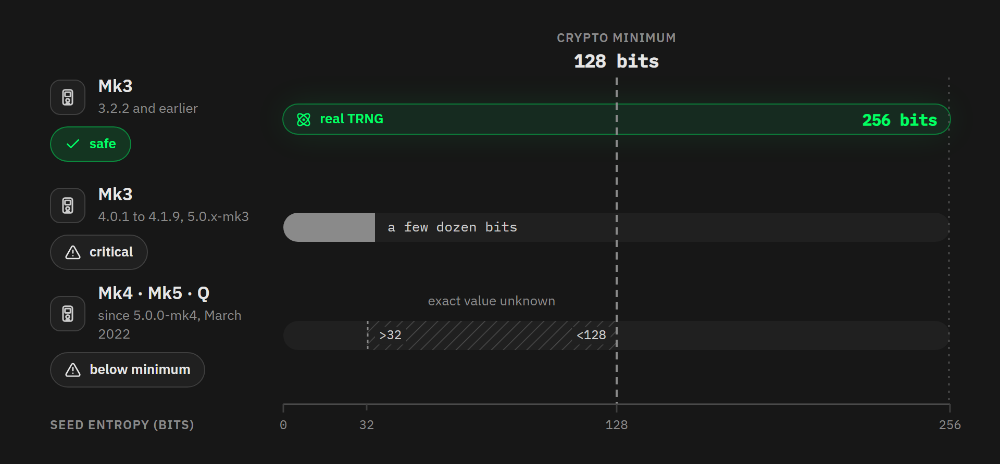

## 章节 3：谁受到了影响

以下是按型号和固件版本区分的风险状况：

| 款式       | 固件版本                           | 状况                             |
| :--------- | :--------------------------------- | :------------------------------- |
| Mk1        | 3.0.6 max                          | 不受影响，无法运行受影响的固件   |
| Mk2 和 Mk3 | 3.2.2 及更早版本                   | 安全，种子来自真实的 TRNG        |
| Mk2 和 Mk3 | 4.0.1 到 4.1.9                     | 致命，种子词的熵只有大约 40 比特 |
| Mk3        | 5.0.1-mk3 和 5.0.3-mk3             | 致命，熵只有大约 40 比特         |
| Mk3        | **4.2.0 及后续版本**               | 事后修复                         |
| Mk4        | 5.0.0-mk4（2022 年 3 月） 到 5.5.x | 脆弱，熵只有大约 72 比特         |
| Mk5        | 截止 5.5.x 版本（版本与 Mk4 相同） | 脆弱，熵只有大约 72 比特         |
| Mk4 和 Mk5 | **5.6.0 及后续版本**               | 事后修复                         |
| Q          | 截至 1.4.x 版本                    | 脆弱，熵只有大约 72 比特         |
| Q          | **1.5.0Q 及后续版本**              | 事后修复                         |

Mk1 不受影响，也无法受影响。它的最新一款兼容固件是 3.0.6 版本，发布于 2019 年 12 月，安装任何更新的固件都会导致设备变砖。退化在 15 个月以后（4.0.0 版本固件发布）才会到来。所以，Mk1 停留在一个依然直接读取硬件 TRNG 的版本上。

版本 4.0.0 在 2021 年 3 月 17 日发布，已经包含了退化的代码，但没有出现在签名的 minifest 中，所以从未发行过。因此，第一个受影响的公开版本是 4.0.1 。在 2022 年 1 月发布的  5.0.0 版本还不包含种子重新采集，但也从未发布。从实际交付给用户的第一个 Mk4（2022 年 3 月）开始，就一直带有种子重新采集机制。

不要把 Mk4、Mk5 和 Q 当成不同的情形。在核心逻辑上，它们都使用同一款固件，也包括种子词生成，所以对一者成立的事情，对三者都成立。

至于 TAPSIGNER、OPENDIME 和 SATSCARD，Coinkite 公司声称它们不受影响。它们的架构确实完全不同：它们不建立在 MicroPython 基础上，而漏洞就来自一个 MicroPython 编译标签。不过，因为代码是专有的，我们不能声称这些设备是安全的。

关键是，安装修复版本的固件**无法**保护已经生成的种子词。它只是让安装修复固件后在设备上生成的**新**助记词是安全的。

### 特殊情形

光凭固件版本无法告诉你一切，还取决于 5 件事情。

如果你在一个 Coldcard 签名器上生成了种子词，然后将它导入到了别的地方（任何其它品牌的硬件签名器），那是受到的影响是一样的，没有任何区别。是种子词本身有缺陷，跟它放在哪个设备上无关。

如果你是单靠一个均匀的骰子生成了种子词，那么你是安全的。这个功能会以你输入的骰子点数序列运行 SHA-256 ，不会使用有故障的随机数生成器。一个完全均匀的六面体骰子，每投一次就能提供 2.585 比特，所以投掷 50 次就能达到 128 比特的随机性，而 99 次能达到 256 比特的随机性。

Coinkite 公司的事后报告将 “**至少 50 次均匀、独立且私密的骰子输入**” 当作例外情形，认为这样生成的种子词是不受此次 RNG 漏洞影响的。这三个形容词非同小可。“均匀” 意味着这个骰子不会偏向某个点数。“独立” 意味着你每一次都重新投了，而不是投一次输入几个。“私密” 意味着没有别人看到你投、没有人录像，你也没额外记录，因为别人看到的随机数就不再是随机的了。

**如果你没有投到 50 次，那就默认你依然有风险。**

只要你在设备生成种子词的时候使用了混合骰子点数的选项，你就增加了真实的熵。这真的能保护一些 Mk3 的用户。这也正是这个选项的用意：如果设备的随机数生成器有故障，你可以自己注入熵；而如果你的骰子不是均匀的、或者你误输入了，设备的生成器又能给你缓冲垫。

如果你设置了一个强大的 BIP-39 Passphrase（密语），也就是足够长、足够随机的，你也是受保护的。但是，谨慎一些，不要高估这种保护：BIP-39 派生依赖于 PBKDF2-HMAC-SHA512 哈希函数，仅仅迭代 2048 次。一旦种子词本身被知晓，测试一些可能的密语几乎是没有成本的。

作为一个普通用户，**请假设你的密语并不安全**。即使你的资金还没有被盗，低熵的种子也将很快被（大规模）搜索得到。

最后，如果你的种子词只存在于纸上或者不锈钢板熵，你无法确定它是用什么设备生成的，你必须假设它可能来自一台有漏洞的 Coldcard 签名器。这个原理也适用于从备份复原到其它钱包 软/硬件（不论什么品牌）的种子词。当前持有种子词的设备并不决定它来自哪里。漏洞来自种子词本身，其他人帮你搭建的钱包、几年前写下的备份、你已经卖掉或丢掉的设备，只要你无法确认种子词的来源，就要假设自己有风险。

这是无法补救的漏洞。来自 256 比特物理噪声的 24 个词，跟来自一个计数器的 24 个词，在外观上根本无法区分，你也没有可以将它们区分开来的测试。所以怀疑在这里不是坏事。**只要是你无法确认其来源的种子词，就应该当成是有风险的**，然后安装下文的建议迁移。

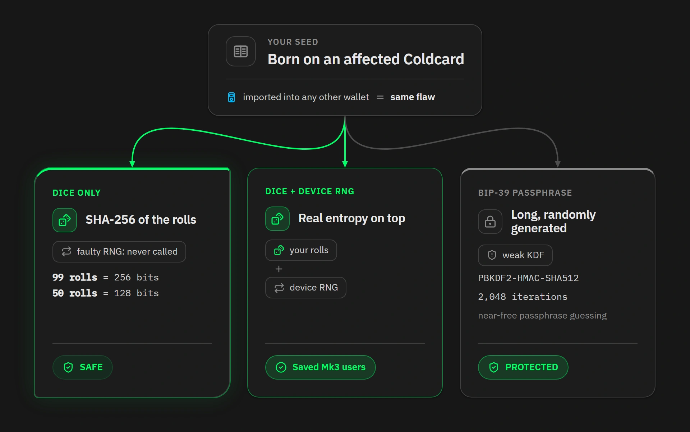

## 章节 4：应该做什么

本章节不适合 LIANA 用户；对其它多签名钱包的用户来说，处理流程也要更加复杂。如果是你是这两类用户，请回到本文的章节 1 学习如何处理。

### 步骤 1：判断自己的情形有多紧急

马上行动，不要等到明天，只要你的种子词是从 Mk2 或 Mk3 生成的、当时的固件版本大于 3.2.2、没有自己悄悄投 50 次骰子。单凭有缺陷的种子就能达到花费阈值的多签名装置也是一样的道理、从这些有漏洞的设备生成了然后导入到别的地方的种子也是如此。从安全性角度看，可以假设你的密语是不安全的，只是多给了你一些时间来应对。

如果你用的是 Mk4、Mk5，固件版本小于 5.6.0，或者 Q，固件版本小于 1.5.0Q ，单签名钱包，或是 Coldcard 种子词数量已达到多签名装置的花费阈值，那么也应该立即转移资金。因为 PRNG 的确定性，72 比特可能是高估了安全性（多方估计实际安全性在 50 到 60 比特之间）。虽然难以知道这些种子词多快会被发现，我们假设**在几个小时以内**，快速计算机就能大规模搜索出来。具体速度完全取决于攻击者能够获得多少计算资源。

如果你的种子词是完全从掷骰子生成的，或者你使用了一个**很长的真正随机的**密语，或者它不是从 Coldcard 签名器生成的，那么你不需要做什么。

### 步骤 2：选择把资金转移到哪里

Coinkite 公司给出的建议是将设备升级到修复版本的固件，然后在更新后的 Coldcard 签名器上生成一个全新的种子，然后将资金迁移到新钱包。这条路是可行的，并且，在修复后的固件上，设备生成的种子词又是可靠的了。更新固件之后，掷骰子就成了可选项，不是必选项；是否使用密语，也是一个单独的决定，不是对抗漏洞的必要措施。

情况非常紧急，所以最简单的选择是（按优先性排序）：

1- 迁移资金到另一个品牌的、你以前已经设置好的签名设备

2- 如果你有多个签名设备，建立一个 Liana 钱包

3- 如果你没有别的签名器可用，在 Coldcard 签名器上掷骰子生成新的种子词

4- 将资金转移到使用热密钥的软件钱包。可以是 几台手机 或者 手机+电脑 的多签名钱包。这是不安全的，但应该足以应付一时之需

我们不建议你将资金转移给托管商，除非你已经定期使用他们的服务。

时间非常紧迫，最好使用你已经设置好的设备。

### 步骤 3：不要病急乱投医

恐慌常常是人们弄丢比特币的原因，常常比危机本身更有害。即便时间紧迫，也要遵循良好的操作习惯。

妥善地备份种子词，以及（如果你有的话）你的密语，放在耐久的材质上，放在你能把控的地方。

先进行钱包复原演练、再把钱存进去。清空设备、从备份复原、然后检查地址有无发生改变。这是能够确认你的备份的完整性的唯一办法。

在转移资金时，在签名交易的 Coldcard 签名器的屏幕上验证收款地址，并提前确认这个地址真的属于你的新设备/新钱包（可在新设备的屏幕上验证）。不要信任一个只能显示在电脑屏幕上的地址。

保管好旧钱包的备份，直到迁移完成。旧的种子词有缺陷，但依然是控制你的旧钱包的唯一方式。

最后，小心诈骗，在接下来一段时间里必定层出不穷。一些人会利用你的恐慌来骗你交出种子词。不要安装你在慌乱中发现的软件，不要从没有名号的经销商购买设备，也不要听信任何用社交媒体私人信息直接找上你并表示可以给你帮助的人。合法的支持团队不会让你交出自己的 12 词/24 词 助记词。骗人的 “找回服务” 才会这样做，他们说会帮你追回资金、只收一点点手续费，然后你会再亏进这笔手续费。

### 如果你已经被盗了

Coinkite 公司表示，他们会协助受影响的用户报警、发起保险理赔或自主调查，并且他们会为你的损失提供一个书面的事故总结，包含他们能够分享的交易数据。他们也说，他们正在与链上调查机构合作，愿意配合任何执法机构。

记录你被盗之前的所有事情：盗窃的交易 ID、受影响的地址、你的设备的款式以及固件的版本，以及大致其种子词是何时、如何生成的。

## 章节 5：连锁反应

这个漏洞的影响并不局限在你的比特币会被盗窃。

### 种子故障即一切故障

所有派生自你的种子词的东西，都会天然继承它的缺陷。

比如 **BIP-85 密钥**，因为它们是确定性派生的。并且，从 BIP-85 密钥中，设备又可以产生 12 词、18 词、24 词的助记词组、WIF（钱包导入格式）密钥、XPRV（拓展私钥）、以及 32 比特、64 比特的数据块和**登录口令**。在实际环境中，这意味着你的 **Nostr 私钥**、你的**闪电节点种子词**、你的 **SSH 密钥**以及你这样生成的邮箱或交易所账户口令，都需要替换。

对于通过标准的 BIP-85 流程生成的、带有欺骗性 PIN 码的胁迫钱包（duress wallets）、以及 microSD 卡 2FA（双因子身份认证）（其加密密钥派生自种子词），都是如此。

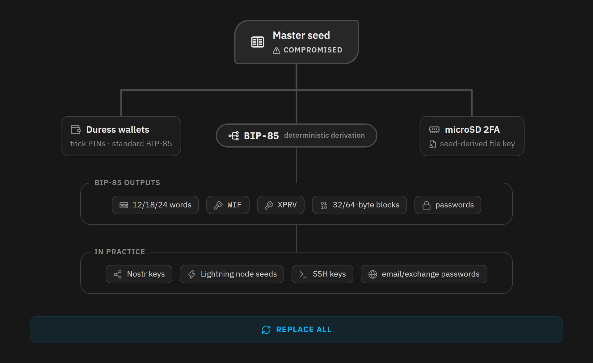

### 种子之外，还有哪些故障

这部分故障更加恶劣，因为它甚至会伤及那些操作习惯良好、并且从骰子生成种子或导入来自正确熵源种子词的用户。这些特性都直接来自有故障的随机数生成器，完全没有用到你的种子词。

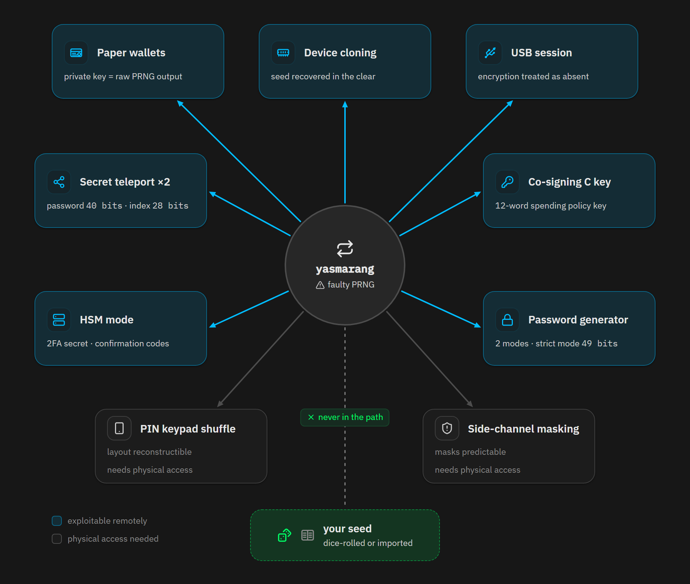

“**纸钱包**” 是最令人担心的情形。创建它们的函数需要一个密钥对，但不需要提供用户的种子词，也就是说， 它们完全是来自有故障的随机数生成器的字节 ——  纸钱包的私钥就是 PRNG 的输出，它跟你的种子词毫无关系。也就是说，从 2021 年开始，在 Coldcard 签名器上生成的每一个纸钱包，都带有可以枚举的私钥，除非是你用投骰子生成的。这些密钥是单独的，通常会被打印出来、送给别人，或者放在保险箱里。今天拿着它们的人也许根本不知道它们来自哪里。

“克隆到另一个设备” 功能也出故障了。这个机制依赖于两台 Coldcard 签名器实施一次临时的密钥交换，通过 SD 卡，从密钥交换中派生出转移方的加密密钥。因为这些临时密钥来自有故障的生成器，任何拿到克隆文件的人，都能重新计算出这些临时密钥，然后再次运行密钥交换、解密克隆文件，然后复原出钱包种子词，**哪怕这些种子词是骰子生成的也无济于事**。

Coldcard 签名器与电脑之间的加密 USB 会话也依赖于同类的临时密钥。不过，这不意味着连接 Coldcard 就会导致种子词被盗。

**Coldcard 签名器的联合签名特性**（C key），是由设备持有的 12 词，用于强制执行花费条款，也来自有故障的随机数生成器。

Secure Notes 和 Passwords 内置的口令生成器，也在两种模式中会受影响。生成口令的模式跟种子词生成建立在同样的函数基础上。用于高要求网站的模式，在代码注释中声称其熵预算有 49 比特 —— 在我们考虑本次发现的漏洞之前，这个随机性也已经很小了。不过，这些口令所保护的账户可能跟比特币毫无关系。

两种秘密值传输机制都有缺陷。用于在两台设备间传输一个种子词的口令，在设计上是 40 比特，也取自有故障的生成器。参与多签名的各联合签名器之间的信息交换，依赖于一个 28 比特的派生索引号，也是可以预测的。

在 HSM（硬件签名模块）模式中，目标应用场景是需要自动签名的组织，但第二个因子的共享秘密值核本地确认码，都来自同一个有故障的生成器。因此，第二个因子无法阻挡攻击者，在场证明（proof of physical presence）在远端就可以猜测出来。

还有两个小点需要补充。在输入 PIN 码时，设备会使用一个随机化的键盘布局，这是为了对抗偷窥和消除屏幕指纹线索，但是这个布局也是可以重构出来的。而且，这个密码学库用于对抗侧信道侦测的掩码，也是可以预测的，所以是没有用的。这最后两个弱点，如要利用，前提是实际劫持签名器，所以严重性不及前述各项。

最后，还要提一提 “种子 XOR” 。默认情形下，这个特性是确定性的，应该不受影响。但是，还有一个客户可以主动选择的随机模式，会调用有故障的生成器。在这种情况下，在双向分割（2-way split）情形中，第一部分碎片是来自生成器的掩码，第二部分碎片是结合了掩码的你的种子词。持有第二个碎片的攻击者可以重新计算出掩码，然后恢复出种子词，即便 “种子 XOR”的承诺是需要凑齐两半才能复原出来。讽刺之处在于，屏幕上显示该选项为单独的 “使用 TRNG” 选项，但它恰好是不使用 TRNG 的选项。也就是说，这只会让没有缺陷的种子词在特定模式中受影响，这还是一种罕见情形。

### 隐私性

从 2021 年以来在 Coldcard 签名器上生成的任何种子词，都应该当成是公开的数值。只要种子词是公开的，那么它所生成的钱包的完整交易历史，就也是公开的，可以追溯，也永远如此。

这个问题值得关注的原因在于其次生灾害，可能会危及那些从未拥有过 Coldcard 签名器的人。在一个 coinjoin 回合和一次 payjoin 中，你的匿名性取决于彼此之间无法区分的参与者的数量。如果其中一些人变得可以识别，你的匿名集就相应收缩。并且这种收缩是可以追溯的：从 2021 年开始的每一次混淆，都是如此，而且你今天已经毫无办法。

Coldcard 签名器并不原生支持任何 coinjoin 实现，但许多用户将资金从 Coldcard 签名器生成的钱包发送到了 coinjoin 软件，然后又发回来，在这个过程中，每个人的匿名性都降低了。最糟糕的是，从一个有风险的 Coldcard 签名器派生出 BIP85 助记词、然后导入 coinjoin 软件的用户，将会被完全关联起来。

未来还会有两种影响。区块链分析公司将获得一个巨大的地址集合，可以一次性打上标签，作为永远的信息源。而你的交易对手 —— 给你支付或接收你的支付的人 —— 也会有一部分交易图在其中暴露。

## 章节 6：如何降低自己遭遇这种风险的概率

当你确保自己资金安全之后，问题就转变成了：如何避免将来在另一个品牌上遭遇相同的风险？选择其实不多。

### 加入你自己的熵

第一种办法是自己提供一部分随机性，一般来说是输入投骰子的点数。这正是拯救了一部分 Mk3 用户的东西，而且 Coldcard 签名器还提供了混合选项，原理上来说是个好想法：如果设备的生成器出了故障，你的熵就补上；如果你的骰子有偏向或者你犯了错误，那么生成器可以作为补充。

不幸的是，很少有设备提供这个选项。而且还有一件事，也是真的：完全靠你自己生成种子词，对绝大部分来说都是个坏主意，因为非常容易出错。一家供应商的生成器出了故障，不足以成为事事都靠自己动手的理由。如果你要做，务必使用真正的骰子、投足次数。而且，不要自己闭门造车。

### BIP-39 密语

单签名钱包的第二选项，是添加一个 BIP-39 密语。它会在种子词之上添加熵（然后再生成私钥和地址），假定它是足够健壮的（足够长，并且是**随机取出的**）。这也保护了一部分 Mk3 用户。

密语的麻烦在于备份的方式以及笨拙的使用方式。安全地保存它并不容易，很容易犯错，然后就丢失所有钱币，尤其是在你不了解它的所有机制的情况下，尤其是在我们现在这种恐慌之下。在不明就里的情况下，密语让你更容易弄丢比特币，而不是保护它们。

### 多供应商搭建多签名，真正的解

这个原理来自安全为先的系统工程，叫做 “有差异的冗余”。为了能够对冲一种设计错误，重复使用一个模块是不够的；还必须设计不同的模块。这就是为什么一架现代民航飞机的飞行控制系统依赖于多台计算机，并且它们由多个团队分别开发，使用不同的处理器的不同的软件，从而任何一个错误都不至于一锅端。

用来自多个品牌的设备搭建的多签名也利用了相同的逻辑。在一个 2-of-3 钱包中，每个密钥都产生自一个建立在不同原理上的生成器：一个经过认证的安全芯片、来自多个工厂的芯片相互结合、 没有安全芯片但使用了多来源的熵池。这些设备各有各的硬件、固件和供应链。

因此，其中一个设备出现了熵生成故障，只会暴露一个密钥，这达不到花费你的多签名钱包的阈值。这就是我们今天的情形：光靠 Coldcard 种子词无法满足花费阈值的用户，在这次事件中不会丢失资金。

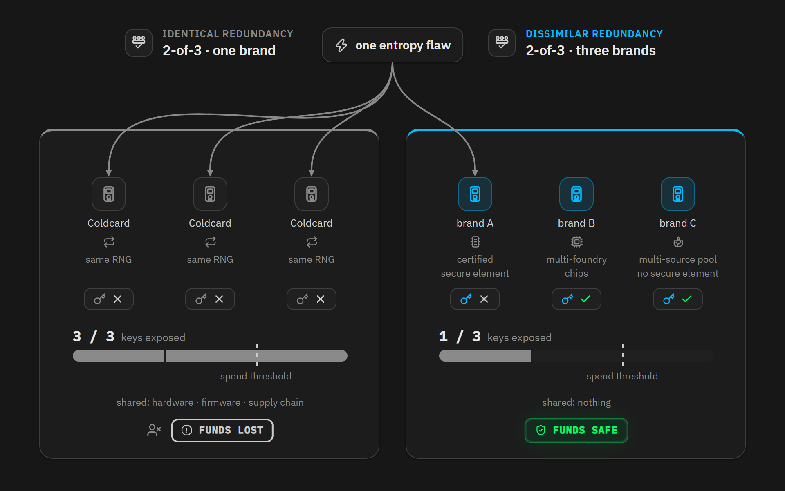

这就是我们推荐带有复原路径的多签名装置的原因。你可以用 [Liana](https://lianawallet.com/) 搭建这样的装置，放入来自多个品牌的签名设备。你既能防御这种故障，又能对抗丢失密钥的风险。只是要保证，**任何一条花费路径都不应该只用来自一个品牌的密钥就能满足**。

如果你是一个团体，或者保管超过 10 BTC 的高净值人士，请考虑使用 [Liana Business](https://lianawallet.com/business) ，我们专门打造的机构保管基础设施。

（完）