> *作者：TONY*
>
> *来源：<https://abytesjourney.com/lightning-privacy/>*
>
> *原文发布于 2021 年 3 月。*

闪电网络近来一直在增长，[在总计 20000 个节点中有约 11000 个活跃的公开节点](https://1ml.com/statistics)。除了近乎即时的支付，闪电网络还有隐私上的好处。然而，某些情况下，闪电网络无法保护隐私。

我想揭开其中一些情形。不是为了渲染对闪电网络的担心和恐惧（FUD），只是为了让人们尽可能知情，这样他们就能更隐私地使用闪电网络。本文的所有内容都基于公开知识，也都一定程度上为业内所知。我的尝试在于从更高的层面聚合这些关于闪电网络隐私性的话题。

每个人都有获得金融隐私性的权利，也有资格知晓这些情况。

## 闪电网络概览

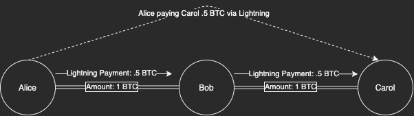

- Alice 通过她跟 Bob 已经开好的通道给 Carol 支付 -

我们简单回顾一下闪电网络。一个闪电网络节点会将一笔未花费的比特币交易输出（Bitcoin UTXO）锁入 TA 与另一个节点的一条通道中。这两个节点可以即时与对方交易，而无需将交易广播到区块链上。这种办法通常能拓展，使你能以同样的方式，跟你的对等节点连接到的节点（以及该节点连接到的节点 …… 等等）即时交易。

在一个多跳支付的场景中，最终的目标会收到一个不同的 UTXO 的一部分。就像我给了你一张 10 美元，让你交给你的朋友，而你回头给了你的朋友两张 5 美元（而不是我一开始那张 10 美元）。只不过在闪电网络上，整个过程由密码学保证，无需你信任你的朋友。

### 闪电网络的隐私性提升

在一笔多跳支付中，每一个节点都要给支付路径上的下一个节点支付。他们知道的只不过是谁要求他们路由一笔支付（谁是上家）以及这笔支付下一个要交给谁（谁是下家）。因为支付的[洋葱路由](https://wiki.ion.radar.tech/tech/lightning/onion-routing)属性，路由者并不知道后续的路径上都有谁，也不知道在 TA 之前都有谁参与了路由。包括也不知道谁发起了路由、最终目的地是哪里。

因此，闪电网络中的发送者拥有很好的隐私性。发送者知道目标节点是谁，构造了洋葱路由的支付后发了出去。即使是第一个参与路由接力的人，也无法肯定自己的上家就是最初的发送者（也有一些注意事项，放在下文的 “发送者” 一节中）。

接收者就没有同样的隐私性了。他们需要给予发送者特定的信息，使后者能发送支付。他们给出的信息可能暴露许多信息。

## 大纲

我会先从闪电网络节点在初始化阶段的隐私性基本情况讲起。然后是暴露在闪电通道中的链上隐私性。再然后，我会讲到发送者和接收者的隐私性，以及随着资金流动暴露在网络中的信息。

最后，我会讨论一些未来的闪电网络特性，既有最近开发好的，也有还未发布的。

在全文的所有讨论中，我都会推荐你可以使用的解决方案。最后，我会推荐一个理想化的设置，以及你今天可以使用的现实主义设置。

## 节点启动

### IP vs Tor

最重要的事情之一是你要先把自己的节点设置成仅可通过 Tor 来连接。

绝大部分（可能全部）家用的节点实现（比如 [Raspiblitz](https://github.com/rootzoll/raspiblitz) 和 [Umbrel](https://getumbrel.com/)）都会将你的节点设置成这种模式。原因之一是，这个设置在启动的时候更容易做，而且不需要端口转发（端口转发对大部分用户来说都是噩梦）。

虽然你可以事后再更改你的网络设置，但这些信息可能会被他人存档。你可以查看 [1ml](https://1ml.com/)，看看他们跟踪到的网络变更。

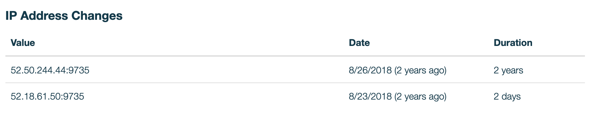

- https://1ml.com/node/030c3f19d742ca294a55c00376b3b355c3c90d61c6b6b39554dbc7ac19b141c14f/history -

把这些信息放到一个 IP 查找网站，我可以看到这个节点正在使用一个爱尔兰的 AWS 服务器。

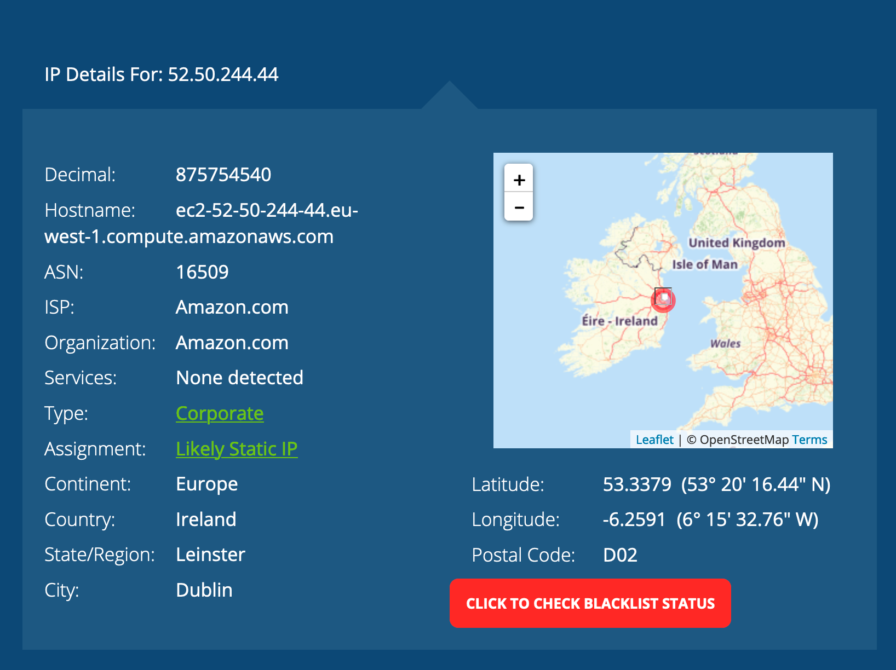

- https://whatismyipaddress.com/ip/52.50.244.44 -

如果你将自己的 IP 地址放到查找网站，它会显示你的 ISP（互联网服务供应商）以及你的大体地理位置。

无论你是托管在  AWS 服务器上，还是使用了家用电脑，你的私人信息都可能因法院的命令或者内部人而泄露。如果你坚持使用一个 IP 节点，请考虑使用全天在线的匿名静态 IP VPN，以保护你的 家庭地址/服务器 IP。

使用 Tor only 模式的一个不利之处在于，基于 IP 地址的节点将无法跟你开设连接。不过，你可以主动跟他们开设连接。根据 [1ml](https://1ml.com/statistics) 的数据，当前全网大概有 5239 个 tor 节点。

### 节点身份

**昵称（Alias）**

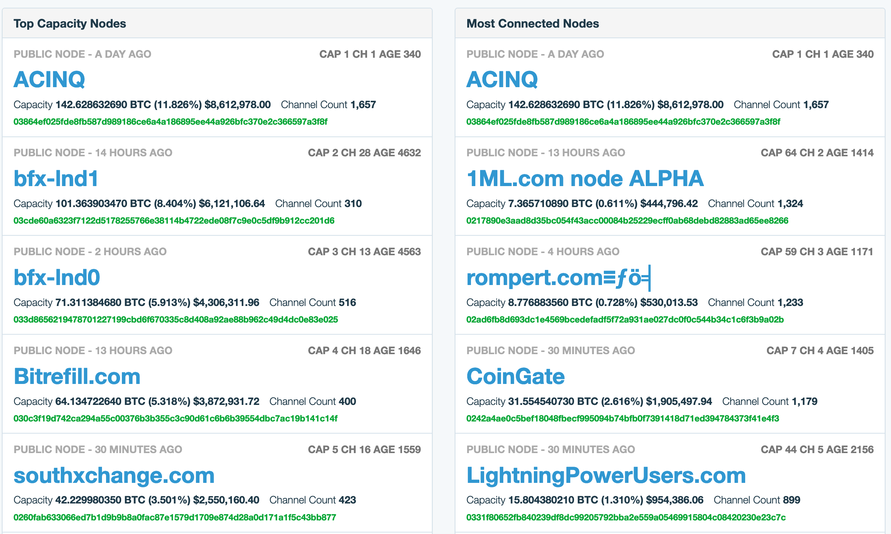

- https://1ml.com/ -

在你的节点中，你可以设置一个昵称（展示给对等节点），这也是为什么我们能看到对等节点的名字。如果你在用你的节点运营一项服务或者存储信息，你可能希望你的昵称包含多一些信息，这样别人才能记住你。

不过，如果不是的话，建议你不要选择可能跟你的真名有关联的昵称。如果你有假名，那可以考虑。我的提醒是，这就像在你的比特币地址上附加一个姓名，大多数时候你都不会想这么做。这会让你成为一个目标，因为节点的公开容量，UTXO 的信息，等等，都会展示给网络中的其他人（并且跟你的昵称可以关联起来）。

 **App**

节点的昵称在你开启一个公开通道的时候才会公开，但还有其它方式可能导致你的节点跟你的身份关联起来。

基于聊天的应用比如 [Sphinx Chat](https://sphinx.chat/) 是通过闪电网络将你的信息发送给另一个节点的（译者注：就像路由支付一样转发通讯）。这是非常酷的技术，我也很喜欢用。但是，它需要你链接一个使用 Sphinx 的节点，并且当你跟他人聊天时，他们会发送支付到你的节点。因此，他们可以看到你链接的节点的所有公开信息。Raspiblitz 正在开发一个[功能](https://github.com/rootzoll/raspiblitz/issues/2073)，可以在你运行节点的同一个设备上启动一个次级节点，可以跟 Sphinx 一起使用。我非常推荐使用这种功能，或者在你尝试在网络中使用新颖的应用时定期一个次级节点。Sphinx 当前允许你使用一个他们托管的节点作为替代，但请记住，因此他们可以跟踪和阅读每一条消息。

除了 Sphinx 这样的应用，也要留心任何要给你发送资金和知道你的身份的服务。不要把你的 XPUB（公钥）交给服务商，也不要提供你的节点身份信息。更多的解释在 “接收者的隐私性” 一节中。

不过，一个值得注意的例外是 [LNURL Auth](https://github.com/fiatjaf/lnurl-rfc/blob/master/lnurl-auth.md)。除了它是基于闪电网络的，它不会跟你的闪电网络节点有关联。每个网站都可以获得一个独特的 LNURL 标识符，所以它们不会跟其他人有关联。这是一种比电子邮件和手机号码好得多、隐私得多的登录方式。一个 LNURL 服务器可能仍想发送资金给你的节点，但就其自身，LNURL 是隐私并且无关联的。

## UTXO 以其在闪电网络中的使用

如我前面所说的，一个闪电网络节点必须跟另一个节点在通道中锁定一笔 UTXO。开设通道的交易就跟转移资金到一个多签名地址中的交易没有区别。这笔交易和这个多签名地址也不会暴露任何信息。不过，关于这个通道的信息则会在闪电网络中散播（如果它被设成一个公开通道的话）。通道的信息包括那笔开设通道的交易以及输出的索引（通道点）。

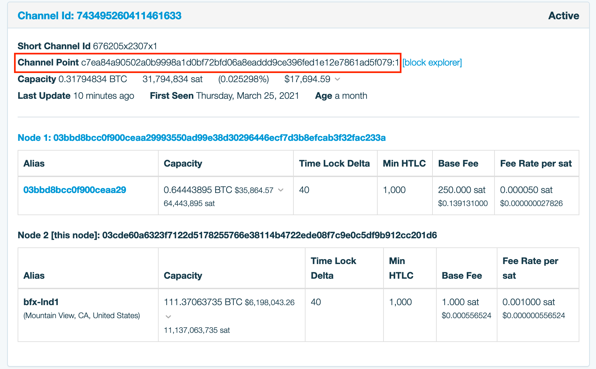

- https://1ml.com/node/03cde60a6323f7122d5178255766e38114b4722ede08f7c9e0c5df9b912cc201d6/channels -

“[私人通道](https://blog.bitmex.com/lightning-network-part-7-proportion-of-public-vs-private-channels/)” 的信息不会公开到网络中。如果一个节点想要把它公开到网络中，这个请求会因为协议的要求而被迫拒绝。

那么，我们来剖析一下 UTXO 在闪电网络中的使用。

### 用在公开通道中的 UTXO

许多关注隐私的比特币用户都知道，每次使用都生产一个新的比特币地址是一个良好的习惯。闪电节点也有同样的习惯，它会为普通的交易和新通道生成一个新的地址。如果你没法断定哪笔交易是一个开设通道的交易，你就没法把它跟某一个通道关联起来。然而，在闪电网络中传播的信息才是关联所在。

当你开设一个通道时，该交易会使用之前的交易输出作为输入，然后你得到了一个新的锁定的 UTXO。那么，其他人就可以（利用区块链分析）知道用来创建这个通道的资金来自哪里。*只观察* 通道的信息是不可能推测出 *哪个* 节点锁定了资金的。我们只知道是参与这个通道的两人中的其中一个（虽然你的对手知道不是自己，而且也可能在协议外公布这些信息）。也就是说，是有可能推测出哪个节点锁定了 UTXO 的。

注意，有了 [双向充值通道](https://bitcoinops.org/en/topics/dual-funding/)之后，双方可能都锁入了资金。不过，可以通过发起一个双向充值通道开设请求然后中途放弃，诱使一个节点暴露其 UTXO。如果这个 UTXO 后来用到了某个双向充值通道中，我们就知道了这个通道属于谁。

所以，当前，我们可以发现一个通道中哪个节点拥有被使用的资金，就是个 50/50 的概率猜测而已。但是，请设想一个场景，Alice 拥有一个从 Coinbase 交易所收到的 UTXO，并用它来开启了一个通道。那么，Coinbase 将知道 Alice 就是通道的开启人，因为他们可以跟踪用户在离开交易所之后做了什么。通道可能是 Alice 的，也可能是 Coinbase 代替 Alice 支付的对象。如果 Coinbase 担心其中的风险，他们可以询问 Alice 或者冻结 Alice 的账户（如果整件事足够可疑）。

另一种情形是，Alice 拥有一个 UTXO，然后她用其中的部分金额开启了一个通道、用找零开启了另一个通道，你可以合理假设两个通道都是 Alice 发起的。Alice 用自己的找零打开了另一个通道，这样我们就知道，这个通道里的 UTXO 属于她。一般情况下，一个使用部分金额来开启通道的节点会把找零发回给自己。

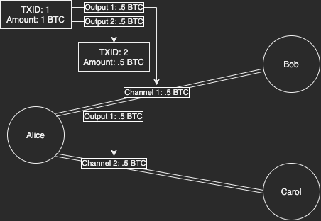

- Alice 使用 TX 1 打开了两个连贯的通道，揭示了她就是通道的开启者 -

在开启公开通道时，最好的时候，通道中的 UTXO 有 50% 的概率属于你；最糟糕的时候，人们可以 100% 断定这个通道中的部分或者所有 UTXO 都属于你。

因为整个闪电网络都能看到这些信息，你要把这些信息当成公开信息。区块链分析师和监管部门可能会利用这些信息。

解决方案：在开启公开通道时，使用跟你的身份无关的 UTXO，并把所有的资金都投入通道中。

### 私有通道也并不隐私

这个话题是一个有趣的[兔子洞](https://twitter.com/cycryptr/status/1384355046381473792?s=20)。“私有通道（private channels）” 这个名词的本意是，这种通道是不会在闪电网络中公开的。公众无法径直知道两个节点间存在一个通道，也不知道这个通道背后的 UTXO 是什么。只有你的通道对手必定知道这些信息。那么，我们来看看，为何未公开的通道实际上也不是隐私的。

对于入门者来说，你可能有许多理想想开启一个不公开的通道。你可能不想要其它节点利用你的通道来路由支付，因为你是个移动端用户，而且并不总是在线。你可能想隐藏你和对手在通道中锁入了多少资金。又或者，也许你跟对手已经有了一个公开的通道，但希望开设一个更大的私有通道，这样就只需使用私有通道来支付，不必让外人知晓了。但是，虽然通道信息被隐藏了，仍有可能通过余额探查技术来侦测这种暗影路由。

人们假想自己可以使用不公开通道的另一个理由是可以掩盖 UTXO。毕竟，标准的隐私习惯就是不要让你的 UTXO 彼此关联起来。但是，这种假设在许多情况下是不成立的。

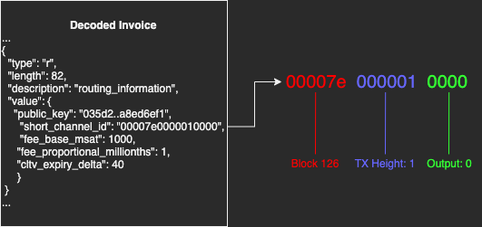

- 带有私人路由提示的发票将包含通道的 ID 并公开 UTXO 的信息 -

为了用私人通道接收资金，你必须在发票中编码私有通道的信息并发送给支付者。不幸的是，通道 ID 是被 UTXO 信息决定的。发送者因此可以断定你的私有通道背后是哪些 UTXO。请记住上面说的，最好的情况下也只有 50%，最糟的情况下是 100%，这里也是同理。如果你没有通过安全的信道来发送这个发票，那你也得把它当成了公开的信息。另外，你还得考虑发送者可能使用这些信息来对付你，可以出卖这些信息甚至直接公开。

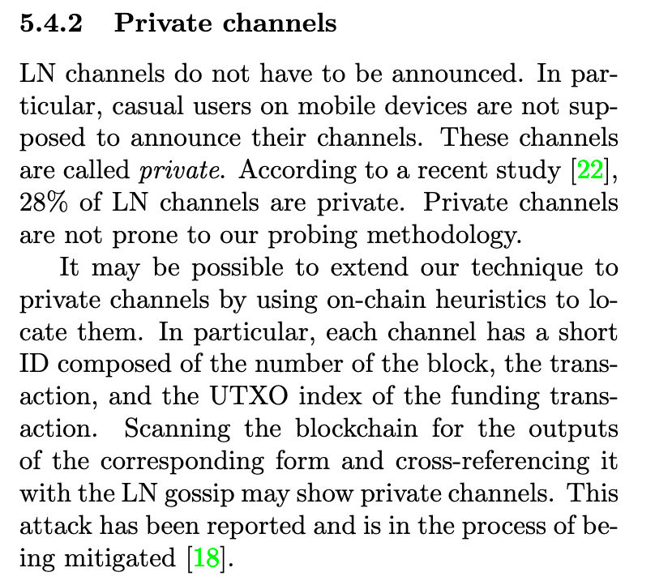

- https://arxiv.org/pdf/2004.00333.pdf -

但情况还可能变得更糟。不止你要向每一个资金发送者公开这信息信息，它还可能被攻击者侦测出来。一个节点可以通过滥发支付、猜测通道 UTXO 来发现一个真实存在的私有通道。攻击者先分析比特币网络中的所有交易，找出看起来像是发送到一个多签名地址的 UTXO。一旦攻击者侦测到某个 UTXO 已经被用在一个受害者的私有通道中了，攻击者就可以开始转头猜测另一个节点是谁了。他们可以通过替换闪电网络已知的 20000 个节点的公钥来猜测。唯一一种抵御猜测的方法就是另一个节点从未公开过公开通道、也没有泄露过未公开的通道。

即使你开启了不公开的通道但从未创建过发票，你的通道对手也可能泄露过通道或者公钥。他们可能在自己的某一张发票中包含了这些信息。他们做这些不需要征求你的同意。

因此，即使你有一个 “完全私有” 的节点、从未开启过公开通道、从未跟他人分享过发票，只要你的某个通道对手在发票中泄露过你的私钥通道和公钥，你就完了。然后攻击者就可以侦测**你的**私有通道、UTXO、余额，甚至你的通道对手。所以，你要假设自己的未公开通道和它们背后的 UTXO 都是公开的。

执行这种私有通道侦测攻击的成本和时间仍需进一步研究。

解决方案：隐藏你的某一个 UTXO，在你的某个公开通道背后打开一个私有通道。另一种替代方案是让另一个节点跟你打开同队，这样只会暴露他们的 UTXO。

### 关闭通道

不仅有可能发现一个活跃的私有通道，也有可能[发现已经关闭的私有通道](https://arxiv.org/pdf/2003.12470.pdf)。区块链分析可以用在关闭通道的交易中，从而辨别出通道的两个对等节点。

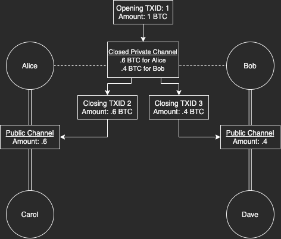

- 可以基于后续的通道关闭交易的找零来发现 Alice 和 Bob 的私有通道 -

一个私有通道的找零可能被用在一个新的公开通道中，或者泄露一个私有通道。如果两个节点使用来自一个私有通道的找零来创建了另一个通道，那么他们之间可能存在某种联系。你可以查看原始交易的输出并确定这个输出是用在节点间的私有通道的。

也有可能因为一个私有通道需要强制关闭，能够侦测出一笔交易的输出是一个私有通道通道的一部分。强制关闭的通道会在链上曝光闪电网络特有的留置输出。在这笔交易中，你可以像侦测通道节点一样分析找零输出。

解决方案：在关闭通道后混币。

### 混币后的 UTXO

管理混币后的 UTXO 是使用 coinjoin 技术的比特币友的一个热门话题。除非有必要，否则拿混币后的 UTXO 再次结合，一般来说都是糟糕的做法。如果你有许多个来自同一来源的 UTXO，将它们混合后又发回给相同的地址，那 你就减少了这些币的匿名集。你整合的 UTXO 越多，情况就越糟。

有许多幽深的、专家级别的链上分析技术，致力于将混币后的 UTXO 去匿名化。我的总体建议是，不要将混币后的 UTXO 再次结合，但也有许多的变数。

基于此，我也认为，发送 1 笔以上的混币后 UTXO 到你的闪电网络节点是个糟糕的做法。出于上面说的所有理由，你放在山我们网络节点中的所有的混币后 UTXO 都有可能被关联起来。无论你是公开节点还是私有节点。除非你知道你在用你的混币后 UTXO 做什么，我会建议你尽可能不要让它跟你的节点有什么结合。

解决方案：每个节点只使用一个混币后的 UTXO。

## 接收者的隐私性

到此为之，你应该已经对组成你的节点的 UTXO 和通道有了大致印象。现在，我们来研究下你接收支付时会暴露哪些信息。

### 发票（invoice）

一般来说，要接收一笔支付你总是需要创建一个发票，并交给发送者。这个发票包含了你的节点公钥、支付的数额、支付描述、私人路由提示，并且发票是用你的节点私钥签过名的。有了你的公钥，发送者可以查找你的节点来获得通道、UTXO、Tor/IP 地址信息，等等。私人路由提示也会公开你的私有通道 UTXO 信息。

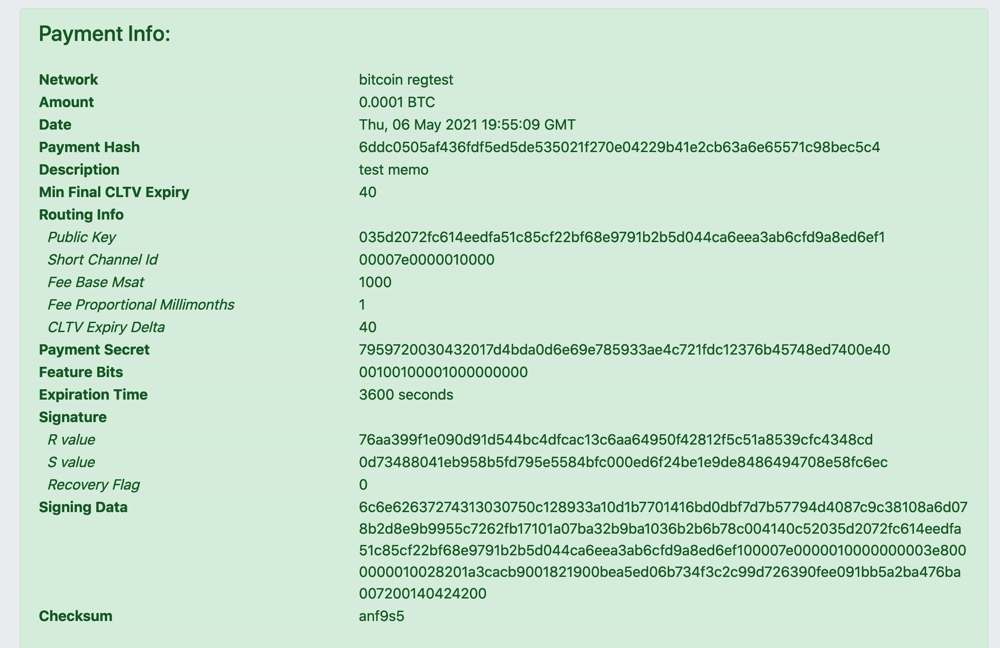

- 闪电网络发票案例 -

上面说的所有信息都来自小小的一张发票。这就是为什么大家可能大意。首先，你要注意分享发票的通信环境。如果你想要保持 隐私/匿名，就不要在公开的聊天室里分享发票。甚至，你不要解密关于你的节点的信息，也不要发送给你不信任的人。如果你做了，就要假设全世界都已经知道关于你的节点的信息，并知道这个节点属于你的。如果你是一个商家，实际上你是没有办法的，你要假设顾客在你的店里买东西时就可以创建关于你的节点的发票。

支付的备注（Memo）可能暴露更多关于你和交易的信息。你不会在 Paypal 支付中备注 “为了买毒品”，在这里也是一样的道理。每一个发票都是签过名的，所以放在发票里面的所有信息都是你的节点签过名的言论。典型的例子时 Matt Odell 创建的一张发票在备注中提到了扑克（poker）。他把这张发票给了他的朋友，而他的朋友通过一个 KYC 托管商来支付。现在，这个托管商可能就知道了 Matt 不希望他们知道的东西。甚至，这样做也让他的朋友处在风险之中。只要这个托管商想，他们可以拿涉及赌博活动为由，审查给 Matt 的支付。

因为每一张发票都会曝光你的节点的公钥信息，它们也是可以产生关联的。在一个理想的世界中，你给出的任何发票都不会暴露你的节点的信息，因此也是无法关联的。每一张新发票都会显示新的公钥信息。现在，我们在技术上已经可以做到了，实际上，[Muun 手机钱包](https://muun.com/)就是这样做的！

Muun 使用假的私有通道并为之附加了自旋的密钥对（rotating key pairs）。这使得每次创建的发票看起来都要让支付 *穿过* 你的节点，去向一个不同的目的地，所以，你可以合理否认这些支付是发给你的。虽然这也不是完美的。

最终来说，别人可以假设你的节点只是表面上要将支付转发给这些虚拟的私有通道，实际上就是支付的目的地。但这种假设不是 100% 为真。可能真的有某个独立节点，只跟你的节点有一个私有通道。

解决方案：为每个发票创建一个新的节点公钥（在现实中，只有使用 Muun 才容易做到，因为这是默认设置）。我听闻其它项目也在开发这种功能。

## 发送者的隐私性

从技术上来说，在闪电网络种，发送者的隐私性很好。发送者会创建一条加密的洋葱消息，所以支付路由路径的其他节点都只知道下一个节点是谁，而不知道整条路径。资金在网络中流动时，洋葱消息会逐步解封，所以有哪些节点参与了此前的路由也是不知道的。只有直接转发信息给你的人是可知的。这种模式也保护了最初的发送者。但是，在一些情况下，最初的发送者也可以被猜测出来。

为什么首先要有发送者的隐私？如果 Alice 想要从 Bob 手上买东西，而 Bob 也认识 Alice，Bob 知道 Alice 用来发送资金的是 *哪个节点* 有什么问题呢？

这就要回到链上隐私性的重要性以及为什么我们每次交易都要使用一个新的比特币地址。因为 Bob **不需要**知道我在文中提到的所有节点相关信息。家庭 IP 地址、通道信息、UTXO 信息、余额，等等。Bob 需要知道的只是 Alice 订单相关的最小信息，以及一个事实：他可以收到这个订单对应的资金。

那么，我们来看看发送者可能暴露的一些情形。

### 单跳支付

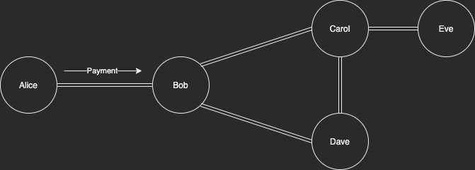

- Alice 给 Bob 支付所用到的一个小型支付网络。除了 Alice，还有谁可以给 Bob 支付？Bob 一清二楚 -

设想如果 Alice 有一个节点，只跟 Bob 有一条通道。她通过这个直接通道给 Bob 支付。那么，Bob 可以合理假设 Alice 的节点就是交易最初的发起者。有没有可能是其它节点通过 Alice 的节点支付呢？Alice 可能跟其它节点有私有通道，但我们已经讲过了，私有通道的存在是可能泄露的。

只要 Bob 能断定 Alice 不是路由节点，那就可以知道 Alice 就是支付的发起者了。一些节点会拒绝路由请求。如果 Bob 尝试通过 Alice 的节点来支付，并且被拒绝了，那么 Bob 就可以合理假设她不会路由支付。所以不可能是另一个节点通过 Alice 的节点来支付。当然，Alice 有可能只拒绝一个方向的路由请求，但这是非常罕见的。

解决方案：如果你只有一个通道，不要把你的通道对手作为资金发送的目的地。

### 双跳支付

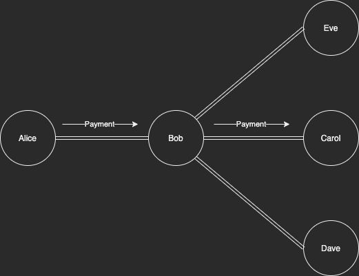

- 一个 Bob 是一个闪电网络服务商的小型闪电网络。因为用户之间没有连接，所以 Bob 可以知道某人的支付是发给谁的 -

设想一种场景，Alice 连接到了 Bob，而 Bob 连接到了 Carol。Bob 知道 Alice 跟别人都没有连接，而且 Carol 也一样。

Alice 通过 Bob 给 Carol 支付。那么，Bob 就知道了 Alice 给 Carol 支付了多少钱。

在手机钱包使用[闪电网络服务商](https://medium.com/breez-technology/introducing-lightning-service-providers-fe9fb1665d5f)（LSP）的搭配中，这是常见的情形。手机用户通常只跟这个 LSP 有连接，跟其他人都没有。那么，当一个手机钱包用户给另一个手机钱包用户支付、并且他们都使用同一个 LSP 时，这就意味着 LSP 知道了支付的详情。

解决方案：如果你在使用一个手机端的 LSP，请同时开设一个公开通道，或者不要给使用同一个 LSP 的其他用户支付。

### 通过网络来发送资金

我已经分析了单跳和双跳的情形，在这两种情形中，路由者或者支付接收方可以发现发送者节点。还有更主动的方法，可以在更长的路径中尝试找出这些信息。

**余额侦测**

[余额侦测](https://s-tikhomirov.github.io/lightning-probing/)指的是攻击者尝试通过一个节点来路由许多假的支付，从而发现一个节点在两个方向上有多少余额。在闪电网络中，只有公开通道的总容量是公开的。在 Alice 和 Bob 的一个总容量为 1 BTC 的通道中，某个时候，Alice 可能有 0.7 BTC，而 Bob 有 0.3 BTC。而且余额情形还会随着支付的流动而改变。

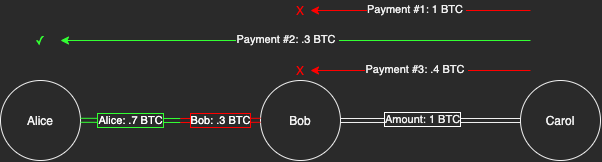

- Carol 攻击 Alice 和 Bob 间的通道，想搞清楚他们各有多少余额 -

攻击可以可以尝试让 Alice 和 Bob 的通道路由不同数额的支付，从而搞清楚他们的余额。如果 1 BTC 的支付无法路由给 Alice，那么攻击者就降低数额，再次尝试，直到转发成功。攻击者使用的是假的支付哈希值，永远不会被满足。所以，一旦 Alice 以支付哈希值错误作为响应，攻击者就知道自己侦测成功了。这个通道中 Bob 拥有的余额大体就是尝试成功的最高数额。

如果 Alice 在通道中的余额变为 0.1，而 Bob 在通道中余额变成 0.9，而且 Bob 其他通道中的余额都没有改变，我们就知道了 Alice 给 Bob 支付了 0.6 BTC。不论是发生了 1 笔还是多少笔支付。

你也可以将余额侦测延伸到整个网络。如果一个较大的支付穿透了超过 2 个节点，攻击者可以通过比对节点在支付前和支付后的余额来发现资金的流动。

虽然这是有可能的，在现实中它要投入许多资源才能做得足够快，而且网络还在扩大。要想对整个网络做快照是很难得。而且，可以想象，越多支付在网络中流动，就越难足够快地发现个体发送者以及支付的目的地以及具体数额。已经有[论文](https://eprint.iacr.org/2021/384.pdf)和研究讨论了这种攻击需要的成本和时间。可以合理认为不是每个人都能发起大规模的这种攻击。当然，那些拥有几十亿美元的区块链分析企业和名字缩写是三个字母的机构（译者注：指 CIA、FBI，等等）可以。

更合理的是，一个攻击者可以瞄准特定的目标。把握一个目标的整体经济活动是有可能的。

攻击者可以瞄准竞争对手的店铺节点，快照他们的所有通道。这样，攻击者就可以看到这些节点的入账容量（inbound capacity）的下降（译者注：也即这些节点收到的支付的数额）。攻击者可以收集这些商店的商品的价格，然后推测这些商品的销售情况。一种可能有所帮助的解决方案是，商家节点不断根据自己收到的支付数额成比例地支出资金。理想情况下，应该在收到支付后立即这样做，以阻止攻击者捕捉到单个单个的购买行为。商家可以支付资金给自己控制但跟商店没有关系的节点。

有一些办法可以知道你是否正在被余额侦测攻击，然后你可以尝试切断它。虽然余额侦测可能跟节点难以发起支付、正在尝试多种路径的行为没有什么区别。我认为，在几次尝试保护隐私后拒绝转发，是一个安全的做法。偶尔拒绝一次实际的支付只会错过路由的收入。另外，因为支付寻路算法有声誉因子，可能发给你的支付路由请求也会变少。我还不知道有什么软件可以帮助抵御余额侦测，所以需要专门写一些定制化的代码。

解决方案：在抵御侦测的更好工具开发出来之前，定期地平衡你的通道以及将资金 支出/存入 你的节点。不是最好的方法，但这本身就是一个很难解决的问题。

**时序攻击（Timing attacks）**

[时序攻击](https://arxiv.org/pdf/2006.12143.pdf)的背后是对一些事情有多快发生的合理假设。在闪电网络中，一个路由者也许能知道一笔支付的目标是谁。他们可以知道，是基于对支付成功速度的观察。在交易一跳一跳地穿过网络时，有基本的网络延迟约束。举个例子，设想一个网络，每一跳要经过 100 ms（毫秒）。那么，如果一笔成功的支付用时 500 ms，就可以合理假定目标与支付发起者距离 5 跳。如果攻击者扫描到了每个节点的用时，他们还能获得更精确的估计。

随着网络的扩大、目标数量和时延的增加，我相信这种攻击会变得更难。

解决方案：作为一个节点，你可能要把转发或者接收支付的时间设置成一个随机量。不过，这可能会使你的支付体验降格，从即时支付变成需要几秒。我不知道有什么软件可以做这种设置，所以这可能需要定制化（编辑：[一位 reddit 用户](https://www.reddit.com/r/TheLightningNetwork/comments/n99ksn/current_state_of_lightning_network_privacy/gxnfq2u?utm_source=share&utm_medium=web2x&context=3)分享了他们做的实现这个功能的 [c-lightning 插件](https://github.com/ajpwahqgbi/lightning-tools/tree/master/clightning-plugins/jitterbug)）。

## 其它闪电网络科技

虽然我们的现状是这样，有一些另外的闪电网络科技值得一提。

### MPP（多路径支付）

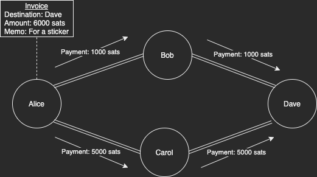

- 一个小型的闪电网络，Alice 通过多条路径来支付一张发票。无论 Bob 还是 Carol 都无法知晓全部支付金额 -

“[多路径支付](https://lists.linuxfoundation.org/pipermail/lightning-dev/2018-November/001577.html)” 是已经推出的技术，但可能还不是那么常见。MPP 不是为一笔支付选出一条走得通的路径，而是让一笔支付可以分散成多个更小的数额、走多条路径。它可以提高较大额度的支付成功的机会。但也提供了稍好一点的隐私性。

根据 “余额侦测” 章节的知识，我们知道，不发送大额的支付而是发送多笔小额支付的话，可以更好地掩盖支付的事实和确切的金额。一个不利之处在于：每个 MPP 都使用相同的支付哈希值，所以路由者（或者相互勾结的路由者）可以将它们关联起来。

### AMP

“[原子化多路径支付](https://lists.linuxfoundation.org/pipermail/lightning-dev/2018-February/000993.html)（AMP）” 是对基本 MPP 的优化，使得每一个分割开来的支付都使用不同的支付哈希值。因此，这些支付无法被关联起来。

### Rendezvous（约会）

[“约会（Rendezvous）”](https://bitcointechweekly.com/front/proposal-for-rendez-vous-routing/) 路由是对接收者隐私的极大提升。接收者可以通过创建一个填充着洋葱加密信息的发票来隐藏自己的公钥和私有通道。他们可以知道一个随机节点，让发送者将资金发给该节点，然后再由该随机节点完成剩下的路由。发送者甚至不知道谁是最终的目的节点，路径上的其它节点也不知道。

### Route blinding（路径盲化）

“[路径盲化](https://github.com/lightningnetwork/lightning-rfc/pull/765)” 是约会路由的一种替代方案。它有相似之处，但还可以帮助私有通道不向攻击者泄露。路由盲化支持接收者隐私，可以使用不同的数额重复使用同一条路径。但是，它在整体上可能更不隐私，仍有被侦测的可能性。

约会路由和路径盲化都仍可能受到余额侦测攻击，并使得发送者和目标节点曝光。攻击者只需在支付前后生成快照并比对即可。有了路径盲化，也许我们可以通过强制实行这种技术来保证私有通道不被侦测，除非节点自己给出了路由盲化的发票。

### Trampoline routing（蹦床路由）

“[蹦床路由](https://bitcoinops.org/en/topics/trampoline-payments/)” 可以帮助一个节点向自己并无足够多路由信息的目标节点支付。办法就是将支付发送给一个已知的蹦床路由者。这个路由者会创建路径将支付送达。

如果接收者也已经支持了（[至少理解了](https://twitter.com/realtbast/status/1391832442575720455?s=20)）蹦床协议，那么其它蹦床路由器将继续无知于下一个蹦床是不是最终目的地。很像当前的情形：常规的路由者并不知道下一跳是不是最终目的地。接收者甚至可以在此基础上实现约会路由。

### 公钥路由

一种隐藏通道背后的 UTXO 的简单替代方案是实现 “[公钥路由](https://github.com/lightningnetwork/lightning-rfc/pull/814)”。虽然仍有可能侦测出两个没有公开通道的节点之间具有私有通道，但无法知道背后的 UTXO 是哪个。

### Immortan

“[Immortan](https://github.com/btcontract/immortan)”（直译为 “不死者”）是一种 “最小化的、专注隐私的、固执的闪电网络协议实现，专门致力于为闪电网络轻节点（lite LN nodes）赋能”。这种实现解决了关于 公钥/发票 自旋 和假的通道 ID 的功能。当前还在开发中。

### zkChannels（零知识通道）

“[零知识通道](https://medium.com/boltlabs/zkchannels-for-bitcoin-f1bbf6e3570e)” 为链下的交易提供了强健的匿名性和无可关联性，办法是减少接收者可以获得的关于发送者的信息，只能获得支付数额信息。它提议做一个升级层，通过不对称的信息流来保护隐私（通过乱码电路）。

它主要提升了发送者的隐私。不过，它只支持一种 商家-客户 类型的关系，客户只公开支付给商家的数额。零知识通道不支持转发支付，所以 中心-多点 场景很适合使用它。

### Taproot

[Taproot](https://bitcoinops.org/en/topics/taproot/) 可以给比特币带来许多提升，但从闪电网络的角度看，一个好处是允许隐藏的多签名花费。所以每一笔合作关闭通道的交易（即使带有未解决的支付）看起来也像是一笔普通的单签名 taproot 花费。所以猜测哪一笔交易跟私有通道有关会变得更难。

### Channel factories（通道工厂）

“[通道工厂](https://wiki.ion.radar.tech/tech/research/channel-factory#overview-1)” 可以让许多对等节点将资金汇集在一起，创建一个通道子网。它具有可扩展性上的好处，但另一个潜在的后果是，从外部看起来，它像是一个 coinjoin 的通道。通道工厂可能需要比特币基础层和闪电网络层的协议升级。另外，一个多方批处理的通道创建应用可以实现类似的结果。

### 其它

还有许多许多可能的升级和提议，可以帮助闪电网络提高隐私性。一些可能还要很长时间才能实现，就比如我上面提到的某一些。我没有深入讲解它们，因为这篇文章的重点是我们的现状。

## 最终的隐私建议

所以，如果你已经看到了这里，关于闪电网络的隐私性，我们可以知道以下几件事：

1. 任何人都可以看到其他人的公开节点信息，只要他们开启过公开通道。
2. 任何人都可以看到组成一条通道的 UTXO，哪怕私有通道也是可以暴露了。
3. 区块链分析可以瞄准一些节点，看到他们的活跃通道和已经关闭的通道、UTXO，等等。
4. 给你的节点充入超过 1 笔混币后的 UTXO，会使你的混币效果作废并揭开你的真实身份。
5. 在约会路由实现之前，接收者只有很少的隐私性。
6. 单笔支付通过网络时，是可以被余额侦测快照捕捉到的。但除非攻击者有很多资源，否则无法确证。更现实的用法会是针对特定的目标来发现其经济活动。

然后，这里是我的建议，可以帮助你保持尽可能多的隐私性。

### 给发送者

1. 每个私有通道只使用一个 UTXO。最好是经过混币的、整数面额的 UTXO。
2. 如果你只有一个通道对手，不要直接发送资金给他。
3. 用完通道后，耗尽你的通道余额并关闭它。
4. 不要收款、创建发票，等等，这会暴露你的 通道/UTXO 信息。
5. 只要时间足够长，你的通道就会为整个网络所知，并且是可以侦测到的，所以不要长时间保留可以废弃的节点。
6. 以较小的增量、较长的路径发送支付，以躲避余额侦测。

### 给接收者

1. 不要使用你自己拥有的 UTXO 来开设通道。让其他人用他们的 UTXO 跟你开设通道，或者跟你的对手同时提供一个 UTXO 来开设通道。资金的来源可以是：[Bitrefill Thor](https://www.bitrefill.com/thor-lightning-network-channels/?hl=en)、[Lightning Lab 的 Loop Out 服务](https://lightning.engineering/loop/)、[LNBig](https://lnbig.com/#/open-channel)、[Yalls](https://yalls.org/about/)，等等。
2. 如果你想在链上发送一些资金，要么使用像 Loop Out 这样的服务，要么先关闭通道、做混币，然后发送。
3. 只使用 Tor 模式，不使用任何类型的昵称。
4. 不要在公开信道中分享你的发票，也不要接收你 KYC 过的服务商的资金，除非你有一次性的发票系统。
5. 不要告诉别人你拥有哪个节点。
6. 发票的备注不应泄露信息。

### 在闪电网络上混币

如果你担心在网络上混币的风险，你可以向 Bitrefill Thor 这样的服务商购买服务，与一个全新的节点开启一条通道。然后，你可以从你的一次性节点向你租用的通道节点发送资金。这样一来，关闭这个通道之后，你就不再拥有一开始你拥有的 UTXO，而是拥有来自另一个节点的全新 UTXO。只要遵循这里的最佳习惯，通过闪电网络给一个租赁通道或者说 UTXO 支付也可以隐藏你作为发送者的身份。

## 结论

闪电网络的目的是快速植入。比特币的基础层并没有任何隐私性保证，闪电网络也没有。有一些方法可以尝试隐藏网络中的活动，但无法保证效果。大体量的参与者可以攻击和揭开（作为网络主图细支的）私有通道。因此，网络中的资金流动应该被认为是公开知识。

地下的闪电网络完全由信任彼此的私有节点组成，他们的隐私可能在当前和未来都能得到保持。但在公开的网络上路由的交易有隐私风险。请考虑你自己的威胁模型并使用这里的相关信息。

也许在未来会出现一些有所帮助的技术，但这就是我们现在使用闪电网络的日常情形。

## 致谢

衷心感谢所有花时间审核了本文的多篇草稿并提供了有价值建议的人！包括：[openoms](https://twitter.com/openoms?s=21)、[Abubakar](https://twitter.com/ihate1999?s=21)、[Evan](https://twitter.com/evankaloudis?s=21)、[Andrew](https://twitter.com/ecurrencyhodler?s=21)，还有其他人。

闪电网络的研究员和开发者都值得一提，因为本文中的绝大部分信息都来自他们过去几年的工作。在文中我已经提供了大部分他们的链接，但与本文尤为相关、值得一提的有：[Rusty](https://twitter.com/rusty_twit?s=21)、[Sergei](https://twitter.com/serg_tikhomirov?s=21)、[Bastien](https://twitter.com/realtbast?s=21)、[Joost](https://twitter.com/joostjgr?s=21)，等等！

请考虑资助 [Bitcoin Dev List](https://bitcoindevlist.com/) 中的比特币开发者！

