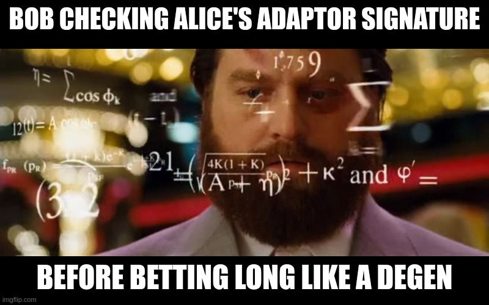
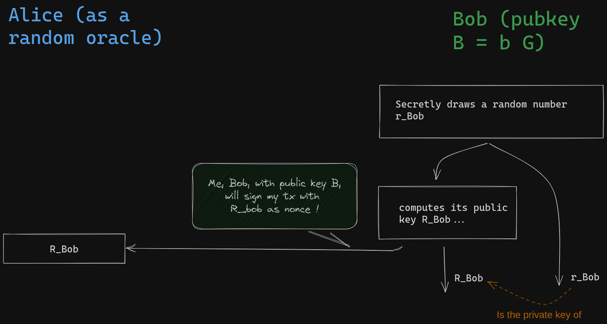
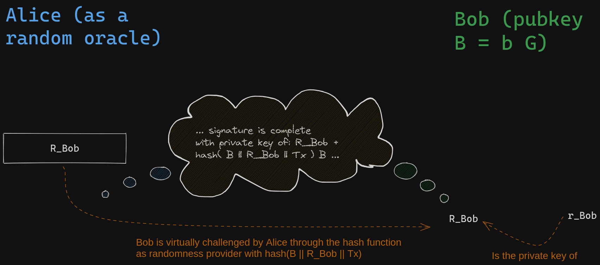
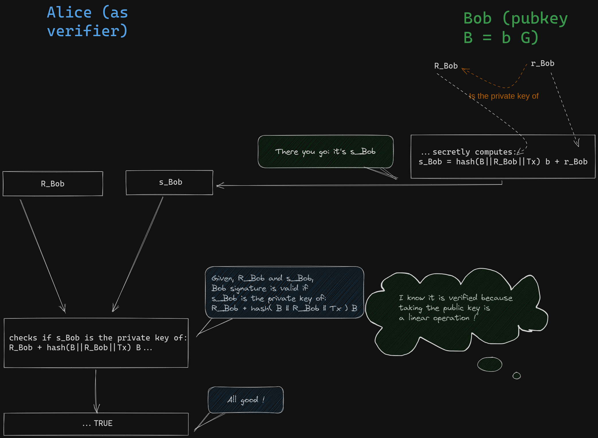
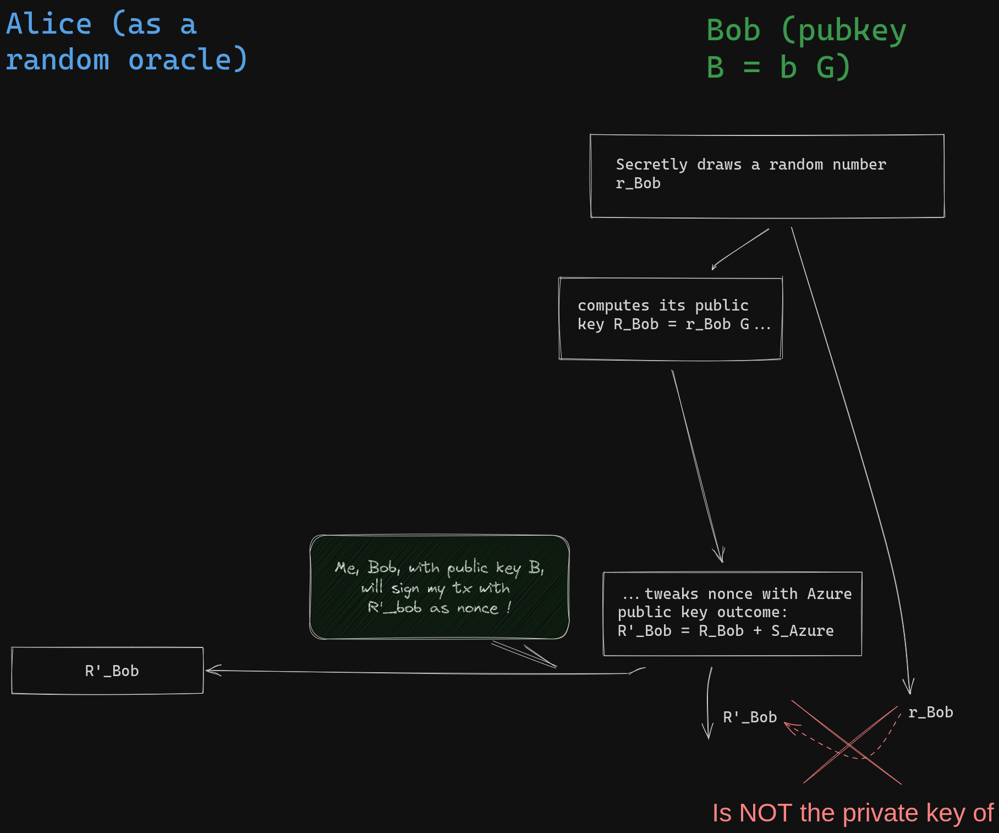
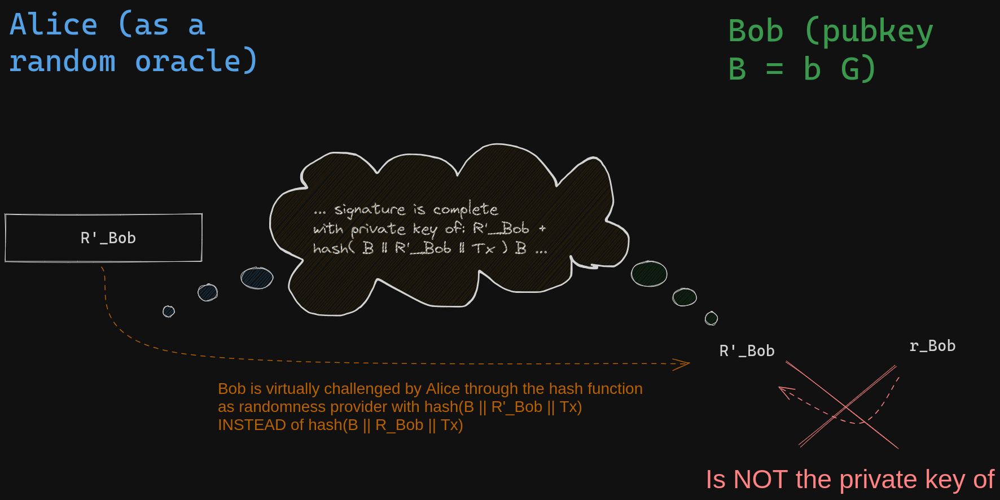
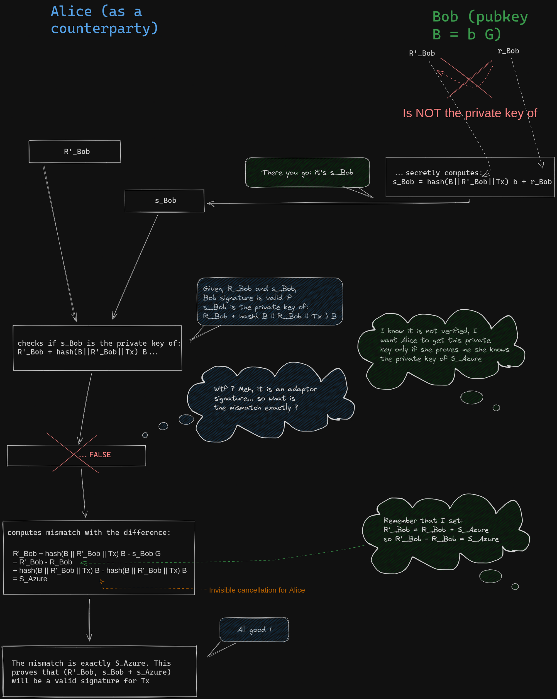
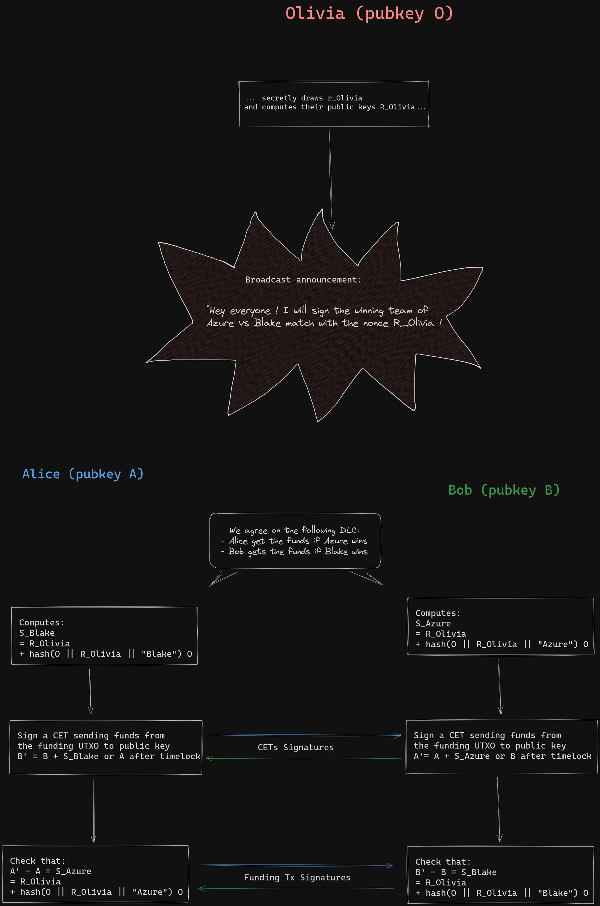
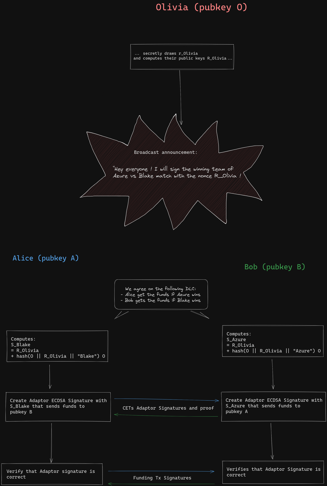

> *作者：Théo Pantamis*
> 
> *来源：<https://blog.lnmarkets.com/cryptography-of-dlcs/>*

- 为了无脑开多，Bob 检查 Alice 的适配器签名。他只是想避免对手方风险，这非常合理。至于市场风险么 …… -

在我们上一篇关于 “谨慎日志合约（DLC）” 的文章中，我们讨论了所需的密码学元件 —— 可验证的见证数据加密方案。但是，需要指出的是，这个概念的演化并不是一蹴而就的；它从 Dryja 最初的观念开始，经过了许多人的共同开发。

在这篇文章中，我们将从使用一个私钥作为签名的解密密钥的方法开始，然后将它转化为一笔交易的扳机。这将引导我们深入研究 “适配器签名”  的概念，尤其是它在 Schnorr 签名中的构造方法（为了简洁）。然后，我们会研究断言机见证消息的定义，从而根据被见证的事件高效沟通哪个私钥会被公开。

最后，我们会展示三种主要的 DLC 协议提议。我们将从 Dryja 的初始提议的概述开始，然后是结合了适配器签名的当前提议。此外，我们还要展示最具野心的提议，叫做 “ObC 支付（基于断言机的条件式支付）”，是由 Llyold Fournier 提出的。ObC 支付利用了一种真正可验证的见证数据加密方案，通过结合 BLS 签名和 Schnorr 签名的基于身份的加密达成了最优的效率。

这篇文章的技术讲解很多，会有数学！你有时间集中精力吗？如果有的话，备好你的茶或者咖啡，跟我来！

## 见证消息作为一种解密密钥

### 使用粗糙对称加密的可验证性

在上一篇文章中，我们讨论了利用断言机（在案例中叫做 Olivia）的见证消息来解密 Alice 和 Bob 所交换的签名的概念。这种解密只能用在跟这条见证消息相对应的支付交易的签名中，从而 Alice 和 Bob 的其中一人可以单方面执行合约、拿走属于自己的收获。

一种直截了当而且最简单的方法是，让 Alice 和 Bob 使用 Olivia 的对应签名加密他们的 “合约执行交易（CET）” 的签名，然后再交换加密的签名。但是，这种方法假设了 Alice 和 Bob 都已经拥有了从 Olivia 的私钥发出的相同签名、不再需要 Olivia 的参与了。如果是这样，那么双方都已经可以解密对方的签名了，整个流程都没有意义了。

这种方案所缺少的一个关键的侧面，叫做 “单向性”。也就是 Alice 和 Bob 可以加密一个签名，但对方的逆向工程（不需要 Olivia 的协助就能从加密的签名中复原出原本的签名）是计算上不可行的。

### 使用非对称加密的单向性：字面意义上的 “DLC”

一种更复杂的方案是对签名使用非对称密钥加密。Alice 和 Bob 在双方都只知晓一个公钥的条件下约定其背后的私钥，然后用这个公钥来加密他们的签名。但是，没有人可以解密在他们之间交换的密文，只有得到背后的私钥才可以。一种使用椭圆曲线来协助这样的加密的著名算法是 “ElGamal 加密法”。

Olivia 可以同意在见证某个事件时公开自己的私钥，从而让 Alice 和 Bob 可以解密他们之前交换的密文。如同其名称 “谨慎日志合约” 所暗示的，Alice 和 Bob 需要了解某个东西的离散对数才能结算合约（一个椭圆曲线点的私钥就是它的离散对数，而一个标量的公钥则是它的幂数）。但是，如果使用相同的密钥来加密所有 CET 的签名，那也是有问题的，因为任何一笔都可以在 Olivia 的见证消息发出后解密并用于申领资金。所以，Olivia 需要宣布自己可能见证的所有结果，并为每一个结果指定一个公钥。

然而，这种方法虽然拥有了单向性，但依然不足，因为它缺乏可验证性。像 ElGamal 这样的非对称加密算法，内在地要求被加密的消息以某一种数学对象的受限格式来表示，例如 ElGamal 要求的是一个椭圆曲线点的 x 坐标。虽然这在混合加密系统  —— 被加密的消息将用作一个随机密钥、解密一个以对称加密法加密的大消息 —— 中是没有问题的，但它没有提供直接的方法让 Alice 和 Bob 验证自己所得的真的是一个签名。

## 适配器签名

一开始，如果说有一种办法可以加密电子签名、同时对手方可以在不知道真实签名的条件下验证该密文的有效性，简直就像魔法。但是，我们不必在 Alice 和 Bob 生成签名之后再加密签名，我们可以修改签名协议本身，使之产生一种碎片签名。这种碎片签名自身不算是有效的签名，但结合了属于 Olivia 的某一个私钥之后就会变成有效的签名。这种方法叫做 “适配器签名”。值得一提的是，虽然出于简洁，本文选择了在 Schnorr 签名的语境下介绍适配器签名的概念，但在 ECDSA 签名中同样可以定义出适配器签名协议。

我们先了解一下基本的概念：Bob 的电子签名的首要目标是向大家证明他拥有某个公钥 B 背后的私钥。 为了证明这一点而不泄露自己的私钥，Bob 将同时证明自己知道这个私钥和另一个随机选出的私钥。一开始，Bob 会选择一个随机的标量值 $r_{Bob}$ （称为 “nonce 秘密值”），然后计算并公开这个标量的公钥 $R_{Bob} = r_{Bob}.G$ ，叫做 “nonce”。这个叫做 “承诺阶段”。

- Bob 承诺自己将用来签名的 nonce -

下一步，Bob 必须公开一个派生公钥的私钥；这个公钥是通过他自己的公钥和他所承诺的 nonce 公钥的线性组合产生的。这个组合的系数由被签名的消息以及他所承诺的 nonce 决定（就是前后拼接这两者以及 Bob 的公钥 $B$ 之后，运行哈希计算所得的哈希值）。这个叫做 “挑战阶段”。

- Alice 代表着一个随机数断言机，也就是哈希函数，挑战 Bob 揭示一个私钥 -

Bob 通过使用私钥（而不是公钥）运行相同的算法来应对挑战。这利用了相关的公钥和私钥的数学线性关系。任何人都可以验证结果的有效性。

- 在上图所示的虚拟交互中，Bob 的签名 R_Bob 和 s_Bob 就是他要发送给 Alice 的所有东西。 -

适配器背后的核心洞见是 **nonce 秘密值在标准的签名协议中的双重作用：一是计算 nonce 值，一个是推导出公开的私钥。而在适配器签名中，nonce 公钥会使用另一个公钥来调整，同时保持 nonce 秘密值不变**。这种修改让签名失效，但很容易验证复原所需的缺失的秘密值 —— 用于调整的公钥背后的私钥。为了说明这些，我们想想 Bob 可以如何为 Alice 构造适配器签名，让她可以使用 Olivia 在 Azure 团队胜出时会发布的私钥 $s_{Azure}$ 来申领自己的资金。

Bob 虽然不知道 $s_{Azure}$ ，但可以创建出 Alice 可以验证的一个适配器签名。这是因为，Olivia 已经宣布，如果 Azure 胜出，她将公开 $S_{Azure} = s_{Azure}.G$ 背后的私钥。Bob 先按标准程序启动签名协议，使用一个随机源获得一个秘密的 nonce 标量值 $r_{Bob}$ ，然后计算 $R_{Bob} = r_{Bob}.G$ ，这是他希望用在签名中的 nonce 值。

在标准的 Schnorr 签名中，Bob 会计算线性组合的系数，这需要将交易的内容跟 nonce 点相结合、哈希它们，最后用自己的私钥乘以这个哈希值，最后加上 $r_{Bob}$ 。他会分享这个结果，以及 $R_{Bob}$ ，任何人都可以验证这个结果就是 $R_{Bob} + hash(B||R_{Bob}||T_x) * B$ 背后的私钥。即，签名是一个点和一个标量所组成的一对数据：

$$(R_{Bob} + hash(B||R_{Bob}||T_x) * b)$$

但是，Bob 不希望自己的签名直接就是有效的。在上面这个步骤之前，Bob 先给自己的 nonce 公钥加上 $S_{Azure}$ ，然后再执行相同的计算（不会修改 nonce 秘密值哦）。

- Bob 在发布 nonce 值之前修改了它，使之成了一个适配器签名 -

这里的虚拟验证者（以哈希函数表示），将理解 Bob 会产生一个使用 nonce 值 $R'_{Bob}$ 的签名，并相对应地挑战他。TA 预期 Bob 会揭示一个使用调整后的 nonce 值计算出来的公钥的私钥：

- 一旦 Bob 分享了调整后的 nonce 值，哈希函数就挑战他，但他现在无法应对这个挑战了！ -

因为不知道私钥 $s_{Azure}$ ，所以 Bob 无法计算出满足挑战所需的私钥，但他将运行跟标准的 Schnorr 签名一样的运算，就使用原本的 nonce 秘密值、要发送给 Alice 的 nonce 值（修改后的）以及他的私钥。因此，他给 Alice 提供的 “签名” 是这样的一对数值：

$$R'_{Bob} = R_{Bob} + S_{Azure}$$

$$s_{Bob} = r_{Bob} + hash(B||R'_{Bob}||T_x) * b)$$

这是个无效的签名，因为 nonce 秘密值 $r_{Bob}$ 跟哈希函数中的 nonce 公钥 $R'_{Bob} = R_{Bob} + S_{Azure}$ 并不匹配。但是，Alice 可以验证，这种不匹配，正是由于 $S_{Azure}$ 而导致的。实际上，如果我们尝试验证这个签名，我们可以这样计算：

$$s_{Bob}.G$$

$$= r_{Bob}.G + hash(B||R'_{Bob}||T_x) * b.G$$

$$= R_{Bob} + hash(B||R'_{Bob}||T_x) * B)$$

$$= R'_{Bob} + hash(B||R'_{Bob}||T_x) * B) - S_{Azure}$$

Alice 可以验证，添加 $S_{Azure}$ 正是让 nonce 值改变、让签名无效的调整项。对 Alice 来说，这就构成了一个证据：只要她知道私钥 $s_{Azure}$ ，就可以将这个值添加到 Bob 的适配器签名的标量元素  $s'_{Bob-CET_{Azure}}$ 中，使之称为一个有效的签名。有了这个有效的签名，Alice 就可以用来执行对应的 CET（在这里是表示 Azure  胜出的那一笔 CET），从而获得自己的收获。这意味着，只要 Olivia 揭示了 $S_{Azure}$ 背后的私钥， Alice 就可以广播一笔有效的交易、执行跟 Bob 的合约并申领资金。

这种初始步骤是可靠的，但这就给 Olivia 带来了一个挑战：她需要为每一种结果生成一把私钥，在发布承诺和见证事件期间安全地保管。那么，我们来研究如何扩展 Olivia 的能力，使之能处理大量的可能结果。

## 断言机的密钥派生

### “一个密钥对应一个结果”

前面介绍的方法对 Olivia 来说产生了挑战，是因为她需要为她可能见证的每一种结果宣布一个公钥。对 Olivia 来说，这会很难管理，因为她必须保证这些私钥都是安全的、只有那个对应与被见证的结果的私钥会揭晓。这需要 Olivia 在宣布和见证事件期间管理敏感数据的带状态的存储。

此外，这种方法对 Olivia 的用户来说也是一种成本。每一种可能的结果都需要交换一个适配器签名，这对那些只有少数几种可能结果的场景来说是没问题的，但对那些在一个大区间内分布的数字型结果来说，是不实用的。这就导致，如果交易覆盖了一大范围的数值，用户必须多次加密同一个 CET 的签名。Olivia 可以挑战她所签名的结果的范围，但这会限制她的见证消息的应用场景，或者用户必须将合约的具体内容告知 Olivia ，这会牺牲协议的隐私性。

虽然这种办法可能不适合用于买卖的 DLC，但它也提供了一些好处。一个重大的好处是，Alice 和 Bob 将很容易使用一个应用了这种签名方法的断言机的联盟。他们可以使用一种 FROST 协议、非交互式地聚合这些断言机的公钥和签名，从而秘密地建立断言机的门限联盟。但是，这也需要小心，因为 Alice 可以选择可能发生意外碰撞的断言机，从而允许她使用真正被见证的结果之外的结果来申领资金。这种叫 “瓦格纳攻击” 或者 “生日攻击”。

一种可以提升 Olivia 的断言机系统的方法是建立一种能够为每一种结果安全地推导出所有公钥的办法。Olivia 将只需宣布一个小的而且易于广播的公钥列表，而在需要见证结果的时候，她只需计算跟这个结果相对应的公钥的私钥，而无需计算其它的私钥。

### 原生的 BIP32 公钥派生

比特币人都熟悉使用 BIP32 标准从某些公钥派生另一些公钥的标准。BIP32 引入了一套密钥派生流程，其中一个种子词被分割成一个私钥和一个链码（chaincode），它们一起被叫做 “XPRV”。每个 XPRV 都有一个对应的 XPUB，形式上跟 XPRV 一样，只不过其中不是私钥，而是公钥。在不使用硬化派生方法的时候，只需使用 XPUB，就可以推导出所有源自  XPRV 的私钥的公钥。这意味着，Olivia 可以宣布一个 XPUB 而不是多个公钥，并说明派生的方法，每个人都可以凭此获得对应于结果的公钥；然后她会发布见证结果及其对应的私钥。

但是，最简单的办法是不可行的。虽然 XPUB 允许这样的派生，但它也有一个缺点，任何人只要知道了某个派生公钥的私钥，都可以反推出其父密钥，并相应推导出所有的子私钥（译者注：也即自己的兄弟私钥）。这意味着一旦 Olivia 为了就见证某个结果而泄露一个私钥，她就让任何人都能计算出跟其它结果相对应的私钥，这就违背了我们的初衷。

在 Tadge Dryja 的 DLC 初始论文中，他提出了一种创新的办法，可以派生出断言机的公钥，同时确保揭晓其中一个私钥不会爆破对应的断言机公钥。他实现这种派生的方法既简单又清楚：被揭晓的私钥就是一个 Schnorr 签名的标量部分。

### Schnorr 签名作为一种子公钥派生法

假设要见证一个事件，Olivia 会用自己的公钥 $O$ 生成一个对结果的 Schnorr 签名。

观察 Schnorr 签名的验证等式，Olivia 的签名 $s_{Azure}$ （表示胜利者为 “Azure”）跟 nonce 值 R 和她的公钥 $O$ 有这样的关系：

$$s_{Azure}.G = R + hash(O||R||"Azure") * O$$

这个等式就意味着：

**$s_{Azure}$ 就是公钥 $$R + hash(O||R||"Azure") * O$$ 的私钥！**

电子签名方案的一个基本属性就是，签名只能由公钥背后的私钥的主人制造出来。这是因为签名揭示了某个点（公钥）的私钥，而这个公钥本身是由签名人的公钥和一个一次性的公钥（就是 nonce）结合而来的。Dryja 的想法很简单：通过预先承诺将用来签名见证消息的 nonce 值，断言机可以承诺将揭示一个任何人都可以派生出来的公钥的私钥。因此，Schnorr 签名的验证点，将可以用来建立一种合约，仅在这个点的离散对数得到揭晓时才结算，也就是用被见证的结果来触发合约的执行。

不像 BIP32，这种私钥的揭晓不会泄露其它结果的私钥。这是因为断言机不会公开跟其公钥相关的链码，而只会公开另一个公钥：nonce 值 R。此外，还可以创建一种欺诈证明系统：如果这个断言机使用相同的 nonce 见证了两个不同结果，那么任何人都可以推导出这个断言机的私钥，同时证明这个断言机不再值得信任。

这种子密钥派生法的一种改进方法是，我们并不需要像 Schnorr 签名协议那样使用哈希化的数据。签名中的哈希值那一项可以整个替换成将一个索引号跟结果关联起来的任何函数。如果是用作签名，这样的改动是不安全的，但只是为了派生断言机的公钥，就依然是安全的。如果断言机的 nonce 值和公钥从哈希标签中移除了，那么所有的断言机都可以为给定的结果消息使用相同的索引号。这也将允许断言机见证消息的非交互式聚合（提醒，由于潜在的瓦格纳攻击，安全性可能会下降）。

现在，我们理解了 DLC 的两个核心元素，可以来看看不同的提议以及这项技术的现状了。

## 不同 DLC 提议的现状

### Dryja 的初始提议

Dryja 的初始提议并没有使用适配器签名或者可验证的见证加密技术。在预先签名 CET 的时候，Bob 直接签名，但资金不是直接发送给 Alice 的公钥，而是发送给 Alice 的公钥和断言机派生公钥的和，也就是调整了 Alice 的公钥，Alice 可以检查并发现自己必须生成新的公钥 $\hat{A}^{Azure}$ 的签名：

$$\hat{A}^{Azure} = A + (R + hash(O||R||"Azure") * O)$$

当 Olivia 签名 “Azure” 以见证胜出的球队时，Alice 可以计算出 $\hat{A}^{Azure}$ 的离散对数（discrete logarithm），只要把自己的私钥加入 Olivia 所发布的签名中即可，这就是 “谨慎日志合约（discreet log contract）” 的名字的由来（译者注：“离散（discrete）” 和 “谨慎（discreet）” 只有一字之差）：

$$\hat{a}^{Azure} = a + s_{Azure}$$

然后，Alice 就可以用一笔终局交易来申领资金。如果 Alice 不消息广播了错误的 Bob 预签名交易，她将不能取出其中的资金，只有 Bob 能在时间锁超时后取出资金。

下图展示了这套协议的的 DLC 注资操作的一个简化的案例：

- 使用一个二元结果的合约展示 Dryja 的初版提议。赢家拿走资金需要 2 笔交易。 -

Dryja 的 DLC 设计是这个概念的第一个版本。但是，它缺乏可验证加密特性，而且，在 CET 得到确认之后，需要一笔额外的交易来取走资金。这个方法还有一个局限性：链上交易不会公开断言机的签名。所以很难公开证明这个断言机签名了两个不同的结果。此外，断言机可能签名的每一条消息都需要一笔对应的预先签名的 CET，即使最终的支付结果是一样的，因为每一种结果自身都决定了公钥的调整项。相反，在使用适配器签名或者说可验证的见证数据加密技术的时候，你可以为相同支付结果的交易的签名使用对应于不同结果的不同公钥多次加密。

### ECDSA 的适配器签名

当前的规范没有使用 Dryja 的公钥调整法，而是使用了一种适配器签名方案。这个提议阶段的规范建议使用传统的 Schnorr 签名来为断言机的公告派生密钥，然后再用这些密钥来创建 ECDSA 的适配器签名。

断言机无法将 ECDSA 用作密钥派生。这是因为 ECDSA 在一定程度上是保守的（跟 Schnorr 相比）：签名者通过揭晓其公钥和一个从待签名消息中计算出来的公钥的组合，来证明自己知道一个私钥。这意味着，在签名发布之前，我们并不知道哪一个私钥会（通过组合的系数）被揭开。

虽然断言机无法使用 ECDSA 作为密钥派生法，但也可以定义出 ECDSA 的一种适配器签名，允许缔结和约的各方使用基于 ECDSA 的签名。当前的 DLC 规范指定了一种 ECDSA 适配器签名协议作为一种可验证见证数据加密方案。ECDSA 适配器签名的细节比较复杂，可以在 DLC 规范库中找到。值得注意的是，ECDSA 的适配器签名需要另一种叫做 “离散对数等价证明（Proof of Discrete Logarithm Equivalence）” 的密码学元件；它已经用在 JoinMarket 中作为防止洪泛攻击（spam）的手段。在 Taproot 得到采用之后，可能会又一种采用 Schnorr 签名的适配器签名的规范。

- 适配器签名使用相对应的 Olivia 的见证消息签名转化成真正的签名 -

### 其它可验证见证数据加密方案

前面提到的方案的断言机都使用了 Schnorr 签名。但是，还有可能为 DLC 构造别的可验证见证数据加密方案。最开始，可验证的见证数据加密方案并不假设知道签名的 nonce 值。在 1990 年到，*Garg et al.* 提出了一种通用的方法，当且仅当找出给定的难题的一个解的时候，可以解密。在这个背景下，断言机的签名可以视作一个难题的有效的解，而这个难题就是 —— 找出一个点和一个标量，使它们满足 Schnorr 签名的验证等式。不幸的是，这种方法对 DLC 来说并不实用，难以扩展。

DLC 的可验证见证数据加密方案的一个最大胆的提议是 Lloyd Fournier 在一篇文章中提出的。它让断言机可以使用 BLS 签名来见证事件，而缔约的各方依然使用 Schnorr 签名。BLS 签名法使用了椭圆曲线配对（elliptic curve pairing）来产生签名。但是，需要支持一种允许这样的配对的椭圆曲线，而比特币所用的 spec256k1 不在此列。这种配对的一个主要特性叫做 “双线性（bi-linearity）”：可以在数学上定义 “曲线上的任何两个点的乘积”。

在 *Madathil et al.* 所提议的方法中，断言机的 BLS 签名会被重新解释成一个私钥，能够在同样使用配对的基于身份的加密方法中使用。这里的想法是使用随机的标量对同一个 CET 签名多次加密（对称加密），然后再使用基于身份的加密方法来加密这些标量。这个流程涉及一个叫做 “cut and choose” 的程序， 一半的加密过的随机标量会被随机公开（使用一个哈希函数作为随机性断言机），作为至少其中一个依然隐藏的签名大概率已经被正确加密的证明。但是，这种方法要为每一个 CET 作繁重的运算，使之难以用于非托管的交易。有兴趣的朋友可以看看文章末尾的附录。

此外，BLS 很有吸引力，因为它不需要 nonce，所以断言机是无状态的，不需要存储任何公共和任何信息。此外，这和允许容易的断言机聚合，这是由配对的数学双线性和断言机无状态性带来的。

不够，这种提议还有一些尚未解决的问题。其一，它需要一种新的椭圆曲线实现。虽然 BLS 签名密码学已经有参考实现，但也需要对使用哪种参考实现达成共识。带有配对的椭圆曲线的安全性依然没有得到很好的理解。利用配对的协议的假设是 “决策型 Diffie-Hellman 问题” 易解而 “计算型 Diffie-Hellman 问题” 难解。最近由 *May and al. 2023* 作出的贡献，已经展示了在许多椭圆曲线上，计算型 Diffie-Hellman 问题可以实用地化约成离散对数问题，这意味着计算型问题不会因为决策型问题易解而易解。

第二个问题是 cut-and-choose 流程的计算负担。足够快地建立合约、使之对广泛的采用具备实用性可能是很难的。不过，也许有一些方法可以在 DLC 中优化计算的证明并找出取舍，以减少整体的计算时间。

这种解决方案可能要在遥远的未来才能得到采用，这还是不确定的。Lloyd Fournier 正在积极开发它，自然对时间和可用性有更好的把握。

##  结论

自 Dryja 的 DLC 初始提议以来，这套协议已经有了重大进展。适配器签名的引入消除了需要额外的交易来结算的需要，从而极大地提升了效率。但是，Dryja 所提出的基本概念依然适用：在宣布和见证期间，使用 Schnorr 签名来推导公钥和私钥。

虽然在这方面取得了进展，当前的 DLC 规范依然坚守最初的概念。但是，DLC 的未来并不必然完全依赖于 DLC 本身。Llyold Fournier 的 ObC 支付（基于断言机的条件式支付）提议，在社区中吸引了许多关注，也表现出了令人信服的可能性。它引入了无状态的、可以聚合的断言机，通过最小化用户的计算负担扩大了断言机社区。这个提议提供了有吸引力的一面，虽然还在开发当中。

虽然我们已经使用二元结果和 “赢家全拿” 展示了 DLC 的案例，我们必须知道，交易衍生品涉及一个广大的支付区间。这些支付交易会以多种方式在两方之间分发资金，取决于事件的结果，而这样的结果通常以一个数字（例如价格）表现出来。在下一篇文章中，我们将深入研究如何优化 CET 的谈判并减少 CET 的数量，从而减少需要预先签名的交易的数量，尤其在跟价格相关的场景中。

如果你对基于 BLS 的 DLC 协议的细节感兴趣，这里有一份附录：

## 附录：基于 BLS 的 ObC 支付

（暂缺）

