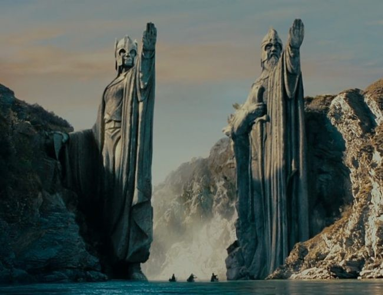
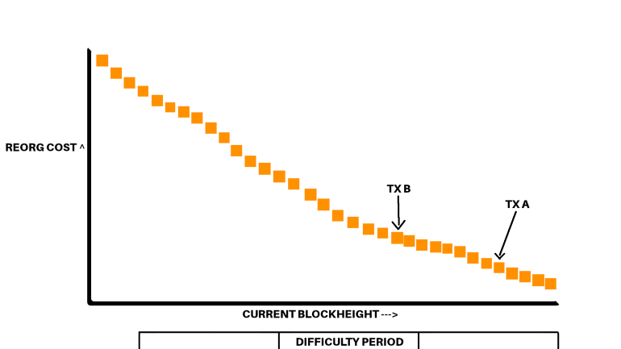

> *作者：Shinobi [SHI256]*
> 
> *来源：<https://medium.com/block-digest-mempool/defining-and-discussing-bitcoin-security-38f35cc80c18>*

## 没有 “网络安全性” 这回事

喜欢度量东西是人类的天性。从时间，到食物，一切的一切我们都想度量。这是我们的本能，也是我们跟踪自己拥有、消费的东西以及所有我们感兴趣的东西的方式。

比特币的安全性也是我们想要度量的事项之一，但对于你无法确切定义的东西，度量是很难的。大多数人在怀有 “‘比特币的安全性’ 由矿工提供” 的想法时，都把安全性当成了整个网络的属性，就像整个网络是铁板一块。“比特币网络整体上就是这么安全”。但根本就没有这样一整块的铁板。我说这些不是为了制造愚蠢的文字游戏，而是从字面意义上，就不存在一个你可以连续地度量的、完整的一块东西。

每一个 UTXO 都有自己的安全性，基于它被包含于其中的区块、该区块的难度以及后续区块的难度。换句话说，并不存在整个 UTXO 集的安全性这样的东西。每个 UTXO 都有不同的安全性。我的 UTXO 埋在 12000 个难度连续增长的区块下面，你的 UTXO 则刚刚在同一难度周期的 3 个区块以前从 Coinbase 支付给你，所以我的 UTXO 比你的安全。可以想象成这样的一个图形：

这里的所有数字都是瞎写的，而且我很清楚一个难度调整周期的长度超过 11 个区块。但这只是一个简化的例子，为了不必花上 4 个小时在一张图片上画处 2016 个正方形，我们先搁置这种怀疑。我们先为最近的一个难度周期分配一个 “能源成本”，假设是 5 个能源单位。现在，我们可以花费 25 个能源单位来重组交易 A 入块以来的 5 个区块，并取消掉它。现在（请记住这些数字都是随意安排的）假设 5 个能源单位价值半个比特币，这就意味着，取消交易 A 的成本是 2.5 个 BTC。

在两种情况下，一个矿工会理性地支付 2.5 BTC 并花费 25 单位的能源来重组交易 A 。

- 该矿工正是这笔交易的发送方，而 TA 发送了超过 2.5 BTC，因此他们可以重组区块链并拿回自己发送出去的 BTC。TA 的 “支付额” 与重组花费的成本（能源成本）就是 TA 的利润。
- 在交易 A 被确认的那个区块以及所有后续（直至链首）的区块中，包含大量的手续费，使得矿工花费 2.5 BTC 来挖掘这些区块，所得比之花费 0.5 BTC 来挖掘（链首块的）下一个区块更为可观。

对于交易 B，我们为其所在的难度周期分配 0.4 BTC 的能源成本。所以，需要花费 63 单位的能源，也就是 6.3 BTC 来重组区块链并取消交易 B。

再提醒一句，无论是上面哪一种情况，发起重组的矿工都必须拥有绝对多数的哈希率，这样他们才能及时（在其他矿工还未内集体挖出更长的链时） “重新挖出” 这些旧区块。所以矿工必须拥有绝对多数哈希率，51% 还不行，要远高于这个比例。

但这里的重点依然是：除非旧区块的手续费大大超过未来区块的手续费（大于重组旧区块的成本超过挖掘新区块的成本的差额），或者一个矿工正是一笔非常大的、值得重组的交易的发送方，否则没有理性的激励去重组区块链。

不过，还有第三种因素需要考虑：不是被利益驱动的实体，例如想要攻击比特币的民族国家。他们可能不像其他主体那样在乎 *直接* 的 代价/利润。但是，这并不意味着这样的主体就能直接 “杀死比特币” 或者削弱整个比特币网络的安全性（就像我前面解释的，这样的概念甚至不能成立）。最终来说他们还是必须发布一条重组后的区块链。同时，如果他们想要保持这种局面，他们的每单位能源的运营成本就要升高，高到一部分矿工不再对抗他们的攻击。举个例子，如果一个攻击者拥有一半的矿工，那么两个矿工团体实际上都要支付两倍的能源单位以忽略对方挖出的区块、防止它们进入区块链。这种能源成本的增加会一直持续下去，直到一方放弃挖矿。（我当然知道我在上面说了，攻击者要有远超过一半的哈希率才行，但我不是说了嘛，不要在意具体的数字。我只是希望让这里的原理尽可能符合直觉。）一旦攻击者停止花费两倍的能源来阻止其他矿工的区块被包含到区块链上，挖矿的能源成本就会恢复正常。

对这样的民族国家来说，经济激励有所不同，但事实并没有改变：只有这样的攻击能够成功重组的深度以内的 UTXO 的安全性才会受到影响。如果这样的攻击只能重组过去的 6 个区块，那就只有过去 6 个区块所产生的 UTXO 才会因为这种攻击而有安全风险。

## 矿工提供的 “比特币安全性” 防御了什么？

我在上文中指出了跟重组有关的基本经济激励以及 UTXO 的安全性，它们跟只受内部利润动机激励的行动者以及不受这样的利润动机激励的行动者相关，但我是把上面的讨论放在真空里面的。我没有讨论购买能源的可得性！你可以拥有全世界所有的 ASIC（专用计算设备，这里指挖矿的机器），但这没什么用，因为你没有电力来运行它们。

假设比特币挖矿行业每年消耗 100 万能源单位。再假设人类社会在其他生产性领域（制造业、发热、照明、供水，等等）消耗 10 亿能源单位。我打赌你们中的大部分人都会认为这时候的比特币是非常不安全的，随便一个民族国家就可以攻击它。假设一个国家每年有 1 万单位的废弃能源可用。这离攻击比特币也还差得远，因为它每年耗费 100 万单位能源。你可能会认为，“且慢，其它行业不是每年共计使用 10 亿单位能源吗，用这些能源不就行了吗。” 是，但它会比 51% 攻击所需要的两倍代价更为昂贵。因为 你不得不比其它消费者出价更高。它会让攻击的代价变得更高。“但是政府不还是能这样做吗。” 那么，在民众生气和制造出其它问题之前，政府能 “拿走” 多少能源呢？这不会激起革命吗？

现在，现实就是，现实世界中可用的废弃能源（在这些完全是随意编造的数字的背景下）可能就是几千万单位级别。如果你有足够多的芯片，当然有足够多的废弃能源可以用来攻击比特币。但是越来越多的诚实矿工在搜寻这些废弃能源，因为这些能源更加便宜。而其中的一些（比如从天然气井漏出的天然气）是非常分散的，在技术上不是那么容易掌控。

那么这一章的意思是什么呢？在讨论民族国家攻击时，诚实矿工**不是**在保卫一些想象中的、没有意义的 “已花费的能源单位/比特币总市值” 比值。他们在对抗那些可以被攻击者投入到 ASIC 中的废弃能源单位。只要这些废弃能源的主要部分被诚实矿工所消耗（而且在不引起社会动荡的前提下没有足够多的能源可以从别的用途中抽出来），或者（甚至）恶意矿工不会跟其他人串通从而无法建立足够高的算力比例，那么比特币就可以抵御民族国家攻击。这并不要求矿工所消耗的能源持续增加，因为比特币的市值自身就足以稳定矿工所消耗的能源数量。

在讨论纯粹基于利润动机而发起重组的内部攻击者时，市场自身就解决了这个问题。如果一个实体使自己的能源单位的成本上升到预期收入的水平、不能从中获得利润，他们自然会停止。如果这样的一个矿工尝试捕获其他矿工获得的手续费，那就没有必要担心审查和许多交易被删除：矿工是为了手续费而来，交易自然是多多益善。而如果这样的矿工想收回自己的交易：那么受影响的就只有这笔交易的接收者，矿工也没有明显的动机去取消其它交易。收到面额很大且发送者资本充足、足以成为矿工的交易，人么会自然等待更多的确认，然后再履行作为支付接收方的义务。市场自身就可以解决这个问题。

## 时间锁，多签名以及激励

也许到目前为之我所说的内容都是你已经知道的，或者即使你无法合适地表述出来但直觉上也觉得是如此，但我很确定，接下来的一部分，是开发者圈子之外的许多人没有深入考虑过的。

在一个恶意矿工尝试撤回自己的交易（或者有人贿赂矿工这么做的时候），还有一个非常明显的要求，但几乎从未被提起过：想要撤回交易的一方必须拥有可以签名新交易从而重复花费同一笔资金的私钥，不然接收者就可以直接重新广播原来的那一笔交易。

希望你已经猜到我要说什么了 : )

基于多签名的二层。闪电网络基于 n-of-n 的多签名交易（一条通道的两个参与者必须签名同一笔交易，这笔交易才是有效的），而像 Liquid 这样的侧链基于 m-of-n 的多签名（并非所有的参与者都要签名交易）。所以，如果越来越多的经济活动会迁移到闪电网络和 Liquid（以及 Statechain、通道工厂以及还未发明的种种）中，发动攻击的最基础的条件都是极为难以满足的，甚至根本就是不可能的。在 n-of-n 的协议中，只要一个参与者拒绝，在重组的同时想要收回资金的重复花费交易就根本无法获得足够的签名！攻击直接变成不可能的了！对于 m-of-n 的结构（隐式基于信任关系）来说，需要 (n-m)+1 个参与者拒绝签名才能杜绝这种攻击。所以，在个人的交易被放到这样的二层结构的世界中，重组攻击必须考虑埋得更深的二层结构融资交易，因为一旦这样的融资交易埋得很深，重组攻击要么完全不可行，要么必须引诱人们进入虚假的联盟保护的二层结构中否则极为难以串谋。还有一个需要考虑的事情是，在合作的情境中，资金会从一个多签名输出移动到另一个多签名输出，如是反复，而不会进入到被单个人控制的地址，所以，在 UTXO 的链条上你可能再也找不到在链首块附近的、单方控制的 UTXO 来发动重组攻击了。

还没结束 …… 时间锁。我前面讨论的另一种完全基于利润动机的攻击是重组区块链以攫取手续费，因为向前出块的利益更小。当前少数钱包实践了、但可以很好地应对这种攻击的基本技巧是将交易的时间锁设到当时区块高度的下一个高度。闪电网络这样的二层协议会天然这样做，为了非合作关闭通道的情形或者响应。闪电通道的双方实际上建立了一个预签名交易的链条，这些预签名交易都有相互交错的时间锁，这样就无法立即包含在下一个区块中。这些应对非合作关闭情形的操作保证了手续费收入是平滑地分布在未来的多个区块中的，而不是可以塞进任意区块中。

## 结论

比特币的许多方面都可以定期量化，人们也围绕这些指标形成决策。我觉得量化比特币没有错，尝试基于指标采取有利的行动也没有错。或者，使用这样的指标可以更好地回应对比特币的批评，或者帮助人们理解比特币。但如果这些指标依据的完全错误的前提，那就没什么可取之处了。

希望我为比特币安全性的工作原理以及它所对抗的东西给出了更清晰的定义，并证明了一些自然的长期趋势、二层结构跟比特币交互的方式可以帮助自然纠正攻击区块链的激励。

一笔交易因为重组而从区块链中删除并不意味着比特币不能抗篡改，我们也从来没有保证过绝对不会发生重组。

（完）

