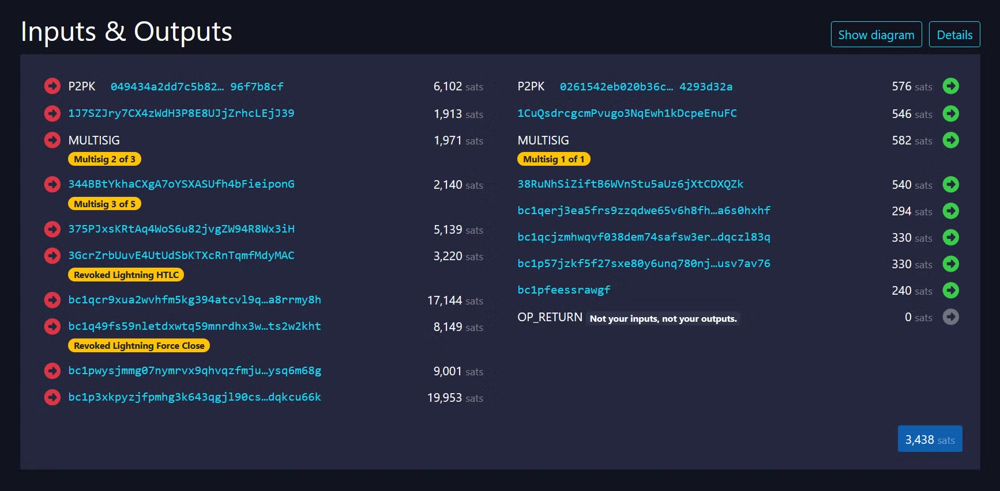

> *作者：Vojtěch Strnad*
> 
> *来源：<https://stacker.news/items/600187>*


> 译者注：本文介绍的是一笔特意制作的奇怪交易，展现了比特币协议自身的复杂性和灵活性。

如果你经常逛 Twitter 或 Stacker News，那么你可能会留意到，人们讨论了主网上出现的一笔奇怪的比特币交易：

https://mempool.space/tx/b10c0000004da5a9d1d9b4ae32e09f0b3e62d21a5cce5428d4ad714fb444eb5d



它吸引了很多人的关注，人们迫切想知道：是谁制作了这笔奇怪的交易？它隐藏着什么秘密？

让我来揭晓这两个问题的答案。

消息：

```
Transaction b10c0000004da5a9d1d9b4ae32e09f0b3e62d21a5cce5428d4ad714fb444eb5d was created by Vojtěch Strnad.
```

地址：

```
1J7SZJry7CX4zWdH3P8E8UJjZrhcLEjJ39
```

签名：

```
H6WHgwnYtggJH5yqVpeL9NRxWJ+8hqUW31Mc1J9e9Q3cZGEdDjixYT6jnPpIHM2FVHDbeEstP8KzDsj5U01BNSo=
```

如果你想自己验证一下这个签名（我非常建议这么做哦），请不用在酒店 Wi-Fi 下使用 Bitcoin Core 或 Electrum 哦。

搞定这个事情之后，我们就要揭晓这笔交易中的每一个彩蛋了。其中最后两个，就我所知，到我写这篇文章的时候也还没有任何人注意到：

- 该交易被区块 850000 首次确认。
- 该交易的 locktime 是比特币创世区块的时间戳。（译者注：locktime 是交易层面的绝对时间锁的实现方法；在此处，其含义是该笔交易仅在创世区块出现后才能被确认。）
- 这笔交易有一个浮夸的 TXID 和 WTXID。TXID 的开头是 `b10c0000004da5...` ，是比特币开发者 0xB10C 的个人主页，他曾经制作过一笔有类似 TXID 的交易（见：https://b10c.me/7 ）。而 WTXID 的开头是 `0000000001d54...` ，也就是一系列的零，就像区块哈希值一样。
- 这笔交易使用了每一种可能的标准输入和输出类型：P2PK、P2PKH、P2MS（裸的多签名）、P2SH、P2WPKH、P2WSH、P2TR、OP_RETURN 以及一个 2 字节的 SegWit v1 输出（使用的是从 “临时锚点” 协议借用来的脚本）。一部分类型在输入中多次使用：P2SH 就分成了传统的 P2SH、封装的 P2WPKH 以及封装的 P2WSH，而 P2TR 则分成了密钥路径花费和脚本路径花费两种情形。（译者注：在比特币网络中，节点会默认传播具有某一些特征的交易；而 “标准输入/输出” 就是这样的特征之一。输入/输出 的类型指的是用来锁定该笔资金的脚本的 “模板”；由于不同资金本身是相互独立的，我们就可以为使用不同模板的脚本适用略微不同的验证规则，这就是比特币软分叉升级可能性的由来。这里所谓的 “封装的 P2WPKH/P2WSH”，则是在隔离见证时，为了方便尚不支持隔离见证特性的旧钱包向隔离见证脚本发送资金，而特地设计的、让隔离见证脚本表现为 P2SH 脚本的类型。）
- 输入中有多个多签名脚本和闪电通道相关脚本：裸多签名输入用的是 2-of-3 多签名装置，传统的 P2SH 是 3-of-5 多签名，封装的 P2WSH 是一个撤销的闪电通道 HTLC，P2WSH 是一笔撤销的闪电通道强制关闭（通常叫做 “惩罚交易”），且具备一个不常用的短 CSV 延迟（42 个区块），而 P2TR 脚本路径使用的是一个 5-of-7 多签名（既是为了延续质数模式，也是为了引用 “5/7” 梗）。（译者注：CSV 即是脚本层面的相对时间锁）。
- 输入的数额都有特殊的含义：6102 指的是美国 6102 号行政令（译者注：禁止私人储蓄黄金）、1913 是美联储（Fed）成立的时间，1971 是美国废止金本位的时间，2010 是比特币预计最后一次减半的时间（届时区块补贴将下降到 0），5139 指的是 CVE-2010-5139（比特币数值溢出漏洞），3220 指的是 CVE-2013-3220（2013 年的意外分叉），17144 指的是 CVE-2018-17144（未被利用的通胀漏洞），8149 指的是 Bitcoin 实现隔离见证的 PR 号，9001 指的是 “超过 9000 了！” 表情包，19953 指的是 Bitcoin Core 实现 Taproot 的 PR 号。
- 输出的数额展示了每一种输出类型的粉尘门槛：使用压缩公钥的 P2PK 输出是 576 聪，P2PKH 是 546 聪，使用压缩公钥的 1-of-1 裸多签名输出是 582 聪，P2SH 是 540 聪，20 字节的隔离见证输出（P2WPKH）是 294 聪、32 字节的隔离见证输出（P2WSH 和 P2TR）是 330 聪，2 字节的隔离见证输出是 240 聪，OP_RETURN 是 0 聪。
- 输入的 sequence 数字有特殊的含义：20090103 指的是创世区块产生的日期，20081031 指的是白皮书的出版时间，19750504 指的是中本聪自曝的出生日期，16 指的是 BIP-16（P2SH 升级），141 指的是 BIP-141（隔离见证升级），0xdeadbeef 是一个众所周知的魔法数字（在这里用作对封装的 P2WSH 的 80 比特安全性的评论），21000000 是我们所有人都知道并且喜爱的数字，0xf9beb4d9 是用在比特币 P2P 协议中的魔法数字，341 指的是 BIP-341（Taproot 升级），而 342 指的是 BIP-342（Tapscript）。
- 这笔交易使用了不同长度的 DER 编码的 ECDSA 签名：71 字节、70、69、68、67、66、65、59、58 和 57。签名一般长 71 或 72 字节，但可以通过重复尝试来获得较短的签名；这叫做 “签名研磨”。后面三个尤其短，因为它们[使用了 secp256k1 曲线上一个已知的短 r 值](https://crypto.stackexchange.com/a/76010)。
- 这笔交易使用了所有种类的 sighash 标签：SIGHASH_DEFAULT、SIGHASH_ALL、SIGHASH_NONE、SIGHASH_SINGLE、SIGHASH_ALL | SIGHASH_ANYONECANPAY、SIGHASH_NONE | SIGHASH_ANYONECANPAY 和 SIGHASH_SINGLE | SIGHASH_ANYONECANPAY。（译者注：sighash 标签可以让一个签名跟交易的特定部分绑定；改动被绑定的部分会使签名失效，而改动没有被绑定的部分则不会影响签名的有效性。例如，SIGHASH_ALL 表示该签名与一笔交易的所有部分绑定，改动任何 输入/输出 都会使该签名失效。反过来说，sighash 让我们可以辨别一笔交易是不是签名者愿意签署的那笔交易。）
- OP_RETURN 输出在初始文本推入之后，包含了数字 0 到 16 的推入（puch）操作码。多次推入不会打破任何标准型规则，只要输出的体积在不超出限制。
- 在多个输入中使用了未压缩的公钥，并且在多签名脚本中混合使用压缩的和未压缩的公钥。（译者注：公钥是椭圆曲线上的一个点，因此有两种表示形式，一种是 x 坐标及 y 坐标，另一种是只给出 x 坐标，加上 y 值的奇偶性（或对 y 值的奇偶性作另外的强制安排）；前者称为未压缩形式，后者称为压缩形式。早期的比特币曾使用未压缩形式，后来则逐渐强制要求压缩形式（可节约链上空间）。）
- 在 P2MS 以及传统的 P2SH 输入中，未使用的多签名公钥是创世区块的 coinbase 公钥、区块 9 的 coinbase key 以及 Hal Finney 用在[有史以来第一笔比特币交易](https://mempool.space/tx/f4184fc596403b9d638783cf57adfe4c75c605f6356fbc91338530e9831e9e16#vin=0)中的公钥。P2TR 脚本花费多签名装置中的两个未使用的公钥是来自[有史以来第一笔 P2TR 脚本花费交易](https://mempool.space/tx/37777defed8717c581b4c0509329550e344bdc14ac38f71fc050096887e535c8)中的两个公钥。P2TR 脚本花费中的内部公钥是白皮书的 SHA-256 哈希值。最后，HTLC 脚本中的 20 字节的哈希值对应于地址 17TASsYPbdLrJo3UDxFfCMu5GXmxFwVZSW，该地址被用在 2010 年的数值溢出漏洞中，其用在攻击中的 0.5 BTC 一直到现在也没有再移动过。
- P2TR 脚本花费输入有一棵深度为 21 的的默克尔树，比之前曾经出现过的都要深（此前的最高记录是 7 层）。控制块中揭晓的默克尔分支数值并不是随机的哈希值，而是对比特币历史有重大影响的 21 笔交易的 TXID：
  - 2009-01-03 创世区块的 coinbase 交易：
    4a5e1e4baab89f3a32518a88c31bc87f618f76673e2cc77ab2127b7afdeda33b
  - 2009-01-12 第一笔非 coinbase 交易（由中本聪发送给 Hal）：
    f4184fc596403b9d638783cf57adfe4c75c605f6356fbc91338530e9831e9e16
  - 2009-01-16 第一笔发送到 P2PKH 脚本的交易：
    6f7cf9580f1c2dfb3c4d5d043cdbb128c640e3f20161245aa7372e9666168516
  - 2010-05-22 Laszlo Hanyecz 的披萨交易（价值 10000 BTC）：
    a1075db55d416d3ca199f55b6084e2115b9345e16c5cf302fc80e9d5fbf5d48d
  - 2010-11-14 第一笔具有重合 TXID 的交易（BIP-30 的第一个例外）：
    d5d27987d2a3dfc724e359870c6644b40e497bdc0589a033220fe15429d88599
  - 2010-11-15 第一笔具有重合 TXID 的交易（BIP-30 的第二个例外）：
    e3bf3d07d4b0375638d5f1db5255fe07ba2c4cb067cd81b84ee974b6585fb468
  - 2011-11-16 迄今面额最大的比特币交易（550,000 BTC）：
    29a3efd3ef04f9153d47a990bd7b048a4b2d213daaa5fb8ed670fb85f13bdbcf
  - 2013-04-06 包含了完整比特币白皮书的交易：
    54e48e5f5c656b26c3bca14a8c95aa583d07ebe84dde3b7dd4a78f4e4186e713
  - 2013-11-05 Rickroll 交易：
    d29c9c0e8e4d2a9790922af73f0b8d51f0bd4bb19940d9cf910ead8fbe85bc9b
  - 2015-07-07 F2Pool 的 “巨型交易（Megatransaction）” 需要花 25 秒来验证（详见 [Rusty Russell 撰写的博客](http://rusty.ozlabs.org/2015/07/08/the-megatransaction-why-does-it-take-25-seconds.html)）：
    bb41a757f405890fb0f5856228e23b715702d714d59bf2b1feb70d8b2b4e3e08
  - 2015-07-11 F2Pool 与 Greg Maxwell 合作制造的另一笔相似交易，使用了 SIGHASH_SINGLE bug 因此易于验证，还使用短 r 值技巧获得更小的签名：
    9fdbcf0ef9d8d00f66e47917f67cc5d78aec1ac786e2abb8d2facb4e4790aad6
  - 2016-04-26 迄今支付最高手续费的单体交易（291 BTC）：
    cc455ae816e6cdafdb58d54e35d4f46d860047458eacf1c7405dc634631c570d
  - 2017-02-23 领取 SHA-1 碰撞奖金的交易：
    8d31992805518fd62daa3bdd2a5c4fd2cd3054c9b3dca1d78055e9528cff6adc
  - 2017-08-24 第一笔隔离见证花费交易：
    8f907925d2ebe48765103e6845c06f1f2bb77c6adc1cc002865865eb5cfd5c1c
  - 2021-07-23 0xB10C 的任何人都可花费的 P2TR 交易（详见：https://b10c.me/7 ）：
    b10c007c60e14f9d087e0291d4d0c7869697c6681d979c6639dbd960792b4d41
  - 2021-11-14 第一笔 Taproot 花费交易：
    33e794d097969002ee05d336686fc03c9e15a597c1b9827669460fac98799036
  - 2021-11-14 第一笔 Taproot 脚本花费交易：
    37777defed8717c581b4c0509329550e344bdc14ac38f71fc050096887e535c8
  - 2021-12-07 王纯给 Luke Dashjr 捐赠的 1 BTC（找零为 8999 BTC）：
    fd456524104a6674693c29946543f8a0befccce5a352bda55ec8559fc630f5f3
  - 2022-10-09 Burak 的 998-of-999 多签名花费，打破了 LND：
    7393096d97bfee8660f4100ffd61874d62f9a65de9fb6acf740c4c386990ef73
  - 2022-11-01 Burak 再次打破 LND 的交易：
    73be398c4bdc43709db7398106609eea2a7841aaf3a4fa2000dc18184faa2a7e
  - 2023-11-23 以法币计手续费最高的交易（86 BTC 或 313 万美元）：
    b5a2af5845a8d3796308ff9840e567b14cf6bb158ff26c999e6f9a1f5448f9aa

整个项目花费了超过 1 年的时间才完成。最初我只是想制作一笔包含每一种可能输入和输出类型的交易，作为比较各区块浏览器特性的参考交易，但随着我产生越来越多的想法，复杂性也逐渐爆炸，最终变成了你们看到的样子。我学到了很多，不仅关于比特币协议，也关于比特币的历史。我用 TypeScript 语言和 BitcoinJS 编写了生成这笔交易的代码；少量性能敏感的部分是后来用 Rust 写的，我为了这个目的而专门学习了这种语言。

感谢 mononaut [最先注意到我的交易](https://x.com/mononautical/status/1807189726501499268)，就在我创建它的几个小时之后，并且也是第一个注意到其 TXID 的重要性的人。然后，Super Testnet 写了一篇 [Stacker News 帖子](https://stacker.news/items/593226)，列出了当时知道的每一个彩蛋（也是许多彩蛋的第一发现人）。最后，感谢另一些也发现了彩蛋的人：Sebastian Falbesoner、Rob Hamilton、Tom Honzik、iWarp、Jiří Jakeš、Portland.HODL、pycan、Gregory Sanders、Tomer Strolight 和 Peter Todd 。

非常感谢比特币的开发者社区、比特币的技术作者，以及在 Bitcoin Stack Exchange 上回答问题的人。没有大家，这个项目是不可能完成的。我也非常感谢对这笔交易表示赞赏的人，这对我来说意义非凡。

如果你还有问题，我非常乐意回答。如果问题是其他人也能够回答的，请考虑发到 Bitcoin Stack Exchange，这样更有可能帮到其他读者。

（完）