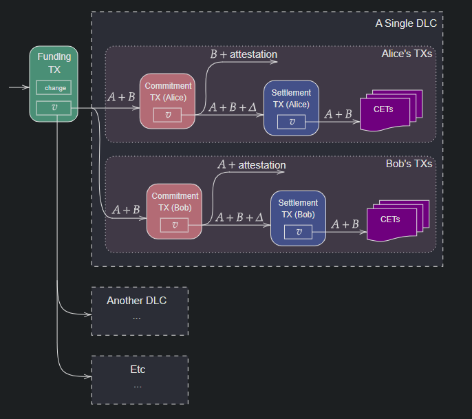

> *作者：conduition*
> 
> *来源：<https://conduition.io/scriptless/dlc-factory/>*

本文介绍了一种创建链下的 “谨慎日志合约（[DLCs](https://www.dlc.wiki/)）” 并且无需任何链上交易就可以延长合约的比特币交易范式。我将这些交易统称为 “工厂”，因为我们只需一笔链上注资交易就可以创建无限数量的 DLC。你可以认为它们是 “无尽 DLC” 或者 “自动展期的 DLC”。

- DLC 工厂可以无尽延展，而且无需任何链上交易。任何一方都可以在预先确定的窗口期内打断合约或者提早结算。
- DLC 工厂是灵活和不对称的，允许我们创建类似于交易金融期权合约的金融工具和类似于稳定币的合约（可以按照固定的美元价值随时赎回比特币）。
- 没有引入新的受信任第三方。只需要一个被动的断言机，这跟传统 DLC 没有区别。

## 交易流程图

## 建立流程

- 准备向 Alice 和 Bob 共享的 2-of-2 多签名 UTXO 注资。两方共享的这项权利在图中表示为 “A + B”。
- 创建两笔花费注资输出的 *承诺交易*，一笔是给 Alice 的，一笔是给 Bob 的。
  - 承诺交易可以选择性设置一个绝对时间锁，以防止持有者过早发布它。
  - 承诺交易只有 1 个输入和 1 个输出 * 。
  - Alice 的承诺交易可以这样被花费：
    - Alice 和 Bob 都签名；或者
    - Bob 签名，且：
      - 具有该 DLC 的 *任一* 有效见证消息（attestation）；或者，
      - 具有一个跟其它相关 DLC 关联的清算见证消息（可选）
  - Bob 的承诺交易可以这样被花费：
    - Alice 和 Bob 都签名；或者
    - Bob 签名，且：
      - 具有该 DLC 的 *任一* 有效见证消息（attestation）；或者，
      - 具有一个跟其它相关 DLC 关联的清算见证消息（可选）
- 对每一笔承诺交易，创建一笔 *结算交易*，它会花费对应的承诺交易的输出。
  - 结算交易只有 1 个输入和 1 个输出 * 。
  - 结算交易具有相对时间锁，记为 “$\Delta$”
  - 结算交易的输出只有 Alice 和 Bob 都签名才能花费。
- 从 Alice 和 Bob 各自的结算交易输出中创建两组 DLC 合约执行交易（CETs）。
  - 一笔 CET 只能花费一个结算交易 —— 它们是完全互斥的。

\* 这些交易需要锚点输出，以应对交易手续费市场的波动。

一旦合约交易的结构得到了双方的共识，Alice 和 Bob 就可以拿合适的断言机宣告作为适配器点，签名所有的 CET。

最后，Alice 和 Bob 合作式签名承诺交易和结算交易，但关键的是 —— 各方只收到对手方对 *己方版本* 的 承诺交易/结算交易 的签名，也即：Alice 收到 Bob 对 Alice 的承诺交易和结算交易的签名，而 Bob 收到 Alice 对 Bob 版本的承诺交易和结算交易的签名。不过，为了防止敲诈（griefing），双方都需要来自对方对两套 CET 的适配器签名。我会在 “分析” 章节解释这种不对称性。

在交换完签名后，双方都可以签名和发布注资交易。一旦交易被发布和确认，这个 DLC 工厂就开启了。后签名的一方相当于能够得到一个免费的期权（可以决定发布或不发布），但常规的 DLC 也是这样的，是一个已知的开放问题。

## 结算

如果某一方想单方结算一个 DLC 工厂，那么首先要决定结算哪个 DLC，然后发布该 DLC 的承诺交易。该承诺交易的锁定时间（如果有的话）必须已经到期，而且 DLC 的见证消息必须还没有发布；在结算交易花费方法的相对时间锁到期之前，也无法发布结算交易。

然后，我们要发布结算交易，它会完全锁定一个具体的 DLC。一旦结算交易得到确认，整个合约就会变得跟传统的 DLC 一模一样：等待断言机的见证发布，而一旦发布，这个见证就可以用来解锁并广播其中一笔带有适配器签名的合约执行交易。

这就是为什么双方都要收到对手方对两套 CET 的适配器签名：举个例子，如果 Alice 没有 Bob 对 Bob CET 的适配器签名，那么 Bob 就可以敲诈 Alice，他可以把他的 承诺交易/结算交易 发布到链上，而 Alice 无法代表 Bob 发布任何 CET；如果断言机所见证的结果有利于 Alice，Bob 可以躲起来，不让 Alice 取走应该属于她的资金。

若要合作式结算一个 DLC 工厂，Alice 和 Bob 可以协商一个他们希望注资的新 DLC。默认情况下，这能能是其中一个他们都已经同意执行的 DLC，不过，也可以按需调整。一旦双方达成一致，他们就创建一笔 *合作关闭* 交易、花费掉注资出书，然后签名一组花费这笔合作关闭交易的 CET。这些 CET 会根据 Alice 和 Bob 已经同意的断言机宣告的条件来分割资金，并且，这些 CET 将是他们为这个 DLC 工厂合约签名的最后一组 CET。

Alice 和 Bob 可以合作式签名和发布合作关闭交易，从此开始执行一个普通的 DLC 。如果任何一方在其中停止合作，另一方可以回到单方结算模式中，发布自己手上的一个承诺交易。

## 惩罚

注意，一旦结算交易被发布，双方都可以安全地离线，即使 DLC 见证已经发布。不过，在此之前，Alice 和 Bob 都必须保持在线和警惕：如果对手方发布一个旧的过时的承诺交易，就要惩罚对方。也就是说，需要在相对时间锁 $\Delta$ 过期之前，发布一笔惩罚交易、拿走承诺交易输出中的所有价值。

此外，跟闪电通道一样，这种惩罚机制可以由一个不受信任的瞭望塔独立地代表参与者执行。只是修改了惩罚路径，从而 Alice 和 Bob 都适配签名了一笔惩罚交易，该签名可以用断言机的任何一个见证来补完。所以参与者可以把这些交易的副本和断言机宣告的指针交给瞭望塔。瞭望塔如果监测到过时（相应的见证消息已经被发布）的承诺交易被发布，就可以解锁并发布惩罚交易。

如果一个 DLC 是被合作式结算的，这个瞭望塔就无法直接知晓这个合约涉及哪些资金，尽管瞭望塔的确能知道相关的数额以及合约所涉及的断言机事件。

## 分析

这种结构让 Alice 和 Bob 可以跟对方缔结多个互斥的 DLC，而且任何一方都可以用工厂中的任何一个 DLC 结算，只要该 DLC 的见证 *还没有被发布*、并且不会在承诺交易确认后的相对时间锁窗口内公布，就可以了。如果见证会在时间锁窗口内公开，那么对手方就可以从承诺交易中取走所有的价值。这就构成了 Alice 或者 Bob 可以安全发布自己的承诺交易的一个最终时间点。

这种结构有什么用呢？它可以 *无限展期一个 DLC 而无需动用链上交易*。延长一个 DLC 工厂合约是非常简单的：只需签名一组新的 CET、结算交易和使用一组新断言机公告的承诺交易即可。旧的DLC 在前述时间点到达之前，依然是可以执行的。而在到达上述时间点之后，新的 DLC 就会顶替上来，因为任何一方都不再能安全地发布旧的承诺交易。如果双方不能已知同意延长这个 DLC 工厂，那么任何一方都可以直接发布一笔承诺交易，从而锁定执行具体的一个 DLC。

因此，DLC 工厂让我们可以创建多个在不同时间点结算的金融合约，而不是只能创建在一个固定时间到期的合约。

比如说，Alice 和 Bob 可以创建一个差价合约（CFD），也即双方都同意基于特定底层资产（比如黄金、某种股票，甚至是比特币）的价格给对方支付一定数量的金钱。这种合约[已经可以用 DLC 实现](https://github.com/p2pderivatives/cfd-dlc)了，但是，以前的比特币 DLC 做法总是假设 CFD 合约有一个固定的到期日，而在传统的交易所中，CDF 可以在任何时间结算，而且可以无限展期。DLC 工厂旧可以在比特币让模拟 CFD 这种非常灵活的特性，让短线交易员来定价。

我们也可以用这种方法来创建其他更复杂的金融工具。因为承诺交易是不对称的，我们可以为两方创建完全不同的 DLC，从而，以哪个 DLC 结算将取决于哪一方发布 承诺/结算 交易。我们还可以通过简单省去某一方的承诺交易来防止其发起结算。我们可以创造：

- 根据发起结算程序的参与者身份来调整支付的差价合约。
- 类似于期权的合约 —— 仅有一方可以 “执行” 合约。
- 类似于稳定币的合约 —— 合约持有人随时都能换回价值一定数量美元的 BTC。
  - 另一方则实际上获得了相反的合约：利用自己的比特币存量来 *获得更多比特币*（如果比特币跌价的话），*可以想象，某些比特币爱好者一定会喜欢这个* ……

## 修改

DLC 工厂可以适用多种定制化的方法来适应特定的应用场景。

- 承诺交易上的绝对时间锁可以用来定义优先级，从而任何时候，都只有部分承诺交易可以广播出去。比如说，一个 DLC 工厂可能给每一天安排了一个 DLC，然后每一个 DLC 都有一个在早上 8 点可以启用的承诺交易，而对应的事件会在早上 11 点宣告。如果 $\Delta$ 为 1 小时，那么，参与者将仅在每天早上 8 点到 10 点之间可以安全地发布对应于当天的承诺交易。如果早上 10 点之后才发布，对手方就可以使用惩罚分支来劫走所有资金。
- 也可以为两方设置不同的时间锁，从而，在特定时间，只有一方可以 “锁定” 一个 DLC，而另一方不能。比如说，一方可以随时结算 DLC 工厂，而另一方只能在工作日的工作时间才能发起结算。
- 承诺交易输出的惩罚分支可以使用一个时间锁，而不是见证锁，从而如果在某个时间点之后发布承诺交易，就会把资金全部送给对手方。如果断言机的见证非常准时，而对抗瞭望塔的隐私性又非常重要中，这种特性可能会有用，因为它不会给瞭望塔任何信息（除了 DLC 工厂所涉及的总价值）。
- 承诺交易输出可以设置一条额外的、使用闪电通道类型撤销秘密值的惩罚路径。这将让参与者可以手动作废未来的承诺交易，从而允许在工厂中协商未来的 DLC 。
- CET 可以设为不对称的，根据关闭工厂的角色进行差异化支付。比如，关闭者手上的 CET 将给他们一个（比对手）稍微差一点的报酬曲线，以激励双方合作关闭工厂，而不是单方强制关闭工厂。
- 还可以给注资输出脚本添加一个 HTLC 条件，从而允许所有权通过链上交易免信任地转移；这将允许人们使用闪电网络狗仔一个 DLC 工厂中的一定仓位（需要更多研究）。

## 缺点

有优点，就难免有缺点。

### 性能

涉及到数字结果的 DLC 已经非常难签名和验证了，因为常常需要大量的 CET 适配器签名。DLC 工厂则会再慢上一倍，因为每一个 DLC 都是不对称的，需要两组 CET。而且，显而易见，每多一对承诺交易，都要多作一次签名程序。签名/验证 的性能在期权这样的合约中是最好的，因为只有一方有能力发布承诺交易。

虽然 DLC 工厂的性能成本很高，但成本可以随时间逐步摊销，因为承诺交易在临近到期之前并不一定要得到签名。所以，参与者可以选择先签名一个 DLC，然后就给合约注资，随着时间推移逐步添加剩余的 CET 签名。

### 活性

DLC 工厂的参与者变成有活性要求了。

在传统的 DLC 中，双方可以离线，哪怕在合约到期之后。如果断言机的见证不能如你所愿，你可以直接离线，让另一方来结算 DLC。

但 DLC 工厂的参与者，就像闪电通道的对等节点一样，必须主动监控区块链，以确保对手方不会发布旧的承诺交易并用过时的见证来盗取资金。每一方都要谨慎确保自己有能力及时提交承诺交易，而这就需要保持在线。

这个不利之处可通过瞭望塔来缓解。

### 死锁

DLC 工厂的参与者也必须保证，如果对手方不愿意通过签名一组新的承诺交易和 CET 来延长工厂的生命，自己能够及时发布一笔承诺交易。否则，工厂可能会进入一种死锁状态：没有任何一方能够单方面在链上解散这个 DLC 工厂，除非双方都回到线上、一起构造一次合作式关闭。

这就类似于闪电通道的参与者一般会在对手方离线很长时间之后强制关闭通道，只不过，在 DLC 通道中，有一个明确的时间点，到了该时间点，工厂就 *必须* 结算，以保证资金可被公平取出。

### 真实世界的事件

DLC 工厂也不便于见证发布日期可能灵活变动的真实世界事件。

首先，好处也很有限：如果一个事情只会发生一次，那为什么要延长一个 DLC 工厂的生命呢？

此外，如果一个见证可能提早释放 —— 例如某个体育赛事被取消了 —— 那么 DLC 工厂的承诺交易可能会意外失效。在这种情况下，为承诺交易输出的惩罚路径加入一个绝对时间锁要求是有用的，如果见证在双方预期时间的很久以前就发布，双方就可以承诺和结算一个 DLC。当然，这种形式的合约对于持续、不断刷新且见证来源可预测的事件有很好的效果，比如金融资产的价格数据。

## 结算交易

你可能会疑惑：为什么要设置结算交易？

设想一种 *不设* 结算交易的 DLC 工厂，这些 CET 是直接花费承诺交易的输出的。在这种情况下，任何承诺交易都无法发布。

在断言机的见证还没公布之前，CET 就无法使用。然而，一旦断言机见证公布，惩罚路径也随之打开！最好的结果是双方将开展一场手续费赛跑，比拼谁能先花费承诺交易的输出。

我们需要一个分段发布的交易来锁定 DLC。这就是结算交易的目的。

> 注意：如果我们以稍微不同的方式设计惩罚机制，让 *后续的* DLC 见证（或其预期发布时间）来结算惩罚分支，结算交易是 *可以* 省去的。这样一来，花费承诺交易的 CET 就可以在惩罚分支可用 *之前* 启用。这是好设计吗？就看你的应用场景了。

## 与 DLC 通道比较

“DLC 工厂” 可能听起来在原理上跟 “[DLC 通道](https://ieeexplore.ieee.org/document/9805512)” 类似：两者都让参与者能够创建许多 DLC，并在链下合作式更新或结算它们。然而，两者在时间锁和承诺机制的用法上有根本的区别。这些区别使得 DLC 工厂在特定用法中更优秀，虽然 DLC 通道在另一些场景更好。

关键区别存在于撤销旧状态的方式。

在 DLC 通道中，承诺交易必须由合约持有者 *手动* 撤销，具体做法是向对手方交出一个撤销秘密值。如果一个旧的承诺交易 *没有* 被手动作废，那它就永远有效，而且可以随时发布，从而在链上锁定一个具体的 DLC。

而在 DLC 工厂，承诺交易一般会 *自动* 撤销，通过断言机的见证 以及/或者 一个绝对时间锁。因此，DLC 工厂的承诺交易自身就有一个无法避免的天然撤销日期，而且没有任何一方可以阻止撤销发生。

|                           | DLC 工厂                         | DLC 通道                           |
| ------------------------- | -------------------------------- | ---------------------------------- |
| 承诺交易撤销              | 见证 以及/或者 时间锁（自动的）  | 秘密值释放（手动的）               |
| 定时炸弹                  | 会形成死锁，除非关闭合约或者更新 | 没有；如不关闭或撤销，合约永久有效 |
| 可以预先签订许多 DLC 吗？ | 可以                             | 不能                               |
| 单方提前结束              | 可以                             | 不能                               |
| 任意协商                  | 可选                             | 可以                               |
| 最适合场景：              | 永续的可中断合约                 | 可更新的固定期限合约               |

使用 DLC 通道时，你会建立通道、签订一个 DLC，然后你会得到一个单方退出选择，但 *只针对* 这个 DLC。即使你有意尝试预先签名许多在后续日期到期的 DLC，你也需要自己的通道对手在这些 DLC 到期后主动撤销它们 —— 否则你的对手可以发布一个旧的承诺交易然后欺诈你。你将不得不提早回到链上，以消除这种可能性。

相比之下，在 DLC 工厂中，你的对手的承诺交易会自动被断言机的见证撤销，或者被无可阻止滴答作响的时间锁撤销，无论 TA 是否合作。这意味着，你和你的对手都无需关心另一方在线与否。你们都可以开心地预先签名任意数量在未来到期的 DLC，并且知道它们都会在预先达成一致意见的时间点撤销（因为承诺交易存在撤销路径）。

两者的区别可以总结为一个警句：*好的工厂自动运行，但通道只能手动改变*。

另一个角度是：DLC 工厂非常像 DLC 通道，只是撤销秘密值是由断言机在无意中独立分发的。这一微笑的设计抉择给了 DLC 工厂非常不同的优点和缺点。

## 结论

此前我已经写过许多关于 DLC 的文章，你应该也看出了我有多么喜欢这个东西。DLC 是创建比特币智能合约的最灵活方式之一，而且它可以用来模拟许多传统的金融工具，并创造一些前所未有的工具。

如果你有使用 DLC 工厂来开发的想法，或者有优化这个概念的建议，请[让我知晓](conduition@proton.me)！

（完）