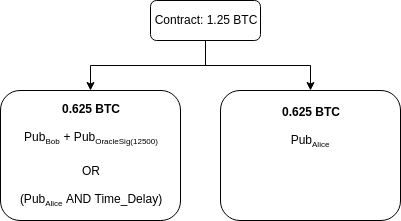
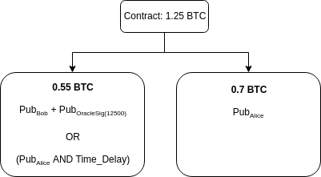
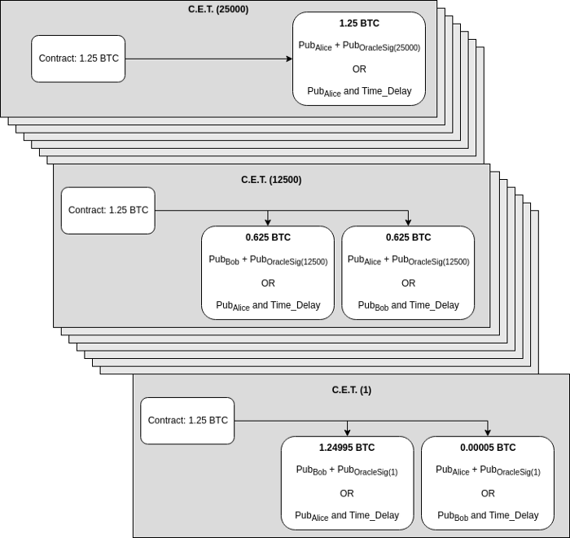

> *作者：Gert-Jaap Glasbergen*
> 
> *来源：<https://medium.com/@gertjaap/discreet-log-contracts-invisible-smart-contracts-on-the-bitcoin-blockchain-cc8afbdbf0db>*

2018 年 3 月 19 日，麻省理工学院（MIT）的数字货币计划（Digital Currency Initiative）和 Fidelity Labs 在波士顿（Boston）组织了 Layer 2 大会。活动期间，来自 DCI 的两位，[Tadge Dryja ](https://twitter.com/tdryja)（研究科学家）和 [Gert-Jaap Glasbergen](https://twitter.com/gertjaap)（软件开发者），给出了 Discreet Log Contract（谨慎日志合约，DLC）的[演讲和演示](https://www.youtube.com/watch?v=2VAPotcB9Dc)。谨慎日志合约的[论文](https://adiabat.github.io/dlc.pdf)由 Tadge Dryja 完成并发表于 2017 年。

在这篇博客中，我们尝试进一步解释谨慎日志合约是什么、它如何工作，以及如果你想利用这种技术的话应该怎么做。

## 什么是谨慎日志合约？

通过创建谨慎日志合约，Alice 和 Bob 可以形成一个货币合约，基于预先设定的条件在彼此之间分配资金，而且无需把这些条件的任何细节公布到区块链上。Alice 和 Bob 都要向这个合约承诺资金，但合约在区块链上的形态与普通的多签名输出无异。这就是为什么它叫做 “谨慎” 的，因为外部观察者无法从公开的账本上发现其存在，遑论其条款细节。

这个合约依赖于一个或多个外部的主体，称为 “断言机（oracle）”。断言机会在未来的某个时间（合约到期之前）发布签名的消息；消息的内容将决定合约内的资金如何分割。

断言机并不知道合约，也不知道谁在使用他们的数据，他们根据预先确定的计划独立第发布自己的签名消息。这些签名会被 Alice 和 Bob 合并到合约中，但断言机不会察觉。

因为断言机不知道使用自己数据的具体合约，它也就无法决定具体的合约的结果。这是谨慎日志合约与那些断言机以 2-3 多签名之一参与的方案的重大区别。

断言机提供区块链与外部世界之间的连接 —— 因此是被信任会提供准确数据的。有一些办法可以最小化对这种信任的依赖，我们后面会讨论。

使用谨慎日志合约，断言机发布的签名给了合约的每一个参与方向合约要求资金的机会，这也是为什么 TA 无需与合约的另一方达成合作。

## 我在什么地方使用谨慎日志合约呢？

谨慎日志合约最显而易见的用途（论文里面也说过的）是用比特币结算的远期合约（forward contract）。远期合约是两方之间约定在未来某个时间以特定价格买入或卖出所有资产的定制化合约。远期合约是很常见的对冲资金价格波动性的工具。使用美元远期合约，你就能对冲美元和比特币的汇率波动。显然，也可以用来对冲其它货币和比特币的汇率波动，比如日元、欧元和卢布。

你也可以创建其它资产，比如黄金、小麦、咖啡的远期合约。只要有断言机发布价格数据，你就可以用谨慎日志合约来设立远期合约。

这为一个比特币经济体打开了大量的机会。因为商家不使用比特币作为基础货币的主要原因就是，他们的采购都是用法币来进行的，而他们无法承担比特币的法币汇率波动。远期合约就为这个问题提供了解决方案。通过签订远期合约，你可以锁定你的（部分）比特币储备的法币价格。

### **案例：美元远期合约**

举个例子，Alice 可以跟 Bbo 形成一个美元远期合约。Alice 同意以 12500 聪（即 0.000125 BTC）/美元 的价格（相当于 8000 美元：1 比特币），在本月最后一个周五的下午 5 点，卖出比特币，买入 5000 美元。在这个案例中，美元就是远期合约的 “标的资产”，而价格是以比特币来衡量的。

Alice 参与这个合约，是因为她有需要用美元支付的债务（比如，她要结清账单），并且希望对冲汇率波动。这个合约让她能够在合约到期时有权获得 5000 美元，不论当时的美元-比特币汇率到底是多少。

另一方面，Bob 预期比特币的价格会涨，他认为在合约到期时，5000 美元所值的比特币会低于 Alice 愿意支付的数量，他想凭借这个合约来赚一些钱。

因为这个合约是以比特币来阶段的，就像普通资产远期合约以现金计价一样，Bob 不必真的把美元交给 Alice，失利的一方只需用比特币来支付约定价格和市场价格之间的差额。

所以，如果美元升值，Bob 就要给 Alice 支付价差；类似地，如果美元贬值，那 Alice 就要给 Bob 比附。

Alice 和 Bob 各自承诺一笔资金，作为预付金。这些资金会锁在一个 2-2 的多签名输出中，由 Alice 和 Bob 的私钥共同控制。在锁定资金之前，他们先交换一笔交易，该交易可根据断言机宣布的价格花用锁定的资金。（译者注：锁定的资金表现为一个 2-2 的多签名输出，因此，双方都各自生成一笔花用其中自己的交易，签上自己的签名，提交给对方。由此，双方都拿到了对方的签名，加上自己的签名就是一笔完整、有效的交易，可以花费锁定的资金。）

因此，在承诺资金之前，双方就已经知道了他们有权获得的资金是可以取出的。这也意味着支付额仅限于双方同意在合约中锁定的金额。

## 它到底是怎么工作的？

在我们的上一个案例中：

> Alice 同意以 12500 聪（即 0.000125 BTC）/美元 的价格（相当于 8000 美元：1 比特币），在本月最后一个周五的下午 5 点，卖出比特币、买入 5000 美元。

**第一步：寻找断言机**。我们要做的第一步是找出一个断言机，它会在本月最后一个周五的下午 5 点发布美元以聪计价的价格。这个断言机要给出验证其签名所需的公钥。

**第二步：创建充值交易（funding transaction）**。然后，参与合约的双方共同创建一笔交易，从各自的钱包中拿出钱来锁进合约。双方给这个合约提供同样多的资金额。这个合约会是一个 2-2 的多签名输出，意味着该合约的任何支出，都要 Alice 和 Bob 两人的签名。合约需要的资金量是 `资产数量 * 资产价格`，在我们这个例子中，就是 `5000 * 0.00125 = 0.625 BTC`（双方都要提供这么多 BTC）。

双方交换 outpoint 信息后，双方可以一起创建一笔交易，一次性从两人各自的钱包中拿出钱来充入合约（译者注：outpoint 是比特币交易用来表示自己要花用哪笔资金的方式：比特币资金以交易输出的形式存在，而 outpoint 就是说：我要花费某笔交易（以 txid 指定）的第 x 个输出（以索引号指定））。最后他们需要为该笔交易中自己提供的输入提供签名，但他们先不签名。现在这笔交易已经创建好了，交易的 ID 也已经确定了，因为签名并不影响交易的 ID。

因为我们已经知道了这笔充值交易的 ID，我们就已经可以构造从这个合约中支出资金的交易了，无需它真的上链，这就是我们下一步要做的。

**第三步：创建所有可能执行的交易**。参与双方为断言机可能工笔的每一个价格生成一笔合约执行交易（Contract Execution Transaction）。合约执行交易就是花费锁在合约中的资金（该资金表现为一个 2-2 的多签名输出），并产生 Alice 和 Bob 相应可以使用的资金。换句话说，它就是以参与者都同意的方式分割合约中的资金。

合约执行交易把合约中的资金分割为两个输出：一个属于 Alice，一个属于 Bob。每个人具体是多少，是由美元的价格决定的。如果有任何一方收到 0，这个输出会被忽略。

这种交易的一个重点是，如果 Alice 签名了一笔合约执行交易、交给 Bob 保管，该交易不会把 Bob 有权获得的数额直接打给 Bob 的钱包（不然 Bob 就可以直接挑一笔给自己最多的，在合约获得资金后立即签名广播到网络中，无需等待断言机的任何签名）。交易会把资金转给 Bob 的公钥和断言机的签名公钥的组合。这样一来，Bob 就只能用断言机的正确数值的签名来获得他的资金，这是他没法造假的。

此外，Bob 应得得数额在一段时间之后，也可以被 Alice 取走。这是为了缓解 Bob 发布了正确的合约执行交易以外的交易、导致无人可以取回资金的风险。如果断言机发布的价格是 12500，而 Bob 广播的合约执行交易的对应价格是 12600（其中无人拥有相应的断言机签名） —— Alice 可以在超时之后拿走 Bob 的资金。所以，如果发布了错误的交易，Bob 等于是把合约内的资金都送给了 Alice。

所以，如果断言机发布的价格是 12500，双方都拿回自己一开始充入的资金，因为这个价格就是双方约定的价格：没有任何一方需要向另外一方支付价差。其对应的合约执行交易（假定一开始由 Alice 签名、交给 Bob 保管），会像这样：

不过，如果到时断言机发布的价格是 14000 聪（也即 1 BTC 等于 7152.85 美元），Bob 就需要给 Alice 支付 `5000 * 1500 ` 聪（合 0.075 BTC）。那就要执行这样一笔合约执行交易（同样假定由 Alice 先签名）：

Alice 和 Bob 可以为所有可能的价格创建合约执行交易：

**第四步：交换对合约执行交易的签名**。创建完所有的合约执行交易之后，双方交换对这些交易的签名，但并不广播出去。他们各自校验签名，校验完了之后，他们就可以安全地交换对充值交易的签名，因为他们已经知道自己有办法申领合约的资金了。

**第五步：交换对充值交易的签名**。现在，由于各方都已具有办法从合约中申领资金，他们安全地交换对充值交易的签名，从自己的钱包中支出资金、锁入合约。

**第六步：向区块链网络公开充值交易**。现在，充值交易已经有了完整的签名，任何一方都可以把这笔签好名的充值交易发到区块链上。

**第七步：结算合约**。在断言机宣布价格之后，任何一方都可以公开对应的合约执行交易、从合约中取出资金。发布交易的一方，需要把支付给联合密钥的资金取回自己的钱包 —— 使用断言机的签名和自己的私钥，不然，超时之后，对方就可以拿走本属于 TA 的钱。

## 还有哪些用途？

远期合约是 DLC 的非常直接的用途。但实际上，断言机可以提供的任何价格，都可以用来构建这样的合约。举个例子，你可以创建一个保险合约，基于来自断言机的数据（天气数据、航班延误数据）自动支付。只要一个断言机可以宣布哪个国家在什么体育赛事中赢得了冠军，你就可以基于这种消息形成简单的赌博合约。

基本上，任何需要根据未来的链外数据来分割资金的情形，都可以使用谨慎日志合约。

## 它有何局限性？

我们已经发现了我们所开发的原型的一些问题，可以进一步提高：

- **合约的担保** —— 因为合约的资金必须提前承诺，它能处理的价差是有限的。在我们这个例子中，如果美元的价格超过 25000 聪（或者说比特币价格跌破 4000 美元），Alice 就可以收到合约中所有的比特币，但可能这些比特币的总价值也没有 5000 美元了。可以让双方投入更多资金来避免这个问题，但这样也有缺点 —— 资金是被锁定的。
- **签名的数量** —— 尤其是在美元远期合约的场景中，我们已经看到了，为每一种可能的结果创建和签名交易会产生海量的需要交换的签名。因为，如果断言机最终给我们的数值不在我们签过名的数值范围中，就没有办法拿回资金（除非双方达成合意，再签名一条消息）。论文已经提出了一种可能的解决方案，但尚未实现。我们可以把数值分解成指数和尾数。比如，断言机不是签名 12500，而是签名 “.25” 和 4（因为 12500 是 `1.25 * 10 ^ 4`，指数的基数和尾数开头的 1 是预先定义的。然后我们在执行交易中使用两个签名的公钥。这样一来，在我们的例子中，我们可以为 100000 以上的价格只使用指数的签名，忽略尾数。所以，只需 5 个额外的签名，我们就可以为 10^5 到 10^9 的价格节约十亿个签名。
- **断言机的信任风险** —— 在形成这样的合约时，我们依赖于断言机给我们正确的数值。那么，如果断言机决定给你一个 R 点，但并不签名任何消息（就消失了），你就被卡住了，只有你的对手方愿意合作才能结算合约。这种风险可以通过使用多个断言机来部分缓解。在合约执行交易中添加所有断言机的 R 点，就可以使用多个断言机。
- **合同易手** —— 当前的启动方法不允许更换参与者。而易手功能在某些情况下是很有用的，比如 Bob 想早一点结算合约。如果 Alice 不同意，也许可以给她一点钱，让她使用 Carol 的公钥替代 Bob 的公钥、签名条件相同的合约执行交易。这可能是未来研究的主题。
- **匹配** —— 现在的概念验证版本并不包含订单匹配功能。Bob 和 Alice 必须已经发现了对方，才能根据一致同意的条款奖励合约。允许某种形式的市场来匹配想要参与此类合约的用户可能会更好。中心化的市场已经有了，他们可以找出办法将 DLC 整合到他们的投资组合中。去中心化的市场可能是未来研究的主题。

## 有趣有趣，那我要怎么用它呢？

现在，我们开发出来的软件还不能用于生产环境。它仅仅是个概念证明项目。我们认为这应该是个非常有趣的技术，可以用在广泛的场景中，而我们在这里的介绍可能会让你感兴趣。

### **创建一个断言机**

如果你有一个数据源，能够提供人们用在合约中的有用数据，不妨自己创建一个断言机。我们创建了一个专门用于这个用途的代码库。看看我们提供的教程，我们提供了 [Go](https://github.com/mit-dci/dlc-oracle-go/blob/master/TUTORIAL.md) 语言、[NodeJS](https://github.com/mit-dci/dlc-oracle-nodejs/blob/master/TUTORIAL.md) 语言和 [.NET Core](https://github.com/mit-dci/dlc-oracle-dotnet/blob/master/TUTORIAL.md) 语言的版本。

本质上说，你是通过公开公钥，提前承诺会在未来的特定时间点发布数据源的值；而到了那个时间，你就发布数值和对这个数值的签名。

现在，发布可以放到一个普通的网站上。我们还在开发一个标准化的发布机制。如果决定了标准，我们也会放到这个代码库中。

### **执行 DLC**

你可以使用 [lit](https://github.com/mit-dci/lit) 来执行谨慎日志合约，这是 DCI 在开发的闪电网络实现。

你可以在[这里](https://github.com/mit-dci/lit/blob/master/docs/test-setup.md)找到一个教程，教你建立一个由两个 lit 节点和一个 Bitcoin Regtest 组成的环境。

[这里](https://github.com/mit-dci/lit/tree/master/docs/execute-dlc-litaf.md)是一份教程，关于如何使用 lit 的控制台客户端（lit-af）执行一个谨慎日志合约。

我们也有使用 [Go](https://github.com/mit-dci/lit-rpc-client-go)、[NodeJS](https://github.com/mit-dci/lit-rpc-client-nodejs) 和 [.NET Core](https://github.com/mit-dci/lit-rpc-client-dotnet) 语言的 RPC 客户端，你可以用来从你自己的软件发起 DLC 执行。用法的案例也有：[Go](https://github.com/mit-dci/lit-rpc-client-go-samples/tree/master/dlctutorial)、[NodeJS](https://github.com/mit-dci/lit-rpc-client-nodejs-samples/tree/master/dlctutorial)、[.NET Core](https://github.com/mit-dci/lit-rpc-client-dotnet-samples/tree/master/dlctutorial)。

**联系我们**

有任何的想法、建议和问题，欢迎通过 [e-mail](mailto:dlc@mit.edu) 联系我们。

（完）

