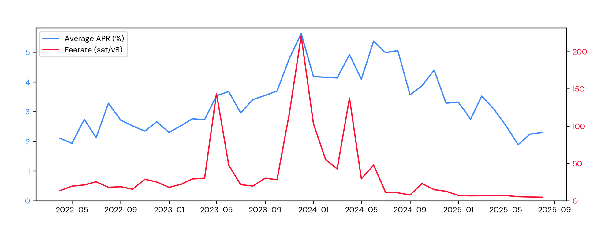
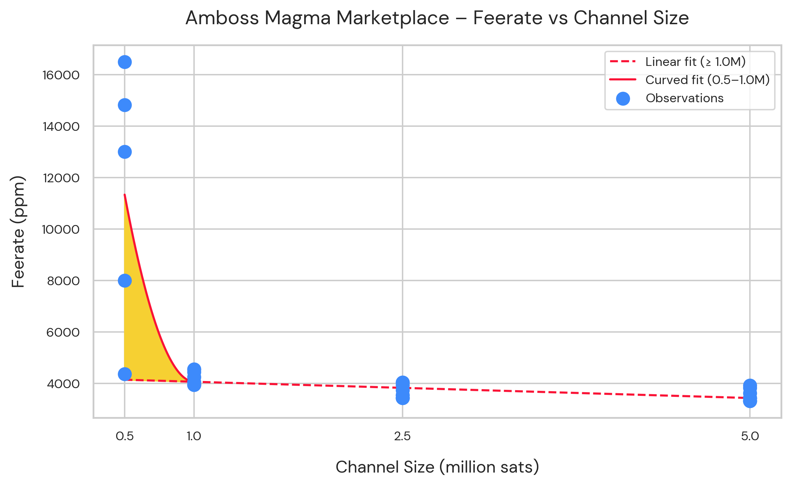

> *作者：Matthew Vuk*
> 
> *来源：<https://blog.second.tech/diving-deeper-into-lightning-liquidity-amboss-magma-2/>*

随着我们开发 Ark 协议越加深入，我们越来越认识到流动性成本（liquidity costs）的重要性。我们此前关于[比特币被动收益产品](https://blog.second.tech/survey-of-bitcoin-yield/)的研究表明，闪电网络上的流动性租赁（liquidity leasing）在保证自主保管的被动收益产品中，提供了最有吸引力的收益率，一般来说是年化收益率 1 ~ 4%（以比特币计，同时，保持你对资金的控制）。

为了辨析 Ark 协议的手续费结构，我们希望进一步深入比特币流动性定价的机制。因为 Ark 必须部署自己的比特币储备来支持（用户的）闪电支付、刷新和离场，对流动性颠覆的真实成本的理解会直接影响我们想要在哪些方面向用户收费。

“ Amboss Magma ” 就是一个显然适合的观察环境：它是闪电网络流动性的最成熟、流动性最大的市场。它处理了所有完成的公开比特币流动性租赁订单的一大部分。关于锁定流动性来协助支付的机会成本和风险溢价，用户支付的费率也许是我们能够得到的最好的代表数据。

## 什么是 “ Amboss Magma ”？

“ Amboss Magma ” 运营着一个点对点的市场，闪电网络用户可以在其中买卖通道流动性。需要入账流动性（收款额度）来接收闪电支付的节点可以从流动性供应者处购买，而流动性供应者凭借在通道中临时锁定比特币就可以获得被动收益。

理解这个市场的几个关键术语：

- **PPM（parts per million）**：手续费率，以 “聪” 为单位，因此 10000 PPM 就等价于 1% 。因为 100 百万聪就等于 1 BTC ，这个指标能够准确地给小额支付定价。你可以把它理解成一种百分比，只是它更小！
- **通道容量**：一条闪电通道中的总价值，以聪计量。
- **APR（年化百分比收益率）**：从租赁条款中计算出来的、将时间维度换算成年的收益率；因为绝大部分租约都不是恰好 365 天，而比较短，所以需要推算出来。
- **LINER**：Amboss 的基准收益率跟踪系统，会监控收益曲线的变化。

## 我们的分析

我们直接使用 Amboss Magma 的 API（应用程序接口）建立了我们的数据库，既使用了未成交订单的实时列表，又使用了已成交订单的历史数据。为了保证这个数据反映出了真实的市场活动，我们移除了高费率的异常值。这就排除了两类数据点：

1. 年化百分比收益率超过 20% 的已成交订单，这种情形本身很烧焦，也不能代表常见的用途；以及
2. 出借方要求不切实际高 APR 、但从未完全成交过的未成交订单

剩下的数据揭示了为比特币流动性定价的多种有趣的模式：

### 规模是关键：通道手续费溢价

在租赁流动性时，也有规模经济（economies of scale）。小容量的通道展现出更高的 PPM 。

比如说，如果用 PPM 来衡量，那么开启一条 0.5 百万聪的通道，会比开启一条 1 百万聪的通道更贵，虽然总的先期投入费用（total up front cost）会更低。

下面这张图表展示了 2025 年 7 月 在 Amboss Magma 上列出的、用于出租的固定容量闪电通道（的 PPM ）。样本包含了 0.5、1.0、2.5 和 5.0 百万聪的通道。当时的比特币汇率是 12 万美元，一条 0.5 百万聪的通道对应于 600 美元，而 1.0 百万聪的通道对应于 1200 美元。

- 横轴为 “通道的容量”，纵轴为 “ PPM ”；蓝色的点为观测到的值，红色实线为拟合出来的曲线，红色虚线为拟合出来的直线 -

专门标出的黄色区域表明，更小的通道要求费率上有溢价。尤其是，低于 1.0 百万聪（1200 美元）的通道的价格是格外高的（相对于其容量而言）。相反，超过这个门槛值，PPM 与通道容量就表现出更加一致而且可预测的关系，更接近没有明显偏离的线性关系。

这可能是因为三个原因：

- **固定成本**：Amboss 会对每一个成交的订单收取固定的 500 PPM 手续费，对于小交易额的订单来说，这笔手续费所占的比重会相对更大。
- **建立通道的运营成本**：开启闪电通道需要支付让交易获得区块链确认的手续费，还要付出操作性的运营成本，不管通道的容量如何。
- **供给和需求**：小容量通道在测试闪电节点的新用户以及寻找便宜收款额度（以重新平衡流动性）的用户这里更加流行。高需求叠加低供给（节点运营者会偏爱开启大额通道，因为要支付的区块确认手续费是一样的），让卖方获得更多的议价能力。

总结一下，这些数据表明，更小规模的闪电通道有不成比例的溢价，这是因为结构性成本和市场机制。对于参与者来说，这意味着，最 “经济” 的入口并不一定是最便宜的通道规模，而是可以平衡经济性和预期用途的规模。超过 1.0 百万聪的门槛值，价格就正常化了，并且反映出了一种更加理性、线性的关系，表明一旦固定成本被吸收，规模经济就开始占据主导地位。

### 流动性供给：两个市场的故事

我们分析了 Amboss Magma 上的一组公开的流动性供给。它们代表着当前在市场上可以得到的实时订单，而不是已经成交的订单。

- 横轴为 “BTC 上限（供给规模上限）”，纵轴为 “ APR ”；蓝色的点位 APR 数据中值，红色虚线为长尾的 APR 中值（2.605%），蓝色实现为拟合出来的曲线 -

看起来出现的两个分割的市场：

- **高溢价的小额通道**：容量低于 1 BTC 的通道展现出更高的 APR ，常常超过 4% 。但是，这些更高的 ARP 并没有为攻击者实现更大的被动收益，因为客户支付的大部分都变成了在区块链内发布交易的矿工费。从结构上来说，闪电网络有许多小规模的参与者，所以需求集中在这个低于 10000 美元的范围内。高需求叠加低供给（绝大部分节点运营者偏爱开启大额通道，因为要支付的区块确认手续费是一样的），卖方就可以抬价。
- **高效的大额通道**：容量超出 1 BTC 的通道集群的 APR 在 2.6% 上下，反映了部署可持续流动性的成熟市场价格。这个细分市场表现出溢价递减的模式，其费率会稳定下来且趋向市场平均值。

所有未完成订单的 APR 中值与平均值保持一致，大约是 2.6% ，表明这是对闪电网络流动性的市场共识。Amboss 曾经报告历史回报率在 1 ~ 4% 之间，这个范围的中点（大约是 2.5% ）与我们对公开订单的分析也是一致的。虽然理论上用户最高可以赚取大约 4.24% 的收益率（通过在小额订单上出租流动性），但更稳定的长尾结果是在 2.5 ~2.6% 之间。

简而言之，溢价区间存在于小于 1 BTC 的通道中，它们的 APR 通常会超过 4% 。但超过这个门槛之后，流动性定价就会平坦下来，超过 1 BTC 的通道的供给者会收到大约 2.6% 的收益 —— 这个结果，既跟 Amboss 的报告一致，也跟我们对比特币被动收益市场的更广泛研究一致。

### 定价的网络效应

- 横轴为月份，纵轴为 “APR”；蓝色实线是平均 APR，行色实现是交易池的手续费率 -

区块确认手续费率与 Amboss APR 的关系，揭示了另一个重要的机制。当比特币网络的手续费飙升时，较小容量的通道的 APR 也上升得比大额通道更加剧烈。

这从经济学角度看是合理的：固定的区块确认手续费在总成本中的占比，在小额通道这里会比大额通道更大。所以，流动性供给者的潜在收益率并没有上升 —— 改变的仅仅是购买者的成本负担，也就是支付了更高的交易费用。

## 对比替代选择

为了验证 Amboss 在主流的流动性市场中的位置，我们查验了 “ Core Lightning ” 客户端的 “ liquidity ads ” 特性。乍看起来，其经济性颇为诱人 —— 理论上最高年化收益率可达 40% 。但在实际上，就完全不是那回事了。

Liquidity ads 通常提供为期 4 天的租赁，每份租约的收益率是 0.44% 作用。然而，市场极度不活跃，充其量只能实现零星的成交。这些广告出来的费率只表明供给者的愿望，而不是实际成交的交易，这让实际实现的回报非常不确定。

这种对比表明，Amboss Magma 确实是最可靠的市场数据来源 —— 因为它是大量流动性交易真正发生的地方。

## 这对于 Ark 协议来说意味着什么

Amboss Magma 正在成为闪电网络流动性租赁的基准。这个市场在迅速成长为一个稳定、高效而且透明的机制，为锁定的比特币定价。

我们的研究表明了两个关键机制：

1. **规模经济**：规模超过 1200 美元（1.0 百万聪，按 12 万美元的价格计算）的通道，可预测的收益率会收敛于 2.6% 。
2. **更小规模的通道表现出持续的低效率**：在这个细分市场内，买家惯常面临着不成比例的高溢价、为流动性支付更高的 PPM 。解决这种不平衡是一个关键的机会：让用户可以保持较小面额的自主保管，而不会被超量的手续费结构惩罚。

对于 Ark 来说，这些观察也是根本性的。这一研究为我们定义 Ark 的手续费结构提供了关键的背景。理解手续费部署的真实成本，可以帮助我们确保 Ark 提供了有竞争力的费率，同时为一种比特币支付技术保证了可持续的经济激励。

最重要的是，这些数据验证了，闪电网络持续在为支持市场的用户产生足够的吸引力 —— 它在一系列的市场条件和支付规模下，产生了有竞争力的回报率。所以，比特币支付的效用是真实的，这对 Ark 来说也是好消息！

（完）