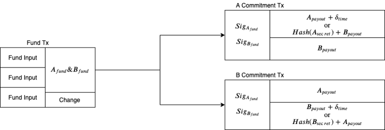
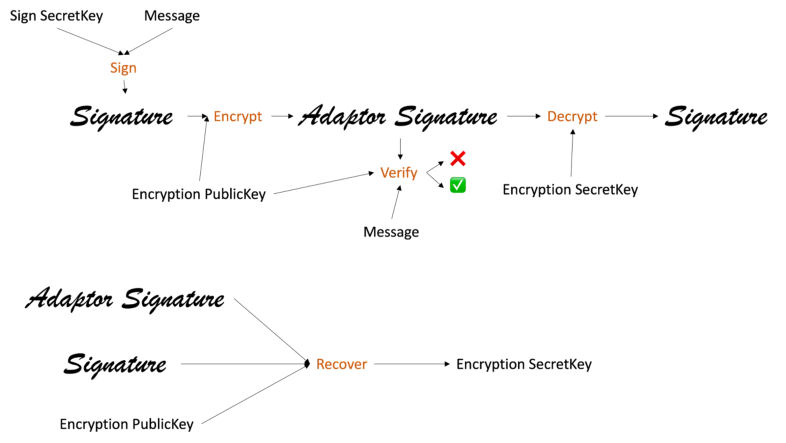
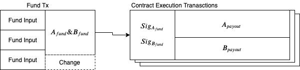
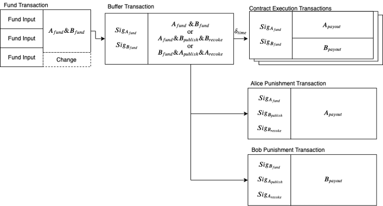
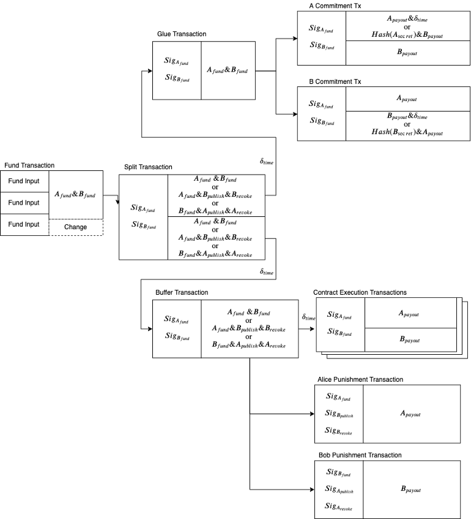

> *作者：Thibaut Le Guilly*
> 
> *来源：<https://medium.com/crypto-garage/dlc-on-lightning-cb5d191f6e64>*

## 摘要

我们已经在主网上开启和关闭了第一条嵌入了一个谨慎日志 合约（DLC）的闪电通道。

我们 Crypto Garage 一直在开发可以在闪电通道中工作的 DLC，而我们最终也到达了一个重要的里程碑：我们成功开启了一条闪电通道并在其中建立了一个 DLC，最终关闭了整个通道。在本文中，我会解释闪电通道与 DLC 建立和关闭的技术细节。

## 什么是闪电通道中的 DLC（以及什么不是）

出于本文的目的，我们所谓的 “在闪电通道中开启 DLC”，意思是两个节点**直接**建立一条通道，并在通道内使用（部分）资金建立一个 DLC。这个 DLC 可以关闭（让通道回归常规的闪电通道），也可以更新，而且通道也可以在非合作情境下关闭（我们也正是这么做的，这样会让闪电通道和 DLC 合约的交易结构完完整整在链上展示出来）。

我们要强调的是，当前无法做到通过闪电网络来 *路由 DLC*（即无法跟没有直接通道的节点开设 DLC）。这份[邮件组帖子](https://mailmanlists.org/pipermail/dlc-dev/2021-November/000091.html)提供了更多信息。

## 预备知识

为了热身以及让这篇文章自足，我们将历数在闪电通道中建立 DLC 所需的各种元素：[闪电通道](https://docs.google.com/document/d/1SndejwtOQC93BieINox2Gg5HtnUgFcLTVQODL8MP5Z4/edit#heading=h.jbsgei7du8a5)、[适配器签名](https://docs.google.com/document/d/1SndejwtOQC93BieINox2Gg5HtnUgFcLTVQODL8MP5Z4/edit#heading=h.cb0xldu0vqab)、[DLC](https://docs.google.com/document/d/1SndejwtOQC93BieINox2Gg5HtnUgFcLTVQODL8MP5Z4/edit#heading=h.it41s33fig1)  和 [DLC 通道](https://docs.google.com/document/d/1SndejwtOQC93BieINox2Gg5HtnUgFcLTVQODL8MP5Z4/edit#heading=h.niw3p88jfsaz)。

### 闪电通道

如果对常规闪电通道的交易结构没有起码的理解，就很难理解如何在一条闪电通道中建立 DLC，所以我们快速回顾一下闪电通道的原理（若要获得更深入的理解，请看 [Bitcoin Magazine 的系列文章](https://bitcoinmagazine.com/technical/understanding-the-lightning-network-part-building-a-bidirectional-payment-channel-1464710791)）。我们仅仅关注跟我们的需求相关的部分，所以跟路由相关的部分我们全部跳过。

当两个闪电网络节点要开设一条通道时，他们会合作构造和签名两种类型的交易，“*注资交易*” 和 “*承诺交易*”。

注资交易以其中一方的几个 UTXO 作为输入（如果支持[双向注资](https://bitcoinops.org/en/topics/dual-funding/)技术，也可以双方都提供 UTXO），然后将资金锁入一个 2-of-2 的多签名输出中，为通道所用；这样的输出需要双方同时提供签名才能花费。

承诺交易则以注资交易的输出为输入，产生两个输出，这两个输出的面额对应双方的余额。注意，这些余额会在通道的生命周期中不断改变，所以，承诺交易需要不断更新以反映这些变化。这是通过让承诺交易变得 *可以撤销（revocable）* 来实现的。在实践中，这意味着每一方都保存着每一笔承诺的不同版本；在他们保管的承诺交易中，一个支付给他们自己的输出被锁定在这样一个脚本中：这个脚本即可以在一段事件后由他们自己解锁，也可以被掌握了某个秘密值的对手直接解锁。当双方都同意更新通道余额时（例如，一方希望给另一方支付一些钱），他们就构造并交换新的承诺交易和签名，并向对方揭晓在上一笔承诺交易中使用的秘密值，从而撤销掉上一笔交易。如果一方想要欺诈对手 —— 广播比较旧的承诺交易，对方有时间可以反击 —— 使用本地保存的秘密值，拿走通道中所有的资金。

整个交易结构如下图所示：

- 闪电通道的交易结构 -

### 适配器签名

适配器签名是一种加密过的签名（使用了某一个公钥），而且我们可以证明，在（使用对应的私钥）解密之后，可以得到对某条消息的有效签名。它还有一种属性：知晓了适配器签名、加密公钥和解密后的签名，就可以恢复出用来加密的秘密值。[这里](https://medium.com/crypto-garage/optimizing-numeric-outcome-dlc-creation-6d6091ac0e47#96e9)对所涉及的模块作了概要的介绍。

下图展示了加密、验证和解密适配器签名的不同操作，以及恢复秘密值的过程。

### 谨慎日志合约

DLC 让两方可以建立一个依赖于某些事件（体育比赛、资产价格 ……）的合约，并且直接在比特币区块链上结算。参与的双方需要提前选择一个播报事件的实体（“断言机”），这个实体会通过放出对结果的签名来见证事件的结果。

DLC 乍看起来可能跟闪电通道很像，但是它并不使用从注资交易中花费的承诺交易，而是 “合约执行交易（CET）”，每一笔 CET 都对应着事件的一种可能结果（以及支付数量）。双方都使用断言机会为不同事件结果创建的签名作为原像，加密自己的签名（从而产生适配器签名）（更多细节可见[此处](https://medium.com/crypto-garage/optimizing-numeric-outcome-dlc-creation-6d6091ac0e47#96e9)），然后交换并验证它们。一旦断言机见证了某个结果，DLC 的任意一方都可以解密对方的某一个签名，然后广播对应的 CET、结算合约。注意，因为使用了适配器签名，双方手中的 CET 是一样的。一个 DLC 的交易结构如下图所示。

- 链上 DLC 的交易结构 -

### DLC 通道

那么，如果双方希望在上一个 DLC 到期后新建一个合约呢？当然，他们可以先关闭一个，再新建另一个。但是每一笔上链的交易都需要支付手续费。相对的，他们可以使用 DLC 通道（ItchySats 已经撰写了一份很棒的[详细介绍](https://comit.network/blog/2022/01/11/cfd-protocol-explained/)）。DCL 通道允许双方新建合约、在到期之前提前结算合约，当然，也可以在他们希望回收资金的时候在链上关闭合约。一种简单的实现办法是让 CET 变成可以撤销的。但是，那会导致新建合约的时候出现问题。即使某一方撤销掉了以前的 CET，也无法防止对手使用它们。这就意味着，对手方总是可以选择使用旧的 CET 或新的 CET 来关闭通道，而先撤销自己的 CET 的一方则没有选择，只有等待新的合约到期（因为他们需要等待断言机放出签名，这样才能广播 CET）。这给了其中一方不公平的优势。为了解决这个问题，我们引入了一种 “*缓冲交易*”，它将花费注资交易的输出，并产生相同价值（减去手续费）的输出；缓冲交易的输出再作为 CET 的输入。这样，当我们需要新建合约时，如果某一方不及时撤销前一个合约，另一方可以直接广播新合约的缓冲交易、防止恶意（或误操作的）对手方使用旧合约的 CET 关闭通道。

那我们要如何撤销旧的缓冲交易呢？一种办法是借鉴闪电网络，让双方都保存缓冲交易的不同版本。幸运的是，还有另一种更好的解决方案（最早是由[这篇论文](https://eprint.iacr.org/2020/476.pdf)提出的）。它也依赖于适配器签名，只不过跟常规的 DLC 利用它的方式不同。每一方都使用三组密钥。第一组是注资密钥，用在注资交易输出的 2-of-2 输出中。第二组是撤销密钥，每当一个合约被撤销时就公开。最后一组是公示密钥。这三个密钥都用在缓冲交易的输出脚本中，让这个输出有三种不同的花费方式（我们使用 “Alice” 和 “Bob” 作为两方的代称）：

1. 使用 Alice 和 Bob 双方的注资密钥的签名（用在 CET 交易中，就像链上 DLC 一样，必须知道断言机对事件结果的见证才能使用）
2. 一个来自 Alice 注资密钥的签名，以及来自 Bob 的公示密钥和撤销密钥的签名
3. 一个来自 Bob 注资密钥的签名，以及来自 Alice 的公示密钥和撤销密钥的签名

当一个合约在通道中建立的时候，Alice 和 Bob 各给对方一个用于缓冲交易输入的适配器签名，是用对手的公示公钥加密过的。要是其中一人希望广播缓冲交易，TA 就要使用自己的公示私钥解密从对方处获得的适配器签名。但是，广播了缓冲交易（其中包含了解密后的签名），TA 就向对方揭开了自己的公示私钥（对方已经知道了适配器签名和加密密钥）。如果缓冲交易还未被撤销，那就没有什么问题，他们可以使用某一条 CET 正当地花费缓冲交易的输出。但如果缓冲交易已经被撤销了，对手方必然就知晓了撤销私钥，因此可以拿走全部的资金。最后，CET 带有一个相对时间锁，让被欺诈的一方可以花费已作废的缓冲交易输出。

下图演示了这种交易的结构及其花费条件。

- DLC通道的花费条件 -

## 闪电通道中的 DLC

我们已经解释完了所有的基本模块，现在我们来看看如何在闪电通道中嵌入一个 DLC 通道。

第一种明显的思路是在闪电通道的承诺交易中增加一个输出，以形成一个 DLC 通道。然而，这就意味着，每一次我们更新承诺交易的时候，DLC 的所有适配器签名都要重新计算（以及重新验证），这对于拥有大量可能结果的合约来说是非常昂贵的（这个问题可以靠 SIGHASH_NOINPUT 以及类型的升级修复）。为避免这一点，我们引入了一种 “*分割交易*”。它会花费注资交易的输出并形成两个输出：一个用于闪电通道，一个用于 DLC（可以通过增加输入来同时开启多个 DLC 通道、同时执行多个合约）。为了能够将通道恢复成 “标准” 的闪电通道，我们使用[跟 DLC 通道同样的、基于适配器签名的机制](https://docs.google.com/document/d/1SndejwtOQC93BieINox2Gg5HtnUgFcLTVQODL8MP5Z4/edit#heading=h.niw3p88jfsaz)，让分割交易变成可撤销的。

不过，这样一来闪电通道又会出问题。为了让一方能够到欺诈的另一方（广播已被撤销的分割交易）作出反应，分割交易需要带有时间锁以阻止立即花费。但是，[闪电网络的规范已经用到了承诺交易的 nLockTime 和 nSequence 字段](https://github.com/lightning/bolts/blob/master/03-transactions.md#commitment-transaction)，以指定承诺号。为了解决这个问题，我们在分割交易与闪电通道承诺交易之间插入了一个 *粘合交易*，以实施一个相对时间锁（感谢 Matt Corallo 提出了这个简单的解决方案）。注意，这实际上是一个工程问题，可以通过为承诺交易使用不同的规范来解决（但这将需要闪电网络实现加入更多变更以支持它）。

总结一下，如果双方有一个直接的闪电网络通道，并希望在其中建立一个 DLC，他们可以合作创建并签名分割交易、粘合交易以及更新后的承诺交易（反映双方保留在闪电通道中的资金）、缓冲交易以及 DLC 的 CET。然后，他们就可以在闪电通道中路由支付、在 DLC 通道中更新和结算 DLC 合约。如果他们想要关闭 DLC 通道，他们可以作废分割交易，并合作创建和签名更新后的承诺交易。

下图演示了这个交易结构。注意，分割交易和缓冲交易用到了不同的公示和撤销密钥。

- 在闪电通道中嵌入 DLC 通道的交易结构 -

## 实现

上述构造已经在我们的 [rust-dlc 库](https://github.com/p2pderivatives/rust-dlc/tree/feature/split-tx-manager-2)中实现了，这个库使用了 [Lightning Development Kit（LDK）](https://github.com/p2pderivatives/rust-lightning/tree/split-tx-experiment)的一个分叉，加入了对分割闪电通道的特性的支持。我们也实现了一个基于 LDK 样本的[小型命令行工具](https://github.com/p2pderivatives/ldk-sample/tree/ln-dlc-test)，除了常规的闪电通道功能，还启用了开启和管理 DLC 通道的功能。注意，代码还非常不稳定，而且我们要强调，**在主网上使用非常有可能导致资金丢失**。

## 主网执行

我们于 11 月 21 日在我们的两个启用了闪电网络的节点中开启了一条通道，[注资交易是这一笔](https://blockstream.info/tx/f307a6330c25ff4a43290803b088754b03ffd9c90c556aebca9a89d0b0ff9988)。然后，我们从开启通道的节点给另一个节点发送了一笔 keysend 支付（等到 LDK 实现了双向注资的时候，就不必执行这一步了）。我们定义了一个基于比特币在 11 月 21 日下午 4 点（JST）的价格的 DLC，并在闪电通道中开启了一条 DLC 通道。在这个合约到期时，我们让其中一个节点强制关闭通道。这个节点先是广播了分割交易（见[此处](https://blockstream.info/tx/a110bc985c6b02e5d4a80a6eca4a4561462975dbe65a70a9dd2fb9af47330326)）。分割交易得到确认的 288 个区块（缓冲交易和粘合交易的 nSequense 数值）之后，我们让这个节点广播缓冲交易和粘合交易（见[此处](https://blockstream.info/tx/2084f0fab71ceb05a83cc8c1c7430e9aa101cba23d886fa75ccfc46616659af2)和[此处](https://blockstream.info/tx/5db5f26943af8f8b2e1be37b612d0d6f768c1117d7e6e63d08ee93cede6c63c1)），以及本地的承诺交易（见[此处](https://blockstream.info/tx/bfde28fba3b4873e87f2044e861dc117f321091dc635dafa1ffa2df46c723591)）。缓冲交易得到确认的 288 个区块之后，节点获得了断言机对结果的签名，从而解密了另一方对相应结果的适配器签名，然后广播一笔 CET，结束了这个 DLC（见[此处](https://blockstream.info/tx/c0819ea9d8fe73ce3ad79e7aedbcbe8931258e4961b456317a64420ae402aa7e)）。

## 结论

可以在闪电通道中开启 DLC 的能力，开启了一些很棒的应用，例如将部分通道的价值与其它货币挂钩、使用通道中的资金交易一些衍生品合约（同时无需放弃资产托管），甚至可以直接跟朋友打赌球赛的胜负。在 rust-dlc 库中实现功能支持，并通过在闪电通道中执行和关闭 DLC 演示了器用途，我们已经证明了我们提出的方法的可行性。要分析和优化这个提议并强化这个实现，还有非常多工作要做。所以，如果你有兴趣贡献一份力量或使用这种技术，甚至仅仅是想了解更多，都欢迎联系我们！

## 致谢

感谢 LDK 团队审核以及接受让实现本文所述的技术成为可能的多项 PR，以及解答我们对 LDK、闪电网络和 Rust 的许多问题！

（完）

