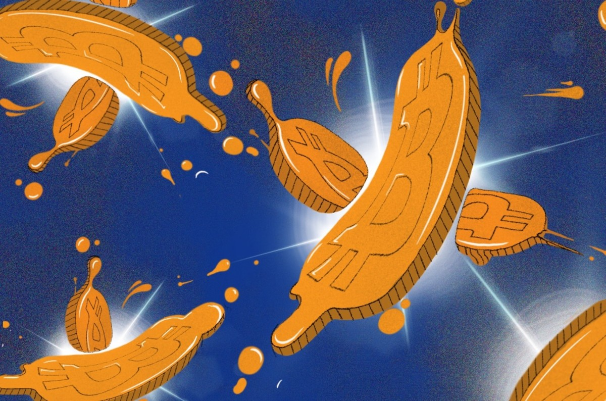

> *作者：Aaron van Wirdum*
> 
> *来源：<https://bitcoinmagazine.com/culture/do-coinjoins-really-require-equal-transaction-amounts-for-privacy-part-one-cashfusion>*

虽然中本聪在[白皮书](https://bitcoin.org/bitcoin.pdf)中指出隐私性是比特币协议的设计目标，但是区块链分析[通常会破坏用户的隐私性](https://bitcoinmagazine.com/guides/bitcoin-anonymous)。这着实是个问题。举几个例子，比特币用户不一定会想让全世界都知道他们在哪儿花的钱、赚得了什么、拥有多少币，企业也不想将交易的详细信息泄露给竞争对手。

但是，有一些解决方案可以将隐私性还给用户，例如 CoinJoin。目前，最热门的一些混币方案就用到了 CoinJoin 技术，包括 Wasabi Wallet（利用了 ZeroLink）和 Samourai Wallet（利用了 Whirlpool）。在这两个方案中，用户都将自己的比特币切分成等额大小，使之与彼此的资金相互混淆。等额切分被认为是让混币方案发挥作用的关键一环。

但是，正在为 Bitcoin Cash 网络开发的混币协议 [CashFusion](https://github.com/cashshuffle/spec/blob/master/CASHFUSION.md) 对这一假设提出了挑战。背后的开发者声称 CashFusion 可以通过 CoinJoin 为用户提供隐私性，但是无需进行等额切分。如果属实，这可能会极大改变我们对比特币隐私性的认知。

前提是必须属实……

## CoinJoin

让我们从头开始讲起。（如果你已经了解了 CoinJoin，可以略过这一节。）

一个典型的比特币交易有一个或多个输入（即，比特币来自哪些地址）和一个或多个输出（即，比特币被发送至哪些地址）。如果一个交易有多个输入，这通常是因为付款方为了凑足交易金额而使用了多个 UTXO。如果一个交易有多个输出，这通常是因为要一次向多人付款（批量交易），并且/或者 付款方将多余的比特币作为找零发送给自己持有的某个地址（这是因为在通常情况下，这些 UTXO 的面额加起来不会刚好等于交易金额）。

问题在于，上文所述的典型交易泄露了太多信息。例如，这样很容易会被推断出所有输入地址都属于同一个人，让地址聚类成为可能。该交易还反映了比特币在地址间的流动情况，从而泄露比特币在区块链上的轨迹。此外还有可能泄露更多（微妙的）迹象，这些都不利于隐私保护。

Bitcoin Core 的贡献者 Gregory Maxwell 在 2013 年首次针对这一问题[提出了](https://bitcointalk.org/index.php?topic=279249.0)名为 CoinJoin 的解决方案。CoinJoin 背后的构想很简单：将几个独立的交易合并成一个大的交易。因此，如果两个交易各自有两个输入和输出，则将其合并成一个拥有 4 个输入和 4 个输出的交易。这至少会打破所有输入地址都属于同一个人的假设，同时有助于掩盖比特币的链上轨迹。

## 为何要等额切分

然而，人们通常认为上述 CoinJoin 带来的隐私增益是有限的。在很多情况下，输入中发送的 UTXO 和输出中收到的 UTXO 可以拼凑起来，从而暴露一个合并 CoinJoin 交易中包含了哪些独立交易。

以两个交易为例：一个是 Alice 发送给 Carol 的交易，另一个是 Bob 发送给 Dave 的交易。Alice 拥有两个分别价值 2.3 BTC 和 1.4 BTC 的 UTXO，想要支付 3.2 BTC 给 Carol。Bob 拥有两个分别价值 3 BTC 和 2 BTC 的 UTXO，想要支付 4 BTC 给 Dave。

简化后的交易如下所示：

2.3 + 1.4 = 3.2 + 0.5

和

3 + 2 = 4 + 1

（其中，0.5 BTC 和 1 BTC 这两个输出都是找零。）

合并后的 CoinJoin 交易如下所示：

3 + 2.3 + 2 + 1.4 = 4 + 3.2 + 1 + 0.5

尽管交易被合并了，但是想要重新找出输入和输出的对应关系以及哪些输入属于同一个付款方并非难事。假设你已经知道有两个付款方，只有一种情况下，输入和输出的余额才能匹配的上：就是我们上面剧场的独立交易情形。

因此，ZeroLink 和 Whirlpool 等热门混币方案只能混合等额 UTXO。无论有多少 UTXO 作为输入合并到单个交易内，被混合的输出彼此之间无法区分，这意味着任何参与者都有可能收到任意固定大小的 UTXO。

如果将 UTXO 的固定大小设为 1 BTC，Alice、Bob、Carol 和 Dave 共同参与的 CoinJoin 交易如下所示：

3 + 2.3 + 2 + 1.4 = 1 + 1 + 1 + 1 +1 + 1 + 1 + 1 + 0.5 + 0.2

这是一个很大的改进，因为任何大小为 1 BTC 的 UTXO 都可以重新拼凑回两个原始交易之一。目前尚不清楚哪个 1 BTC 属于 Alice、Bob、Carol 或 Dave，甚至不知道哪个 1 BTC 属于哪个交易对。

但是，这类方案还不够完美，因为有大小不等的输出被剩下。恰恰因为大小不等，这些输出依然能够与特定输入（即，来自 Alice 的输入）关联起来。这也意味着 Alice 的其它输入也能关联起来。如果经过几次混币后，有人在下一个交易中将大小不等的输出组合起来，这同样会破坏隐私性：不同的 UTXO 可以被关联至同一个人。此外，如果大小不等的输出和固定大小的输出将来一同被花费，这些信息泄露有可能会破坏一开始的混币新工厂。

## CASHFUSION

BCH 开发者 Mark Lundeberg 和 Jonald Fyookball 开发了一个名为 CashFusion 的项目，着手解决“遗留的”输出问题。该项目的创建宗旨是作为对 [CashShuffle](https://cashshuffle.com/) 的补充。CashShuffle 是针对 Bitcoin Cash 创建的 [CoinShuffle](https://bitcoinmagazine.com/articles/shuffling-coins-to-protect-privacy-and-fungibility-a-new-take-on-traditional-mixing-1465934826) 实现，采用的是等额混币。然而，CashFusion 具备的非凡潜力意味着该项目有望成为独立的混币协议。 

为了解 CashFusion 的潜力，我们来看另一组交易。假设 Alice 想要向 Carol 支付 4 BTC，并持有两个分别价值 2 BTC 和 3 BTC 的 UTXO。与此同时，Bob 想要向 Dave 支付 9 BTC，并持有两个分别价值 7 BTC 和 8 BTC 的 UTXO。

简化后的交易如下所示：

3 + 2 = 4 + 1

和

8 + 7 = 9 + 6

合并后，CoinJoin 交易如下所示：

8 + 7 + 3 + 2 = 9 + 6 + 4 + 1

现在，根据这个 CoinJoin 交易，我们当然有可能拼凑出两个原始交易。但是，即使你知道有两个付款方，也还是有其它几种组合。

例如，

8 + 2 = 9 + 1

和

7 + 3 = 6 + 4

或：

8 + 2 = 6 + 4

和

7 + 3 = 9 + 1

或：

7 + 2 = 9

和

8 + 3 = 6 + 4 + 1

或：

7 = 6 + 1

和

8 + 3 + 2 = 9 + 4

为了简单起见，这个例子只取整数。只用整数会产生更多的配对可能，但只有整数在现实中是很少见的。另一方面，这个简化的例子只使用了两个原始交易。实际上，一个 CoinJoin 交易可能包含数十乃至数百个原始交易。因此，虽然这个例子经过了简化，但是这种简化对于配对的可能性有增有减。

CashFusion 背后的理论衍生自[组合学](https://en.wikipedia.org/wiki/Combinatorics)领域，即，哪怕在日常的、不是整存整取的交易中，一个足够大的 CoinJoin 交易通常会提供多个不同的解（即便不尽然）。越多输入和输出被包含在内，就有越多匹配可能。（如果使用的都是等额 UTXO，例如 1 BTC，事实更是如此。因此，CashFusion 用户最好使用等额 UTXO，以便保护自己的隐私。）

潜在的解越多，区块链分析师就越难弄清楚哪个解是原始配对。这应该会破坏比特币的轨迹，增加关联输入的难度。因此，CashFusion 应该能够提供隐私保护。

为了提高分辨出原始配对的难度，CashFusion 还采用了一个额外的措施来增加拼凑回原始配置的难度：该项目可以让用户通过半随机方式将输出切分成几个较小输出。换言之，Alice 不会向 Carol 支付 1 个价值 4 BTC 的输出，而是向 Carol 发送 2 个分别价值 3 BTC 和 1 BTC 的输出；Bob 不会向 Dave 支付 1 个价值 9 BTC 的输出，而是向 Dave 发送 3 个分别价值 5 BTC、3 BTC 和 1 BTC 的输出。

与此同时，CashFusion 也鼓励用户提供多个输入（这些输入有可能来自之前的混币）。这样一来，用户能够将多个较小的输入合并为一个较大的输出，使之在链上不那么明显。（例如，Alice 提供 2 BTC + 2 BTC + 1 BTC 这 3 个输入；Bob 提供 6 BTC + 5 BTC + 4 BTC 这 3 个输入。）实际上，将多个非等额的剩余输入合并成一个较大输出是 CashFusion 的最初设想和命名来源。

## CashFusion 的设想是否成立？

如果你读到这里是想要获得一个最终定论，恐怕要让你失望了：关于 CashFusion 的设想是否成立或在多大程度上成立的问题，本文不会提供一个确切的答案。目前似乎还没人能给出确切答案。迄今为止，该提案经过了相对较少的同行评议。虽然 CashFusion 背后的开发者相信其解决方案能提供足够高的隐私性，但是其他人似乎更持怀疑态度。

从表面上看，CashFusion 采用的方法似乎有问题，因为像 Blockchain 的 SharedCoin 之类的早期非等额混币机制在几年前就已被[攻破](https://www.coinjoinsudoku.com/)。但是，Lundeberg 和 Fyookball 认为，两种混币机制的主要区别在于 CashFusion 交易包含的输入和输出数量多于 SharedCoin 交易。

CashFusion 描述本身确实包含 Lundeberg 亲口承认的“纸巾数学（napkin math）”。Lundeberg 还在 Reddit 上[发布](https://old.reddit.com/r/btc/comments/cuo3hi/cash_fusion_mini_simulator/exzu9eh)了更高级的版本。这些估计表明，即使只有 10 名参与者，且每人提供 10 个输入合并成 1 个输出（共有 100 个输入和 10 个输出），可能的配置数量通常也高达 10^20。即使只是计算出所有这些可能性也需要花费大量时间，更别说准确拼凑出原始交易了。

撰写本文之际，还有更多研究正在进行。Fyookball 最近在[博客](https://read.cash/@jonald_fyookball/analyzing-the-combinatoric-math-in-cashfusion-29943fb7)上发表了自己的分析。目前，Lundeberg 和 Fyookball 等人至少足够相信 CashFusion 协议，想要部署它。CashFusion 软件的 alpha 客户端已经开放测试。完整版本预期将在几个月内上线。

然而，其他人没那么相信 CashFusion。一种对 CashFusion 的批评是，即使 10^20 是一个比较准确的估计值，也不意味着一个 CashFusion CoinJoin 交易的每个输出来自每个输入的可能性均相同。换言之，在同一个混币交易中，虽然一些参与者可能会获得较高的隐私保护，但是其他参与者获得的隐私保护要低得多。每个用户很难判断自己获得隐私保护是高是低。（若想详细了解这些批评，参见[最近的 bitcoin-dev 邮件串](https://www.mail-archive.com/bitcoin-dev@lists.linuxfoundation.org/msg08575.html)。）

相较之下，等额混币为所有参与者提供同等水平的隐私性，并实现最大数量的匹配可能。从某种程度上来说，等额混币能够形成“完美的”CashFusion CoinJoin 交易，因此比其它混币机制要好得多（前提是忽略非等额找零问题）。

当然，即使 CashFusion 永远无法完全代替等额混币，也有助于解决非等额找零问题，就像最初预期的那样……

*作者注：关于 CashFusion 提案还有更多内容，例如，CoinJoin 交易的构建方式。在隐私性方面还有一些更微妙的风险和权衡，例如，用户如何在混币前后处理他们的比特币。为满足简单易读的需求，本文只聚焦于 CashFusion 背后最核心最有趣的构想：非等额混币。*

感谢 Mark Lundeberg 提供的信息和反馈。

本文的 Part 2 将介绍另一种叫作[ Knapsack ](https://www.comsys.rwth-aachen.de/fileadmin/papers/2017/2017-maurer-trustcom-coinjoin.pdf)的非等额混币技术。

（完）