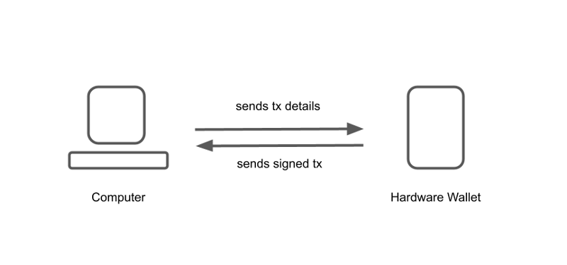
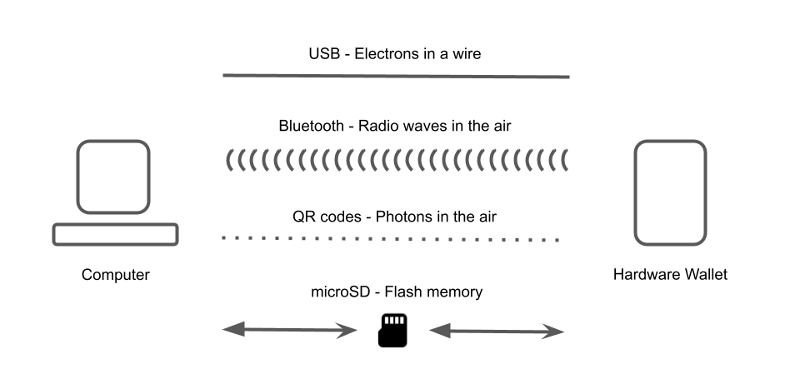
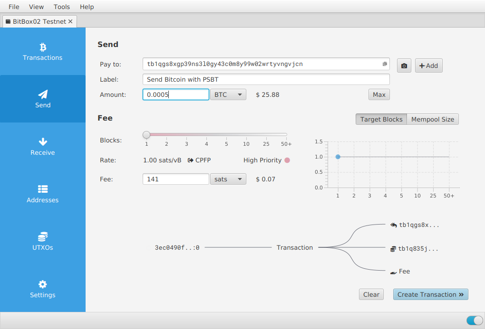
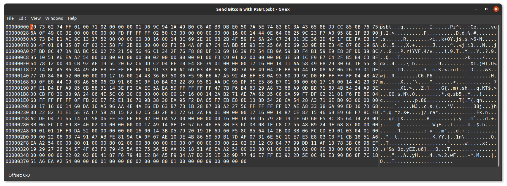
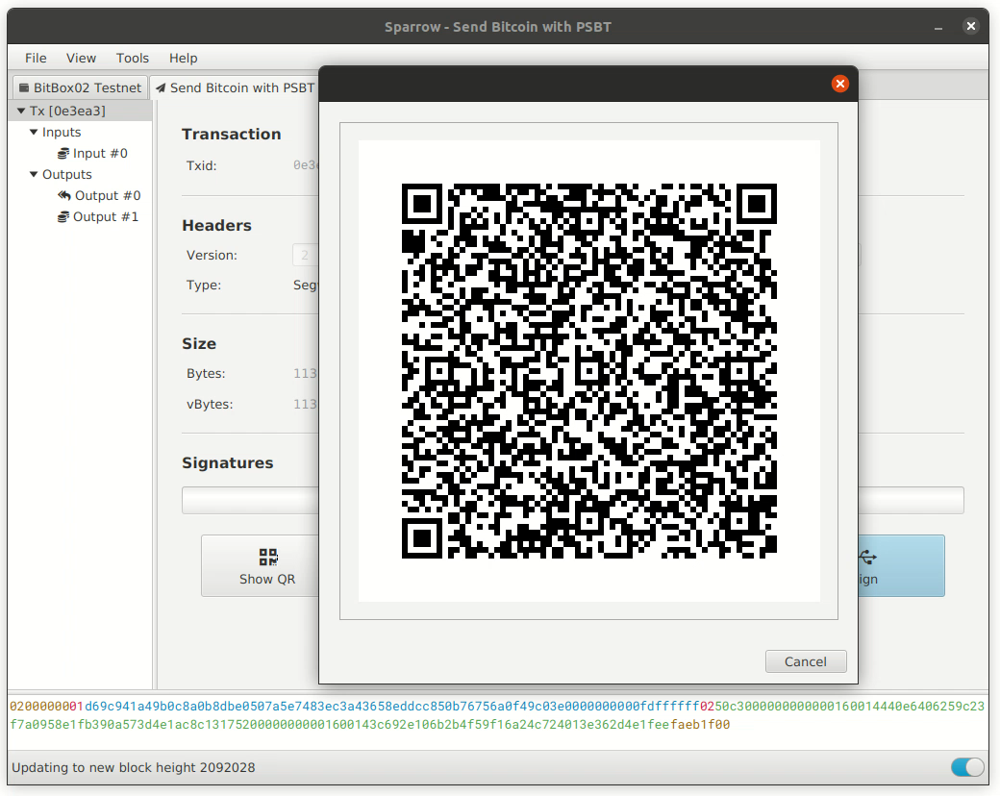
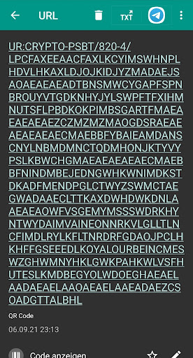

> *作者：Douglas Bakkum*
> 
> *来源：<https://blog.bitbox.swiss/en/does-airgap-make-bitcoin-hardware-wallets-more-secure/>*

自从 BitBox02 发布以来，我们收到了很多关于支持 airgap 操作的请求：即在不插入电脑或手机的情况下直接使用硬件签名器。虽然 airgap 设备近期备受关注，但我们希望深入了解其实际的安全优势，因此对这一主题进行了详细研究。我们的结论是：airgap 通信对硬件签名器的安全性提升微乎其微，甚至可能降低用户体验。我们使用已公开的漏洞来验证 airgap 的安全承诺是否属实。本文记录了我们的研究发现。
## 什么是 Airgap？

[Airgap](https://en.wikipedia.org/wiki/Air_gap_%28networking%29) 是一种安全措施，通过移除所有网络接口，将设备与不可信网络（如互联网）物理隔离。例如，airgap 计算机常用于安全关键的基础设施。这一原则本身非常强大，但在实际操作中，通常仍需与联网设备交换数据，这些跨越 “空气墙（airgap）” 的数据通常通过 U 盘传输。Airgap 系统的安全性完全依赖于被传输的数据本身并非恶意内容，也没有再传输过程中被篡改。正如著名的 “[Stuxnet 蠕虫破坏伊朗铀浓缩设施](https://en.wikipedia.org/wiki/Stuxnet)” 事件所示，如果不彻底检查要交换的数据，那么无论是对于核工厂还是密码学货币硬件签名器来说，airgap 所带来的安全优势都是空中楼阁。

就密码学货币钱包而言，“airgap” 这个词指的是：像硬件签名器这类签名设备（用于保护私钥），与可能不安全的联网电脑（用于创建待签名的交易并广播已签名的交易）之间，是物理隔离且没有直接连接的。两者之间的任何通信都需要跨越 “airgap”，通常是通过物理交换 SD 卡或扫描二维码来实现。至关重要的是，通信是无法避免的。这样的通信不仅包括上述的交易数据，还包括用于更新硬件签名器固件或钱包自身信息（如接收币的公钥，也就是地址）等较大体量的数据。

与将硬件签名器直接插入电脑不同，airgap 硬件签名器会配合电脑上安装的支持 PSBT（部分签名的比特币交易）的配套软件来使用。你可以在该应用中创建一笔未签名交易，然后将其编码为二维码供硬件签名器扫描，或将交易保存为文件，通过 microSD 卡让硬件签名器读取。

当硬件签名器用私钥签名交易后，会通过在屏幕上显示二维码或将签名后的交易写入 microSD 卡的方式，将已签名交易返回给电脑。电脑上的配套应用导入签名交易，然后将其广播到网络。

补充说明：虽然本文聚焦于硬件签名器的安全风险和漏洞，但需要强调的是，硬件签名器仍被普遍认为是进行密码学货币交易最安全的方式。这是因为能访问和解锁货币的私钥始终被安全地保存在硬件内部，无需离开硬件签名器。相比之下，软件钱包更容易受到恶意软件的攻击而导致盗窃，而[将币存放在交易所也有其自身的一系列风险](https://blog.bitbox.swiss/en/bitcoin-on-exchanges-convenient-but-not-a-great-idea/)。此外，有时也有人建议将旧台式机改造成专用的 airgap 设备，但其安全性难以保证，[且容易受到多种攻击](https://twitter.com/fluffypony/status/1339245458934345730)。
##  Airgap 无懈可击的安全神话

两台设备之间没有物理连接，会更容易让人觉得这种连接 “安全”。同时，像插 U 盘一样把硬件签名器插进电脑，可能又会让人 “感觉” 没那么安全。

然而，我们得出的结论是，这种感知到的安全收益，以及它被宣传为 “银弹” 的方式，远远超出了其实际情况，这可能导致一种虚假的安全感。

以下是 airgap 在实践中对安全性提升不大的三个主要原因：
### 1. 通信依然在进行
尽管没有 USB 数据线这种物理连接，硬件签名器和主机电脑之间仍然要交换信息。有线连接和 airgap 连接之间的主要区别在于带宽。二维码传输的数据量远少于 USB 连接。然而，我们发现带宽影响的是用户体验，而非安全性。

由于比特币交易本身的数据量很小，任何通信通道都足以传输它们。正如前文 Stuxnet 的案例所示，没有任何通信通道本身能阻止发送和接收预期数据（在这里是比特币交易）之外的数据。这些数据依然可能带有恶意。因此，硬件签名器仍然有责任彻底检查并消毒所有接收到的数据。

如果硬件签名器收到了被篡改的数据，而没有正确验证，那么它是否 airgap 根本无关紧要。一旦攻击者找到一个可被利用的漏洞，无论是通过恶意的二维码、交易文件、还是通过 USB 连接或蓝牙传输的数据，都可能被用来加载攻击。

Airgap 传输本质上不过是另一种通信通道，只不过需要用户更多的手动参与。每种通道都有其自身的攻击向量，只要存在信息交换，硬件签名器就始终需要尽职尽责地对数据进行消毒。具体来说，[硬件签名器的威胁模型](https://bitbox.swiss/bitbox02/threat-model/)必须假定与其通信的电脑或手机是已被入侵的。因此，除了硬件签名器本身显示的内容外，任何其它信息都不值得信任。
### 2. 通信依然可能被篡改
一个重要的攻击向量是恶意软件，它可以篡改通信内容而不被察觉。例如，它可以更改接收地址或找零地址，或者替换掉多签设置中的联合签名方。同样，硬件签名器的固件应该有能力捕获此类行为，但 airgap 本身对此毫无帮助：

- 二维码可以在多个层面上被恶意篡改，包括通过控制摄像头图像或二维码渲染的上游库、摄像头固件中植入的后门，或者通过运行在主机上的恶意软件。
- 通过 microSD 卡，其它程序可以暗中监视其内容，修改 PSBT 文件，或在用户不知情的情况下向卡中写入额外数据。具体的访问权限取决于所使用的操作系统。
- USB 通信本身同样无法缓解这一攻击向量。

一种常见的检测和避免数据被篡改的方法是加密电脑上运行的配套应用与固件之间的所有通信（BitBox02 使用 [Noise Protocol Framework](http://noiseprotocol.org/) 实现了这一点）。即便如此，如果运行应用的电脑被攻破，通信通道依然无法做到完全安全（这就是为什么你应该始终在硬件签名器的内置屏幕上验证交易详情），但加密通信会使攻击者窃听或篡改信息变得更加困难。
### 3. Airgap 在日常使用中并没有更透明
Airgap 签名器另一个常用的宣传点是，设备之间共享的数据比使用 USB 连接更透明且可验证。

> "这种更强大的安全模型确保你清楚地知道正在接收什么信息" -- _Foundation Devices_

> “通过使用二维码传输，我们消除了潜在的恶意软件入侵风险，并提供了无法通过蓝牙或 USB 实现的透明度。” -- _Keystone_

> “我们的冷钱包只使用二维码传输数据，二维码格式可控、可验证且透明。” -- _Ellipal_

为了验证这一说法，我们来看一笔用 Sparrow 钱包创建的简单比特币交易：它包含一个输入、一个接收方和一个找零地址。

- 示例比特币交易 -

该钱包支持以两种方式导出未签名交易：

1. 以二进制格式存储的 **PSBT 文件**，无法直接读取。你无法打开它们并检查其内容。唯一的方法是将它们加载到比特币钱包中。因此，钱包仍然有责任给数据消毒。

- PSBT 文件的二进制内容 -

2. **二维码**以可视化的方式呈现相同的信息。由于交易数据量过大，无法通过单个二维码来显示，因此会使用动态二维码。同样，里面的信息无法直接读取，需要通过另一个钱包来验证数据。

- 包含二进制交易数据的动态二维码 -

如果你尝试使用普通的二维码扫描器去读取数据，只会看到一堆读不懂的乱码：

- 由普通的二维码扫描器读取的部分二维码内容 -

无论通过 PSBT 文件还是二维码，数据不仅可以在兼容的硬件签名器上验证，也可以使用其它钱包来进行验证。但在我们看来，这种做法是否真的能带来额外的安全优势是值得怀疑的（因为消毒数据并让你在内置屏幕上验证，本就是硬件钱包的主要职责），而且指望用户经常这样做也不现实。
### 其它考量
每个通信通道都有其优缺点。以下是关于硬件签名器通信方式的一些额外考量：
- microSD 卡本身就包含一个微型计算机（即微控制器），运行着[可能被破解的固件](https://www.bunniestudios.com/blog/?p=3554)。如果需要将一个微型计算机插入硬件签名器才能使用它，这真的算是 airgap 吗？
- 外部软件库依赖应尽可能减少，以降低攻击面。这不仅适用于 USB 驱动程序，也适用于 microSD 卡读卡器和内置摄像头的驱动程序。
- 通过偷窥或监控摄像头的拍摄，都可能泄露你屏幕上的二维码或应用程序中的文本信息，从而影响隐私。
- 蓝牙和 NFC 等无线通信模式会广播身份识别信息，可能造成隐私问题。

就像生活中的大多数事物一样，并不存在 “唯一最佳选择”。

## 现实检验：Airgap 能让你免受 2020 年以来的硬件签名器漏洞攻击吗？

让我们审视一下自 2020 年初以来所有已知的、仅限于比特币相关的漏洞。列这个清单的目的很简单：检查 airgap 通信是否能阻止这些漏洞（被利用）。

总的来说，我们研究过的所有漏洞没有一个依赖于数据传输层 —— 也就是硬件签名器与电脑或手机之间交换信息的通道。这意味着，无论设备是否 airgap，所有这些漏洞都可能被利用。

如果你对漏洞本身感兴趣，我们提供了更多详细信息的链接，以便你了解全貌。以下漏洞均未被证实有过实际的攻击案例，其中一些漏洞更多是理论上的，或因其它原因难以被利用。

- **供应链漏洞：攻击者可控固件**（Coldcard，2020/03）
  
    该漏洞允许攻击者刷入恶意固件，并将设备重置为被入侵的 “出厂” 状态
    详细分析见：[报告](https://thecharlatan.ch/COLDCARD-Supply-Chain/)、[厂商公告](https://blog.coinkite.com/supply-chain-trust-minimized/)
    
    Airgap 不起作用：这是一个物理攻击向量
    
- **OP_RETURN 被当作找零输出处理**（Trezor，2020/03）
  
    该漏洞允许跳过用户确认，可能影响二层协议（如 Omni layer）
    
    详细分析见：[厂商公告](https://blog.trezor.io/details-of-firmware-updates-for-trezor-one-version-1-9-0-and-trezor-model-t-version-2-3-0-46deb141fc09) 
    
    Airgap 不起作用：这是一个交易验证问题
    
- **混合交易中的恶意找零**（Trezor，2020/03）
  
    找零可能被发送到由攻击者部分控制的 1-of-2 多签地址、
    
    详细分析见： [Shift Crypto 报告](https://blog.bitbox.swiss/en/a-theft-attack-on-trezor-model-t/)、[第二份报告](https://twitter.com/saleemrash1d/status/1250912210198638592)（2020/03）、[厂商公告](https://blog.trezor.io/details-of-firmware-updates-for-trezor-one-version-1-9-0-and-trezor-model-t-version-2-3-0-46deb141fc09)
    
    Airgap 不起作用：这是一个交易验证问题
    
- **字段长度检查不足**（Trezor，2020/03）
  
    该漏洞允许交易中的 `prevhash` 字段超出预期的 32 字节，其中可能包含一个将资金发送给攻击者的隐藏输出
    
    详细分析见： [厂商公告](https://blog.trezor.io/details-of-firmware-updates-for-trezor-one-version-1-9-0-and-trezor-model-t-version-2-3-0-46deb141fc09)
    
    Airgap 不起作用：这是一个交易验证问题
    
- **交易输入清理不一致**（Trezor，2020/03）
  
    该漏洞允许含有单签输入和 1-of-2 多签输出（部分由攻击者控制）的交易在未经用户验证的前提下被接受。
    
    详细分析见：[厂商公告](https://blog.trezor.io/details-of-firmware-updates-for-trezor-one-version-1-9-0-and-trezor-model-t-version-2-3-0-46deb141fc09)
    
    Airgap 不起作用：这是一个交易验证问题
    
- **通过两笔隔离见证交易制造巨额手续费**（所有厂商，2020/03）
  
    恶意钱包可以欺骗用户两次签署同一笔比特币交易，例如在首次签名后伪造一个错误，要求用户再次尝试，并创建一笔带有巨额矿工费的交易。攻击者与矿工勾结即可获得这些费用。
    详细分析见： [Shift Crypto](https://medium.com/shiftcrypto/bitbox-app-firmware-update-6-2020-c70f733a5330)、[Ledger](https://donjon.ledger.com/lsb/010/)、[Trezor](https://blog.trezor.io/details-of-firmware-updates-for-trezor-one-version-1-9-1-and-trezor-model-t-version-2-3-1-1eba8f60f2dd)、[Coinkite](https://blog.coinkite.com/bip143-issues/) 
    
    Airgap 不起作用：这是 [BIP-143](https://github.com/bitcoin/bips/blob/master/bip-0143.mediawiki) 的通用验证设计问题
    
- **JTAG/SWD 接口在未受保护的处理器上被启用**（Ledger，2020/06）
  
    Ledger Nano X 的微控制器单元（MCU）的调试接口被启用。这可能允许供应链攻击，但无法访问内部密钥。
    
    详细分析见： [报告](https://blog.kraken.com/post/5590/kraken-security-labs-supply-chain-attacks-against-ledger-nano-x/)、[厂商公告](https://donjon.ledger.com/lsb/013/) 
    
    Airgap 不起作用：这是一个物理攻击向量
    
- **比特币衍生分叉/山寨币跨账户签名**（Ledger / Trezor / Keepkey，2020/08）  
  
    用户可能被诱导签署一笔比特币交易，但设备屏幕上显示的却是测试网或山寨币的详细信息。
    详细分析见： [报告](https://monokh.com/posts/ledger-app-isolation-bypass)、[Ledger](https://donjon.ledger.com/lsb/014/)、[Trezor](https://blog.trezor.io/firmware-updates-for-trezor-model-t-version-2-3-2-and-trezor-model-one-version-1-9-2-f4f9c0f1ed7c)  
    
    Airgap 不起作用：这是一个交易验证问题
    
- **比特币主网/测试网跨账户签名**（Coldcard，2020/08）  
  
    用户可能被诱导签署一笔比特币主网交易，但设备屏幕上显示的却是测试网的详细信息。
    详细分析见： [Shift Crypto 的报告](https://blog.bitbox.swiss/en/coldcard-isolation-bypass/)、[厂商公告](https://blog.coinkite.com/testnet-considered-useful/)  
    
    Airgap 不起作用：这是一个交易验证问题
    
- **针对口令短语（passphrase）处理的勒索攻击**（Trezor/Keepkey，2020/08）  
  
    用户在主机电脑上用口令短语创建的钱包，可能被恶意软件利用，在硬件签名器上使用不同的口令短语，从而勒索未来所有转入的资金。
    
    详细分析见： [报告](https://blog.bitbox.swiss/en/coldcard-isolation-bypass/)、[厂商公告 1](https://blog.bitbox.swiss/en/a-ransom-attack-on-trezors-and-keepkeys-passphrase-handling/)、[厂商公告 2](https://blog.trezor.io/firmware-updates-for-trezor-model-t-version-2-3-3-and-trezor-model-one-version-1-9-3-c94f7a3b6fea)  
    
    Airgap 不起作用：无论使用何种通信方式，口令短语都必须直接在设备上输入或验证
    
- **远程多签盗窃攻击**（Coldcard，2020/11）
  
    该漏洞源于设备没有检查自己是否是新创建的多签钱包的一部分，这使得攻击者可以诱骗用户创建一个由攻击者控制的多签钱包。
    
    详细分析见： [报告](https://blog.bitbox.swiss/en/coldcard-isolation-bypass/)、[厂商公告 1](https://blog.bitbox.swiss/en/remote-multisig-theft-attack-on-the-coldcard-hardware-wallet/)、[厂商公告 2](https://blog.coinkite.com/multisig-security-upgrade/) 
    
    这是一个普遍的钱包验证问题，来自外部协作者或者说第三方参与者的数据可能是恶意的：
    
    - 如果多签钱包完全由你自己设置，只需将 microSD 卡在多个硬件签名器之间传递即可缓解此漏洞。这也适用于通过二维码或 USB 连接（尽管目前没有人实现此功能）的设备。  
    - 如果多签钱包是通过外部协作者或恶意的联合签名方设置的，即使设备是完全 airgap 的，也无济于事。
    
- **SCP 长度扩展攻击**（Ledger，2021/05）  
  
    该漏洞允许攻击者解密应用程序数据和固件更新的一个数据块，但不会造成任何安全影响（因为数据不是机密的，且公开可用）。
    
    详细分析见： [厂商公告](https://donjon.ledger.com/lsb/016/)
    
    Airgap 不起作用：下载新固件时，数据在任何地方都可以被读取

*这些都是我们已知的所有公开披露的、与硬件签名器相关漏洞。来源（也涵盖了更早期的漏洞）： [Shift Crypto](https://blog.bitbox.swiss/en/tag/security/)， [Ledger](https://donjon.ledger.com/lsb/)， [Trezor](https://trezor.io/security/)， [硬件签名器漏洞列表](https://thecharlatan.ch/List-Of-Hardware-Wallet-Hacks/)*

在更早期的攻击中，我们能找到的最相关的例子是 2018 年报告的 “[使用 U2F（通用二次认证）时的潜在数据泄露](https://blog.trezor.io/details-about-the-security-updates-in-trezor-one-firmware-1-7-2-3c97adbf121e)”。然而，这个例子同样与 USB 传输层无关，而是关于 U2F 数据在通过 USB 传输前是如何被编码（即解析）的。

除了需要物理劫持硬件签名器的侵入式攻击外，漏洞通常出现于逻辑层，即硬件签名器未能正确验证或解析交易详情。

此外，重要的是要意识到 airgap 无法保护你免受恶意固件的攻击。如果硬件签名器本身被攻破，存在无数种泄露私钥的可能（例如，[通过比特币签名](https://blog.bitbox.swiss/en/anti-klepto-explained-protection-against-leaking-private-keys/)）。
## Airgap 仍有用武之地
### Airgap 集成
像二维码或 microSD 卡这样的通信方式在某些情况下可以用于其它目的，例如便利性和用户体验，具体取决于涉及的设备：

- 当通过 PSBT 标准使用二维码或 microSD 卡进行通信时，第三方应用可以更轻松地与硬件签名器集成和混合搭配使用。
- 二维码是一种便捷的通信方式，适用于可以轻松连接相机附件的通用硬件，例如 [Seedsigner](https://seedsigner.com/) 或 [Specter DIY](https://specter.solutions/#diy)。
- 当与限制 USB 连接的设备（如 iPhone）通信时，二维码也很有帮助。

需要注意的是，虽然有时 “PSBT” 被当做 “airgap” 的同义词使用，但它实际上是另一种标准，用于将未签名交易移动到另一个设备进行签名，与任何特定的通信方式无关。这使得多个设备和软件钱包之间可以实现互操作性，这也是支持 PSBT 原生化的一个重要理由。
### “零通信” 安全
从安全角度来看，我们发现 airgap 唯一值得推荐的用途是：在 “完全” airgap，不接收外部通信的情况下使用硬件签名器。重要的是，这并不是指硬件签名器领域常规定义下的 “airgap 通信”，而是指不与不可信设备进行任何通信，即 “零通信”。虽然这在理论上显而易见，但上文提到的 [“远程多签盗窃攻击”](https://blog.bitbox.swiss/en/remote-multisig-theft-attack-on-the-coldcard-hardware-wallet/) 就是一个实际的例子。然而，“零通信” 并不总是可行的：为了准备和最终广播一笔交易，签名器需要外部数据来得知当前拥有多少币以及要发送到哪里。

“零通信” 操作可以减少在无需外部信息的操作中的攻击面，例如创建或恢复钱包助记词、生成接收地址、命名钱包、启用/禁用 可选的口令短语等。当然，“零通信” 操作可以在任何硬件签名器上实现，即使是那些没有被宣传为 airgap 的设备，例如当硬件签名器连接到移动电源时，其屏幕上就可以显示接收地址。

Airgap 通信可以限制那些需要连续与硬件签名器通信的潜在攻击，例如持续探测设备的攻击。然而，硬件签名器是专用的，具有严格的通信协议，会直接中止任何不符合规则的连接。与其它安全挑战相比，实现严格的通信协议是直截了当的，我们尚未发现此类探测攻击的成功案例。
## 易用性是安全的基石

- 交易签名步骤 -

使用 airgap 硬件签名器会显著牺牲易用性。通过 airgap 通信来发送一笔 PSBT 交易，需要更多的步骤、按键操作、专注力以及时间。

- Airgap 模式下的交易签名步骤 -

用户变成了通信通道的一部分，他们本质上是一个中间人，但又没有好的方法来审核自己正在中转什么数据。这增加了操作的摩擦，却没有带来明显的安全优势。

一个 airgap 设备需要将大部分用户界面集成到固件中。除了最基本的操作外，其它操作都更容易在连接了硬件签名器的外部桌面端或移动应用上完成。

这就是为什么我们不仅生产硬件，还开发了[初学者友好的 BitBoxApp](https://bitbox.swiss/app/)，让使用 BitBox02 变得非常简单。通过严格的交易验证规则、严密的 USB 通信协议和端到端加密，BitBox02 能够确保通信通道的安全性，同时提供更简便的用户体验。

此外，未来一些重要的安全或隐私协议可能会让 airgap 的用户体验变得更加复杂。例如，旨在防止用户私钥泄露的 “[anti-klepto](https://blog.bitbox.swiss/en/anti-klepto-explained-protection-against-leaking-private-keys/)” 协议，该机制率先在 BitBox02 中实现。这个协议需要硬件签名器与电脑之间进行新一轮的信息交换，以防止交易签名被恶意篡改。如果一个 airgap 设备要实现这一安全机制，发送一笔交易就需要用户额外再进行一轮手动的二维码扫描。
## 结论
那么，这对于硬件签名器制造商的设计决策和用户的购买决策来说，意味着什么？在我们看来，选择通信模式更多是出于对用户体验和应用集成的考量，而非安全因素，至少从技术角度来看是这样。

当然，如果某个市场 “觉得” 某种通信方式比其它方式更好，那么满足这一需求在商业上是合理的。不过，虽然营销难免夸大其词，但这可能会误导用户，最终损害整个行业的声誉。因此，相互监督、确保营销宣传的真实性符合每个人的最佳利益。

一种常见的说法是 “复杂性是安全的敌人”。换句话说，尽可能简化用户体验本身就是一种安全优势，因为这能降低用户犯错的几率。当我们两年前设计 BitBox02 时，我们就认为一个可以直接插入新电脑和手机的 USB 接口可以提供最佳的用户体验，同时不牺牲安全性。我们在本文中对 airgap 通信的研究表明，我们的决策经受住了时间的考验。

另一种常见的说法是 “安全与易用性之间存在取舍”。但我们认为这是一个虚假的二元对立，硬件签名器的目的就是让安全变得简单。我们先进的[安全模型](https://bitbox.swiss/bitbox02/security-features/)得到了专家的高度认可，它让用户无需担心资产被盗。我们在设计 BitBox02 和 BitBoxApp 的方式，就是将复杂性隐藏在背后，让用户操作更轻松。我们确实提供了[高级功能选项](https://bitbox.swiss/app/)，这些功能可能并非绝大多数用户一开始就需要的，但随着你踏上财务独立的旅程，其价值会逐渐显现。例如，直接连接到你自己的比特币全节点、使用 Tor 网络实现更好的隐私保护、Coin Control 等。

这篇文章挑战了目前业内的传统观点，我们理解它可能会被视为一个有争议的看法。我们非常乐意倾听不同的声音，并将在未来继续探索这个话题。期待[听到你的想法](https://www.reddit.com/r/Bitcoin/comments/qgzugu/blog_post_does_airgap_make_bitcoin_hardware/)。
___
## 常见问题

**硬件签名器语境下的 airgap 是什么意思？**

Airgap 是一种安全措施，指的是将设备与不可信网络（如互联网）物理隔离。在密码学货币钱包中，它意味着签名设备和联网电脑之间没有直接连接，通常通过二维码或 SD 卡进行通信。

**Airgap 能让硬件签名器更安全吗？**

虽然 airgap 可以提供一些安全优势，但本文的结论是：airgap 通信对硬件签名器的安全性提升微乎其微，甚至可能降低用户体验。

**Airgap 能否防住所有漏洞？**

不能，许多漏洞利用的是硬件签名器的逻辑层，即设备未能正确验证或解析交易详情。这类漏洞无论设备是否 airgap 都可能存在。

**使用 airgap 有任何优势吗？**

Airgap 在用户体验和应用集成方面确实有其用处。例如，对于配备摄像头配件的设备来说，使用二维码交互会很方便，而 PSBT 标准则能实现多个设备和软件钱包之间的互操作性。

**关于 airgap 和硬件签名器，核心要点是什么？**

选择硬件签名器的通信模式，更多是出于用户体验和应用集成，而不是安全性。关键在于确保所选方式不会牺牲安全性的同时，还能带来良好的用户体验。