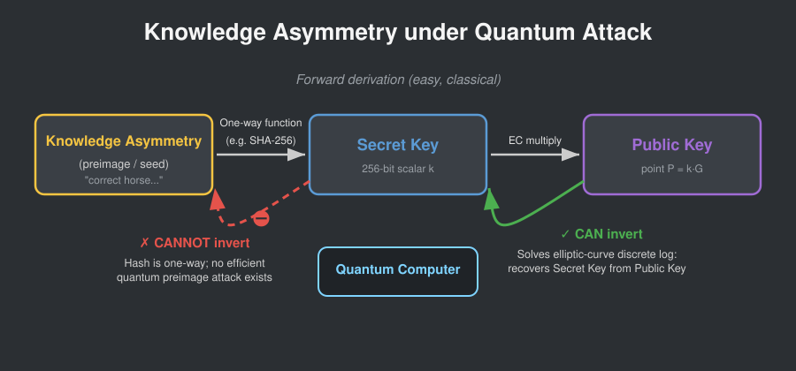
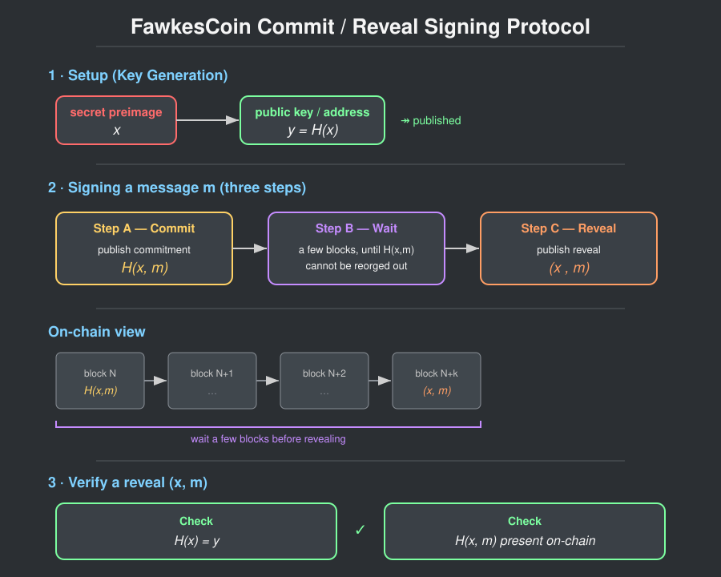
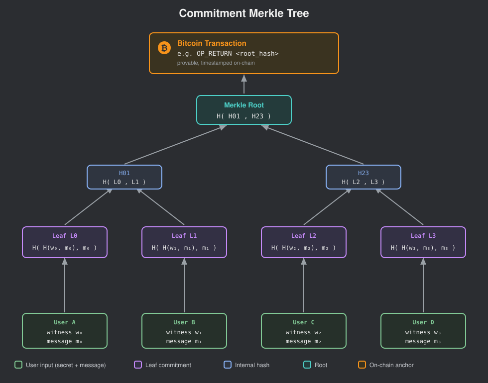
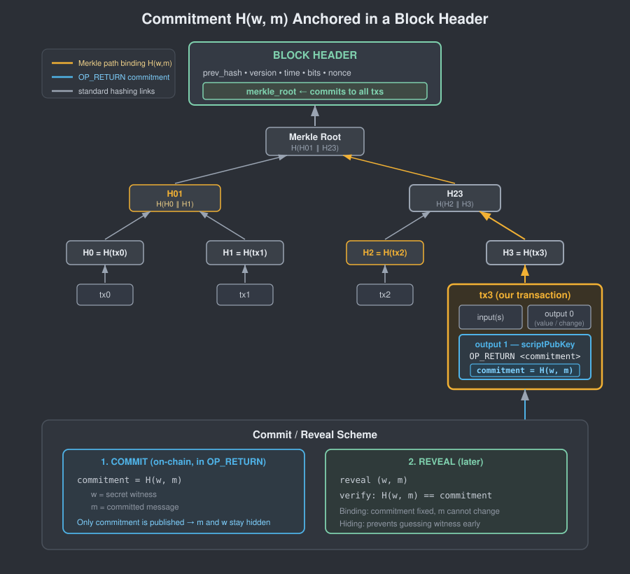
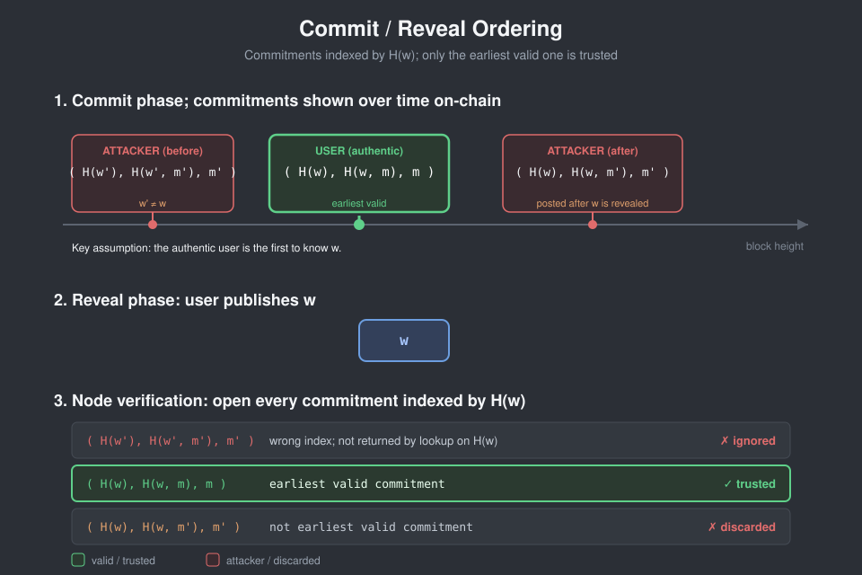

> *作者：conduition*
> 
> *来源：<https://conduition.io/bitcoin/dropkick/>*

*本研究[由一项 Brink 奖金](https://conduition.io/bitcoin/my-first-grant/)支持*。

最近，我在社交媒体和邮件组中看到了许多在量子计算机出现后挽救拖延症患者的比特币钱币的协议，而且似乎有许多的误解在流传。我认为，症结在于这个主题的文献是碎片化的。

在本文中，我会通过展示以往在 承诺-揭晓 协议上的工作、它们的缺点以及拟议的缓解措施，来清除这些困惑，最后，提出一种极简的 承诺-揭晓 协议。我认为，DropKick  是最方便、最可扩展以及最合适的钱币挽救协议候选，可以与 [Tadge Dryja 的 LifeBoat 提议](https://groups.google.com/g/bitcoindev/c/LpWOcXMcvk8)媲美。

如果你已经熟悉挽救协议和 承诺-揭晓 证据的概念，我建议你直接跳到[关于 DropKick 的章节](#DropKick)。

## 挽救协议

你可能还不了解，问题的出发点是所谓的 “*量子拖延症* ”。基本上就是说，当且仅当 
“Q-day” —— 一台可以攻破比特币密码学的可扩容量子计算机出现的那天 —— 到来时，将有大量的比特币钱币暴露在量子攻击者枪口下，无论有多少人已经预先迁移到量子安全的钱包。如果我们能够软分叉到一套新的共识规则来鉴别这些脆弱 UTXO 的花费者的身份，从而真正的钱币主人可以通过这种检查、但量子攻击者无法通过，那就好了。这就是所谓的 “（钱币）挽救协议”。

如能正确地设计、在合适的时间部署，那么一套挽救协议可以减少量子盗窃，并尽可能让钱币的主人在 Q-day 之后还能找回自己的钱币，哪怕没有在 Q-day 之前采取预防性措施（后量子密码学）来保护他们的钱币。

## 知识不对称

仅当诚实的用户与量子攻击者之间存在 “*知识不对称* ” 时，才有可能实现挽救协议。一项知识不对称（缩写为 “KA”），就是一段秘密信息，诚实的密钥持有者知晓，但哪怕是高级的量子攻击者，也不知晓，并且无法 计算/猜测 出来。

在比特币上，知识不对称的一些例子有：

- 哈希化地址类型（比如 P2PKH）中的公钥，前提在 Q-day 之前没有暴露过（即没有地址复用）。
- 用来派生 “账户” 层级密钥的 BIP32 父 xpriv（扩展私钥），例如一个派生路径为 `m/44'/0'` 的扩展私钥
- 用来派生 “地址” 层级密钥的 BIP32 父 xpub（扩展公钥），例如，一个派生路径为 `m/44'/0'/0'` 的扩展公钥
- Taproot 内部公钥
- MuSig 公钥聚合语境

*如果你还知道更多知识不对称，请一定要<a href="conduition@proton.me">告诉我</a>！*

这些信息，基本上在 Q-day 之后还是可以保持机密，因为，即使一台量子计算机有能力攻破 ECDLP（椭圆曲线上的离散对数问题）、能够从公钥反算出私钥，我们也假设他们无法高效地找出 SHA256 哈希函数的[第二原像](https://en.wikipedia.org/wiki/Preimage_attack)。

（译者注：假定 `x` 的哈希值为 `h(x)`，那么其第二原像为不等于 `x` 、但哈希值相等 `h(x) = h(x')` 的 `x'`。）

这些 KA 是量子安全的，因为，从某种角度看，它们都是最终派生出一个比特币地址的各种计算性管道的 *原像*， 比如，一个 P2PKH 地址是从一个公钥派生出来的，但这个公钥又是从一连串的 BIP32 密钥派生出来的，而这些 BIP32 密钥又是从一套种子词派生出来的。

挽救协议的用意是，向比特币的共识规则添加一些 —— 诚然，故意设计的 —— 规则，比如：

> 这个钱币只能通过证明它是从硬化的 BIP32 密钥中派生的，来花费。

这些规则将利用 KA 的存在，为不活跃的用户（“拖延症患者”）建立掩体，抵御量子攻击者，同时依然允许这些钱币在 *大部分情况下* 复原。

我说 “大部分情况”，是因为使用特定的 KA，我们并不一定能断定一个 UTXO 能否复原。

举个例子，你随便给我一个 UTXO ，我不可能光凭看一眼就知道这个 UTXO 的地址是多签名还是单签名、是不是从 BIP32 派生的，等等。你可以作一些启发性假设，比如

> 老旧的地址不可能使用 BIP32 ，更新的地址更有可能使用 BIP32 。

但你永远不可能确定。

就我所知，唯一的例外是哈希化地址和 Taproot 内部公钥。

- 哈希化地址（P2SH、P2PKH、P2WSH、P2WPKH）中带有隐藏原像的，是可以从区块链数据中穷举的。当 Q-day 到来，我们可以轻松识别出哪些地址带有隐藏的公钥、哪些的公钥已经暴露。 Project Eleven 在他们的 [Bitcoin Risq List](https://bitcoin-risq-list.projecteleven.com/) 中就是这样做的。
- Taproot [BIP341](https://github.com/bitcoin/bips/blob/master/bip-0341.mediawiki#cite_note-23) 指定了，每个 P2TR 地址都应该承诺一个默克尔根，即使并不需要脚本花费路径。 [BIP86](https://github.com/bitcoin/bips/blob/master/bip-0086.mediawiki#address-derivation) 已经为 BIP32 钱包作了规范。所以，可以安全地假设，几乎所有的 P2TR 地址都有一个内部公钥。

在这些情况下，我们可以断定一个 UTXO 是否支持 KA 。在其它所有情况下，都不能断定。

这里需要引入一个新的技术术语：如果我们可以可靠地穷举一个 KA 在任意给定时间点所覆盖的所有比特币UTXO，我们就说这个 KA 是 “**可判定的**”。否则，我们就说它是 “**不可判定的**”。

*事实上，没有哪个 KA 是完全可判定的，因为哪怕是哈希化地址和 P2TR，其公钥也可能在链外泄露给了量子攻击者。但基于区块链数据来判定，似乎已经是我们最好的办法了。*

## 证明系统

好了，我们有一些 KA，并且在一些情况下，我们可以识别出一个 KA 是否能覆盖某个 UTXO，但也有一些情况下我们做不到。

但是，我们如何才能 *使用* 这些 KA 呢？

我们需要一种 *证明系统*，允许诚实的用户构造出某种证据，来证明 TA 知道一种 KA 的 *见证*（机密数据）。签名人可以将这个证据放到他们的交易中（可以假设是某个新的插件字段）。而比特币全节点（验证者）可以根据这个 UTXO 的锁定脚本来检查这个证据；如果这种证据是有效的，并且剩余的传统共识规则也能得到满足，那么就允许这次花费。

**请注意，传统的比特币共识规则必须同时也得到满足，因此，传统的见证（公钥 + 签名）也是需要的，否则，激活挽救协议的升级就会是一次硬分叉。**

我们已知有两种方式可以实现这样的证明系统：**SNARKs** 和 **承诺-揭晓** 。

### SNARKs

量子安全的 ZK-SNARKs，比如 [Laolu 最近做过基准测试的这个](https://groups.google.com/g/bitcoindev/c/Q06piCEJhkI)，以及 [Project Eleven 所提出的这个](https://www.projecteleven.com/blog/proving-crypto-ownership-after-q-day)，可以将知识不对称转化为一个二进制或者算术电路，然后诚实的签名人可以证明自己知道见证（作为该电路的一个输入）（并且不会泄露知识）。

这种方法可以用在 BIP32、taproot 和MuSig KA 上，但不能用在哈希化地址种。一个哈希地址证据只能证明这个签名人知道计算出这个地址的原像，例如 P2(W)PKH 的公钥，或是 P2(W)SH 的赎回脚本。这样的证据很容易被传统攻击者伪造，只要 TA 知道了诚实签名人的花费交易 —— 而在签名人总是需要在花费交易中公开地址原像的前提下，这是很容易满足的（除非我们使用硬分叉改变这个要求）。

使用 SNARKs 来实现挽救协议有几个优点：

- **自包含**：SNARKs 是非交互的。验证者只需要知道证据，不需要知道别的、也不需要做别的事，就能鉴别出挽救动作。
- **简洁**：理论上，一个 ZK-SNARK 证据能够授权无限数量的 UTXO，可以分散在多笔交易中。

而它作为挽救协议的主要缺点有：

- **性能**：对更复杂的语句，SNARK 的证明时间通常在秒级。近期的进展，比如 [Binius](https://www.binius.xyz/) 和 [Flock](https://blog.succinct.xyz/introducing-flock/) ，是有希望的提升，并且新技术也在飞速发展。验证时间通常在几毫秒（milliseconds），比起 EC（椭圆曲线）或基于哈希函数的签名验证慢上几个数量级。
- **体积**：量子安全的 ZK-SNARKs 证据通常要占用几百 kB，不论电路的复杂性。为了扩大 SNARK 方法的吞吐量，我们要么需要更大的见证数据折扣，要么需要 *递归证据*，将多个单独的证据聚合为一个。我们刚经历 BIP110 数据过滤辩论，前者恐怕不会被接受。后者又难以放到比特币的架构中 ——聚合证据的任务可能会交给矿工，但尚不清楚如何恰当地激励他们来执行昂贵的证明运算。
- **复杂性**：SNARKs 的数学非常复杂，因此不便于安全实现，遍布犯下实现错误的机会。理论上，基于哈希函数的 SNARKs 的安全性假设是极简的，但在现实中，这种实现复杂性会导致广泛的攻击界面，尤其是在电路设计上， [ZCash 开发者们近期已经承认了这一点](https://x.com/zooko/status/2062644925590900980)。一旦 “健全性（soundness）” 被打破，就意味着可以伪造证据、盗窃钱币。而 “零知识性” 被打破，也将把用户的秘密见证暴露给短程攻击者，从而让原本意图 “保护” 的钱币无法安全救回。

### 承诺-揭晓

承诺-揭晓 协议的想法是使用一种可靠的时间戳服务作为身份鉴别方案的骨架。这种想法在[这篇 1998  年的论文](https://doi.org/10.1145/302350.302353)中首次提出，后来被建议作为设计 “[FawkesCoin](https://jbonneau.com/doc/BM14-SPW-fawkescoin.pdf)”（一种无需任何公钥密码学的密码货币）的方法。

FawkesCoin 背后的想法是：

- 固定一种安全的哈希函数 $H$ 
- 选择一个秘密原像 $x$，并计算 $y = H(x)$ 
- 分享 $y$ 作为你的公钥（或者说收款地址）
- 为签名一条消息 $m$ ，你需要运行一个三步骤的流程：
  - 在区块链上发布一个 *承诺* 
  - 等待几个区块（直到 $H(x, m)$ 无法因为[区块链重组](https://learnmeabitcoin.com/technical/blockchain/chain-reorganization/)而从链上消失）
  - 在区块链上 *揭晓*  $(x, m)$
- 为验证揭晓的 $(x, m)$ ，检查：
  - $H(x) = y$ ，并且，
  - $H(x, m)$ 已经在多个区块以前出现在区块链上

这种方案的安全性来自于一个事实：假定区块链只需添加不许删除，那么真正的签名人（生成  $x$ 的用户）就是 *第一个* 向区块链插入  $H(x, m)$  的人。

还有许多细节需要解决，但这就是 承诺-揭晓 协议的核心想法，并且，它不仅可以用来证明哈希原像的知识，还能用来证明对任意 [NP 问题](https://en.wikipedia.org/wiki/List_of_NP-complete_problems)的解的知识（即，任意可以快速检查解是否正确的问题）。

比如说，为了证明对一个数独的解 $x$ 的知识，我可以将公钥 $y$ 修改城一个数独谜题（其解为 $x$ ）。然后，在  $x$ 揭晓后，验证者检查 $x$ 是 $y$ 的一个有效的解。

绝大部分后量子的知识不对称也都是 NP 问题，所以，这种通用性意味着，承诺-揭晓 协议 可以用作证明系统，在比特币 PQ 挽救协议中证明*任意  KA* ，无需 SNARKs 这样繁重的密码学。承诺-揭晓  的证据也比  SNARKs 小得多，验证速度会快上几个数量级。它也有一些缺点，我会在下一章讨论，但绝大部分都是可以缓解的。

承诺-揭晓 协议已经在邮件组中、在密码学文献中被讨论了很多很多次。（详见[索引](#References)）

在本文剩下的部分，我将专注于 承诺-揭晓 证据，并揭示我们如何走向一种简单但有效的设计，我称为 “DropKick”，它避免了以往的 承诺-揭晓 协议的绝大部分常见的陷阱和复杂性。DropKick 的重点是实现的简洁性，为此，在安全性上有一个小小的让步（跟上我，终点就快到了）。

在描述 DropKick 之前，我们先定义我们需要的知识不对称界面，从而我们的证明系统可以在任何知识不对称上通用化。

## 量子计算难解的函数

在比特币中，任何知识不对称都可以抽象为一种 “*量子计算难解的单向函数* ”。我来解释以下这个词的意思。

令 $\mathbb W$ 为见证的可能空间。（例如，所有 BIP32 扩展私钥的空间）

令 $\mathbb S$ 是所有语句（statement）的空间。（例如，所有比特币地址的空间）

令 $f: \mathbb W \rightarrow \mathbb S$ 是一种*量子计算难解的单向函数* ，即，一种多项式时间的算法，使得任何人都能在合理时间内计算 $s = f(w)$ ，但一个随机化的多项式时间的量子敌手，如果只知道 $s = f(w)$ ，那么找出一个有效的见证 $w'$ 使得 $f(w') = s$ 的概率是可以忽略的（negligible）。

以 BIP32 为例， $f$ 可以是一个地址派生管道，包含了 `BIP32-CKDPriv`。 在这种情况下，见证 $w \in \mathbb W$ 将是一个元组，包含父私钥、chaincode（链码）、派生路径以及地址格式指令。而语句 $s \in \mathbb S$ 将是一个派生的比特币地址。这个函数是一个 *量子计算难解的单向函数* ，因为反算它需要找出 `BIP32-CKDPriv` 所用的 HMAC-SHA256 函数的原像。

## 使用 承诺-揭晓 来证明一个见证

在一个量子计算难解函数的背景下重构 FawkesCoin 风格的 承诺-揭晓 协议，我们需要稍微改变协议，在生成密钥和验证揭晓时使用 $f$ ：

- 找出一个量子计算难解函数 $f$
- 选出一个秘密的见证 $w \in \mathbb W$ 并计算语句 $s = f(w) \in \mathbb S$
- 分享 $s$ 作为你的公钥（或者说收款地址）
- 为签名消息 $m$ ，运行一个三步骤的流程：
  - 在区块链上发布一个 *承诺* $H(w, m)$
  - 等待几个区块（等到 $H(w, m)$ 不会因为[区块链重组](https://learnmeabitcoin.com/technical/blockchain/chain-reorganization/)而从链上消失）
  - 在区块链上发布包含 $(w, m)$ 的 *揭晓*
- 为了验证一个揭晓 $(w, m)$ ，需检查：
  - $f(w) = s$ ，并且
  - $H(w, m)$  在一定数量的区块以前已经出现在区块链上

## 问题

在这里，我将讨论上述幼稚的 FawkesCoin 设计会遭遇的许多问题，以及多种可用的缓解措施。这将是我为 DropKick 的设计抉择辩护的背景。

### 两步骤签名

[FawkesCoin](https://jbonneau.com/doc/BM14-SPW-fawkescoin.pdf) 中的签名流程从根本上来说就是两步骤的，在 *承诺* 和 *揭晓* 步骤之间有意安插了一个时延。在我们知道自己要用见证 $w$  来签名的消息 $m$ 时，我们就必须发布 $H(w, m)$ ，然后等待区块确认，最后才发布 $(w, m)$ 。

如果我们在 $H(w, m)$ 被挖出之前发布 $(w, m)$  ，目击了见证 $w$ （比如，在交易池中）的攻击者就能选出恶意消息 $m' \neq m$ ，然后尝试抢先在链上发布 $H(w, m')$ 。如果他成功了（ $H(w, m')$ 先于 $H(w, m)$ 得到区块确认），那么攻击者就能在接下来的区块中伪造揭晓 $(w, m')$  。而我们，诚实的签名者，没有任何办法证明自己比攻击者更早知道 $w$ 。

如果我们虽然等待了，但太过急躁，在 $H(w, m)$ 只得到一两次确认时就发布了 $(w, m)$ ，那么包含 $H(w, m)$ 的区块可能成为孤儿区块，或者被[重组](https://learnmeabitcoin.com/technical/blockchain/chain-reorganization/)，从而目击者还是能够抢先挖掘 $H(w, m')$ 并尝试伪造。

为了安全，我们必须等待包含了 $H(w, m)$ 的区块得到足够多的区块确认，使得区块重组不会再对我们产生影响。

在真实直接的比特币上实现这种 承诺-揭晓 机制，会变成一种非常古怪的用户体验：为了在 Q-day 之后挽救你的遗留钱币，你需要先打开自己的钱包软件，发布承诺 $H(w, m)$ ，然后，在一定数量的区块确认之后，回到网络上，公开 $(w, m)$，从而领取你的资金。

**缓解措施**

不幸的是，这项使用体验属性无法真正得到缓解，因为这是所有 承诺-揭晓 协议的核心签名流程，可以说也是 承诺-揭晓 相比 SNARKs 的最大缺点。

我们可以将发布承诺的步骤委托给一个不需要信任的第三方，但无法将揭晓的步骤也委托出去，因为这样一来，第三方就可以尝试挖出自己的承诺然后伪造签名。看起来，签名人必须在承诺和揭晓步骤中都在线。

### 承诺步骤启动

比特币交易必须给矿工支付手续费，以防止拒绝服务式攻击，并保护验证者节点的稀缺资源。

但是，如果我们只拥有遗留的 UTXO，该如何为确认承诺 $H(w, m)$ 支付手续费呢？在发布承诺时，其中的价值是无法花费的呀。这就成了一个 “鸡生蛋蛋生鸡” 的问题。

**缓解措施**

[以往的讨论](https://groups.google.com/g/bitcoindev/c/LpWOcXMcvk8)已经提出了多种缓解措施，主要的思路是使用已经存在的后量子 UTXO 。

**PQ UTXO 启动**。使用已经存在的量子安全的 UTXO 来启动承诺阶段、挽救遗留 UTXO 。一个量子安全的 UTXO 的主人可以发布承诺（例如，通过 `OP_RETURN` 输出），这很容易就能挽救他自己的遗留钱币。但 *还没有* PQ UTXO 的用户将需要请求其他用户的帮助。发布承诺 $H(w, m)$ 并不需要对秘密见证 $w$ 的知识，因此，可以安全地委托出去（与揭晓步骤不同）。

然后，问题就变成了激励因素：这个拥有 PQ UTXO 的援手要么是做慈善，要么需要链外支付（信用卡、山寨币，等等）来激励。

**残值费**。一种更有趣的想法是收取 “残值费” —— 被挽救的 UTXO 价值的一部分。只要我们稍微修改承诺协议，从而不是发布 $H(w, m)$ ，而是封装在另一个哈希值里面： $H(H(w, m), m)$ ，那么援手就可以打开外层的哈希值并阅读被签名的消息 $m$ ，而无法知晓秘密见证 $w$ ，也没有能力创建新的有效承诺。 因为内层哈希值和外层哈希值中的消息 $m$ 必须一致，因此，援手可以验证 $m$ 会把被挽救的钱币的一部分支付给 TA 作为残值费（打捞费）（可以在验证之后再发布  $H(H(w, m), m)$ ）。这种想法很有吸引力，因为它提供了一种手段来激励 PQ UTXO 帮忙挽救钱币。过往的讨论似乎还没讨论过这种想法。

**默克尔树**。如 [FawkesCoin 论文](https://jbonneau.com/doc/BM14-SPW-fawkescoin.pdf)（章节 5.5）所之处的，我们也可以改变承诺在链上的形式。我们不必让它清楚地暴露（比如，每个 `OP_RETURN` 输出携带一条承诺），可以将交易池中的所有承诺 $H(w, m)$ 都合并到一棵 默克尔树中（通过一个无需信任的第三方，我们称为 “*聚合人* ”）。这棵默克尔树的树根可以由持有 PQ UTXO 的人发布到链上，成本是固定的，我们将这一方称为 “*发布者* ”。

- *聚合人* 收取承诺（可能要使用抗 DoS 措施，比如验证码、零知识证明、工作量证明、微支付），然后给客户端返回默克尔证据。然后，TA 将默克尔根发给发布者。
- *发布者* 找时机支付手续费，将这个默克尔根发布到区块中某个清晰可见的区域。

聚合人和发布者 *可以* 是同一个主体，但不需要是。默克尔根是一个很小的、不透明的数据块，并且，任何提供了承诺的用户都可以验证它。

顺带一提，这跟今天的 [OpenTimestamps 的工作方式](https://petertodd.org/2016/opentimestamps-announcement#how-opentimestamps-works)非常相似。OTS 是一种用于对任意消息生成可验证时间戳的协议，它将许多消息的哈希值聚合到一棵默克尔树中，并不定期地将默克尔根发布到比特币区块。我们可以复用或修改 OTS 的架构，用于为一种 承诺-揭晓 挽救协议发布承诺。

### PQ UTXO 前提

请注意，已知所有的承诺步骤启动方法都假设了存在一位善意的用户，TA 持有至少一个 PQ 比特币 UTXO 、愿意发布一小段数据（比如承诺的默克尔树的树根），也许能得到补偿。

但是，如果根本没有 PQ UTXO 持有者呢？矿工也许可以协助，在 coinbase 交易中发布一个承诺默克尔树根。但最终，这还是需要一个第二方来帮忙，并且，当然，我们必须假设存在量子安全的地址类型，让用户能够安全地接受挽救出来的钱币 —— 否则，把它们转到哪里去呢？

依赖于 PQ UTXO ，是 承诺-揭晓 的另一个主要缺点，也是显然很难客服的。如果比特币节点们可以信任一些外部的时间戳服务商，也许能修复这个问题，但那样似乎是不安全的。

### 索引

在研究一个揭晓时，节点必须能够访问承诺集合。这是一个问题，因为验证者无法区分无效承诺和有效承诺；而且，如果验证者只是单纯地索引所有的承诺，那么无效承诺就会消费稀缺的内存或磁盘空间，并且，其增长可能是无限的。

这就是 [Lifeboat](https://groups.google.com/g/bitcoindev/c/LpWOcXMcvk8) 所面临的一个实现问题，因为 Lifeboat 验证者必须预先索引所有承诺的集合（这些承诺表现为特定形式的 `OP_RETURN` 载荷）。那么，发布无效承诺是很便宜的，只需付出一次性的代价，但验证者必须无限期跟踪无效的承诺。

**缓解措施**

**UTXO** 。节点必须索引未花费输出的完整集合，以验证新区块中发生的花费。一种保证所有比特币节点默认索引承诺集合的简单办法，是定义一种输出类型，专用于 承诺-揭晓  协议的承诺，并且，只允许一笔相应的有效揭晓交易来花费这种输出类型。，但是，这只是重新打包这个索引问题，从而在 `Bitcoin Core` 中更容易实现，还是要面临承诺的数量可能无限增长、消耗稀缺内存的问题，只不过，问题进入了 UTXO 集合，而不是表现在一套专用的承诺索引中。

**过期**。一种解决办法是给每一个承诺强制执行一个过期时间，从而节点只需将承诺索引到一个临时的缓存中，长期不用的条目可以驱逐。不过，这就把问题丢给了 承诺-揭晓 的用户：揭晓不再是永久有效的了，并且这会带来审查攻击（详见下一节）和捣蛋，并且误操作会带来惨痛的代价。

**SCV（简单承诺验证）**。为了更优雅地缓解索引承诺的资源使用问题，我们可以将承诺设计称会被每一个节点自动索引，不会比当前已在比特币实现中服役的索引消耗更多的资源。

幸运的是，这是很容易做到的，只要可以验证一个承诺 $H(w, m)$ 已包含了一个比特币区块头中。每一个比特币节点都能访问所有区块头的集合，这个集合是绝不修剪的，并且区块头的体积是恒定的（80 字节）。任何一个承诺都可以通过一个区块包含证明（也就是 [SPV](https://learnmeabitcoin.com/technical/networking/node/#lightweight-node) ）和 [OpenTimestamps](https://opentimestamps.org/) 来打开：一个字节串向量，以及如何将它们用哈希合并起来的指令，从而任何人都能验证这个承诺已被包含在某个区块哈希值中。我们将此称为 “*开启证明* ”。

请注意，我们也 *可以* 将承诺放到 “铭文（inscriptions）” 或者其它位于区块隔离见证区域的信封中，但因为剪枝的比特币节点会在验证之后删除见证数据，这些节点将需要 开启证明 认证承诺交易的 *WTXID*（根据  [coinbase 交易中的 *见证根哈希值*](https://learnmeabitcoin.com/technical/transaction/wtxid/#commitment)）。这对揭晓者来说更繁琐也更昂贵，因为 TA 必须在其证明中包含揭晓交易的见证以及 coinbase 交易，所以证明的成本也相应增加。

如果我们像过去许多人建议的那样，将承诺放在 `OP_RETURN` 输出中，那么节点就能更清楚地跟踪：区块哈希值涵盖了脚本公钥。不过，还有一个更高效的选项：将这样的承诺隐藏在脚本公钥中，例如，放在一个 P2MR/P2TR 叶子脚本中。区块哈希值也涵盖这些脚本公钥， 所以足以保证安全性，并且，在其中发布承诺不会给区块链增加任何额外的数据，除了在标准的乐观花费路径本就要公开的部分。这会给承诺开启证明增加少量字节，但远远少于在区块见证中打开承诺所需要的数量。

## 审查

在比特币语境下，我们无法将区块链当成一个完全免许可的只增不减账本。矿工集体把持着一笔交易否能得到确认的决定权，而他们通常是根据经济激励来采取行动的。

我们必须考虑一个或多个矿工主动审查交易的可能性，因为有些时候，这样做对他们有利。

如果一个矿工看到了某个高价值地址 $s = f(w)$ 的揭晓 $(w, m)$ ，那么，该矿工可以尝试审查 $(w, m)$（拒绝挖出它），与此同时，偷偷发送新的承诺 $H(w, m')$ ，尝试用恶意消息 $m' \neq m$ 伪造另一个揭晓 $(w, m')$ 。如果这种攻击成功，这个矿工就能偷走该地址 $s$ 上的所有钱。

**缓解措施**

为了缓解矿工审查问题，文献和论坛讨论了多种选择。不幸的是，许多都无法应用在比特币或者挽救协议上。

**先到先得**。FawkesCoin 提出的第一种想法是，允许先发布承诺的用户重复花费。如果我在 $H(w, m')$ 之前发布了 $H(w, m)$，那么我就应该能够在这种攻击下抢救我的钱币。这会给比特币带来一个问题，因为这种重复花费会打破交易图的连续性，从而打破整个系统的基本安全性。因此，我们放弃这种候选。

**验证者拒绝**。验证者可以拒绝包含了揭晓 $(w, m')$ 的区块，如果验证者发现该揭晓对一个发布于区块高度 $h'$ 的承诺有效，但已知另一个揭晓 $(w, m)$ 对发布更小的区块高度 $h < h'$ 上的承诺有效。如果节点受到一个包含了这样无效揭晓的区块，可以回复以正确的揭晓 $(w, m)$ 。希望在于，正确的揭晓早已传遍整个网络，从而让恶意区块作废。但是，这又打破了比特币的挖矿系统：挖矿为什么要在那些任何人都可能轻易驳回的区块上浪费电力呢？它同时也意味着，协议外的数据（比如交易池中的交易）成为了验证区块的前提，而验证区块本来应该是自包含的，只依赖于以往的区块。因此，我们也放弃这种候选。

**挑战期**。我们前面假设了揭晓交易是挽救协议的最终阶段，并且可以假设，其输出是不带负担的单签名 PQ 地址。而在这种缓解措施下，验证者节点会在一个揭晓挖出后，强制执行以很大数量的区块计的 *挑战期* 。在挑战窗口内，揭晓交易的输出带有临时的时间锁，从而可以揭晓来自更早区块的承诺，来取代先挖出的恶意揭晓，并重设挑战期时间锁。这种方法的问题在于，矿工甚至也能从失败的攻击中获益：每过两个区块，矿工就能审查一次真正的揭晓，然后按顺序插入自己的承诺、按相反顺序打开，从而迫使用户支付手续费。在最极端的情况下，矿工可以让整个 UTXO 的价值都化作手续费、在 coinbase 交易中收回来。 如果这样的交易可以被挖出，那么我们就必须在比特币的交易图中引入不连续性，以便诚实用户能够将其追回。由于这种方案引入的复杂性和失败风险，我们放弃了它。

**排序**。如果验证者能够根据年龄来排序一个见证 $w$ 的所有承诺，那么当 $w$ 揭晓时，验证者就能拒绝所有的揭晓，将第一个（也就是有效的）承诺的揭晓认出来。FawkesCoin 的作者提出了这个想法的一个简单版本（在他们论文的章节 4.2），提议在承诺上添加  $H(w)$ 。在验证的时候，验证者断言一个揭晓必须打开 $w$ 的一个更老的承诺。作者把这种方法称为 “打标签”。光凭这个描述，它会受困于短程的捣蛋攻击：*最早* 出现在链上、包含 $H(w)$ 的承诺不一定是由诚实的用户发布的；可能还在交易池中等待确认时，$H(w)$ 就被敌手复制了，然后附加在无效承诺 $H(w', m')$ 中，从而阻止诚实用户复原自己的钱币。如果 $H(w', m')$ 在 $H(w, m)$ 前挖出，那么验证节点就没有办法知道哪一个是更早的有效承诺，除非打开了最早的那一个。

由 Tim Ruffing 观察到、且得到 Tadge Dryja 优化的一点是，一旦 $w$ 发布，验证者就必然能够区分真正的承诺和欺诈的承诺。具体来说，如果每一个承诺 $H(w, m)$ 都附加了 $H(w)$ 和 $m$ ，那么验证者就能过滤掉无效承诺、找出真正（第一个）承诺。这个想法是，验证者，在看到一个见证 $w$ 之后，就可以根据年龄来排序用 $H(w)$ 索引的所有承诺，然后不断枚举最老的那一个，直到找出第一个有效的承诺 $(H(w), H(w, m), m)$ 。然后，这个节点就能据卷更年轻的承诺的揭晓  $(w, m')，m' \neq m$ 。这是由 Tadge Dryja 在[这篇帖子](https://groups.google.com/g/bitcoindev/c/LpWOcXMcvk8)中建议的方法，启发则来自 [Tim Ruffing 的想法](https://gnusha.org/pi/bitcoindev/1518710367.3550.111.camel@mmci.uni-saarland.de)：通过发布可以鉴别身份的密文来实现类似的承诺验证属性。

（译者注：如图所示，这种排序方法的安全性来自两个地方：（1）w 必须正确；（2）承诺更加古老。从而，错误但更古老的承诺无法干扰验证者，而正确但更年轻的承诺会被过滤掉。）

一方面，排序承诺是好的，因为它保证了真正的主人能够花费，如果你是第一个发布有效承诺的人，那么你的揭晓就有保证，也是不可更改的。

不幸的是，排序方法也有缺点。为了建立排序，我们必须要求 *每一个* 承诺都**明文**发布在链上，从而验证者可以全面索引它们。我们需要的不仅是时间戳，还是 *每一个* 承诺的 *出版证明* 。说的直白一些，这种办法会让所有在链外聚合承诺的方案都出局。如果我们要允许在链外隐藏承诺（例如，在链上只承诺默克尔树），那么验证者就不可能找出给定的见证  $w$ 的所有承诺并加以排序：更早的有效承诺也许存在，但藏起来了、藏在某棵默克尔树上。

排序也要求验证者们维护一个所有承诺的全局索引，以 $H(w)$ 为键。这会给比特币带来新的拒绝服务攻击界面，因为带索引的承诺的集合可能无限膨胀。在揭晓之前，节点不可能区分真正的承诺和无效承诺，所以，没有打开的承诺也可能永远不被修剪。如果我们加入额外的规则，那么承诺可以修剪，比如，“*承诺在至多* $X$ *个区块内必须打开* ”。这样做也许是可行的，但也会带来额外的复杂性、用户体验难题，并带来矿工审查攻击的可能性。

**推迟揭晓**。验证者节点可以强制在承诺和揭晓交易之间实施很长的时延（比如 100+ 个区块）。恶意的矿工，如果尝试盗窃钱币，必须也满足这个时延要求。这个时延让用户有许多时间可以挖出自己的揭晓交易，**只要矿工并不是全体串谋来审查这笔交易**。这会让用户体验恶化，但实现起来非常简单，并且单一矿工如果没有接近全部的算力就很难审查。

揭晓交易也可以通过给矿工支付更多手续费来抵御矿工攻击，因为如果审查，就一定会错过这个收入。我在[本文的 “参数” 章节](https://conduition.io/bitcoin/dropkick/#Parameters)研究了如何找出最优的费率，在[关于博弈论的附录](https://conduition.io/bitcoin/dropkick/#Appendix-Game-Theory)中，有更多细节为这种计算辩护。

## 批处理

有些时候，在挽救某个 UTXO 是，所揭晓的见证 $w$ 也会揭晓同一用户所有的其它 UTXO 的见证。比如说，揭晓一个派生路径为 `m/44'/0'` 的 BIP32 扩展私钥，会曝光该密钥路径下的每一个 BIP32 账户中的每一个 UTXO 的见证。在揭晓一个哈希化地址的原像、或者一个 P2TR 内部公钥时，情形也是一样的，只要该地址持有多个 UTXO 。

**缓解措施**

为了防止 承诺-揭晓 花费暴露其它 UTXO 给窃贼，挽救协议必须能够 *批量挽救*，即，花费同一见证 $w$ 所覆盖的多个  UTXO 。举个例子，如果 $f$ 是一个 BIP32 硬化地址派生函数，而见证 $w$ 是一个 BIP32 扩展私钥，派生路径为 `m/44'/0'` ，那么，挽救协议需要在 承诺-揭晓 通过时，自动转移 `m/44'/0'/*` 路径下的每一个 BIP32 账户下的每一个 P2PKH UTXO 。否则，一些脆弱的 UTXO 会被遗漏，然后允许盗贼通过新发布的见证盗走。

这意味着，承诺-揭晓 的见证并不是 “针对一个 UTXO” 的见证，而是 “针对一笔交易” 的见证，因为在绝大部分情况下，这样的见证将授权多个 UTXO 的花费。这样也更加经济（区块空间效率更高）。

## 一次性签名

一旦揭晓 $(w, m)$ 公布，我们就不能再使用 $w$ 来授权，除非作出一个新的承诺。这就意味着，如果 $m$ 是一个交易的 sighash ，那么这笔交易就 *固定下来了*，用户不能再改变它。如果用户犯了个错误（比如签名了一笔无效交易），或者需要为其揭晓交易追加手续费，或改变输出的目标地址，等等，都必须先插入一个新的承诺。如果用户已经发布过她的揭晓交易，就跟尝试伪造揭晓的攻击者站到了同一条起跑线上。这可不是什么开心的事。

**缓解措施**

**密钥认证**。[FawkesCoin](https://jbonneau.com/doc/BM14-SPW-fawkescoin.pdf) 被设计成一个自选完全不使用公钥密码学的系统。这简直是 “末日战士” 一般的偏执：在比特币中，我们总是希望拥有一些公钥密码学，因为这样的用户体验好得多，你可以签名多条消息。

为了纠正这个缺陷，一个 承诺-揭晓 用户不应该直接签名一条消息，而是用她的 承诺-揭晓 证据来 *认证*（certifiy）一个公钥，然后使用这个密钥对来签名消息。在一个 PQ 挽救协议的背景下，这样的公钥应该属于后量子密码系统，比如 [SHRINCS](https://delvingbitcoin.org/t/shrincs-324-byte-stateful-post-quantum-signatures-with-static-backups/2158) 。然后，这个 PQ 密钥对可以用来签名实际的交易或其它消息，这样就能自由改变而无需修改 承诺-揭晓 证据。这将允许 RBF 以及比特币的其它依赖于签名多条消息的特性。

**多公钥认证**。如果这个 PQ 密码系统不支持 MPC（多方计算）、门限签名和多签名协议，那么，明智的做法是增加对 *PQ 公钥集合* 的认证，从而 “残值费” 可以通过多签名装置来强制执行。

**脚本认证**。可以将多公钥认证推广为允许一个 承诺-揭晓 用户给任意的锁定脚本背书，但是，这会带来额外的实现复杂性和 bug 空间。

（未完）