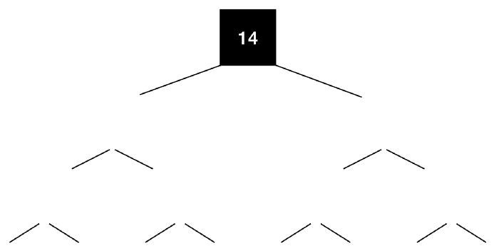

> *作者：Calvin Kim*
> 
> *来源：<https://medium.com/@kcalvinalvinn/eli5-utreexo-a-scaling-solution-9531aee3d7ba>*

关于我：过去 7 个月里，我一直宅在 Utreexo 实现贡献代码；同时我还是 [首尔 Bitcoin Meetup](http://meetup.com/seoulbitcoin) 的联合创始人，专门研究比特币和相关可急两年了。

Utreexo 是一种为比特币设计的[哈希累加器](https://en.wikipedia.org/wiki/Accumulator_(cryptography))，由 Tadge Dryja 提出（他也是 [闪电网络白皮书](https://lightning.network/lightning-network-paper.pdf)的联合作者）。这种技术有以下的优缺点。

## 优缺点

### **对比特币的四大好处**

1. 只需下载几千字节就可以成为一个新的全节点，机械硬盘（HDD）同步起来和固态硬盘（SSD）一样快
2. 允许在节点初次假如网络、下载区块时并行化下载
3. 让共识过程可以独立于数据库的实现，从而增强比特币的安全性（[当前比特币软件的数据库](https://github.com/google/leveldb)是谷歌开发的）
4. 不需要实施硬分叉，就可以将 Uteexo 引入比特币网络

### **两大缺点**

1. 在初次下载区块时要多消耗 20% 的带宽
2. Utreexo 存档节点（Archival node）有额外的存储要求

## Utreexo 工作原理

*一句话总结：使用了 Utreexo，一个全节点只需为每个区块保存一个哈希值；但在传统的模式中，即使是剪枝全节点（pruned full node）也需要保存每个区块里所有的 UTXO。*

要理解 Utreexo，我们先要搞懂哈希树结构。我们以默克尔树为例，因为比特币已经在使用这种数据结构了。

一棵有 8 个叶子节点的默克尔树将如下图所示：

- 一棵典型的默克尔树 -

图中的每个数字都表示一个哈希值。

在比特币中，所有位于最底层的数字，都是一条 [TXID](https://bitcoin.org/en/glossary/txid)（交易索引号）。而 08 是 00 和 01 两条哈希值前后拼接、再进行哈希结算的结果。13 则是 10 和 11 两条哈希值前后拼接、再进行哈希计算的结果。（`08' = hash(00' + 03')` ，此处的加号表示把后一串字符跟着写在前一串字符后面，从而形成一条新的字符串。）

在当前的比特币协议中，默克尔树用来生成[区块头](https://bitcoin.org/en/glossary/block-header)中的默克尔根（译者注：这个默克尔根是该块所打包的交易的 txid 哈希而成的，可以用来校验区块头与区块内容是否一致，也可以用来向轻客户端证明某笔交易已打包到了某个区块中）。Utreexo 则将默克尔树的概念用在了 UTXO 上。值得提醒的是，Utreexo 不会取代区块头中的默克尔根。

当前，如果你是一个比特币全节点，你必须存储当前所有的 UTXO。而在 Utreexo 中，作为全节点你只需存储 UTXO 的哈希树根。整棵树就像这样：

- 只有树根的 Utreexo 树。所有其它的哈希值都删掉了。 -

从 00 到 13 的所有哈希值，在验证之后都丢掉了，只保存 14（树根）。

如果用户要花费 UTXO 07，他们需要向 Utreexo 全节点证明这个交易输出存在。他们向验证节点提供 06、07、10、12 四条哈希值，验证节点将用这四条哈希值生成一棵独立的树：

- 用于验证的树。注意看树根是如何计算出来的 -

空白的位置 11、13、14 都可以使用这几条哈希值计算出来。如果得出来的树根与节点存储的 14 一致，那我们可以断定，用户要花费的 UTXO 存在。

实际上的 Utreexo 会比这里介绍的要复杂一些，原理也跟这个案例有所区别，但这个案例是其概念的一个缩影。

## 好处

### **1. 只需下载几千字节就可以成为一个新的全节点，机械硬盘（HDD）同步起来和固态硬盘（SSD）一样快**

**几千个字节就可以做全节点**

当前的比特币网络有两种全节点：存档全节点（Archival）和剪枝全节点。剪枝全节点仅保存未花费的交易输出（即 UTXO）。Utreexo 是的另一种全节点模式，可称为“**压缩状态节点**（Compact State Node，CSN）”，得以出现。这种模式的全节点仅存储 UTXO 根值和钱包信息。所以，这种全节点不同于现在的全节点（用户至少要存储几个 GB 的数据），只需不到 1 KB 就足够了。

这种**只存储**与用户有关的 UTXO 信息的能力，会随着比特币的普及而变得越来越重要。一个用户至少需要一个 UTXO（考虑到隐私，还需要更多），用户的增加必定带来 UTXO 数量的增加。我们可以从下图中清晰地看到 UTXO 数量的增长。

- UTXO 数量统计。已排除使用 OP_RETURN 的 UTXO  -

因此，剪枝节点的存储要求**会**逐渐提高，导致比特币全节点的最低存储要求不断提高。Utreexo 可以让用户修剪不术语自己的 UTXO，从而缓解这个问题。

**初始区块下载在机械硬盘上可以跟固态硬盘上一样快**

因为压缩状态节点可以用不到 1 KB 的数据代表整个 Utreexo 状态，那就不需要在初始区块下载中查询硬盘。这使得初始区块下载可以**完全在内存中发生**，使得机械硬盘节点同步起来可以跟固态硬盘节点一样快。

### **2. 允许初次下载区块时并行化下载**

UTXO 快照是保存某个区块高度时候的所有 UTXO。一个可能的用途是 [assumeUTXO](https://github.com/bitcoin/bitcoin/issues/15605) 项目，允许用户从被快照的高度开始同步区块链。快照的主要麻烦在于其体积，如果给当前的区块高度做快照，快照的大小是 5 GB 左右，是非常大的。而且快照的嗲小也会不断增长，就像优势 1 里说的那样。但有了 Utreexo，**在最差的情况下也不到 1 KB 就可以完成** 1（最好的情况下大约100 字节）。有了 Utreexo，UTXO 快照就会变得非常简单；而且 [ZkVM](https://medium.com/stellar-developers-blog/zkvm-a-new-design-for-fast-confidential-smart-contracts-d1122890d9ae) 项目已经[实现了](https://github.com/stellar/slingshot/blob/c0d0cdc927fa0f3a5a9b175a844a6f87bf3a1609/zkvm/docs/zkvm-blockchain.md) Utreexo，并通过在区块头中包含 Utreexo 树根来保存区块链状态。

当快照变得如此便宜，就有可能**每个区块高度**都快照一次。有了这种技术，未来就可以实现并行化的区块链同步方法，意味着一台电脑（CPU 核心）可以同步从 0 到 300000 的区块，而另一个可以同步从 300001 到 600000 高度的区块。然后，同步方法的优化就将围绕[时钟速度](https://software.intel.com/en-us/blogs/2014/02/19/why-has-cpu-frequency-ceased-to-grow)转向围绕[数量](https://www.tomshardware.com/news/amd-cto-mark-papermaster-more-cores-coming-in-the-era-of-a-slowed-moores-law)、[GPGPU](https://en.wikipedia.org/wiki/General-purpose_computing_on_graphics_processing_units) 也可以运用起来，这些异步的区块同步方法可以进一步降低启动一个比特币全节点所需的时间。

### **3. Utreexo 强化了比特币的安全性**

**让共识代码可以独立于数据库的实现**

[libconsensus](https://bitcoincore.org/en/meetings/2016/10/20/) 项目曾致力于将共识代码从 Bitcoin Core 软件中分离出来，使得：

1. 与共识无关的代码可以改变而无需担心打破共识机制
2. 让不同的比特币软件实现可以使用同一个共识 API

这个项目最终被抛弃了，因为让数据库（leveldb）从共识代码中独立出来非常困难。这是一个亟待解决的非常重要的问题，[因为在 2013](https://blog.bitmex.com/bitcoins-consensus-forks/)，Bitcoin Core 软件从 Berkeley DB 迁移到了 levelDB，然后就遭遇了一次意料之外的临时硬分叉，一次意料之外的临时软分叉，以及一次硬分叉（BIP50）。

当前，共识是依赖于 levelDB 的功能的，因为你需要获得存储好的事务。这就意味着，如果 levelDB 的功能出错了，就有可能跟使用另一种数据库的另一个客户端产生分叉。

有了 Utreexo，你可以根据 Utreexo 来验证收到的事务和区块，无需访问数据库。收到的交易所花费的 UTXO 的存在性可以使用包含证明（included proof）来检查。

### **4. 无需硬分叉**

Boneh 等人提出的 [RSA 累加器](https://eprint.iacr.org/2018/1188.pdf)，在体积上比 Utreexo 更加高效。但是，实现 RSA 累加器需要一次软分叉。比特币是一个比较保守的系统，即使软分叉也会伴随极端的谨慎，所以这些累加器是很难在比特币中实现的。 **Utreexo 不许要任何分叉**。用户只需自己选择是否运行 Utreexo 节点。

## 缺点

### **1. 节点需要额外 20% 的带宽**

假设一个人使用一台性能非常强大的计算机来同步比特币节点，但 TA 住在一个带宽非常小的荒山野岭，那  Utreexo 非但没有帮助，反而有害。因为上面说的那种证明必须与 TXO 一起传播，所以一个节点要多下载 20% 的数据。

 从这个角度来看，Utreexo 可以被认为是带宽和存储要求的权衡。如果你认为存储资源（机械硬盘、固态硬盘）的价格比互联网网速的价格更高、技术上是更大的瓶颈， Utreexo 就可以帮助网络的去中心化。如果你认为带宽的价格更高，那 Utreexo 就没什么用。

**2. Utreexo 存档节点有额外的存储要求**

Utreexo 存档节点等于是当前的比特币存档节点加上上述 Utreexo 节点所需的证明。

所以，Utreexo 存档节点存储了：

1. 自创世区块以来的所有区块
2. 自创世区块以来的所有证明

因为 #2，存档节点需要提供额外的存储空间。如果一个 Utreexo 存档节点腰围每个区块存储所有的证明，大概需要多存储 100% 的数据。

但是，取消逐块存储所有证明就可以优化这个问题。你可以只存储奇数块的证明，当另一个节点为一个偶数块存储证明时再 “重新同步”。举个例子，如果有人请求 566 块的证明，Utreexo 存档节点可以：

1. 检索区块 566
2. 检索区块 565 形成的 Utreexo 树
3. 将区块 566 中的事务补充到 Utreexo 树上，重新生成证明
4. 给请求证据的节点发送生成出来的证据

甚至于，我们还可以每 10 个区块存储一次证明，进一步降低存储负担。

最终来说，用户可以根据自己对 CPU 使用率和存储空间的需求来选择一种存储负担。如果用户能买单便宜的硬盘，他可以逐块存储所有的正面看。如果用户的存储空间有限，但 CPU 性能有富余，他可以存储更少数据、计算更多。

## 结论

总体来说，Utreexo 代表着取舍，就像其它别的系统一样。我认为 Utreexo  给了用户自己选择折中方案的自由，因此能帮助比特币的去中心化。

一个正在积极开发的实现，见：<github.com/mit-dci/utreexo>。欢迎任何形式的贡献！

衷心感谢 [Tadge Dryja](http://twitter.com/tdryja)、[Ruben Somsen](http://twitter.com/SomsenRuben)、[Paul Grau](http://twitter.com/graycoding)、和 [Janus Troelsen](http://twitter.com/ysangkok) 审核这篇文章。

**其它资源**

*以技术难度从低到高排序*

[What Bitcoin Did podcast interview with Tadge Dryja](https://www.whatbitcoindid.com/podcast/tadge-dryja-on-scaling-bitcoin-with-utreexo)

[MIT DCI grey mirror podcast with Tadge Dryja](https://medium.com/mit-media-lab-digital-currency-initiative/grey-mirror-1-tadge-dryja-digital-currency-initiative-utreexo-and-bootstrapping-bitcoin-upgrades-51975411002)

[Bitcoin Magazine article by Ellie Frost and Aaron van Wirdum](https://bitcoinmagazine.com/articles/bitcoins-growing-utxo-problem-and-how-utreexo-can-help-solve-it)

[Bitcoin Edge talk by Tadge Dryja](https://www.youtube.com/watch?v=xlKQP9J88uA)

[Core Dev meeting transcript](https://diyhpl.us/wiki/transcripts/bitcoin-core-dev-tech/2019-06-06-utreexo/)

[MIT Bitcoin Expo Utreexo introduction by Tadge Dryja](https://www.youtube.com/watch?v=edRun-6ubCc)

[Original Utreexo paper by Tadge Dryja](https://eprint.iacr.org/2019/611.pdf)

[Reference Implementation (Golang)](http://github.com/mit-dci/utreexo)

**脚注**

1 在 Utreexo 中，你要适时保存多个根值。一些区块可能只需保存更少的根。细节可见 [Utreexo 论文](https://eprint.iacr.org/2019/611.pdf)和 [MIT Bitcoin Expo Utreexo 介绍视频](https://www.youtube.com/watch?v=edRun-6ubCc)。

（完）