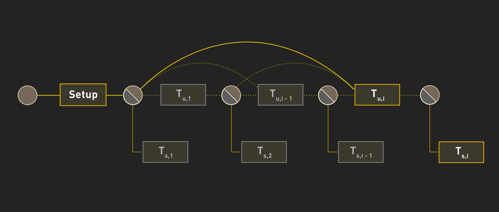
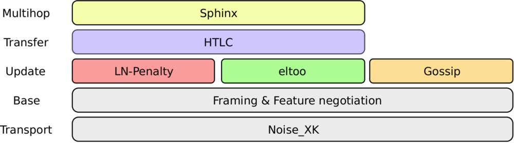

> *作者：Christian Decker*
> 
> *来源：<https://blockstream.com/2018/04/30/en-eltoo-next-lightning/>*

（编者注：原文发布于 2018 年。）

不到一年前，三支闪电网络实现团队齐心协力想为闪电网络的协议栈提出一份共同的规范。现在，这份规范和他们做出的三个实现都已稳定、可用，所以我们该继续上路了：要进一步提升协议的功能、加入新的特性、进一步简化其结构，并修补其缺陷。

在闪电网络的起步中，最核心的创新之一便是允许双方商量通道内新状态并保证旧状态无法上链结算的链下状态更新机制。现在，我们骄傲地公开我们的最新研究论文：我们为 layer 2 协议提出了一种新的、更简洁的状态更新机制，命名为 ”[eltoo](https://blockstream.com/eltoo.pdf)“。

## eltoo 的工作原理？

我们可以把链下协商理解成在一定数量的参与方之间达成合约，而结算则是将这份合约提交给法庭、由法庭来决定参与方的最终得益 —— 在我们的案例中，区块链就扮演着法庭的角色。因为所有的更新都在链下发生，我们需要一种办法来让链上的法庭在做出最终决断前听取各方的主张。在某个参与方启动合约结算程序之时，我们需要一种延迟结算时间的机制，以允许对手方可提出一个更新的状态（抗辩）。法庭必须时刻等待着新状态，直至最终时限到来，以自己所获得的最新状态完成结算。而令人惊讶的是，比特币区块链已经满足为实现这种区块链特制的 layer 2 协议所需的大多数要求了。

- 图 1. eltoo 协议运行的一个例子，展示了可以通过把更新交易重新绑定到更早的一笔交易或直接就是启动交易，来跳过中间的状态。只有最后的一笔结算交易能够上链。 -

在 eltoo 协议中，每个状态都是由一对交易来表示的：一笔更新交易（update transaction），使用合约的输出（output）并创建一个新的输出；一笔结算交易（settlement transaction），它使用更新交易的输出并根据双方一致的意见将资金分割给双方。这些输出都有一个脚本，允许双方立即附加一笔新的更新交易，或者在超出一定的时间后附加一笔结算交易。如果参与方能在超时之前对一个更新达成一致，他们就会创建一笔新的更新交易，用掉此前的输出，对相应的结算交易来说这也意味着多重支付（因为它们所用的是同样的输出），因此同步地作废掉了相应的结算交易。

（译者注：”输出“ 是比特币交易的一个概念。一个输出就代表着一定数量的比特币及其所有权状态。）

循环往复地作废旧的状态并对新的状态达成共识，构筑了由更新交易前后相接形成的一个链条，并且链条的末尾是一笔最新结算交易。不过，这也意味着它有一个重大缺陷：当我们想要结算时，就只能在区块链上重放整个交易链条。到那时我们只能在链上重新执行整个协议。

而 eltoo 的关键创新就在于，我们可以跳过中间的更新交易，直接把最后一笔更新交易与合约的创建交易（状态）连接起来。为了支持这种短路功能，我们提出了一种新的 `SIGHASH` 标签，叫 ` SIGHASH_NOINPUT`，它允许将一笔交易的输入绑定为任何带有匹配脚本的交易输出。因为此前的更新交易的所有输出脚本都与后来输入脚本相匹配，我们可以将后来的更新交易绑定到任何一笔之前的更新交易，因此可以跳过任意数量的中间更新交易。我们的论文包含了这个协议的完整建构，包括如何构建脚本的细节。

## 增强闪电网络

我们在上文提议的更新机制，允许支付通道的一个端点不断调整自己的余额，并为状态附加更加高级的结构（比如 HLTC “哈希时间锁合约”）。

闪电网络最早论文的主要贡献就是这样一种更新机制，所以我们是想用 eltoo 来替代闪电网络吗？绝对不是！

- 图 2. 闪电网络子协议示意图 -

闪电网络规范早已不是单个协议的规范，而是一整套协议的规范，组成这套协议的每个子协议都有各自的功能。eltoo 的目标不是替代整个闪电网络技术栈，而是对原始的更新机制的嵌入式替代，并且跟协议栈的其它部分也保持了后向兼容性。

与闪电网络最初论文所提议的机制（我们称为 “LN-penalty”，以惩罚为后盾的更新机制）相比，eltoo 有完全不同的权衡：LN-penalty 使用一套惩罚系统来约束参与方，eltoo 则只执行链下合约最后一个双方都同意的状态。这个差别对建立在 eltoo 之上的协议的适用性和安全性有重要的影响。

形成这种差别的部分原因是，在 eltoo 更新机制中，所有参与方共享同一组交易，而在 LN-penalty 中，为了对不同参与方的不良行为作出惩罚，必须让不同参与方不对称地持有不同的交易。这一变化消除了在闪电网络领域我们所谓的 “toxic information（垃圾信息）”。有一些信息只跟旧状态相关，但如果不保存它们我就有可能丢钱，这就是所谓的垃圾信息。不仅对手方行为不轨可能让我蒙受损失，某个节点忘了中间某笔更新交易（例如，从一个备份中恢复时）也有可能使对手方有机可乘。而在 eltoo 中，这是不可能的，因为只有双方都同意的状态才能拿去结算（即，eltoo 是没有惩罚的）。

参与者的数据管理也在新的范式下得到了简化：他们不再需要无效的状态保存哈希原像，也不再需要保存已经无效的 HTLC 脚本，因为过时状态所对应的结算交易永远无法提交给区块链。唯一需要保存的就是最新一笔更新交易，以及对应的结算交易，以及可能从这笔结算交易中支出的 HTLC 脚本。进一步地，结算也被简化了，只需要将最新的更新交易绑定到起步交易的输出，并设置超时期在结算交易广播前结束。

我们可以将更新交易的输出与 ` SIGHASH_SINGLE ` 结合起来，以支持为结算时候的更新交易附加额外的输入和输出。虽然这看起来没什么大不了的，但它让结算时候的更新交易可以附加手续费，这样我们就不必提前支付固定费用了。在当前的实现中，我们必须提前对承诺的上链费用达成一致（可能离最后结算还有好几个月呢），这迫使我们不得不去预测手续费市场的波动；用户可能会为了安全起见而多付许多。延迟了手续费的选择，我们就不必提前他以手续费了，甚至可以在手续费不够高时提高支付。

而且，得益于使用新的特性标签，节点可以在连接到对等节点时明白表示自己支不支持这个新特性，eltoo 可以增量部署到今天的网络上，无需另起炉灶。

## 闪电网络以外

作为一个通用的 Layer 2 更新机制，eltoo 也可以用在闪电网络以外任意数量的系统中。举个例子，它支持创建高达 7 方参与的链下多方合约，结合 Schnorr 签名方案，甚至支持无数个参与方。

这样的链下多方合约的例子之一是 <a href="https://www.tik.ee.ethz.ch/file/a20a865ce40d40c8f942cf206a7cba96/Scalable_Funding_Of_Blockchain_Micropayment_Networks (1).pdf">Burchert 等人</a>提出的 “通道工厂”，这是一种扩展方案，支持使用一笔链上交易为任意数量的支付通道充入资金，而且可以动态地再平衡和协商而无需动用区块链。

## 实现 eltoo 的道路

在实现 eltoo 之前，我们需要对比特币做一个微小的改动：为签名引入  ` SIGHASH_NOINPUT ` 标签。这个功能在几个月以前有关使用瞭望塔来保护闪电网络通道的讨论中提出过，但未有正式的提议。正式的提议可以在 eltoo 论文中找到。

我们希望社区考虑一下我们的方案并参与我们的讨论。我们希望大家能对使用  ` SIGHASH_NOINPUT ` 达成共识，使得它能被包含在比特币脚本功能的软分叉中。如此一来我们可以获得更可靠和简洁的闪电网络，并且这套新的更新机制也可以为其它应用所用。

（完）
