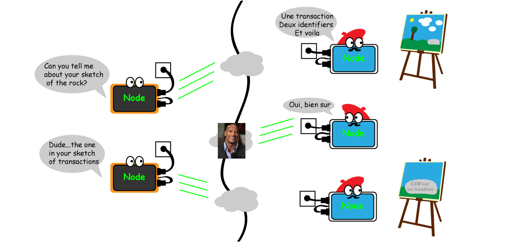

> *作者：Sam Wouters*
> 
> *来源：<https://medium.com/@SDWouters/erlay-an-awesome-performance-improvement-to-the-bitcoin-network-f59d757b2d14>*

我撰写这篇科普文，是因为我相信 Erlay 是比特币目前为止最重要的性能升级之一。

Erlay 将通过减少网络参与者之间不必要的通信，帮助比特币网络保持去中心化。

- Erlay 对比特币的影响估计 -

感谢 [Gleb Naumenko](https://github.com/naumenkogs)、[Pieter Wuille](https://github.com/sipa)、[Gregory Maxwell](https://github.com/gmaxwell)、[Sasha Fedorova](https://github.com/fedorova) 和 [Ivan Beschastnikh](https://github.com/bestchai) [提出了](https://arxiv.org/pdf/1905.10518.pdf)这个令人赞叹的升级。

我第一次知道这个想法是在 [Bitcoin Optech 周报](https://bitcoinops.org/en/newsletters/2019/06/05/)（#49）（也非常推荐大家关注他们）。非常感谢周报的作者们让懂一些技术的读者了解 Erlay。希望我可以解释变得更简单，为剩下的读者服务。

## 当前，交易是如何在网络中广播的？

这是 Bob。

Bob 希望发送一笔比特币交易，具体原因在这里并不重要，不过你可以自己猜一个。

他显然希望自己的交易能尽快打包到比特币链上。要实现这个目的，肯定比特币网络中越多节点知道 Bob 的钱包发起了交易越好。这能提高他的交易在创建后被打包到下一个区块中的概率（而区块平均而言每 10 分钟出现一个）。

因为 Bob 的兴趣在别的地方，所以他没有自己的比特币节点。相反，他要信任 Alice（这笔交易的收款方）的节点会广播他的交易。

- Bob 知道即使使用 Alice 的节点，Alice 也没法偷走他的钱 -

Alice 的节点先检查 Bob 的交易，看看是不是 Bob 的钱包签名了这笔交易。

她还会检查 Bob 之前有没有花过同一笔钱，办法是遍历本地存储的、尚未被花费的交易的记录，也就是所谓的 “UTXO”。

> **什么是 UTXO？**
>
> 比特币交易由输入（在交易签名者所控制的地址里的资金）和输出（接收方的地址和面额）组成。
>
> 每一个交易输出，反过来都可以成为下一笔交易的一个输入。
>
> 为了确保你没有重复花费同一笔比特币资金，网络中的节点会检查所有交易的历史，找出历史上是否有交易使用了相同的输出。
>
> 你可以想象，每次都要这样做是费时费力的。为了提高效率，节点只会遍历全部交易历史一次，然后**创建出一个还没有被用过的交易输出的列表**。
>
> 这就是所谓的 “未花费的交易输出的清单”，“未花费的交易输出” 的缩写就是 “UTXO。”
>
> 今天的比特币拥有大约 [5600 万个 UTXO](https://statoshi.info/dashboard/db/unspent-transaction-output-set)，大约要占据 3GB 的区块空间。而完整的比特币区块链大约是 220 GB，包含了 4.22 亿笔交易。
>
> 每当一笔交易成功上链的时候，收到交易数据的节点就移除被花费的 UTXO，并加入该交易所创建的新的 UTXO。

检查工作完成后，Alice 的节点会告诉其他 8 个与自己连接的节点有关 Bob 的交易的信息。

Bob 可能会盲目地相信 Alice 的节点，但 Alice 节点的对等节点可不会这样。他们也会遵循同样的步骤检查 Bob 的交易。

你可以想象，在此之后，这些被 Alice 通知的节点还会再次收到关于 Bob 的交易的信息，甚至再听到很多次，因为他们都以不同的方式连接，并不知道谁已经知道了哪些信息。

大量信息都是没有必要再传递的。虽然这样做给了比特币用户很强的信息，相信世界上所有节点都会知道自己的交易，但它给节点带来了很大的负担。

这些节点可能发送和接收了许多不必要的信息。准确点说，Erlay 的研究论文显示，**节点间全部流量的 44%** 都是这种不必要的消息！

节点会因此承担很大的压力，尤其是那些网络联通性并不好的节点；又或者，随着比特币的使用量越来越大，节点的所有者将无力承担越来越高的网费。

Erlay 协议正是为了解决这个问题而提出的。

## 如何使用 Erlay 来广播交易

在你忙着理解 UTXO 和节点流量构成时，Bob 已经从教程中学到了怎么建立自己的比特币节点。

Bob 让 Alice（的节点）成为自己的对等节点之一，并向她和其他 7 个对等节点广播自己的交易。验证完 Bob 的交易之后，Bob 的对等节点也告诉自己的其他对等节点。

- 绿线标记的是 Bob 的对等节点；这些对等节点的其他连接用蓝线标记 -

这笔交易广播到网络中之后，并不是每个节点都会收到 Bob 的交易。如果你不在某人的对等节点群组中，你就会错过它。

但不必担心，一个节点不需要期望自己会直接听到 Bob 的交易。相反，他会定期请求他的所有对等节点收到的所有交易的 *草图（sketch）*。

1. 每个对等节点都会发送一个表示自己收到的所有交易的草图，它的数据量比它所代表的所有交易要小。
2. 然后这个节点会用自己收到的交易数据生成自己的草图，跟其他对等节点的草图相比对，就像玩 “找不同” 的游戏一样。
3. 然后节点可以向他的对等节点请求本地草图中没有的交易。

草图和缺失交易的关系，就像一幅全景图（包含所有交易）跟景观中的一朵花或一块石头（一笔交易）的详细特写一样。

## 优点和缺点

通过对比草图来发现区别有一个缺点。整个操作会比直接让一条交易传遍整个比特币网络要慢一些（比较操作要花 2.6 秒）。

因为比特币网络产生一个新区块平均要花 10 分钟，这种降速似乎是值得的，它可以降低所有节点的沉重负担。

反过来，如果节点只需做更少的工作，人们[运行自己的节点](https://bitcoin.org/en/full-node)也会比变得更容易，然后比特币网络也可以保持去中心化。

我们不希望出现只有少数大数据中心才能循行比特币全节点的情况，因为这样就变成了我们所有人都要信任他们不会审查我们的交易。那就回到了中心化控制的金融机构的世界，而比特币正是为了取代他们而被发明的。

> **“但是如果” 环节**
>
> 你可以尝试思考 Erlay 协议会失败的情形，但论文的作者们也是这么做的。
>
> 在论文中，他们描述了比较这些草图的最佳参数，以及若是无法发现草图之间的区别，节点可以采取什么回调步骤。
>
> 作者们也测试了这套协议在一个 60000 个节点的模拟网络中的表现，以及在一个全球分布 100 个节点的实时通络中的表现。
>
> 在当前的协议中，如果节点把对等连接的数量从 8 提高到 32，他们的流量会增加 300%；但有了 Erlay 协议，就只会增加 32%。

## 那什么时候我们能看到比特币软件实现 Erlay 呢？

现在，[Erlay 的研究论文](https://arxiv.org/pdf/1905.10518.pdf)已经公开，正在接受反馈。

更正：[Erlay 的一个 BIP 草案](https://github.com/naumenkogs/bips/blob/bip-reconcil/bip-reconcil.mediawiki)已经发布（2019 年 9 月 26 日修订）。

更正 2：[一个实现已经可供审核了](https://twitter.com/tomatodread/status/1235297558995636230)！（2020 年3 月 4 日修订）

如果没有其他的研究院、测试员和开发者表示反对，[Gleb Naumenko](https://twitter.com/tomatodread) 将会撰写一个 BIP，然后开始让 Erlay 进入最流行的比特币节点软件Bitcoin Core 的工作。

Erlay 只需要 584 行代码。**它完全不需要变更比特币的底层规则**，也不会导致更新版本的软件无法与旧版本兼容，所以让它激活会比比特币曾经做过的某一些变更更简单。

希望你喜欢这篇文章，这对我来说也是一个实验。如果你喜欢，或者建议我协作其它跟比特币相关的话题，请让我知道！

（完）