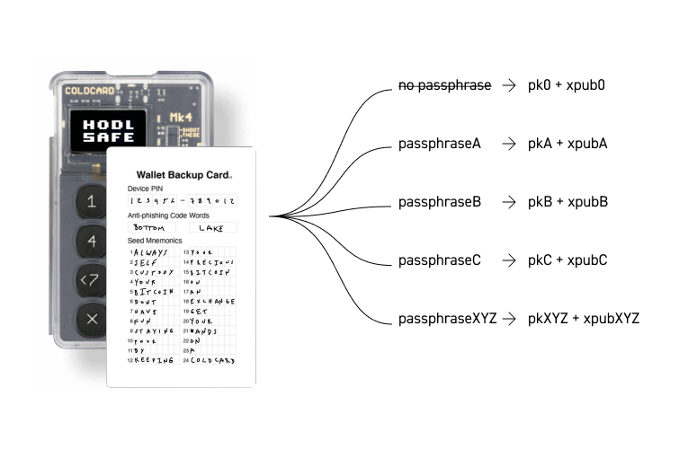
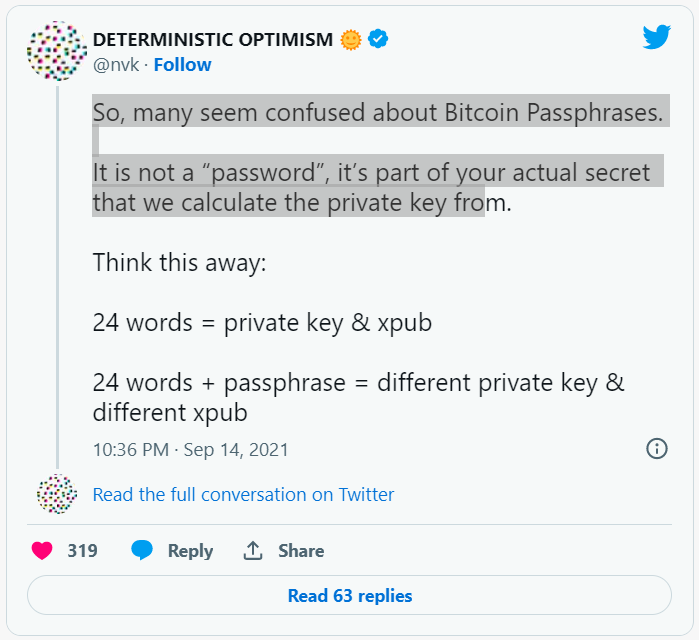

> *作者：Coinkite*
> 
> *来源：<https://blog.coinkite.com/everything-you-need-to-know-about-passphrases/>*

## 什么是私钥和钱包

在切入主题之前，我们先简单了解一下比特币私钥标准及其发展历程。私钥是一个长达 256 位的随机数字，由椭圆曲线（[secp256k1](https://en.bitcoin.it/wiki/Secp256k1)）定义。你最终会得到一串很长的数字（64 个十六进制数字）。还有别样的私钥格式，比如 WIF 和 WIF-Compressed。

为便于阅读，我们使用 Base58 编码来缩短由数字和字母组成的字符串的长度，并去掉肉眼容易混淆的字母和数字。

你可以使用上述任意一种格式来表示你的私钥。 但是，涉及到钱包时，它们各自生成和表示的公钥和地址迥然相异：

### 非确定性（随机）钱包

最初，钱包会随机生成几个私钥，每个私钥各对应一个公开地址。你可以将每个地址/私钥都用上一遍，还可以根据需要生成新的私钥和地址。但是，你必须备份每个私钥，否则就有可能失去私钥所关联的比特币。因此，人们倾向于重复使用同一个地址，尽量减少使用比特币的麻烦，但是这会带来隐私问题。Bitcoin Core 虽然提供这类钱包，但是我并不推荐，因为现在有更好的选择。这类钱包也叫作 0 型非确定性钱包。

### 确定性（种子）钱包

这类钱包可以让你通过唯一的（私钥）备份派生出多个私钥，每个私钥各对应一个比特币地址。这就意味着，无论你的钱包（设备）出于什么原因无法再使用，只要你持有初始备份，就可以一举找回所有比特币。

### 分层确定性钱包（BIP 32/BIP 44）

由 BIP [32](https://github.com/bitcoin/bips/blob/master/bip-0032.mediawiki) 和 BIP [44](https://github.com/bitcoin/bips/blob/master/bip-0044.mediawiki) 提出的分层确定性钱包同样基于单个私钥生成多个私钥，就像上面提到的确定性钱包那样。分层确定性钱包与前述确定性钱包的区别在于，由主/父私钥生成的每个私钥都可以再生成一组私钥，以此类推。说到底，就是你有一个主/父私钥， 你可以用它生成一组子私钥，再用每个子私钥生成一组孙私钥，子子孙孙无穷尽也。

### BIP 39

无论是上文提到的哪类钱包，我们都要跟非常长的字母和数字字符串打交道，这些字符串完全超出了人的记忆和处理能力。[BIP 39](https://github.com/bitcoin/bips/blob/master/bip-0039.mediawiki) 应运而生，它提出了一种解决方案，可以将长串二进制或十六进制数字转化成更便于人类阅读和传输的东西。这是最受欢迎的私钥实现，大多数读者很可能已经体验过。

现在，你的私钥被表示为一组单词，通常从 [2048 个预定义单词](https://github.com/bitcoin/bips/blob/master/bip-0039/english.txt)中取 12 个（128 位熵）或 24 个（256 位熵）组成。

**根据 BIP 39 的定义，助记词的创建规则如下**：

1. 创建一个包含 128 到 256 位的随机序列（熵）。
2. 取这个随机序列的 SHA 256 哈希值的头几位作为校验和。
3. 将校验和添加到这个随机序列的末端。
4. 将这个随机序列按 11 位一组进行切分，分别在 2048 个预定义单词中找到对应。
5. 得到表示助记词的 12 到 24 个单词。（Antonopoulos 2017, ch.4）

## 口令短语是什么？

介绍完基本知识，现在我们可以更好地理解口令短语是什么以及它在比特币钱包中是如何运作的。

多亏 BIP 39 引入了人类可读单词来表示私钥，并且与 BIP 32 兼容。现在，我们可以使用口令短语加强对私钥的保护。

口令短语可以包含字符、单词、数字乃至空格，用于扩展我们的私钥。口令短语完全由私钥持有者决定，而非随私钥一起由钱包生成。

使用口令短语之后，你必须输入口令短语才能访问你的钱包里的比特币，因为在原有助记词上添加一个口令短语会生成一个全新的钱包。

不同于密码和 PIN，口令短语没有 “输错了” 之说。每当你输入一个不同 的口令短语，你就会得到一个新的钱包。哪怕你只改变了一个口令短语中的一个字符，比如说，将大写改为小写，或添加一个空格，你也会得到一个新的钱包。



口令短语的用途有很多，我们将在下文探索。

## 为什么要使用口令短语？

只要使用并保管得当（详见下文），你的口令短语可以帮助你更好地保护比特币。通常情况下，如果有人看见了你的助记词，就能进入你的钱包，将你的比特币转走。

如果你启用了口令短语，窃贼知道了你的助记词也没用，因为他还要再输入口令短语才能偷走你的比特币。

口令短语还有另一个妙用，就是充当威胁检测系统。你可以将一小部分比特币放入由 12 个或 24 个助记词生成的标准钱包中，同时将绝大部分比特币放入使用口令短语生成的钱包中。如果你的私钥备份泄露，你会发现标准钱包中的比特币被盗走。这时，你尚有机会创建新的钱包并备份私钥，将剩余比特币转移走。

这个威胁检测系统还可以作弃车保帅之用。如果有人试图强迫你交出自己的比特币，你只要放弃自己的标准钱包，就有希望带着你的绝大部分比特币全身而退。你甚至可以做二手准备，将一个包含了比特币的口令短语用作障眼法，以防攻击者是个技术高手。

## BIP 39 口令短语是如何运作的？

BIP 39 兼容 BIP 32。BIP 32 允许用户构建由公钥和私钥组成的复杂的树。如果你在助记词的基础上增加了一个口令短语，就得到了一个主 BIP 32 钱包私钥。

这个新钱包以扩展指纹（XFP, Extended Fingerprint）作为标识。扩展指纹是一个由字母和数字组成的短字符串。请务记下它，因为它是你检验自己是否输对口令短语的唯一手段。

## 关于使用口令短语的几点建议

### 如何添加口令短语？

在不同钱包上使用口令短语的方法各不相同。如果你使用的是 [Coldcard](https://coldcard.com/)，那就很简单了。你甚至可以直接从 BIP 39 单词表中选择单词添加，无需逐个添加字符。[欲知详情，可以阅读这篇指南。](https://coldcard.com/docs/passphrase)

### 何时使用口令短语？

如果你持有大量比特币，而你理想中的钱包设置既要比标准钱包更安全，又要比多签钱包更容易创建、操作和存储，我推荐你使用口令短语。

**如果你还是新手，最好先熟悉普通钱包**。随着你拥有比特币越来越多，对比特币的认识加深，用起比特币来也愈发得心应手，再探索这个功能才是明智之举。Coldcard 钱包的主界面上就有口令短语选项。别忘了，一旦你添加了口令短语，你就会得到一个全新的钱包，需要将你的比特币转移到这个钱包内！

### 注意事项

口令短语可以帮助你轻松提高比特币私钥的安全性。但是，如果你决定使用口令短语，请牢记以下几点注意事项：

1. 口令短语要足够长，以防被人轻松暴力破解。如果有人拿到了你的助记词，你当然不希望他们一下子就猜出你的口令短语。[欲知详情，查看这篇文章。](https://blog.trezor.io/is-your-passphrase-strong-enough-d687f44c63af)
2. **务必保护好你的口令短语。一旦你弄丢了口令短语，就有可能丢失钱包里的所有比特币。**
3. 不要将你的口令短语与你的助记词或钱包 PIN 或密码藏在同一个地方。
4. 不要告诉任何人你有口令短语（当然也有例外，比如，你可以将口令短语告诉你信任的人，这样无论你发生任何事，他们都可以轻松找回你的比特币）。

## 参考文献

Antonopoulos, Andreas M. 2017. Mastering Bitcoin: Programming the Open Blockchain. N.p.: O’Reilly.

（完）