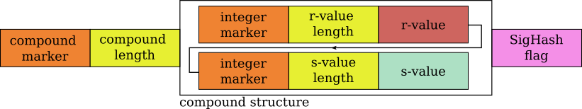
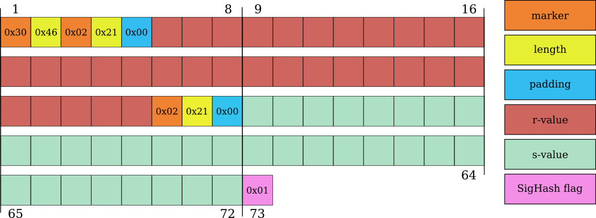
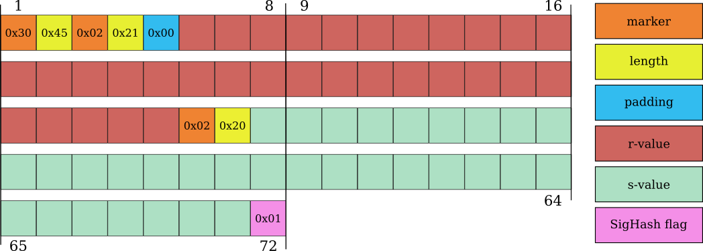
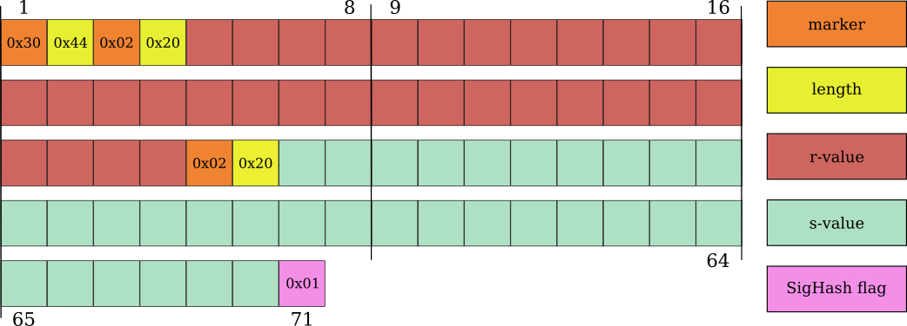
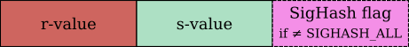
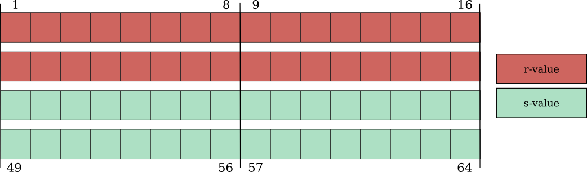

> *作者：0xB10C*
>
> *来源：<https://b10c.me/blog/006-evolution-of-the-bitcoin-signature-length/>*
>
> *本文撰写于 2020 年 11 月。*

数字签名是比特币协议的根本模块；并且区块链上存储的大部分数据都是数字签名。我们详细介绍了比特币区块链上编码的 ECDSA 签名的体积是如何逐渐减小的，以及还在提议阶段的 Schnorr 签名与当前使用的 ECDSA 签名的体积对比。

在花费非 SegWit 输出时，比特币交易中的数字签名会放在输入的 *SigScript* 字段；而在花费 SegWit 输出时，签名会放在 *Witness* 字段。无论哪一种情形，签名都由编码的 *r* 值和 *s* 值以及一个叫做 *SigHash* 的标签组成；SigHash 标签指明这个签名涵盖了交易的哪些部分。而 *r* 值和 *s* 值都是 256 比特（32 字节）的整数。

## DER 编码的 ECDSA 签名

从第一个版本开始，Bitcoin 客户端软件就依赖于 OpenSSL 来编码和验证签名。ECDSA 签名是以 [ANS.1](https://www.itu.int/rec/T-REC-X.690-201508-I/en) 编码规则所定义的 “Distinguished Encoding Rules (DER)”来编码的。虽然 DER 编码只允许确切的一种将一个签名表示为一个字节序列的方法，但 OpenSSL 库也将源自 DER 标准的变种视为有效的。当 OpenSSL 库的这一特性发生改变时，它还导致一些使用更新 OpenSSL 遍布的节点[拒绝来自使用较旧版本 OpenSSL 的节点的区块](https://lists.linuxfoundation.org/pipermail/bitcoin-dev/2015-January/007097.html)。[BIP-66](https://github.com/bitcoin/bips/blob/master/bip-0066.mediawiki) 提出了一项共识软分叉，从此只允许严格遵守 DER 编码规则的签名。

一个 DER 编码的 ECDSA 签名以一个 `0x30` 标识符开头，表示这是一个复合结构。接下来是一个表示长度的字节，包含这个结构的长度；再然后就是复合结构本身。这个复合结构包含了作为整数的 r 值和 s 值。这些数值是用整数标识符 `0x02` 开头的，然后是一个长度字节，定义相应的数值的长度。

- 一个 DER 编码的、带有 SigHash 标签的比特币签名的格式 -

虽然 ANS.1 编码要求使用带符号的整数（signed integer），但 ECDSA 中的 r 值和 s 值都是无符号的整数。在 r 值和 s 值的第一个比特不为 0 时（hen the first bit of the r- or s-values are set），这会产生问题。要解决这个问题，则需要前置一个 0x00 字节。因此，这些无符号的整数会被编码成一个带符号的正整数。第一个比特不为 0 的数值被称为 “*高数值*”，而第一个比特为 0 的数值被称为 “*低数值*”。

- 一个 73 字节、使用高数值 r 和 高数值 s 的比特币 ECDSA 签名 -

r 值和 s 值都是随机数值。当两个数值都是 *高数值*（第一个比特不为 0）时，它们都需要前置一个 0x00 字节。因为这两个额外的字节，最终编码好的 r 值和 s 值再加上 SigHash 标签会是 73 字节长。一个签名中的两个数值都需要 *高数值* 的概率是 25% 。在 2014 年初以前，可以在区块链上观察到的签名大概有 25% 是 73 字节长，50% 的是 72 字节长，还有 25% 是 71 字节长。而在 72 字节的签名中，其中一个值是 *高数值*，另一个值是 *低数值*。

从 2014 年 3 月发布的 Bitcoin Core v0.9.0 开始，带有高数值 s 的签名开始减少。这个版本包含了一项对 Bitcoin Core 签名的变更：仅创建 *低数值* s 的签名。而到 2015 年 10 月发布 Bitcoin Core [v0.10.3](https://bitcoin.org/en/release/v0.10.3#test-for-lows-signatures-before-relaying) 和 [v0.11.1](https://bitcoin.org/en/release/v0.11.1#test-for-lows-signatures-before-relaying) 时，使用 *高数值* s 的签名开始被认作是不标准的交易，以移除熔融性（malleability）界面。这禁止了使用高数值 s 的交易被转发和挖矿（译者注：如果仅仅是当成一种非标准的交易，应该是可以挖矿的）。从 2015 年 12 月开始，几乎所有出现在区块链上的交易都只使用带有 *低数值* s 的签名了。

- 一个带有高数值 r 和低数值 s 的比特币 ECDSA 签名（72 字节） -

在 2015 年 12 月到 2018 年初期间，区块链上的签名几乎分成了 72 字节和 71 字节长的两种。72 字节的签名的 s 是低数值，r 是高数值（要求一个 `0x00` 字节作为前缀）。而 71 字节长的签名中，两个数值都是低数值。

到 2017 年 8 月，隔离见证软分叉激活。隔离见证将 *SigScript* 中的内容（包括，比如说，签名）移到了 *Witness* 字段。虽然在计算交易的重量时 witness 字段中的数据可以得到折扣，它们在区块链上的体积是相同的。

- 一个 r 值和 s 值都是低数值的比特币 ECDSA 签名（71 字节） -

2018 年 10 月发行的 Bitcoin Core [v0.17.0](https://bitcoin.org/en/release/v0.17.0) 包含了对 Bitcoin Core 钱包的一个提升，从此开始仅创建 71 字节长的签名。软件会不断使用不同的 nonce 值（r 值）签名一笔交易，直到找出两个数值都是低数值的签名。这项技术也已经被其它项目（例如 [NBitcoin](https://github.com/MetacoSA/NBitcoin/pull/510) 库和 [Electrum Bitcoin Wallet](https://github.com/spesmilo/electrum/pull/5820)）采用了。

## Schnorr 签名

[BIP-340](https://github.com/bitcoin/bips/blob/master/bip-0340.mediawiki) 为比特币引入了 Schnorr 签名；而 [BIP-341](https://github.com/bitcoin/bips/blob/master/bip-0341.mediawiki) 提出了一个新的 SegWit 版本 1 输出类型，其花费规则是基于 Schnorr 签名、Taproot 和默克尔分支的。不像 ECDSA 签名，Schnorr 签名不使用 DER 编码。

- 一个比特币 Schnorr 签名的格式 -

Schnorr 签名包含 32 字节的 r 值，然后是 32 字节的 s 值。最常用的 *SigHash* 标签 `SIGHASH_ALL` 被默认采用，所以，假设使用了这个标签，就不需要显示出来。如果使用其它 SigHash 标签，则需要放在 s 值后面。使用默认的 `SIGHASH_ALL` 标签的 Schnorr 签名的长度刚好是 64 字节。而使用其它标签的则是 65 字节长。

- 使用 SIGHASH_ALL 的比特币 Schnorr 签名（64 字节） -

相比 ECDSA 签名，Schnorr 签名会短 6 到 9 个字节。这些节省来源于移除的编码负担以及默认的 SigHash 标签。当 Schnorr 签名的采用率达到 20% 的时候，假定[每天得到花费的 80 0000 个输入](https://transactionfee.info/charts/inputs-and-outputs/)只包含一个签名，那么每天可以节约 1 MB 的区块空间。

## 相关阅读

- [A Layman’s Guide to a Subset of ASN.1, BER, and DER](http://luca.ntop.org/Teaching/Appunti/asn1.html) - An RSA Laboratories Technical Note - 1993
- [Create the shortest transaction](https://blog.eternitywall.com/2017/12/12/shortest-transaction/) - Eternity Wall Blog - 2017
- [Exact probabilities of obtaining a DER encoded signature of a certain length](https://blog.eternitywall.com/content/20171212_Exact_Probabilities/) - Eternity Wall Blog