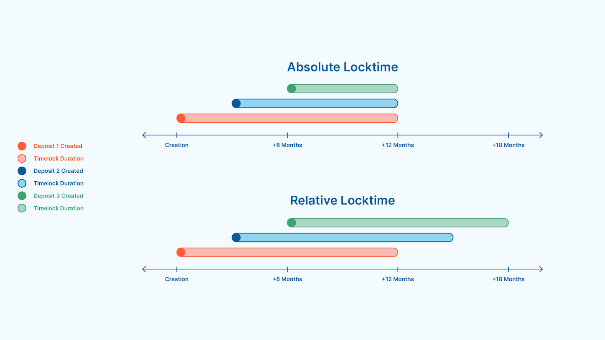

> *作者：Tom Honzik*
> 
> *来源：<https://www.unchained.com/blog/examining-the-tradeoffs-of-miniscript-timelock-wallets>*


多种比特币钱包软件和托管服务开始探索基于时间的安全模式和复原选项。这些产品激起了一些比特币持有者的兴趣，他们希望了解这背后的工作原理、确定这是不是一种保护他们的比特币储蓄的一种好选择。

在本文中，我们会解释这些保管装置要实现什么设计目标，并介绍实现这些目标的基础技术 —— 时间锁和 Miniscript 。我们会了解一些实践案例，并讨论这些钱包的取舍，帮助你在使用与否的决策上作出明智的决定。

## 什么是 “时间锁钱包”？

在本文中，“时间锁钱包” 一词指的是一种[比特币钱包](https://www.unchained.com/blog/your-bitcoin-isnt-in-your-wallet)，其中的[地址](https://www.unchained.com/blog/what-is-a-bitcoin-address)使用了 *时间锁* 作为它们的安全模式的一部分。时间锁钱包在市场营销中可能使用各种术语，比如这样的钱包提供了 “基于实践的复原密钥”、“带有时延的继承密钥”、“高级的 Miniscript 安全性”，或者其它类似词语的组合。

时间锁让时间成为了一种决定花费比特币的必要条件的因素。一个简单的例子是一个地址，它内在地防止存入其中的比特币在某个日历日期或时间点之前被花掉（也可以是阻止资金在区块链抵达某个区块高度之前被花掉）。

一个更高级的案例是一种地址，它被设计成带有一个默认的花费路径，但还有另一条花费路径，仅在经过一段时间之后才变得可用。像这样的结构，在默认花费路径不再能使用时（不论因为丢失密钥还是设备损毁），都是很有用的。地址和其中资金的主人只需等待后面那条花费路径变得可用，就可以取回资金；这条复原路径可以设计成带有更加款苏的花费要求，或者要求完全不一样的[私钥](https://www.unchained.com/blog/what-is-a-bitcoin-key)。对这种复原机制的兴趣，就是推动比特币保管市场出现时间锁钱包产品的主要催化剂。

## 时间锁钱包如何工作？

时间锁钱包是理由两个主要工具来实现的。第一个是比特币协议的时间锁功能自身，它有不同的制作方法，也各有局限性。第二个是 *Miniscript* ，一种更先进的开发工具，提供了更加安全的方式来开发复杂的花费条件，比如多条花费路径（这些花费条件就是比特币地址的前身）。接下来，我们细致第了解一下这些技术。

### 时间锁功能

有两种不同的方式可以将时间锁做进一个比特币地址。一种是 “CLTV（CheckLockTimeVerify）”，它带来的是 *绝对时间锁*，意思是这种时间锁会在一个预先指定的时间点过期（解锁），比特币进入这样的地址的时间并不影响其中时间锁的解锁时间。这种方法会给使用带有时间锁的宽松复原路径的钱包带来一个问题：随着我们逐渐接近乃至越过预定的时间点，钱包的安全模式会完全改变（译者注：即这样的时间锁将逐渐失去限制复原路径可用性的作用）。如果你希望新的存款拥有很远的未来才能使用的复原路径，你将不得不周期性地迁移到一个全新的钱包（一组新的地址，其钱包配置与原钱包配置不同），就为了使用另一个绝对时间锁。

另一种方式是 “CSV（CheckSequenceVerify）”，它会建立 *相对时间锁*，即时间锁将从每一笔[资金](https://www.unchained.com/blog/what-is-a-utxo-bitcoin)进入这样的地址的时间点开始倒计时。因此，（钱包中）每一个 UTXO 都有不同时间锁过期时间。这对于使用基于时间的复原机制的钱包来说是更好的方法，因为钱包的安全模型在时间流逝中保持恒定 —— 只需将（旧地址中的）比特币转入同一钱包的新地址中，就可以重设倒计时，而不是只能构造和备份一个全新的钱包。



<p style="text-align:center">- 一个可视案例，对比使用绝对时间锁的地址和使用相对时间锁的地址。在创造钱包时，两种时间锁都设为 12 个月长。在使用绝对时间锁的钱包中，不同地址中的时间锁会在同一时间点到期；而相对时间锁则会使每一笔存入资金拥有独立的倒计时（只是时长相同）。 -</p>


CLTV 和 CSV 的另一个重要区别是锁定时间的范围。CLTV 可以用来将比特币锁定几个世纪，意味着在设置锁定时间时，任何事物都可能产生灾难性的后果。但 CSV 的最大锁定时间要么是 65535 个区块（大概 15 个月），要么是 65535 * 512 秒（大约 13 个月）。因为 CSV 是绝大部分时间锁钱包所用的方法，这个局限性是相当重要的。

### Miniscript

比特币的共识规则，使用一种简单的、基于堆栈的编程语言，叫做 “[Script](https://learnmeabitcoin.com/technical/script/)” 来编程一笔比特币可被花费的条件。不过，对有志于开发比标准的单签名和多签名钱包更复杂花费条件的人来说，Script 用些难用。组合、验证和解释使用多个条件式花费路径的脚本，可能难以安全地实现，效率也难以保证。这就是 [BIP379](https://github.com/bitcoin/bips/blob/master/bip-0379.md) Miniscript 的动机。

“Miniscript” 使用更加有用的方式来表达脚本，使得更加复杂的花费要求可以更安全地组合及分析。虽然当前的时间锁钱包，从技术上来说只需 Script 就可以实现，但 Miniscript 铺平了道路、使它们更加实用。下面是一个例子，对比了表达相同花费条件的 Script 代码和 Miniscript 代码，可以看出形态相当不同，Miniscript 代码更为简洁。

Script：

```
<A> OP_CHECKSIG OP_IFDUP OP_NOTIF
  <B> OP_CHECKSIGVERIFY <50c300> OP_CHECKLOCKTIMEVERIFY
OP_ENDIF
```

Miniscript：

```
or_d(pk(A),and_v(v:pk(B),after(50000)))
```

（译者注：这里要额外说明的是，引入 Miniscript 并不需要改变比特币的共识规则，因为实际上，Miniscript 只是 Script 表达能力的一个子集，它只是运用特定的结构来使用 Script 的片段，使我们可以在 Miniscirpt 层面完成对代码的组合、分析和验证。也就是说，它没有改变比特币本身（实际表达花费条件的依然是 Script 代码），它改变的只是开发者的编程环境。）

## 时间锁钱包案例

我们已经介绍了时间锁钱包的基本前提、它们是如何构造的，现在，我们来看看人们曾经为之设想的几种用途。虽然可以定制化，时间锁钱包一般来说会有一个主花费路径（通常是一个多签名装置），然后是一个复原花费路径，由时间锁来限定。复原路径的想法包括递减式多签名、拓展式多签名以及替代密钥。

### 递减式多签名

递减式多签名是一种为一个[多签名钱包](https://www.unchained.com/blog/what-is-multisig)创建一个随时间解锁的、更宽松的花费路径的方法。给定一个 k-of- n 的多签名装置，递减式多签名会随时间推移而使 “k” 逐渐下降，从而更少密钥就能授权取款。比如说，你可以搭建一个钱包，其比特币控制在一个 3-of-3 的多签名装置中，但如果地址中的比特币一段时间没有移动，则可以递减为 2-of-3 的多签名装置。这也许能在丢失一个密钥的时候发挥作用。

### 拓展式多签名

拓展式多签名是另一种构造带有时间锁的复原路径的方法。给定一个 k-of-n 的多签名装置，拓展式多签名将随着时间推移逐渐提高 “n” 的值，从而额外的公钥能够提供有效的签名来帮助取出比特币。比如说，你可以搭建一个 2-of-2 的多签名装置，然后在地址中的比特币一段时间没有移动之后，开启允许一个 2-of-3 的多签名装置来取出比特币。如果最初的两个密钥的其中之一丢失了，额外的密钥可以提供更新的访问比特币的能力。

### 替代密钥

复原路径跟默认花费路径的区别可以更大 —— 使用完全不同的密钥。比如，你可以先搭建一个包含公钥 A、B、C 的 2-of-3 多签名装置，但在一个时间锁过期后，就可以用公钥 D、E、F 所组成的多签名装置来花费资金。此外，复原密钥也可以只要求公钥 D，或者任何其它你想要的结构。这个方法在遗产规划中会有作用 —— 遗嘱执行人手上的密钥要等到时间锁过期之后才会有用。

## 关于时间锁钱包的顾虑

乍看起来，随时间锁过期而启用的复原机制是非常吸引人的。但是，有一些取舍，也许不会立即显现出来，却是值得考虑的。

比如说，将一个时间锁钱包从一个软件迁移到另一个软件，就只有非常少的选项，那就意味着，钱包复原的整体难度可能更大。时间锁钱包的用户也可能会面临高得多的交易手续费，因为他们的交易的体积更大、更有可能需要在相对不理想的费率条件下移动比特币。定期转移比特币、刷新时间锁的压力，可能会让你进入艰难的密钥管理局面 —— 你必须记得移动比特币，不然安全性就要降级。接下来，我们会更细致地了解这些顾虑。

### 钱包迁移选项有限

普通的单签名和多签名钱包在比特币保管生态系统中无处不在。数十个声誉良好的钱包软件支持这些标准化的钱包类型，而且都可以互操作，所以用户可以轻松地从一个软件迁移到另一个软件。这就意味着，如果你的钱包软件界面（你查看和管理比特币余额的界面）除了问题，你只需导入你的[钱包配置信息](https://www.unchained.com/blog/bitcoin-wallet-configurations)（[中文译本](https://www.btcstudy.org/2025/07/08/bitcoin-wallet-configurations-the-architecture-required-for-bitcoin-recovery/)）到另一个接口中，就可以绕开这些故障、继续使用你的比特币。

与此同时，时间锁钱包拥有更加复杂的钱包配置信息 —— 通常以 *描述符* 格式来表示 —— 包含了关于这些时间锁和多种花费路径的 Miniscript 细节。截至本文撰写之时，很少钱包软件已经采用了导入这样的描述符的功能。如果你在某一个软件（或者协作服务）中构造了一个时间锁钱包，而你的账户出现了问题，在复原钱包时你可能只有极少数的软件选择。这样的选项确实存在（比如 Bitcoin Core），但对于不那么了解技术的用户，可能很困难。

如果描述符和 Miniscript 被更多声誉良好的钱包软件采用，缺乏迁移选项也将随着时间推移不复成为问题。另一方面，在导入一个独特深度定制的 Miniscript 钱包（比如一个时间锁钱包）时，可能也会遇到问题。理想情况下，一个钱包软件应该能够理解一个被导入的钱包的设计、并在界面中为用户展示有用的信息，比如每个 UTXO 的时间锁状态。这又要求开发者为当前绝大多数流行的钱包软件开发实质性的增强功能，因为当前，这些软件还没有设计为能够解释和显示这些信息。

### 更高的交易手续费

决定一笔比特币交易手续费的主要变量之一，就是这笔交易的数据体积。交易数据包含了关于资金转移的基本信息，但也必须包含描述被满足的花费条件的脚本，以保证交易是有效的。更复杂的花费条件就有更大的脚本，因此就倾向于有更多的交易数据、更高的手续费。

带有多个花费路径的时间锁钱包就是这样一个例子。为了研究多花费路径装置与普通的比特币钱包的差异，我们对比了一个标准的 2-of-3 多签名钱包与多种时间锁钱包（全部使用 P2WSH 的脚本类型）。一种多时间锁钱包设计成以 2-of-2 多签名为基础，在 15 个月后拓展成 2-of-3 多签名；我们发现，在从钱包种取款时，每多一个输入（多花费一个 UTXO），时间锁钱包的交易的体积（以 vB 为单位）就比标准的多签名钱包交易多出 13% 。第二种时间锁钱包设计成以 3-of-3 多签名为基础，在 15 个月后递减为一个 2-of-3 多签名。对于这种钱包，每多一个输入就会多出 38% 的数据体积。

交易数据的差异可能跟时间锁钱包构造的具体细节高度相关（利用了 taproot 的钱包会从交易数据减少种获得好处）。这种崇义可能已经足以一项 UTXO 管理决定，例如导致[建议为钱包的 UTXO 设置更高的面额下限](https://www.unchained.com/blog/utxo-management-mandatory)。除了更大的交易体积，时间锁钱包还可能有更多的在高费率环境下发起交易的需要，这是我们将要讨论的另一个顾虑。

### 定期移动比特币的压力

基于时间的复原路径的钱包，有意设计成让这些花费条件在一开始是禁用的，而在地址中的比特币静置一段时间没有移动之后，才启用 —— 并不是一开始就提供可用的另外路径。复原路径的激活提高了资金的可访问性，这在处理丢失密钥的威胁时，是非常有用的，但是，它同时也降低了应对偷盗威胁的保护。因此，一个时间锁钱包的用户，要保证复原路径永久处于时间锁的约束之下，直到真的要用到它。

在本文的开头，我们提到，绝大部分时间锁钱包都使用 CSV，它最长的时间锁也就是 15 个月。因此，为了保证时间锁不过期，最少每 15 个月要重置一次时间锁。重置 CSV 时间锁并不难，只需将比特币转移到同一钱包内的一个新的地址，但是，这样做就要触及所需的私钥、将它们从安全的存储位置取出、签名一笔或更多笔交易来移动整个钱包的余额。在时间压力之下采取这些敏感的行动，可能会产生慌张和十五。此外，如果还要考虑隐私性，可能需要更加频繁的重置交易（每个 UTXO 分别处理），来[避免影响隐私性的地址关联](https://www.unchained.com/blog/bitcoin-utxo-privacy)。

另一个重要考虑是交易手续费率的波动。交易手续费不仅取决于交易数据（如上一节所述），也取决于手续费率环境 —— 快速移动比特币的全球需求。手续费率环境可能在比特币价格大幅波动时产生无法余氯的波动。如果你设置了一个时间锁钱包，计划每 14 个月（在 15 个月的倒计时还剩一个月的时候）重置一次时间锁，你可能会发现在这最后一个月力，手续费率是非常高的。那么你就会面临一些不舒服的抉择：你可以支付额外更高的手续费（[可能是费率较低时候的几百倍](https://www.unchained.com/blog/too-many-bitcoin-utxos)），也可以等待、之网手续费率下降。如果你等了，费率却继续上升，你就会感觉自己被逼到了墙角，要么让钱包的安全性随着时间锁过期而降级，要么拿出一大笔比特币来支付手续费。

## 结论：时间锁钱包更安全吗？

利用了 Miniscript 的时间锁钱包可以为比特币资金的安全模式加入额外的复杂性。它们可以定制成实现一些巧妙的结构，但也有一些取舍。交易手续费、UTXO 管理、外部的钱包迁移选项，对于用户来说都更具挑战性。持续采取行动的模式，也不同于许多标准的多签名钱包用户的保管策略 —— 直接锁定比特币储备长达数年。

时间锁以独特的方式处理了密钥丢失和被盗的风险、预留了额外的盗窃保护，它随时间自动解除限制，以应对密钥丢失的概率。这种创造性的复杂性，是其吸引力的主要来源。然而，[标准的多签名钱包](https://www.unchained.com/blog/what-is-multisig)已经被广泛认为是对丢失和失盗符合风险的强大解决方案。使用由[密钥代理](https://www.unchained.com/blog/what-is-a-bitcoin-key-agent)持有后备密钥的[联合保管多签名](https://www.unchained.com/features/diy-vs-collaborative-multisig)钱包，功能也非常类似于拓展式多签名时间锁钱包，但在钱包迁移和及时行动上更少顾虑。因此，将时间锁钱包视为不必要的过度复杂方案，也有一些道理。

（完）