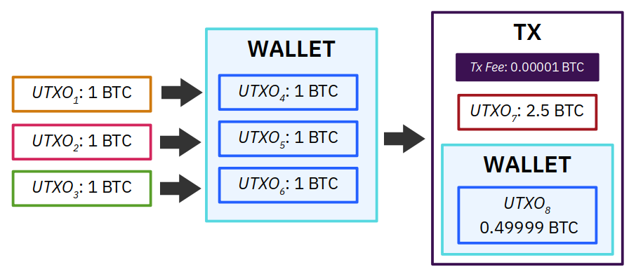
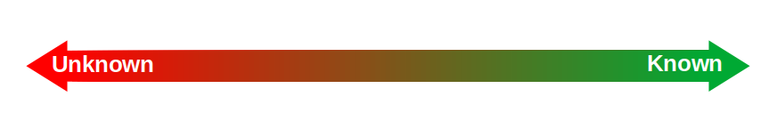
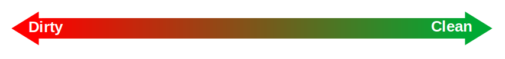
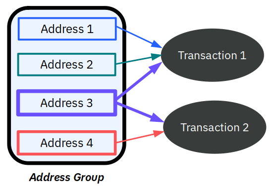
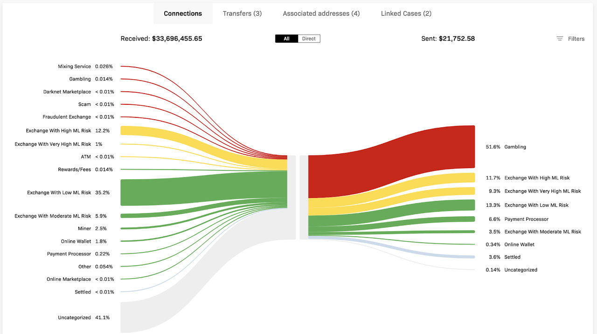
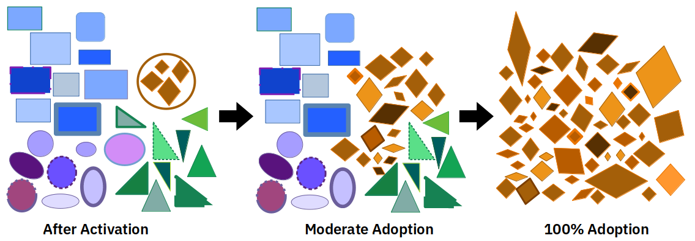
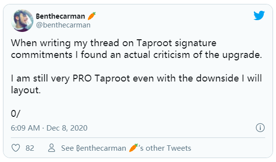
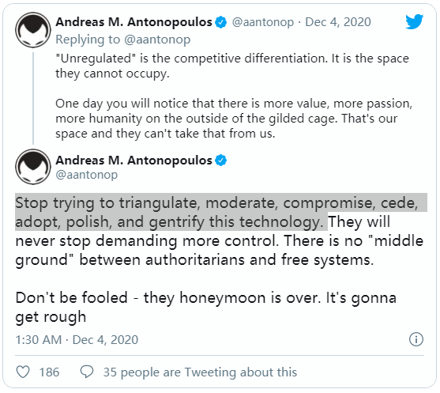

*作者：Braiins*

*来源：<https://braiins.com/blog/explain-like-im-not-a-developer-taproot-privacy>*

*译者：闵敏 & 阿剑*

本文从非技术角度详细介绍了区块链分析的运作原理，以及 Taproot 对比特币用户隐私性的影响。

就像挖矿一样，隐私性是比特币相关概念中最重要也是最难理解的一个，尤其对于那些外行人来说。目前，通过区块链分析来追踪资金流向的业务迅速增长，但是大多数比特币持有者可能还不知道这意味着什么。

随着 Taproof 激活流程迫近，我们已经做足了功课，并与隐私性和区块链分析方面的专家讨论了 Taproof 的影响。在本文中，我们将介绍我们所了解到的关于比特币隐私性和 Taproof 可扩展性的未来可能性。

## 必备知识点：UTXO

如果你曾经尝试过使用[区块浏览器](https://mempool.space/block/000000000000000000080c403ced601a992bd06b1a09f198e52cab35d66e4539)来追踪你收到的比特币之前转过几手，你可能会发现做到这点很难。究其原因：比特币更像是一种同质化的数字液体，而不是像纸钞和硬币那样的固体，这就意味着我们无法轻而易举地追踪每个单位的比特币。

比特币区块链就是未花费交易输出（Unspent Transaction Output，UTXO）的记录。一旦一笔 UTXO 成为一个交易的输入，这笔 UTXO 就不能再次使用（因为它不再是“未花费的”），但是依然可以在区块链上看到它。 比特币钱包的余额就是当前所有 UTXO 的累计值，但是余额中的每个 satoshi 实际上无法相互区分。（译者注：可以把 UTXO 理解为支票，你可以把一张支票里的钱拆成两份转到不同的地方；但是支票用过之后就会作废） 

但是，请务必注意一点：UTXO 在作为交易输出时依然是可以区分的。**换言之，一个持有 10 笔 UTXO（每个价值 1 BTC）的钱包与另一个持有 1 笔 UTXO（价值 10 BTC）的钱包是不同的，即使它们的总余额相同。**

为了说明这一点的重要性，我们先来快速浏览一个例子。假设你从 3 个不同的付款方那里分别收到 1 BTC，那么你就持有 3 笔 UTXO，总价值为 3 BTC。现在，假设你想要花费 2.5 BTC。该交易有 3 个输入（3 UTXO）和 2 个输出。其中一个输出是价值 2.5 BTC 的新 UTXO，另一个输出就是从 0.5 BTC 中扣除交易费剩下的 UTXO。第二笔 UTXO 通常被称为“找零”——就类似你在结账时收银员将剩余的钱找还给你。

- UTXO 和找零的概念示例图 -

换句话来说，一笔 UTXO 不能只花费一部分，留下剩余部分不用。相反，你要将 UTXO 的剩余部分作为另一笔 UTXO 发回给自己（或者某个别的地址）。理解了这点，我们就可以接着讨论隐私性和区块链分析了。

## 如何通过区块链分析追踪资金流向

在谈论隐私性之前，我们要先声明区块链分析本身并不是一件坏事。很多用来衡量用户采用度、投资情绪等情况的指标都是通过分析公共账本得出的。事实上，我们最近发布了一篇关于 Coin Metrics 是如何通过分析 Bitcoin 账本来预测[矿工消费行为](https://braiins.com/blog/when-and-why-bitcoin-miners-sell-btc)的文章。我们觉得 Coin Metrics 的这个操作真的很酷。

但当区块链分析被用来找出钱包地址所对应的真实身份（及其交易）时，那就一言难尽了。换言之，这是在侵犯个人的隐私性。但是，我们此处并不讨论区块链分析所涉及的道德问题。相反，我们假设隐私保护总是好的，因为这样可以增强比特币的可互换性（fungible）和抗审查性。

现在，让我们考虑几个简单的维度来衡量隐私性。首先是身份维度，即，区块链分析者对于特定钱包背后的个人或团体身份的确信程度。最左端为 0%，意味着不掌握任何关于钱包所有者的信息。最右端为 100%，意味着已经通过监管合规性（例如 KYC）或其它手段确定了钱包所有者的身份。

第二个谱系是特定 UTXO 的“干净程度”。我们称之为污染维度。最左端为“肮脏的”或“受到污染的”比特币，即，相关 UTXO 被发现卷入犯罪活动。最右端为“干净的”比特币，即，没有交易历史（例如，包含新发行的比特币的 Coinbase 交易）或位于已知合法钱包（例如，合规的交易所）中的比特币。

大多数交易和钱包都集中于这两个谱系的中心地带，而不是两端。

**在为政府或合规企业提供服务时，区块链分析公司的主要目标之一是确保其客户只与身份谱系右侧的地址交互。**通过标记出与非法活动有关的地址，区块链分析公司可以让交易所和其它服务提供商禁止用户存入脏钱。

为了实现这些目标，分析者采用的最重要的方法是启发式[聚类分析](https://golden.com/wiki/Clustering)（heuristic clustering）。这个技术的目的是，找出数据模式并排列数据点，以便将这些数据点划分成带有明显标记的独立群组。聚类技术通常会将特定集群中的数据点的相似度最大化，同时让每个集群的质心尽可能彼此远离（使区别尽可能明显）。

- 基本聚类示例；当然了，现代软件能够分析更加复杂的数据并识别人类所无法识别的模式 -

就区块链分析而言，有很多启发式方法可以用来分析交易，但是最突出的两种聚类方法是：

- **共同花费（又称共同输入所有权）**：找出多个 UTXO 的共同输入地址（finding common inputs for multiple UTXOs），并将这些地址关联起来，如下图所示。（译者注：关于地址，作者在此处用的表述是 “input”，我认为，仍然应该把它理解为交易的资金流向的地址，而不是资金来自的地址。因为一笔资金来自的地址只有一个，但流向的地址可以有多个，恰好，这些地址也是在交易开始处理前就指定的，所以可以叫做 input。）

 

- 参考：<a href="https://arxiv.org/pdf/2003.13399.pdf">Cryptocurrency Address Clustering and Labeling</a> -

- **一次性找零推断**：使用启发式聚类推断一个交易中的哪笔 UTXO 是找零，这样就有很大把握断定找零指向的地址与发出交易的地址属于同一个人。

每个交易所、钱包或支付服务说到底都只是软件，软件往往会形成一些聚类算法可以识别的独特模式。**因此，区块链分析可以根据共同花费、一次性找零推断以及软件所留下的其它痕迹，将钱包的潜在所有者范围缩小至较小的用户子集。**

从下方来自 Crystal Blockchain 的图片中，我们可以看到上述方式是如何用来标记 UTXO 的，从而帮助服务提供商辨别这些资金是否与非可疑活动（如交易所）或高风险活动（如勒索软件和暗网钱包）相关。

- 来源：<a href="https://crystalblockchain.com/news/automated-parsing-dark-theme-more-configurability">Crystalblockchain</a> -

再说回身份维度，可以肯定地说，上图所示的所有活动（除了未分类部分之外）都位于谱系的右侧。**虽然已分类钱包的持有者的身份不一定会被发现，但他们的活动已经被发现，暴露了很多隐私。**

如果某个钱包地址被标记为属于高风险集群（如，诈骗或暗网市场），购买该区块链分析数据的服务提供商就会审查该地址是否正在使用其服务，来满足当地法规的要求。

最后，这就引出了本文的要点 —— Taproot。

## 匿名集和 Taproot 隐私性

你可能已经听说过Taproot 可以提高比特币的隐私性。这是因为 Taproot 可以让许多不同的智能合约交易（例如，多签、开启和关闭闪电网络通道等）看起来像是简单的区块链交易。通过混淆交易的本质，Taproot 可以让这些智能合约交易隐藏在普通交易和其它伪装成普通交易的交易之中。

Taproot 不仅使交易的具体目的更加难以辨别，还可以让它们占用比之前更少的区块空间。在本文中，我们不会深入探讨 Schnorr 签名和（包含在 Taproot 升级内的） MAST，但是如果你并不了解这些，[可以点击此处，查看简单的说明](https://tara-annison.medium.com/what-are-taproot-mast-and-schnorr-signatures-b737dae20681)。

最后，让我们结合上一节中讨论的关于区块链分析的概念。我们知道分析软件会将尽可能相似的特殊钱包聚合起来创建集群（并确保不同集群之间的差异尽可能大）。这些集群就是匿名集。通常来说，匿名集越大（即，包括的地址越多），其隐私性越强。

由于区块链分析者可以使用很多启发式方法来分类 UTXO 和钱包地址，我们在考虑如何提高隐私性时必须顾及这一点。这就是 Taproof 的一个潜在弱点。

Taproot 引入了一种新的地址类型 P2TR（Pay-to-Taproot），可以轻而易举地与已有地址类型区分开来。因此，当 Taproot 被激活时，第一批用户将会与其他使用 P2TR 的用户一起进入一个很小的匿名集，因为大多数交易依然集中在其它更流行的地址类型上。

更小的匿名集会让区块链分析者更容易追踪区块链上的资金，尤其是在交易的发送方和接收方使用不同类别的地址的情况下。一个重要原因就是我们之前提到过的：大都数交易都有找零。在绝大多数情况下，接收找零的地址类型与发送找零的地址类型相同，即使地址本身不同也是如此。因此，对于分析软件来说，当其它输出都被发送到其它类型的地址时，标记出找零 UTXO 的难度相对较低。

这就好比有人在桌上的一堆纸牌中移动某张牌，你在努力盯住这张牌。这些纸牌就是 UTXO，整个一堆纸牌就是匿名集。现在，想象一下，桌上的所有纸牌 A 都是同一种颜色，并且与其它纸牌的颜色不同。在这种情况下，相比所有纸牌都是同一种颜色，追踪纸牌 A 岂不是简单得多？即使你完全跟丢了，也有 25% 的概率可以蒙对。如果所有纸牌的颜色相同，这一概率就会降低到 1.9%。

区块链分析软件实际上就是这个游戏的复杂版。在 Taproot 出现之前，智能合约交易就像是带有折痕或裂口的纸牌，很容易就能辨别。**Taproot 可以确保每张纸牌更难区分，但它同时将同一地址类型的纸牌变成与其它纸牌不同的颜色。**

初始匿名集较小是 Taproot 的一个已知缺陷。随着 Taproot 获得越来越多的采用（即，P2TR 卡牌的数量越来越多），这个缺陷将会大幅减小，甚至扭转成优势。**此外，请务必牢记，地址类型只是区块链分析中用来实现聚类的众多因素之一。从各个方面来看，Taproot 在其它因素上也有改进，或者说保持中立。**

这里有两个问题尚待讨论：

- 多高的 Taproot 匿名集接受度才能帮助用户提高隐私性？
- （如果有这样一个阈值）如何达到该阈值？

## 如何实现有意义的采用？

可以说，比特币目前的私密性不足。即使在引入 Taproot 之前，就已经有 4 种常见的地址类型（P2PKH、P2WPKH、P2SH 和 P2WSH）正在使用，还有一些不太常见的子类型会在花费智能合约 UTXO 时出现。最开始的时候，Taproof 会使情况变得更加糟糕，但它有着巨大的潜力，尤其是对于那些 UTXO 已经包含在较小匿名集中的智能合约用户来说。Taproof 可以降低开启和关闭闪电通道的成本，并实现“联合支付（co-spend）”交易，其中包括有利于增强隐私性的代币混淆器（coin mixer）。

假设未来的交易全都采用 Taproot，区块链分析的难度就会大幅提高。如果没有 Taproot，就不可能 100% 采用任何地址类型，因为至少智能合约交易与简单交易还是截然有别的。

- 早期采用者很醒目；随着匿名集增长，Taproof 用户的隐私性就会得到加强，而其它集群就会缩小 -

**当然了，保持向后兼容性（即，没有硬分叉）意味着采用的速度不会那么快，至少对于普通交易而言。**尽管如此，你也可以在支持 Taproot 的同时承认它是有缺点的。

- 在写关于 Taproot 签名承诺的推特时，我发现了针对 Taproof 升级的批评。即使存在缺点，我依然支持 Taproof。 -

我们甚至有可能永远无法达到让 Taproof 对隐私保护产生净效用的采用阈值。那么，我们如何避免这种可能性？

如果交易所大规模使用 Taproof，那会是个很好的开端。这对于交易所来说是有利的，因为他们很可能是最常使用多签交易的用户，Taproof 可以帮助它们降低多签交易的成本。如果交易所采用了 Taproof，钱包服务提供商也决定为其用户采用 Taproof 的话，单签用户从多签交易所中取款的链上交易就会变得难以区分。

这一切都要从教育开始。大多数比特币早期采用者很可能不了解或不关心地址类型以及其它技术方面。但是，我们身为早期采用者，未来比特币生态系统中的发声者，我们有责任遵循最佳实践，教育他人，并支持服务提供商来推动比特币发展。

如果 Taproot 被激活，那么从增强隐私性的角度来看，让 Taproot 得到广泛采用是很重要的。另一种可能是，P2TR 地址最终成为区块链分析者用来追踪 UTXO 的启发式方法。

隐私性只会变得越来越重要性。正如 Andreas Antonopolous 所言：“独裁主义和自由体制之间没有中间地带。”

- AA：“请别再天真地想阉割或者掩饰比特币的属性。那些人永远不会放过任何东西。独裁主义和自由体制之间没有中间地带。不要上当。甜蜜期过了，就该吃苦头了。”
 -

为了让比特币有可能成为实现金融自由的最佳工具，我们必须贡献出自己的一份力量。幸运的是，所有比特币持有者都可以使用自己的币来表示支持，这会是最强大的支持。

（完）

---

**原文链接:** https://braiins.com/blog/explain-like-im-not-a-developer-taproot-privacy
**作者:** Braiins
**翻译&校对:** 闵敏 & 阿剑
