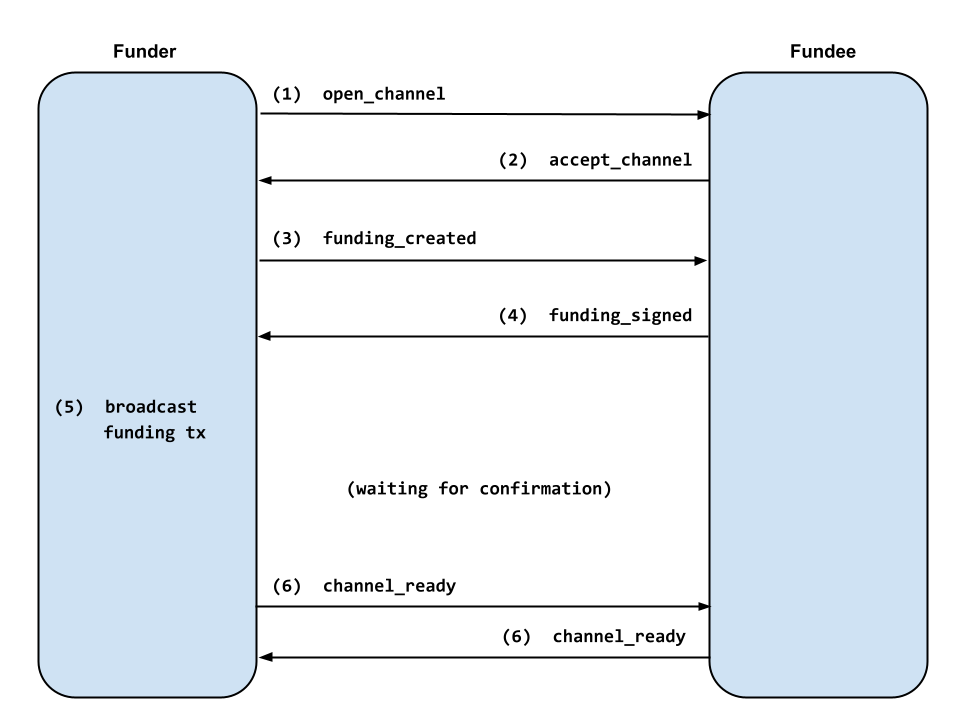
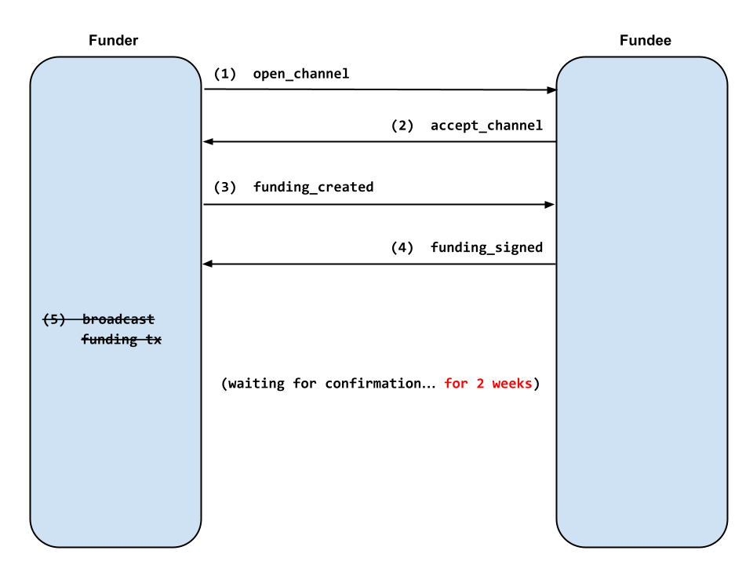

> *作者：Matt Morehouse*
> 
> *来源：<https://morehouse.github.io/lightning/fake-channel-dos/>*

下列版本号以前的闪电节点实现，易受本文所述的创建大量假通道的 DoS 攻击：

- [LND 0.16.0](https://github.com/lightningnetwork/lnd/releases/tag/v0.16.0-beta)
- [CLN 23.02](https://github.com/ElementsProject/lightning/releases/tag/v23.02)
- [eclair 0.9.0](https://github.com/ACINQ/eclair/releases/tag/v0.9.0)
- [LDK 0.0.114](https://github.com/lightningdevkit/rust-lightning/releases/tag/v0.0.114)

如果你在使用比这些要老的节点软件，你的资金可能处在风险之中！升级到至少上述版本，以保护你的节点。

## 弱点

当一个闪电节点（注资者）尝试跟另一个节点（受益者）开启通道时，他们需要走一遍下图所示的流程：

1. 注资者发送一条 `open_channel` 消息，携带相关的通道参数。
2. 受益者检查通道参数，并发送 `accept_channel` 消息。
3. 注资者创建注资交易，并发送一条 `funding_created` 消息，包含注资教育处输出点以及对承诺交易的签名。
4. 受益者验证注资者的承诺交易签名，并发送 `funding_signer` 消息，包含自己对承诺交易的签名。受益者开始在链上监控注资交易。
5. 注资者验证受益者的承诺交易签名、广播注资交易，然后等待注资交易在链上出现。
6. 一旦注资交易获得足够多的确认，双方都发送 `channel_ready` 消息。现在，支付可以通过这条通道来发送了。

*但是，如果注资者在第 5 步中不广播注资交易，那会怎么样？*

受益人希望得到入账流动性，因此愿意等待注资交易得到确认。但最终，受益人需要放弃这条一直无法确认的通道、重新拿回为之分配的资源。BOLT2 所建议的等待时间是 2106 个区块（大约是 2 周）。

**因此，在两周的时间内，受益人需要投入一些数据库存储空间、RAM 和 CPU 时间，以监控这条未确认的通道得到确认。**

## 假通道 DoS 攻击

因此，攻击者可以通过跟受害者开启虚假通道，来消耗受害者的少量节点资源。

假通道很容易创建。因为受害者没有办法验证在 `funding_created` 消息中的阻止交易输出点，攻击者甚至不需要构造一笔真实的注资交易。他们可以使用一个随时生成的注资交易 ID 并基于这个假 ID 签名一笔承诺交易。受害者的签名检查是根据由对方提供的（假）注资交易输出点的，因此会通过；然后就会欣然为假的待确认通道分配资源。

在面对上述这些旧版本的节点软件时，开启大量的假通道也很容易。一些较老的节点实现会按对等节点对待确认的通道的数量施加一个限制，但这样的限制也很容易绕过 —— 攻击者可以使用新的节点 ID 。

## DoS 的影响

在我的实验中，我可以对一个（我自己的）受害者节点创建几万条虚假通道，从而触发所有类型的不良反应。在有些情况下，节点的资金将处在被盗的风险中，因为受害者节点无法响应通道欺诈行为。

以下是 DoS 对各种节点实现的影响的报告。

### LND

在几天的实验中，LND 的性能急剧下降，以至于它停止响应来自其对等节点的请求，也不再响应 CLI 的请求。性能降级一直持续到重启，即使攻击者已经不再主动发起 DoS 攻击。

我没有将 DoS 实验一直做下去，但很有可能，只需持续足够长的时间，受害者节点就会变成无法响应，从而偷盗其资金也不会遭遇惩罚。

### CLN

在一天的 DoS 攻击之后，CLN 的 `connectd` 后台程序就完全崩溃掉了，无法再响应来自其它节点的连接请求。CLN 的大部分其它功能还能继续工作，因此资金不会处在风险之中，因为 `lightningd` 后台程序没有被 DoS 攻击阻塞。

### eclair

在一条的 DoS 攻击之后，eclair OOM 崩溃了。此后，每次 eclair 重启时，它的 OOM 都会在 30 分钟内崩溃，即使攻击者不再主动发起 DoS 攻击。资金显然处在风险之中，因为一个离线的节点无法捕捉到欺诈的尝试。

### LDK

因为 LDK 是一个库，不是一个完整的代码实现，所以实验起来更棘手。我做实验的时候还没有 LDK Node，但我发现了 [ldk-sample](https://github.com/lightningdevkit/ldk-sample) 节点，并且为了实验，将它修改成运行在主网上。

在几个小时的 DoS 攻击中，ldk-sample 的性能急剧下降，导致它无法跟区块链保持同步。几天以后，ldk-sample 的区块链视图被固定在 144 个区块以前，使之无法响应欺诈操作。

## DoS 防御

我将这个 DoS 界面报告给了这 4 个主要的闪电节点实现，时间是在 2023 年开头。eclair 和 LDK 已经注意到了这个潜在的 DoS 界面，但还没有意识到问题的严重性。在收到我的报告的几天后，每一种闪电节点实现都开始开发防御措施，一些是公开的，也有一些是秘密的。

所有的实现现在都已经发布了防御此 DoS 攻击的版本。如果你对防御措施的技术细节感兴趣，可以看各个 PR 和提交的连接。

| 报告日期   | 实现   | 防御措施                                                     | 版本    |
| :--------- | :----- | :----------------------------------------------------------- | :------ |
| 2022-12-12 | LND    | 限制待确认通道的数量 [[1](https://github.com/lightningnetwork/lnd/commit/3f6315242a7ceb160c12f6997f5c020362424877)] | 0.16.0  |
| 2022-12-15 | CLN    | 重大的性能优化 [[1](https://github.com/ElementsProject/lightning/pull/5837), [2](https://github.com/ElementsProject/lightning/pull/5849)] | 23.02   |
| 2022-12-28 | eclair | 待确认通道和对等节点的数量限制 [[1](https://github.com/ACINQ/eclair/pull/2552), [2](https://github.com/ACINQ/eclair/pull/2601)] | 0.9.0   |
| 2023-01-17 | LDK    | 待确认通道和对等节点的数量限制 [[1](https://github.com/lightningdevkit/rust-lightning/pull/1988)] | 0.0.114 |

## 教训

### 使用瞭望塔

如果你的闪电节点因为 DoS 攻击而不能动弹，在其它措施都失效时，瞭望塔可以帮助保护你的资金。如果你有大量资金处于风险之中，在专门的机器上运行一个私人的瞭望塔是一种便宜的保险。

### 多线程

在上述节点实现的较老版本中，CLN 是唯一一种可以清楚地在 DoS 攻击下保护用户资金的实现，因为 CLN 实际上是以多个单独的后台进程来运行的。在 DoS 攻击中，负责处理对等节点连接的 `connectd` 后台被锁住了，但负责监控区块链的 `lightningd` 后台不受影响。

总的来说，多线程架构提供了一些针对 DoS 的保护措施，因为一个线程的降速甚至崩溃并不自动导致别的线程都崩溃。因此，其它实现可能会考虑将自己的实现分切为多线程。在被攻击的时候，CLN 也可以通过尝试重启可被 DoS 攻击的子后台（比如 `connectd` 和 `gossipd`），而无需让整个节点宕机，从而进一步提高强度。

### 需要更多的安全审计

我在去年发现了这个 DoS 节点。我一直在审核 “双向注资” 协议，并发现了一种涉及假的双向注资通道的[折磨攻击](https://github.com/lightning/bolts/pull/851#discussion_r997537630)。在跟 Bastien Teinturier 讨论了这种攻击之后，我开始意识到，类似的攻击也会影响单向注资协议。

但我说服我自己，这么简单的攻击肯定已经有防御措施了。就这么过了几个月，直到我开始学习各个实现的注资协议代码，然后我意识到没有防护措施。

事实上，自从闪电网络开发以来，这种攻击就从没被注意到；这应该让每个人感到惊悚。如果像我一样的新手都可以在几个月内发现一种漏洞，那么闪电网络中可能有许多其它漏洞还未被发现和利用。

很长一段时间以来，安全性和强度似乎已经不再是节点实现的第一优先级，有些实现甚至直到 6 ~ 10 个月以前才开始拥有安全策略（security policies） [[1](https://github.com/lightningnetwork/lnd/commit/609cc8b883c7e6186e447e8d7e6349688d78d4fd), [2](https://github.com/ElementsProject/lightning/commit/e29fd2a8e26d655a7fb0f8b1c18092c2cdd787da)]。每个人都想要新的特性：双向注资通道、taproot 通道、通道拼接、BOLT12，等等。这些东西是很重要。但每一个都会引入更多的复杂性和潜在的攻击界面。如果我们准备让闪电网络变得更加复杂，我们也需要作出一些努力，让它变得更加安全和强健。

因为最终来说，无论特性有多么丰富、多么易于使用，如果不能保证用户的资金安全，闪电网络就什么也不是。

（完）