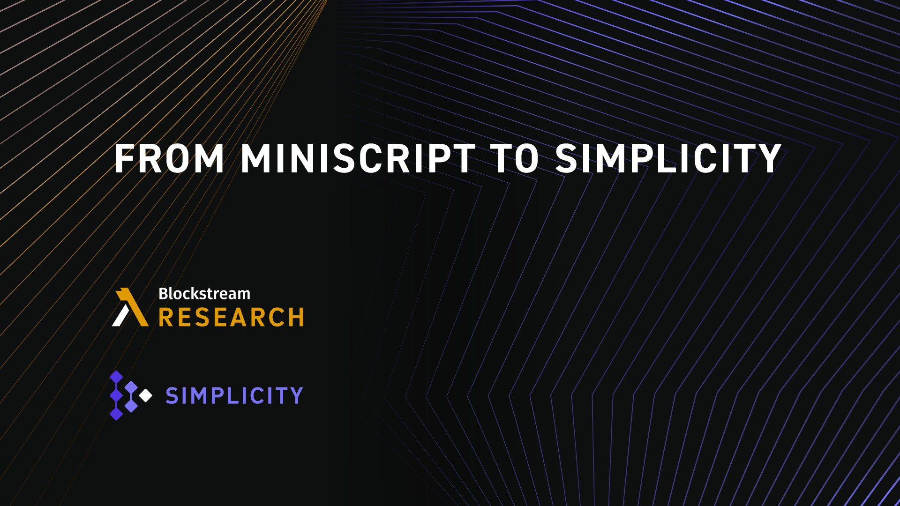
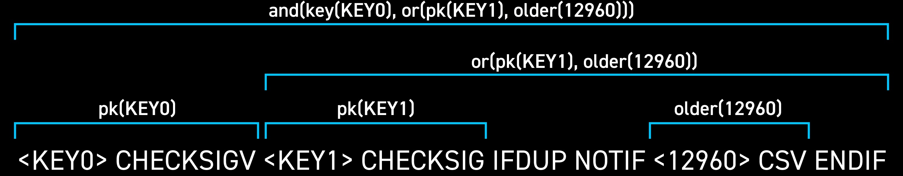
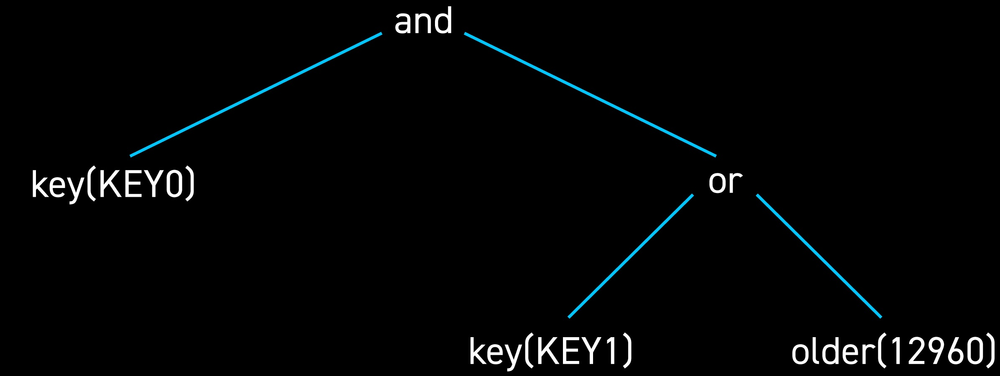

> *作者：Christian Lewe*
> 
> *来源：<https://blog.blockstream.com/from-miniscript-to-simplicity/>*

比特币是由计算机程序控制的，这些程序通过提供有效的见证数据换取资金解锁 。比特币脚本则编码了决定什么见证数据有效的花费条件。每笔交易都依赖这个机制。因此，确保这个机制良好运作就是确保交易有效完成。我们如何确保这些程序是正确的，尤其是那些编码了复杂花费条件的程序？我们是如何追踪这种复杂性的？像 [Miniscript](https://github.com/rust-bitcoin/rust-miniscript) 这样的树形程序可以解决这个问题。

树是一组由边连接的节点的集合，它是最基础的数据结构之一。每个节点可能会连接 0 个或以上的子节点，但是只会连接一个父节点。每棵“树”都是从一个没有父节点的特殊根节点“生长”起来的。因此，我们可以选择任意一个节点看它的后代：那就是一棵更小的树！一棵树由很多棵较小的树通过递归方式组成。这就意味着，对于那些可以用树表示的数据，我们可以通过递归算法处理它，将它一点一点分解。对于我们来说，这会让数据分析变得更容易。

## 寻找比特币中的树

Miniscript 是比特币脚本的一个子集。它在脚本上加了一个树结构来标识脚本各个部分的功能。一些部分要求签名，一些部分要求哈希原像，一些部分执行时间锁，还有一些部分结合起来组成更大的条件。透过树结构，我们可以清楚地了解脚本的含义。每个部分所扮演的角色都可以从树中看出来。

- 上图是一个比特币脚本以及位于该脚本“之上”的 Miniscript 树结构的示例 -

事实证明，树结构确实非常有用：我们可以沿着树静态分析和归纳证明脚本的属性。我们可以轻而易举地显示一个脚本承认或拒绝某个见证，产生了某笔费用，或在执行过程中达到资源上限。我们甚至可以将两个脚本合二为一，从而编码两者的结合体。通过这个工具包，我们可以编码复杂的花费条件，同时相信由此产生的脚本是正确的。

原始的 Bitcoin Script 不具备上述便利性，因此使用起来麻烦得多。一段脚本的含义通过 C++ 实现进行隐式定义。一般来说，这类脚本缺少一个清晰的结构，很难进行推理。此外，Bitcoin Script 本身甚至无法表达像乘法和字符拼接这样的基础操作。这些阻碍使得我们很难随心所欲地编写花费条件。

通过将树结构引入脚本，Miniscript 改进了 Bitcoin Script 的核心功能。为此，我们在 Miniscript 中只包含编码了密钥、哈希值和时间锁的、表现良好的小型脚本，不包含其它用途的外来脚本。由于 Miniscript 归根结底是带有结构的比特币脚本，你无需软分叉就可以使用它。只有想要使用该结构的钱包和其它软件才需要通过更新来支持它。

## 打破边界

我们如何在保留 Miniscript 的有用属性的基础上更进一步？我们如何让这个系统变得更强大，同时保留其结构？抱着这些想法，我们从头创建了一种全新的区块链语言 [Simplicity](https://www.youtube.com/watch?v=n4iLNNF3sU0)，作为 Bitcoin Script 的替代选择。

[Simplicity](https://github.com/ElementsProject/simplicity) 程序是树：根节点代表整个程序，每个节点执行一部分计算。具体来说，父节点可以访问子节点的计算并根据某个函数聚合子节点的计算结果。这个过程从叶节点开始，先由叶节点返回公钥和见证数据等常数值，然后自上而下聚合，直至在根节点计算出总的结果。

与上述比特币脚本对应的 Simplicity 程序如上图所示。请注意它的结构与 Miniscript 的树结构相同。真正的 Simplicity 程序包更多内容（and、or、key 和 older 均由叫作组合子（combinators）的较小程序段组成），忽略了一些细节的 Simplicity 和 Miniscript 看起来差不多。

Simplicity 具有通用性，可以计算任意布尔函数。每个布尔函数都可以被视为一个接受或拒绝见证的花费条件。Simplicity 可以实现限制条款（covenants）、委托、零知识证明等等。虽然如此强大的表达能力令人望而生畏，但是我们可以检查程序的正确性。Simplicity 的语法是显式的，因此程序的功能一目了然。不会出现令人讨厌的意外。另外，树结构让静态分析和证明属性变得更容易。我们可以证明某个程序不仅执行成本低，而且正确编码了某个花费条件。我们使用的程序包虽然与 Miniscript 的相同，但是适用于更多程序。

不同于 Miniscript，Simplicity 需要软分叉才能在比特币上使用。它可以继 Bitcoin Script (Miniscript) 称为一种新型的 Taproot 叶节点。下一步是先在 Elements（一个开源平台，[Liquid](https://blockstream.com/liquid/) 就是在这个平台上构建的）上实现 Simplicity 以证明 Simplicity 可以应用于比特币。这也会影响到最终的语言设计。

## 连接两种语言

我们正在搭建一座连接 Miniscript 和 Simplicity 的“桥”。Miniscript 的树结构在 Simplicity 中复制起来很容易，因此我们可以将比特币脚本转化成 Simplicity 程序，将 Miniscript 变成 Simplicity 的一个子集。你可以使用现有的脚本生成程序，检查程序和脚本在语法上是否等价，然后改进你的程序，表达超出 Miniscript 能力范围的内容。对于熟悉 Miniscript 的人来说，本文是一篇很棒的 Simplicity 入门介绍。在下一篇文章中，我们将详细介绍如何连接 Miniscript 和 Simplicity。

## 树形结构引领未来

像 Miniscript 这样的树形程序很容易阅读和分析。有大量工具作用于这些程序，帮助我们追踪其正确性。Simplicity 踩在 Miniscript 的肩膀上，使用树形结构实现任意计算。得益于树形结构，Simplicity 比 Miniscript 强大得多，但是性能依然良好。Simplicity 继承了 Miniscript 的优点，在享受树形结构优点的同时支持任意计算。

树形结构是未来的发展方向。我们正在稳步推动 Simplicity 成为现实。利用“桥”将 Miniscript 转化成 Simplicity 是一个良好的开始。关于“桥”的使用方式，请关注我们后续的文章。

（完）