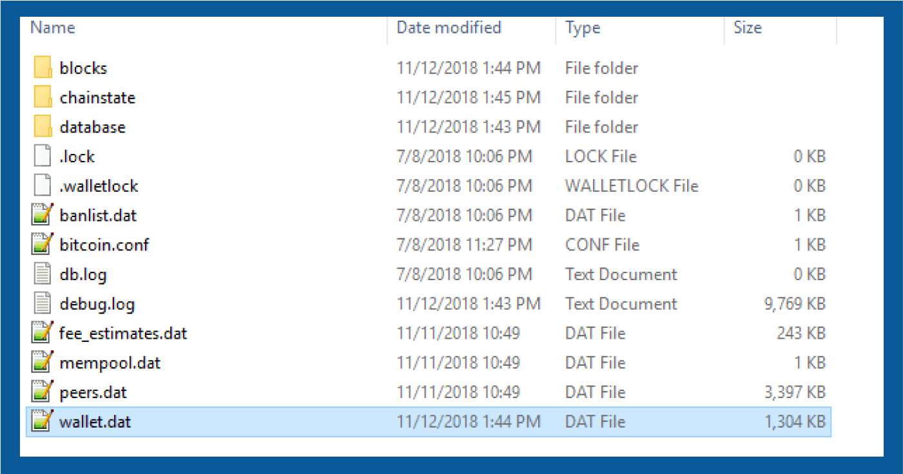
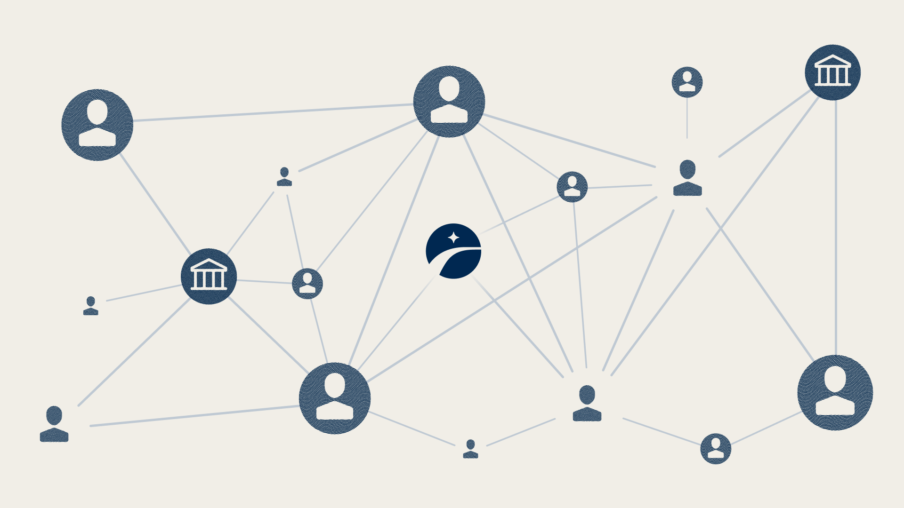
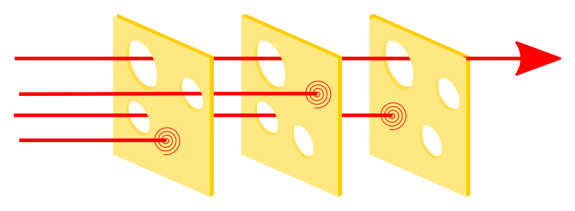
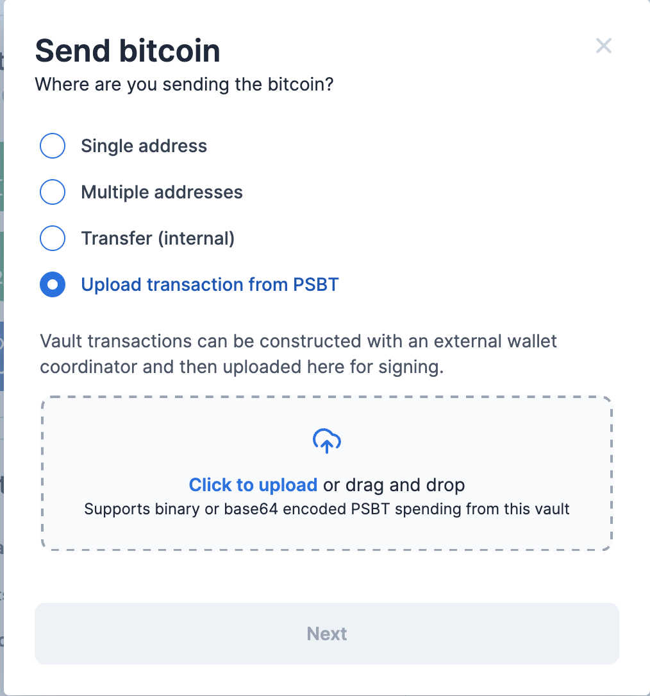

> *作者：Buck Perley*
> 
> *来源：<https://www.unchained.com/blog/from-vaults-to-networks-rethinking-bitcoin-custody>*

在比特币世界里，我们常常认为自己正在打造一个全新的金融世界、释放可编程货币的力量。但真正观察当前建立在比特币基础上的商业，我们会不禁自问：这究竟是一场技术革命，亦或只是已有模式的演化？我想说的是，我们不该把这种可编程的、自治的货币，理解成仅仅是给我们机会在另一种资产上建立完全一样的商业模式。

真正的技术革命，发生在人们和企业开始创造新的习惯、以全新的方式运用这种技术的时候。打造比特币原生的[基础设施](https://x.com/RyanTheGentry/status/2014007727891083320)，意味着要提高新的办法，让客户可以利用金融服务。这反过来意味着，你要创造的不仅是新的经济活动（全新的业务），还应该是以往甚至无法想象的业务和商业关系。

## 密钥的演化

为了捕捉这些可能性，我们先从密钥的演化讲起。

最开始的时候，比特币钱包是一些毫无关联的公私钥对 …… 用起来就是不方便。很难备份，也很难复原。你只能直接访问这些原始数据，无法以可编程的方式与它们打交道。

（译者注：作者这里指的是 Bitcoin/Bitcoin Core 软件最早的钱包实现方式 —— 以一个 `wallet.dat` 文件，包含许多毫无关联的公私钥对。这一模式也被称为 “keypool（密钥池）”。）

后来，出现了 “确定性层级式钱包（[HD Wallets](https://www.unchained.com/blog/bitcoin-derivation-paths?_gl=1*1ezop2q*_gcl_au*MjAxNjk5MzYyNi4xNzcyNzQyMDMxLjEwMTE2MjE0NTYuMTc3MzM1MTIyNy4xNzczMzUxMjc4*_ga*MTk1Nzc2MzAzOS4xNzA3OTI5MzY5*_ga_N2E2DZCQWE*czE3NzMzNTEwNDgkbzI1MSRnMSR0MTc3MzM1MTI4NCRqNTAkbDEkaDc3MTMyMjg4Ng..)）” 和 “扩展公钥（xpub）”，在一段时间内，算起来不错。用人类可以直接阅读的词组作为钱包的备份，从此成为可能。你可以将需要安全保管的信息（私钥）隔离在专门的地方，并且，一定程度上允许公开的数据（公钥），也变得更容易迁移。计算机代码也可以用更有创意的方式，跟密钥打交道。

（译者注：在 HD 钱包中，钱包内的私钥都是从同一个秘密种子确定地派生而来，所以只需要备份这个秘密种子。一个拓展公钥可以生成一组公钥，进而形成一组地址。）

[P2SH](https://www.unchained.com/blog/bitcoin-address-types-compared?_gl=1*1dkphfn*_gcl_au*MjAxNjk5MzYyNi4xNzcyNzQyMDMxLjEwMTE2MjE0NTYuMTc3MzM1MTIyNy4xNzczMzUxODQx*_ga*MTk1Nzc2MzAzOS4xNzA3OTI5MzY5*_ga_N2E2DZCQWE*czE3NzMzNTEwNDgkbzI1MSRnMSR0MTc3MzM1MTg0NSRqMjMkbDEkaDc3MTMyMjg4Ng..)（支付到脚本哈希值）地址，给了我们与密钥互动的新方法，其中最重要的就是 “多签名”。在 HD 钱包的基础上， 我们形成了[新的心智模型](https://www.unchained.com/features/the-braid-model)来理解多个密钥的交叉作用，从而创造出逻辑更加复杂的钱包。

最新一代的行业标准，比如 [miniscript](https://www.unchained.com/blog/examining-the-tradeoffs-of-miniscript-timelock-wallets) 和 “描述符”， 以更加稳健的方式帮助解锁了比特币脚本先要[操作码](https://en.bitcoin.it/wiki/Script)的力量，又让更加复杂的密钥间关系成为可能，比如说，不仅包括种子，还包括时间因素。

随着我们对保护比特币的 公钥/私钥 的理解发生变化，自然而然地，我们对如何利用这些技术来保管比特币的期待，也一并改变。

## 保管模式的演化

在最开始，所有东西都是自己动手的，而且有一段时间，情况非常理想。这曾经是，现在也依然是最高级别的监护形式。但是，力量伴随着责任。如果你所有的比特币都由一个 `wallet.dat` 文件保护，你就要自己负责保护这份数据的安全。确实，这就没有人能没收你的比特币了（除非拷打你），但也让丢失的风险升高了（我们这些[在垃圾堆里找硬盘](https://en.wikipedia.org/wiki/Bitcoin_buried_in_Newport_landfill)的人，确有经验）。

完全自己保管比特币密钥的风险和复杂性，导致了全面托管服务商的兴起。这样也容易吸引哪些不太懂技术的信任，也确实让风险大大集中在[没有经验和不负责任的人](https://en.wikipedia.org/wiki/Mt._Gox)，导致了[非常惨痛的教训](https://en.wikipedia.org/wiki/2016_Bitfinex_hack)。

但是，市场滚滚向前，随着比特币保管服务市场的演化，服务供应商也变得成熟。在大型的受监管的交易所，因为盗窃或软件错误而产生的资金损失日益罕见，许多时候，可以把你的比特币托付给他们。安全性的最佳实践因为更好的内部安全协议和面向客户的安全协议而得到提升，并且也被推向市场。消费者甚至可以购买这样的保险。

但是，在这种模式中，单点故障依然普遍存在。从互联网账户盗窃、政府没收到社会工程学攻击，江湖险恶。此外，不管一个托管商如何保护其真正的私钥数据，这种托管模式在根本上依然是单签名保管：可以说，你的登录方法和账户访问权就是私钥 —— 它完全控制着资金。

在账户控制的地址和余额之外，出现了建立在 “合作式保管” 基础上的保险柜。如果你读到了这篇文章，可能也就在使用这种保管模式。跟一个密钥代理合作，既能利用多签名钱包的安全性，又能获得由保管伙伴带来的便利性。许多商业产品的框架（也包含 Unchained 的）会让一个受信任的参与者持有少于阈值的密钥，从而建立一种实现安全性、可复原性和企业级防护的伙伴关系。

虽然账户自身不再是一种单点故障，因为登录的能力不能直接移动资金，阻止登录也不能阻止移动；但是，账户持有者自身依然是一种单点故障。社会工程学攻击依然是一种严重的威胁，就跟因为忽视密钥材料的存储而导致损失一样（这是一种在传统的托管模式中并不存在的风险）。

## 通过网络实现可以组合的安全性

当我们静态的保险柜走出、进入开放标准和网络的动态领域，合作保管模式的强大之处才会真正体现出来。一个建立在[网络](https://www.unchained.com/features/bitcoin-network-of-keys)（也就是独立而分散的节点之间的关系）之上的系统，是更容易迁移、组合的，最终来说也更健壮。

在这个语境下，所谓 “为一场技术革命开发基础设施” ，是什么意思呢？就像使用互联网进行联网通信，为个人和企业带来了全新的交互方式；在比特币的保管中，我们可以让平台不仅是资金安全的保障者，还能按你的需要启用安全性。

现在，来看看哪一些在比特币世界长期存在的技术和标准，能够帮助我们开发出这种全新的商业模式。

## 亲友：信任的力量

“信任” 常常被比特币人当成一个负面词。但它并不必然是人们想的那样。网络的其中一个强大之处在于它能带来冗余。你的安全性不再取决于你的防护装置中最薄弱的环节。当你通过建立密钥持有者的网络来利用信任，因为这些密钥持有者各有安全防护装置，风险就被分散、安全性会倍增。

[接入](https://help.unchained.com/what-is-a-connection)一个[保管密钥的网络](https://www.unchained.com/features/bitcoin-network-of-keys)，你就可以消除存在于账户持有者层面的风险。认为自己可能遭遇社会工程学攻击的人，可以添加一个家庭成员（或者可靠的密友）作为其中一个密钥持有人。家庭成员的安全性可能不像一家保管了价值数十亿美元的比特币的企业那么强，而且，需要对这个人有一定程度的信任，但在一个 2-of-3 的安排中，需要同时攻克多个点才能形成一次成功的攻击。由于社会工程学攻击通常大大依赖于[人为制造的紧张感](https://proton.me/blog/what-is-pretexting)或者[精心打造的长期信任](https://en.wikipedia.org/wiki/Pig_butchering_scam)，想要同时在多个人、多种社会背景下实施，难度会上升一个量级。

也许更加重要的是，从这种网络的视角来观察比特币的保管，让我们可以全面反思现有的商业模式、以及如何打造一种可以利用网络的平台。 设想有一种[建议用途的慈善基金（DAF）](https://www.unchained.com/donor-advised-funds) ，你不是直接信任他们会妥善使用你的资金，而是加入一个网络、公开你的公钥，以帮助分发资金，不仅可以作出慈善捐赠，还能支付各种费用。这个网络让你成为一个主动的成员，而不是你的捐赠的被动观察者。

## 适合你的安全需要的灵活阈值

通过可组合性来实现安全性不仅仅跟你的网络中有 “谁” 有关，还跟你的网络的形状有关。在设计多签名钱包的阈值时，“少” 常常胜过 “多”。在大多数情况下，[2-of-3 阈值就足够了](https://www.unchained.com/blog/collaborative-multisig-quorum-options)，而[多个代理分享密钥](https://www.unchained.com/blog/connections)可以让这种模式更加安全。不管，也有另外一些场景，别的阈值设置是更合理的。

我们可以将这种权衡视为在 “访问权自治”（可以 独立移动资金）和 “代理人容错”（一个密钥代理人可以独自行动）之间作出取舍。有时候，一种阈值设置既有访问权自治，又有代理人容错，比如 2-of-4 阈值，你可以无需第三方的协助、独立复原资金，但密钥代理人合作也能复原出资金；这种模式也有它的好处。

## 可对接的标准的力量

与传统的银行系统不同，比特币原生的金融服务意味着在开放的标准和开源代码上开发一个平台。平台不该要求你进入他们圈起来的花园，因为你要使用的资金属于你自己。你跟资金的交互方式越是容易移植，你的网络就可以越广大、越健壮，激励因素也越兼容。

一个例子是在 “[地址描述符](https://www.unchained.com/blog/unchained-2024-open-source)” 这样的标准上开发，这让用户可以随时迁移到使用相同标准的软件上。能够跟自己的资金交互、无需进入某个平台圈起来的领域，意味着你可以：

- 在你自己的节点上管理自己的钱包
- 与从未在你所在平台上建立过账户的密钥持有人合作
- 直接跟你的钱包交互，无需经过带有网关的 API（应用程序接口）
- 利用密钥网络的安全性，但不会绑定在主观色彩浓烈、缺乏功能的使用体验
- 允许其他企业也[免信任地加入密钥网络](https://blog.zaprite.com/how-to-connect-an-unchained-vault-to-zaprite/)

[PSBT](https://github.com/bitcoin/bips/blob/master/bip-0370.mediawiki)（格式），全称为 “部分签名的比特币交易”，就是一个例子。如果交易的数据（即交易的输入、 输出，还有签名）可以使用一种公开的序列化标准来传输，而不是依赖于专有的 API，它就进一步拓宽了你可以在比特币保管中运用的方法。我们最近开发的基于上传 PSBT 的交易创建功能（仅在申请后可用），意味着你不仅在任何地方都可以使用你的钱包，而且在任何地方都能制作交易。它让你在空气隔离的设备上也能创建交易和签名交易、可以通过电子邮件发送交易，甚至在别的软件中创建和签名交易后还能向基于某个平台的密钥代理网络请求签名。这些新标准给比特币带来的基础设施，就像 TCP/IP 协议给互联网带来的东西。现在我们可以有了标准化的方法，让比特币原生的企业连成网络，因此个人也可以在自己的保管装置中利用企业级的安全性。

## 新的网络，新的业务

所有这一切背后的重要思路是：一个真正比特币原生的金融服务平台是建立在开放的标准上的，而且不应该强迫用户选择某一种模式或某一个平台。真正开放的基础设施的终局状态是用户体验的百花齐放，以及以往无法存在的新型商业。

提醒一句，这并非法律建议，只是纯粹的假设：我们来设想一下没有比特币原生的解决方案就无法存在的业务和客户关系。

假设你要开一家公司，提供由客户自己控制的、比特币为支撑的意料储蓄账户（HSA）。你认为，对于你的目标客户群体（他们都不懂技术）来说，最安全的选择就是 2-of-4 阈值的多签名保管。你希望提供自主访问权，这样客户就总是能独自花费；但也想提供一种代理人容错机制，不会因为客户的私钥材料出了什么事就无法再使用自己的资金。你还希望卸除因为能够单方面转移资金而带来的负担，于是你将密钥代理人的责任与平台供应商分享（比如 Unchained，我们在 [DAF](https://help.unchained.com/how-do-i-set-up-an-unchained-vault-for-a-donor-advised-fund-daf) 中就是这样做的）。

建立这个账户的过程，需要你（作为服务供应商）向一位客户要求分享两个公钥。因为公钥本身是可以公开分享的，客户可以将实际上由其他人（或机构）控制的公钥分享给你。客户可以决定将其中一个甚至两个密钥委托给其他人，然后将拓展公钥分享给你。一旦你拿到这些公钥，你就可以独自创建这个保险柜并管理注资策略了。

但是，客户要怎么跟你的企业打交道呢？你可以将自己限制在服务供应商的平台上（比如 [unchained.com](http://unchained.com/)），但也觉得，如果能为日常使用提供更加个性化的体验，会更好。所以你要求自己信得过的 AI 编程助手，帮你开发一个能够导入 [JSON 格式的钱包配置文件](https://help.unchained.com/download-unchained-bitcoin-multisig-configuration-file)的 app 。你希望这个让这个 app 通过 RPC 连接你自己的 bitcoind 节点，而不是信任其他人的节点。它将能生成新的地址，并且可以在年末根据余额的变化生成税务报告。

当你需要跟一个没有进入这个系统的供应商合作签名的时候，该怎么办呢？这就要用到 PSBT 了。PSBT 可以由任何能够访问可用 UTXO 的人创建。你开发的系统可能要负责创建待签名的交易，甚至要收集到第一个签名，然后才能向 Unchained 系统请求另一个签名。

你还需要做很多事，比如提供别的阈值选项、不绑定设备的 xpub 分享（将客户与密钥分享进一步解耦），甚至是让企业分享公钥给客户，从而增强客户的隐私性。网络和公开标准的威力是显而易见的。 比特币彻底改变了货币权力竞争的格局。比特币用户的网络也同样可以改变我们的金融系统。

（完）