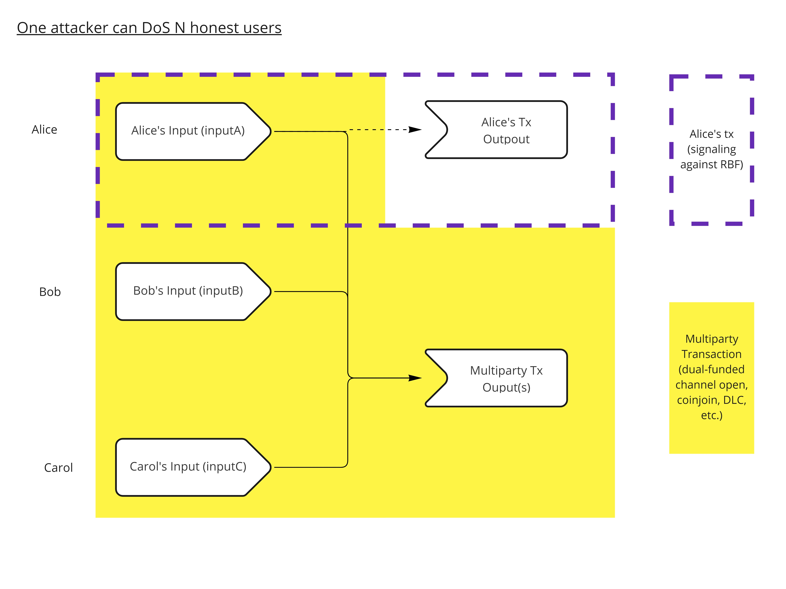
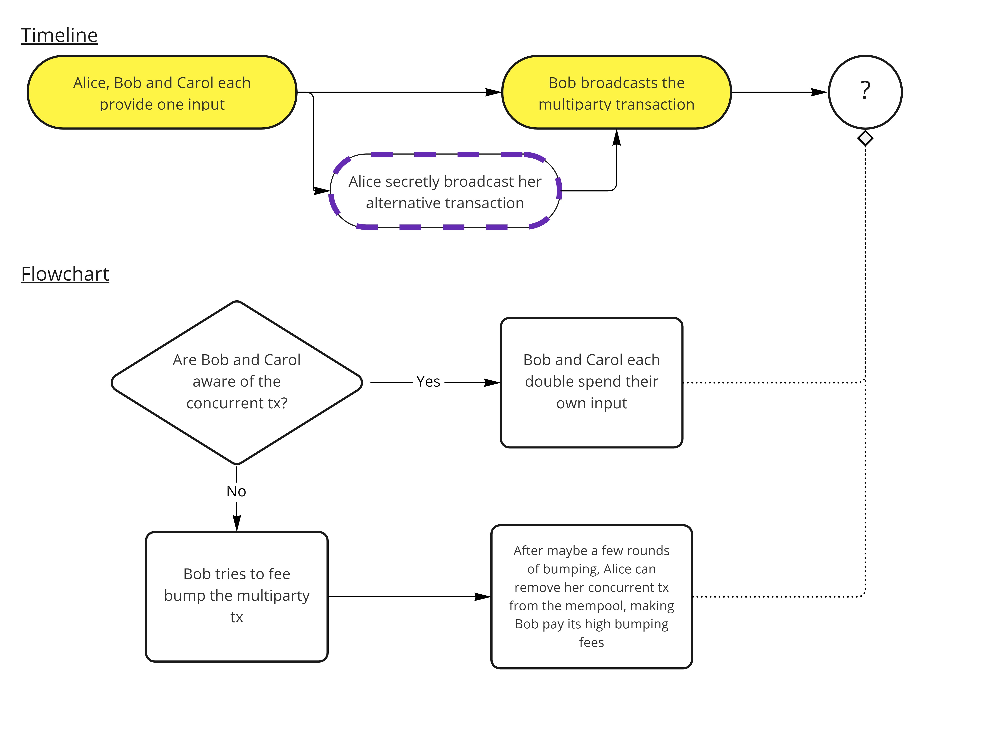

> *作者：Fanis Michalakis*
> 
> *来源：<https://fanismichalakis.fr/posts/fullrbf/>*

在用户等待自己的交易被区块确认的时候，如果能够替换自己的交易，将能极大低改善使用比特币的体验，因为用户可以解救因为手续费太低而阻塞在交易池中的交易，甚至可以 “取消” 掉自己因为失误而发送的交易。

今天我们实现这种功能的机制叫做 “选择性 RBF（Opt-in RBF）”，取决于用户的交易 *自己表明* 自己是可以被踢馆的。虽然显性地表示出来、告知大家这笔交易有没有可能被替换，有很大的好处，但它也有一些缺点，主要是对建立在比特币上、依赖于多方通过每人提供一个输入来构建交易的协议而言。这其中就包括闪电网络，coinjoin 协议和谨慎日志合约。

在今天，选择性 RBF 所允许的攻击是完全可控的。但它们也可能在未来导致严重的伤害，包括受害者的时间和金钱。因此，由 [Antoine Riard](https://github.com/ariard) 领导的工作、一种另类的交易替换方法，几天前合并到了 Bitcoin Core 中，这正是我们这篇文章要讲的东西。

## 当前的 RBF 方法

当前的 <a href="#note1" id="jump-1">1</a> 手续费替换（Replace-by-Fee，RBF）方法由 [BIP125](https://bips.xyz/125) 定义，该 BIP 详细说明了交易池中未确认的交易如何可以被自身的不同版本替换。这个 BIP 本身是很容易理解的，不过我们还是总结一下：

- 一笔交易可以通过设置一个严格低于 0xffffffff - 1 的  *nSequence* 数值 <a href="#note2" id="jump-2">2</a>，表明自己可以被替换
- 只要一笔交易中至少有一个输入表明自己可以被替换，节点就应该使用交易池中的新版本交易替换原版交易，只要新交易遵守下列规则：
  - 新交易必须跟原版交易支付至少一样多的手续费。
  - 新交易必须为自己的带宽支付额外的手续费。例如，如果全局的交易转发门槛手续费 <a href="#note3" id="jump-3">3</a> 是 1 聪/vByte，而新的交易重达 500 vByte，那么新交易的手续费至少要比原版交易高出 500 聪。这是一种防止 DoS 攻击的保护措施，如果不这么设置，攻击者就可以很容易用追加一点点手续费的替换交易来轰炸网络。
  - 跟本文无关的一些其它规则。

这种交易替换机制对所有用户和所有应用场景中一视同仁。实际上，一些用户可能依赖于准终局化（pseudo-finality）的未确认交易，比如一个商家可能想接受零确认的比特币支付，这样顾客就不必在收银台等待交易确认。其他用户可能迫切需要替换未确认交易的能力，不论是因为手续费居高不下的环境（就像我们 2017 年的时候经历的），还是因为他们所用的协议凭此可以更加好用。BIP125 扮演了两面的栅栏：依赖于零确认交易的商家可以只接受不允许替换的交易（或者为大额和小额的交易分设不同的对策），而需要替换功能的用户可以在交易中启用它。最终来说，一种新的可能性被添加到了比特币中，而且，当 “争议” 发生的时候，比如喜欢使用 RBF 的用户遇上了不想接受启用了 RBF 的交易的商家，他们可以私下讨价还价。

那么，如果 BIP125 的 RBF 方法是那么完美，为什么我们要合并一种新的机制呢？首先，被合并的这个机制，与其说是一种 “新的” 机制，不如说是原来机制的补充。其次，BIP125 的安排，尽管在当下是挺好的，但有可能给比特币尚的协议（比如闪电网络，coinjoin 交易和谨慎日志合约）引入一些可以被主动利用的攻击界面。

## RBF 攻击界面

下面这个攻击案例是由 Antoine Riard 提出的，但一笔交易由多方提出的多个输入组成时，这种攻击是可以奏效的。也就是说，会受到影响的包括双方充值的闪电网络通道（两方都提供输入），谨慎日志合约（一般是两方都提供输入）以及 coinjoin 交易（N 方都提供输入）。

以下是 Riard 自己在 GitHub 的合并请求中为这种攻击撰写的一个简短的描述：

> 一种恶意的爆破手段是，一笔多方交易的一个参与者不使用 RBF 信号，以备重复花费自己所提供的输入。如果重复花费交易在诚实的多方交易之前得到传播，诚实的多方交易就会被卡在发起者的交易池中。这时候，诚实的参与者们有两种选择：要么在协议超时后重复花费自己所提供的输入，因此在这段时间里无法动用资金；要么，为多方交易追加手续费，因为从他们的角度来看，他们可能会把交易得不到确认归因于低水平的手续费。第二种反应甚至会比第一种造成更大的破环，因为恶意参与者可能又会替换掉自己的重复花费交易，来 “解锁” 已经追加了很多手续费的多方交易。实际上，开源软件的手续费追加策略，是攻击者明确知晓的。

在 Lightning-dev 邮件组的一篇[邮件](https://lists.linuxfoundation.org/pipermail/lightning-dev/2021-May/003033.html)中，Riard 也给出了一个三方（Alice、Bob 和 Carol）参与的例子，将这种攻击讲得更加通俗。

假设 Alice、Bob 和 Carol 参与了一笔公开的、多方构造的交易，每个人都为交易贡献了一个输入。每个人都为自己的输入提供了有效的签名，另外两人都检查了 TA 的输入的有效性；最后，假设是 Bob，负责将最终的交易发到网络中，而且，如果有需要的话，也由他来负责追加手续费。

Alice 可以秘密地准备另一笔与之相冲突的交易（花费了自己为多方交易提供的输入），而且在这笔交易中她将输入的 nSequence 的值设为 0xffffffff，从而明确表示不允许替换。然后，假设 Alice 直接连接到了网络中的许多节点，并广播了自己的交易而没有通知 Bob 和 Carol，而且抢在 Bob 广播多方交易之前，那么这时候，这笔多方交易就不会被转发了，因为它在尝试花费大部分节点已经看到的一笔交易（也即 Alice 的冲突交易）的相同输入，并且那笔交易是不允许替换的。实际上，它是利用了 “*只要一笔交易中有一个输入表示了 RBF，该笔交易就可以被替换*” 的选择性 RBF 规则，因为 Alice 的冲突交易只有一个输入，而且该输入表明自己不能被替换。

- Alice 秘密地使用为多方交易提供的输入构造冲突交易，并主动发信号表示不允许替换。 -

这时候，Bob 和 Carol 只有两种解决方案：

1. 重复花费自己为多方交易提供的输入，损失金钱（额外的手续费）和时间（他们必须等待时间锁过期，这是依赖于多方交易的许多协议的常见安排）。
2. 尝试使用 “子为父偿（Child-Pays-For-Parent）” 方法为多方交易追加手续费。这可能会让他们损失更多时间和金钱，因为恶意的 Alice 可以在他们一次或多次追加手续费之后，通过替换一笔未确认的父交易（因此未违反 BIP125 的规则），从交易池中移除自己的冲突交易。一旦冲突交易从交易池中移除，多方交易就可以正常转发，最终会以膨胀的手续费挖出。这个手续费可能比实际需要的手续费要高得多。

- Alice 抢先将交易发送给大部分节点从而阻止多方交易的传播 -

从今天来看，这种攻击看起来有点像科幻小说。但在一个服务跟服务公开竞争的世界里，它可以被用来当作攻击竞争者的武器。一个闪电网路服务提供商（LSP）可以使用这种感触来陷害竞争对手，消耗他们的时间和金钱。同样地，就我所知，一个 coinjoin 协调员也会允许在它的回合启用 RBF。还必须指出的是，这种攻击是非常高效的，因为攻击者和受害者之间存在不对称性：攻击者可以较低的成本高效地 DoS 攻击任意数量的用户。

## 修复措施

正是为了防范这类攻击，Antoine Riard 提议修改 Bitcoin Core 处理未确认的交易替换的措施。

### 新办法

Anotine 提出的更新在 Bitcoin Core 中引入了一种新配置选项，叫做 ` mempoolfullrbf ` ，如果这个开关开启了，节点会允许一切交易被替换，即使交易自身并没有用设施的 nSequence 数值表态。当然，用于替换的交易依然必须遵守 BIP125 指明的其它规则（尤其是手续费）。如果足够多的节点打开了这个功能，则这种新的安排将成功保护用户免受上述[攻击](https://fanismichalakis.fr/posts/fullrbf/#a-rbf-attack-vector)，因为多方交易会被这些节点转发（假设它支付了足够高的手续费）。

当然，攻击者依然可以给自己的冲突交易设置非常高的手续费、强迫其它参与者在多方交易中支付更高的手续费。区别在于，以前攻击者可以用最低的手续费实施攻击并阻止多方交易的传播。但有了  ` mempoolfullrbf ` 之后，攻击者的处境将有很大不同，类似于手续费上涨（fee-escalation）的情形。Bob 可以很容易提高多方交易的手续费，从而符合 BIP125 的手续费要求。然后 Alice 不得不提高自己的交易的手续费，这样一直持续下去。攻击者 Alice 的风险会变得更大，因为她面临着自己的高手续费交易随时被挖出的风险，而在过去，她可以很放心，因为她只需要支付最低的手续费就可以阻止多方交易的传播。

### 代码合并

这一修改已经合并到了 Bitcoin Core 的代码中，没有太多争议，因为它没有改变 Core 的默认行为模式。实际上，新的配置选项是默认关闭的，也就是说节点会继续只接受用合适 nSequence 数值表示启用 RBF 的交易被替换。只有运营者主动改变了这个参数的节点才会在交易池中使用新规则。这也意味着，在可预见的未来，不必期待上述攻击界面有任何变化。但这个选项会待在那里，等待有需要的用户启用它。与此同时，它也允许依赖于零确认交易的用户的商家合理评估是否要调整自己的程序。

但是，Core 的这种新机制至少有一个缺点：它又带回来一些不确定性。当前，BIP125 已经被钱包和服务广泛接受了，你可以很安全地假设一笔不启用 RBF 的交易不会被替换 <a href="#note4" id="jump-4">4</a>。如果这又变成了一个每个节点自定义的事情，那就会变得有些麻烦。这可能会被理解为 Core 在反对使用零确认交易。它也又可能导致不同节点的交易池出现极大的差异，这绝对不是一件好事情。

## 摘要

Bitcoin Core 加入了一个新的定制化参数。现在，节点运营者可以决定是否允许自己交易池中的未确认交易被替换，即使这笔交易并未表示允许替换。这个新的特性将为受到特定 DoS 攻击的多方协议提供更多的保护。但其妥协之处在于，它可能会让零确认交易变得更不可以来，同时为不同节点的交易池引入更多的差异。

## 参考

你可以（也应该）从下面的资源了解更多：

- [最初的邮件（2021 年）](https://lists.linuxfoundation.org/pipermail/lightning-dev/2021-May/003033.html)
- [后续邮件](https://lists.linuxfoundation.org/pipermail/bitcoin-dev/2021-June/019074.html)
- [合并请求](https://github.com/bitcoin/bitcoin/pull/25353)

此外，你可以听听 [EDB-39](https://youtu.be/gYnBMM92dYs?t=1933)（法语的），我们讨论了这个话题。

## 脚注

1.“当前” 的意思是在大部分节点中运行的规则。Antoine Riard 提议出的这个 “新的” RBF 方法已经合并到了 Bitcoin Core 中，因此有人会说这个才是 “当前” 的情形，但它还没有被测试用途以外的节点接受。因此，为清晰起见，我们依然将选择性 RBF 策略（BIP125）指称为**当前**的安排，而将 Riard 提出的机制称为**新策略**。 <a href="#jump-1">↩</a>

2.nSequence 是一个附加到比特币交易的输入中的数字字段（每个输入都有一个 nSequence 字段，而且每个输入的数值可以各不相同），以 32 比特的形式存储，也就是说该字段的最大数值是 2^32，写成 16 进制就是 0xffffffff。这个选择是为了保持向后兼容性，因为将该字段的值设为 0xffffffff - 1 已经用在了时间锁中。因此：（1）将 nSequence 设为 0xffffffff 就表示该交易不应该被替换；（2）将 nSequence 设为 0xffffffff - 1 就表示该交易要使用时间锁，而且不应该被替换；（3）任何其余数值都表示该交易可以被替换。 <a href="#jump-2">↩</a>

3.交易转发的手续费门槛是每个节点自定义的安排。如果一笔交易的手续费率（以 聪/vByte 来表示）低于某节点的这个门槛，这个节点就不会继续转发这笔教程。虽然每个节点都是自己的王，用户可以任意为自己的节点设置门槛，软件的默认值是 1 聪/vByte，而且我还从未遇到过使用不同安排的节点。这基本上就意味着，如果一笔交易的手续费率低于 1 聪/vB，它就无法在比特币的点对点网络中转发（至少无法高效地传播）。但是，我们也一直看到低于这个费率的交易进入区块，既有可能因为这些交易是直接发送给矿工的，也有可能因为他们本身是更大的交易包的一部分。 <a href="#jump-3">↩</a>

4.修正（感谢 Stacker News 的 [@cryptocoin](https://stacker.news/cryptocoin) 指出）：至少在一些应用场景下是如此，比如在线下商店购买小额的商品和服务（举个例子，比如某人使用比特币来购买每周的生活用品）。特别容易被滥用的服务，比如交易所和 ATM，不能依赖于这种零确认假设，这也是为什么它们普遍要等待区块确认。新的完全 RBF 机制所引入的不确定性主要影响的是面对面的交易所，他们将更倾向于使用闪电网络，以便利用闪电网络的即时支付。 <a href="#jump-4">↩</a>