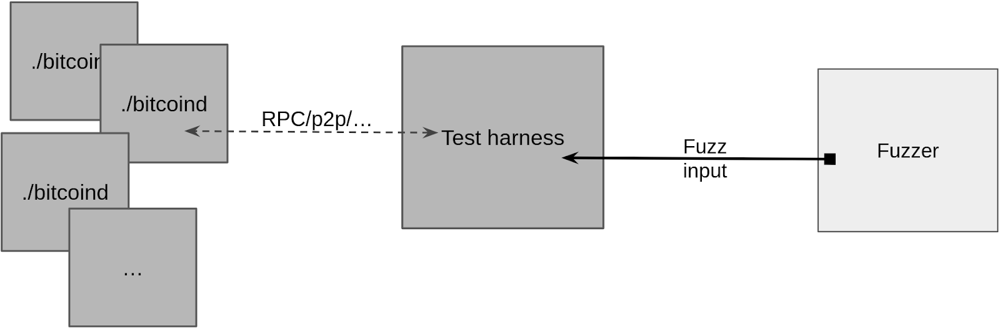

> *作者：NIKLAS GÖGGE*
> 
> *来源：<https://brink.dev/blog/2026/01/07/fuzzamoto-introduction/>*


大概一年以前，我开始开发 “[Fuzzamoto](https://github.com/dergoegge/fuzzamoto)”，这是一种比特币全节点实现的模糊测试（fuzz testing）工具。在这一系列博客中，我会分享我的经验、间接和在此期间遇到的开放问题。第一篇会介绍创建 Fuzzamato 这个项目背后的动机，并概述其设计和架构。在后续篇章中，我将深入其确定性、测试案例的生成和突变测试（mutation）、发现的 bug、对超出覆盖范围的模糊测试的反馈，等等。

## 动机

迄今为止，Bitcoin Core 是网络上受到最广泛采用的比特币协议实现，因此，它的 bug 可能会造成灾难性的后果。也正因此，Bitcoin Core 拥有非常保守的开发文化，这在一定程度上是必要的，也是一个优点（显然是它没有许多严重 bug 的一个重要原因），但也会带来挫败感、消耗感以及重大项目上的缓慢进展。

即时你只是想提升测试水平、重构现有的代码以让它变得更容易测试、添加测试项目，你也可能面对巨大的阻力。这个项目的资源是非常紧缺的，复杂的 PR 对于审核人来说根本没有吸引力，因为在初始化同步时间上加速 20%、P2P 协议的特性以及其它微小的变更只需更少的时间和经历来审核。让事情恶化的是，如果你不得不重构代码来添加更多测试，重构过程自身有可能引入 bug 。这就变成了一个鸡生蛋蛋生鸡的问题 —— 测试将降低重构的风险，可以添加测试需要重构。

这些重构通常会解耦各个模块，将代码分割到单独的模块中，或者添加接口，让模拟（mocking）能够实现，这对于 进程内的/持久模式的 模糊测试来说，通常是必要的。比如说，如果被测试的组件依赖于硬盘 I/O，模糊测试速度会较慢，拓展性也差，所以你会想要模拟它（硬盘 I/O）以加快速度。（译者注：“模拟” 在这里指的是创建虚拟对象来代替实际上的依赖项。）

在这一阶段，对 Bitcoin Core 的测试的重大提升（发现严重的既有 bug 或者防止 bug 继续扩大）依然是很有可能做到的。比如说，跟验证区块、验证交易和致密区块的 P2P 代码是没有经过模糊测试的，关于链重组和其它相似的更加内聚的代码路径也是一样。为了能够以传统的进程内控制来高效地测试这些代码，需要变更关键的代码（共识、P2P，……），同样是没有得到应有测试程度的代码。

我可以说，从我的个人经验来看，为这些重构获得支持是痛苦的，而且我已经失去维护 PR 的兴趣几个月甚至几年了；这些重构的好处似乎常常被更高的特性流失率（churn rate of features）和微小的变更盖过。（译者注：“特性流失率” 指的是一段时间里停止使用某一特性的用户的比例。）

面对这种情况，显然，Bitcoin Core 将从无需给保守的审核流程带来不必要的负担、不需要 Bitcoin Core 自身的任何变更的测试中获得好处，这样的测试能够缩小剩余的测试空白并减少未来的风险。最终的愿景是一种外部的测试工具，它尽可能以生产环境中的二进制文件为输入，以 bug 为输出。

Bitcoin Core 的功能测试（functional test）曾经是最接近这个想法的东西，因为它们生成完整的节点，并通过节点的外部接口（RPC、P2P、IPC 等等）进行测试。编写功能测试不需要重构，最多只需要添加新的 RPC 方法，从而能够内省软件的部分状态。虽然这些测试达成了较高的代码覆盖率并找出了大量 bug，它们并不是基于属性（property）的测试，并不能自动暴露边缘案例（edge cases）。举个例子，功能测试的单行补丁（line patch）没有发现 [CVE-2024-35202](https://bitcoincore.org/en/2024/10/08/disclose-blocktxn-crash/)，它实际上是通过重构和编写新的模糊测试而发现的（顺带说一句，这些测试和重构，都从来没有合并到 Bitcoin Core 中）。如果那些功能测试是基于属性的测试，那也许它们能够发现这个问题。

在意识到这些之后，我问我自己：我们能不能拥有 “功能性的模糊测试” 呢？跟功能测试拥有同样的测试概念，但不是使用硬编码的测试场景并安排好预期结果，而是使用模糊测试，在系统层面测试属性。这就是 Fuzzamoto 背后的理念：完全系统化的（full-system）、模糊测试驱动的模拟。

## 设计

抽象地说，使用 Fuzzamoto 的模糊测试包含作为测试目标的全节点后台进程（比如，bitcoind、btcd，等等），一个测试工具（在给定一个模糊输入的前提下，控制测试执行），以及一个模糊测试引擎（用于产生提供给工具来执行的输入）。



### 快照模糊测试

一个需要解决的显然挑战是，这种设计的一个天真实现会导致目标节点在模糊测试执行后积累状态（从而影响后续测试），从而导致非确定性（non-determinism）。我会在本系列的后续博客中更深入地探讨确定性及其挑战，但简而言之：为了让模拟测试是高效的，我们希望测试案例的执行是确定性的，即，给定相同的输入，测试的动作应该是一样的。

Fuzzamato 使用完全系统化的快照模糊测试来解决这个状态难题。它的原理是：在一个特殊的虚拟机内运行目标节点和测试工具；这个虚拟机有能力为其所有状态（内存、CPU 状态、设备，……）生成一个快照，并快速将自身重置到这个状态。当前，Fuzzamoto 使用 [Nyx](https://nyx-fuzz.com/) 作为虚拟机后端，但理论上，任何拥有类似能力的后端都可以工作。

这让我们可以避免每次都创建和拆除状态（这都是昂贵的开销）。我们可以直接在一开始建立需要的状态，然后取得快照、开始模糊测试，在每一次执行的结束时刻，将虚拟机快速重置回初始状态。具体来说，对于比特币全节点的模糊测试，这让我们可以（举个例子）预先挖出一条区块链、提供成熟的（可以立即测试花费的）coinbase 输出。

我们将在本系列博客的下一篇文章中讲解 Nyx 的技术细节：它是如何工作的，Fuzzamoto 如何使用它；以及覆盖指引（coverage guidance）在这个模式下如何工作。

### 场景

Fuzzamoto 中的模糊测试工具可被称为 “场景”，负责快照状态的建立、控制模糊输入执行并将结果报告给测试引擎。每一个场景都需要实现两种函数：

- 场景的创建和快照状态的建立，即，生成目标全节点进程，并将节点带到运行模糊测试所需的状态。
- 测试案例的执行，即，在前面创建好的状态下执行一个测试案例。

测试 HTTP 服务端、钱包迁移、RPC 接口和具体的 P2P 协议流（比如致密区块转发）各有具体的场景。它们都取裸字节作为输入，并使用 [Arbitrary](https://docs.rs/arbitrary) 将这些字节解析为一个结构化的测试输入，然后对目标执行这些测试输入。因为输入是一个通用的字节数组，我们可以使用 [AFL++](https://github.com/AFLplusplus/AFLplusplus) 来模糊测试这些场景，因为它为使用 Nyx 的快照模糊测试提供了支持。

就在我为测试多种 P2P 协议流（交易转发、致密区块转发、链重组，……）而开发独立的场景时，我突然想到，在它们之间形成重叠是有好处的。举个例子，为了测试致密区块转发或是链重组，假设同时也向受试的节点提交不同形状和类型的交易（就像在交易转发的测试场景中那样）就会触发 bug，这并不离谱。因此，思路就转变成了开发一个非常广泛的场景来测试节点整个 P2P 界面，一网打尽。正是为了模糊测试这个场景，Fuzzamoto 包含了一个定制化的基于 [LibAFL](https://github.com/AFLplusplus/LibAFL) 的模糊测试引擎，这我们也会放到本系列的后续篇章来详谈。

## 初步成功

我编写出来的第一批场景之一，目标是 Bitcoin Core 的 RPC，尤其是以有趣的方式合并 RPC 的各种相关的和不相关的结果。这个场景会以模糊测试引擎选定的顺序调用 RPC，然后将模糊输入的一部分解析为 RPC 输入，或者从一个由以往的 RPC 返回的值形成的池子中挑选。比如说，如果测试调用了 `generatetoaddress`，它可能后面会将这个 PRC 所返回的区块哈希值传递给其它 RPC 作为输入，或者从模糊输入中消去一个哈希值。

这个场景成功发现了区块索引数据结构中的 bug，这个 bug 只有在同时使用 `invalidateblock` 和 `reconsiderblock` RPC 时才会现象（它们都只能在测试模式下使用）。

```
bitcoind: validation.cpp:5392: void ChainstateManager::CheckBlockIndex(): Assertion '(pindex->nStatus & BLOCK_FAILED_MASK) == 0' failed.
```

虽然从安全性的角度看，这个 bug 也没有什么大不了（只能通过测试模式限用的 RPC 来触发），它凸显了完全系统化方法的强大之处：它会立即显明，这是一个 bug ，而不是一个假阳性（即：后台进程会崩溃，这是绝对不该发生的），并且，快照模糊测试带来了高效的状态重置（如不使用快照，本来只有通过重构才能做到）。

同一个 bug 也被其他重构了代码并为区块索引代码编写了模糊测试的[贡献者](https://github.com/bitcoin/bitcoin/issues/32173#issuecomment-2767030982)发现了。而添加这个工作到代码库中的 [PR](https://github.com/bitcoin/bitcoin/pull/31533)，在被合并之前已经打开了整整一年！

因为 Fuzzamoto 测试的运行层级跟功能测试相同，我们可以将任何 Fuzzamoto 的测试案例转化为一个 Bitcoin Core 功能测试（只要 bug 是确定性可以复现的，就可以做到）。比如说，下面这个功能测试就复现了区块索引 bug：

```
from test_framework.test_framework import BitcoinTestFramework

class CheckBlockIndexBug(BitcoinTestFramework):
    def set_test_params(self):
        self.setup_clean_chain = True
        self.num_nodes = 1

    def run_test(self):
        self.generatetoaddress(self.nodes[0], 1, "2N9hLwkSqr1cPQAPxbrGVUjxyjD11G2e1he");
        hashes = self.generatetoaddress(self.nodes[0], 1, "2N9hLwkSqr1cPQAPxbrGVUjxyjD11G2e1he");
        self.generatetoaddress(self.nodes[0], 1, "2N2CmnxjBbPTHrawgG2FkTuBLcJtEzA86sF");

        res = self.nodes[0].gettxoutsetinfo()
        self.generatetoaddress(self.nodes[0], 3, "2N9hLwkSqr1cPQAPxbrGVUjxyjD11G2e1he");
        self.log.info(self.nodes[0].invalidateblock(res["bestblock"]))
        self.generatetoaddress(self.nodes[0], 3, "2N9hLwkSqr1cPQAPxbrGVUjxyjD11G2e1he");
        self.nodes[0].reconsiderblock(hashes[0])
        self.nodes[0].invalidateblock(hashes[0])
        self.log.info(self.nodes[0].reconsiderblock(res["bestblock"]))

if __name__ == '__main__':
    CheckBlockIndexBug(__file__).main()
```

这样一来，处理这个 bug 的开发者们，就无需建立 Fuzzamoto，只需使用他们熟悉的工具来调试这个问题。

关于迄今为止发现和公开的问题的去竞争清单，请看这个项目的 [readme](https://github.com/dergoegge/fuzzamoto#trophies) 的炫耀部分。

本系列的下一篇将介绍围绕非确定性的考虑。