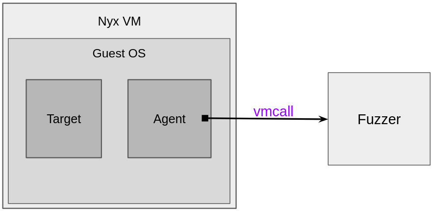
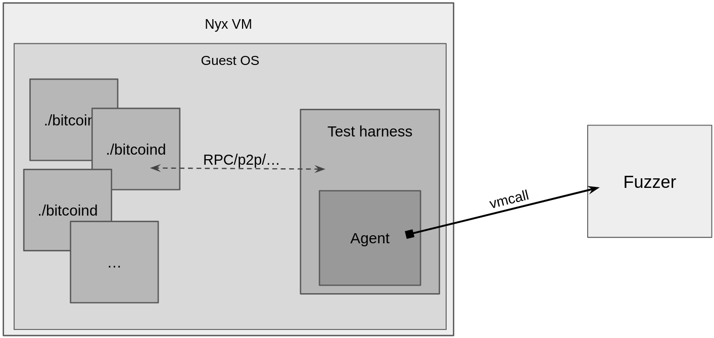

> *作者：NIKLAS GÖGGE*
>
> *来源：<https://brink.dev/blog/2026/04/09/fuzzamoto-non-determinism/>*
>
> *[前篇见此处](https://www.btcstudy.org/2026/02/09/fuzzamoto-introduction-by-niklas-gogge/)*

*本文是关于 [Fuzzamoto](https://github.com/dergoegge/fuzzamoto) 的系列文章的第二篇。Fuzzamoto 是比特币全节点实现的一种模糊测试工具。在本系列[第一篇](https://brink.dev/blog/2026/01/07/fuzzamoto-introduction/)中，我们介绍了 Fuzzamoto 背后的初衷，并概要介绍了其设计和架构（[中文译本](https://www.btcstudy.org/2026/02/09/fuzzamoto-introduction-by-niklas-gogge/)）。在本文中，我们讲深入了解高效模糊测试所面临的最困难的挑战之一：实现确定性的测试执行。*

每一个软件工程师，在 TA 的职业生涯中，或早或晚总会碰到一个无法复现的 bug（或者其它类型的可以观察到的动作）。命令行界面出了一个 bug ，但你就是无法在本地复现；或者，模糊测试崩溃了，但你通过测试工具（harness）来重新运行，它不知怎么又不崩溃了。为什么会这样？最大的可能性是，你的软件并非确定性的。就像许多工程师所知，这可能非常烦人，而且很消耗时间。

具体到模糊测试，非确定性不仅烦人（你的发现可能无法复现），也会持续地降低你的模糊测试的效率，甚至可能让你完全无法发现 bug 。真的吗？真的。 [这个 UBSan 问题](https://issues.oss-fuzz.com/issues/42531370)是在[我们改进了](https://github.com/bitcoin/bitcoin/pull/29064)模糊测试工具之后，才被 oss-fuzz 发现的。

## 非确定性的来源

在了解如何避免和减少非确定性之前，我们先了解一些真实的非确定性的代码的案例，看看非确定性的源头在哪里。

```
auto now{GetTime<std::chrono::seconds>()};
EvictExtraOutboundPeers(now);
if (now > m_stale_tip_check_time) {
    ...
}
```

上面这段代码是非确定性的，因为我们每次运行这个应用、或者测试要执行这段代码的时候，时间值（由 `GetTime` 函数返回）都有可能不同，导致执行不同的代码路径。还有没有别的例子呢？

```
const auto delta = 10min + FastRandomContext().randrange<std::chrono::milliseconds>(5min);
scheduler.scheduleFromNow([&] { ReattemptInitialBroadcast(scheduler); }, delta);
```

计划让一些任务每 10 分钟再加上一些随机偏移量执行一次，也是不确定的；但这个问题还不像表面看起来这么简单。操作系统的线程计划其依赖于（比如说） 时间和硬件中断，所以 `ReattemptInitialBroadcast` 运行的具体时间也是不确定的。那么谁知道呢，也许也会十亿分之一的概率，会有一些别的任务抢先运行，并且只在这种情况下才会触发 bug 。

好吧，也许时间和线程计划这种东西一眼就能看出来，那么这个呢？

```
struct IteratorComparator
{
    template<typename I>
    bool operator()(const I& a, const I& b) const
    {
        return &(*a) < &(*b);
    }
};
...
std::sort(iters.begin(), iters.end(), IteratorComparator());
```

仔细看看比较器（comparator）中的结果！比较的指针也是非确定性的，原因有很多（比如，ASLR（内存地址空间随机化）、以往的分配的排序，等等），可能导致 `iters` 的非确定性排序。

上面所有的非确定性都有一个共同的来源，就是执行这些代码的硬件。时间值，也许是（比如说）通过 `rdtsc` 指令从硬件的时间戳计数器得来得； 随机性，可能是（比如说）通过 `rdrand` 或者 `rdseed` 指令得来的；而计划，可能会被硬件中断影响。

（译者注：“硬件中断” 是指来自键盘、硬盘、鼠标等各种设备的一些信号可以中断 CPU 正在处理的任务、使之转向别的任务。）

所以显然有不计其数的非确定性来源，但基本上，它们（几乎）全都来自跟真实世界（也就是计算机硬件）的交互。网卡、硬盘操作以及多种多样的 CPU 缓存（仅为举例，并不完备）全都是非确定性的。

唯一一个我认为不是来自硬件的非确定性（尤其在模糊测试语境下），是（程序的）全局状态（global state）。在我的经验中，它是非常常见的非确定性的来源，尤其在传统的进程内（in-process）模糊测试中：

```
PeerManager* g_peer_manager = nullptr;

extern "C" int LLVMFuzzerInitialize(int* argc, char*** argv) {
    g_peer_manager = new PeerManager();
    return 0;
}

extern "C" int LLVMFuzzerTestOneInput(const uint8_t* data, size_t size) {
    g_peer_manager->ProcessMessage(data, size);
    return 0;
}
```

上面是一个今天仍存在于 [`Bitcoin Core`](https://github.com/bitcoin/bitcoin/blob/e68517208b4cc02fa4e9e6a8de0fc43b536a3b02/src/test/fuzz/process_message.cpp) 的模糊测试的缩略版本。问题在于，`g_peer_manager` 是一个全局变量，因此，每次执行模糊测试工具（即，处理一些可能会改变对等节点管理器状态的消息）就会累积状态。结果是，测试执行就是非确定性的了。每一次的执行都会依赖于前面的执行的顺序。进程内模糊测试引擎（例如 libFuzzer）的设计假设是测试工具是一个纯粹的函数，而上述情形显然违背了这一假设。

## 变通

看过产生非确定性的代码之后，我们可以看看如何为测试目的而减少非确定性了。

完全的确定性，也即机器的结果和所有中间状态都可以重现出来，是很难靠通用、实用的办法实现的。完全模拟又慢。确定性的虚拟机管理程序难以开发。在 Fuzzamoto 中，我决定采用更实际的路径：只处理一些比较明显而且容易处理的非确定性来源。我目前遇到的非确定性的三大主要来源是：时间值、随机数生成器（RNG）和状态。

### 时间值 & 随机数生成器

为了处理时间值和 RNG，我的第一个办法是寻求 `LD_PRELOAD` 库，比如 [`libfaktime`](https://github.com/wolfcw/libfaketime)  和 [`libfakerand`](https://git.distrust.co/public/libfakerand) 。这些库会用用户可以控制的确定性函数来替代跟时间值和随机性有关的特定 `libc` 函数（标准 C 语言库函数）。幸运的是， `Bitcoin Core` 并没有自己去实现这些 `libc` 函数，并且使用了内联汇编来使用某些 CPU 指令：

```
#elif !defined(_MSC_VER) && (defined(__x86_64__) || defined(__amd64__))
    uint64_t r1 = 0, r2 = 0;
    __asm__ volatile ("rdtsc" : "=a"(r1), "=d"(r2));
    return (r2 << 32) | r1;
#else
```

我们可以直接打上补丁，并且这些库也可以延申到支持缺少的 `libc` 函数；也许还有可以探索的空间，但目前我选择了这种较为简单的变通办法。

目前，我使用一行补丁代码来减少由 `Bitcoin Core` 内部的 RNG 带来的非确定性。这个补丁让 RNG 使用一个固定的种子来实例化每一个随机性语境。

为了处理时间值，我们可以使用 `Bitcoin Core` 的模拟时间（mocktime）功能，它让我们可以使用一个 RPC 来设定节点看到的时间。使用模拟时间 PRC 导致节点的时间冻结（在这个 RPC 调用中指定的时间），因此可以很好地控制（比如说）处理 p2p 消息的时机。但是，它无法很好地模拟时间的流逝。

显然，这些变通方法并非通用的解决方案，它们都专属于 `Bitcoin Core`。为了模糊测试别的全节点实现，比如（用 Go 语言编写的）btcd，我们需要更多定制化的补丁。`Libc` 替换对于（比如说）用 Go 语言编写的程序不管用，因为它们并不依赖于 `libc` 。理想情况下，应该有某种办法，让执行环境来控制应用观察到的时间，而不管它们是用什么语言编写的。

### 跟踪状态

在 Fuzzamoto 中我们不使用前面提到的那种传统的进程内模糊测试。相反，我们让一整个带有应用后台的客座虚拟机（guest VM）经受测试，并且我们需要每一次都能从相同的状态启动模糊测试执行。我们当然可以叫停虚拟机、打包它所有的数据、在需要的时候使用相同的数据重启，但显然这会变得非常慢。

如本系列第一篇文章所述，Fuzzamoto 依赖于[Nyx](https://nyx-fuzz.com/) 作为它的执行后端来处理状态，它让我们可以快照我们所需要的起点状态，并且可以随时快速重置回这个状态。

Nyx 自身建立在 QEMU 之上，使用 KVM 来原生运行在主机 CPU 上。性能方面，创建整个虚拟机的快照的最大挑战来自虚拟机的内存本身。 幼稚的实现方法是直接拷贝所有的内存，但这样肯定慢得发指，因为这可能要处理几 GB 的内存数据。Nyx 通过使用一种 “写入时拷贝（CoW）” 机制实现了高性能，它仅在客座虚拟机尝试修改根快照中的内存时才分配新的内存页。因此，重置一个虚拟机实际上相当于重置修改后的页面（而不是重置所有页面）。这种 CoW 机制在将模糊测试扩容到多个计算核心时也非常有用，因为客座虚拟机的完整内存一次性就分配完成了，每一台 “子” 虚拟机只分配修改后的内存。

抽象地说，使用 nyx 的模糊测试需要在 Nyx 虚拟机内放置一个 “目标程序”（受测试的代码）和一个 “代理程序”，以及在虚拟机外面放置一个模糊测试引擎。代理程序（这是 Nyx 的一个概念哈）会协助在虚拟机内的测试工具与虚拟机外的模糊测试引擎通信。为此，Nyx 提供了一个 `vmcall` 接口，让测试工具在下列方法（以及其它方法）中连接模糊测试引擎：“取得这个虚拟机的快照”、“重置虚拟机到快照状态”、“给我下一个模糊测试输入”、“最后一个输入触发了一个 bug ”。



我从 [Mozilla 的 Nyx 代理程序](https://github.com/MozillaSecurity/snapshot-fuzzing)接口设计中获得了启发，[为 Fuzzamoto 设计了一个定制化的代理程序](https://github.com/dergoegge/fuzzamoto/tree/f875eff26539c63655c3f4be9602a63169188c5f/fuzzamoto-nyx-sys)。我的代理程序为测试工具提供了以下接口：

```
unsafe extern "C" {
    pub fn nyx_init() -> usize;
    pub fn nyx_get_fuzz_input(data: *const c_uchar, max_size: usize) -> usize;
    pub fn nyx_skip();
    pub fn nyx_release();
    pub fn nyx_fail(message: *const c_char);
    pub fn nyx_println(message: *const c_char, size: usize);
}
```

`nyx_get_fuzz_input` 获取快照、请求模糊测试输入，并标记状态：如果调用 `nyx_skip` 、`nyx_release` 或 `nyx_fail` 的话，虚拟机将重置到这个状态。因此，这个 API 可以被测试工具用来控制执行和虚拟机状态并报告 bug 。

全部汇总在一起，Fuzzamoto 的粗略的架构看起来是这样的：



## 结论

虽然实现完美的确定性依然是一个可望不可及的目标，本方法结合了 Nyx 的快照功能以及有针对性的时间值和随机性补丁，提供了足够多的确定性，让这套模糊测试方法实用又高效。虽然它不是没有局限性，快照和重置整个虚拟机状态的能力，解决了为消灭测试执行期间状态累积而带来的绝大部分挑战，而且无需进行侵入性的代码修改。

本系列的下一篇文章将介绍基于定制化的 LibAFL 的模糊测试引擎，它针对的是全节点的 p2p 消息处理逻辑。