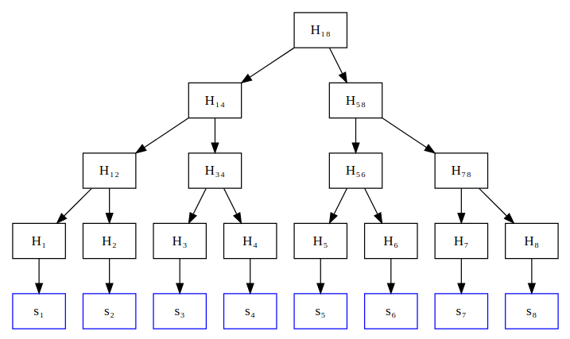

> *作者：Salvatore Ingala*
> 
> *来源：<https://merkle.fun/>*

限制条款（covenant）指在被花费时交易 *输出* 受到限制的 UTXO。更正式的定义是，*限制条款* 是至少有一个花费条件有效的 UTXO，且在花费时必须有一个或多个输出的 `scriptPubKey` 满足特定限制才可以。

通常，限制条款提议还会增加某种形式的自省（即，Script 访问部分输入/输出或区块链历史的能力）。

在本文中，我们想要探索添加具有以下特性的限制条款所带来的可能性：

- 内省仅限于附着在 UTXO 上的单个哈希值（“限制条款数据”）以及 输入/输出 的数量；

- 对每个可能的未来脚本（而非它们的数据）都有预先承诺；

- 少数的简单操作码可以使用使用限制条款数据。

我们认为这样一个简单的限制条款结构足以扩展比特币 Layer 1 的能力，使之成为支持一切计算的**通用结算层**。

此外，限制条款可以优雅地适应 P2TR 交易，不会显著增加比特币节点的工作负荷。

*本文的初版来自 2022 年 9 月 23 日举办的* [*BTCAzores Unconference*](https://btcazores.com/) 上的演讲和讨论。

## 前言

我们可以将智能合约视作一个“程序”。这个程序不仅会根据预定规则（通常包括访问控制，通过仅授权特定公钥执行特定操作的方式实现）更新特定状态，还有可能能够根据同一套规则 锁定/解锁 底层区块链上的一些资金。

具体定义主要取决于底层区块链的特性。

在比特币区块链中，所有节点达成共识的 *唯一状态* 是 *UTXO 集*。其它区块链可能会将其它数据结构作为共识的一部分，例如，会受到交易执行影响而更新的 键-值 存储。

在这一部分，我们将探索以下概念，以设定符合比特币结构的智能合约定义的框架：

- 合约状态：运行智能合约的“内存”。
- 状态转换规则：更新合约状态的规则。
- 限制条款：能够让合约在比特币 UTXO 上下文运行的技术手段。

在下文，链上智能合约总是被表示为一个 UTXO，不仅隐式嵌入了合约状态，还有可能控制“锁定”在合约内的资金。通常来说，我们可以考虑以一组 UTXO 来表示智能合约。至于将我们的框架普遍化的工作，则留待日后的研究。

### 状态

智能合约的任意有趣“状态”最终都可以编码为一个列表，其中每个元素要么是一个比特，要么是定长的整数，或者是一个任意的字节字符串。

无论选择哪一种，只要你能够在这些元素上执行一些基础计算，就不会真正影响计算的可表达性。

在下文，我们将作出适用于普遍情况的假设：计算发生在包含一组固定长度的 S = [s1, s2, …, sn] 的状态上，其中每个 si 都是一个字节字符串。

**默克尔化的状态**

通过构造一个将列表 S 里的元素（的哈希值）存储在叶子中的[默克尔树](https://en.wikipedia.org/wiki/Merkle_tree)，我们可以为整个列表 S 生成一个简短的承诺 hS。hS 具备以下特性（对于只知道 hs 的验证者来说是如此）：

- 只需大小为 (log n) 的证据，就能够证明元素 si 的值。
- 只需大小为 (log n + |x|) 的证据，就能够证明新的承诺为 hS' 。其中 S' 是通过用 x 替换某个叶子的值而得到的新列表。

这样可以为 RAM 生成简洁的承诺，并证明 RAM 更新的正确性。

换言之，一个有状态的智能合约能够用单个哈希值（例如，一个长度为 32 个字节的 SHA256 输出）代表一个任意的状态，。

### 状态转换规则和 UTXO

我们可以非常方便地将一个智能合约表示为一个 *有限状态机*（Finite State Machine, FSM），在特定时间只允许一个节点是活跃的。每个节点都有一个如上文定义的关联 *状态* 和一组 *转换规则*。这组规则定义了：

- 谁可以使用规则
- FSM 中下一个活跃节点是哪个
- 下一个活跃节点的状态是什么

接下来，我们就能轻松理解限制条款是如何便利地表示和执行此框架中的智能合约的：

- 创建一个带有限制条款的 UTXO 将智能合约实例化。智能合约位于 FSM 的初始节点。
- UTXO 的 `scriptPubKey` 说明了当前状态和有效转换。
- 根据规则，有效转换后生成的 UTXO 未必会进一步受到限制。

因此，要将该框架应用到比特币 Script 中，我们需要一个能够执行这种状态转换的限制条款，仅允许提交至 FSM 中下一个有效节点（及对应状态）的输出。

要证明已提交状态上可以执行 *任意计算* 并不难，只要能在该状态上执行相对简单的算术或逻辑操作即可。

*备注*：使用非循环 FSM 不会降低智能合约的表达能力，因为任何基于有限大小输入且需要循环可以终止的计算都可以展开成非循环计算。

**默克尔化的状态转换**

通过使用默克尔树，我们可以用一个长度为 32 字节的短摘要简洁地表示任意数据。同理，我们也可以用一个 32 字节的哈希值简洁地表示任意状态转换规则（智能合约的 *代码*）。每个可能的状态转换都被编码成一个 Script 放到默克尔树的叶子里。这个默克尔树的默克尔根是对所有可能的状态转换的承诺。Taproot 里的 *taptree* 就是这么做的（参见 [BIP 0341](https://github.com/bitcoin/bips/blob/master/bip-0341.mediawiki#constructing-and-spending-taproot-outputs)）。

我们将在下文提出一种潜在解决方案，用来在 UTXO 中表示合约的状态和有效转换规则。

### 链上计算？！

计算应该在区块链上执行吗？

如果在设计上过于简单，执行合约可能需要大量交易，因此并不可行。

虽然限制条款确实能让交易的链条执行任意计算，但是协议设计者出于简单的经济考量会将复杂计算放到链下执行，仅使用区块链共识 *验证* 计算，或在可能的情况下跳过验证。

根据以往的观察（如 [Greg Maxwell 在 2016 年发布的文章](https://bitcointalk.org/index.php?topic=1427885.msg14601127#msg14601127)），我们发现了一个基本事实：区块链的 Layer 1 无需运行复杂的程序来实现任意复杂程度的智能合约。

Vitalik Buterin 推广了 [*功能逃逸速度*](https://vitalik.ca/general/2019/12/26/mvb.html) 的概念。所谓的功能逃逸速度，指的是为了在 Layer 1 之上（Layer 2 及以上）构建其它功能，Layer 1 所需具备的最少功能。

在下一部分，我们将论证为何一个简单的限制条款结构就足以在 UTXO 模型中实现功能逃逸速度。

## 计算承诺和欺诈挑战

在这一部分，我们将探索如何使用上一部分中介绍的简单限制条款来实现需要执行复杂计算 f : X ↦ Y（成本过高或无法执行链上 Script 状态转换）的智能合约。

本部分所述观点源自参考文献。如果你想了解更全面的讨论，建议阅读文末的参考文献。

我们想要有能力构建支持 f(x) = y 类条件的合约，却又不想强迫 Layer 1 执行任何高成本的计算。

接下来，为了简单起见，我们假设限制条款的参与者只有 Alice 和 Bob，他们分别在限制条款的 UTXO 里锁定了 *bondA* 和 *bondB*。

1. Alice 发布声明“*f*(*x*) = *y”。*
2. *挑战期* 过后，如未遭受挑战，Alice 即可继续操作并解锁保证金。在这种情况下，Alice 的声明为真。
3. *挑战期* 到期之前，Bob 随时都可以发起挑战：“事实上，*f*(*x*) = *z”。*

如果挑战发生，Alice 和 Bob 进入挑战解决协议，由 Layer 1 作出裁决。获胜方获得失败方的保证金（具体细节和博弈论因挑战所属协议的类型而异。另外，选择适当数量的保证金对于协议设计来说至关重要）。

该部分的剩余部分简述了挑战协议的实例。

### 支持任意计算的二分协议

在这一部分，我们将概述支持任意计算 *f : X ↦ Y* 的挑战协议。 

**计算的踪迹**

给定函数 *f*，我们可以将完整计算拆解成简单的基础步骤，其中每个步骤执行一个简单的原子操作。例如，假设 *x* 和 *y* 的域是固定长度的二进制字符串，就有可能创建一个输入 *x* 就会输出 *y* 的布尔电路。实际上，使用某种在 RAM 上运行的汇编式语言对于比特币 Script 来说可能更高效且适宜。

在下文，我们假设每个基础操作都在 RAM 上运行，并以上文所述的默克尔树形式编码到状态内。因此，我们可以将计算的所有步骤表示为三元组 *tri = (sti, opi, sti+1)*，其中 sti 是第 i 个操作前的状态（例如，RAM 的公认默克尔树），sti+1 是第 i 个操作后的状态，*opi* 是对操作的描述（根据实现而定，例如，将 a 与 b 相加并将结果保存至 c）。

最后，我们可以构建一个默克尔树（MT）。假设计算需要 *N* 步，则该默克尔树的叶子是各个计算步骤的值 *T = {tr0, tr1, …, trN - 1}*，默克尔根为 *hT*。该默克尔树的高度是 ⌈log N⌉。可以看出，每个内部节点，都承诺了一部分相应于其所在子树的计算踪迹。

假设内部节点的默克尔树承诺通过状态 *ststart* 和 *stend* 得到了进一步声明。*ststart* 和 *stend* 分别指子树最左边叶子里的操作执行之前的状态，以及子树最右边叶子里的操作执行之后的状态。

**二分协议**

当 Alice 声称计算踪迹是 *hA* 并将其发布出来，Bob 却认为计算踪迹应该是 *hB ≠ hA* 时，挑战协议就会开启。挑战从 MT 的根开始循序渐进，直至找到 Alice 和 Bob 之间存在异议的叶子（一定存在，否则不会产生争议）为止。请注意，仲裁机制虽然知道 *f*、*x* 和 *y*，却并不知道正确的计算踪迹哈希值 *hT*。

**（二分阶段）**：当挑战位于 MT 的非叶子节点时，Alice 和 Bob 轮流发布与他们声称的计算踪迹哈希值的左右子节点对应的两个哈希值。另外，他们还发布了每个子节点的开始/结束状态。根据挑战协议的要求，只有当被发布的哈希值 *hlA* 和 *hrA* 以及为每个子节点声明的开始/结束状态与当前节点中的承诺一致时，Alice 的交易才被视为有效。

**（仲裁阶段）**：如果挑战协议已经到达第 i 个叶节点，则各方公开自己的 *tri = (sti, opi, sti+1)*。事实上，只有诚实的那方能够公开正确的值，因此挑战协议可以裁定获胜者。

*备注*：这里必然还有很多优化空间。我们未来仍需进一步研究，找到该方案的最优版本。此外，不同的挑战机制适合不同的函数 *f*。

**博弈论（如何避免链上挑战的发生）**

通过采用适当的经济激励机制，协议设计者可以确保挑战游戏里的失败方必定会承担经济损失，合作共赢才是正解。**因此，在链上发起挑战游戏是人们最不愿意看到的事**。保证金大小必须适宜，才能有效防止攻击。

**实现二分协议的状态转换**

不难看出，我们可以使用上述简单的状态转换来实现整个挑战-响应协议。

挑战开始前，限制条款的状态里包含 *x* 和 *y* 的值，以及 Alice 计算的计算踪迹。挑战开始时，Bob 将其声称正确的计算踪迹添加到限制条款状态里，限制条款进入二分阶段。

在二分阶段，限制条款包含双方声称的计算协议节点的计算踪迹。双方必须轮流公开当前节点的两个子节点的对应计算踪迹。只有当双方提供的子节点信息能够用来计算出当前节点的正确哈希值时，交易才有效。协议对双方存在异议的计算踪迹（一定存在）所在的子节点进行重复计算。一旦到达 MT 的指定叶节点，限制条款会进入最终仲裁阶段。

在仲裁阶段（假设是 MT 的第 i 个叶节），提供正确的 *tri = (sti, opi, sti+1)* 值即可赢得挑战。重点是，只有一方能够提供正确的值，而且 Script 可以通过执行 *opi* 来验证状态是否真的从 *sti* 变为 *sti+1* 。挑战结束。

在任何情况下，只要（原本应该“出招”的）一方没有花费限制条款，限制条款就会让另一方在指定时限结束后自动赢得挑战。这样可以保证协议总能找到解决方案。

**安全模型**

就其它协议（如闪电网络）而言，大多数矿工可以通过审查交易的方式裁定挑战的获胜者。因此，二分协议假设了 *诚实矿工占多数*。对于很多协议来说，这一假设是可以接受的，但是应该在协议设计过程中进行考量。

## MATT 限制条款

我们认为，在 UTXO 模型中实现任意通用型智能合约的关键在于将默克尔树应用到以下层面：

1. 使用单个哈希值简洁地表示任意状态。*用默克尔树表示状态！*

1. 使用单个哈希值简洁地表示可能的状态转换。*用默克尔树表示 Script！*

1. 使用单个哈希值简洁地表示任意计算。*用默克尔树表示执行！*

仅凭（1）和（2）就可以实现支持任意计算的合约。（3）可以为合约赋予可扩展性。

*用默克尔树表示一切！*

在这一部分，我们将简述一种限制条款操作码设计。该设计不仅支持 taproot，还能通过软分叉轻松添加至现有的 SegWitv1 Script。

### 将限制条款数据嵌入 P2TR 输出

我们可以利用 taproot 输出的双承诺结构（即，对公钥和脚本的默克尔树均作出承诺）将限制条款和状态转换规则简洁地编码到 taproot 输出内。

我们的思路是将内部公钥 *Q* 替换为使用限制条款数据调整 Q 而得到的密钥 *Q’*（与向 TapTree 的根作出承诺所使用的流程相同）。更确切地说，假设 *d* 是提交至限制条款的数据，则使用限制条款数据增强的内部密钥 *Q’*被定义为：

 *Q’ = Q + int(hashTapCovenantData(Q || hdata))G*

其中，*hdata 是限制条款数据的 SHA256 哈希值。通过重复计算，我们可以轻而易举地证明点 *Q’*是否真的按上述方式构造。

如果不存在有用的密钥花费路径，那么就像 [BIP-341](https://github.com/bitcoin/bips/blob/master/bip-0341.mediawiki#constructing-and-spending-taproot-outputs) 对于没有密钥路径的脚本所提议的那样，我们可以使用 NUMS 点 H = lift_x(0x0250929b74c1a04954b78b4b6035e97a5e078a5a0f28ec96d547bfee9ace803ac0)。

务必仔细检查上述计算是否正确。

### 对 Script 的更改

以下是我们为实现上述构造而需添加到 taproot 交易上的新操作码。这只是初步提议，并不保证完整性和正确性。

- `OP_SHA256CAT`：返回堆栈的第二个和第一个（顶部）元素的拼接的 SHA256 哈希值。（只要启用了 `OP_CAT` ，即使只是在总长度为 64 个字节的操作数上，这个操作码就是多余的。）

- `OP_CHECKINPUTCOVENANTVERIFY`：假设 *x* 和*d* 是堆栈顶部的两个元素。只要元素 *x* 和 *d* 中任何一方的长度不是 32 个字节，则该操作码的作用与 `OP_SUCCESS` 相似。否则，确认 *x* 是有效的 x-only 公钥，且内部公钥 *P* 是通过使用 *d* 调整 *lift_x(x)* 后得到的。

- `OP_INSPECTNUMINPUTS`、`OP_INSPECTNUMOUTPUTS`、`OP_INSPECTINPUTVALUE` 和 `OP_INSPECTOUTPUTVALUE` 是用来将数字推到 输入/输出 及其数量的堆栈上的操作码。

- `OP_CHECKOUTPUTCOVENANTVERIFY`：给定一个数字 *out_i* 和位于堆栈顶部的 3 个 32 字节哈希值元素 *x、d* 和 *taptree*，验证第 *out_i* 个输出是否是 P2TR 输出，且内部密钥是否按上述方式计算并使用 *taptree* 调整过。这是真正的限制条款操作码。

待解决事项：

- 很多合约都需要各方提供额外数据。通过见证信息传递这些数据有可能导致数据延展性问题。因此，找到一种传递已签署数据的方式是必要的。一种潜在解决方案是在附件（annex）中添加对数据的承诺，并引入一个操作码来验证这类承诺。由于附件为签名所覆盖，不存在数据延展性问题。另一种解决方案是采用 `OP_CHECKSIGFROMSTACK` 操作码，但是需要另外进行签名验证。

- 就数量而言，当前 Script 中的比特币数字还不够大。

其它观察结果：

- `OP_CHECKINPUTCOVENANTVERIFY`和`OP_CHECKOUTPUTCOVENANTVERIFY` 可以采用这样一种模式：使用 NUMS 公钥来代替 *x*。例如，如果第一个操作数是一个空的字节数组而非一个 32 字节的公钥，在不需要内部公钥的情况下可以节省大约 32 字节的空间（因此，使用到两个操作码的典型合约转换可节省大约 62 字节的空间）

- 是否值得添加其它内省操作码，如 `OP_INSPECTVERSION` 和 `OP_INSPECTLOCKTIME` ？参见 [Liquid](https://github.com/ElementsProject/elements/blob/master/doc/tapscript_opcodes.md)。

- 是否存在熔融性问题？限制条款能否在没有签名的情况下“运行”？或者说，如果使用带有限制条款限制的花费条件，是否一定需要签名？这对于无需签名即可继续执行协议的合约来说（例如，任何一方都可以将有效数据喂给上述二份协议）或许会有用。

- 添加一些额外的操作码来操作堆栈元素也有可能提高应用的性能（但是从可行性的角度来说，这不是必要的）。

*备注*：[Blockstream Liquid 中可用的新增内省操作码](https://github.com/ElementsProject/elements/blob/master/doc/tapscript_opcodes.md)似乎确实支持MATT 限制条款。事实上，操作码 `OP_CHECKINPUTCOVENANTVERIFY` 和 `OP_CHECKOUTPUTCOVENANTVERIFY` 可以替换为更通用的操作码，例如， {`OP_TWEAKVERIFY`, `OP_INSPECTINPUTSCRIPTPUBKEY`, `OP_PUSHCURRENTINPUTINDEX`, `OP_INSPECTOUTPUTSCRIPTPUBKEY` } 。

**变体：有限递归**

在上述形式下，限制条款本质上支持完全递归结构（任意 *深度* 的限制条款执行树实际上等同于完全递归）。

如果不想要递归，我们可以将限制条款修改成仅支持有限 *深度*：限制条款上可以附加一个受约束的计数器，即，此计数器必须随`OP_CHECKOUTPUTCOVENANTVERIFY` 递减。只要最大深度足够，我们仍可以使用任意欺诈证明。

但是，这有可能降低限制条款的效用，并将那些需要递归的应用排除在外。

今后，我们将继续研究，充分探索设计空间。

## 应用场景

这一部分将探索上述技术的部分潜在应用场景。

鉴于欺诈证明的普遍性，每一类智能合约或 Layer 2 结构的变体应该都可以通过 MATT 限制条款实现，但是需要准确考虑附加要求（例如，资金锁定和挑战期延迟）。我们需要进一步研究以评估位于可接受取舍范围内的应用场景。

### 状态通道

*状态通道* 是支付通道的泛化。状态通道内存储的不只有余额，还有 *状态*。状态通道还说明了关于如何更新通道状态的规则。

比方说，有两个人在下棋，而 *状态* 对棋盘的当前配置进行了编码。有效的状态转换对应有效的一步棋。一旦游戏结束，获胜者获得指定数量的通道资金。

通过 eltoo 式更新，只要双方（通过签署对方状态更新的方式）进行合作，就可以完全在链下进行这样的游戏。

区块链的作用是确保在一方不配合的情况下游戏仍能继续进行并终止。

如果是有状态区块链，参与方只需发布最新 *状态*（既可以是默克尔树，也可以不是）然后在链上继续游戏即可。这会带来很高的成本，尤其是在状态转换需要某种复杂计算的情况下。

另一种可以避免计算上链的解决方案是使用上文所述的挑战-应答协议。

就像闪电通道的安全模型那样，如果大多数矿工都是诚实的，诚实的参与方 *一定* 会赢得挑战。因此，从博弈论的角度来看，试图在通道中作弊只会招致失败。

### CoinPool

多方状态通道同样有可能实现。因此，像 [CoinPool](https://coinpool.dev/v0.1.pdf) 这样的结构应该也是可行的，让多个参与者可以共享同一个 UTXO。

### Layer 2 协议中的零知识证明

基于零知识证明的协议需要区块链充当验证器。验证器是根据作为输入的零知识证明的正确与否返回是/否的函数。

我们可以考虑将 `OP_STARK` 编译为上述协议中的函数 *f*，而非 Layer 1 上的 `OP_STARK` 操作程序。

请注意，具有有限“递归深度”的限制条款足以表达 `OP_STARK`，意味着我们可以使用挑战协议在合约中表达任意函数。

这种方法的一个优点是，不会为比特币 Layer 1 引入新的密码学假设，即使 `OP_STARK` 确实有此需要。此外，如果发现了不同或更好的 `OP_STARK2`，我们无需对 Layer 1 进行任何修改即可在 Layer 2 合约上进行创新。

### Optimistic Rollup

John Light 最近发布了一篇关于如何将 Validity Rollup 添加到比特币 Layer 1 上的[研究报告](https://bitcoinrollups.org/)。虽然他没有提出确切的提议，但是他建议的需要更改之处包括递归限制条款组合和用于有效性证明验证的操作码。

欺诈证明是 Optimistic Rollup 的核心。探索使用 MATT 限制条款实现 Optimistic Rollup 的可能性似乎是个很有前景的方向。由于 Script 所需的更改十分简单，这可以应对报告中分析的一些[成本和风险](https://bitcoinrollups.org/#section-6-the-costs-and-risks-of-validity-rollups)，同时带来了许多相同的优点。需要强调的是，比特币 Layer 1 上无需引入任何新的密码学技术。

Optimistic Rollup 可能需要完全递归的限制条款版本（但欺诈证明，通过有限递归深度就有可能实现）。

## 致谢

根据 Antoine Poinsot 的建议，我们改进了最初提议的限制条款操作码。最初的操作码仅限于没有有效密钥花费路径的 taproot 输出。

感谢 catenocrypt、Antoine Riard、Ruben Somsen 和 BTCAzores Unconference 的参与者围绕此提议的早期版本提出了许多有意义的讨论和评论。

## 参考文献

二分协议的核心思想似乎已经被独立发现过很多次。在区块链研究中，二分协议是具有相似目的的欺诈证明结构的核心，尽管它没有聚焦于比特币和限制条款。示例如下：

- [*Harry Kalodner et al.* “Arbitrum: Scalable, private smart contracts.” − *27th USENIX Security Symposium*. 2018.](https://www.usenix.org/system/files/conference/usenixsecurity18/sec18-kalodner.pdf)

- [*Jason Teutsch and Christian Reitwießner.* “A scalable verification solution for blockchains” − TrueBit protocol. 2017](https://people.cs.uchicago.edu/~teutsch/papers/truebit.pdf)

在区块链用例出现之前就有人发表了同样的基本想法，见下例：

- [*Ran Canetti, Ben Riva, and Guy N. Rothblum.* “Practical delegation of computation using multiple servers.” − *Proceedings of the 18th ACM conference on Computer and communications security*. 2011.](http://diyhpl.us/~bryan/papers2/bitcoin/Practical delegation of computation using multiple servers.pdf)