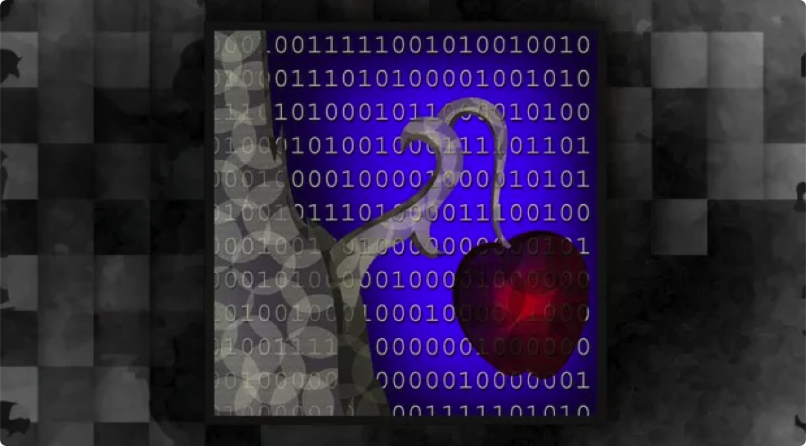
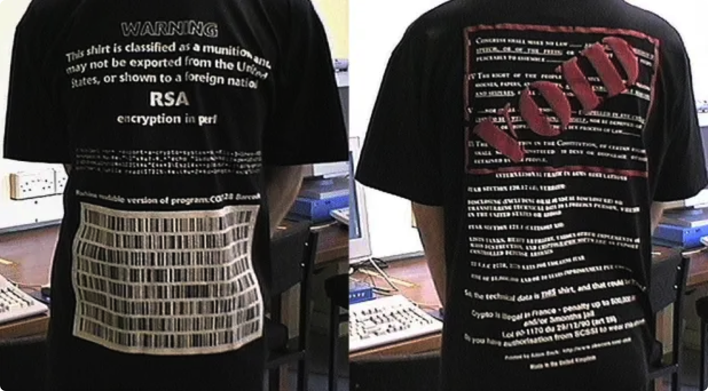
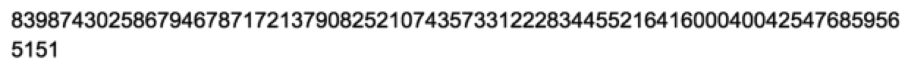
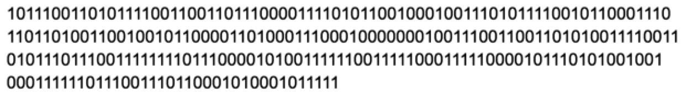

> *作者：Aaron Van Wirdum*
> 
> *来源：<https://bitcoinmagazine.com/technical/genesis-files-hashcash-or-how-adam-back-designed-bitcoins-motor-block>*

> [公告] hach cash 邮票实现

时值 1997 年 3 月 28 日，密码朋克邮件列表的 2000 多个订阅者收到了一封[邮件](https://cypherpunks.venona.com/date/1997/03/msg00774.html)，开头就是上面那句引文。发送者是一位 26 岁的英国人，埃克塞特大学（University of Exeter）的博士后。这个年轻的密码学家在邮件组里用名 Adam Back 博士，也是邮件组的高产贡献者。这份邮件所包含的讲解和简单实现，作者命名为 “基于部分哈希碰撞的邮费方案” —— 其实就相当于用在电子邮件上的邮票，只不过其基础是一种漂亮的密码学方案。

“使用部分哈希值（partial hashes）的理由是，其计算成本可以任意调高”，Back 写道，“但即刻可以验证”。关于这个系统的优点，他就是这么解释的。

当年的密码学家现在成了 [Blockstream](https://blockstream.com/) 公司的 CEO，但那封邮件在当时并没产生多大反响：只有一个读者[回了信](https://cypherpunks.venona.com/date/1997/03/msg00776.html)，而且讨论的是选择哈希算法的技术问题。但是，Hashcash 背后的技术 —— 工作量证明 —— 却塑造了它诞生之后十多年的数字货币研究。

## “以任务处理施加代价，打击垃圾邮件”

Back 的 Hashcash 并不是同类方案的开创者。

早在 1990 年代早期，互联网的前景，尤其是电子邮件系统的优点，对有所关注的技术人员来说已经显而易见。但是，当时的互联网先驱们，也意识到了电子邮件系统有自己的问题。

“尤其是，发送电子邮件很简单、成本也很低，而且你还可以向许多人发送同样的消息，那一定会招致滥用”，IBM 的研究员 Cynthia Dwork 博士和 Moni Naor 博士在他们发表于 1992 年的白皮书中这么解释。该白皮书名为 “[以任务处理施加代价，打击垃圾邮件](http://www.wisdom.weizmann.ac.il/~naor/PAPERS/pvp.pdf)”。

确实，随着电子邮件的流行，垃圾邮件也层出不穷。

需要一个解决的办法，早期的互联网用户都同意 —— 而其中一种就是 Dwork 和 Naor 的论文所提供的。

他们俩的方案是：发送电子邮件的人，每逢发送一份邮件，都要在邮件中附加一些数据。这些数据需是一个数学问题的解，而且每封邮件提出的问题都是独一无二的。具体来说，Dwork 和 Naor 提出了三种可用于此场景的候选谜题形式，全都基于公钥密码学和签名方案。

要给电子邮件添加一个解并不难，理想情况下只需一台普通计算机的处理能力，算个几秒钟就行，而且接收方是很容易能检查出其有效性的。有趣的地方就在这里：对发广告的、搞诈骗的和黑客来说，即使一封邮件只需一点点处理能力，也会累积出高昂的成本，因为他们都想一次性发送几千乃至几百万条消息。理论上来说，滥发消息的成本可以非常高昂，贵到无利可图。

“主要想法就是让用户计算一个难度适中而不棘手的函数，然后才能获得资源的访问权，由此防止滥用”，Dwork 和 Naor 这么解释。

虽然 Dwork 和 Naor 没有发明这个术语，但他们所提议的这类解决方案，后来以 “工作量证明” 之名为人所知。用户必须出示他们的计算机工作的结果，以此证明他们花费了真实世界的资源。

多么漂亮的方案，可惜可能过于超前。这套方案仅仅在一小圈计算机科学家内部流传，从来没得到广泛的关注。

## Adam Back 和密码朋克

就在 Dwork 和 Naor 出版他们白皮书的同一时间，一群带有自由意志主义（Libertarian）倾向的隐私权运动人士也开始意识到了互联网的强大潜力。这群拥有同样意识形态的人开始形成了一个邮件组，专门探讨加强隐私的技术。跟  Dwork 和 Naor 一样，这些 “密码朋克” —— 这是后来人给他们的称呼 —— 利用更新的密码学来实现他们的目标。

几年后，Adam Back —— 他在 1996 年取得博士学位 —— 在这个邮件组中成了最活跃的参与者之一，有时候一个月就能发几十封邮件。跟其他密码朋克一样，他也对诸如[隐私权](http://cypherpunks.venona.com/date/1997/03/msg00586.html)、[言论自由](https://cypherpunks.venona.com/date/1996/09/msg00407.html) 和[自由意志主义](https://cypherpunks.venona.com/date/1996/09/msg01919.html)在内的话题充满激情，而且他还参与到了如 “[匿名中转商](https://cypherpunks.venona.com/date/1996/07/msg00851.html)”、[加密文件系统](https://cypherpunks.venona.com/date/1996/07/msg00836.html)、[电子现金](https://cypherpunks.venona.com/date/1996/09/msg01919.html)（由 David Chaum 博士[发明](https://bitcoinmagazine.com/articles/genesis-files-how-david-chaums-ecash-spawned-cypherpunk-dream)）等话题的技术讨论中。

但有一段时间，Back 最为人知的事迹可能是印制和贩卖 “军火” 上衣：就是印有加密技术协议的 T 恤衫，意在指出美国政府把 Phil Zimmermann 的 PGP（Pretty Good Privacy）加密程序按出口管制法律中的 “军火” 条例来管制的荒谬之处。你要是穿上 Back 的衣服，穿越国境离开美国，那你可就成了一个 “军火出口商” 了。

跟大多数人一样，Back [没有注意到](http://datwww.mit.edu/bloom-picayune/crypto/2058) Dwork 和 Naor 的工作量证明提议。但在 1990 年代中期，他也一直在思考用类似的方法来对抗垃圾邮件，有时候会在密码朋克邮件组里 “高调” 发言。

比如，在给转寄商增加更多隐私的上下文里，Back 会这么[评论](http://cypherpunks.venona.com/date/1997/03/msg00631.html)： “使用 PGP 协议附带的一个好处是，PFP 加密方法会给滥发消息的人施加一些开销 —— 他每秒能加密的消息，应该比能用来塞爆一个 T3 链接所需的数量要少”。这多么像 Dwork 和 Naor 的想法啊。

密码朋克的邮件组在五年内迅速壮大。一开始它只是一小群在旧金山湾区开办创业公司的人的在线讨论平台，后来成了一个小型的互联网现象，有几千个订阅者 —— 而且经常邮件会多到看不过来。

正是在这个时期 —— 1997 年，邮件组人数接近峰值的时间 —— Back 提出了他的 Hashcash。

## Hashcash

Hashcah 类似于 Dwork 和 Naor 的防滥发方案，目的也是一样的，但 Back 提出了一些额外的用途，比如抵抗滥用匿名中转商。但就像这个名字暗示的那样，Hashcash 的基础跟 Dwork 和 Naor 所用的不是同一套，它基于哈希算法。

哈希算法是一种密码学工具，它可以接受任意数据 —— 无论是一个字母还是一整本书 —— 作为输入，然后输出一个长度确定的、看起来毫无规律的数字。

举个例子，“This is a sentence” 这个句子的 SHA-256 哈希值，是如下的十六进制数字：

“转换” 为常规的十进制数字为：

二进制形式则是：

但是，“This, is a sentence” 的 SHA-256 哈希值，却是：

如你所见，仅仅只是插入一个标点，产生的哈希值也会完全不同。而且，重要的是，两个句子的哈希值都是完全无法预测的；即使你知道了第一个句子的哈希值，也无法从中推导出第二个句子的哈希值。要想知道，唯一的办法就是实际运行哈希计算。

Hashcash 很聪明地运用了这种数学工具。

在 Hashcash 中，邮件的元数据（如 “发送者地址”、“收件人地址”、发送时间，等）都被形式化为一个协议。此外，电子邮件的发送者必须给这部分元数据加入一个随机数字，称作 “nonce”。所有这些元数据，包括这个 “nonce”，（输入哈希函数后）可得出一个哈希值，这个哈希值看起来也会跟上面所示的随机数一样，毫无章法。

奥妙之处在于：不是随便什么哈希值都可以算作 “有效的”。哈希值的二进制形式，必须以预定数量的 “0” 开头，才算有效；比如说，要有 20 个 “0” 开头。发送者就要找出某个 nonce，使得哈希值的开头要有 20 个 “0”，才行。但是，他是没法预先知道哪个 nonce 能做到这一点的。

因此，要想得出这样的有效的哈希值，发送者只有一种办法：试错（也即 “蛮力计算”）。他只能不断尝试不同的 nonce，直到找出一个有效的组合。否则，TA 的邮件就会被收件人的邮件客户端拒绝。就像 Dwork and Naor 的方案，Hashcash 也要求付出计算资源：这是一种工作量证明系统。

“如果邮件没有附带 20 位的哈希值 …… 你的程序就会弹出一条声明，解释发邮件需要付邮费，以及哪里能获得合适的软件”，Back 在密码朋克邮件组里这么解释，“这可以让滥发邮件的人一夜之间破产，因为 100 0000 x 20 = 100 MIP 年，比他们的计算能力要大得多”。

值得注意的是，Back 的工作量证明系统比起 Dwork 和 Naor 的要更随机。他们俩的方案只要求解出一个谜题，这意味着一台更快的计算机总是解得更快些（比起条件更差的计算机）。但从统计上来看，Hashcash 中更慢的计算机也有几率会更快找出正确的解。

（打个比方，如果某人跑得比别人快，在短跑比赛中 TA 每次都能赢。但如果某人只是买了更多的彩票，其他人也总有几率能比他中得多 —— 只是不那么经常能中奖而已。）

## 数字世界的稀缺性

与 Dwork 和 Naor 的提案命运相似，Hashcash 从未获得很大的进展。Back 在 2002 年的[白皮书](http://www.hashcash.org/papers/hashcash.pdf)中详细讲解了 Hashcash。Apache 的开源 SpamAssassin（垃圾邮件过滤）平台实现了它，而微软也在一种不兼容的 “电子邮件邮戳” 格式中利用了工作量证明的想法。而 Back 和其他学者，连年致力于为这个解决方案提出不同的应用，但都没有得到多少关注。对大多数潜在应用来说，缺乏网络效应使他们难以启动。

但是，Dwork 和 Naor、Back（的独立研究），都确实创造了一些东西。数字化的产品最强大的特性之一便是它们很容易就能被复制，而工作量证明本质上是第一种不依赖于中心的虚拟稀缺性概念：它将电子数据与真实世界、有限的计算资源绑定在了一起。

而稀缺性，毫无疑问，是货币的前提。实际上，Back 在他的密码朋克邮件发言和白皮书中，都特别明确地将 Hashcash 放在货币的类别中，与当时世界上唯一一种数字现金（Chaum 的 DigiCash）相对照。

“在 digicash 获得广泛使用前，Hashcash 也许能提供一种临时措施”，Back 在邮件组中说，“Hashcash 是自由的，你只需在你的电脑上消耗一些计算，就能得到它。这符合自由表达的网络文化，经济拮据的人也能和百万富翁、退休政府官员等等平等对话。（而且）如果 digicash 出了问题（被接管或者要求保管用户的身份信息），Hashcash 也能提供一种控制垃圾邮件的后备方案。”

但是，除开这个名字，Hashcash 并不能很好地担当一种成熟的现金（Dwork 和 Naor 的提议当然也不行）。也许更重要的是，接收者 “收到” 的工作量证明，对他来说没有任何用处。不像货币，你可以花在别的地方。此外，因为计算机的性能日益提高，相同的时间里，它们可以生成越来越多的证明 —— Hashcash 会遭遇超级通胀。

撇开其它所有，工作量证明所提供的，乃是数字货币研究的一个全新的基础。后来的大多数重要的数字货币方案，都建立在 Hashcash 之上，一般来说都是让工作量证明得以重用（Hal Finney 的 “可重用的工作量证明（PROW）” 即是最明显的例子）。

## 比特币

当然，最终来说，工作量证明成了比特币的基石，而 Hashcash 也是比特币白皮书中为数不多的引用之一。

然而，比特币对 Hashcash（或者说其变种）的利用方式迥异于此前其他人所提出的。不像 Hashcash 和其他基于 Hashcash 的方案，工作量证明自身所提供的稀缺性，在比特币中并没有直接被用作货币。实际上，Hashcash 被用来创造一种竞赛：无论哪个矿工最先制造出了一个有效的工作量证明 —— 也即一个比特币交易块的哈希值 —— TA 就决定了哪些交易是下一批得到处理的。至少在理论上，大家都是平等竞赛的：很像彩票，即使是小矿工，也有概率成为在某个位点上第一个制造出有效工作量的人。

进一步地，每当一个区块被挖出，它就确认了一批交易，这些交易不太可能被撤销。攻击者必须证明自己做了跟先被挖出的那个区块（的出块者）至少同样多的工作量，而这个量值会随着后续区块的出现而不断累加，在正常情况下，这个难度会呈指数上升。因此，欺骗所需花费的真实世界资源，一般都会大于欺骗所能获得的潜在获利。比特币交易的接收者，也因此有了信心，自己收到的钱不会凭空消失。

这种运用 Hashcash 的方式可谓一箭双雕：既用去中心化的方式解决了 “[多重支付问题](https://en.wikipedia.org/wiki/Double-spending)”，又提供了一种方式，让新币可以没有中心化的发行者又能进入流通。

Hashcash 并没有成为第一个电子现金系统 —— Ecash 已经占得先机，而工作量证明自身也不能实际用作货币。但没有它，可能至今也不会出现一个 *去中心化* 的数字现金系统。

（完）
