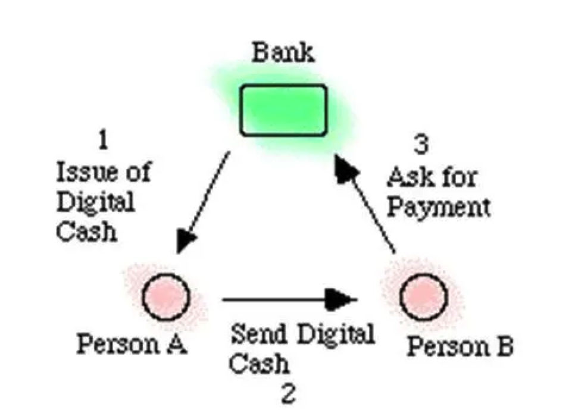
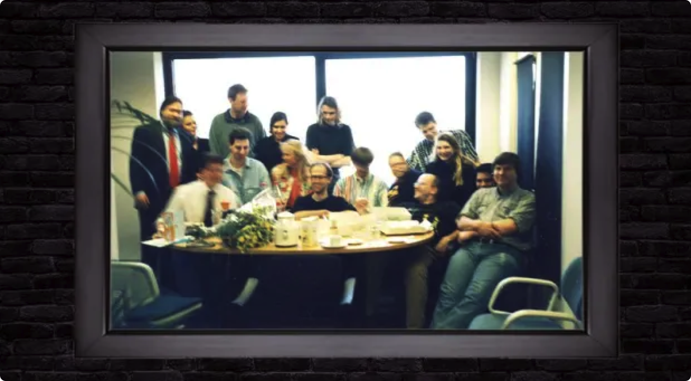

> *作者：Aaron Van Wirdum*
> 
> *来源：<https://bitcoinmagazine.com/culture/genesis-files-how-david-chaums-ecash-spawned-cypherpunk-dream>*

> “你可以给数据库访问付费、用电子邮件买软件和报纸、在网上玩电子游戏、接收朋友之前欠你的 5 块钱，还可以买披萨。可能性是无限的。”

上文引用的这句话不是出自某个 2011 年制作的、介绍比特币的视频。实际上，它完全跟比特币无关。甚至，它不是这个世纪的作品。[引文](https://chaum.com/ecash/articles/1994/05-27-9420-20World_s20first20electronic20cash20payment20over20computer20networks.pdf)来自一位密码学家 David Chaum 在 1994 年日内瓦的[第一次 CERN 大会](http://www94.web.cern.ch/WWW94/welcome.html)上的演讲，他讲的是 eCash。

如果密码朋克运动有一个祖先，那肯定是留着胡子和马尾辫的 David Chaum。说这位密码学家领先于时代 —— 他现在已经 62 还是 63 岁了（他没有暴露过自己的真实年龄）—— 都嫌太轻描淡写了。在大多数人了解到互联网、拥有个人电脑以前，甚至在爱德华·斯诺登（Edward Snowden）、Jacob Appelbaum 和 Pavel Durov 出生以前，Chaum 已经在关心互联网隐私的未来了。

“你必须让你的读者知道这有多重要”，Chaum 曾经跟《连线（Wired）》杂志[这么](https://www.wired.com/1994/12/emoney/)说，“赛博空间完全没有物理限制 …… 没有 ‘墙’ 这种东西 …… 它是个完全不同、诡异奇怪的地方，而且大家都知道这是一个全景监狱似的噩梦。不是吗？其他任何人都可以知道你干过的所有事，甚至可以永久记录下来。这跟民主制的基本原理是对立的。”

Chaum 的职业起于在伯克利担任计算机科学的教授。他不仅仅是一个数字隐私权的鼓吹者，他还设计了工具来实现隐私权。Chaum 出版于 1981 年的论文 “[不可追踪的电子邮件、回邮地址和数字假名](https://chaum.com/publications/chaum-mix.pdf)” 为互联网加密通信的研究奠定了基础；这些研究最终产生了隐私保护的技术，比如 Tor（洋葱网络）。

但日常通信的隐私性还不是 Chaum 最关心的东西。可以说，他还有更大的想法。这个伯克利的教授想设计一种保护隐私的数字货币。

“是把信息保存在个人手里，还是保存在组织手上，每当一个政府或一个公司要把一批事务自动化的时候，都必须做抉择”，Chaum 在 [Scientific American](https://chaum.com/publications/ScientificAmerican-AEP.pdf) 上写道，“下一个世纪的社会形态，可能就取决于哪种技术占据主导地位”。那是 1992 年。

而在 10 年以前（1982），Chaum 已经解决了这个难题：他出版了自己的第二篇重要论文 “[用于不可追踪的支付系统的盲签名](http://www.hit.bme.hu/~buttyan/courses/BMEVIHIM219/2009/Chaum.BlindSigForPayment.1982.PDF)”。那时候，现在比特币圈子里老手如 Pieter Wuille 博士、Erik Voorhees 和 Peter Todd 还没出生呢，这个密码学家就已经为互联网设计出了一套匿名的支付方案。

## 盲签名（Blind Signatures）

Chaum 的数字货币系统的核心是他的发明 “盲签名”。

要理解盲签名，你得先了解公钥密码学，尤其是，（普通的）密码学签名是怎么回事。

公钥密码学会用到密钥对，一个密钥对由一把公钥和一把私钥组成，其中公钥是由私钥（一个真正随机的数字串）根据一定的数学公式计算出来的、（看似随机的）数字串。用私钥推导公钥非常简单，但根据公钥反向计算出私钥则几乎是不可能的；这是一条单行道。

公钥密码学可以用来建构双方之间的隐私通信 —— 学术论文中一般以 “Alice” 和 “Bob” 来代指着两方 —— 只要双方都向对方分享自己的公钥即可。私钥可以保持隐私而不暴露。

但 Alice 和 Bob 能用公钥密码学做的可不止隐私通信。Alice 还可以 “签名” 任意数据（Bob 也是）。实际上，Alice 就是用自己的私钥和数据一起做一些数学运算。结果就是另一串看似随机的字符串，称为 “签名”。同样地，从签名中也是无法恢复出 Alice 的私钥的（无论你是否掌握了那段被签名的数据）。这还是一条单行道。

有意思的是，Bob（乃至其他所有人）都能用 Alice 的公钥来检查这个签名是不是 Alice 生成的（译者注：验证需要被签名的数据）。检验完了 Bob 就知道，到底是不是 Alice 用自己的私钥（以及相应的数据片）生成了这条签名。而私钥可以签名任何数据，也就是说数据可以是 Alice 和 Bob 的任何表态和请求。举个例子，签名可以意味着 Alice 同意该段数据表示的意思（就像 Alice 给合同手写了一个签名一样）。

而盲签名则使这一切更进一步。一开始，Bob 先生成一个随机数，称为 “nonce”，然后拿这个随机数和一段初始数据一起运行特定的数学运算，得出一段乱序的数据片。这个乱序的数据片使其看起来与其它的随机字符串无异。然后 Bob 拿这段乱序数据给 Alice 签名。Alice 没法断定 Bob 的初始数据是什么样的，所以她是 “盲目的”。Alice 签名运算的结果就是 “盲签名”。

盲签名的特殊性在于，这条签名不仅关联着 Alice 的密钥（任何数字签名都有这样的特征）和乱序数据片。它也关联着那段初始的、没有被混淆过的数据。如果能获得那段原始数据，那么任何人仅需使用 Alice 的公钥，就能检查 Alice 是否签名了那段原始数据的一个乱序版本 —— 当然也包括 Alice 自己。

## ECASH

盲签名就是 Chaum 用来创造数字货币系统的关键工具。

要理解这些，你要先把上文示例中的 Alice 当成一个银行：Alice Bank。这是一家普通银行，就像我们现实中的一样，客户们在银行里有专门的账户以及存款。

假设 Alice 银行有四个客户：Bob、Carol、Dan 和 Erin。在假设 Bob 想从 Carol 手上买些东西。

首先，Bob 要向 Alice 银行请求 “取款”（一般来说 Bob 当然要在事先取到钱，但你先不要管这些细节）。取款的时候，Bob 自己创建一些 “电子钞票”，形式是一串独一无二的数字，称作 “序列号”。此外，他还要像上面的例子那样，生成这些钞票的乱序版本，然后把这些乱序支票发给 Alice 银行。

收到 Bob 的乱序钞票后，Alice 银行盲签名每一条乱序数据，然后把这些签名发回给 Bob。每签发一条乱序钞票，Alice 银行就从 Bob 的银行账户扣除 1 块钱。

现在，因为 Alice 银行盲签了这些乱序钞票，她的签名已经与初始的电子钞票关联了起来。所以 Bob 现在可以使用这些初始的、没有经过混淆的钞票给 Carol 支付了。他只需把这些数据发送给 Carol 即可。

Carol 收到这些电子钞票后，转发给 Alice 银行。Alice 可以检查自己是否签名过这些钞票，这也是靠盲签名完成的事：它们都跟她的私钥有关联。Alice 银行也顺带检查同样的钞票（序列号）是否已由他人使用过（自己是否遭遇了多重支付）。

钞票检验完成后，Alice 银行就给 Carol 的账户添加等量的金额，并告知 Carol。经过银行的确认后，Carol 也知道了 Bob 所支付的是有效的钞票，可以放心地发货了。

- eCash 背后的基本原理。来源：<a href="http://faculty.bus.olemiss.edu/breithel/b620s02/riley/Digital20Cash-Web20Page.htm">faculty.bus.olemiss.edu/</a> -

最关键的是，Alice 银行只有在 Carol 要存入这些数字钞票时才会知道未经混淆的钞票数据！因此，Alice 银行根本不知道这些钞票是 Bob 的。理论上，也完全有可能是 Dan 或者 Erin 的！

因此，Chaum 的解决方案提供了支付中的隐私性。在当时，这不算什么新鲜事：那时候隐私支付是常态（译者注：指的是现金交易）。但它是电子形式的，这就是新颖之处。因此，Chaum 选择了这个比喻：现金（cash）。电子化的现金，eCash。

## DIGICASH

到 1990 年，也就是 Chaum 发表第一篇论文差不多 10 年后（现在年轻一辈的密码学货币开发者比如 Matt Corallo、Vitalik Buterin 和 Olaoluwa Osuntokun 也都还没出生），David Chaum 创办了 [DigiCash](https://en.wikipedia.org/wiki/DigiCash) 公司，办在阿姆斯特丹（Amsterdam），Chaum 已在那里生活了好一段时间。这个公司实际上专门做数字货币和支付系统，业务包括一个替代收费亭的政府项目（最终被取消）和智能卡（类似于我们今天的硬件钱包）。但 DigiCash 的旗舰项目还是其数字现金系统 eCash。（这个系统叫做 “eCash”，而系统中所用的货币叫做 “CyberBucks”，相当于我们用大写的 “Bitcoin” 来指称底层的协议，而用小写的 “bitcoin” 来称呼其中的货币。）

- DigiCash 早期的技术团队（Chaum 不在照片中）。来源：<a href="https://chaum.com/ecash/">chaum.com/ecash</a> -

那还是网景（Netscape）和雅虎（Yahoo！）领导科技行业开创新高度的时代，一些人认为微支付而非广告，将成为互联网的收入模式，DigiCash 也被认为是科技企业中冉冉升起的新星。当然，Chaum 和他的团队也对自己的技术很有信心。

“随着网络支付的成熟，你将可以为各式各样的小事情小物件买单，支付会比今天多得多”，1994 年，Chaum 这样跟 [New York Times](https://www.nytimes.com/1994/10/19/business/attention-internet-shoppers-e-cash-is-here.html) 说。当然，他强调了隐私权的重要性。“你读过的每篇文章、问过的每个问题，你都要支付。”

那一年，经过 4 年的开发，第一个成功的支付系统已在[测试](https://chaum.com/ecash/articles/1994/05-27-9420-20World_s20first20electronic20cash20payment20over20computer20networks.pdf)，同年晚些时候，eCash [开始允许试用](https://www.nytimes.com/1994/10/19/business/attention-internet-shoppers-e-cash-is-here.html)：想要使用这种技术的银行，需要向 DigiCash 请求许可。

银行业兴趣盎然。1995 年末，eCash [发出了第一张许可](https://www.nytimes.com/1995/10/23/business/today-shoppers-on-internet-get-access-to-electronic-cash.html)：圣路易斯的 Mark Twain 银行。而且，在 1996 年头，世界上最大的银行之一，德意志银行（Deutsche Bank），也[试水](https://web.archive.org/web/19961102121355/https://www.digicash.com/publish/ec_pres5.html)了。[瑞士信贷（Credit Suisse）](https://www.americanbanker.com/news/credit-suisse-digicash-in-e-commerce-test) 是第二个加入的大机构，还有多个国家的银行，也都加入了，包括：澳大利亚的 [Advance Bank](https://web.archive.org/web/19961102121407/https://www.digicash.com/publish/ec_pres6.html)、挪威的 [Advance Bank](https://web.archive.org/web/19961102121407/https://www.digicash.com/publish/ec_pres6.html) 和 [Bank Austria](https://web.archive.org/web/19970605025912/http://www.digicash.com:80/publish/ec_pres8.html)。

然而，比起 DigiCash 达成的交易，更有趣的可能是他们没有谈成的生意。荷兰三大银行中的两家 —— ING 和 ABN Amro —— [据说](https://web.archive.org/web/19990427142412/https://www.nextmagazine.nl/ecash.htm)已经和 DigiCash 达成了价值几千万美元的合作。类似地，Visa 也被曝出提出了 4000 万美元的投资，而且网景也有兴趣：eCash 本可以放进那个时代最流行的互联网浏览器中。

不过，最能出价不是别人，正是微软。比尔·盖茨希望把 eCash 集成到 Windows 95 操作系统中，据说愿意出价  1 亿美元。Chaum —— 按照故事的说法 —— 要求每卖出一份 Windows 95 就收 2 美元。于是事儿就黄了。

虽然在当时的技术人员眼中不可谓不亮眼，DigiCash 似乎在谈生意上不太利索，因此也难以实现其全部潜能。

到了 1996 年，DigiCash 的员工看过了太多失败的交易，希望有一些改变。办法就是[换个 CEO](https://www.americanbanker.com/news/digicash-sends-signal-by-hiring-visa-veteran)：来自 Visa 的资深人士 Michael Nash。这家初创公司还获得了一笔投资，而 MIT Media Lab 的创始人 Nicholas Negroponte 还被任命为董事会主席。（最近，通过 Digital Currency Initiative 的这一层关系，MIT Media Lab 还聘用了多位 Bitcoin Core 的贡献者。）DigiCash 的总部也从阿姆斯特丹搬到了硅谷。Chaum 还是其中一员，不过变成了 CTO。

事情并无太大改变。几年打拼下来，eCash 并没有被普遍接受。加入的银行一直在实验，才从未力推这门技术；到了 1998 年，Mark Twain 银行只招收了 300 名商家和 5000 位用户。在 DigiCash 与花旗银行（Citibank）的最终协定即将敲定之际 —— 这本来可以给这个项目极大的推动 —— 银行因为不相关的原因而退出了。

“很难获得足够多的商家，所以也没办法获得足够多的消费者。反过来说也是对的。” Chaum 在 1999 年跟 [Forbes](https://www.forbes.com/forbes/welcome/?toURL=https://www.forbes.com/forbes/1999/1101/6411390a.html&refURL=&referrer=#54f14f16715f) 杂志这么说，那时候 DigiCash 已经破产了，“随着互联网变大，用户的平均素质也下降了。所以很难跟他们解释隐私的重要性。”

## 密码朋克的梦想

DigiCash 失败了，连带着 eCash 也失败了。但是，虽然这项技术没有在商业上成功，Chaum 的工作[启发](https://www.cs.princeton.edu/~arvindn/publications/crypto-dream-part1.pdf)了一群密码学家、黑客和活动人士，他们靠着一个邮件列表建立了联系。这个团体里面包含了 DigiCash 贡献者 Nick Szabo 和 Zooko Wilcox-O’Hearn，后来以 “密码朋克” 之名为人所知。

[可能比 Chaum 自己做的还要激进](https://www.youtube.com/watch?v=R4JKSlBWKRY&feature=youtu.be&t=16s)，密码朋克一直怀有创造一种数字现金的梦想；从 1990 年代到 2000 年代早期，他们一直在提出不同的数字现金方案。直到 2008 年，DigiCash 落幕的 10 年后，中本聪把 TA 的数字现金设想（比特币）发到了密码朋克的精神继承者的邮件列表。

比特币和 eCash 在设计视角上没有多少共同点。最重要的是，eCash 有一个中心，就是 DigiCash，光凭自己是没法成为货币的。即使世界上所有人都在交易中使用且仅使用 eCash，你仍然需要银行来提供账户、余额和交易确认。这也意味着 eCash 虽然能提供隐私性，但并不是抗审查的。举个例子，即使面临银行的封锁，比特币仍能用于给维基解密捐赠，但 eCash 就做不到，银行一样能锁住维基解密的账号。

但是，Chaum 对数字货币的贡献，可以追溯到 1980 年代早期，仍然能有意义的。比特币没有使用盲签名技术，但建构在比特币协议上的扩展处理层和隐私层可以使用。[ Bitcointalk](https://bitcointalk.org/) 论坛和 reddit 论坛子版块 [r/bitcoin](https://www.reddit.com/r/Bitcoin/) 版主 Theymos，一直倡议在比特币区块链上开发[一种类似于 eCash 的可扩展侧链](https://www.reddit.com/r/Bitcoin/comments/5ksu3o/blinded_bearer_certificates/)。比特币交易隐私领域的[带头人之一](https://medium.com/@nopara73/summary-privacy-work-in-cryptocurrencies-703d5e2231e6) Adam Fiscor 也在[实现](https://bitcoinmagazine.com/articles/hiddenwallet-and-samourai-wallet-join-forces-make-bitcoin-private-zerolink)一种使用盲签名的混币服务（这种思路最早是由 Bitcoin Core 贡献者 Greg Maxwell [提议的](https://bitcointalk.org/index.php?topic=279249.0)）。当前尚未落地的闪电网络，也可以使用盲签名来提高安全性。（译者注：原文写于 2018 年 4 月。）

那 Chaum 自己呢？他回到了伯克利，在那里写出了[等身的著作](https://chaum.com/publications/publications.html)，大部分都跟数字化选举和声誉系统有关。也许，再过 20 年，全新一代的开发者、企业家和活动人士，把这些著作奉为某项足以改变世界的技术的奠基工作。

*本文部分基于两篇在 1990 年代出版的文章：Steven Levy 为《连线》杂志撰写的文章 《[E-Money (That’s What I Want)](https://www.wired.com/1994/12/emoney/)》，还有未具名作者为 《Next! Magazine》撰写的《[Hoe DigiCash alles verknalde](https://web.archive.org/web/19990427142412/https://www.nextmagazine.nl/ecash.htm)》（译本在此：《[How DigiCash Blew Everything](https://cryptome.org/jya/digicrash.htm) 》。）[ chaum.com/ecash](https://chaum.com/ecash/) 网站亦提供了丰富的信息。*

（完）

