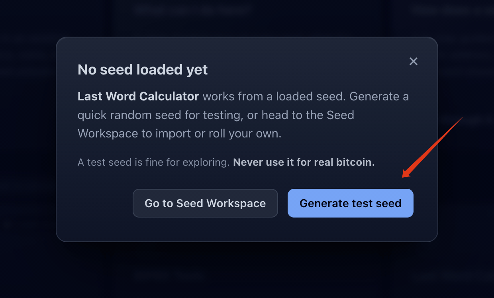
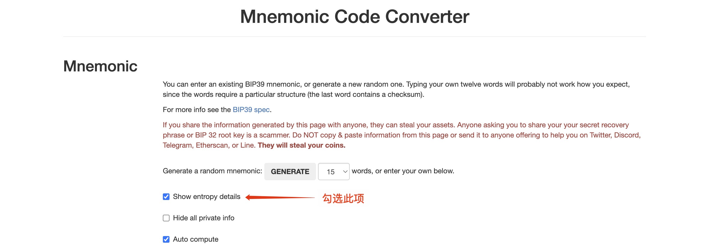
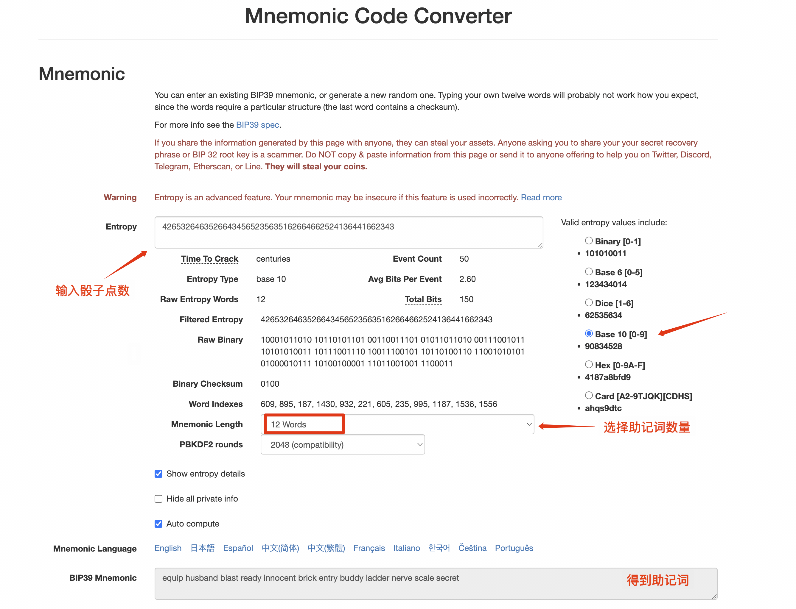

> *作者：Mi Zeng*


> Trusted third parties are security holes. 受信任的第三方是个安全漏洞。—— 尼克·萨博

当你在任何一款密码学货币钱包里点击 “创建钱包” 时，屏幕上通常会弹出一串由 12 个或 24 个英文单词组成的助记词。同时郑重地提醒你：抄在纸上，妥善保管，不要截屏或拍照。大多数人理所当然地接受了这套流程，却很少深究其背后的原理：这串决定资产归属权的单词，究竟是怎么产生的？

答案藏在一个你看不见摸不着，也无法验证它是否可靠的黑盒里：钱包内置的随机数生成器。从你点击创建按钮的那一刻起，资产的安全就全部押注在了对它的信任之上。那么，随机数与助记词之间，到底是什么关系？我们又如何摆脱对这个黑盒的盲目信任呢？

这篇文章将从助记词的数学原理开始讲起，拆解随机数从何而来，又是如何一步步变成助记词的。随后会详细演示两种纯物理的实操方案：如何通过扔硬币或掷骰子的方式，产生一段绝对属于你自己的真随机数，并把它安全转化为标准的 12 或 24 个助记词，完全摆脱对任何随机数生成器的依赖。

文章较长，如果你只想快速了解如何利用纯物理方式生成助记词，可直接跳转到[「实践指南」](#实践指南)章节。

## 背景：脆弱的盲盒与免疫的骰子

对芯片随机数的盲目信任，在密码学历史上屡次付出过惨痛代价。

2026 年 7 月底，知名的比特币硬件签名器 Coldcard 曝光了一个潜伏了五年的安全漏洞：它的固件在一次代码重构中因为写错了检查条件，导致生成钱包种子的时候，没有正确调用硬件上的随机数生成器，而是使用了一个极弱的软件伪随机数生成器。这个漏洞带来了灾难性的结果，在受影响最严重的旧型号 Mk2/Mk3 上生成的私钥，有效熵的上限只剩大约 40 位，实际可能更低。在现代显卡算力面前，这个量级的随机空间形同虚设，攻击者甚至无需接触物理设备，只需要凭借自己的算力暴力枚举，就在短时间内从一千多个钱包中盗走了上千枚比特币。

类似的事故屡见不鲜。2023 年曝光的 Milk Sad 漏洞几乎是同一个剧本：Libbitcoin Explorer 这款命令行工具拿系统时间当随机数种子，实际熵只有 32 位。攻击者把整个空间扫荡一遍，轻易盗走了海量的比特币资产。

这些事故暴露了一个残酷的事实：助记词的表面形态，具有极强的欺骗性。

一组仅有 40 位熵的残缺助记词，与一组具备 128 位完整强度的助记词，在肉眼看来毫无二致 —— 同样是 12 个标准的英文单词，同样能正常导入钱包、生成地址并广播交易。随机性的缺陷埋在最底层，直到被盗才会被察觉。

在 Coldcard 的安全公告中，有这样一段说明：

> “如果你在创建种子时输入了至少 50 次公平且独立的掷骰子结果，且这些结果未被记录或泄露，我们认为仅凭这一随机数生成器问题，所生成的种子并不存在风险。”

表面上看，这行公告极具讽刺意味：在最关键的安全问题上，几颗塑料骰子击败了 “精心设计” 的代码工程。但这绝非侥幸的运气。要理解为什么最原始的物理工具能抵御复杂的固件灾难，必须先回到密码学最底层的基石：当我们谈论“随机数”时，我们究竟在要求什么？

## 密码学里的随机性

在日常经验中，人们习惯将 “看起来混乱” 当成随机。但在密码学中，随机性的定义只有一个：**不可预测**。

圆周率小数点后上百万位分布均匀、肉眼看不出规律，但如果用它某一段当私钥，资产很快就会被盗。因为圆周率公开且确定，攻击者查字典即可遍历，它的密码学熵为零。

反之，`00000000000000000000000000000001` 这样的序列看似规律极强，但只要它来自一个足够庞大且不可预测的集合，那它就和任何看似杂乱的字符串具有相同的安全强度，因为攻击者没有任何理由优先尝试它。

衡量随机数强度的指标是熵（Entropy），单位是比特（Bit）。每增加 1 比特，搜索空间就翻一倍，攻击者猜中的难度也随之翻倍：


| 熵值规模    | 潜在可能性空间                                | 现实攻防与物理感知                    |
| ------- | -------------------------------------- | ---------------------------- |
| 1 bit   | $2^1 = 2$ 种                            | 抛一次硬币，猜中概率 50%               |
| 3 bit   | $2^3 = 8$ 种                            | 掷一次八面骰，眨眼即可试完                |
| 8 bit   | $2^8 = 256$ 种                          | 计算机中 1 个字节的所有状态，肉眼与口算即可全量遍历  |
| 32 bit  | $2^{32} \approx 4.29 \times 10^9$ 种    | 家用 CPU 短时间内即可跑完（Milk Sad 案例） |
| 40 bit  | $2^{40} \approx 1.1 \times 10^{12}$ 种  | 显卡/矿机集群短时间内即可穷举（Coldcard 案例） |
| 64 bit  | $2^{64} \approx 1.8 \times 10^{19}$ 种  | 算力集群可在有限时间内暴力攻破              |
| 128 bit | $2^{128} \approx 3.4 \times 10^{38}$ 种 | 现有算力在宇宙尺度下无法穷举（密码学标准基准）      |


理解了随机性的本质，那么随之而来的问题是：随机性究竟从何而来？我们该去哪里捕获真正的熵？

在计算机与密码学领域，熵的来源其实多种多样：

- 最基础的是依赖纯软件算法的伪随机数发生器（PRNG），通过系统时间或种子进行数学变换（正如 Milk Sad 漏洞中所暴露的那样，极易被逆向枚举）；
- 更安全的做法是依赖硬件芯片内置的真随机数发生器（TRNG），通过微观的物理现象（如电子热噪声、振荡器之间的微小时钟抖动）来捕获物理熵；
- 一些软件钱包或硬件签名器，还会允许你主动引入现实世界的物理输入 —— 比如用摄像头拍一张照片提取光电噪点、在触摸屏上随意乱划手指记录运动轨迹、通过麦克风录制环境杂音、甚至在空中任意摇晃设备采集陀螺仪的微小读数。

理论上，利用物理信号捕获的随机性已经足够安全。但只要依赖软硬件工具，就始终存在一个共同的痛点：这些物理信号最终依然要经由固件程序的采样与处理，封装在一个普通人难以验证的黑盒里。正如 Coldcard 的致命漏洞在它开源的固件里静静躺了整整五年 —— 只要代码逻辑上稍有疏漏，芯片内部原本指望的真实物理信号就会在不知不觉中被绕开，悄然回退到脆弱的伪随机状态，而屏幕前的我们根本无法感知。

正因如此，最贴近我们日常、也最纯粹的物理熵来源，反而是书桌上随处可见的硬币与骰子。它们不仅极易获取，而且在统计上具备天然的概率均匀性。在公平独立的前提下，一枚硬币正反两面均等的出现概率，使得每一次投掷都能为你提供恰好 1 个比特的真随机熵。它们没有固件，也不会有某行代码在某次版本迭代中被悄悄改错，整个物理过程完全在你的眼皮底下真实发生。

那么，如何将桌面上掷出的这种物理随机性，一步步严谨地转化为符合行业标准的 BIP39 助记词？

## BIP39：从随机数到助记词

比特币社区在 2013 年提出了 BIP39 提案，制定了一套标准规则，把计算机底层的二进制随机数映射为人类易读的英文单词。我们在绝大多数密码学钱包里使用的助记词，都遵循这一标准。

BIP39 的英文单词表里一共有 2048 个单词。而在二进制数学中，恰好 $2048 = 2^{11}$，这意味着只需要一个 11 位的二进制数字，就能够表示从 0 到 2047 之间的任意一个数字，从而精确对应词表里的一个单词。比如：

- `00000000000` = 0（对应第 1 个词 `abandon`）
- `00000000001` = 1（对应第 2 个词 `ability`）
- ……
- `11111111111` = 2047（对应第 2048 个词 `zoo`）

我们常见的助记词通常由 12 个或 24 个单词组成。那么理论上，12 个单词的助记词需要 $12 \times 11 = 132$ 位二进制随机数，而 24 个单词的助记词则需要 $24 \times 11 = 264$ 位二进制随机数。

但在通用的行业标准中，生成 12 词助记词实际上只需要提供 128 位的原始熵，24 词助记词只需要提供 256 位。这中间的差额是怎么回事？

这里就轮到校验和（Checksum）出场了。

具体做法很直接：拿 12 词的助记词来说，BIP39 会对最初的 128 位随机数做一次 SHA-256 哈希计算，取出哈希结果最前面的 4 位，拼在原来 128 位的末尾，

$128\text{ bit 随机数} + 4\text{ bit 校验和} = 132\text{ bit}$

132 位切成 12 组，每组 11 位，正好对应 12 个单词。

24 个词也是完全相同的逻辑，

$256\text{ bit 随机数} + 8\text{ bit 校验和} = 264\text{ bit}$

$264 \div 11 = 24$，正好对应 24 个单词。

根据 BIP39 给出的通用规则，校验和长度永远等于原始熵位数除以 32。所以 128 位随机数配 4 位校验和，256 位随机数配 8 位校验和。

不过，校验和的价值不只是用来补齐位数，它最核心的作用是防范人为录入错误，充当助记词内置的质检员。有了它，绝大多数单词拼写错误或顺序颠倒，都会使 SHA-256 哈希值发生改变，导致钱包在导入时校验失败、当场报错。这能在第一时间拦截绝大部分笔误，为手头抄写的准确性加上一道关键防线。

理清了随机数的切分与校验和，整个 BIP39 助记词的生成过程就一目了然了：

```
以 12 词助记词为例，24 词背后的转换逻辑完全一致。

获得 128 位真随机数（原始物理熵）
      ↓
执行 SHA-256 哈希，提取前 4 位作为 Checksum
      ↓
拼接生成 132 位数据块（128 位熵 + 4 位 Checksum）
      ↓
按每 11 位一组切分为 12 组
      ↓
换算为 0 至 2047 的十进制数值并查对 BIP39 词表
      ↓
输出最终的 12 个助记词

```

> 实际上，BIP39 标准一共定义了 12、15、18、21 和 24 个单词五种规格。由于 12 词与 24 词在钱包生态中最为常见且通用，因此本文仅拿这两种规格进行举例。

至此，纸上谈兵告一段落。接下来，让我们清空桌面，拿起硬币或骰子，正式进入纯手工生成助记词的实操环节。

## 实践指南

本章节将介绍两种通过扔硬币或掷骰子来生成助记词的方案。

1. **映射法**：既然我们已经知晓了二进制的随机数是如何映射到 BIP39 助记词表中的，那么只要通过物理方式获得这一串二进制的随机数，再在词表中逐一查找对应的单词，就能得到最终的助记词。
2. **熵提取法**（下文简称提取法）：这一方法可以完整利用骰子的多面结果，大幅减少投掷次数。但由于骰子点数无法手工换算为二进制，因此必须将投掷记录交给离线工具，由工具从中提取出熵并直接给出助记词。


| 比较维度   | 映射法                         | 提取法                     |
| ------ | --------------------------- | ----------------------- |
| 做法     | 抛出的位直接当熵，自己查词表              | 把投掷记录交给工具，由工具算出助记词      |
| 适合谁    | 想完全自己动手、自己验证的人              | 手上已有支持工具、希望简单高效的人       |
| 投掷次数   | 硬币模式下，12 词 128 次，24 词 256 次 | 12 词 50 次，24 词 99/100 次 |
| 手工计算   | 需计算并查 12 或 24 次词表           | 几乎没有                    |
| 能否肉眼验证 | 可以，每一步都能对照                  | 不能，必须靠交叉验证              |


无论是映射法还是提取法，你最终获得的安全保障是一致的。不过，如果你是第一次尝试物理生成助记词，建议先用映射法走一遍完整的流程，哪怕只是练手，也会让你对背后的原理更加熟悉。

### 方法一：映射法

映射法的思路最直白：硬币和骰子只负责产出 0 和 1 的二进制随机数，你亲手把二进制转换成十进制序号，再在 BIP39 助记词表中查出对应的单词。除最后一步需要工具辅助计算校验和外，全流程完全由手工与纸笔完成。这是信任最小化的方案。

#### 前期准备

- 一枚硬币，或者一颗/多颗六面骰子
- 一张白纸与一支笔（用于记录与换算）
- 一份 BIP39 英文词表（可以直接在手机/电脑上打开[官方 BIP 仓库](https://github.com/bitcoin/bips/blob/master/bip-0039/english.txt) 查阅，也可提前打印好带序号的版本）
- 一台离线的计算机（提前下载好离线网页工具，并在断网后打开）
- 你日常准备使用的钱包软件/硬件签名器


#### 第一步：约定抛硬币/掷骰子的规则

动手前，根据你选择的工具定死转换规则，并将规则写在一张小卡片上摆在桌边，全程严格遵循，切忌中途随意调整：

对于抛硬币，我们约定正面记 1，反面记 0（反过来也行，重要的是从头到尾保持一致）。每抛一次，即可得到 1 比特的真随机数。

对于掷骰子，我们有两种方式来获得二进制的随机数。

**方法一：等概率二分法**。把骰子当成硬币用，约定所有奇数点数（1、3、5）记为 1，偶数点数（2、4、6）记为 0。这样每掷一次骰子出现 0 或 1 的概率各为 1/2。（也可约定 123 为 1、456 为 0，只要两种结果概率均等即可）。

**方法二：拒绝采样法**。巧妙利用六面骰的多面特性来减少投掷工作量。在一枚公平的骰子中，1、2、3、4 出现的概率均等。对于投掷的结果，我们只保留 1、2、3、4 四个点数，投出 5 或 6 则作废重掷（拒绝采样）。约定：

```
1 = 00    2 = 01    3 = 10    4 = 11
```

这样一来，每一次有效抛掷就能产生一个 2 比特的随机数，速度比硬币快不少。代价是要忍受约 1/3 的结果被作废重掷。

**进阶方法：使用八面骰子**。如果你手里刚好有桌游常见的八面骰子，事情会更加高效。因为 $8 = 2^3$，它天然拥有八种概率相等的状态，恰好对应 3 比特的所有组合。我们可以直接约定：

```text
1 = 000    2 = 001    3 = 010    4 = 011
5 = 100    6 = 101    7 = 110    8 = 111
```

每投一次都能稳定产出 3 比特的结果，全部保留，没有浪费。不过，由于 128 和 256 不是 3 的倍数，生成 12 词需要掷 43 次（丢弃最后 1 位），生成 24 词则需要掷 86 次（丢弃最后 2 位），舍弃末尾位完全不会影响前面的随机性。

#### 第二步：画一张结果记录表

在白纸上画一张 12 行（若生成 24 词则画 24 行）、每行 11 格的表格，并在上方标注二进制权值。示例：


| 序号     | 1024 | 512 | 256 | 128 | 64  | 32  | 16  | 8   | 4   | 2   | 1   |
| ------ | ---- | --- | --- | --- | --- | --- | --- | --- | --- | --- | --- |
| 第 1 词  | ·    | ·   | ·   | ·   | ·   | ·   | ·   | ·   | ·   | ·   | ·   |
| 第 2 词  | ·    | ·   | ·   | ·   | ·   | ·   | ·   | ·   | ·   | ·   | ·   |
| 第 3 词  | ·    | ·   | ·   | ·   | ·   | ·   | ·   | ·   | ·   | ·   | ·   |
| 第 4 词  | ·    | ·   | ·   | ·   | ·   | ·   | ·   | ·   | ·   | ·   | ·   |
| 第 5 词  | ·    | ·   | ·   | ·   | ·   | ·   | ·   | ·   | ·   | ·   | ·   |
| 第 6 词  | ·    | ·   | ·   | ·   | ·   | ·   | ·   | ·   | ·   | ·   | ·   |
| 第 7 词  | ·    | ·   | ·   | ·   | ·   | ·   | ·   | ·   | ·   | ·   | ·   |
| 第 8 词  | ·    | ·   | ·   | ·   | ·   | ·   | ·   | ·   | ·   | ·   | ·   |
| 第 9 词  | ·    | ·   | ·   | ·   | ·   | ·   | ·   | ·   | ·   | ·   | ·   |
| 第 10 词 | ·    | ·   | ·   | ·   | ·   | ·   | ·   | ·   | ·   | ·   | ·   |
| 第 11 词 | ·    | ·   | ·   | ·   | ·   | ·   | ·   | ·   | ·   | ·   | ·   |
| 第 12 词 | ·    | ·   | ·   | ·   | ·   | ·   | ·   | ·   | ·   | ·   | ·   |


#### 第三步：抛出结果并记录

现在，可以开始动手创造随机数啦！

为了确保纯粹的物理随机性，请注意投掷手法：抛硬币时要有足够的高度让其在空中充分翻转（并自由落地）；掷骰子建议放入杯子/骰盅充分摇匀后倒出。

无论是扔硬币还是掷骰子，你都需要将每一次结果准确无误地记录在表格里。从第 1 词第一格开始，从左到右、逐行往下填入 0 或 1。

- **12 词助记词**：填满前 11 行（共 121 位），第 12 行只填前 7 格，后 4 格留空（合计 128 位物理熵）。
- **24 词助记词**：填满前 23 行（共 253 位），第 24 行只填前 3 格，后 8 格留空（合计 256 位物理熵）。

如果你觉得一颗一颗抛太慢，完全可以同时投掷多颗骰子。唯一的要求是：必须保持读取顺序的一致性。比如在桌面上一律从左到右读取。绝不能按个人喜好挑拣读取顺序。

在记录过程中，有两条纪律必须严格执行：

- 无论结果是 0 还是 1，每一格都必须填写，不能留空。
- 已经写下的数字绝对不要回头修正，否则你就人为破坏了这种随机性。连续出现多个相同的数字是真随机在统计上的正常表现，如实记录即可。


#### 第四步：计算十进制序号，查询词表

完成所有的投掷工作后，就要开始计算每一行的结果对应哪一个单词了。

这里涉及到一个非常简单的计算题，如何将二进制转换为十进制？其实，你在一开始画好的表格表头，已经帮你完成了大部分工作。

只需要把每一行里所有记了 1 的格子上方的权值相加，就能得到一个 0 到 2047 之间的数字。比如第一行结果是 10111011100，累加求和为 1024 + 256 + 128 + 64 + 16 + 8 + 4 = 1500。接下来在助记词表中寻找序号对应的单词就好了。

考虑到不同第三方词表的排版和序号差异，为了保证教程的统一性与长期有效性，本指南将以[官方 BIP 仓库](https://github.com/bitcoin/bips/blob/master/bip-0039/english.txt)里的单词表来演示。由于该词表的行号是从 1 到 2048，所以你需要把算出来的数字加 1 去寻找对应单词：比如算出的结果是 1500，就在词表中找到第 1501 行的单词即可。如果你使用的是序号从 0 开始标注的词表，则省掉加 1 这步，直接按算出来的十进制结果查词。

注意：若直接在电脑或手机屏幕上查词，请仅通过鼠标滚轮或手指滑动肉眼翻找，切勿使用浏览器的 `Ctrl+F` 搜索框去搜单词或行号。这些内容都是你私钥的一部分，绝不应以任何形式输入到联网设备。

逐行换算，把查到的英文单词工整地抄在纸上，这样你就拿到了前 11/23 个单词。

**物理随机数记录与单词换算示范表（12 词示例）**


| 序号     | 1024 | 512 | 256 | 128 | 64  | 32  | 16  | 8   | 4   | 2   | 1   | 权值累加结果                        | 词表行号 (+1) | 对应单词       |
| ------ | ---- | --- | --- | --- | --- | --- | --- | --- | --- | --- | --- | ----------------------------- | --------- | ---------- |
| 第 1 词  | 1    | 0   | 1   | 1   | 1   | 0   | 1   | 1   | 1   | 0   | 0   | 1024+256+128+64+16+8+4 = 1500 | 1501      | romance    |
| 第 2 词  | 0    | 0   | 1   | 0   | 0   | 0   | 0   | 0   | 1   | 0   | 0   | 256+4 = 260                   | 261       | calm       |
| 第 3 词  | 0    | 1   | 0   | 1   | 0   | 0   | 1   | 0   | 1   | 0   | 0   | 512+128+16+4 = 660            | 661       | family     |
| 第 4 词  | 0    | 0   | 1   | 1   | 0   | 1   | 1   | 1   | 0   | 0   | 1   | 256+128+32+16+8+1 = 441       | 442       | damp       |
| 第 5 词  | 1    | 0   | 1   | 0   | 1   | 1   | 0   | 0   | 0   | 1   | 1   | 1024+256+64+32+2+1 = 1379     | 1380      | property   |
| 第 6 词  | 1    | 1   | 0   | 0   | 0   | 1   | 0   | 0   | 0   | 1   | 1   | 1024+512+32+2+1 = 1571        | 1572      | settle     |
| 第 7 词  | 0    | 1   | 1   | 0   | 0   | 1   | 0   | 1   | 1   | 0   | 1   | 512+256+32+8+4+1 = 813        | 814       | grant      |
| 第 8 词  | 1    | 0   | 0   | 0   | 1   | 0   | 0   | 1   | 1   | 1   | 1   | 1024+64+8+4+2+1 = 1103        | 1104      | measure    |
| 第 9 词  | 0    | 0   | 0   | 1   | 0   | 0   | 0   | 1   | 1   | 0   | 0   | 128+8+4 = 140                 | 141       | bag        |
| 第 10 词 | 1    | 0   | 0   | 1   | 0   | 1   | 0   | 1   | 1   | 0   | 1   | 1024+128+32+8+4+1 = 1197      | 1198      | noble      |
| 第 11 词 | 0    | 1   | 1   | 1   | 1   | 0   | 0   | 1   | 0   | 1   | 0   | 512+256+128+64+8+2 = 970      | 971       | junk       |
| 第 12 词 | 0    | 0   | 0   | 0   | 0   | 0   | 1   | —   | —   | —   | —   | *(前 7 格物理熵，后 4 格留空)*          | —         | *(待第五步计算)* |


接下来，建议花两分钟时间从后往前倒着核对一遍加法与序号。若加法算错，后续工具不会报错，依然会为错误的单词算出合法校验和；而倒序检查能有效避开大脑的顺读惯性，防止抄错。

#### 第五步：确定最后一个词并完成双重验证

拿到前 11/23 个单词后，最后一个词无法直接查表得出 —— 它需要由你抛出的最后几位物理熵与 SHA-256 校验和共同组合而成。虽然理论上手算 SHA-256 并非不可能（确实有人[这么干过](https://armantheparman.com/sha256/)），但极其繁琐且极易出错，不推荐任何普通人尝试。因此在这一步，最稳妥的做法是借助轻量级的离线工具来完成计算。

##### 1. 计算最后一个词

关于离线工具的选择，截至本教程发出时，只有两款主流工具支持 “输入前 11/23 个词，加最后几个物理熵来计算最后一个单词”，分别是：

- **离线单网页工具**：[Bitcoiner.Guide 的 Seed Tool](https://github.com/BitcoinQnA/seedtool/releases)
- **开源硬件签名器**：[SeedSigner](https://seedsigner.com/)

此外，像社区里使用广泛的 [Iancoleman 离线网页工具](https://github.com/iancoleman/bip39/releases)、软件钱包 BlueWallet（[教程](https://bluewallet.io/docs/manual-entropy/)）、硬件签名器 Krux（[教程](https://selfcustody.github.io/krux/getting-started/usage/loading-a-mnemonic/#tinyseed-bits)）等，都要求输入完整的 128 / 256 位物理熵来生成整套助记词，无法直接使用前面已算出的 11/23 个前缀单词。

考虑到手工录入上百位二进制字符的过程容易犯错，出于零设备门槛、操作直观与减少失误的考量，本章节以 Bitcoiner.Guide 的 Seed Tool 作为标准示范。具体流程如下：

1. **下载与验证**：访问 [Bitcoiner.Guide Seed Tool 官方发布页](https://github.com/BitcoinQnA/seedtool/releases)，下载网页工具文件 `index.html` 及其哈希签名 `signature.txt`，按照发布页的指示完成签名验证。
2. **转移至离线电脑**：使用 U 盘将该 HTML 文件复制到一台完全断网的离线计算机（关闭 Wi-Fi 与蓝牙，拔掉网线），在浏览器的无痕窗口中打开该页面。
3. **进入计算页面**：点击页面上的 Last Word Calculator 标签页，在弹出的窗口中选择 Generate test seed。
  
   
4. **输入纸上的记录**：在 Last Word Calculator 页面选择要生成的助记词数量，然后点击 Flip the bits 上方的圆形按钮，点击切换对应的 `0` 或 `1`，输入最后几位物理熵的结果。然后，在下方的单词框里，逐个输入你在纸上查好的前 11/23 个单词（输入框支持单词联想补全），工具会完成 SHA-256 计算，显示出最后一个单词：


5. **抄写最后一词**：将该单词抄写在记录表的最后一格。不要对网页上的内容进行任何复制操作。

操作完毕后，不要忘记彻底消除数据残留：关闭无痕标签页，直接退出浏览器程序以释放 RAM 内存，然后重启这台离线计算机，彻底清空物理内存与临时交换区。如果你担心这台电脑中存在流氓软件、剪贴板监控或硬盘缓存残留，建议使用写入了 Tails OS 的 U 盘来引导启动 —— 这类系统完全运行在内存中，拔掉 U 盘、电脑关机后内存数据瞬间彻底销毁，能显著降低本地持久化的风险。

如果你手头上正好有 SeedSigner，更推荐直接使用 SeedSigner 来完成这一步骤。因为这不仅免去了配置离线计算机的繁琐，而且它 “断电即忘” 的纯粹无状态特性，能从物理上彻底隔绝通用操作系统的安全风险与缓存残留。具体路径：`Tools → Calc 12th/24th word → 选择 12/24 words → 输入前缀助记词 → 选择 Coin flip entropy → 按屏幕提示录入最后 7/3 次硬币正反面`，即可在硬件屏幕上直接获得最后一个单词。

##### 2. 在目标钱包中完成双重验证

在得到纸面上完整的 12 或 24 个助记词后，我们还需要进行最终的验证：

打开你日常准备使用的**离线**钱包软件或硬件签名器，选择“导入/恢复助记词”，输入纸上记录的完整助记词。

所有遵循 BIP39 标准的钱包，在导入时都会自动强制执行 SHA-256 校验和检查。由于前 11/23 个单词完全由纸上推导而来，离线工具根本没有篡改的空间；只要目标钱包顺利识别、未弹出校验错误（如 Invalid Checksum、助记词无效等），即可验证我们计算出的最后一个单词准确无误。

至此，映射法全部完成。恭喜你成功告别了随机数盲盒，亲手创造了一组 100% 的物理真随机助记词！下一步，就是妥善备份这组来之不易的助记词了。关于助记词备份的注意事项，推荐阅读 [《助记词备份指南》](https://www.btcstudy.org/2022/05/07/how-to-back-up-a-seed-phrase/)，本教程不再展开。

##### 3. 另辟蹊径

以上是通过映射法获取完整助记词的通用流程。不过，如果你的目标只是生成 12 词助记词，那么还有一种方式，让你可以彻底绕开离线计算工具，直接试出最后一个单词。

在前面介绍原理的章节中，我们已经知道：在 12 词体系中，第 12 行的 11 个格子里，前 7 格来自你物理抛出的硬币，只有后 4 格是校验和。因为 4 个格子只有 $2^4 = 16$ 种可能（对应数值 0 到 15），这意味着在 2048 个完整词表里，符合你前 7 位物理熵的单词，刚好只有连续的 16 个候选词！在这 16 个候选词中，有且仅有 1 个词能满足校验和。

我们可以将第 12 行前 7 格里的数字按照上方权值相加，得到数值 N。由于官方词表的行号从 1 开始，这 16 个连续候选词就落在第 N+1 行到第 N+16 行之间。以上文示范表为例：第 12 行前 7 格抛出了 `0000001`，累加权值为 `16`。那么候选词就是官方词表中第 17 行到第 32 行（`acoustic` 至 `advance`）的这 16 个连续英文单词。

接下来，你只需要打开目标钱包，选择 “导入/恢复助记词”，输好前 11 个词后，按顺序挨个将这 16 个候选词填入第 12 格尝试 —— 有且仅有 1 个词能通过校验，而唯一导入成功、未报错的那个就是你要找的最后一个助记词。

*(注：24 词助记词的校验和长达 8 位，候选词多达 256 个，手工挨个尝试不太现实，因此依然建议使用离线工具进行计算。)*

##### 4. 补充说明

你可能会发现，像 Foundation Passport、Blockstream Jade 等硬件签名器，以及部分软件钱包，都提供了“计算最后一个词”的功能。在底层实现上，这些工具在处理最后这一步时，通常有以下两种典型逻辑：

1. **给出候选列表让你挑选**：因为前 11/23 个单词只提供了部分物理熵，在数学上符合校验和的合法单词其实有多个选项（12 词模式下有多达 128 个候选词，24 词模式下有 8 个候选词），像 BitBox02（24 词模式）或 Coldcard 等工具，会把这些合法词全部列在屏幕上，让你自行挑选一个；
2. **自动补齐缺失的熵**：另一部分工具会调用随机数发生器，自动帮你把最后缺少的几位熵补齐，然后算出最后一个单词给你；而像 SeedPicker 这样的工具，会自动用 0 来补齐缺失的熵，从而确认最后一个单词。

相比专门去配置一台离线的计算机，上述工具的操作门槛确实更低，生成的助记词也具备足够高的安全强度。但本教程之所以没有将这些方式作为主推方案，纯粹是因为它们跳过了最后那几次物理熵值的手工输入，无法与你在桌面上最后抛出的几次结果做到精准的一一映射。

### 方法二：提取法

在映射法中，我们花费精力把骰子点数 “折算” 成二进制，要么舍弃了 5 和 6 这两个面，要么只取奇偶，没办法充分利用骰子的全部六个面。而如今，不少硬件签名器和软件钱包都支持直接输入六面骰子的完整投掷结果来生成助记词。背后的原理很简单：

一枚标准的六面骰子（D6），每次投掷能提供约 2.585 比特的熵（$\log_2 6 \approx 2.585$）。提取法省去了把点数换算成二进制这一步，直接把一整串投掷结果作为原始字符串交给工具，工具对它做一次标准的 SHA-256 哈希计算，将散落在几十次投掷中的物理熵压缩映射为 BIP39 所需的熵，进而计算出完整的 12 或 24 个助记词。

这种方法大幅减少了投掷次数，也免去了手工查词表的繁重工作。但它的代价是计算过程交给了工具，肉眼无法直观验证，因此必须进行严格的交叉验证。

#### 前期准备

- 一颗或多颗六面骰子
- 一个骰盅或塑料杯，以及带边框的托盘（确保骰子能充分翻滚反弹，避免人为投掷手法影响随机性，同时也防止骰子滚落地面）
- 一张白纸与一支笔（用于记录每一次投掷的点数）
- 两款相互独立的离线工具（用于交叉验证）

#### 第一步：确定投掷次数与规则

首先，你需要根据需要的助记词长度确定投掷总次数。前面提到，每次投掷能提供约 2.585 比特的熵，因此：

- **12 个单词**：掷 50 次（$50 \times 2.585 \approx 129.25$ 比特熵，已超过所需的 128 比特门槛）
- **24 个单词**：掷 99 次（$99 \times 2.585 \approx 255.91$ 比特熵，在密码学安全性上已经完全足够；社区主流工具统一规范为 99 次，核心是为了多方交叉验证的兼容性。部分工具追求理论上绝对满 256 位熵，因此会要求掷 100 次。）

在投掷过程中，必须严格遵守以下物理规则：

1. **固定读取顺序**：若同时投掷多颗骰子，必须预先定好读取顺序（例如从左至右、从上至下），落定后严禁因为喜好而调整顺序。
2. **充分翻滚**：将骰子置于杯中用力摇晃后倒扣在托盘内，避免手法惯性影响概率。
3. **如实记录**：即使连出几个相同的点数，也必须如实记录；一旦人为重掷或挑选，物理随机性就被破坏了。

#### 第二步：画一张点数记录表并连续记录

为了避免在连续投掷几十次的过程中数错次数或漏填，在纸上预先绘制网格记录表。每 10 次投掷划为一行：

- **12 词（50 次）**：画 5 行，每行 10 格。
- **24 词（99 次）**：画 10 行，每行 10 格（第 10 行最后一格留空不填）。

逐次投掷骰子，将每次朝上的点数（1 至 6）如实填入表格中。示例：


| 投掷批次      | 1   | 2   | 3   | 4   | 5   | 6   | 7   | 8   | 9   | 10  |
| --------- | --- | --- | --- | --- | --- | --- | --- | --- | --- | --- |
| 第 1–10 次  | 4   | 2   | 6   | 5   | 3   | 2   | 6   | 4   | 6   | 3   |
| 第 11–20 次 | 5   | 2   | 6   | 6   | 4   | 3   | 4   | 5   | 6   | 5   |
| 第 21–30 次 | 2   | 3   | 5   | 6   | 3   | 5   | 1   | 6   | 2   | 6   |
| 第 31–40 次 | 6   | 4   | 6   | 6   | 2   | 5   | 2   | 4   | 1   | 3   |
| 第 41–50 次 | 6   | 4   | 4   | 1   | 6   | 6   | 2   | 3   | 4   | 3   |


#### 第三步：选择离线工具、生成助记词并交叉核验

记录完所有结果后，你需要借助离线工具将骰子的点数转换为标准的助记词。

##### 1. 离线工具选择

在提取法中，从“骰子点数到助记词”的全过程都封装在工具软件的代码内部。诚然，绝大多数硬件签名器与软件工具都是开源的，但绝大多数普通用户并不具备逐行审计源码的能力。如果一款工具采用了私有的提取算法，且市面上找不到第二款现成工具能与之交叉验证，那么对于无法独立验证的普通用户而言，它就等同于一个黑盒子。用户依然需要盲目地信任它真的老老实实调用了你投出的骰子点数，而不是悄悄用一套系统自带的弱随机数来糊弄你。

因此，为了让每一位普通读者都能真正实现 “Don't trust, verify”，本教程挑选工具的原则非常严格：

1. **遵循多个开源项目事实上共享的同一约定（H-D6）**：工具必须对纯连续点数字符串进行标准的 SHA-256 哈希计算，不做其他形式的转换；
2. **能够零门槛双向复核**：必须能够直接借助另一款现成的独立工具进行验证，输入同一串点数，能得出完全相同的助记词。

目前符合要求、且适合普通用户上手的工具有：

- 硬件签名器：SeedSigner、Coldcard（必须使用高级菜单中的纯骰子模式）、Krux
- 软件钱包：AirGap Vault
- 离线网页：Bitcoiner.Guide Seed Tool、Iancoleman 离线网页工具（模式选择 Base 10 [0-9] 或 Hex）

由于我们需要两款独立的工具进行交叉核验，你可以根据手头的条件任选两种工具组合。

##### 2. 借助工具生成助记词并验证

将纸上记录的连续点数输入第一款工具，工具会自动计算并显示出 12 或 24 个助记词，将其完整抄写在纸上。

然后，将同一份点数原样输入第二款工具中，核对它给出的助记词是否和第一个工具给出的助记词完全一致。

如果两边给出助记词逐字完全一致，即可证明：两款工具算法诚实，没有后门，且点数输入完全无误。接下来，妥善保管好助记词。

如果两边给出的单词对不上，请先排查是否存在输入错误，例如漏输、多输或读错点数。两台设备里输入的字符必须一模一样，稍有不同结果都会天差地别。然后，检查网页工具是否选错了熵（Entropy）的类型。

硬件签名器和软件钱包里面，选择骰子点数输入的模式通常比较容易找到；而网页工具当中，选择点数输入模式的时候，会有一些额外需要注意的地方。接下来，本文以 Iancoleman 离线网页工具举例，给出详细的步骤：

1. Iancoleman 离线网页工具的下载、验证与打开，和 “映射法” 中的步骤类似，这里不再重复。
2. 在离线计算机上打开 Iancoleman 工具后，勾选 “Show entropy details”。
  
3. 勾选后，页面会出现输入物理熵值的界面。在 `Entropy` 右边的框内输入完整的掷骰子结果。在底下的 `Mnemonic Length` 选择对应的助记词长度。右侧的 `Entropy Values` 选 Base 10 或 Hex，不要选 Dice。下面会显示完整的助记词，记录在纸上。



对于 Bitcoiner.Guide 的 Seed Tool，进入离线页面后的具体路径为：`Seed Workspace → Enter in your own entropy → 输入完整点数记录 → Mnemonic Length 选择助记词长度 → Entropy method 选择 Base 10 或 Hex`，即可得到完整的助记词。

##### 3. 补充说明

如果你希望使用的工具不在上述推荐清单中，请务必自行查找该厂商是否提供了公开的测试标准和第三方独立交叉核验的教程。例如硬件签名器 Keystone 虽然支持掷骰子生成助记词，但采用的标准和前面提到的工具并不一致。Keystone 官方专门发布了[独立交叉验证教程](https://blog.keyst.one/how-to-verify-the-recovery-phrase-created-by-dice-rolling-af01c16b765e)，指导用户在离线版 Iancoleman 中选择 `Dice [1-6]` 模式来完成交叉核验。

反之，如果某款工具既不遵循通用标准，又无法通过任何第三方独立工具复验点数，本教程强烈建议你不要使用其内置的掷骰子生成助记词功能。

## 注意事项

一个钱包的安全，既取决于随机数本身的质量，也取决于整个生成过程是否足够保密。前面的章节我们已经解决了从物理真随机数到助记词的完整流程。但在实操环节中，还有不少关乎资产安全的细节需要注意：

- **严禁直接套用文中的演示数据**：本文中出现的所有投掷点数、二进制序列以及推导出的助记词，均为全网公开的数据。请务必亲自独立投掷生成，切勿直接将文中的任何示例用于真实钱包。
- **全程离线**：所有涉及抛掷记录和助记词的计算和验证流程，都要在断网的环境里进行：硬件签名器、断网的计算机/手机。计算完成后，及时关闭浏览器并重启电脑清空内存残留。最好的方式是使用即插即用的 Tails 系统（U 盘启动，运行在内存中，关机即完成清理数据）。
- **验证工具**：使用的离线网页工具必须从官方发布页下载，下载完成后核对签名，走一遍验证流程。
- **严禁拍照与任何数字化记录**：真实的抛掷记录与助记词只允许存在于纸上，不能输入任何联网设备。切勿使用手机拍照，更不要保存到任何笔记软件当中。如果你日常使用的钱包位于联网设备上，请在导入助记词的环节断开网络连接，并且不要使用任何带有联网功能的输入法。
- **防窥与防窃听**：操作时确保独自一人，遮挡手机/电脑的摄像头，拔掉智能音箱等潜在的监听设备。不要大声念出你掷出的数字或查出的单词。
- **备份助记词本身而非原始点数**：最终需要长期保存的只有标准的 BIP39 助记词。切勿将原始投掷记录作为唯一备份，以防后期因工具版本更迭、下线等第三方原因导致资产无法还原。
- **备份完清理现场**：助记词确认无误后，记录投掷点数与推导过程的纸张必须彻底销毁，防止留存被他人发现与再次利用。
- **正式存入资产前进行演练与测试**：在正式存入大额资产前，先将钱包重置清空，完全重新导入助记词，核对钱包指纹/扩展公钥与收款地址；并转入转出一笔极小金额测试交易功能，确认没有问题后再投入使用。

## 结语

回到开头的那场事故。在 Coldcard 漏洞中遭遇损失的，恰恰是那些似乎做对了一切、唯独把随机数生成托付给硬件盲盒的用户。而那些多花了十几分钟扔骰子的人，平静地避开了这场灾难。

自己动手抛掷随机数，听起来像是某种极客的偏执。但跟着本教程走完全程，你会发现，它既不需要高深的密码学知识，也不依赖专业的设备，需要的仅仅只是一枚硬币、一粒骰子、以及一点耐心。在比特币的世界里，请将最根本的安全底线，始终掌握在自己手里。

## 扩展阅读

1. [BIP39](https://github.com/bitcoin/bips/blob/master/bip-0039.mediawiki)
2. [Coinkite 官方安全公告](https://blog.coinkite.com/coldcard-mk3-seed-generation-warning/)
3. [Block 工程团队对 Coldcard 随机数漏洞的技术分析](https://engineering.block.xyz/blog/predictable-rng-fallback-and-32-bit-reseed-in-coldcard-firmware)
4. [Milk Sad：Libbitcoin Explorer 弱熵漏洞研究（CVE-2023-39910）](https://milksad.info/)
5. [Coldbit：BIP-39 基础——从随机数到助记词](https://coldbit.com/blogs/blog/bip-39-basics-from-randomness-to-mnemonic-words)
6. [The Bitcoin Hole：如何用硬币创建你的比特币助记词](https://thebitcoinhole.com/blog/how-to-create-your-bitcoin-seed-phrase-with-a-coin)
7. [用硬币和杯子生成密码学安全的随机数](https://sia.tech/blog/generating-cryptographically-secure-random-numbers-with-coins-and-a-cup)
8. [如何安全地为你的比特币种子掷骰子](https://mblack.io/posts/how-to-safely-roll-dice-for-your-bitcoin-seed/)
9. [Arman The Parman：用骰子从零制作助记词](https://armantheparman.com/dicev1/)
10. [比特币钱包找回指南](https://www.btcstudy.org/2023/10/25/a-guide-for-recovering-your-bitcoin-wallets/)

（完）