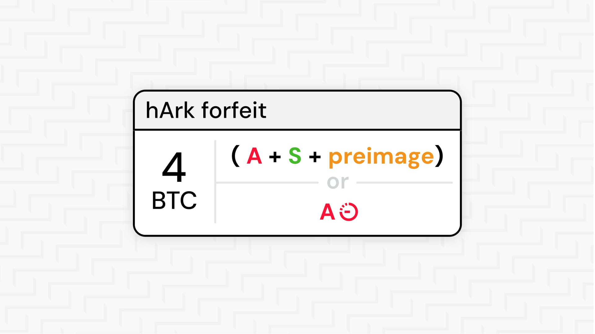
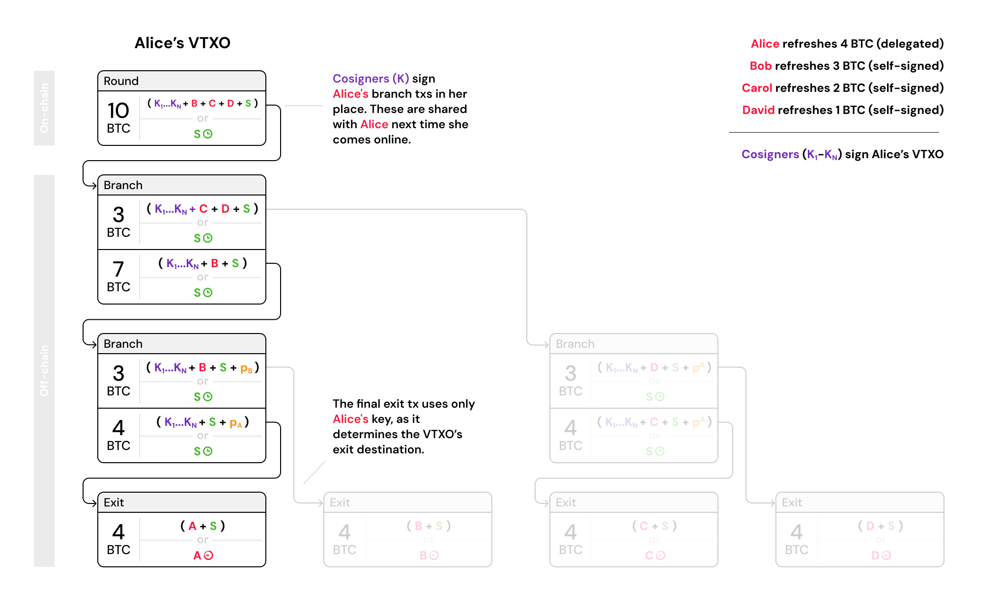

> *作者：Erik De Smedt*
> 
> *来源：<https://blog.second.tech/hark-explained/>*

“hArk（运用哈希锁的 Ark）” 最早在 [Delving Bitcoin 论坛的一篇文章](https://delvingbitcoin.org/t/evolving-the-ark-protocol-using-ctv-and-csfs/1602)中出现，并已经在[我们的 Ark 实现的 v0.1.0-beta.6 版本](https://docs.second.tech/changelog/changelog/#010-beta6)中发布。hArk 是我们对 Ark 协议实现的一次更新，在根本上改变了回合（round）的构造方式。更新之后，用户的 “弃权交易（forfeits）” 依赖于哈希锁而非 “连接器输出（connectors）”，并且是在回合的注资交易广播 *之后* 签名（而不是提前签名）。

hArk 使得在 Bark 上开发移动端应用变得容易得多，它支持 “委托刷新（delegated refreshes）”，因为移动设备无法被可靠地唤醒以参与回合签名流程，所以这是必要的机制。与标准的自主签名刷新相比，委托刷新在安全性上有一些牺牲，但请放心，自主签名刷新仍然是默认的信任模型，协议的核心没有改变。

说实话，我们在实现 hArk 时有所犹豫，因为知道这会延迟主网发布。但这总归是必要的 —— 比起一开始就带有新的回合模型，在用户和集成者已经开始适应旧的模型后再进行改造会痛苦得多。现在它已经就绪，我们很高兴——我们希望 Bark 自始至终对移动端友好。

## （曾经的）回合机制：先签名弃权交易，再广播注资交易

在 Ark 协议中，用户必须定期刷新他们的 Ark 余额，将旧的 VTXO 作废并以一次原子化操作获得新的 VTXO。

在经典 Ark 中，回合按以下顺序进行：

1. **提交请求**：用户告诉服务商他们想刷新哪些 VTXO。
2. **构建树并联合签名**：服务商构建一个注资交易和包含所有新 VTXO 的交易树；这棵交易树的用户们联合签名所有相关的交易。
3. **为弃权交易签名**：用户为其旧的 VTXO 签名弃权交易。
4. **广播**：服务商广播注资交易。

因为花费了连接器输出，弃权交易成为有条件生效的：连接器是注资交易中的粉尘级输出（极小面额），弃权交易将其作为输入。如果注资交易没有上链，连接器不存在，弃权交易就无法被花费。但这种条件性是单向的：弃权交易依赖于注资交易，但新的 VTXO 并不依赖于弃权交易。因此服务商必须在广播之前收集每个弃权交易的签名。

这种模型对始终在线的桌面客户端来说没有问题，但移动操作系统（尤其是 iOS）往往无法可靠地唤醒设备来参与交互式的回合流程。为了让移动端应用可用，我们需要一种办法，让移动端应用可以刷新而无需用户参与交互式的回合流程。

唯一不使用 “限制条款（covenant）” 的方式，是让一组分布式的联合签名人代表用户签名刷新操作、让用户稍后再领取自己的新 VTXO（也即 “委托刷新”，我们后文再详谈）。但是，因为弃权操作被嵌入了交互式的回合机制，我们无法实现委托刷新 —— 弃权交易签名需要用户的私钥，而将私钥交给第三方联合签名人是不能接受的。我们需要把弃权步骤完全移出回合并使其异步化。

## 现在的回合机制：先广播，再弃权

连接器不能满足需求，所以我们回到设计板，最终采用了哈希锁和原像 —— 这种密码学机制在闪电网络中已经得到了验证。哈希锁提供了我们所需的双向条件性：新的 VTXO 依赖于弃权交易，同时弃权交易也依赖于新的 VTXO，从而允许我们把弃权步骤完全移出交互式回合。

在 hArk 中，步骤 3 和 4 互换位置，并且步骤 4 可以在回合窗口之外完成：

1. **提交请求**：用户告诉服务商他们想刷新哪些 VTXO。
2. **构建树并联合签名**：服务商构建一个注资交易和包含所有新 VTXO 的交易树；这棵交易树的用户们联合签名所有相关的交易。
3. **广播**：服务商广播注资交易。
4. **为弃权交易签名**：用户在方便的时候为他们的旧 VTXO 签名弃权交易。服务商在收到每个用户的 弃权交易签名后揭示一个原像。

将弃权步骤与回合拆分之后，委托刷新成为可能。联合签名人现在可以在回合期间为移动端用户预先签名交易树上其所属的分支，用户的钱包再次上线时再收集这些已签名的交易 —— 无需在回合期间唤醒设备。下面会详细介绍委托刷新的机制。

另一个有价值的副产品是减少了回合的拒绝服务（DoS）攻击界面：一个用户未能签名其弃权交易不会再阻塞其他人，因此回合对钱包开发者和用户变得更加可靠。

## 哈希锁弃权交易的工作原理

这种双向依赖通过一个秘密值来实现：交易树中每个 VTXO 的 “退出交易（exit transaction）” 都被一个只有服务商才知道的原像 `p` 锁定，且服务商只会在收到签好名的弃权交易后揭示 `p`。服务商可以先广播注资交易，这是安全的，因为在没有 `p` 的情况下，用户无法访问他们的新 VTXO。当用户为他们的弃权交易签名时，服务商揭晓 `p`，这同时激活用户的新 VTXO 并给服务商能力去申领旧的 VTXO。

弃权交易是一个两步过程：

1. 用户为弃权交易交易签名，将其旧 VTXO 转入一个弃权交易输出，这个输出的其中一条花费路径带有以 `p` 为原像的哈希锁，而另一条花费路径带有时间锁（如上图中间的 `Forfeit` 输出）。
2. 服务商现在持有已签名的弃权交易。如果用户试图单方面将旧 VTXO 退出到链上，服务商可以广播 弃权交易并通过揭示原像来申领资金。

如果服务商拒绝揭示 `p`，用户的比特币仍然安全。他们可以在链上发起旧 VTXO 的退出操作，会发生以下两种情况之一：

- 服务商无动作，用户在时间锁解锁后收回他们的比特币。
- 服务商广播 “弃权交易的申领交易”（即上图中间的 `Forfeit claim` 交易），从而在链上揭示 `p`。用户随后使用该 `p` 来激活自己的新 VTXO。

无论哪种情况，用户都不会丢失比特币。

## 委托刷新：为移动设备带来的新模式

默认情况下，hArk 中的刷新仍然是自主签名的：你亲自为交易树上的每一笔相关交易签名。这些预签名的分支交易构成你的单边退出路径 —— 如果你需要在没有服务商配合的情况下将你的 VTXO 退出到链上，你可以广播从交易树树根到你所在的叶子的交易链条。这是最强的安全模型 —— 完全不信任任何人 —— 但它要求在回合期间在线并参与签名。对于在回合期间无法可被靠唤醒的移动操作系统，hArk 引入了委托刷新。

在委托模式下，一组联合签名人在回合期间预先为用户的分支交易签名。用户的钱包再次回到线上时，会从服务商处收集这些已完全签名的分支交易 —— 这给用户同样的单边退出路径（与自主签名模式一致）—— 然后完成他们旧 VTXO 的弃权。服务商随后揭示原像，从而激活交易树中的新 VTXO。

所有联合签名人必须合谋，才能劫持一个用户的 VTXO，联合签名人数目越多，这件事就越难。此外，联合签名人会在每个回合之后自动删除签名密钥，从而提供前向安全性（forward security）：即使联合签名人在回合期间正确运行，但之后被攻破，密钥删除也能确保该回合产生的 VTXO 仍然安全。只要在回合期间至少有一个联合签名人的软件正确运行，合谋就不可能发生。

这两种刷新模式并不互斥。任何钱包应用都可以同时提供两种模式，根据连通性使用合适的模式。或者，安装在多台设备上的钱包可以让一个桌面端来处理所有刷新，而把移动端的委托刷新作为应急机制。并且，委托了一次刷新的用户总是可以在稍后自主签名一次刷新，也就是回到完全免信任的模式。

但请注意，目前唯一的联合签名人是服务商本身。发布能够让其他实体参与的联合签名软件，是我们在主网发布后优先要做的事情。

## 通往限制条款的垫脚石

绝大多数现有的比特币限制条款提议，都将使我们能强制执行 Ark 的树结构而无需预签名的交易。用户将获得两全其美的体验：既能获得像现在的自主签名刷新模式一样的免信任性，又能获得现在委托签名模式一样的异步便利性。用户依然需要定期回到线上以完成弃权交易，但无需在回合注资交易构造期间保持在线。

hArk 的设计之美在于，它几乎可以直接映射成基于限制条款的 Ark。哈希锁弃权交易机制、树结构和回合流程都可以保持不变。因此，如果比特币将来支持限制条款（梦想还是要有的），从 hArk 向限制条款版的迁移应该是丝滑的，几乎不会打扰现有的集成者和用户。

## 在 Bark 中已可用

hArk 已在 Bark 中实现 —— [请在 signet 上试用](https://docs.second.tech/)。还有，请[订阅](https://second.tech/#subscribe)我们的消息，以便第一时间收到 Second 的更多更新。

（完）