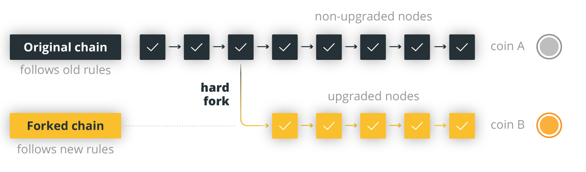
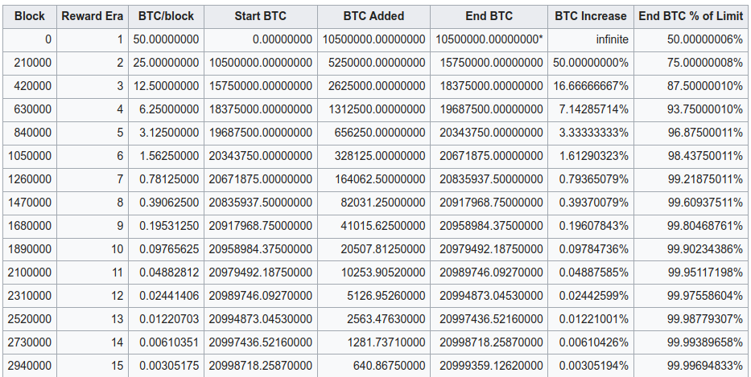

> *作者：Jameson Lopp*
> 
> *来源：<https://blog.lopp.net/has-bitcoin-ever-hard-forked/>*

硬分叉是什么？它是跟旧版本不兼容的协议变更。换言之，旧版客户端不会接受由新版客户端创建的区块，会将它们视为无效块。之所以会出现这种情况，是因为关于区块有效性的共识规则**变宽**，致使 *以往* 被视为无效的区块现在（在新版本的协议中）变成有效块。

- 当硬分叉发生时，如果有矿工不更新软件，可能会导致链分裂，但并不绝对如此 -

你会发现，几乎所有关于软分叉和硬分叉的定义和示意图，在提及共识变更时都会说明是否需要节点更新软件以维护共识。

关于比特币硬分叉的问题回答起来很复杂，因为 “硬分叉” 有一定的开放解释空间。从一方面来看，比特币已经经历过数十次硬分叉，这些硬分叉的目的都是为了创建其它协议、网络、区块链来取代比特币。但是，就本文而言，我们主要聚焦于比特币协议内部的硬分叉问题。协议内的硬分叉共识变化并不一定会造成链分裂，致使分析进一步复杂化。

根据我最近的实验，我得出的结论是，*理论上的* 不兼容性和 *实际上的* 不兼容性之间存在 *细微区别。“*硬分叉”一词并不能很好地将二者区分开来。

## 共识变化

[链接：比特币共识分叉全史](https://blog.bitmex.com/bitcoins-consensus-forks/)（[中文译本](https://www.btcstudy.org/2022/09/05/a-complete-history-of-bitcoins-consensus-forks/)）

BitMEX 列出了比特币诞生 13 年以来发生过的 21 个已知共识变化。请注意，我之所以强调“已知共识变化”，是因为可能有一些代码更改的确影响了共识，但是至今还未发生过不同节点之间达成共识失败的情况，以至于这些变化不为人察觉。

在 BitMEX 罗列出的所有共识变化中，有 3 个事件被标记为“硬分叉”。我个人认为有 7 个共识变化可以被视作硬分叉，同时也会说明为何大多数共识变化不应被视作硬分叉。为了更好地展示共识变化如何可以既是硬分叉又不是硬分叉，我们来看下文的例子。

## 不是硬分叉的共识变化

- 比特币的区块补贴计划表 -

假设在下一个比特币实现版本中，区块补贴算法被更改为区块高度 2520000（距今大约 30 年后）后，永久发放 0.01 BTC 的区块补贴，以确保无论用户对区块空间的需求多寡（这决定了交易费），矿工始终能够获得奖励。为便于讨论，我们假设网络中几乎每个节点都将其代码更新为新的规则，不管它们是真的认同还是盲目从众。

假设新规则设置 10 年后，区块空间市场开始腾飞，总交易费持续超过区块补贴，使得比特币支持者无需担心比特币网络的热力学安全性是否长期可持续。因此，在 2032 年，人们又一致认同比特币应该改回之前的区块补贴计划表，经过 33 次减半后区块补贴降至零。

规则变更被撤销，但是被动摇的规则本身没有被触发过！规则变更虽然“生效”了 10 年，但是在执行的 20 多年前就已经取消。这种情况属于硬分叉吗？我认为不属于，虽然这种情况下比特币**有可能会**硬分叉，但是没有真正发生。同样的逻辑适用于比特币历史上**几乎所有**所谓的“硬分叉”。

我将从以下两个角度进一步拆解这些非兼容型“硬分叉”共识变更：

1. 是仅在 *理论上* 改变了共识，还是 *实际上* 触发了共识变更？
2. 是计划中 *明确的* 规则变更，还是计划外 *隐晦的* 变更？

我认为，硬分叉指的应该是把所有不升级的客户端都踢出共识流程 —— 因为它们不理解新的协议规则 —— 的变更。因此，未激活/未触发 的硬分叉逻辑**不应算作硬分叉**。

## 理论上的非兼容型共识变更

我认为有 5 个代码变更可以被归类为永远不会实现的潜在硬分叉。

Bitcoin v0.2 —— [中本聪改变了“最优链”的选择逻辑](https://github.com/bitcoin/bitcoin/commit/40cd0369419323f8d7385950e20342e998c994e1#diff-623e3fd6da1a45222eeec71496747b31R420)，从选择区块高度最高的链变为选择累积工作量证明最多的链。从技术角度来说，这一更改并未放松有效性规则，但它确实有可能造成共识失败/链分裂情况。在这种情况下，新旧客户端会将两条链均视为有效链，在哪条链是最优链的问题上无法达成共识。无论如何，像这样自相矛盾的逻辑还未在比特币网络上触发过，仍属于理论层面上的潜在链分裂，如果回到 2010 年还有可能发生，到如今再也不可能了。

Bitcoin v0.3.6 及之前的版本 —— OP_VER 会将验证器的版本号压入堆栈。只要使用观察版本号的脚本就会导致分叉，每个版本一条。因此，v0.3.6 之前发布的每个版本都有可能触发硬分叉。但是，OP_VER 实际上并未被使用过。

Bitcoin v0.3.7 —— 将 [scriptSig 与 scriptPubKey](https://github.com/bitcoin/bitcoin/commit/6ff5f718b6a67797b2b3bab8905d607ad216ee21#diff-8458adcedc17d046942185cb709ff5c3L1135) 的计算分离。这一更改修复了可以让任何人花费其他人的比特币的漏洞。这个漏洞实际上没有被利用过。如果比特币区块链中存在不兼容的数据，这一更改[可能会触发硬分叉](https://bitcoin.stackexchange.com/questions/111673/was-bitcoin-0-3-7-actually-hard-forking)。

Bitcoin Core v0.15 —— 意外新增了一个[严重的通货膨胀漏洞](https://bitcoincore.org/en/2018/09/20/notice/)。该漏洞在一年后的 2018 年 9 月被修复。通货膨胀条件实际上没有被触发或利用过。

[BIP90](https://github.com/bitcoin/bips/blob/master/bip-0090.mediawiki)（有争议的）—— 由于这一更改只放松了很久之前发生过的软分叉激活的相关规则，它并不具备很多常见的共识分叉特征或风险。我认为，只有在一种情况下，该变更才会触发真正的硬分叉，即，大规模链重组几乎抹去了比特币的所有历史交易记录。我认为这实际上会摧毁比特币网络的价值主张，真到那一刻什么都无所谓了。

我认为上述更改都是 *潜在的* 硬分叉，可能会在区块链中造成不兼容的情况，导致未升级的客户端无法进行验证，也无法更新本地区块链副本。但是，在节点允许被放宽的规则在比特币网络上运行期间，还没有等到真正触发硬分叉，这些漏洞就因网络中节点升级和收紧规则被关闭了。

## 实际发生的非兼容型隐式共识变化

[BIP50](https://github.com/bitcoin/bips/blob/master/bip-0050.mediawiki) —— Bitcoin Core 0.8.0 之前的版本使用的是 Berkley DB，[对可](https://achow101.com/2022/03/syncing-0.5.0)[以](https://achow101.com/2022/03/syncing-0.5.0)产生[的数据库锁数量有限制](https://achow101.com/2022/03/syncing-0.5.0)。Bitcoin Core 0.8.0 开始改用 LevelDB，没有实现与 BDB 相同的锁定限制。这一更改在无意中悄悄放宽了 Bitcoin Core 执行的验证规则。

2013 年 3 月 Bitcoin Core 0.8.0 发布后，运行该软件的矿工创建了一个区块，引发了链分裂和短暂的硬分叉。在大约 5 个小时内，大多数矿工切换回了 v0.7.2，并重组了被分叉的链。此后不久，[v0.8.1 发布](https://bitcoin.org/en/release/v0.8.1)，引入了 LevelDB 和虚拟锁上限，将区块内可容纳的唯一交易 ID 数量限制在 4500 个以内，重新定义了 10000 的“锁上限规则”。该规则于 2013 年 3 月 15 日失效。根据我的旧节点版本同步测试，我发现后来又挖出了不与之前的锁上限规则兼容的复杂区块：

- 2013 年 9 月 16 日挖出的区块 258355 不与 Bitcoin Core v0.5 及之前的版本兼容。这时离开 v0.5 发布已经过了 2 年。
- 2015 年 7 月 10 日挖出的区块 364670 不与 Bitcoin Core v0.6 和 v0.7 兼容。这时离开 v0.7 发布已经过了 3 年。

上述 Berkley DB 锁定问题实际上会在用户尝试使用较早的 Bitcoin Core 版本同步区块链时导致一些问题。对此，我在[之前的一篇文章](https://blog.lopp.net/running-bitcoin-core-v0-7-and-earlier/)中进行过深入探讨。

[链接：运行 v0.7 及更早版本的 Bitcoin Core](https://blog.lopp.net/running-bitcoin-core-v0-7-and-earlier/)

这是一个非常特殊的分叉情况。人们一开始无意让 “锁上限规则” 成为一条共识规则，它是一种比特币客户端专有的失常表现（尽管它是最广泛采用的客户端）。它确实导致了链分裂/硬分叉，但是链分裂在几个小时内就被成功覆盖，不再存在于比特币区块链的历史中。虽然这一规则确实与旧版本 Bitcoin Core 不兼容，但是你可以在不修改旧版本 Bitcoin Core 代码的情况下修复该问题 —— 你只需在节点的数据目录中的 DB_CONFIG 文件里添加 3 行代码即可。

当这个问题被发现时，另外两个完整的实现（libbitcoin 和 BitcoinJ）都不存在这个问题。

我对这个兼容性问题的定论有两个：

1. 历史上短暂发生的硬分叉
2. 一种比特币客户端的向前兼容性问题

至于这个兼容性问题是否是 网络/协议 分叉，这个问题实际上取决于你是否将主流客户端（Bitcoin Core）视作协议。我个人认为不是。据我所知，其它 6 个已有的比特币实现都没有遇到过数据库锁问题。它们也都不使用 BerkleyDB。

## 实际发生的非兼容型显式共识变化

Bitcoin v0.3.6 —— [新增了 OP_NOP](https://github.com/bitcoin/bitcoin/commit/a75560d828464c3f1138f52cf247e956fc8f937d) 函数。

我认为这是一个无可争议的计划中的协议硬分叉。有趣的是，这一代码更改是为了便于未来进行软分叉！它添加了一堆没有功能目的的“无操作”操作码，而不是等待被重新定义以获得实际的功能。

[进一步的研究](https://bitcoin.stackexchange.com/questions/113994/was-the-addition-of-op-nop-codes-in-bitcoin-0-3-6-a-hard-or-soft-fork)表明，**在 v0.3.6 发布时**，该变更本身只是理论上的硬分叉，因为新的操作码实际上没有任何用途。2 年后，[**BIP12**](https://github.com/bitcoin/bips/blob/master/bip-0012.mediawiki) *几乎* 将 OP_NOP1 重新定义成了 OP_EVAL，但是其代码在发布前被找出一个严重漏洞，因此该软分叉尝试被放弃了。

直到 [BIP65](https://github.com/bitcoin/bips/blob/master/bip-0065.mediawiki) 出现并将 OP_NOP2 重新定义为 OP_CHECKLOCKTIMEVERIFY，该规则才在 2015 年 12 月 8 日激活，当天就诞生了使用该规则的[第一笔交易](https://blockstream.info/tx/736cb277f098ea748e59b98f7c1287e10e4b53f30cb9de0761cc991aad8b28a8)。我起初以为从这一刻起，早于 v0.3.6 的客户端将无法验证新的区块。

但是，对区块链数据的[进一步分析](https://github.com/jlopp/bitcoin-utils/blob/master/findOpNopSpends.php)表明，当 OP_NOP 还未被定义时，一些人（很有可能是开发者）实际上在花费 UTXO 时就在赎回脚本中包含了 OP_NOP！在赎回脚本中使用 OP_NOPX 的第一笔交易是[区块 163685](https://blockstream.info/tx/b8fd633e7713a43d5ac87266adc78444669b987a56b3a65fb92d58c2c4b0e84d?expand)。进一步探索显示，这个交易是 Luke-Jr 在为 [BIP17](https://github.com/bitcoin/bips/blob/master/bip-0017.mediawiki) 创建概念证明时达成的。

因此，从 [v0.3.6 发布](https://satoshi.nakamotoinstitute.org/posts/bitcointalk/289/)到首次使用 OP_NOP 赎回脚本（从而触发旧版本客户端的硬分叉条件）之间相隔了 18 个月。

## 结论

有充分的证据表明，**比特币协议只真正实现了一个永久硬分叉**。其分叉条件似乎在比特币诞生刚过 3 年时就已经触发了。当时，比特币的价格是 5 美元，网络上的节点数量也少得多。

然而，人们在分叉问题的理解上存在误区：有人想当然地以为，如果一个网络没有硬分叉，节点就能在不进行任何修改的情况下从头开始成功同步之前的客户端版本。我们已经看到，真实情况并非如此，因为 Bitcoin Core 在无意中执行了有关数据库操作的隐式规则。

相较之下，其它许多网络频繁发生系统硬分叉，可以加快功能升级，但是它们也倾向于将不关注或不同意变更的用户踢出网络。虽然比特币已经有过非兼容型协议更改，但是我们可以看到，比特币只会将数年没有更新软件的用户踢出网络。在撰写本文时，你可以使用 2013 年 1 月之后发布的任何默认配置下的 Bitcoin Core 完全同步比特币区块链。

随着比特币日益成熟，开发者已经变得更善于避免引入会破坏共识逻辑的更改。综上，我认为客观来说，比特币在共识变化方面的保守性使得共识变化的影响极低。因此，相比其它协议，比特币是一个对节点运营者更为友好的网络。

（完）