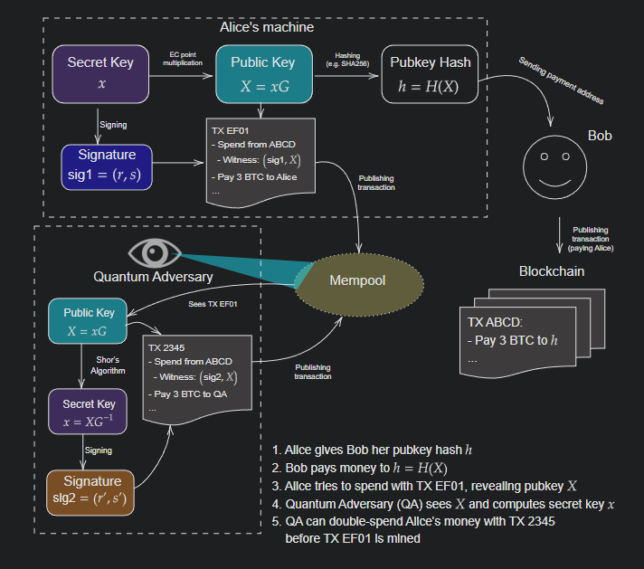

> *作者：conduition*
> 
> *来源：<https://conduition.io/cryptography/quantum-hbs/>*


我个人认为，比特币面临的最危险、最不可预测的挑战并非政治压力、实用性、吞吐量或者经济激励，而是量子计算机的威胁。

数十年间，大型实权组织 —— 不论是政治机构或经济集团 —— 持续投资了数 *十亿*  美元来开发量子计算机。甚至，自从 [Peter Shor 在 1994 年发表了以他的名字命名的（不）著名算法](https://en.wikipedia.org/wiki/Shor%27s_algorithm)以来，密码学家就一直在为 “Q-Day” —— 实用的大型量子计算机变成现实的那一天 —— 做准备。

正在阅读这篇博客的读者，我假设你至少大致熟悉椭圆曲线公私钥。我会直接告诉你，一台性能足够强的量子计算机，能够从一个椭圆曲线公钥反算出其私钥 —— 这种特技，在普通的传统计算机上被认为是天方夜谭。你可以看出，这可能会成为一个威胁。如果你想知道这种特技的详情，请参阅 [Shor 的原创论文](https://ieeexplore.ieee.org/document/365700)。

本文不会详细解释量子计算机攻破比特币公钥的机制，也无意散播末日恐慌、鼓吹我们全都应该立即去挖地堡、储备掩体、准备好迎接量子计算机带来的社会崩溃。我也懒得猜测强大的量子计算机还要多久才能问世 —— 哪怕在专业的分析人士之间，估计的范围也很大。我只假设它 *必然会到来*。而在它到来的时候，我们就必须应对它。

我希望这篇文章能向你展示比特币社区所面临的量子计算机威胁的 *方方面面*。然后，我会介绍几种 *基于哈希函数的签名方案*，然后分析它们抵御上述威胁的潜力，以及不可避免要付出的代价。最后，我会为比特币客户端使用基于哈希函数的密码学提出一种新的升级路径，作为一种保证比特币用户能够抵抗未来的量子敌手的后备选项，并且无需任何近期内的共识变更。


<p style="text-align:center">- 世上本没有路。 -</p>


## 量子计算威胁

在这一节，我会介绍一个自利的量子敌手具体可以如何攻击比特币以获得金钱利益。更细致地理解量子计算机的根本威胁将引导我们发现提升防御的办法。

自比特币的创世区块到今天，几乎每一笔得到区块确认的比特币交易，都是用一个或多个非对称签名作为身份认证手段的。有时候，这样的手段会先暴露出公钥的哈希值（而不是公钥本身）。有时候，我们会使用[比特币脚本操作码](https://en.bitcoin.it/wiki/Script)编程出额外的验证步骤来锁定资金（例如，推迟解锁的时间点）。但最终，一个比特币钱币（UTXO）具有安全性，就 *必须要求* 花费者提供与该 UTXO 此前承诺的一些公钥相匹配的非对称签名。这个签名也必须以某种方式与花费交易绑定，使它无法被用在另一笔交易中。

如果你 *仅仅* 用一个哈希锁，或 *仅仅* 用一个时间锁（等等）来锁定一个钱币，而不要求非对称的签名，那么，只要你的花费交易被曝光（其他人知晓了你的钱币的花费条件），那么任何人都能花费这个钱币（也包括 *必然* 知晓这笔交易的矿工）。

```Bitcoin Script
OP_SHA256 <hash> OP_EQUAL
```

<p style="text-align:center">- 一个简单的哈希锁脚本公钥。需要揭晓这个  `<hash>` 的原像才能花费它，所以一开始别人无法花费它。然而，一旦这个原像曝光（随着花费它的交易在网络中曝光，这必然会发生），那就每个看到这个原像的人都能花费它了 -</p>


比特币交易使用 secp256k1 椭圆曲线上的签名来实现这种非对称的身份认证机制。ECDSA 是更老也多人知晓的签名算法；而 [Schnorr 签名方案是更清晰、更快速、更安全也更灵活的签名算法](https://conduition.io/cryptography/schnorr/)，在几年前的比特币 Taproot 升级中被吸收作为比特币协议的一部分。比特币的 Schnorr 和 ECDSA 签名协议都使用同一条 secp256k1 椭圆曲线。

无论是 ECDSA 还是 Schnorr 签名协议，只要一个量子敌手（QA）知晓了一个受害者的 secp256k1 公钥，它们都一样脆弱，因为 QA 可以直接用椭圆曲线公钥反算出私钥，然后想怎么签名就怎么签名。

*然而*，同等能力的 QA，要反算出哈希值（一种哈希函数的输出）的原像（该哈希函数的输入），会困难得多。当前已知 QA 暴力搜索一个原像的最佳情形，也只能实现平方级加速（使用 [Grover 算法](https://en.wikipedia.org/wiki/Grover's_algorithm)）。这里的平方级加速意味着，如果一台传统的计算机需要 $n$ 次操作来完成一件事，那么 QA 可以用 $\sqrt{n}$ 次操作来实现。比特币输出脚本所用的输出长度最小的哈希函数是 `RMD160`，它的安全层级是 $2^{160}$，所以一台量子计算机最多只需 $\sqrt{2^{160}} = 2^{80}$ 次操作，就能找出一个 RMD160 哈希值的原像。不算很好，但根据当前的理论，依然算得上几乎不可能（因为运算的时间）。

所以，并非 *所有的* 单向函数（在 QA 面前）都已无药可救，而且密码学哈希函数也并非唯一能够存活的密码学原语。

然后，我们来看看不同的地址（钱币/输出 脚本）类型。

## 哈希化的输出类型

（也就是 P2PKH、P2SH、P2WPKH、P2WSH）

今天，最常见的比特币地址类型就是 “支付到（见证）公钥哈希值”（P2PKH/P2WPKH）。在使用这种地址时，收款方会将自己的公钥先哈希，再将哈希值交给支付者；到花费钱币的时候，其持有者将公开自己的原始公钥并签名交易，从而验证者（比特币节点）可以通过再次哈希这个公钥来比对被花费的钱币的脚本中的哈希值。

```bitcoin script
OP_DUP OP_HASH160 <hash> OP_EQUALVERIFY OP_CHECKSIG
```

<p style="text-align:center">- 传统的 P2PKH 锁定脚本。 -</p>


在 P2SH 和 P2WSH 地址中，地址是一个 [*比特币锁定脚本*](https://en.bitcoin.it/wiki/Script) 的哈希值，这个脚本至少包含一个 ECDSA 公钥，在花费钱币时需要提供对应于这些公钥的签名。仅从量子安全性的角度看，脚本哈希类型的输出与公钥哈希类型的输出，它们的安全性实际上是一样的，唯一的例外是，P2WSH 输出使用的是 SHA256 哈希函数，而所有其它输出使用的都是 RMD160 哈希函数。

```
OP_HASH160 <hash> OP_EQUAL
```

<p style="text-align:center">- 传统的 P2SH 锁定脚本 -</p>


当前，这四种地址类型保护了大部分已经挖出并且流通中的比特币。

而量子敌手的威胁在于它能从椭圆曲线公钥反算出私钥。如果一个公钥哈希地址或者脚本哈希地址收到过钱币但 *从未花费过* 任何一个钱币，那么它们的哈希值的原像（公钥或是脚本）就从未揭晓过。除非存在别的暗箱暴露（例如，因为地址所用的公钥是通过 BIP32 派生出来的，而派生它们的 BIP32 拓展公钥被泄露给了服务商或其他人），那么 QA 一般来说是无法轻易攻击这些地址的。

（译者注：重复使用地址的用户可能在一个地址上积累多个 钱币/交易输出；而从不重复使用地址的用户在一个地址上最多只会持有一个钱币。）

不过，一旦这个 公钥/脚本 哈希地址的主人尝试花费地址上的钱币（任何一个钱币），这种保护都会终止。这是因为，为了验证一笔花费哈希化输出的交易，比特币网络中的节点必须取得这个输出的 公钥/脚本 原像。而量子敌手可以轻松在网络中观察到这些地址，并知晓其原像；而这篇原像中又必然包含着 QA 可以攻击的公钥。在反算出公钥的私钥之后，QA 就可以尝试用一笔手续费更高的交易来花费这个钱币。



幸运的是，QA 仅有一个较短的时间窗口来实施这种攻击。一笔标准的比特币交易，在出现在网络中各节点的交易池中之后，只需 5 到 60 分钟就会得到区块确认，这时候钱币就已经永久转移到新地址上了。如果新地址又是用一个 QA 不知道原像的哈希值来保护的，那么这个钱币就又离开 QA 的攻击范围了。

不过，当前，比特币主网上的大量公钥哈希地址和脚本哈希地址被重复使用过。重复使用过的地址就是收到过一个乃至更多钱币、花费过其中一些（因此其公钥或锁定脚本已经暴露）、但依然被用来保管钱币的地址。一些人估计，由这样的复用地址持有的比特币[至少有 500 万 BTC](https://x.com/pwuille/status/1108097835365339136)（报告时间是 2019 年）。量子敌手有多得多的时间来利用由这些地址暴露的公钥。时间是站在 QA 那边的；将自己的钱币转移的新的未复用地址的责任完全在钱币主人肩上。

还有一种可能性是，大型的矿池本身成为一个量子攻击者。这样的矿池可以有意拖延确认这样的交易，从而给自己更多时间来攻破刚刚揭晓的公钥。

### 总结

P2PKH、P2SH、P2WPK、P2WSH 输出脚本类型，如果合理使用，在面对 QA 时 *可以* 是足够安全的，如果 QA 需要一定的处理时间（超过一个消失）才能反算一个 secp256k1 公钥的话。

问题在于，妥善使用并不容易。[Ava Chow 就介绍了使用公钥哈希值来对抗量子敌手将面临的无数陷阱](https://bitcoin.stackexchange.com/questions/91049/why-does-hashing-public-keys-not-actually-provide-any-quantum-resistance)。

## P2TR 输出

在构造一个 P2TR 地址时，一个 *内部公钥* $P$ 会由一个哈希值 $m$ 来 *调整*，从而形成一个 *输出公钥*：$P' = P + H(P,m)·G$ （其中 $G$ 是 secp256k1 曲线上的生成元）；然后，这个输出公钥 $P'$ 会被直接（不经过哈希运算）编码到 P2TR 地址中，由收款方分发给支付方。

在花费钱币时，持有者可以通过输出公钥 $P'$ 签名来直接认证（也即所谓的 “密钥路径” 花费），或者，也可以通过提供内部公钥 $P$、一个比特币锁定脚本、解锁见证数据，以及该脚本作为一个[默克尔树叶子](https://en.wikipedia.org/wiki/Merkle_tree)已经被 `m` 承诺的证据，来间接认证。如果脚本求值成功，花费者就被当成通过了认证（也即所谓的 “脚本路径” 花费）。[BIP341 提供了更多信息](https://github.com/bitcoin/bips/blob/master/bip-0341.mediawiki)。

P2TR 与传统的哈希化输出脚本类型的关键区别在于，P2TR 输出脚本编码的是一个 secp256k1 点（公钥）。这就意味着，一个 QA 可以直接逆转任何 P2TR 输出公钥 `P'`（获得其私钥），然后使用 “密钥路径花费” 来取走地址上的资金，即使这些地址从未被花费过。

这不是什么新的见解，早在讨论 taproot 升级的时候，关于这一特点就已经有了许多讨论和争议。

- https://freicoin.substack.com/p/why-im-against-taproot
- https://lists.linuxfoundation.org/pipermail/bitcoin-dev/2021-March/018641.html
- https://bitcoinops.org/en/newsletters/2021/03/24/#discussion-of-quantum-computer-attacks-on-taproot

### 总结

面对一个量子敌手，P2TR 地址的安全性跟**已经被**重复使用的公钥哈希值地址相当。从知晓一个 P2TR 地址的输出公钥 $P'$ 开始，QA 拥有无限长的时间来反算输出公钥的私钥并劫走其中的钱币。在意识到 QA 出现（或可能很快就会出现）之后，将钱币移动到量子安全地址 —— 或避免使用 P2TR 输出脚本类型 —— 的重担由各地址的主人自己担负。

## 关于多签名脚本的提醒

使用 `OP_CHECKMULTISIG` 的 P2SH 和 P2WSH 地址，让量子敌手攻破它所需的处理时间呈线性增加。一个 m-of-n 的多签名地址中包含了 n 个不同的公钥，而 QA 需要反算其中至少 m 个公钥才能行驶该地址的花费权。

这种降速可能会被多台量子处理器的并行处理抵消，或者，有可能出现可以并行化的量子算法，一次性反算多个公钥。

使用密钥聚合的 P2TR 多签名地址不具有这种属性，因为其输出公钥$P' = P + H(P,m)·G$ （自身作为一个公钥）总是可以被反算。拥有 $P'$ 这个公钥的私钥，就足以花费这个 P2TR 输出（*在当前的共识规则下* ）。

## 关于 BIP32 的提醒

绝大多数消费者钱包都使用 BIP32 层级式确定性（HD）钱包方案来派生地址。这一方案使得一个种子就能派生出几乎无数个私钥及其对应的公开地址，不限脚本类型。钱包软件用时候会分享出扩展公钥，以避免沟通许多单个子地址。

对于量子敌手，一个 BIP32 拓展公钥（xpub）就等价于对应的拓展私钥（xpriv），只要它有足够长的时间来逆转这个 xpub 。一旦反算出来，这个 QA 可以迅速派生出所有的子地址，然后监控区块链、盗走任何支付给这些子地址的资金。

[为了兼容 BIP44 标准](https://github.com/bitcoin/bips/blob/master/bip-0044.mediawiki)，绝大部分钱包软件都使用具体的一条 BIP32 路径来为各种比特币地址类型派生一对 xpub/xpriv 。

- 为 P2PKH 使用 `m/44'/0'/n'` 派生路径
- 为 P2SH 封装的 P2WPKH 地址使用 `m/49'/0'/n'` 派生路径
- 为原生的 P2WPKH 地址使用 `m/84'/0'/n'`
- 为 P2TR 地址使用 `m/86'/0'/n'`

从主密钥（`m`）开始，这些密钥派生路径上的每一层都是 *加固过的*，意思是派生子密钥的过程需要哈希父私钥。

请记住，QA 无法像反算椭圆曲线公钥那样高效地反算哈希函数。也就是说，BIP32 的主密钥 `m`，以及任何以往未使用过的密钥路径上的 xpriv ，一般来说在 QA 面前都是安全的，只要钱包软件从未暴露过 BIP32 主公钥。我们将在下文讨论的部分选项中利用这一属性。

## 量子安全的签名

关键问题是：*哪种密码学机制能够取代椭圆曲线电子签名？*

无论什么机制，想要取代 EC 签名，都必须是 *非对称的*，这样用户才能向潜在的支付者发送支付指令，而不把资金的控制权交给后者。收款方可以稍后再领取这笔支付，而无需向任何人透露自己的签名证书（在银行网站上输入口令就比不上这种机制）。这就排除了对称式的密码学方案，比如 HMAC（基于哈希函数的消息认证码）、简单的哈希操作，以及对称加密算法（比如 AES 和 ChaCha ）。

我们有许多量化的指标来评判替代算法：

- 公钥的大小
- 签名的大小
- 私钥的大小
- 密钥生成时间
- 签名计算时间
- 签名验证时间

我们还可以对替代的签名算法有一些定性的描述：

- *状态性（statefulness）*：签名人需要保留每一次签名之间的状态吗？
- *可复用性（reusability）*：签名人能够重复使用自己的私钥来签名多条消息吗？

在本文中，我们要探索一类签名算法，它们几乎肯定是最安全的、最保守的候选，但也带有一些巨大的实用性问题：*基于哈希函数的签名方案*，简称 “*HBS* ” 。

基于哈希函数的签名方案是从简单的单向密码学哈希函数（比如 SHA256）构造出来的。私钥通常是原像的向量。公钥通常是哈希值，或者哈希值的向量。签名通常是原像的向量搭配辅助数据，使验证者能够验证这些原像与具体的一个静态的公钥相对应。与其它的后量子密码学候选者不同的是，基于哈希函数的签名方案并不依赖于新的（可能有错误的）密码学假设 —— 这也是它们成为保守选项的原因。

我将详细介绍集中广为人知的基于哈希函数的签名方案，按复杂性逐渐升高来排序。如果我用的数学记号让你困惑，不用烦恼 —— 理解 HBS 方案的内核，与理解它可以如何应用于比特币，并非密不可分。

要是你完全不在乎这些方案的技术细节，可以直接跳到最终分析章节。

在我们开始之前，还是要介绍一些记号：

| **记号**     | 含义                                    |
| ------------ | --------------------------------------- |
| $\{0, 1\}^n$ | 所有长度为 $n$ 的比特串的可能性集合     |
| $x \larr S$  | 从集合 $S$ 中均匀随机采样出一个元素 $x$ |

令 $H(x) \rarr \{0, 1\}^n$ 是一种密码学安全的哈希函数，会输出一个长度为 $n$ 的伪随机比特串（对于 SHA256 函数来说，`n = 256`）。下文所述的所有构造一般来说都基于这一种密码学原语。

> **免责声明**
>
> 我在几个星期以前才开始学习这些基于哈希函数的签名协议。请不要以为我在下文中的技术讲解是绝对准确的、可以安全地用在真实场景中，因为我可能会犯错误或省略一些部分。本文的目的是演示和传达这些算法的实质，不是提供准确的实现指令。
>
> 不要发明和实现专属于你自己的密码学（Roll your own crypto at your own peril）。
>
> 如果你是这方面的专家、注意到我有笔误，请[通过电子邮件联系我](conduition@proton.me)，或[打开一个 PR 来修正它](https://github.com/conduition/conduition.io)。

我们先从最简单、最早为人所知的 HBS 方案开始：[Lamport 签名](https://en.wikipedia.org/wiki/Lamport_signature)。

（未完）