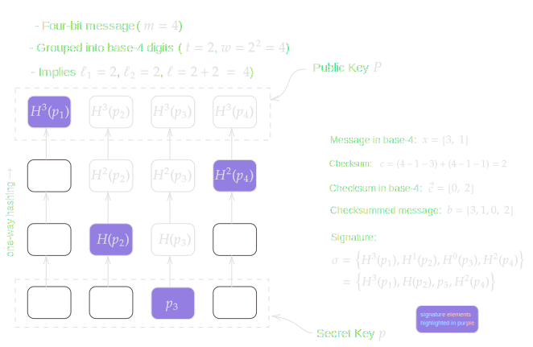
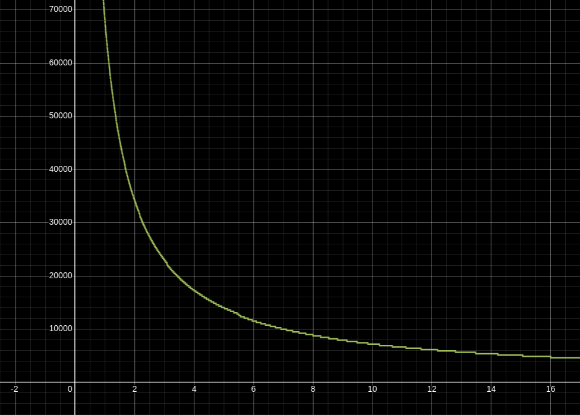
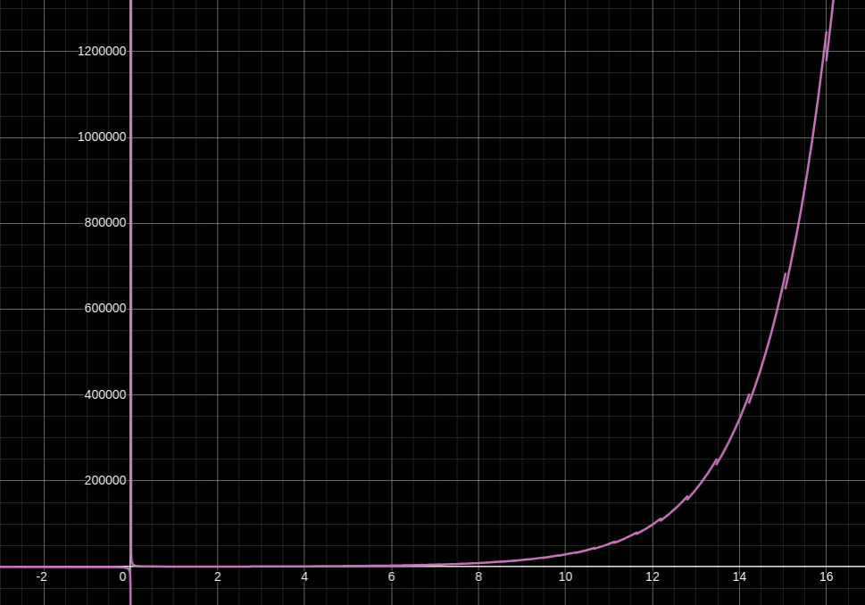
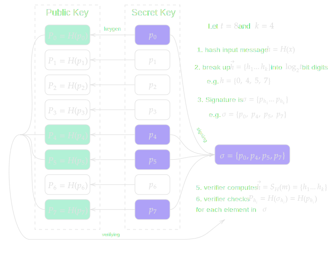
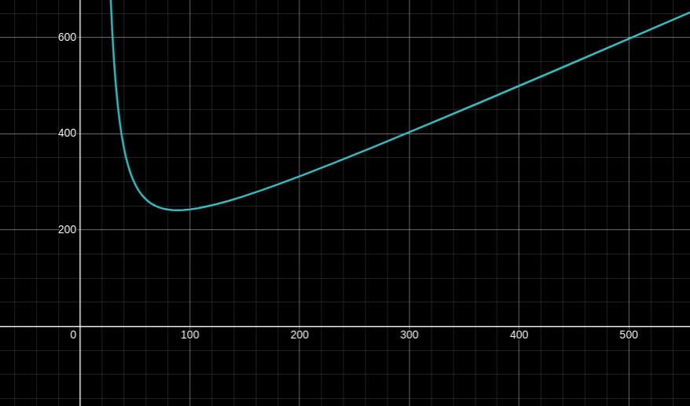

> *作者：conduition*
>
> *来源：<https://conduition.io/cryptography/quantum-hbs/>*
>
> *[前篇见此处](https://www.btcstudy.org/2026/03/02/hash-based-signature-schemes-for-post-quantum-bitcoin-part-/)：比特币面临的量子计算威胁*

## Lamport 签名

假定我们希望使用哈希函数 $H(x)$ 来签名一个比特 —— 其值为 0 或 1 —— 的信息。

我们生成两个长度都为 $n$ 的随机值原像：

$$ p_0 \leftarrow \{0, 1\}^n $$

$$ p_1 \leftarrow \{0, 1\}^n $$

这个元组 $(p_0, p_1)$ 就是一个 *一次性的* 私钥。

我们的公钥就是这个元组：$(P_0, P_1) = (H(p_0), H(p_1))$ 。我们可以把这个公钥交给任何人，随后再通过揭晓 $p_0$ 来签名比特值 0、揭晓 $p_1$ 来签名比特值 1， 这是安全的。任何知晓了公钥 $(P_0, P_1)$ 的人都可以通过运算 $H(p_b) = P_b$ 来验证 $p_b$ 是对比特值 $b$ 的签名

我们可以把这种方法推广到签名任意长度为 $m$ 比特的消息，只需生成更多原像即可 —— 为每一个比特生成一对原像。因此，我们的私钥就是：

$$ (p_0, p_1) : p_i \leftarrow \{ \{ 0, 1\} ^n \} ^m $$

其中，每一个 $p_i$ 都是一个包含了 $m$ 个随机原像 $\{p_{(i, 1)}, p_{(i, 2)}, ... p_{(i, m)}\}$ 的数组。

（译者注：即 $p_0$ 就包含了用来签名每一个比特的数值 0 的原像；而 $p_1$ 就包含了用来签名每一个比特的数值 0 的原像。）

我们的公钥则是由各个原像的哈希值组成的。

$$
\begin{align}
(P_0, P_1) : P_i &= \{P_{(i, 1)}, P_{(i, 2)}, ... P_{(i, m)}\}  \\\\
                 &= \{H(p_{(i, 1)}), H(p_{(i, 2)}), ... H(p_{(i, m)})\}
\end{align}
$$

为了对一条消息（其比特值形式为 $\{b_1, b_2, ... b_m\}$）生成一个签名 $\sigma$ ，我们只需揭晓每一个比特值的对应原像：

$$ \sigma = \{p_{(b_1, 1)}, p_{(b_2, 2)}, ... p_{(b_m,\ m)}\} $$

要验证这个签名，只需为消息中的每一个比特 $1 \le i \le m$ 哈希签名中包含的原像、检查它与公钥一致，即：

$$ H(p_{(b_i,\ i)}) = P_{(b_i,\ i)} $$

### 属性

Lamport 签名是一种一次性的签名协议（缩写为 “OST”） —— 一旦签名人为给定的一个公钥揭晓一个签名，就再也不能用同一个公钥来签名另一条消息。要是重复签名了，这个签名人等于是拱手把伪造新签名的能力交给了观察到这多个签名的人。

举个例子，如果 $m = 2$，而一个签名人为不同的两条消息 $\{0, 1\}$ 和 $\{1, 0\}$ 揭晓了两个签名，那就已经揭晓了其私钥 $(p_0, p_1)$ 中的所有（四个）原像。任何观察到这两个签名的人，都能用同一个公钥签名 $\{1, 1\}$ 和 $\{0, 0\}$，即使私钥的主人从未想过认可这些消息。

签名的长度以比特计是 $n \cdot m$，而公钥的长度是 $2 n m$ 比特。

签名的过程很简单，因为只是揭晓秘密值。验证则要求使用 $H(x)$ 求值 $m$ 次。

### 修改

我们可以修改 Lamport 签名，从而优化密钥和签名的体积，代价则是一些计算时间。

**确定性的密钥生成**：不是随机取样出原像作为我们的私钥，而是从一个根秘密值 $r$ 触发，使用哈希函数 $H$ 来派生出它们：

$$ p_{(b, i)} = H(r, b, i) $$

这样一来，我们只需为每一个 Lamport 一次性签名密钥存储一个 256 比特长的原像（而不是 $2m$ 个原像）。但我们需要计算 $4m$ 次哈希函数才能派生出我们的公钥，而且，要签名一条长为 $m$ 个比特的消息时，必须计算 $m$ 次哈希函数。

**紧凑的公钥**：我们可以将公钥的体积从 $2 n m$ 个比特缩减到 $n$ 个比特，办法就是用标准的 Lamport 公钥自身的哈希值来表示公钥。也即：

$$
\begin{align}
P &= H(P_0, P_1) \\\\
  &= H(P_{(0, 1)} ... P_{(0, m)},\ P_{(1, 1)} ... P_{(1, m)})
\end{align}
$$

然而，这样一来，我们也必须调整签名算法，不仅要提供 $m$ 个原像，还要提供 $m$ 个互补的哈希值；验证者能用这些原像和哈希值重新构造出公钥哈希值 $P$，才能验证我们是私钥主人并签名了这条消息。因此，签名将是：

$$
\sigma = \{(p_{(b_1, 1)}, P_{(1-b_0, 1)}) ... (p_{(b_m, m)}, P_{(1 - b_m, m)})\}
$$

也即签名的体积倍增了，变成了 $2nm$ 比特，而公钥的体积则从 $2mn$ 比特缩减到了 $n$ 比特。

要验证签名 $\sigma$ 时，验证者逐个哈希 $m$ 个原像、补充哈希值（公钥元素）后再次哈希，如能重新派生出 $P$，则验证通过；否则验证不通过。

### 对比

下表展示了不同 Lamport 签名方案的 时间/空间 取舍的具体案例。在这些案例中，我设 $m = n = 256$、使用众所周知的哈希函数 SHA256 得出了这些结果。所有的体积都以比特数衡量。

|    算法    | 签名体积 | 公钥体积 | 私钥体积 |
| :-------------: | :------------: | :-------------: | :-------------: |
| 普通 Lamport | $m n = 65536$  | $2mn = 131072$  | $2mn = 131072$  |
| 紧凑 Lamport | $2mn = 131072$ |    $n = 256$    |    $n = 256$    |

而在下面这张表格中，我以调用哈希函数 $H(x)$ 的次数来衡量不同 Lamport 签名方案的时间复杂度。

|    算法    | 密钥生成时间 | 签名时间 | 验证时间 |
| :-------------: | :---------: | :----------: | :---------------: |
| 普通 Lamport |   $O(2m)$   |    $O(1)$    |      $O(m)$       |
| 紧凑 Lamport | $O(4m + 1)$ |    $O(m)$    |    $O(m + 1)$     |

### 对比特币的适用性

我估计，“紧凑 Lamport 签名” 方法将是 Lamport 签名中最为实用的一种，因为其公钥的体积跟当前的 P2TR 公钥是一样大的（或者可能更小）。

然而，即使是最为节约空间的 Lamport 签名，使用最低程度可接受的安全程度（$m = n = 160$），每一个签名也要占据至少 6400 字节的见证数据空间（如果不压缩的话）。这比一个 Schnorr 签名大 100 倍。

而且还有公钥复用的问题。Lamport 签名是一种 *一次性* 签名方案。假设有一种 “支付给 Lamport 公钥” 地址，比特币用户从一个这样的地址花费的时候，他们绝不能再次使用同一个地址，否则就会让观察者获得一部分伪造签名的能力。

经验丰富的用户不怎么会受影响，因为他们已经采用了最佳的习惯，就是每个地址都只使用一次（只用在一个 收款/支付 周期中）。但是，如我们前文已经提到的，大量的比特币用户要么从来不知道有这个建议，要么视若无睹。很难说服这些用户重复使用搭配 Lamport 签名的地址不仅仅是个隐私问题 —— 它可能会直接摧毁你的钱币的安全性。对于用于冷存储的硬件签名设备来说，如果它们依赖于一台基本可信任（semi-trusted）的主机将交易推送给它们签名，事情将变得格外艰难。

Lamport 签名是带状态的，也就是一个签名人需要知道（记得）自己是否用过一个私钥来签名某一条消息，从而判断再次签名是否安全。

Lamport 签名 *不能* 向后兼容比特币当前的共识协议，即使 [Ethan Heilman 提出了一种异想天开的方案](https://mailing-list.bitcoindevs.xyz/bitcoindev/CAEM=y+XyW8wNOekw13C5jDMzQ-dOJpQrBC+qR8-uDot25tM=XA@mail.gmail.com/)，利用 `OP_SIZE`，用 Lamport 方案来签名一个 ECDSA 签名的长度。这种方法是否安全，还在讨论之中。但即使使用这种有想象力的方法，这样的签名的体积也会使它无法用在 P2WSH 地址中。至少以我们当前的知识，需要一次软分叉来为比特币添加对 Lamport 签名的支持。

即使在这样的软分叉之后，已经暴露了公钥的现有地址依然无法抵御量子敌手。用户需要主动将钱币迁移到软分叉所启用的 “支付到 Lamport 公钥” 地址格式中。

## Winternitz 一次性签名（WOTS）

Winternitz 签名依赖于来自一组秘密值原像的哈希链条。通过揭晓链条上的特定中间哈希值，签名人可以签名一条消息。

与 Lamport 方案相比，WOTS 负担了更高的计算开销，换来了更短的签名。我们来看看它是怎么工作的。

首先，我们先重新确定一些参数：

- 令 $m$ 是我们要签名的消息的长度（以比特数量计）。
- 令 $w = 2^t$  作为所谓的 “Winternitz 参数”（它决定了 计算时间/占用空间 的取舍）。
- 令 $t = \log_2 w$，我们要将消息切分成长度为 $t$ 的比特组。
- 令 $\ell_1 = \left \lceil{\frac{m}{t}} \right \rceil$ ，就是以 $w = 2^t$ 为基数来衡量的消息的长度（位数）
- 令 $\ell_2 = \left \lfloor{\frac{\log_2(\ell_1(w-1))}{t}} \right \rfloor + 1$，作为以 $w$ 为基数来衡量的校验和的长度（位数）
- $\ell = \ell_1 + \ell_2$ ，就是以 $w$ 来衡量的消息以及校验和的整长

因为 WOTS 依赖于哈希链条，我们需要一种哈希链条函数 $H^d(x)$，它在内部使用我们的原始哈希函数 $H(x)$ 。其形式是：

$$ H^0(x) = x $$

$$ H^d(x) = H(H^{d-1}(x)) $$

所以，$H^2(x)$ 就是接连哈希 $x$ 两次：

$$
\begin{align}
H^2(x) &= H(H^1(x))  \\\\
       &= H(H(H^0(x))) \\\\
       &= H(H(x))
\end{align}
$$

现在，我们已经准备好生成密钥了。我们先随机采集出 $\ell$ 个原像，每个的长度都是 $n$ 。

$$ p = \{p_1 ... p_\ell\} \leftarrow  \{  \{ 0, 1 \} ^n \} ^\ell $$

为了计算 Winternitz 公钥 $P$，我们对每一个原像接连作 $w-1 = 2^t - 1$ 次哈希运算。即：

$$ P_i = H^{w-1}(p_i) $$

$$ P = \{P_1 ... P_\ell\} $$

为了签名一条长度为 $m$ 的消息 $x$，我们以 $w$ 为基数，将 $x$ 转化为 $\ell_1$ 个数位（我将每一个数位都理解成一个长为 $t$ 比特的值）。

$$ x = \{x_1 ... x_{\ell_1}\} : 0 \le x_i \lt w $$

再计算这条消息的校验和 $c$ ：

$$ c = \sum_{i=1}^{\ell_1} \left( w - 1 - x_i \right) $$

因为 $c \le \ell_1(w-1)$ ，所以 $c$ 的二进制表示最长不会超过 $\log_2(\ell_1(w-1))$ 比特。这意味着，以 $w = 2^t$ 作为基数，我们可以将 $c$ 表示为 $\ell_2 = \left \lfloor{\frac{\log_2(\ell_1(w-1))}{t}} \right \rfloor + 1$ 个数位。事实上，这就是我们即将要做的。

$$ \vec{c} = \{c_1 ... c_{\ell_2}\} : 0 \le c_i \lt w $$

我们将校验和数组 $\vec{c}$ 拼接到 $x$ 后面，得出最终要签名的值，它是一个长为 $\ell = \ell_1 + \ell_2$ 位的数组（以 $w$ 为基数）（再说一次，我把它们理解成许多个长为 $t$ 个比特的数）。

$$
\begin{align}
b &= x \parallel \vec{c}  \\\\
  &= \{x_1 ... x_{\ell_1},\ c_1 ... c_{\ell_2}\}
\end{align}
$$

要签名这个带有校验和的消息 $b$ ，我们遍历 $b$ 的每一个数位，对每一位 $b_i \in b$，我们将原像 $p_i$ 接连哈希 $b_i$ 次。这个由各个哈希链条的 “中间哈希值” 组成的数组，*就是* 我们的 Winternitz 签名。

$$ \sigma_i = H^{b_i}(p_i) $$

$$ \sigma = \{\sigma_1 ... \sigma_\ell\} $$

对于验证者来说，给定消息原文 $x$ 和公钥 $P = \{P_1 ... P_\ell\}$ ，TA 必须先重新构造出带有校验和的消息 $b = x \parallel \vec{c}$ ，就像签名人一样。然后，验证者直接将签名中的哈希值继续哈希下去、得到最终哈希值，然后将最终哈希值与公钥 $P$ 对比。

$$ P_i \stackrel{?}{=} H^{w-1-b_i}(\sigma_i) $$

（译者注：简单来说，如果 w = 16，那么公钥中的哈希值是原像接连哈希 15 次的结果；而已知签名人要签名数值 9，那么签名中的哈希值再接连哈希 6 次，就应该能得到公钥中的哈希值。）

如果对于所有的 $1 \le i \le \ell$，上述等式都成立，则签名是有效的。

### 属性

**安全性**。请注意校验和所扮演的特殊角色。如果没有它，那么揭晓一组中间哈希值将让观察者可以使用各哈希链条上更 “靠后” 的哈希值来伪造签名（即签名每一数位的值都比已经签过名的消息更大的消息）。

举个例子，考虑下图这个案例。

如果我们不为这个长为两位的消息 $x$ 添加校验和，那么签名将直接是两个中间哈希值 $\{H^3(p_1), H(p_2)\}$。但是，任何知道这个签名的人，都能伪造在链条上处于 “靠后” 位置的消息 $x'$ 的签名，比如 $x' = \{3, 2\}$ 或者 $x' = \{3, 3\}$ 。

而有了校验和构造，消息的任何一位 $x_i \in x$ 增大，都意味着校验和中至少一位 $c_i \in \vec{c}$ *减小*。而这时候想要伪造对校验和的签名，观察者就需要逆转哈希运算（计算上不可行）。所以，观察者无法为 $P$ 伪造对其它任何消息的签名，*只要签名人只使用了私钥 $p$ 一次*。

**体积**。签名、公钥和私钥的长度都是（以比特计）：

$$ n \cdot \ell = n \left( \left \lceil{\frac{m}{t}} \right \rceil + \left \lfloor{\frac{\log_2(\left \lceil{\frac{m}{t}} \right \rceil (w-1))}{t}} \right \rfloor + 1 \right) $$

想必你认为这个等式很不直观，其实我也这么觉得。所以我将 WOTS 中的 运算时间/占用空间 的关系画在了直角坐标系上，横轴是参数 $t$ 的数值，而纵轴是最终的签名大小（以比特计）。我假设 $n = m = 256$，得出了这张图。

增大 $t$ 的数值，在一开始会得到小得多的签名体积和密钥体积，但是收益是递减的。在 $t \rightarrow \infty$（趋于无限大）的时候，我们得到的极限是，签名最短也要 $2n$ 个比特。

然而，要趋近这个极限是很不现实的，因为，随着 $t$ 增大，生成公钥、签名消息和验证签名的运算量也会指数上升。

**运行时间**。给定一个包含了 $\ell$ 个原像的私钥 $p$ ，为了派生出公钥，我们需要运行 $O(\ell (2^t-1))$ 次哈希运算。

公钥生成的过程运用了与 签名/验证 过程相同的哈希链条运算。为了签名或验证一个签名，最差情况下，我们需要运行 $O(\ell \cdot (2^t-1))$ 次哈希运算（平均而言，则只有一半）。

为了避免计算时间的指数膨胀，绝大部分运用在真实场景中的 WOTS 实例都保持很低的 $t$ 数值，通常来说，最大就是 16，这已经意味着，要签名消息的每 $t$ 个比特，需要运行 $2^{16}$ 次数量级的哈希函数。如你缩减，在 $t=16$ 之后，性能就成了大问题。

- 横轴为 $t$ 的值，纵轴为生成一个公钥所需的 $H$ 迭代次数 -

举个例子，我这孱弱的小电脑，在 $t=16$ 时，需要大约 0.4 秒才能生成一个 WOTS 公钥。验证和签名各自花费的时间，加总起来与此大体相等，因为签名人从头开始运行哈希链条到中途，验证者则继续运行到终点。（译者注：而生成公钥是完全运行哈希链条）。

奇怪的是，因为哈希链条签名构造的零和性质，可以挑选待签名消息的签名人和验证者，可以影响自己和对手必须执行的工作量。通过挑选由显著低于 $w$ 的 $x_i$ 构成的消息，签名人只需付出 *更少的工作量* 来计算签名 $\sigma_i = H^{x_i}(p_i)$ ，而验证者需要付出 *更多的工作量* 来计算 $H^{w-1-x_i}(\sigma_i)$。这可能会阻碍它在比特币这样的区块链中的应用，因为，一个签名人可以造成几千个验证者（节点）的不成比例的负担。

### 修改

**紧凑公钥**：WOTS 非常适合通过哈希运算来压缩公钥的体积。一个 Winternitz 签名已经给了验证者重新构造出公钥 $P = \{P_1 ... P_\ell\}$ 的所有信息，所以我们可以用其哈希值来紧凑地表示一个 WOTS 公钥，代价知识验证者需要额外运行一次哈希运算。

$$P' = H(P) = H(\{P_1 ... P_\ell\}) $$

这将公钥的体积从 $n \cdot \ell$ 个比特降低到了仅仅 $n$ 个比特。

**确定性的密钥生成**：跟 Lamport 签名一样，WOTS 私钥可以从一个种子调用 $\ell$ 次哈希函数 $H(x)$ 得来。

**更小体积且更安全的签名**：要提升性能和安全性，我们应该考虑使用 [WOTS+](https://eprint.iacr.org/2017/965)，它是 WOTS 的一个变种，将 WOTS 的哈希链条构造换成了对链条上的每一个中间哈希值与一个 *随机化* 向量运行 XOR（异或）运算。  [这一奇怪的选择，将安全性证明归约为第二原像抗性](https://crypto.stackexchange.com/questions/64719/wots-why-does-it-xor-before-running-data-through-the-hash-function)：如果某人能伪造一个 WOTS+ 签名，就能打破 $H(x)$ 的 “第二原像抗性（second-preimage resistance）”。因此，WOTS+ 所依赖的安全假设比标准的 WOTS *更弱*，后者假设尝试伪造签名的敌手无法打破 $H(x)$ 的 “*碰撞抗性（collision resistance）*” （无法比找出得到相同哈希值的第二个原像更快地找到碰撞）。一般来说，更弱的安全假设意味着更强的安全性。

（译者注：对密码学哈希函数而言，“碰撞抗性” 意味着难以找出两个不同数值竟能得出相同的哈希值；而 “第二原像抗性” 意味着已知一个数值的哈希值，难以找出另一个不同的数，能得到相同的哈希值。满足前者的哈希函数必定能满足后者，但满足后者的不一定能满足前者。比如，具有固定输出长度的哈希函数，如果输入的空间大于输出的空间，就必定存在碰撞，因此不满足碰撞抗性，但依然可能满足第二原像抗性。所以我们说，“抗碰撞的哈希函数” 是比 “第二原像抗性的哈希函数” 更强的哈希函数；如果安全证明依赖于前者，则表明运用了更强的安全假设。）

这就意味着，使用 WOTS+ 时，我们能够使用输出更短、运算更快、尽管不满足碰撞抗性但被认为依然具有第二原像抗性的哈希函数，只要更短的输出所意味的更低的安全程度本身是可以接受的。或者，WOTS+ 可以用输出更长的哈希函数来实例化，只需稍微增加签名的体积和验证运算的复杂性，我们就能用更弱的假设获得更强的安全性。

WOTS+ 依赖一组随机化元素  $r = \{r_1 ... r_{w-1}\}$（每个元素的长度都是 $n$ 比特） ，以及一个 HMAC（基于哈希函数的消息认证码）密钥 $k$，全部都可以用哈希函数 $H$ 和一个种子派生出来，就像普通 WOTS 的 私钥 $p$ 一样。

WOTS+ 并不使用 $H^d(p_i)$ 来计算哈希链条，而是使用一个带密钥的哈希函数 $H_k(x)$（就把它理解成一种 HMAC）。*链条* 函数 $c_k^d(p_i, r)$ 会拿 $p_i$ 的每一个带密钥哈希值与 $r_i$ 运行 XOR  运算，再输送到下一轮迭代中。

$$ c_k^{0}(p_i, r) = p_i $$

$$ c_k^{d}(p_i, r) = H_k(c_k^{d-1}(p_i, r) \oplus r_d) $$

比如说，$c_k^2(p_i, r)$ 就是：

$$
\begin{align}
c_k^2(p_i, r) &= H_k(c_k^1(p_i, r) \oplus r_2) \\\\
              &= H_k(H_k(c_k^0(p_i, r) \oplus r_1) \oplus r_2) \\\\
              &= H_k(H_k(p_i \oplus r_1) \oplus r_2) 
\end{align}
$$

WOTS+ 会将元组 $(r, k)$ 放到公钥中，从而验证者能够计算 $c_k^d(x, r)$。为了提升公钥和私钥的空间效率，我们可以从一个公开的种子 $s$ 中派生 $(r, k)$（公开的种子又能从一个秘密的种子中派生出来）。签名人在签名中分发 $s$ 。

$$ \sigma = \{s, \sigma_1, ..., \sigma_\ell\} $$

紧凑的 WOTS+ 公钥 $P'$ 可以定义为一个简单的 $n$ 比特长的哈希值。

$$ P' = H(\{c_k^{w-1}(p_1)\ ...\ c_k^{w-1}(p_\ell)\}) $$

**使用暴力压缩获得更加高效的签名**：[这篇论文建议](https://ieeexplore.ieee.org/stamp/stamp.jsp?tp=&arnumber=10179381)这样修改 WOTS 签名算法：签名人不断将输入的消息 $x$ 与一个 32 比特长的 $s$ 一起哈希；这个 $s$ 可以当成一个 盐/计数器，不断递增，直到得出的 WOTS 消息校验和 $c = \sum_{i=1}^{\ell_1} \left( w - 1 - x_i \right)$ 等于一些固定的静态数值，比如 0 。签名人将 $s$ 放在签名中，然后验证者就能确认最终的校验和是 0 。

这也让签名人可以省略 WOTS 签名的校验和部分，因为被验证的校验和总会是一个固定的静态数值。不能得到这个固定的校验和的消息就是无效的消息，所以校验和自身也就不需要签名了。这种方法叫做 “带压缩的 WOTS”（WOTS+C）。

这种压缩的效果是减少了签名方案的密钥生成、验证 *以及签名* 的整体运行时间（平均而言），同时也通过从构造中完全移除 $\ell_2$ 校验和哈希链条而减小了签名的体积。你可能会认为，WOTS+C 因为需要暴力搜索 $s$ 的值，所以要花费 *更多* 时间。然而，现在签名只需要计算 $\ell_1$ 个中间红细致，而不是 $\ell = \ell_1 + \ell_2$ 个。这些效果会互相抵消。至少，论文的作者是这么说的，我还没有自己验证过。

WOTS+C 的作者甚至提出了让签名人进一步减小签名体积的方法，就是从签名中移除额外的链条，代价是花费额外的工作来找到合适的消息盐。

### 比较

下表展示了不同种类的 Winternitz 签名的 时间/空间 取舍。在这个案例中，我设定 $m = n = 256$，使用众所周知的哈希函数 SHA256 得出了以下结果。所有的大小都以比特数量为单位。

|                             算法                             |            签名大小            |            公钥大小            |            私钥大小            |
| :----------------------------------------------------------: | :----------------------------: | :----------------------------: | :----------------------------: |
|                       普通 WOTS $t=2$                        |     $n \cdot \ell = 34048$     |     $n \cdot \ell = 34048$     |     $n \cdot \ell = 34048$     |
|                       紧凑 WOTS $t=2$                        |     $n \cdot \ell = 34048$     |           $n = 256$            |           $n = 256$            |
|                       紧凑 WOTS $t=4$                        |     $n \cdot \ell = 17152$     |           $n = 256$            |           $n = 256$            |
| 
紧凑 WOTS $t=8$
 |     $n \cdot \ell = 8704$      |           $n = 256$            |           $n = 256$            |
|                       紧凑 WOTS $t=16$                       |     $n \cdot \ell = 4608$      |           $n = 256$            |           $n = 256$            |
|                             ...                              |                                |                                |                                |
|                       普通 WOTS+ $t=2$                       |     $n \cdot \ell = 34048$     | $n \cdot (\ell + 2^t) = 35072$ | $n \cdot (\ell + 2^t) = 35072$ |
|                       紧凑 WOTS+ $t=2$                       |  $n \cdot (\ell + 1) = 34304$  |           $n = 256$            |           $n = 256$            |
|                       紧凑 WOTS+ $t=4$                       |  $n \cdot (\ell + 1) = 17408$  |           $n = 256$            |           $n = 256$            |
| 
紧凑 WOTS+ $t=8$
 |  $n \cdot (\ell + 1) = 8960$   |           $n = 256$            |           $n = 256$            |
|                      紧凑 WOTS+ $t=16$                       |  $n \cdot (\ell + 1) = 4864$   |           $n = 256$            |           $n = 256$            |
|                             ...                              |                                |                                |                                |
|                      紧凑 WOTS+C $t=2$                       | $n \cdot \ell_1 + 32  = 32800$ |           $n = 256$            |           $n = 256$            |
|                      紧凑 WOTS+C $t=4$                       | $n \cdot \ell_1 + 32  = 16416$ |           $n = 256$            |           $n = 256$            |
| 
紧凑 WOTS+C $t=8$
 |  $n \cdot \ell_1 + 32 = 8224$  |           $n = 256$            |           $n = 256$            |
|                      紧凑 WOTS+C $t=16$                      | $n \cdot \ell_1 + 32  = 4128$  |           $n = 256$            |           $n = 256$            |

在下表中，我标出了最坏情况下各种 Winternitz 签名的时间复杂度，以哈希函数 $H(x)$（在 WOTS+ 中则是 $H_k(x)$）的迭代次数衡量。

$h = 2^t - 1$

|    算法     |        密钥生成时间         |            签名时间            |     验证时间      |
| :---------: | :-------------------------: | :----------------------------: | :---------------: |
|  普通 WOTS  |         $O(\ell h)$         |          $O(\ell  h)$          |    $O(\ell h)$    |
|  仅从 WOTS  |    $O(\ell (h + 1) + 1)$    |          $O(\ell h)$           |  $O(\ell h + 1)$  |
| 普通 WOTS+  |         $O(\ell h)$         |          $O(\ell  h)$          |   $O(\ell  h)$    |
| 紧凑 WOTS+  | $O(\ell (h + 1) + h +  2)$  |          $O(\ell  h)$          |  $O(\ell h + 1)$  |
| 紧凑 WOTS+C | $O(\ell_1 (h + 1) + h + 2)$ | $O(\ell_1  h + w^\ell / v)$ \* | $O(\ell_1 h + 2)$ |

- 紧凑 WOTS+ 的密钥生成中额外的 $h + 1$ 是为了派生 $(r, k)$ -

注：$v$ 是为了得到 0 值的校验和而需要对消息运行的哈希次数。[详见 SPHINCS+C 论文的第 6 页](https://ieeexplore.ieee.org/stamp/stamp.jsp?tp=&arnumber=10179381)。

### 对比特币的适用性

Winternitz 签名显著小于 Lamport 签名。使用紧凑化和确定性的密钥生成，公钥和私钥都可以浓缩为相同的恒定长度（ $n$ 个比特）。

参数 $t=8$ 的紧凑 WOTS+，似乎在速度和签名体积之间取得了最佳的权衡。假设我们使用 SHA256 作为我们的哈希函数， $t=8$ 的 WOTS+ 实例的签名**体积仅稍微大于 1 KB**，而公钥和私钥都是 32 字节。验证将要求最多 8670 次哈希运算，在最新的电脑上只需几微秒就能完成运算。WOTS+C 可以进一步压缩签名的体积，而验证也可以通过并行化运算各哈希链条来加速，因为它们是各自独立的。

然而，跟 Lamport 签名一样，WOTS 也是一种带状态的一次性签名方案，所以，在地址复用问题上，使用它的安全顾虑跟使用 Lamport 签名的完全相同。

## 哈希以获得随机子集（HORS）

HORS 是一种 *少量次数* 签名协议，它基于 Lamport 签名，依赖于复杂性理论来让签名体积更小、可证明更能抵抗伪造。

为了生成一个 HORS 密钥，签名人需要先随机采集出 $t$ 个原像 $\{p_0 ... p_{t-1}\}$（其中 $t$ 是个巨大的数量）， 并以这些原像的哈希值作为自己的公钥 $P$ 。即：

$$ P_i = H(p_i) $$

$$ P = \{P_0 ... P_{t-1}\} $$

为了签名一条消息，签名人要揭晓特定的一个包含 $k$ 个原像的子集。具体要揭晓哪个子集，取决于要签名的消息。

$t$ 告诉了我们私钥中的原像的 *总数量*，而 $k$ 则是每个签名 *选定的* 原像的数量。所以你可以注意到，HORS 签名和公钥体积之间存在空间权衡。增大 $k$ 意味着签名体积变大。增大 $t$ 则意味着公私钥的体积变大。

这些参数也会影响 HORS 方案的安全性。使用总共 $t$ 个原像，  $k$ 个原像将具有 $\binom{t}{k} = \frac{t!}{k! (t-k)!}$ 种[无序组合](https://en.wikipedia.org/wiki/Binomial_coefficient) —— 也就是可能的签名数量。如果我们要签名的消息是  $m$ 个比特， 我们应当挑选 $t$ 和 $k$，使得 $\binom{t}{k} \ge 2^m$ ；否则签名就有可能发生碰撞，也就是一个签名对多条消息有效。

HORS 的关键部分在于一种 *子集挑选* 算法 $S(x)$ 。给定一条消息 $0 \le x < \binom{t}{k}$ ，这个函数可以在集合 $\{0 ... t-1\}$ 中返回一个由 $k$ 个随机元素组成的独特子集。也即：

$$ S(x) \rightarrow \{h_1 ... h_k\} : 0 \le h_j \lt t $$

[HORS 论文](https://www.cs.bu.edu/~reyzin/papers/one-time-sigs.pdf)建议了两种[双射函数](https://en.wikipedia.org/wiki/Bijection)，它们满足了完美的一次性签名安全性所要求的 $S(x)$ 的子集挑选角色，确保了每一条消息都唯一对应于 $\{0...t-1\}$ 中的一个包含 $k$ 个元素子集。

然而，这些双射函数并非单向函数，所以，如果一个签名人为同一个公钥提供了两个乃至更多个签名，观察者就能轻易伪造新的签名，办法是通过签名人已经揭晓的原像来反向确定自己能签名什么样的消息。

为了解决这个问题，HORS 转而使用一种单向的哈希函数 $S_H(x)$ 来挑选子集 —— 这正是它的名字 “哈希以获得随机子集” 的由来。这里讲 $S_H$ 的一种可能的实现方式。签名人计算输入消息的哈希值 $h = H(x)$，然后将 $h$ 解析为 $\log_2(t)$ 比特长的多个整数 $\vec{h} = \{h_1 ... h_k\}$ 。$H$ 的输出是一个 $n$ 比特长的比特串， 所以对每一个消息的哈希值，我们最多会得多 $\frac{n}{\log_2 t}$ 个整数， 但是，我们可以将 $H$ 的输出延长到任意长度（例如，通过串联它）。所以，这里没有硬性限制。

因为 $S_H(x)$ 的输出是伪随机的，所以，我们从解析它得到的整数集 $\vec{h}$ 中可能有重复的元素。如果出现了这种情况，我们将直接抛弃重复的元素，并且允许更短的签名。所以事实上，一个 HORS 签名只是最多只包含 $k$ 个原像，时机上可能更短。更小的 $t$ 会使得更容易出现重复。实际上，这曾是某些攻击的目标：攻击者有意寻找能够得出更小集合 $\vec{h}$ 的消息，从而自己无需获得更多原像就能伪造一个签名。

在计算出 $\vec{h} = S_H(x)$ 之后，HORS 签名人将整数们 $\vec{h} = \{h_1 ... h_k\}$ 映射为其私钥原像的一个子集  $\{p_{h_1} ... p_{h_k}\}$ 。这就形成了对消息 $x$ 的签名  $\sigma$ 。

$$ \sigma_i = p_{h_i} $$

$$
\begin{align}
\sigma &= \{\sigma_1 ... \sigma_k\} \\
       &= \{p_{h_1} ... p_{h_k}\} \\
\end{align}
$$

已经知晓了公钥的 HORS 验证者可以重新计算 $h = S_H(x)$（一如签名人做的那样），然后通过检查签名 $\sigma$ 中的各原像的哈希值与公钥匹配来验证签名：$P_{h_i} = H(\sigma_i)$ 。

### 属性

与前面提到的签名方案不同，使用一个 HORS 签名密钥可以签名多于一条消息，不会立即瓦解这个密钥的安全性，只是让它降低。看到了同一个私钥的两个乃至更多个签名的攻击者，需要 *暴力搜索* 哈希函数 $H$ 来找出他们能够用已经曝光的原像来签名的其它消息。这也是 HORS 被归类为 “少量” 签名（FTS）方案、而非 *一次性* 签名（OTS）方案的原因。哈希成子集方法就是为 HORS 带来少量签名属性的东西。

但是，签名人依然需要保持警惕，因为攻击者看到越多签名，他们的 “先猜测再检查” 攻击就会变得越来越容易。HORS  论文讲解了难度的具体变化。下面这个公式给出了一个 HORS 公钥在攻击者已经看到 $r$ 个不同消息的签名之后的比特安全性（bits of security）。
$$
k(\log_2 t - \log_2 k - \log_2 r ) = k \cdot \log_2 \left( \frac{t}{kr} \right)
$$

（译者注：“比特安全性” 是衡量一个密码学原语的强度的一种方式，表示的是需要多少次暴力搜索才能攻破一个原语。比如说，“具有 80 比特的安全性” 意味着需要 “运行 280 次暴力搜索才能攻破它”。）

通常，$r$ 值较小（少于 10 个签名），但通过增大 $t$ 或 $k$， $r$ *可以* 相对安全地提高。只是会让密钥和签名的体积快速膨胀。

**体积**。HORS 签名的长度为 $kn$ 比特，而公私钥的长度为 $tn$ 比特。

如果我们固定 $r = 1$（从而 $\log_2 r = 0$），并且固定一个恒定的安全等级为 $b$ 比特，那么我们可以将密钥的体积 $t$ 表示为签名体积 $k$ 的一个函数。

$$
\begin{align}
k(\log_2 t - \log_2 k - \log_2 r ) &= b \\\\
k(\log_2 t - \log_2 k ) &= b \\\\
k \log_2 t - k \log_2 k  &= b \\\\
k \log_2 t &= k \log_2 k + b  \\\\
\log_2 t &= \frac{k \log_2 k + b}{k}  \\\\
\log_2 t &= \log_2 k + \frac{b}{k} \\\\
t &= 2^{(\log_2 k + b/k)}
\end{align}
$$

- 横轴为签名体积 $k$ 的值；纵轴为密钥体积 $t$ 的值。留给读者的练习：如何使用这些信息，推导出总体积最小的密钥和签名体积参数组合、同时保持 $b$ 比特安全性？ -

**运行时间**。HORS 密钥生成程序要求运行 $O(t)$ 次哈希函数 $H$ 求值。签名非常快，只需要运行一次子集挑选算法 $S_H(x)$，然后从一组签名人已经知晓的原像中挑选出签名元素。验证也很快，只需运行 $O(k)$ 次 $H$ ，而 $k$ 通常远比 $t$ 小。

### 修改

**确定性的密钥生成**：跟前面的例子一样，我们可以从一个长度为 $n$ 的种子中派生出 HORS 私钥原像。这让私钥的体积下降到了 $n$ 比特，代价是在密钥生成期间运行额外 $O(t)$ 次哈希函数求值。

**紧凑的公钥**：HORS 的一个变种叫做 “使用树结构的 HORS”（HORST），由 [SPHINCS 签名方案](https://eprint.iacr.org/2014/795.pdf)的作者提出。它不再用 $t$ 个长为 $n$ 比特的哈希值来表示公钥，而将公钥定义为这 $t$ 个哈希值的默克尔树根。由此，签名必须变长，它要为签名中的每一个元素 $\sigma_i$ 提供默克尔树成员证明，但这是非常好的取舍，因为公钥的长度从 $tn$ 个比特下降到了 $n$ 个比特。

### 对比

下表展示了 HORS 签名的 时间/空间 取舍。在这个案例中，我的目标安全性等级大约是 $k(\log_2 t - \log_2 k - \log_2 r ) \approx 128$ 比特，而 $r=1$（只能签名一次）。哈希后的消息的体积 $m$ 会因为参数而变化。所有的大小都以比特数量计。

|              算法              |        签名体积        | 公钥体积 | 私钥体积 |
| :----------------------------: | :--------------------------: | :-------------: | :-------------: |
|  普通 HORS $k=48$, $t=320$  |         $kn = 12288$         |  $tn = 81920$   |  $tn = 81920$   |
|  普通 HORS $k=32$, $t=512$  |         $kn = 8192$          |  $tn = 131072$  |  $tn = 131072$  |
|  普通 HORS $k=28$, $t=640$  |         $kn = 7168$          |  $tn = 163840$  |  $tn = 163840$  |
| 普通 HORS $k=24$, $t=1024$  |         $kn = 6144$          |  $tn = 262144$  |  $tn = 262144$  |
| 普通 HORS $k=16$, $t=4096$  |         $kn = 4096$          | $tn = 1048576$  | $tn = 1048576$  |
| 普通 HORS $k=14$, $t=8192$  |         $kn = 3584$          | $tn = 2097152$  | $tn = 2097152$  |
| 普通 HORS $k=8$, $t=65536$  |         $kn = 2560$          | $tn = 16777216$ | $tn = 16777216$ |
| 紧凑 HORST $k=48$, $t=320$  | $kn + g(x) \approx 73588$ \* |    $n = 256$    |    $n = 256$    |
| 紧凑 HORST $k=32$, $t=512$  | $kn + g(x) \approx 57344$ \* |    $n = 256$    |    $n = 256$    |
| 紧凑 HORST $k=28$, $t=640$  | $kn + g(x) \approx 53508$ \* |    $n = 256$    |    $n = 256$    |
| 紧凑 HORST $k=24$, $t=1024$ | $kn + g(x) \approx 51200$ \* |    $n = 256$    |    $n = 256$    |
| 紧凑 HORST $k=16$, $t=4096$ | $kn + g(x) \approx 45056$ \* |    $n = 256$    |    $n = 256$    |
| 紧凑 HORST $k=14$, $t=8192$ | $kn + g(x) \approx 43520$ \* |    $n = 256$    |    $n = 256$    |
| 紧凑 HORST $k=8$, $t=65536$ | $kn + g(x) \approx 39936$ \* |    $n = 256$    |    $n = 256$    |

在下表中，我用运行哈希函数 $H(x)$ 的次数衡量了 HORS 签名的时间复杂度。

|   算法   | 密钥生成时间 |  签名时间 |           验证时间            |
| :-----------: | :---------: | :----------: | :------------------------------------: |
| 普通 HORS  |   $O(t)$    |    $O(1)$    |                 $O(k)$                 |
| 紧凑 HORST | $O(2t - 1)$ | $O(2t - 1)$  | $O(k (\log_2 t - x + 1) + 2^x - 1)$ \* |

- HORST 签名的体积增加（和签名时间增长）的具体数量由函数 $g(x) = n(k(\log_2 t - x + 1) + 2^x)$ 决定。（<a href="https://eprint.iacr.org/2014/795.pdf">详见 SPHINCS 论文的第 9 页</a>）。 -

### 对比特币的适用性

HORS 在概念上是新鲜的，因为它证明了，基于哈希函数的签名在重复签名之后也可以具有可量化的安全性。因为比特币的签名密钥（通常来说）最多只会使用十多次，所以少量次数的签名方案（比如 HORS）对于比特币的绝大部分使用场景来说，可能都是可以接受的，尤其是因为每一个签名只会让安全性降低一个可预测的递增量级，而不像 OTS 私钥（WOTS 和 Lamport 签名）那样，复不复用直接决定安全性的全有或全无。

不过，普通的 HORS 方案在公钥体积上牺牲巨大，而公钥体积更紧凑的 HORST 则以签名体积的巨量膨胀为代价。相比之下，紧凑 WOTS 下，公钥与签名的体积相当，只有 HORST 签名体积的四分之一。要安全地支持更多的签名次数（ $r > 1$），签名的体积甚至要更大。

HORS 并非一种带状态的签名方案，但签名人需要大致知道自己的一对密钥签过多少次名以避免过度暴露自己的密钥。基于这个假设，它跟 WOTS 和 Lamport 签名一样，在比特币语境下复用地址会形成同样的安全问题。HORST 的问题则在于，为了让一个密钥在相当多的签名次数下保持安全，必须让参数变得非常大，以至于让 密钥生成/签名 的时间变得非常大，或者让签名的体积变得非常大。

（未完）