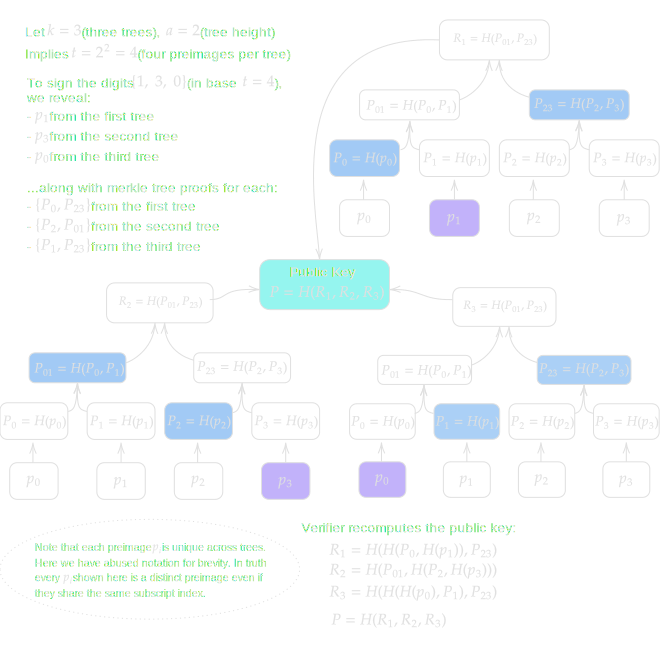
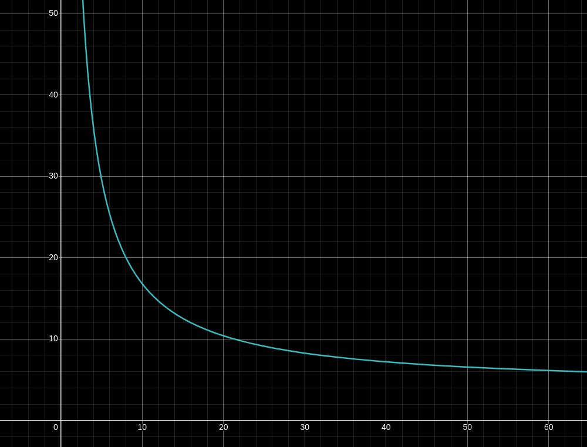
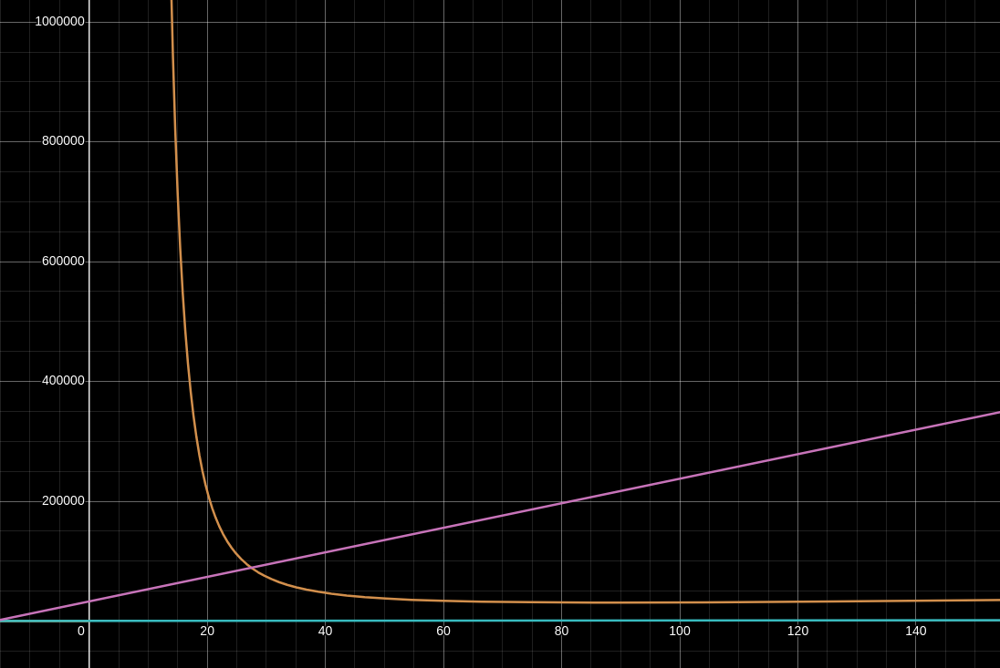
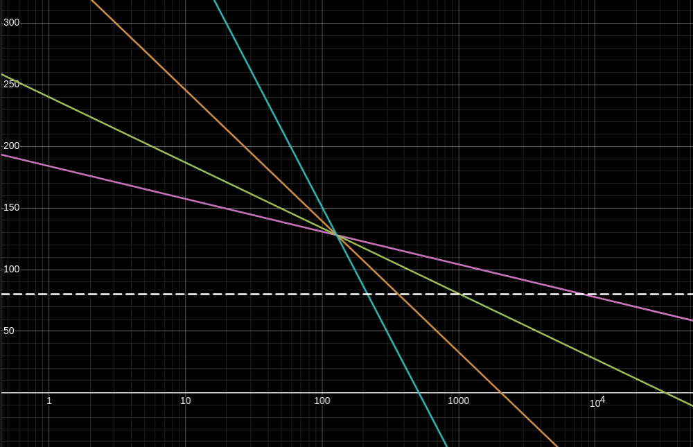
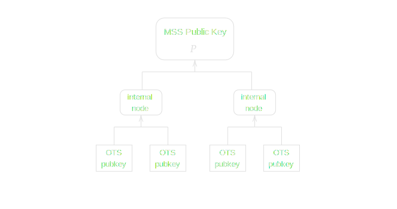
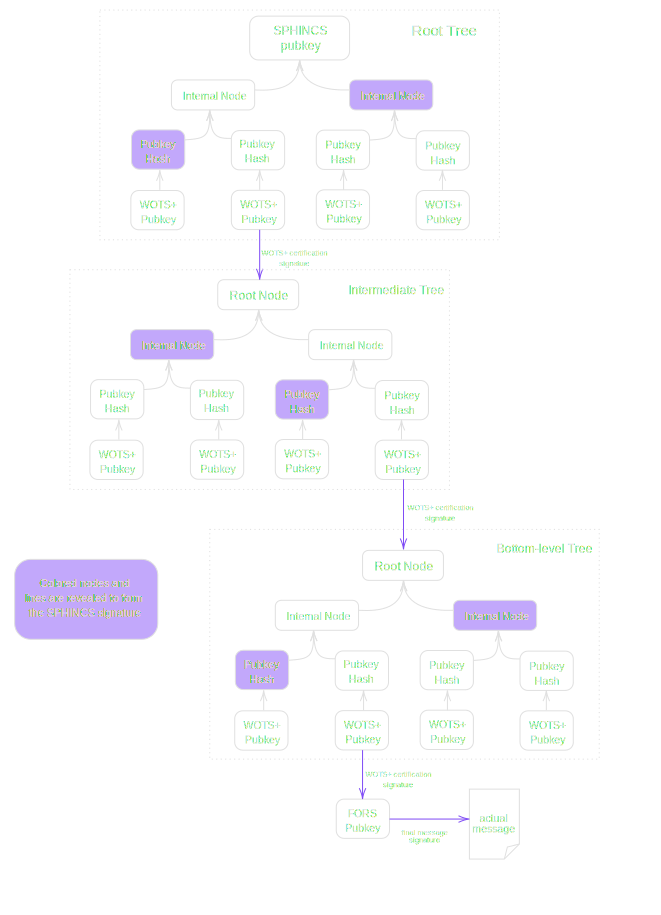

> *作者：conduition*
>
> *来源：<https://conduition.io/cryptography/quantum-hbs/>*
>
> *[前篇见此处](https://www.btcstudy.org/2026/03/04/hash-based-signature-schemes-for-post-quantum-bitcoin-part-2/)：Lamport 签名、Winternitz 一次性签名（WOTS）、哈希以获得随机子集（HORS）*

## 随机子集森林（FORS）

“FORS” 是另一种少量签名方案 ，基于前文所述的 HORS 。最早，它是在 2017 年出版的 [SPHINCS+ 论文](https://sphincs.org/data/sphincs+-paper.pdf)中作为一个要素要提出的，但它自身发展出了一个定义，因为它加强了 HORS，极大地缩小了签名的体积。

HORST 与 FORS 的主要区别在于，FORS 公钥表示为 *多棵* 默克尔树的哈希值 —— 因此它使用了术语 “森林”。与 HORST 一样，这些树的每一个叶子结点，都是一个秘密值原像的哈希值，而我们是通过揭晓具体的原像以及它们的默克尔树成员证明来签名数据的。

令 $k$ 为默克尔树的数量，而 $t = 2^a$ 是每棵树上的原像的数量，那么总共就有 $kt$ 个原像。每棵树的层高都是 $a$ 。

这种构造给了我们 $k$ 个默克尔树根值 $\lbrace R_1 ... R_k\rbrace$，我们哈希这些树根，就能派生出 FORS 公钥 $P = H(R_1 ... R_k)$ 。

为了签名一条消息 $x$，我们使用一种随机化的子集挑选算法 $S_H(x)$ 对 $x$ 运行哈希计算，从而获得 $\vec{h} = \lbrace h_1 ... h_k\rbrace$，其中每一个数位 $h_i$ 都满足 $0 \le h_i \lt t$（就跟 HORST 一样）。但是，HORST 使用这些数位来检索 *单棵* 默克尔树上的叶子，而 FORS 则使用这些数位来检索 *各个* 默克尔树上的叶子 —— 每个数位对应一棵树 —— 从而选择要揭晓各个树上的哪个原像。这保证了 FORS 签名总是具有恒定的体积（与 HORS 和 HORS 不同）。

- 译者注：如图，签名人从每棵树揭晓一个原像，并提供该原像所对应的叶子的默克尔证据；最终，各默克尔树的根值的哈希值应该是公钥，否则签名无效。 -

FORS 被设计成从一个小体积的种子生成秘密值原像，所以私钥的体积是固定的。给定一个秘密的 FORS 种子 $s$，我们可以用 $p_i = H(s, i)$ 来派生出第  $i$ 个原像。在派生出 $\lbrace p_0 ... p_{tk-1}\rbrace$ 个原像之后，我们可以将它们分组（每组有 $t$ 个原像），然后从中构造出 $k$  棵默克尔树。

> **安全提醒**：FORS 被设计为使用 *调整的* 哈希函数，以防止多目标攻击：敌手可以利用预计算（precomputation），并行对多个密钥运行撒网式攻击（drag-net attack）。不要实现没有妥善调整每一次哈希迭代（不使用命名空间）的幼稚 FORS 。这种风险在 HORS 和其它签名方案里面页存在，但直到最近我们才充分理解。
>
> 尤其需要注意的是，子集挑选算法 $S_H(x)$ 必须使用一个 **秘密值** 来调整，以防止主动的选择明文攻击者：他们会挑选消息让签名人签名，从而诱使签名人揭晓他们所需要的特定原像。[来源](https://eprint.iacr.org/2020/564.pdf)。

### 属性

**安全性**。与它的前辈一样，FORS 是一种少量次数的签名方案，签名人可以自信地量化子集的公钥的安全性，即使他们已经释放出一些签名。一个 FORS 公钥，在释放 $r$ 个签名以后，抵御（攻击者选择明文的）签名伪造攻击的比特安全性为：

$$ b = k(a - \log_2 r) $$

- <a href="https://eprint.iacr.org/2020/564">来源</a> -

通过固定安全性等级：释放 $r$ 个签名后保持 $b$ 比特，我们可以在下面这个函数中代入 “森林” 中的树的数量，计算出各树应当具有的树高 $a$ 。

$$
\begin{align}
k(a - \log_2 r) &= b \\\\
a - \log_2 r &= \frac{b}{k} \\\\
a &= \frac{b}{k} + \log_2 r 
\end{align}
$$

- 横轴为 $k$ 值（树的数量）；纵轴为 $a$ 值（各树的树高）。本图使用 $r = 128$ 及 $b = 128$（即释放 128 个签名后保持 128 比特的安全性）计算出来 -

举个例子，使用 $k=32$ 棵树以及 $r=128$ 个签名，我们需要的树高为 $a=11$，那么总共需要 $32 \cdot 2^{11} = 2^{16} = 65536$ 个原像。

$$ a = \frac{128}{32} + \log_2 128 = 4 + 7 $$

**体积**。FORS 公钥和私钥的体积都是恒定的 $n$ 个比特。

一个 FORS 签名的构成为：$k$ 个原像，加 $k$ 个默克尔树证据（每个都包含 $a$ 个哈希值），所以总计是 $nk(a + 1)$ 个比特。

**运行时间**。密钥生成需要派生出 $kt = k \cdot 2^a$ 个原像、哈希这 $kt$ 个原像，然后从中计算出 $k$ 个默克尔树根。最后，使用一次哈希运算将这些默克尔根值压缩为公钥，因此，密钥生成的运行时间总计为：

$$ O(3k \cdot 2^a + 1) $$

签名需要调用一次 $S_H(x)$ （可以假设就是一次哈希运算） 以决定要暴露哪些原像，还要构造 $k$ 个默克尔树成员证据。如果签名人可以缓存默克尔树的所有内部结点，他们只需一次 $H$ 哈希运算就能生成签名。

相反，如果从仅仅保存了（在密钥生成之前生成的）种子的状态开始，那么，为了给一棵默克尔树构造一个证据，就首先要派生出该树的 $2^a$ 个原像；然后，他们要在树的第 0 层计算 $2^a-1$ 次哈希、在第 1 层计算 $2^{a-1}-1$ 次哈希、在第 2 层计算 $2^{a-2}-1$ 次哈希，以此类推，直到抵达第 $a-1$  层，此时只需 1 次哈希运算，就能得到最终默克尔根。更广义地说，从零开始构造一个默克尔证据，需要总计  $2^a + \sum_{i=1}^{a} (2^i - 1) = 3 \cdot 2^a - a - 2$ 次 $H$ 运算。签名人必须构造 $k$ 个默克尔证据，因此，最坏情况下，总的运行时间为：

$$ O(k(3 \cdot 2^a - a - 2)) $$

验证者的运行时间要小得多。验证者必须运行 $S_H(x)$ 以计算出原像的索引。他们必须哈希签名中的 $k$ 个原像，并为每一个原像运行 $a$ 次哈希运算，以验证其默克尔证据（总计  $k$ 次）。最后，还需要一次哈希运算（期待各默克尔根值的哈希值会是签名人的公钥）， 所以验证者的总的运行时间为：

$$ O(k(a + 1) + 2) $$

关于 FORS 签名的 运行时间/占用空间 表现，请看下图。在这个可视化案例中，我将 FORS 的安全参数固定为 $r = 128$ 以及 $b = 128$（即释放 128 个签名后保持 128 比特的安全性），而一个哈希输出的长度为 $n= 256$ 。

横轴是我们的输入：$k$，即 FORS 树的数量。树高 $a$ 则使用上文说的 $k$ 的函数计算出来，以获得我们需要的安全性。

- 橙色曲线是 $kt = k \cdot 2^a$，表示签名人必须生成并哈希成公钥的原像的总数量。这条曲线与密钥生成的运行时间和签名运行时间都是直接的正比例关系（如果缓存了默克尔树中间结点，则与内存的占用成正比例关系），但它并不影响 私钥/公钥 的体积。
- 粉色直线是签名的大小 $nk(a + 1)$ （以比特计），它会随着 $k$ 增大而线性增大。
- 蓝色直线紧贴横轴，是验证者的运行时间 $O(k(a + 1) + 2)$ 。它也跟 $k$ 呈线性关系，只是，在所有合理的 $k$ 值下，验证者需要的哈希求值次数最多也不过 1000 次左右。

这表明，对于我们这里固定的 $b$ 值和 $r$ 值，我们可能希望设定 $8 \le k \le 64$ 。如果更低，签名人的运行时间会指数膨胀。如果更高，则带来的签名人运行时间节约会逐渐递减。

稍微调整参数之后，我们发现，使用更少但更大的树（即更小的 $k$ 以及更大的 $t$），签名人在更小的签名体积之外还获得了别的好处。与 HORS 一样，更小的 $k$ 意味着每次签名要揭晓的原像更少，因此安全性层级 $b$ 在每次签名之后下降得更慢。

请看下图，以 $r$ 为输入，横轴为对数刻度。

纵轴是释放 $r$ 个签名之后得预期安全性等级 $b$ 。不同颜色的线表示不同 FORS 参数集的安全性降低情况。FORS 树高依然是用 $a = \frac{b}{k} + \log_2 r$ 这个公式以及 $b = 128$、 $r=128$ 计算出来的，但这图展示了签名人释放 128 个签名之前 *以及之后* 的情形。 

- 粉色线代表的是 $k = 8$、 $a = 23$ 的 FORS 实例。
- 绿色线代表的是 $k = 16$、 $a = 15$ 的 FORS 实例。
- 橙色线代表的是 $k = 32$、  $a = 11$ 的 FORS 实例。
- 蓝色线代表的是 $k = 64$、  $a = 9$ 的 FORS 实例。
- 白色的虚线代表的是 $y = 80$ 比特的安全性，它代表的是 **近似** 的安全性下限，低于这个，以当前可用的硬件水平，伪造签名就成为现实可行的了。

请注意，$k=8$ 的 FORS 签名人（粉色线），在公钥的预期安全性下降到 80 比特以前，可以创建大约 $10^4 = 10,000$ 个签名。它的极端反面是，$k=64$ 的 FORS 签名人（蓝色线），创建 214 个签名之后，其预期安全性就会下降到 80 比特以下。即使对四个签名人来说，树高 $a$ 都是以同样的方式计算出来的，使用更少数量的树的签名人的安全性下降起来也慢得多。

### 修改

**抵抗主动选择明文攻击的安全性**：[这篇论文](https://eprint.iacr.org/2020/564.pdf)建议修改 FORS 签名算法，让子集挑选函数 $S_H(x)$ 依赖于签名自身，而签名使用一个链条。作者们管这种算法叫 “动态的 FORS”（DFORS）。但他们也之处，直接加入一个伪随机的盐（salt），就像 SPHINCS+ 那样，也已经足以抵御主动的选择明文攻击。因此，我选择不再添加细节，因为 DFORS 修改似乎是不必要的。

**使用暴力搜索压缩，实现更高效的签名**：[这篇论文](https://ieeexplore.ieee.org/stamp/stamp.jsp?tp=&arnumber=10179381)建议修改 FORS 的签名算法，让签名人重复哈希输入消息 $x$ 与一个递增的、32 比特的 盐/计数器 $s$，直到 $S_H(x \parallel s) \rightarrow \lbrace h_1 ... h_k\rbrace$ 产生一组索引，以零值收尾，即 $h_k = 0$ （换句话说，加盐之后的消息的哈希值的最后 $a$ 个比特都是 0）。因此，签名人可以用 FORS 算法来签名数位集合 $\lbrace h_1 ... h_{k-1}\rbrace$，省略掉 $h_k$ ，而把盐 $s$ 的值放在签名中。验证者重新计算索引并检查最后的数位符合 $h_k = 0$ 的要求。

因为 $h_k = 0$ 也由验证者强制执行，签名人可以从签名中省略最后一个原像以及它的默克尔证据，因为消息的这个数位可以假设是静态的（一个永不改变的消息，当然也就不需要签名）。实际上，签名人甚至不需要 *生成* 第 $k$ 棵树。

这一修改的效果在于，将签名的体积缩小了大约 $n(a+1)$ 比特，同时，将签名/验签 的运行时间也缩减了（虽然我还没有验证过这一点）。作者将这一修改称为 “带压缩的 FORS”（FORS+C）。

作者也指出，如果签名人希望进一步缩减签名的体积，他们可以运行额外的计算，也就是暴力搜索出以更多 0 结尾的哈希值，省略掉倒数第二个数位（以及相应的倒数第二棵树）。

直觉上，这种压缩机制会对使用更大树结构（$t = 2^a$ 更大）的实例有更大的影响，因为从签名结构中删减掉一棵树会造成相对更大的影响。当然，其中的取舍在于，我们必须运行更多的计算，来发现一个盐，使我们带盐的消息能产生以 $a$ 个 0 结尾的哈希值。平均而言，为了产生 $a$ 个 0 结尾的哈希值，我们需要运行 $2^{a-1}$ 次哈希计算；在最差情况下，则是 $2^a$ 次。

**使用 Winternitz 链条实现更小的签名**：[这篇论文](https://eprint.iacr.org/2022/059.pdf)建议，将每一棵 FORS 树的叶子延长为一个哈希值链条，很像 Winternitz 一次性签名方案。这个额外的维度给出了一个新的参数 —— Winternitz 链条的长度$w$ ，使用它，我们就能扩大可能的签名空间。这样一来，签名就由来自 FORS 树叶子的哈希链条的中间哈希值组成了。

消息体积不变、可以签名的空间却变大，意味着，在理论上，签名会是更安全的。这种修改后的方案称为 “随机链条森林”（FORC）。你可以认为，标准的 FORS 其实是链条长度 $w=1$ 的 FORC 实例。

作者们证明了，这一延申，可以将两个签名在一棵树上碰撞的概率，从标准的 FORS 方案中的 $1/t$（叶子数量分之一），降低到 FORC 中的  $(1/t) \cdot \frac{w+1}{2w}$ ，其中 $w$ 是 Winternitz 链条的长度。

不幸的是，FORC 并没有为释放 $r$ 个签名之后的  FORC 公钥比特安全性提供明确的公式，所以我们只能自己推导一下。

> 这里是我的推导
>
> 回顾一下，在释放 $r$ 个签名以后，使用 $k$ 棵树的 FORS 公钥的比特安全性 $b$ 为：
>
> $$ b = k(a - \log_2 r) $$
>
> 转化一下，这意味着 $r$ 个签名允许伪造的概率为：
> $$
> \begin{align}
> 2^{-b} &= 2^{-k(a - \log_2 r)} \\\\
>        &= (2^{(a - \log_2 r)})^{(-k)} \\\\
>        &= (2^{a} \div 2^{\log_2 r})^{(-k)} \\\\
>        &= (t \div r)^{(-k)} \\\\
>        &= \left(\frac{r}{t}\right)^{k} 
> \end{align}
> $$
>
> 而在 FORC 中，每棵树内的碰撞概率 $r/t$（在一棵树上产生 $r+1$ 次原像索引的概率）要乘以因子 $\frac{w+1}{2w}$ ：
>
> $$
> \begin{align}
> 2^{-b} &= \left(\frac{r}{t} \cdot \frac{w+1}{2w} \right)^{k}
> \end{align}
> $$
>
> 将概率转化回比特安全性：
>
> $$
> \begin{align}
> 2^b &= \left(\frac{r}{t} \cdot \frac{w+1}{2w} \right)^{-k} \\\\
> 2^b &= \left(\frac{t}{r} \cdot \frac{2w}{w+1} \right)^{k} \\\\
> b &= \log_2 \left(\frac{t}{r} \cdot \frac{2w}{w+1} \right)^{k}
> \end{align}
> $$
>
> 使用对数恒等式 $\log \frac{x}{y} = \log x - \log y$ 以及 $\log xy = \log x + \log y$ ：
>
> $$
> \begin{align}
> b &= k \cdot \log_2 \left( \frac{t}{r} \cdot \frac{2w}{w+1} \right) \\\\
>   &= k \cdot \left( \log_2 \left(\frac{t}{r} \right) + \log_2 \left( \frac{2w}{w+1} \right) \right) \\\\
>   &= k \cdot \left( \log_2 t - \log_2 r + \log_2 \left( \frac{2w}{w+1} \right) \right) \\\\
>   &= k \cdot \left( a - \log_2 r + \log_2 \left( \frac{2w}{w+1} \right) \right)
> \end{align}
> $$
>
> 因此，通过将 FORS 的树叶延长为长度为 $w$ 的  Winternitz 链条，我们得到的比特安全性是 $b = k \cdot \left( a - \log_2 r + \log_2 \left( \frac{2w}{w+1} \right) \right)$ 。这比标准的 FORS 方案提高了 $\log_2 \left( \frac{2w}{w+1} \right)$ 比特，当 $w=1$ 时，提升就成了 0 。

所以，FORC 的安全性层级为  $b = k \cdot \left( a - \log_2 r + \log_2 \left( \frac{2w}{w+1} \right) \right)$ 比特。

这 比标准的 FORS 方案提高了 $\log_2 \left( \frac{2w}{w+1} \right)$ 比特，当 $w=1$ 时，提升就成了 0 。

对于给定的安全参数集合 $b$ 和 $r$ ，我们可以在一个三维的 FORC 配置空间中画出一个表面。但我实在是不想画了，所以你只能自己动手了。这个表面代表了能够满足这些安全参数的 $(k, a, w)$ 的可能组合。 从更大的 $w$ 值中得到的安全性，可以用来实现更小或更少的 FORS 树，而保持安全性不变。

但是，随着 $w$ 增大，这种节约效果很快就消失了。看起来 $w=16$ 就是有用性的极限，超过这个数值，安全性收益就变得非常少（以签名体积缩减来衡量）。绝大部分节约效果都是由链条上的前几次哈希带来的。Winternitz 链条的长度小到 $w=4$ 时，就已经可以将前面体积缩减几千个比特。

这些 安全性/体积 节约的代价是，FORC 必须为  FORS  的每一个叶子处理哈希链条。密钥生成和签名的运行时间都要乘以 $w$ ，因为签名人必须为每一个叶子计算 $w$ 次哈希迭代，而不能只 计算 1 次。验证速度，（在最差情况下）也要慢上 $k(w-1)$ 倍（每一次哈希运算），不过可以通过 $k$ 和 $w$ 的合理选择来缓解。

### 比较

下表展示了 FORS 签名的 时间/空间 取舍的一些具体案例。在这些案例中，我们固定安全等级为在释放 $r$  个签名之后仍有 $b = 128$ 比特的安全性。主要的哈希函数 $H$ 的输出长度是 $n = 256$，所以的体积都以比特来衡量。

|                 算法                  |        签名体积         | 公钥体积  | 私钥体积  |
| :-----------------------------------: | :---------------------: | :-------: | :-------: |
|   FORS $k = 8$, $t = 2^{18}$, $r=4$   |   $nk(a + 1) = 38912$   | $n = 256$ | $n = 256$ |
|   FORS $k = 8$, $t = 2^{19}$, $r=8$   |   $nk(a + 1) = 40960$   | $n = 256$ | $n = 256$ |
|  FORS $k = 8$, $t = 2^{20}$, $r=16$   |   $nk(a + 1) = 43008$   | $n = 256$ | $n = 256$ |
|  FORS $k = 8$, $t = 2^{21}$, $r=32$   |   $nk(a + 1) = 45056$   | $n = 256$ | $n = 256$ |
|                  ...                  |                         |           |           |
|  FORS+C $k = 8$, $t = 2^{18}$, $r=4$  | $n(k-1)(a + 1) = 34048$ | $n = 256$ | $n = 256$ |
|  FORS+C $k = 8$, $t = 2^{19}$, $r=8$  | $n(k-1)(a + 1) = 35840$ | $n = 256$ | $n = 256$ |
| FORS+C $k = 8$, $t = 2^{20}$, $r=16$  | $n(k-1)(a + 1) = 37632$ | $n = 256$ | $n = 256$ |
| FORS+C $k = 8$, $t = 2^{21}$, $r=32$  | $n(k-1)(a + 1) = 39424$ | $n = 256$ | $n = 256$ |
|                  ...                  |                         |           |           |
|  FORS $k = 16$, $t = 2^{10}$, $r=4$   |   $nk(a + 1) = 45056$   | $n = 256$ | $n = 256$ |
|  FORS $k = 16$, $t = 2^{11}$, $r=8$   |   $nk(a + 1) = 49152$   | $n = 256$ | $n = 256$ |
|  FORS $k = 16$, $t = 2^{12}$, $r=16$  |   $nk(a + 1) = 54248$   | $n = 256$ | $n = 256$ |
|  FORS $k = 16$, $t = 2^{13}$, $r=32$  |   $nk(a + 1) = 57344$   | $n = 256$ | $n = 256$ |
|                  ...                  |                         |           |           |
| FORS+C $k = 16$, $t = 2^{10}$, $r=4$  | $n(k-1)(a + 1) = 42240$ | $n = 256$ | $n = 256$ |
| FORS+C $k = 16$, $t = 2^{11}$, $r=8$  | $n(k-1)(a + 1) = 46080$ | $n = 256$ | $n = 256$ |
| FORS+C $k = 16$, $t = 2^{12}$, $r=16$ | $n(k-1)(a + 1) = 49920$ | $n = 256$ | $n = 256$ |
| FORS+C $k = 16$, $t = 2^{13}$, $r=32$ | $n(k-1)(a + 1) = 53760$ | $n = 256$ | $n = 256$ |
|                  ...                  |                         |           |           |
|   FORS $k = 32$, $t = 2^{6}$, $r=4$   |   $nk(a + 1) = 57344$   | $n = 256$ | $n = 256$ |
|   FORS $k = 32$, $t = 2^{7}$, $r=8$   |   $nk(a + 1) = 65536$   | $n = 256$ | $n = 256$ |
|  FORS $k = 32$, $t = 2^{8}$, $r=16$   |   $nk(a + 1) = 73728$   | $n = 256$ | $n = 256$ |
|  FORS $k = 32$, $t = 2^{9}$, $r=32$   |   $nk(a + 1) = 81920$   | $n = 256$ | $n = 256$ |
|                  ...                  |                         |           |           |
|  FORS+C $k = 32$, $t = 2^{6}$, $r=4$  | $n(k-1)(a + 1) = 55552$ | $n = 256$ | $n = 256$ |
|  FORS+C $k = 32$, $t = 2^{7}$, $r=8$  | $n(k-1)(a + 1) = 63488$ | $n = 256$ | $n = 256$ |
| FORS+C $k = 32$, $t = 2^{8}$, $r=16$  | $n(k-1)(a + 1) = 71424$ | $n = 256$ | $n = 256$ |
| FORS+C $k = 32$, $t = 2^{9}$, $r=32$  | $n(k-1)(a + 1) = 79360$ | $n = 256$ | $n = 256$ |

我省略了 FORS 的变种  FORC 的具体体积，因为那会造成不公平比较。公平的比较需要使用稍微高一些或者低一些的安全性层级 $b$ ，从而让 $k$ 和 $a$ 固定为整数。FORC 的签名大小与 FORS+C 是可以比较的：在一些参数组合中，前者稍小，而在另一些组合中，前者稍大。

在下表中，我给出了各 FORS 方案的时间复杂度，以哈希函数 $H(x)$ 的运算次数衡量。

|  算法  |       密钥生成时间        |      签名时间（最差情形）       |       验证时间        |
| :----: | :-----------------------: | :-----------------------------: | :-------------------: |
|  FORS  |   $O(3k \cdot 2^a + 1)$   |   $O(k(3 \cdot 2^a - a - 2))$   |   $O(k(a + 1) + 2)$   |
| FORS+C | $O(3(k-1) \cdot 2^a + 1)$ | $O((k-1)(4 \cdot 2^a - a - 2))$ | $O((k-1)(a + 1) + 3)$ |
|  FORC  |  $O(3kw \cdot 2^a + 1)$   | $O(k((w+3) \cdot 2^a - a - 2))$ | $O(k(w + a + 1) + 2)$ |

### 对比特币的适用性

FORS 协议的密钥安全性比 HORST 要强很多；同样大小的签名，前者提供了强壮得多的少量次数签名安全性，允许一个公钥在安全性耗尽之前释放更多签名。FORS 也是一个得到了充分研究的协议，有许多的变种和基于它的更高级协议。

这种少量次数签名方案可以是比特币应用场景的一个候选，只是其签名体积很大。即使是最小的 FORS+C 签名，使用 $b=128$ 、$r=4$ 、$k=8$ 和 $a=18$ 的安全参数，签名体积依然是 4256 字节，是 Schnorr 签名的 66 倍，是 WOTS 签名的 4 倍（只是其验证开销更低，而且具有可变的多次使用安全性）。FORS+C 所提供的压缩效果是巨大的，只是最终依然无法与传统的椭圆曲线密码学（ECC）相比。

将 FORS+C 与 FORC 的原理相结合，可以得到更小体积的签名，也值得进一步探索，但似乎最多也仅仅是让每个签名缩减几千个比特。

## 默克尔签名方案（MSS）

MSS 是我们要提到的第一种 “多次签名”（MTS）方案，与上文提到的 *一次性签名* 和 *少量次数签名* 相对。它由 [Ralph Merkle 在 1979 年首次提出](https://www.ralphmerkle.com/papers/Thesis1979.pdf)（跟 “默克尔树” 这种数据结构的命名人是同一个）。

MSS 的极度简单的前提是：通过将许多 *一次性* 签名（OTS）的公钥安排为一棵默克尔树的叶子，我们就可以每次使用一个 OTS 公钥来签名，并且使用这棵默克尔树的根值简洁地证明任何一个 OTS 公钥的成员资格。  因此，我们的主公钥就被定义为这棵默克尔树的根哈希值。如果 $h$ 是这棵 默克尔树的树高，那么这个公钥最多可以提供 $2^h$ 个有效签名。

签名人先采样出 $2^h$ 个随机值作为 OTS 私钥 $\lbrace p_1 ... k_{2^h}\rbrace$ ，然后计算它们的公钥  $\lbrace P_1 ... P_{2^h}\rbrace$。然后，将这些公钥的哈希值 $\lbrace H(P_1) ... H(P_f{2^h})\rbrace$ 作为叶子，构造出默克尔树，最终将其树根 $P$ 用作 MSS 公钥。

MSS 有许多变种，最著名的一种是 “[延申的默克尔签名方案](https://eprint.iacr.org/2011/484.pdf)”（XMSS），它以 Winternitz 一次性签名方案来实例化 MSS 。下一种候选协议 SPHINCS ，也许也可以说是 MSS 的一种实例，但是 SPHINCS 已经激烈地偏离了默克尔的最初方案，所以，最好还是把它当成完全独立的一类方案。

因为下面将要介绍的这个有前景的候选方案，我不再赘述 MSS 的协议细节。如果你想知道 MSS 协议的一个具体案例，我强烈建议你阅读 [XMSS 论文](https://eprint.iacr.org/2011/484.pdf)。

### 对比特币的适用性

虽然 MSS 方案让我们第一次看到了真正可扩容的基于哈希函数的签名，它依然背着带状态性的负担。想要安全地使用任何 MSS 签名方案，签名人必须始终记得自己用过了哪些 OTS 密钥叶子 —— 通常需要实现一个简单的计数器。如果他们丢失了这个状态，就无法继续安全地使用这个公钥。如果签名人不小心使用相同的状态释放了多于一个 MSS 签名，那个 OTS 密钥叶子就会暴露，进而危及整个密钥。

不过，MSS 的 *原则* 是非常灵活的，所以许多新的基于哈希函数的签名协议都基于 MSS 的核心想法，也包括我们接下来要介绍的这种。

## SPINCS+

“[SPHINCS+](https://sphincs.org/data/sphincs+-paper.pdf)” 是一种最新的基于哈希函数的签名系统，它利用了我在前文介绍的各种签名方案的概念。SPHINCS+ 是当前唯一一种被 NIST（美国国家标准与技术研究所） [认可为后量子电子签名方案](https://doi.org/10.6028/NIST.FIPS.205) 的基于哈希函数的签名（HBS）协议。在 NIST 的术语种，SPHINCS 被称为 “SLH-DSA” 或者 “无状态的基于哈希函数的电子签名算法”。你看，SPHINCS 的特殊性还在于，它不像绝大部分使用哈希函数的多次签名（MTS）方案，SPHINCS *不要求签名人保留状态*。

SPHINCS+ 的密钥生成开始于三个秘密的随机数值：

- $\textbf{SK}.\text{seed}$
- $\textbf{SK}.\text{prf}$
- $\textbf{PK}.\text{seed}$

签名人这样构造出公钥：从 $\textbf{SK}.\text{seed}$ 中确定性地建构出一棵 MSS 树，树上的每个叶子都是一个 WOTS+ 公钥。如果这棵树的树高是 $h'$，那么签名人就必须先派生出 $2^{h'}$ 个 WOTS+ 私钥。这棵树的根哈希值 $\textbf{PK}.\text{root}$ 与 $\textbf{PK}.\text{seed}$，一同构成了 SPHINCS+ 公钥。

如果我们使用这些 WOTS+ 公钥来直接签名消息，那么它就不过是 MSS 的又一个变种，但 SPHINCS 走得更远。

这些 WOTS+ 密钥叶子，并不用来签名消息，而用来 *认证一棵  MSS（子）树* ；这些子树的叶子也是 WOTS+ 公钥， 以此类推；在循环 $d$ 轮之后， 最终以 $2^h$ 个叶子的集合结束。这个更高阶数的 *由树构成的树*，通常叫做 “超级树”（听起来就很厉害，加分！），而它的整体树高（加总了所有内部树的高度和根树的高度）是 $h$ 。超级树每每一棵内部树的高度都是 $h/d$ 。

这种方法的好处在于，它跟简单的 MSS 树不同，它签名消息使用的是超级树底层的叶子，而签名人是不需要重新派生出整棵超级树的 —— 他们只需要派生出从叶子到树根的路径上的经过认证的树。所有其它树都可以忽略掉。

最终的 $2^h$ 个 WOTS+ 密钥对 *可以* 用来直接签名消息，但 SPHINCS 还是将它们用作一种最终的认证层，用来签名一组少量次数签名（FTS）密钥对。具体来说，在 NIST 认可的最新变种 SPHINCS+ 中，这些 FTS 密钥对使用的是 “随机子集森林”（FORS）算法，这我们在前面介绍过了。

完整的 SPHINCS+ 签名是一个包裹，由以下元素组成：

- 对具体消息的一个 FORS 签名
- $d$ 个 WOTS+ 认证签名
- $d$ 个默克尔树证据 —— 每个 WOTS+ 认证公钥一个
- 一个随机化因子 $\textbf{R}$（我们后面会解释）

看下面这个图示：它的 $d = 3$、$h = 6$ 。要签名一条给定的消息，签名人只需要重新派生出这三棵树（每棵树携带 4 个密钥）。他的总树高为 $h=6$，所以他实际上拥有 $2^h = 64$ 个叶子密钥可以签名。但签名人不需要派生出这些密钥中的绝大部分，因为他们都存放在隐藏的树上，与他用来签名的具体叶子密钥无关。

SPHINCS 签名中的元素（加上消息）让验证者可以重新构造出超级树的根结点，然后再与 SPHINCS 公钥中的树根哈希值 $\textbf{PK}.\text{root}$ 相比对。

**“为什么要混合两种签名算法呢？为什么不只使用 FORS？”**

SPHINCS 使用 WOTS+ 来认证中间树（以及 FORS 密钥），因为 WOTS+ 提供了目前所有 HBS 方案中最小的签名。取决于超级树的层数，我们需要提供多个认证签名，所以保证签名体积较小是有很大的好处的。没错，WOTS+ 是一种 一次性 签名方案，但这不是问题，因为树和我们用来运行 WOTS+ 算法生成认证签名的密钥，都是从 $\textbf{SK}.\text{seed}$ 中确定性地派生出来的。 每次我们要签名消息的时候，我们就 *重新派生* 出一组密钥和树，所以，不会有哪一个 WOTS 密钥对被用来认证两棵不同的树（或者两个不同的 FORS 密钥）。

一旦初始的密钥种子生成，SPHINCS 就是完全确定性的。这也包括挑选哪个 FORS 密钥来签名。当我们被给定一条消息 $M$ 时，我们从秘密的 PRF（伪随机函数）种子计算一个 $n$ 比特的 *随机化因子* $\textbf{R} = H(\textbf{SK}.\text{prf}, M)$ 。然后，我们使用一种特殊的哈希函数 $H_{\text{msg}}$ 来计算消息摘要 $\text{MD}$ 以及我们用来签名它的 FORS 密钥的地址  $\text{idx}$  。

$$ (\text{MD}, \text{idx}) = H_{\text{msg}}(\textbf{R}, \textbf{PK}.\text{seed}, \textbf{PK}.\text{root}, M) $$

随机化因子 $\textbf{R}$ 会放到  SPHINCS 签名中，让验证者可以重新计算出 $(\text{MD}, \text{idx})$ 。

### 属性

SPHINCS 看起来像是一种带状态的签名方案 —— 不管怎么说，对消息的实际签名是用一种少量次数签名协议 FORS 生成的，所以，难道签名人不需要大概知道自己的某一个 FTS 密钥对用过多少次？

但实际上，SPHINCS 被标榜为一种无需记忆的签名协议。你看，如果我们增加超级树的整体高度 $h$  —— 通常会加高到 64 —— 一个 SPHINCS 签名人将拥有非常多的 FORS 密钥，以至于从中随机挑选密钥来签名时，一个 FORS 公钥复用的概率将低到可以忽略不计，并且， 由于 FORS 的少量次数签名（FTS）安全性，仅凭两个 FORS 签名就能伪造签名也是极不可能的。

我们可以让超级树变得如此高，是因为密钥认证技巧让我们无需重新派生出所有的 FTS 叶子。即使是密集使用，绝大部分 FTS 密钥可能从来就没派生出来过，更别说使用了。但它们 *可以* 使用的事实，就带来了这种 *概率性的* 无需记忆属性。

最新的 SPHINCS+ 变种有非常小的公钥和私钥。公钥只有 $2n$ 个比特，虽然私钥是 $4n$ 个比特。

不过，SPHINCS 签名是非常大的。具体的体积取决于许多参数：

- 安全参数 $n$（哈希输出的长度）
- SPHINCS 参数 $d$ 和 $h$
- WOTS+ 参数 $w$ 和 $\ell$
- FORS 参数  $k$ 和 $t = 2^a$

SPHINCS+ 签名的总体积由以下公式给出：

$$ n(h + k(a + 1) + d \ell + 1) $$

[参考文献](https://sphincs.org/data/sphincs+-round2-specification.pdf)（请看第 36 页）。

基于不同的参数组合，签名的体积可能从 **8 kB**（最小的安全参数）到 **49 kB**（最高安全性）不等。[FIPS 标准](https://doi.org/10.6028/NIST.FIPS.205)的第 43 页给出了 NIST 推荐的具体参数组合，以及签名体积结果。

### 对比特币的适用性

SPHINCS 是非常强大的，而且有很多优势。无需记忆的签名使它能随时取代现有的签名算法（比如 Schnorr 签名），因为签名人无需担心耗尽安全性（也无需关心签名计数器）。SPHINCS+ 是一种完全标准化、开源且 NIST 推荐的签名算法，这个事实会给支持采用的论点带来更多信心。

在推荐的参数组合中中，NIST 设定 $h \ge 63$ ，这可以创建数量极多的 FORS 公钥，就算你每秒签名十亿条消息、连续签名十年，也依然不会用尽 FORS 公钥。这就是 SPHINCS 在签名体积和复杂性上的取舍：为了防止签名人即使这样使用（发布几十亿个签名）也不会重复使用公钥、丢失大量安全性，它的签名体积极大。

在比特币的历史上，最重度使用的公钥也没有签名过这么多消息 …… 除非是在闪电网络中，使用 2-of-3 多签名合约的参与者们可能每分钟签名几百条承诺交易 —— 但比特币区块链很少看到这些交易公开（也许，这个事实也是有用的）。

不过，SPHINCS 的缺点在于巨大的签名体积。即使是最小的 SPHINCS 签名，同样使用 128 比特的安全性，体积也会是 FORS 签名的两倍，是 BIP340 Schnorr 签名体积的 100 倍不止。

> *[续篇见此处](https://www.btcstudy.org/2026/03/09/hash-based-signature-schemes-for-post-quantum-bitcoin-part-4/)：比特币量子抗性升级路径*

（未完）
