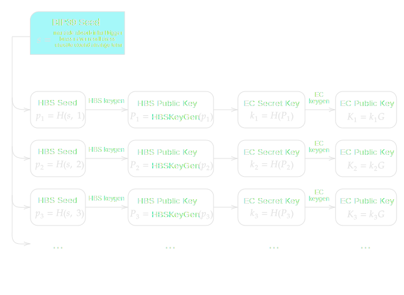

> *作者：conduition*
>
> *来源：<https://conduition.io/cryptography/quantum-hbs/>*
>
> *[前篇见此处](https://www.btcstudy.org/2026/03/06/hash-based-signature-schemes-for-post-quantum-bitcoin-part-3/)：FORS、MSS 以及 SPHNICS+*

## 分析

上文介绍的部分最新的签名方案满足了比特币应用场景的硬需求：

- 小体积的公钥和私钥
- 快速的签名验证时间

这些方案是：

- **WOTS / WOTS / WOTS** （一次性签名方案）
- **FORS / FORS** （少量次数签名方案）
- **SPHINCS+** （多次签名方案）

这些方案之间的主要取舍在于：

- 签名和密钥生成的运行时间性能
- 签名体积
- 签名人可以用一对密钥安全地释放而无需担心伪造的签名数量

这里提供一个简单的案例，以说明基于哈希函数的签名方案的可扩展性问题。如果一个比特币区块中的所有交易，都是尽可能小的 单输入-单输入 交易（在添加见证数据之前，大概是 320 重量单位）；并且，每一笔交易都使用一个签名作为自己的输入的见证，那么一个比特币区块的 400 万重量单位的空间，只需这样就会用尽：

- 如果使用 SPHINCS+ 签名，每个签名占用 **7856 见证字节**，只能装载 **490 笔交易**
- 如果使用 FORS 签名，每个签名占用 **4526 见证字节**，只能装载 **875 笔交易**
- 如果使用 WOTS 签名，每个签名占用 **1028 见证字节**，只能装载 **2976 笔交易**
- 如果使用 BIP340 签名（Schnorr 签名），每个签名占用 **64 见证字节**，能装载 **10000+ 笔交易**

截至本文撰写之时，每日新挖出的区块平均会被 3000 ~ 5000 笔交易填满，其中许多都花费了多个输入。

显然，不管使用哪种基于哈希函数的签名方案，要么我们要接受网络整体吞吐量的显著降低，要么，我们就得大大增加区块的体积。虽然  区块体积中增加的部分可以修建掉，因为这些签名会放在隔离区块之外的 *见证数据* 中，不会放在裸区块内。

## 更新比特币协议

除非用来开发一种真正的量子抗性升级，否则上面提到的签名方案对比特币没有任何影响。在这一节中，我会提出一种使用后量子的基于哈希函数的密码学来升级比特币、同时尽可能长时间保持兼容现有的椭圆曲线密码学（ECC）（以尽可能减少性能损失）的选择。

我并不是在鼓吹一定要用这种方式来使用基于哈希函数的签名（HBS）、升级比特币，我只是基于我的知识，尝试提出一种可能的、*务实的* 量子抗性升级。还有许多比我聪明得多的人也在研究这个问题，他们对我这里提出的方法，可能会有更多见解。

### 2024 年 12 月 16 日补注

说起比我聪明的人，[Matt Corallo 慷慨地为我们所有人设计了一个量子抗性升级](https://groups.google.com/g/bitcoindev/c/8O857bRSVV8) ，比我下文讲到的想法（DASK）更好。我更喜欢他的方法，不过希望使用一种更加紧凑和简单的基于哈希函数的签名方案，比如 WOTS 或 FORS 。

### 以摘要为私钥（DASK）

“以摘要为私钥”（DASK）是我为这种设想中的量子抗性升级发明的名字（它的特色在于缩写词可以念出来）。就我所知，还没有其他人提出过这个想法，不过我很乐于接受反例。不论这种想法是可行还是不可行，我都希望至少我并非孤身一人。

DASK 并不要求任何当下的共识变更，但鼓励一种客户端的规范变更，改变比特币钱包软件派生其椭圆曲线私钥的方式。*日后* 需要一个共识变更以回溯性地改变花费规则，并且**用户需要在分叉之前将钱币迁移到支持 DASK 的钱包软件**，但这些钱币的链上输出脚本不需要改变，所以 DASK 不会像全新的输出脚本格式那样影响比特币的可互换性、可扩展性和共识规则。

在 DASK 共识变更激活以前，比特币交易都使用椭圆曲线签名，跟今天完全一样。如果大型的量子计算机因为某些理由而永远不能实现， DASK 共识变更就永远不需要激活。

### 背景

一个比特币钱包通常是从一个编码为助记词的秘密种子派生而来的。钱包软件会使用 [BIP32](https://github.com/bitcoin/bips/blob/master/bip-0032.mediawiki) 和 [BIP44](https://github.com/bitcoin/bips/blob/master/bip-0044.mediawiki) 标准，从这个种子派生 子私钥/子公钥，这个过程会使用一个包含增量调整和哈希运算的系统。

我在这里过度简化了，但基本上，一个钱包就是从一个私钥 $k$ 和一个 “链码（chain code）”$c$ 开始的。为了计算一个子 私钥/链码 元组 $(k', c')$ ，我们哈希父 私钥/链码 对以及一个 32 比特的整数 $i$ ，然后将得到的哈希值加在父私钥上。*

$$ (k', c') = k + H(c, k, i) $$

\* 这讲的是 *加固的* BIP32 派生法。不加固的派生法哈希的是 *公钥*，不是 *私钥*。

BIP32 鼓励钱包软件迭代式运用这种方法，从而生成一棵可以无限大、无限深的树，软件将永远不会用尽新的签名密钥。一旦一个合适的子私钥 $k$ 派生出来，钱包软件就会用它计算出一个椭圆曲线公钥 $K = kG$ ，然后基于 $K$ 计算出某种格式（例如，P2PKH/P2WPKH/P2TR）的一个地址。

### DASK 介绍

**DASK 的想法是，派生出一个基于哈希函数的签名算法的公钥（或者说一个哈希值），然后将它用作椭圆曲线私钥 $k$ 。这些密钥，将不再使用 BIP32，而是从 BIP39 中自从，使用一种基于哈希函数的确定性算法（比如 FORS 或 SPHINCS）派生出来。**

举个例子，假设我们计算除了一个 FORS 公钥 $k$ ：我们先采样原像，然后从中构造出默克尔树们，然后计算出森林的根值 $k$ 。然后，我们将 $k$ 解析为一个椭圆曲线私钥，然后使用它为公钥  $K = kG$ 释放   ECDSA 签名或 Schnorr 签名。 

- DASK 概念的简化图示。为了区分版本和兼容性，在 BIP39 种子 $s$ 之后、HBS 公钥之前可能需要额外的派生层 -

“**为什么要这样呢？**”  

这种方法给了我们一个后备选项，在量子敌手（它可以用椭圆曲线公钥 $K$ 还原出我们的 “私钥” $k$ ）出现的事件中识别真正的主人。量子敌手可以找出 $k$ ，但 $k$ 自身又是一个 HBS 公钥，这是量子敌手 *无法* 反算的。

在量子计算机出现之后，比特币网络可以激活一项共识变更，在所有的地址上强制执行新的基于哈希函数的花费规则：**禁用 ECDSA/Schnorr ，转而要求来自 HBS 公钥 $k$ 的一个签名**。

因为 FORS、WOTS 和其它 HBS 验证算法通常都需要重新计算出一个具体的哈希摘要、将它与 HBS 公钥比对，所以，比特币的验证节点可以从基于哈希函数的签名中重新计算出  $k$ ，然后重新计算 $K = kG$、与输出脚本中的 $K$ 比对。

你可以将 *外层的* 椭圆曲线公钥 $K$ 看成是城堡的围墙或是护城河，而 *内层的* HBS 公钥 $k$ 是内殿或者堡垒：它是一个非常安全的备用空间，如果外层防御被突破，我们可以安全地退入备用空间。

- <a href="https://en.wikipedia.org/wiki/Siege_of_Kenilworth">Kenilworth 城堡</a>复原图。<a href="https://www.reddit.com/r/castles/comments/woztt/reconstruction_of_kenilworth_castle_later_middle/">来源</a> -

上述方法的一个例外是 taproot 地址，它的输出公钥 $K'$ 通常是经过一个内部公钥 $K$ 的哈希值增量调整过的。DASK 将无法直接用在 P2TR 地址中，因为验证者从 HBS 签名中计算出来的 HBS 公钥 $k$ 可能不是在 P2TR 输出脚本中编码的椭圆曲线点（公钥） $K'$ 的离散对数（私钥）。验证者必须也知道 taproot 脚本树的默克尔根 $m$，才能计算 $K' = kG + H(kG, m) \cdot G$ 。

我们有许多种办法可以处理这个问题，最明显的就是（以某种方式）直接把脚本树根值 $m$ 直接添加到 HBS 签名见证数据中。  对于绝大部分 P2TR 用户，$m$ 只是一个空的字符串。

在 “Q-Day”（量子计算机成熟的那一天）以前，比特币用户将可以继续使用 ECDSA 或 Schnorr 来签名，就跟今天一样。而在 Q-Day 之后，这种备用的 HBS 机制，将允许一种直接且安全的方法，让用户取回对资金的控制权。

### 好处

DASK 的主要好处在于，比特币网络当前并不需要实现任何共识变更。相反，DASK 只需要一个客户端的规范，然后用户可以自己选择支持 DASK 的钱包，用户体验不会发生重大的变化。比特币钱包客户端甚至可以被动地鼓励这种迁移，就是把用户的交易找零存入支持 DASK 的地址中，而不是前量子的 BIP32 地址中， 并且使用 DASK 而不是 BIP32 来生成新的收款地址。钱包软件可以在 DASK 共识变更激活以前就迁移钱币。如果 DASK 共识变更已知不激活，用户的处境跟迁移到 DASK 钱包生成方法以前相比，也不会有任何恶化。 

DASK 方法也可以用在哈希密码学以外的抗量子算法中。比如说，一个椭圆曲线私钥 $k$ 也可以从一个[CRYSTALS](https://pq-crystals.org)（格密码学）公钥 $k$ 中派生出来。$k$ 甚至可以是一组来自不同算法的公钥的默克尔树根值。

甚至，为了更好的灵活性，网络可以将基于哈希函数的公钥 $k$ 视为一个 *认证密钥*，使用一种我们已知安全的、签名体积较小的一次性签名算法，比如 WOTS 。当 Q-Day 到来，OTS 密钥 $k$ 可以用来认证一个用于尚未定义的算法的新公钥，等到 DASK 共识变更激活时，再确定用什么算法。

不管怎么说，看起来我们有希望在 Q-Day 到来之前发现比今天所知更加高效的抗量子签名算法，而WOTS 签名是一种相对较小、安全、面向未来的简单方法，可以给尚未定义的未来公钥背书。这种 *认证* 思路仿照了 SPHINCS 框架（使用 WOTS 公钥来背书子公钥，而不需要知道（重新派生）子公钥），所以在 HBS 的这种用法上，至少有一些得到充分记载的研究。

### 缺点

**共识复杂性**。为了让 DASK 是一种软分叉（而不是一种硬分叉），可能需要一些创造性和妥协。在 DSAK 共识变更激活之后，一些包含哈希签名的交易可能会被较老的比特币节点拒绝（因为它们期待其中仅包含一个椭圆曲线签名）。我甚至不知道有没可能做到（软分叉），希望听到这方面的建议。

**性能**。一个支持 DASK 的椭圆曲线私钥 $k$ 可能需要更多计算量来生成（相比于等价的、通过 BIP32 来派生的子私钥），因为基于哈希函数的签名算法通常需要大量的哈希运算来生成公钥，尤其是 WOTS，它为其小体积的签名支付的代价就是更糟的运行时间复杂度。

需要更多的研究和经验性的基准测试，才能作出确凿的性能表述。对我来说，在密钥生成性能上的任何合理的取舍，为了量子抗性，都是值得的。

**硬件签名器**。这是 DASK 的一个显著而且确定的缺点：不使用 BIP32 不加固生成法之后，拓展公钥（xpub）就失去意义了。

我们将被迫在 Q-Day 之前抛弃 BIP32，因为现有的钱包软件都把 BIP32 xpub 视为可以安全分发的东西。比如说，硬件签名器和多签名钱包软件都将传送 xpub 作为正常的用户体验的一部分。如前所述，当量子敌手知道了一个用户的 xpub，它们就能反算它并派生出所有的子私钥。使用 BIP32 来生成 HBS 密钥将适得其反，就如在流沙上筑起围墙。

相应地，我们将需要一种新的层级式确定性钱包标准、它仅仅使用已知量子安全的密码学原语。当前我所知的唯一选择就是哈希秘密种子，而种子显然是不能公开分享的。

比特币生态系统有多种依赖于不知道私钥的设备能为钱包独立派生公钥的应用场景，这可能会给它们带来负面影响。

- 仅观察的钱包
- 硬件签名器和其它空气隔离的（air-gapped）签名设备
- 多签名钱包

不过，这既不令人以外，也不是一个无法克服的问题。其它抗量子计算的解决方案也有这个问题，需要进一步的研究来优化用户提货，或者开发另一种从公开数据非交互式派生子地址的方法。

## 结论

深入研究基于哈希函数的密码学，对我来说是个大开眼界的经历。以往，我把抗量子密码学当成一种神秘的魔法、不在我的理解范围之内，但深入之后，我发现它的基础是优雅又简洁的。希望这篇文章能让你知道，抗量子密码学并不是魔法。我们可以运用今天已在服役的系统，以新的、有创造性的方法，来对抗未来的量子敌手（希望如此）。

我衷心感谢无数的研究员，他们投入了几千个小时来发明、证明、攻击和标准化我在这篇文章中提到的 HBS 算法。翻看我在这篇文章中链接的一些论文，你就能亲眼见到他们的设计中的创造性和独特性。

本文花了数周撰写而成，而且还有许多我未付诸笔端的想法。比如说，我可能已经发现了一种对 Winternitz 一次性签名的优化方法，也许可能进一步缩减签名的体积，但为了给我自己足够的时间来研究它，我决定把它放在另一篇文章里。

我也忽略了抗量子密码学的其它领域，比如格密码学、STARK，等等。它们所提供的令人激动的承诺、以及它们所面临的令人忧心的负担，都需要更多的注意力，我无法在这篇文章中提供。想要进一步了解这个广大的领域，请看[关于抗量子密码学的维基百科文章](https://en.wikipedia.org/wiki/Post-quantum_cryptography)。

## 更多参考文献

- https://bitcoinops.org/en/topics/quantum-resistance/
- https://delvingbitcoin.org/t/proposing-a-p2qrh-bip-towards-a-quantum-resistant-soft-fork/956/2
- https://bitcoin.stackexchange.com/a/93047
- https://gist.github.com/harding/bfd094ab488fd3932df59452e5ec753f
- https://lists.linuxfoundation.org/pipermail/bitcoin-dev/2018-February/015758.html
- https://bitcoinops.org/en/newsletters/2024/05/08/#consensus-enforced-lamport-signatures-on-top-of-ecdsa-signatures

（完）