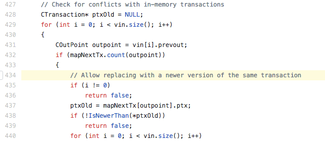
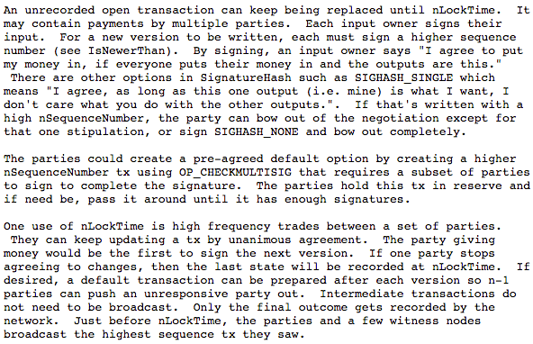
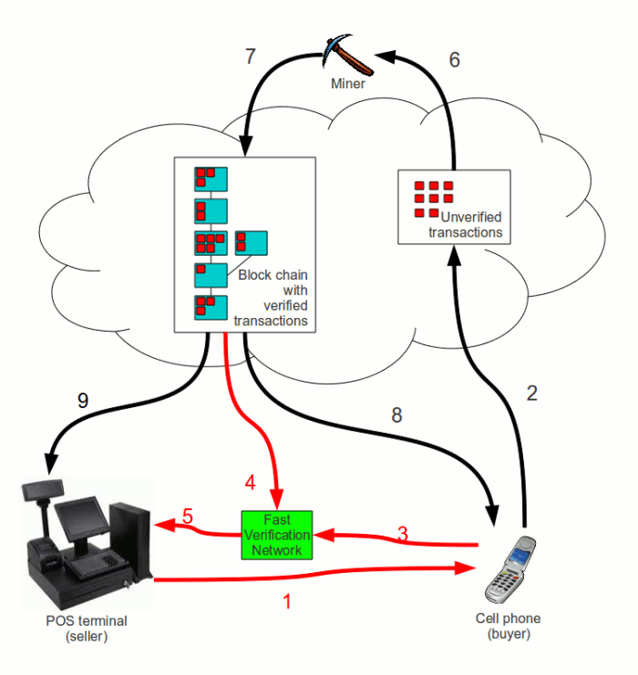
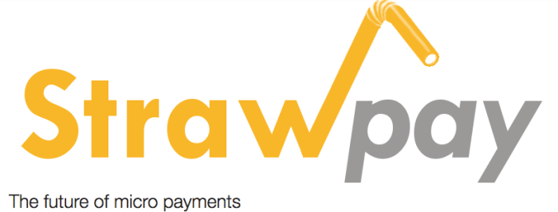
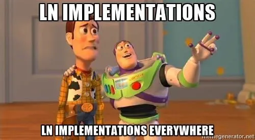
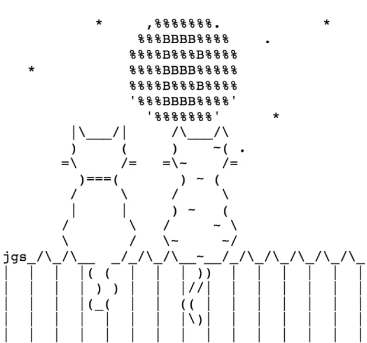

---

title: '闪电网络的历史：从头脑风暴，到测试版本'
author: 'Aaron Van Wirdum'
date: '2020/08/23 11:07:25'
title_image: '../images/history-lightning-brainstorm-beta/6bd872cabbf04326a17708a93fb0a6da.png'
excerpt: '闪电网络在观念上的起源'
categories:
- 闪电网络
tags:
- [闪电网络]
---

*作者：Aaron Van Wirdum*

*来源：<https://bitcoinmagazine.com/technical/history-lightning-brainstorm-beta>*

*译者：阿剑（hongji@ethfans.org）*

（编者注：原文发表于 2018 年 4 月。）

[几周以前](https://bitcoinmagazine.com/articles/lightnings-first-implementation-now-beta-developers-raise-25m)，第一个闪电网络实现 [lnd](https://github.com/LightningNetwork/lnd) 已经正式推出 beta 版。第二个实现 [eclair](https://github.com/ACINQ/eclair) [在上周发布](https://github.com/ACINQ/eclair)，第三个实现 [c-lightning](https://github.com/ElementsProject/lightning) 也快要来了。因此，这个在比特币上实现便宜和即时支付的覆盖层网络，已被大部分其开发者认为可以安全地用在比特币主网上了：这是这项技术在经年开发之后的一个重大里程碑。

这个故事，说起来可就长了。

##  第一串火花

闪电网络在观念上的起源最早可以追溯到比特币本身。

闪电网络用到的第一个概念叫做 “支付通道”。而支付通道本质上就是两个比特币用户之间的比特币余额；而且只需要他们彼此知道就好，其他人既不需要知道，也不需要关心他们相互之间的关系。重要的是，他们彼此的余额无需任何链上的比特币交易就能更新；而且 A 的余额增加，就意味着 B 的余额减少同样的数量。

在他们完成交易，心满意足之后，他们只需在网络中广播一笔交易就可以结算他们的支付通道：这一笔交易会基于他们的通道余额，给双方分发应得的数额。对于他们双方来说，这也意味着通道的更新（“链下交易”）相对更便宜，因为不需要付矿工手续费，而且也更快，因为不需要区块链的确认。

这个观念，整体上可以说跟中本聪在 2009 年放出的比特币软件一样早。Bitcoin 0.1 就包含了一个[代码草稿](https://github.com/trottier/original-bitcoin/blob/master/src/main.cpp#L434)，是允许用户在交易被网络确认之前更新这笔交易的：

- Bitcoin 0.1 包含的支付通道草稿。来源：GitHub -

虽然这份代码很粗糙，中本聪后来在跟 [bitcoinj](https://bitcoinj.github.io/) 开发者私聊时 Mike Hearn 讲了更多支付通道如何工作的细节。

几年以后（2013 年），Hearn 在[比特币开发邮件组](https://lists.linuxfoundation.org/mailman/listinfo/bitcoin-dev)中[公开了](https://lists.linuxfoundation.org/pipermail/bitcoin-dev/2013-April/002417.html)中本聪对支付通道的解释：

- 中本聪对支付通道原理的解释，曝光自 Mike Hearn。来源：Bitcoin-dev mailing list -

## 第一个支付通道

虽然支付通道作为一个概念，可以说与比特币同样久远，中本聪的设计是不够安全的。更重要的是，支付通道中的一个用户可以跟矿工合起伙来让区块链确认一个旧的交易，从而获得比自己该得的数量更多的比特币（比如刚给对方支付完，又把旧的交易上链）。

这个问题的第一个解决方案出现在 2011 年（在中本聪离开比特币项目之后）。[Bitcointalk 论坛](https://bitcointalk.org/)用户 “hashcoin” [构想了](https://bitcointalk.org/index.php?topic=25786.0)一种双层的支付通道 hashcoin，需要用户交换部分签名的多签名事务，以及与这些多签名事务相互依赖的时间锁事务。如果一个参与者消失了了，另一方可以在等待一段时间后拿走通道中的所有资金。不过，这一设计的缺陷在于，这种支付通道是单向的。Alice 可以给 Bob 支付任意次，但 Bob 没法用同一个通道给 Alice 支付。

另一个类似于 hashcoin 的想法在 2013 年早期浮出水面，而这一次它不再只是想想而已。在这一年的 4 月份，Jeremy Spilman 在比特币开发邮件组中[描述](https://lists.linuxfoundation.org/pipermail/bitcoin-dev/2013-April/002433.html)了一个支付通道的概念。他甚至写了一份[概念验证](https://gist.github.com/jspilman/5424310)代码。这个设计又由 Mike Hearn 调整过，后来成为 Bitcoin Core 软件贡献者、[Blockstream](https://blockstream.com/) 公司联合创始人和 [Chaincode Labs](https://chaincode.com/) 开发者的 Matt Corallo 在 [2013 中段](https://bitcointalk.org/index.php?topic=244656.0)把它从概念变成了 [bitcoinj](https://bitcoinj.github.io/) 上可以工作的代码。

又过了一年，Alex Akselrod（现在是 Lightning Labs 的工程师）首次[提出了](https://bitcointalk.org/index.php?topic=814770.msg9185225#msg9185225)双向的支付通道。Alice 可以给 Bob 支付任意多次，而 Bob 也可以使用递减的时间锁，在同一个通道中给 Alice 支付 —— 只不过次数是有限的。不过，不像单向的支付通道，这个解决方案从来没被代码实现过。

## 第一个支付网络概念

在第一个支付通道的概念出现的同一时间，其他人 —— 包括 Bitcoin Core 开发者 [Peter Todd](https://bitcointalk.org/index.php?topic=146307.0) 和 [Gavin Andresen](http://gavintech.blogspot.nl/2012/07/off-chain-transactions.html) —— 也在思考离链的支付网络。如果 Alice 可以通过链下的交易给 Bob 支付，而 Bob 可以通过一笔链下的交易给 Carol 支付，那么 Alice 也应该能通过 Bob 给 Carol 支付、无需让交易上链才对。

Corné Plooy（现在是一个闪电网络的开发者，在荷兰的比特币交易所 [BL3P](https://bl3p.eu/)）也一直在研究比特币的支付层，根源于他在 [2011 年](https://bitcointalk.org/index.php?topic=28565.0)提出的一个初步想法。

- Plooy 的支付层层的一个早期图示，后来成了闪电网络的前身 Amiko Pay。来源：Corné Plooy -

在 Bitcoin Core 的开发者和未来 Blockstream 公司的 CTO [Gregory Maxwell](https://bitcointalk.org/index.php?topic=28565.0)，以及 Ripple 创始人 [Ryan Fugger](https://bitcointalk.org/index.php?topic=28565.msg362638#msg362638)（和其他人）的建议之下，这个想法 [经过](https://bitcointalk.org/index.php?topic=94674.0) [了](https://bitcointalk.org/index.php?topic=94674.msg1460940#msg1460940) [多年](https://bitcointalk.org/index.php?topic=819901) 的发展，变成了比特币和原初的 Ripple 基础的集合体，并产生出了一个  Plooy 叫做 “[Amiko Pay](https://bitcoinmagazine.com/articles/lightning-network-implementation-amiko-pay-currently-in-development-1449073678)” 的[系统](http://www.ultimatestunts.nl/bitcoin/ripple_bitcoin_draft_1.pdf)。Amiko Pay 更早的草稿没有用到支付通道的，因此需要为这个系统注入信任：如果某个用户拒绝与另一个用户结算余额，后者没有任何办法。

一个使用了支付通道的早期支付网络[构想](https://bitcointalk.org/index.php?topic=91732.0)由数学家、后来成为 [Bitcoin emBassy TLV](https://www.bitembassy.org/) 合伙人的 Meni Rosenfeld 在 2012 年[提出](https://bitcointalk.org/index.php?topic=91732.0)。在 Bitcointalk 论坛上，Rosenfeld 描述了一个（按照上面的例子） 由支付处理商替代 Bob ，服务于 Alice 和 Carol 的例子。这个支付处理商，反过来，也跟其他的支付处理商开设了支付通道，所以整个支付通道网络是一个车轮模型。

这种解决方案在过去几年中出现了很多次。例如，Bitcoin Core 的贡献者 Peter Todd 就曾在 2014 年在比特币开发者邮件组中[提出](https://lists.linuxfoundation.org/pipermail/bitcoin-dev/2014-December/006988.html)过这种概念。与此同时，支付处理商 [BitPay](https://bitpay.com/) 也在 2015 年初公开了一份有关类似的通道内支付方案（“Impulse”）的[白皮书](http://impulse.is/impulse.pdf)。而一个[相似的解决方案](https://www.strawpay.com/docs/stroem-payment-system.pdf)也由瑞典的创业公司 [Strawpay](https://web.archive.org/web/20140908213132/http://www.strawpay.com:80/) 实现了出来，叫做 [Stroem](https://github.com/strawpay/stroem-consumerj)（或者 Ström），就在几乎同一时间 —— 但这些进展都没有造成很大影响。

- 现已倒闭的 Strawpay 小额支付公司的 Logo。来源：The Internet Archive  -

一个更早的、建立免信任的支付通道网络的尝试，来自 Alex Akselrod。他在 2013 年提出了一个[草案](https://en.bitcoin.it/wiki/User:Aakselrod/Draft)，在 2014 年这份草案转化为一份[概念验证代码](https://github.com/aakselrod/libtxchain-java)。Akselrod 的解决方案花了很大力气，在理论上解决了这个问题。但在实践中，问题依旧。比如说，如果一笔支付在路由过程中失败了，用户没有任何追索权，只有等支付通道的时间锁解除后资金释放，而这可能要经历几个月的时间。

与此同时，到了 2015 年，Plooy 的 Amiko Pay 已经[进化到](https://github.com/cornwarecjp/amiko-pay/blob/master/doc/pay20with20blockchain20knowledge.md)了可以免信任工作的地步。不过，他的设计需要对比特币协议进行相对深远的更改，以至于需要回滚特定类型的交易。虽然在技术上是可以做到的，但这样对比特币的更改会不会被接受，并不那么显然。

这一年的年底，来自苏黎世联邦理工学院（[ETH Zurich](https://ethz.ch/en.html)）的研究员、Christian Decker 博士（现已入职 Blockstream）和 Roger  Wattenhofer 在他们的白皮书“[A Fast and Scalable Payment Network with Bitcoin Duplex Microayment Channels](https://tik-old.ee.ethz.ch/file//716b955c130e6c703fac336ea17b1670/duplex-micropayment-channels.pdf)” 中提出了另一种覆盖层网络设计。他们的解决方案重度依赖于时间锁来作为通道有效性的“倒计时装置”，以及一种叫做 “无效树” 的密码学技巧来作废陈旧的通道交易。

Akselrod 的解决方案、Amiko Pay 后来的草案，还有 Duplex 小额支付通道（DMC）都在某些方面类似于闪电网络，也都可以在不同的假设（取舍）下正常工作。如果闪电网络没有发明，这里的任何一个方案都有可能成为比特币扩展层的基础。

但是，历史没有如果，闪电网络横空出世。

## 闪电网络

支付通道和网络设计演化了多年之后，终于在 2015 年初集齐了所有的拼图。

智能合约交易平台 [Mirror](https://web.archive.org/web/20150516030333/https://mirror.co/) 的 CTO Thaddeus “Tadge” Dryja 和 Joseph Poon 一起撰写了一份名为 “[The Bitcoin Lightning Network: Scalable Off-Chain Instant Payments](https://lightning.network/lightning-network-paper.pdf)” 的白皮书，在 2015 年的 2 月首次出版。

事实证明，它扭转了乾坤。

闪电网络白皮书提出了多种解决方案，来实现一个完全免信任的支付通道网络：任何人，只要想欺诈，就要冒着失去自己在通道中所有余额的风险；而且传递支付交易的中介也别想偷走一分钱。此外，这个解决方案只需对比特币协议做相对较少的变更，并且承诺比已经有的其它方案更灵活、对用户更友好。

这个白皮书所描述的关键创新是 “Poon-Dryja 通道”。跟早期的其它支付通道设计一样，Poon-Dryja 通道也依赖于参与者交换部分签名且未广播至全网的交易。但与前辈们不同的是，这种新的通道还需要额外的一步：双方需要不断交换秘密数值；这一设计使得通道可以在任意 “方向” 上更新。Alixe 可以给 Bob 支付任意次，而 Bob 也可以在同一个通道中给 Alice 支付任意次。

此外，闪电网络还利用了 [哈希时间锁合约](https://en.bitcoin.it/wiki/Hashed_Timelock_Contracts)（HTLC）。这个概念一般认为是 Tier Nolan [提出](https://bitcointalk.org/index.php?topic=193281.msg2224949#msg2224949)的，设计初衷是用于跨区块链交易；举个例子，用于免信任地互换比特币和莱特币。在闪电网络中，这种工具用于把多个支付通道串联起来。

Poon 和 Dryja 在 2015 年 2 月的旧金山比特币开发者研讨会（Bitcoin Devs Seminar）上首次展示了他们的构想。

在这之后的几个月，整个 2015 年的春天和夏天，比特币的扩展问题和区块大小上限的分歧演变成了公开的争执。在这种危机气氛中，人们在 2015 年底召开了连续两场大会：9 月份召开了 [Scaling Bitcoin Montreal](https://montreal2015.scalingbitcoin.org/)，10 月份是 [Scaling Bitcoin Hong Kong](https://hongkong2015.scalingbitcoin.org/)。在蒙特利尔，Poon 和 Dryja [再次登台演讲](https://www.youtube.com/watch?v=TgjrS-BPWDQ&feature=youtu.be&t=41m59s)，并且 [Poon](https://www.youtube.com/watch?v=zchzn7aPQjI&feature=youtu.be&t=54m28s) 和 [Dryja](https://www.youtube.com/watch?v=zchzn7aPQjI&feature=youtu.be&t=30m42s) 都在香港作了第二次更深入的演讲。

就在香港的大会之后，Gregory Maxwell 在比特币开发者邮件组中提出了一份[扩展方案路线图](https://lists.linuxfoundation.org/pipermail/bitcoin-dev/2015-December/011865.html)。这张路线图突出地包括了闪电网络。它获得了比特币技术社区大部分人的[支持](https://bitcoincore.org/en/2015/12/21/capacity-increase/)，并且变成了 Bitcoin Core 项目在事实上的路线图。

如果人们原本对闪电网络的期待还不够高，这下就完全够了。

https://bitcoinmagazine.com/technical/history-lightning-brainstorm-beta

## 实现

闪电网络的白皮书是一份长而复杂的文件，包含许多技术含量很高的概念；在 2015 年，很少有人有时间和能力读完并且理解这份文件。但 Linux 系统内核长期开发者 Rusty Russell 学习了这份白皮书后，大家的基础认识提高了一大截。在 2015 年初的 [系](https://rusty.ozlabs.org/?p=450) [列](https://rusty.ozlabs.org/?p=462) [博](https://rusty.ozlabs.org/?p=467) [客](https://rusty.ozlabs.org/?p=477) 中，Russell 为更广泛的读者 “翻译” 了这份白皮书（但还是比较挑人的）。

然后，在2015 年 3 月，Russell 接受 Blockstream 工程的聘请，[开发](https://bitcoinmagazine.com/articles/blockstream-starts-development-lightning-network-1432931728)一个 C 语言的闪电网络实现：[ c-lightning](https://github.com/ElementsProject/lightning)。事实证明，这是迈向实现的关键一步。一个几个月前才刚刚提出的概念，现在就有了一个世界顶尖的工程师来[实现](https://blockstream.com/2015/09/01/lightning-network/)它。后来，Blockstream 的 Christian Decker 也加入了 Russell；其他人（包括 Corné Plooy） 也为这个开源项目做了贡献。

在 Russell 开始开发 c-lightning 不久之后，Blocksteam 就不是唯一一个入局实现闪电网络的公司了。在 2015 年夏天，[ACINQ](https://acinq.co/) 这家更小的比特币科技公司（一开始计划开发基于智能卡的硬件钱包）决定也尝试一下这项富有前景的技术。这家位于巴黎的创业公司后来宣布他们开发者用 Scala 编程语言[开发出了](https://medium.com/@ACINQ/eclair-0-2-alpha1-is-out-3caaff242567)自己的闪电网络协议，叫做 eclair。

- 来自 ACINQ 的 eclair 发行公告。来源：medium.com -

又过了几个月，第三个实现开始起步。在 2016 年 1 月，闪电网络白皮书的作者 Poon 和 Dryja，也跟 Elizabeth Stark 和 Olaoluwa “Laolu” Osuntokun 一道，成立了一个全新的公司来开发闪电网络：[Lightning Labs](https://lightning.engineering/)。Lightning Labs 带头在 [lnd](https://github.com/LightningNetwork/lnd) 上开闸，这是一个用谷歌公司推出的 Go 编程语言（也叫 “golang”）实现的闪电网络 —— 他们在公司成立之前就开始开发了。

在成立公司大概一年后，在 2016 年底，Dryja 离开了 Lightning Labs，转而[加入了](https://medium.com/mit-media-lab-digital-currency-initiative/tadge-dryja-joins-the-dci-a49075cce69f) [ MIT Media Lab 的 Digital Currency Initiative](https://dci.mit.edu/)，这个机构也雇用了Bitcoin Core 的顶尖开发者 Wladimir van der Laan 和多位 Bitcoin Core 的贡献者。在 MIT，Dryja 继续开发他在 Lightning Labs 起步的闪电网络实现，重命名为 [lit](https://github.com/mit-dci/lit)。现在 lnd 和 lit 都可用。Lit 与 lnd 和其它实现有差异的点在于它把钱包和节点封装成了一个整体；现在，它还支持同时使用多种币。

此外，区块链公司 [Bitfury](https://bitfury.com/)（因其矿池服务和挖矿硬件而知名）也 fork 了 lnd 实现、做了另一个版本。这个版本的特殊之处在于，它在设计上做了牺牲，使得[无需](https://bitcoinmagazine.com/articles/segwit-or-not-bitfury-ready-lightning-successful-bitcoin-main-net-test)修复比特币网络的熔融性（malleability）—— 后面我们再详细说明。Bitfury 也在交易路由领域作了贡献，最著名的成果是 “[Flare](https://bitfury.com/content/5-white-papers-research/whitepaper_flare_an_approach_to_routing_in_lightning_network_7_7_2016.pdf)” 协议（只不过现在 Bitfury 版本的 lnd 开发似乎已经停滞下来了）（译者注：“熔融性” 的例子是，本质上是同一个签名的交易，可能会产生完全不同的哈希值（交易 ID），使交易变得无法跟踪；就像同一块金属可以熔成不同的形状一样）。

再后来，再 2016 年，主要的钱包服务商 Blockchain 宣布他们[开发出了](https://www.blockchain.com/thunder/index.html)一个简化版的闪电网络，叫做 “[thunder](https://github.com/blockchain/thunder)”。这个实现对标准的闪电网络实现做了比较大的牺牲，最明显的是它需要你信任网络中的对手方。也因为这种牺牲，它得以在 2016 年春天推出 alpha 版本，比其他开发团队要早得多。（虽然 thunder [也可能兼容](https://coinjournal.net/blockchain-info-major-impact-adoption-bitcoins-lightning-network/)闪电网络，但这一实现的开发似乎也已经停滞了。）

在 Scaling Bitcoin Milan 大会之后，第三次会议在 2016 年底举办，大部分闪电网络的贡献者都[齐聚一堂](https://bitcoinmagazine.com/articles/after-scaling-bitcoin-a-lightning-winter-release-is-now-within-reach-1476814566)（这场大会因此被称为第一次闪电网络峰会）。在这里，他们讨论了如何让所有的不同实现能相互操作，从而产生了一个叫做 “[BOLT](https://github.com/lightningnetwork/lightning-rfc/blob/master/00-introduction.md)”的闪电网络协议规范（BOLT 是“闪电网络技术技术（Basis of Lightning Technology）” 的缩写）。闪电网络白皮书是理论上的第一，BOLT 才是我们今天所知的、实际上的闪电网络的基础。

## 协议变更

在闪电网络白皮书首次面世时，它的想法跟当时的比特币协议是不兼容的 —— 至少，是不安全的。要像白皮书里写的那样使用闪电网络，比特币需要多方面的协议变更。

第一个变更是新类型的时间锁，它可以让支付网络抵抗比特币的[熔融性](https://bitcoinmagazine.com/articles/the-who-what-why-and-how-of-the-ongoing-transaction-malleability-attack-1444253640)漏洞。不过，这个问题在闪电网络白皮书出版之前就已经在解决中了，并且在 2015 年得到了最终的解决：Peter Todd 所提议和设计的一种新型时间锁（[CheckLockTimeVerify](https://bitcoinmagazine.com/articles/checklocktimeverify-or-how-a-time-lock-patch-will-boost-bitcoin-s-potential-1446658530)，CLTV）在比特币协议中[实现](https://github.com/bitcoin/bips/blob/master/bip-0065.mediawiki)了。

然后，Bitcoin Core 开发者意识到，如果有相对时间锁，闪电网络可以运行得更好。因为相对时间锁可以让用户指定某些比特币在某笔交易上链后再锁定一段时间。概念上，在闪电网络中，用户可以让支付通道永远敞开；但 CLTV 时间锁让他们不得不定期关闭通道。一个软分叉升级实现了相对时间锁，叫做 “[CheckSequenceVerify](https://github.com/bitcoin/bips/blob/master/bip-0112.mediawiki)”（CSV）。这种脚本是由 Bitcoin Core 的贡献者  BtcDrak、Eric Lombrozo 和 Mark Friedenbach 设计的，并且在 2016 年夏天的比特币网络上激活了。

但闪电网络（至少，如果想要用一个平顺的用户体验的话）所要求的最大的协议变更是为所有的比特币交易修复熔融性漏洞。

在闪电网络白皮书出版之时，熔融性已经被认为是个很大的问题。虽然那时候已经有一个[软分叉](https://github.com/bitcoin/bips/blob/master/bip-0062.mediawiki)草案已经在讨论中了，但开发者并不确定这有用，而且认为可能需要一次硬分叉才行。然后，在 2015 年末，Bitcoin Core 贡献者们发现，Blockstream 公司 [Elements Project](https://blockstream.com/technology/#elements) 解决熔融性的办法 “[隔离](https://bitcoinmagazine.com/articles/segregated-witness-part-how-a-clever-hack-could-significantly-increase-bitcoin-s-potential-1450553618) [见证](https://bitcoinmagazine.com/articles/segregated-witness-part-why-you-should-care-about-a-nitty-gritty-technical-trick-1450827675)”（SegWit）可以作为向后兼容的软分叉部署在比特币上。

漫长的挣扎过后，隔离见证软分叉最终于 2017 年夏天在比特币区块链上[激活](https://bitcoinmagazine.com/articles/segregated-witness-activates-bitcoin-what-expect)，为闪电网络登陆比特币铺平了道路。

*（要了解隔离见证的历史，见“[The Long Road to SegWit: How Bitcoin’s Biggest Protocol Upgrade Became Reality](https://bitcoinmagazine.com/articles/long-road-segwit-how-bitcoins-biggest-protocol-upgrade-became-reality)”）*

## Alpha 版本

即使在隔离见证还未部署在比特币协议上（也尚不清楚到底会不会部署）的时候，闪电网络的开发也进展很大。

这是从测试网上开始的。测试网是比特币网络的副本，专门用于测试。闪电网络最开始在一个特殊版本的测试网上个起步：代号为“SegNet 4” 的测试网（它是第四个 SegWit 的测试网），[启动](https://bitcoinmagazine.com/articles/segregated-witness-enters-final-testnet-stage-includes-lightning-network-support-1459357231)于 2016 年 5 月。

SegNet 4 测试网部署不到半年，在 2016 年 10 月，Blockstream 开发团队就已经把他们的 c-lightning 原型提高到可用的程度。后来这被称为 “[闪电网络第一击](http://blockstream.com/2016/10/05/blockstream-lightning-first-strike)”：Decker 通过闪电网络的一个早期版本，从 Russell 手上 “买” 了一只猫，用的是测试网的比特币（没有价值的）。

- Christian Decker 从 Rusty Russell 处 “买” 的一张猫图片。 来源：Blockstream.com-

到 2017 年 1 月，第一个闪电网络实现 —— lnd —— [推出](https://bitcoinmagazine.com/articles/lightning-network-one-step-closer-to-reality-as-lightning-labs-announces-alpha-release-1484333955) [Alpha](http://lightning.community/release/software/lnd/lightning/2017/01/10/lightning-network-daemon-alpha-release/) 版本。有了这个实现，闪电网络就 “正式” 地迈入了 “Alpha 阶段”：全世界的开发者，第一次收到邀请，去实验这种新技术。而 Lightning Labs 还在继续测试和提升代码。

这个 Alpha 版本，反过来，吸引越来越多的开发者到 lng 和其他闪电网络实现上开发[应用](http://lightning.community/software/lnd/lightning/2017/07/05/emerging-lightning-developer-ecosystem/)。这些 “[Lapps](http://dev.lightning.community/lapps/index.html)”从[桌面端钱包](https://bitcoinmagazine.com/articles/what-lightning-will-look-lightning-labs-has-announced-its-user-interface-wallet)到[移动端钱包](https://zap.jackmallers.com/)，再到[小额支付的博客平台](https://yalls.org/)，[博彩网站](http://thunderdice.ws/)，到[浏览器](https://medium.com/@ACINQ/releasing-our-lightning-network-explorer-93e87de150bb)，无所不包 —— 虽然大部分仍然是为比特币的测试网设计的。

到了 2017 年夏天，隔离见证终于激活，而闪电网络在比特币上的地基已经夯实。又过了三个月，Blockstream [宣布](https://bitcoinmagazine.com/articles/blockstream-completes-its-first-lightning-transaction-on-bitcoin-testnet-1475850017)在比特币主网上发出了第一笔闪电网络交易。11 月，Lightning Labs 做了第一笔[跨区块链](https://blog.lightning.engineering/announcement/2017/11/16/ln-swap.html)（从比特币到莱特币）的闪电网络交易。12 月，来自 Blockstream、Lightning Labs 和 ACINQ 的开发团队[宣布](https://medium.com/@lightning_network/lightning-protocol-1-0-compatibility-achieved-f9d22b7b19c4)他们已经通过了[互操作性测试](https://bitcoinmagazine.com/articles/developers-release-lightning-protocol-10-perform-successful-interoperability-tests)。

而且，到了这一年的末尾，有些人开始在比特币主网上使用 alpha 的闪电网络实现了 —— 有时候甚至是违反开发者的建议的。越来越多的闪电通道打开。到了 12 月，开发者 Alex Bosworth 用闪电网络通道向支付处理商 [Bitrefill](https://www.bitrefill.com/) 支付了自己的[手机账单](https://www.coindesk.com/payment-provider-bitrefill-runs-successful-lightning-transaction-test)：这是闪电网络上最早一批把比特币当钱来用的交易之一。

又过了一个月，Blockstream [开设](http://blockstream.com/2018/01/16/lightning-charge)了一个[网上商店](https://store.blockstream.com/)，让人可以用比特币来购买实体商品 —— 虽然 c-lightning 实现还只是 beta 版本，网站上有清晰的风险提醒。2018 年 2 月，在闪电网络仍处在 alpha 阶段时，比特币世界的传奇人物、以“[比特币买披萨](https://bitcointalk.org/index.php?topic=137.0)” 趣事闻名世界的 [Lazlo Hanyecz](https://en.bitcoin.it/wiki/Laszlo_Hanyecz) [宣布](https://lists.linuxfoundation.org/pipermail/lightning-dev/2018-February/001044.html)自己使用闪电网络买了 —— 当然，又是 —— 披萨！

- Lazlo Hanyecz 享用披萨。来源： -

## Beta 版

经过多年的开发和（甚至更长时间的）思索之后，闪电网络在几周前到达了可能是最大的一个里程碑。

2018 年 3 月中旬，Lightning Labs 的 lnd 率先发布了 [beta 版的闪电网络实现](https://bitcoinmagazine.com/articles/lightnings-first-implementation-now-beta-developers-raise-25m)。[他们同时还宣布](https://blog.lightning.engineering/announcement/2018/03/15/lnd-beta.html)获得了 250 万美元的种子轮融资，投资人包括大名鼎鼎的 Twitter CEO ack Dorsey。Lightning Labs 认为，他们已经准备好在比特币的主网上使用闪电网络 —— 虽然最主要还是提供给懂技术的人用的。

紧随这份公告之后，ACINQ 在 3 月 28 日发布了[一条推文](https://twitter.com/acinq_co/status/979081006903947264)，宣布 eclair 已经推出 vet 版本，因此也已经准备好在主网上使用了。这家创业公司还宣布，他们的 Android 闪电钱包几周后就将与大家见面。（算起来恰好是本文出版的这周。）

Blockstream 的 c-lightning 实现尚未发布 beta 版，虽然他们的开发团队告诉 Bitcoin Megazine，他们也会紧随其后。这家区块链开发公司还在 3 月份的最后一周一口气[发布了 7 款新的 Lapp](http://blockstream.com/2018/03/29/blockstreams-week-of-lapps-ends)（在此之前他们也一直在推出新品），彰显了这家公司在闪电网络前端的积累。

虽然在 alpha 时代，人们就已经在使用闪电网络软件了，beta 版本进一步刺激了[增长趋势](https://1ml.com/statistics)。在本文发表之时，已经有超过 1000 个闪电网络节点和 5000 个闪电网络通道，留存有超过 10 btc（在本文撰写之时总价值约 7 万美元）。（编者注：截至 2021 年 8 月 8 日，全世界已经有 12044 个闪电网络节点和 58717 个通道，留存超过 1500 btc，价值 6000 万美元。）每天都有数百个新节点加入，甚至莱特币专用的闪电网络也发展了，未来还可以与比特币的闪电网络[交互](https://bitcoinmagazine.com/articles/atomic-swaps-how-the-lightning-network-extends-to-altcoins-1484157052)。

- 在本文撰写之时，闪电网络的图示。来源：http://lnmainnet.gaben.win/ -

即使我们已经有了这些进展，闪电网络也还是处在非常出街的阶段。大部分用户都非常了解技术（通常就是开发者），使用场景也都是实验性的。虽然 beta 版软件发布是一个很大的里程碑，网络的开发和提升仍要继续，还有许多事情等我们去做，[路由](https://bitcoinmagazine.com/articles/exploring-the-centralization-risks-of-bitcoin-s-lightning-network-1462460852)、[隐私](https://www.coindesk.com/will-lightning-help-hurt-bitcoin-privacy) 和[其他风险](https://thenextweb.com/hardfork/2018/02/27/bitcoin-lightning-network-todd-flawed/)领域，还有许多开放问题。

通常来说，只有进一步普及，才能告诉我们这些问题的答案。

*作者注：在为本文做研究时，我开始意识到，闪电网络的（史前）历史比我已知的要丰富得多。把它们都塞到一篇文章里，需要我略去许多细节，这对所有帮助实现这项技术的人、项目和概念都不公平。本文尝试概括闪电网络迄今的故事，但最好只把本文当成一个粗糙的总结 —— 而不是一份详尽的历史和技术讲解。感谢每一位提供信息和其它反馈的朋友。*

（完）
