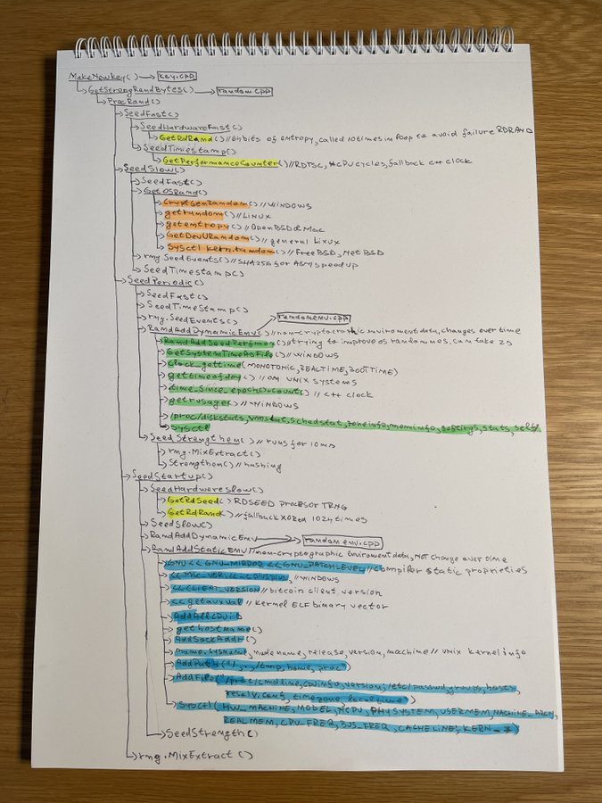
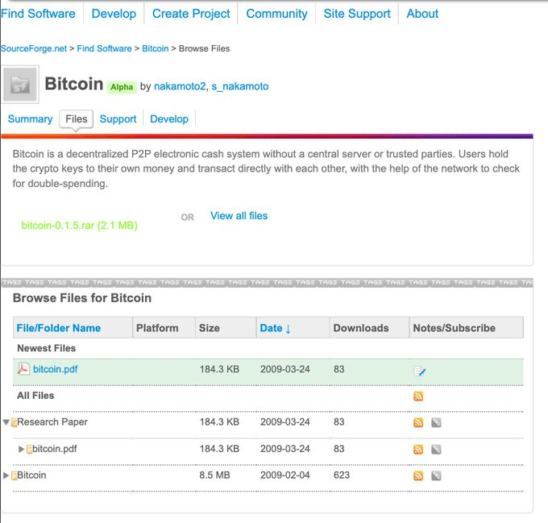
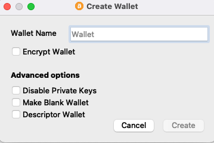
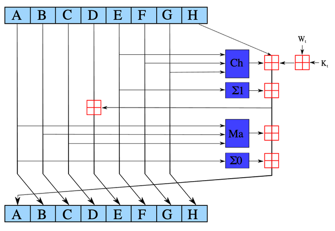
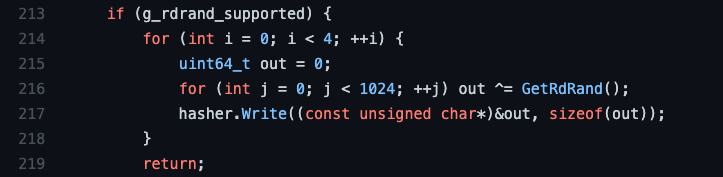

> *作者：Alex Waltz*
> 
> *来源：<https://twitter.com/raw_avocado/status/1445024873382809604>*

一言以蔽之，混合来自以下 4 个主要来源的熵（随机性）：

- 低级处理器指令
- 来自操作系统的熵
- 动态事件
- 静态事件

Bitcoin Core 是比特币协议的参考实现，由中本聪发布的代码直接演化而来，拥有全世界最聪明的贡献者。Bitcoin Core 也是最常用、经过最多评审的比特币软件。

尽管 Bitcoin Core 主要被用作节点与网络进行通信，但它内置了钱包功能。

我们来了解一下至关重要的密钥生成机制背后的原理。

熵的 4 个来源分别是什么？

**1）处理器指令**

RDSEED —— 访问处理器上内置的真随机数生成器（True Random Number Generator）。

RDRAND —— 访问内置的伪随机数生成器（Pseudo-Random Number generator）。每当用户通过 RDSEED 调用该生成器时，都会生成新的种子。

RDTSC —— 返回重启系统以来的 CPU 周期数。

**2）操作系统**

大多数 Linux 发行版都通过特定函数调用 /dev/urandom，例如 getrandom。没有这类函数的 Linux 发行版则直接调用 /dev/urandom。

在 Open BSD 和 Mac 系统 上则调用 getentropy 。

在 Free BSD 和 Net BSD 系统上则调用 sysctl kern.random 。

在 Windows 系统上则 CryptGenRandom 。

**3）动态事件**

按照实际时间、单调时间和启动时间调用各种时钟。

资源使用情况会不断变化，是熵的重要来源。

在 Windows 系统中，调用的是 getrusage。在 Linux 系统中，使用的是来自 /proc 的伪文件或 sysctl（在适用情况下）。

**4）静态事件**

从编译器版本到比特币客户端版本再到 CPU ID、主机名、网络接口、内核信息、文件系统数据等任意静态信息。

虽然静态事件和动态事件是非密码学数据，但它们依然会增加熵。

动态和静态事件主要通过 “<<”（左移位）混合在一起。由于这是一个二进制运算，每个数字都是 2 的幂，将位移动 n 个位置就等于乘以 2^n。

一次使用多个数字时，混淆程度更高。

- - -

混合熵最常用的方法是 SHA512（准确来说是其压缩函数）。SHA512 可以像伪 RNG 那样有效运作，因为它具有一致性，即，每个输出发生的概率都相同。有些情况下会使用 SHA256。

好的哈希函数具有很强的雪崩效应。这意味着，即使只增加一个输入位，每个输出位变化的概率也高达 50%。对输入的碎片使用加法、旋转和 XOR（异或）运算都可以产生 “位扩散（bit diffusion）” 的效果。

在该混合环节中，处理器的伪 RNG RDRAND 指令的结果会经过 1024 次异或运算。（这被用作 RDSEED（真随机数发生器 TRNG） 的后备方案。）

每次调用会以不同的方式为伪随机数生成器生成种子，异或运算则是绝佳的混淆方法。

另一种增强熵的技术是循环对输入进行一段时间（而非几次）的哈希计算。

这些混合技术经过了基准测试，基准点同样作为熵的来源参与混合。

每增加一个熵来源和一次混合，攻击者再造熵的概率就会成倍降低。

即使有少数熵来源遭到攻击，最终生成的密钥仍是安全的。

整个过程虽然看似过于复杂和冗余，却有着坚实的理论基础。

但是，让你的私钥保持私密的另外 50% 的随机成分，就要靠你自己啦！

（完）