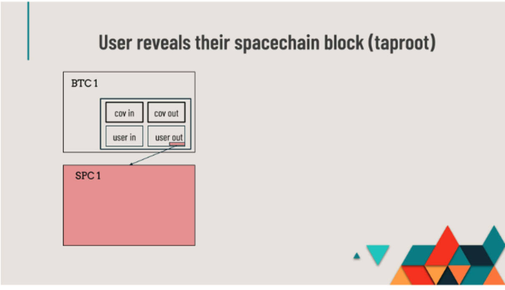
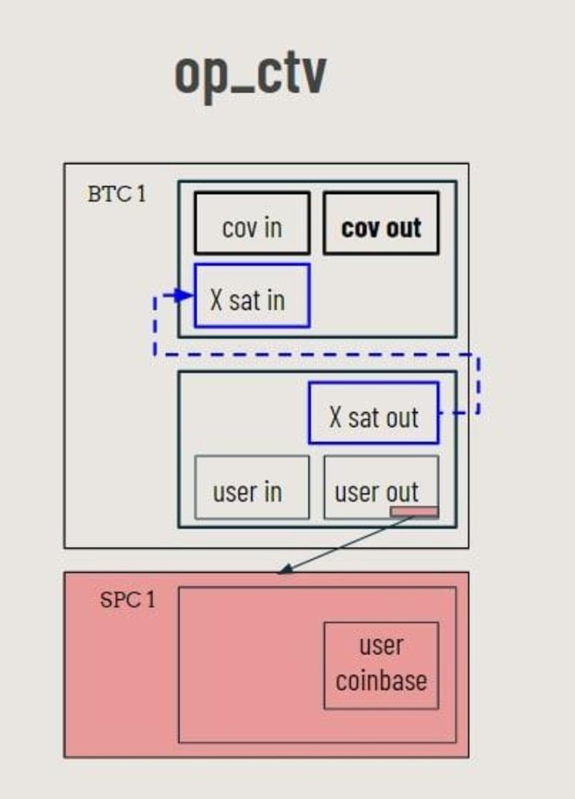
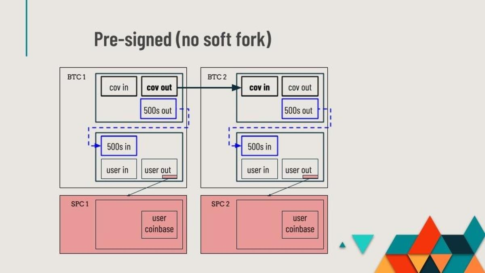

> *作者：Shinobi*
> 
> *来源：<https://bitcoinmagazine.com/technical/how-bitcoin-spacechains-work>*

将侧链作为比特币的扩容机制和功能插件机制的想法，可谓由来已久。侧链的 “祖先” 之一，[合并挖矿链](https://bitcointalk.org/index.php?topic=1790.msg28696#msg28696)，甚至可以追溯到中本聪消失以前。

那时候的合并挖矿的想法很简单，两个完全独立而且不相关的链由同一群矿工来挖矿，而且不能在两条链间迁移。[最初的侧链提议](https://www.blockstream.com/sidechains.pdf)则是在 2014 年提出的，这些作者在论文出版一周后就成立了 Blockstream。基本的想法是要能在比特币主链和其它侧链之间来回移动资金，并在跨链转移资金时使用简易支付验证（SPV）证据来证明你的操作是合法的。这个提议从未结出果实，因为它的实现在处理链重组、盗窃风险和挖矿中心化风险上过于复杂（所有这些都可以在[比特币白皮书](https://bitcoin.org/bitcoin.pdf)的第四章中找到）。

侧链的锚定机制可以分成两种，单向的和双向的。意思也很直白：在双向锚定设计中，资金可以在主链和侧链之间来回迁移；而在单向锚定中，你只能将资金从主链迁到侧链，无法再回来。当前，唯一一种搭建在比特币上的双向锚定侧链是通过联盟共识机制来实现的，也就是锚定机制是由一群受信任的 “托管商” 来实现的，他们用一个多签名钱包控制着迁移到侧链的资金，资金退出侧链便从多签名钱包中转出。

但是，人们也一直在开发非联盟形式的侧链锚定设计。这里我准备介绍一下 Ruben Somsen 的 Spacechain 协议。这是一种利用 “盲化合并挖矿”（blind merge mine，类似于 [Paul Stztorc](https://www.truthcoin.info/blog/blind-merged-mining/) 提出的）设计的单向锚定机制。单向锚定意味着，资金只能从主链转入侧链，不能再回来，而矿工也不需要运行新的软件来挖掘侧链（不过，我下面会解释，他们可以从运行侧链软件中获得很多好处）。

## Spacechain 提议

合并挖矿需要矿工运行比特币节点和他们想挖的侧链的节点，这样才能收集比特币链和侧链的区块，并将侧链区块承诺到自己正在挖的比特币区块头中。盲化合并挖矿则利用了一个事实：矿工只需要将侧链区块的区块头承诺到比特币区块，可以由其他人来负责组装侧链的区块。

Somsen 提出，可以使用 [AnyPrevOut](https://bitcoinops.org/en/topics/sighash_anyprevout/)（APO）来实现区块组装者的开放竞争：任何人都能构建下一个侧链区块，但每个比特币主链区块都只能承诺一个侧链区块。Ruben 的提议的另一个好处是，它不需要特殊的软分叉来开启部署侧链的可行性。Eltoo/AnyPrevOut 是为闪电网络提议的，可以支持更灵活的侧链，以及通道工厂。Spacechain 只是 AnyPrevOut 可以帮助铺平道路的许多事物中的一个。

盲化合并挖矿的总体思路是：利用 APO，你就可以预定义一长串的交易，每个交易都以同一个初始化 UTXO 为输入，并总是创建出同一个 UTXO 作为输出。所以，设想有一个面额为 1 聪的 UTXO，而且每一笔预创建的交易都保证了该交易被确认时会重新创建同一个 UTXO。你可以把它想象成一种记号，这个特殊的 UTXO 就是标识符，让每个监控比特币主链的人都知道：“这个 UTXO 就是我找寻侧链 X 的区块的承诺的地方”。但这种设计留下了一个问题：矿工费。要是这个 UTXO 必须以相同的面额被重新创建，那就没有资金可以支付手续费了。

这个问题可以通过使用 [SIGHASH_SINGLE](https://btcinformation.org/en/glossary/sighash-single)（这种模式的签名将只签名一个输入和对应的输出）以及 [SIGHASH_ANYONECANPAY](https://btcinformation.org/en/glossary/sighash-anyonecanpay)（人们可以自由为一笔交易添加输入和输出，只要原本使用 SIGHASH_SINGLE 签名的输入和输出保持原样和原有的对应关系）来解决。这样一来任何人都可以添加一个输入和找零输出来为交易支付矿工费。

同样的机制也用来承诺侧链区块的区块头。就像 Taproot 使用默克尔树根值来调整公钥、用默克尔树来承诺许多花费条件一样，任何人都可以用侧链区块的区块头哈希值来调整普通的公钥。侧链节点因此可以使用指向某笔交易的指针来揭晓和转发区块头，并证明这个区块头确实被挖出来了。然后，侧链节点会执行一切常规的验证工作，从而保证这个侧链区块遵循了合适的共识规则，然后在侧链网络中转发实际的侧链区块，就像主链网络一样。

如果某一笔旨在承诺侧链区块的主链交易承诺了一个无效的侧链区块，或是承诺了完全无意义的垃圾数据，侧链节点发现这笔交易已经在主链上挖出后，可能会出现两种情况：一，这个无效区块会在侧链网络里传播，节点发现它无法通过验证之后，将它标记为孤块；二，这个承诺对应的数据一直没有公开，则下一个侧链区块会建立在最后一个揭晓的区块之上，未揭晓的承诺会被忽略。第二种情形还遵循跟主链相同的最长链逻辑，所以即使后来再揭晓承诺，它也会被当成孤块，因为未来的区块并未建立在这个区块上。

但现在还没解决重复花费的问题。任何一个曾经创建过记号 UTXO 的私钥都可以重复花费任何一笔用来承诺侧链区块的预定义交易，从而作废掉此后的整一串交易。

这个问题是通过在 UTXO 自身的锁定脚本中插入签名来解决的。签名锁定在了输入和输出中，保证了下一笔交易会使用这个签名（同时再创建出在锁定脚本中带有签名的记号 UTXO）。因为在花费这个 UTXO 时，签名会被自动检查和通过，所以不可能直接替换成另一个签名和支付到另一个目标。

现在只剩下最后一个问题了。理论上，你可以将连续的多笔交易包含在一个比特币区块这，这样矿工就可以在一个主链区块内确认大量的侧链区块。这可以被滥用成为对侧链网络的拒绝服务式攻击。

为了解决这个问题，记号 UTXO 内可以插入一个 CHECKSEQUENCEVERIFY（CSV）相对时间锁，来保证一个主链区块内只能有一笔交易用到了记号 UTXO。

最终，它的形式就如下图：

- <a href="https://docs.google.com/presentation/d/1QbLS6-OLhkNlZVrHme843NM0AyPWz-qU3OYLEsOzByA/mobilepresent?slide=id.p">图片来源</a> -

值得一提的是，这一设计的两个变种可以用 CHECKTEMPLATEVERIFY （CTV）来实现，也可以无需任何变更就实现。这两种变种各有不理想之处。

使用 CTV 的变种将使用 CTV 来形成交易链条，而不像 APO 那样需要把签名包含在 UTXO 锁定脚本内（这是一个大胆的技巧）。CTV 会承诺花费该 CTV UTXO 的交易的所有输出，但不承诺该 CTV UTXO 以外的输入。

这意味着你可以为 CTV 交易添加输入，但无法添加输出。所以你可以为交易添加手续费（就像 APO 设计一样），但你无法添加一个对侧链区块头的承诺。

所以，在此我们需要做的是：在承诺侧链的 CTV 交易链条之外创建一笔交易，使之刚好足以为 CTV 交易支付手续费（因为现在你没法创建找零输出了，你的输入的全部金额都会变成矿工手续费），而且，在这个为支付手续费而准备的 UTXO 内部，我们承诺一个侧链区块头。所以，第一步是：用一笔交易创建一个支付手续费的输出和一个对侧链区块头的承诺。第二步是：将手续费 TUXO 作为 CTV 交易的另一个输入，当这笔交易得到区块确认时，我们承诺的那个侧链区块就会被 “挖出”。整个设计如下图所示：

- <a href="https://docs.google.com/presentation/d/1QbLS6-OLhkNlZVrHme843NM0AyPWz-qU3OYLEsOzByA/mobilepresent?slide=id.p">图片来源</a> -

另一个变种则直接使用了预签名的交易。这种变种在今天就可以部署，但因为比特币脚本的局限性，它要求所有的交易手续费都由创建 spacechain 的人预先支付。

交易链条从一个 UTXO 开始，而且每一次交易都创建两个输出。第一个输出是记号 UTXO，表示这个交易链条跟某个 spacechain 有关，而第二个输出是一个小面额的 UTXO，任何人都可以花费它（但因为它面额很小，需要附加额外的输入和输出）。从链条的第二笔交易开始，任何人都可以从 spacechain 交易链条花费第二个输出，并用它来承诺自己的侧链区块头。

在 CTV 变种中，侧链区块必须在一个次级交易中承诺，因为 CTV 不允许为花费 CTV 的交易增加新的输出。而这第二种变种也要求使用一个次级交易，因为如果你要为预签名的交易链条增加新的输入或输出，交易的 TXID 就会改变，此后所有的预签名交易都会作废。所以这个变种看起来是这样的：

- <a href="https://docs.google.com/presentation/d/1QbLS6-OLhkNlZVrHme843NM0AyPWz-qU3OYLEsOzByA/mobilepresent?slide=id.p">图片来源</a> -

这种变种还有一个缺点，如果预签名了用来承诺侧链区块的交易的私钥没有被删除，那么私钥主人就可以随时重复花费那时候的记号 UTXO、让那个 spacechain 停机。

这就是 Spacechain 的工作原理了。Spacechain 是比特币侧链设计的最新提议，而且可以用三种不同的方式来实现。需要提醒的是，在当前就可以实现的设计中，它需要一些人把私钥删掉。

*本文是一个关于比特币从 2014 年以来的主要侧链设计提议的系列的第一篇。请保持关注。*

（完）

> [后篇中文译本](https://www.btcstudy.org/2022/07/06/spacechains-unlocks-bitcoin-use-cases/)

