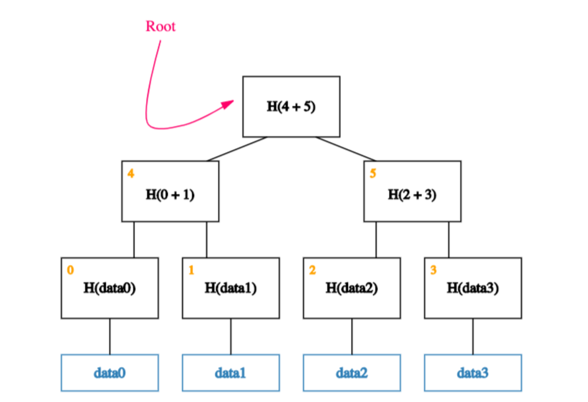

> *作者：Namcios*
> 
> *来源：<https://bitcoinmagazine.com/technical/how-bitcoin-taro-protocol-works>*

Lightning Labs 为比特币和闪电网络推出了一种的新的协议，叫做 “Taro”，希望能为网络带来更多应用场景。这家公司还公开了[一系列的比特币升级提议草案（BIP）](https://www.mail-archive.com/bitcoin-dev@lists.linuxfoundation.org/msg11209.html)，并正在征求社区对所提议的升级的反馈。

Taro 希望能允许在比特币上发行资产和收藏品（即非同质资产在该协议内的形式），并在闪电网络上以私密且安全的方式转移这些资产，而无需触及区块链。为了实现这些目标，Taro 利用了比特币最新的升级 “[Taproot](https://bitcoinmagazine.com/technical/short-bitcoin-taproot-explainer)”。

“闪电网络的 Taro 协议设计借鉴自互联网：前沿的东西总是复杂的，但沟通这些前沿事物的东西是简单的”，Lightning Labs 的 CEO  Elizabeth Stark 这么跟 Bitcoin Magazine 说。

现有的在比特币上发行和使用资产的大部分方法，要么完全依靠另一条区块链，要么加入了具有不同安全假设的新的信任模型，要么依赖于直接在链上添加额外的数据，从长期来看，跟踪资产信息的效率会很低下，而且可能伤害用户的隐私。

与它们相反，Taro 使用 Taproot。

## Taproot 的未来：可扩展性和隐私性

Taproot 让我们可以为一个比特币 UTXO 设置复杂的花费条件，同时保证只有最终被使用来花费这些资金的条件才会被公开给所有人。因此，这样的花费行为的隐私性更强，因为被动的观察者将无法断定这笔资金是否还有别的花费条件；而且可扩展性也更强，因为复杂的方案也只需在链上放置少得多的数据。这一点意义重大，因为在以前，比特币的编程行为会在它所控制的资金被花费时完全曝光，这既伤害了用户的隐私，又使非常复杂的方案无法实用，因为这些方案的上链成本会线性增长。

使用了 Taproot，Taro 就可以依赖于比特币的工作量证明共识机制来保证交易的正确排序以及防止多重花费，同时定义如何与新资产交互以及验证数据的特殊指令。

因此，Taro 也跟所谓的 “高度可编程” 区块链上的其它资产解决方案（比如以太坊的 ERC-20 和 ERC-721 代币）不同，它基于比特币的 UTXO 模型而不是账户模型，这意味着它更安全而且更加隐私，因为它可以避免密钥的重用，不会曝光钱包余额信息。Taro 的方法也更容易扩展，并且与轻节点兼容。

更具体地说，Taro 通过 Taproot 脚本树的 “叶子” 来发行资产；因为一棵树上的每一个叶子都是完全独立的，而且可以被选择性地公开 —— 它可以支持结构化的承诺（structured commitment）。通过把那些资产的信息（所谓的 “元数据”）添加到 Taproot 脚本树上，Taro 可以作为比特币上的一个层级，让 Taro 资产的交易看起来与普通的比特币交易并无二致（因为链上只看得到这是一个 Taproot 输出），同时依然允许通过交易图生成资产转移的证明。

## 比特币是可扩展的

“它是非常优雅的，因为它让你可以把这些资产的承诺从实际的脚本中分割出来”，Lightning Labs 的 CTO Olaoluwa Osuntokun 告诉 Bitcoin Magazine，“因此，Taproot 让我们可以在逻辑上切分主要的比特币脚本层和资产层。即使它们实际上都放在同一个输出里，因为比特币这一层并不在乎没有公开的那些东西，我们可以用它们来放置额外的结构化的数据。”

因此，这个结构允许一个 Taproot UTXO 高效地承诺无限数量的资产（实际上就是包含它们的哈希值），并且只需要公开给需要这些数据的特定参与者 —— 无需给整个比特币网络增加负担。

“它让事情变得更加简单，开发者也更容易理解，因为这个覆盖层基本上看起来也像、用起来也像增加了一些调整、额外的承诺和验证等等属性的比特币”，Osuntokun 说。

通过利用 Taproot 来发行和转移资产，Taro 实质上在比特币的边界上启用了新的功能模块，它可以利用比特币的流动性，让这些资产在闪电网络中路由，而完全不需要在链上增加不必要的数据。

“如果人们利用这些资金做了更多交易，那不过意味着闪电网络需要更多的容量”，Osuntokun 说，“对新资产的需求，以及对结构化容量的需求，会转化成网络上日益增长的生产活动和路由费，网络效应也随之壮大”。

因此，Taro 也在提高区块空间需求的方向上迈出了一步，可以帮助比特币保持可持续性，毕竟，在下个世纪，区块奖励趋于零时，矿工将只能得到交易手续费。

## 经过跳转的默克尔树

Taro 利用了一种叫做 “Merkle-Sum 稀疏默克尔树（MS-SMT）” 的数据结构，让 Taproot 的脚本树能承诺资产并成为一种覆盖层协议。MS-SMT 结合了一种普通默克尔树 “Merkle-Sum 树” 和稀疏默克尔树的属性。

默克尔树是靠成对哈希一系列的对象、直至最终获得一条哈希值（叫做 “根哈希值”）建构出来的。举个例子，在一个有四个对象的列表中，我们先为每一个对象生成哈希值；然后，将第一个对象和第二个对象的哈希值前后拼接，作为原像再生成一个哈希值，对第三个对象和第四个对象也做同样的操作；最后，把这剩下的两条哈希值前后拼接，生成根哈希值。

- <a href="https://blog.iden3.io/img/merkle-tree-specification-visual-3.png">图片来源</a> -

默克尔树的有用之处在于它可以存储大量的数据，同时能容易地证明某个数据存在于树中，而且也允许我们检查数据是否被篡改过。换句话来说，常规的默克尔树支持可扩展性、成员证明（proof of scalability）以及篡改抗性。

而且，要利用这些属性，我们只需要把默克尔树的根哈希值存储到链上。这是因为哪怕有一个叶子被篡改了，它的哈希值就会改变，它的上一层的哈希值也会改变，一层一层向上，最终的根哈希值也会改变 —— 我们可以比对已经存储的版本来发现这种变更。

Merkle-Sum 树走得更远：它使我们能承诺所有叶子的数值的和，这意味着它的根哈希值也包含了关于树上的所有叶子的数值的和的信息。放到资产这个应用场景中，这个属性意味着一种资产的供给量可以更容易得到审计，而且它允许资产的分割、还能防止交易过程中意外增发新资产（交易的本意只是转移它们）。以我们上面的默克尔树为例，如果每一个叶子的值都是 1，那么根哈希值将包含一个 4 的值。

稀疏默克尔树又加入了另一个属性。它树上所有的叶子都是带索引的，所以我们可以用 “键值对” 的形式获取树上的信息，而且它还有空叶子，也即是只包含 “null”  值得叶子，这使得我们可以检查一些数据是不是 *不在* 树上。这个属性也被叫做 “非成员证明”，是靠 *证明给定的空值叶子是树的成员* 来实现的（叶子可以用其索引来访问）。举个例子，如果有人声称索引值为 6 的叶子存储了关于某项资产的一些信息，我们可以靠证明该叶子所存储的值为 “null” 来证明它并不包含这些信息。

## 转移一项 Taro 资产

Taro 使用嵌套的 MS-SMT 来表示资产，每一种资产都有自己的资产 ID，或者叫资产类型。这套协议使得这些树可以互相嵌套，在一个 Taproot 的 UTXO 中用最初的 Tarproot 脚本树的分支来表示几乎无限多种的资产。Taro 资产就这样在链上发行。

Taro 的资产功能模块的基础是一种资产脚本，就是开发者建立的一组指令，以编程的方式定义一种资产如何在协议中转移。脚本的哈希值包含则 MS-SMT 中，所以它后面也很容易强制执行 —— 资产脚本的哈希值就这样承诺了资产及其属性。

Taro 的最初版本提议的是使用[比特币脚本](https://en.bitcoin.it/wiki/Script)的一个子集，从而允许表达一种资产的有效转移的任意条件。由于资产脚本继承了比特币脚本的相当的可编程性，Taro 资产可以通过闪电网络的多跳交易在链下转移，方法正是资产脚本中嵌入的哈希时间锁合约。不过，后续的版本可以引入仅存在于 Taro 层的新的操作码和额外的功能模块。

“在 Taproot 中使用 Taproot 使得最初的版本更简单，而且给了我们更多事件来分辨哪些应用场景出现了、哪些应用的需求更迫切”，Osuntokyn 说。

至于链上的转移，Taro 利用了基于 [bech32](https://en.bitcoin.it/wiki/Bech32) 的一种新的地址格式，也包含了资产脚本的哈希值。想要在链上接收 一种 Taro 资产，接收者需要创建一个新的地址，用充分多的信息说明发送者可以如何构造一个新的资产脚本集合来包含这项资产的新主人花费它所需的信息。换句话来说，在资产脚本哈希值中加入的额外信息，将告诉接收者这笔资产的解锁功能，从而使得它可以被再次转移。

因为接收者拥有所有的信息，他们可以计算出资产叶子，然后用它们计算出资产的根值，然后是整个输出，然后在比特币区块链上看到他们计算出的结果。

此外，因为接收者提前发送了定义信息，发送者让交易有效的唯一方式就是按照接收者期待的方式发送资产。如果发送了错误的资产或发送了错误的数量，哈希值将无法匹配，而接收者将很容易发现发送者出现了失误。

## 在比特币上发行资产和收藏品

Taro 中的资产的发行和转让方式各不相同，取决于这种资产是常规的还是收藏品。

一件收藏品（或者说一种非同质资产），就是一种独一无二的价值表示，它带有一个唯一的标识符，可以在比特币链上或在真实世界中建立对一项资产的索取权，并使所有权不可伪造。举个例子，Taro 上的收藏品可以是一张代币化的稀有棒球卡。收藏品是用单个批处理交易创建的，无法被分割，也无法合并，只能在链下转移，或者在一组已知的参与者组成的多方通道中转移。

而常规的资产则相反，它承诺了资产的总数，可以被分割和合并。分割可以在一棵树内完成，也可以跨越多个 Taproot 输出来实现。在转账中，资产的持有者使用 Merkle-Sum 证据证明他们持有着一个有效的分割部分，而相应被创建的资产由一个新的 Merkle-Sum 输出来承诺，后者保证资产在转账之后的总数量等于转账之前。

## 边缘资产：闪电网络作为一种去中心化的骨干支付网络

如前所述，Taro 可以将链上发行的资产导入到闪电网络中，就像比特币在锁入一个 2-of-2 的多签名输出中（并且该输出被比特币区块链确认后）就可以通过闪电网络来发送一样。持有 Taro 资产的闪电网络通道利用同样的流程来转移资产，只不过那个 2-of-2 的 Schnorr Taproot 输出也将承诺通道中的资产组合。

“使用 Taro 协议，铆定在一个 Taproot 输出中的闪电网络通道将可以在链下发送比特币以及 Taro 资产，Taro 层的新型 HTLC 将协助多跳支付，这种 HTCL 将使用脚本系统来实现，并且预期可获得端到端的支付安全性保障”，Osuntokun 告诉 Bitcoin Magazine。

Osuntokun 补充说，Lightning Labs  提议在闪电网络中实现 Taro 的开发路径旨在先引入边缘资产，这意味着它既不需要改动网络的核心，也不需要为每一种 Taro 资产启动一个新的网络并获得充足的流动性。相反，这个公司的计划是让 Taro 理由闪电网络中的比特币流动性，只需一种资产的发送者和接收者都用上了可感知 Taro 资产的通道即可。

“唯一的限制在于，为了 接收/发送 一种特定的资产，你需要相应的 入账/出账 流动性”，Osumtokun 说。

除了相似的进入设置，Taro 资产在闪电网络中的多跳转账也将利用与当前的二层网络相似的发票系统。不过，它的发票不会以 BTC 来计价，而是以 Taro 资产自身 来计价。

“举个例子，如果 Alice 想给 Bob 发送一笔 Taro 稳定币资产，她要创建一个新的发票，比如请求支付 10 美元”，Osuntokun 说，“Bob 将使用一个 ‘跳跃提示’，这是发票中提供的额外路由信息，用于完成路由并计算出网络手续费（以比特币支付），以发送第一跳支付。支付将穿越闪电网络内部的比特币主干网，并最终在最后一跳中留下足够 BTC 以完成支付。”

Taro 协议将指定需要发送给边界上的闪电网络对等节点的额外信息，以正确更新所有通道，他补充说。

## 让比特币成为事实上的基础层

Taro 希望利用比特币最新的软分叉升级来为点对点数字货币栈带来新的资产的应用场景（比如美元稳定币）。它使得一个 Tarpoot UTXO 就能发行几乎无限多种的资产，并且让这些资产可以在闪电网络上以即时、低手续费的多跳交易来转移。

利用比特币和闪电网络两大支撑，Taro 可以建立一个可以互操作的资产生态系统，既能联合不同的使用场景，又不会影响不关心这些资产的参与方。与此同时，这个协议也通过提高网络效应来反哺比特币；这个概念的流行会推动网络的流量增加，并因此提高给矿工的手续费支付、增加闪电网络中的 BTC 流动性。

虽然它的最初版本仅支持少量的应用场景，这是为了让开发者可以通过一个熟悉的比特币脚本套件更容易地跳到新协议中，扩展和进一步开发的可能性是无限的，因为开发者和企业将使用创造力来改造协议，使之符合自己的需要。

“我们希望能打开大家的眼界，让大家看看比特币的未来以及 Taproot 的潜力有多么大”，Stark 告诉 Bitcoin Magazine，“我们的目标是让比特币成为由开放协议支撑的全球货币网络底层。”

（完）