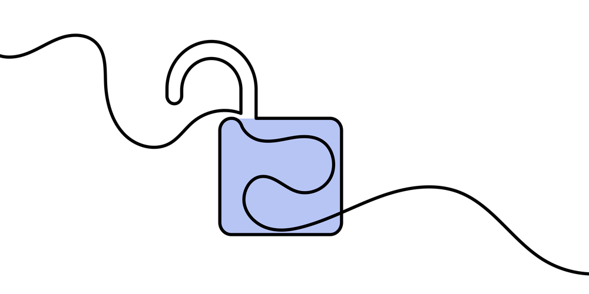
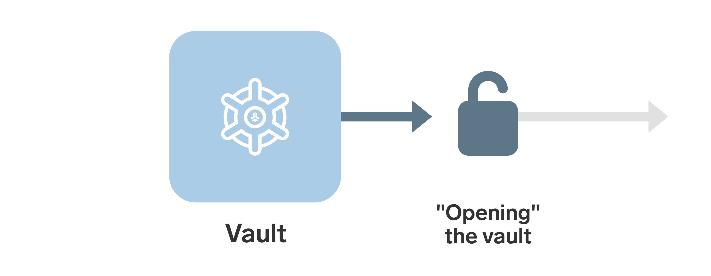
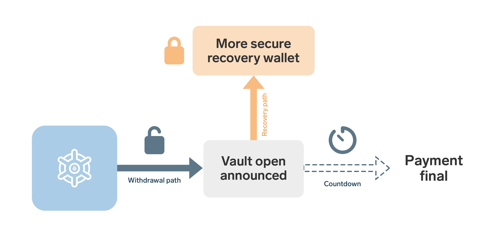
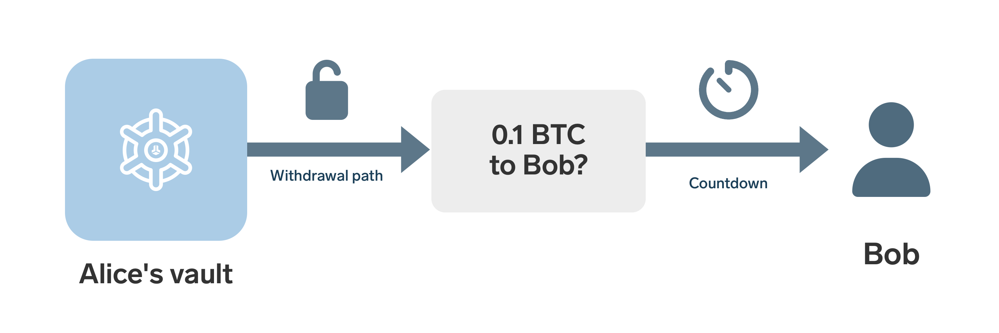
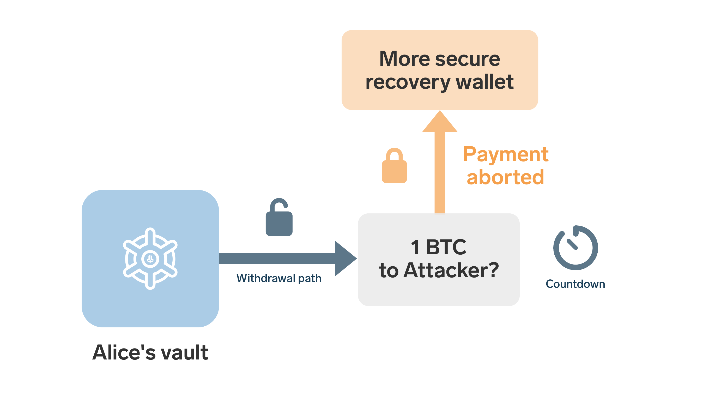
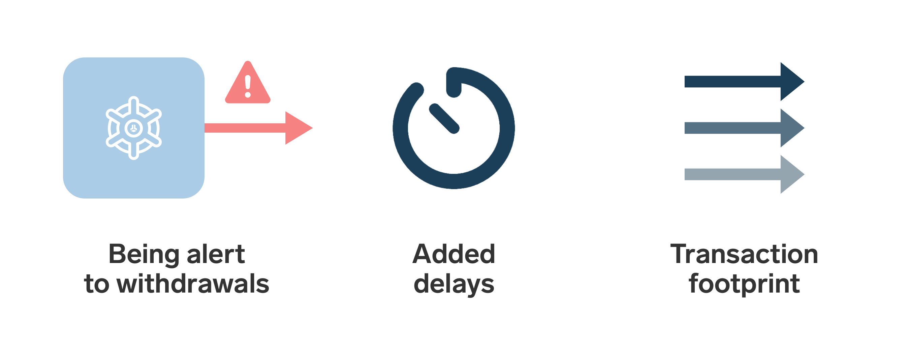

> *作者：Sabastian*
> 
> *来源：<https://blog.bitbox.swiss/en/how-bitcoin-vaults-combine-convenience-with-security/>*

如果你用的是一个普通的比特币钱包，有人偷了你的私钥，那只有一个结局：他们立刻就能转走你所有的钱。这并不是比特币的问题，因为交易的终局性（finality）是它的核心价值之一。但它确实给高级的自主保管装置带来了一个艰难的权衡：你的装置越是安全，花费其中的资金（哪怕是你自己，完全正当的花费）可能就越是麻烦。

比特币的 “保险柜（vault）” 钱包特性尝试改善这个情况。与其迫使用户每次签名都要走完一整套不方便的签名流程（例如，要访问一个[多签名钱包](https://blog.bitbox.swiss/en/what-are-multisig-wallets-everything-you-need-to-know/)的多个备份的存放地点），保险柜钱包可以让正当的交易相对容易创建，同时保留一个更加安全的备用路径。对于长期储蓄来说，这就是保险柜的吸引力：不是 “绝对安全”，而是**在日常便利和复原难度之间取得更好的平衡**。

我们来详细解释一下它是怎么运作的！

- 保险柜钱包与普通钱包不同，必须先 “打开” 它，才能从中花费。 -

## 此 “保险柜” 非彼 “保险柜”

首先我们要明白，在比特币世界里，“保险柜” 这个术语的含义是相当宽泛的。一些公司用它来指称更高级的冷存储产品，通常是带有额外冗余（比如 [时间条件](https://blog.bitbox.swiss/en/exploring-bitcoin-miniscript-with-liana-and-the-bitbox02/) 以及 [合作式保管](https://blog.bitbox.swiss/en/secure-your-bitcoin-with-bitbox-and-unchained/)）的多签名钱包。也有一些时候，它单纯指的就是硬件签名器，比如在网站上，我们把 BitBox 称作 “你的比特币的瑞士保险柜”。这些都无伤大雅，只是你自己要心中有数：“保险柜” 这个标签可能指的是许多不同的东西；只不过在这篇文章中，我们指的是**一种非常具体的钱包设计**。

以较为严格的技术角度来说，比特币保险柜指的是一种强制执行 “**延迟取款**” 且带有一条单独的 “**钱包复原路径**” 的钱包装置。这种设计的目的是通过消除攻击者立即将钱包洗劫一空的能力，让偷盗变得更困难。我们来细说。

## 基本思路

标准的保险柜设计可以用三个概念来解释：

- 储蓄放在这个**保险柜**中 —— 当然不是真的保险柜，只是带有特定花费条件的钱包。
- “**取款路径**” 可以 “打开保险柜”，但它只会开始倒计时；倒计时结束之后，支付才能完成。
- “**复原路径**” 可以在倒计时期间叫停开启保险柜的任何尝试，将资金重新转移到一个更加安全的钱包。

使用 “路径” 这个词，只是意味着有一些锁定的条件，让资金只能往特定的方向、以特定的方式移动。

这种方法有趣的地方在于，取款路径和复原路径，可以、也应该 **代表非常不同的钱包装置**。比如说，取款路径可以是仅仅一个你随身携带的硬件签名器，而复原路径可以是一个非常安全的多签名钱包，在不同的物理空间有 5 个备份。

通过将两种钱包装置结合在同一个保险柜中，我们可以**集两者之所长**：取款路径带来便利性、易用性，复原路径带来更高的安全性和冗余。

### **举个例子**

假设 Alice 在她的保险柜钱包中持有 1 BTC，希望发送 0.1 BTC 给 Bob 。为此，她首先要使用常规的**取款路径** *打开保险柜*。如前所述，这条路径可以非常简单，甚至不需要为安全性而优化。Alice 在取款路径中只使用一个硬件签名器。不过，在理论上，她甚至可以使用一个放在智能手机上的热钱包，这不会危及保险柜的安全性。

（译者注：“冷存储” 和 “热钱包” 分别指的是 不联网/联网 的私钥存储 设备/装置。比如写在纸上的种子词，就是一种冷存储；硬件签名器也是。而在联网的手机和电脑上运行的保存有私钥的钱包软件，就是热钱包。）

“打开保险柜” 的意思就是**创建一笔特殊的交易**。这笔交易表明有人尝试花费保险柜中的资金，并开始一个倒计时。我们假设是 24 小时。那么在 24 小时以内，Alice 可以**取消给 Bob 的支付**、转移资金到更加安全的钱包装置中。仅在 24 小时之后，这笔支付才算完成，Bob 可以用第二笔交易来领取这笔资金。

Alice 从保险柜中花费、发送支付给 Bob 时，只用到了相对简单的取款路径。在这个案例中，这意味着她只需用自己的常规钱包生成一个签名。但是，如果意外发生，她依然有更加安全的复原路径作为后备方案。比如说，如果一个攻击者拿到了她日常使用的钱包、尝试偷盗这 1 BTC，Alice 可以抢在盗贼前面、使用复原路径将资金转移到她更加安全的钱包。更通俗地说，她**总是**能够使用这条复原路径，将资金转移到更安全的地方。

能够这样做，是因为开启保险柜的交易是带有**严格条件**的，只能花费到复原路径，或者在倒计时结束后被目标收款方取走。

## 取舍

就跟几乎所有增加钱包安全性的措施一样，保险柜也是**通过加入另一个取舍**来解决当前的取舍。

你**得到**了两方面的好处：一个易于使用、可用于日常花费的钱包，同时，还依然拥有分散化的多签名装置的高级安全性和冗余。

但是，这也带来了三个方面的缺点：

- **看守保险柜**： 恶意人打开保险柜之后要等待一段时间，这只有在钱包的主人能够注意到攻击并且及时响应时才能有所帮助。这个问题类似于闪电网络用户需要 “瞭望塔”。、
- **延迟支付**：显然，正当的支付也要花费更长时间，因为使用取款路径时有（必要的）等待时间。
- **更多交易**：从保险柜中取款至少要两笔交易，当然要支付更多交易手续费（也更容易造成网络拥堵）。

选择等待期的时长，自身也是一种取舍：增加时长可以让侦测和反击恶意取款变得更简单；但同时也会进一步拖延日常交易 —— 反之亦然。

即使撇开这些缺点不谈，保险柜有其强力之处，却也不是魔法。保险柜并不能让比特币 “绝对偷不走”，也不是从此就不需要好的安全习惯。你依然需要建立和管理备份，依然需要使用安全的硬件签名器，依然不得不处理由于多签名和保险柜自身而增加的技术复杂性。

这也是为什么，保险柜通常被当成一种 “**高级工具**”，而不是一种人人适合的推荐方案。

## 保险柜的适用场景

保险柜尤为适合一种场景：**不追求经常转账，但希望保持可用**。比如说长期储蓄、公司财务和家庭储蓄，所有者希望拥有比简单钱包更强的保护，但不希望每一笔正当交易都涉及复杂的签名操作

设计良好的保险柜，可以让私钥劫持的后果没有那么可怕，因为可疑的取款不会立即成功。但是，同样重要的是，它也降低了操作负担。用户不需要为每一笔普通操作都动用多个签名器（或者私钥备份），可以通过取款路径来花费，仅在意外出现时，才依靠更健壮的装置。这也可以将复原路径的备份的关注点完全转向安全性，因为已经不必考虑便利性。

结合这些好处，也有助于实现**更轻松的遗产规划**，因为你的继承人不需要在你身故之后使用你的取款路径（等同于从你的保险柜 “盗窃”）。在复原路径的装置中加入他们不会带来额外的复杂性。

## The need for covenants

比特币已经支持很有用的钱包特性，比如多签名和时间锁。使用 “[Miniscript](https://blog.bitbox.swiss/en/understanding-bitcoin-miniscript-part-1/)” 这样的工具，资深的用户[已经可以](https://blog.bitbox.swiss/en/exploring-bitcoin-miniscript-with-liana-and-the-bitbox02/)创建出带有延迟复原路径或者面向继承的条款的钱包。

但完整的保险柜钱包，需要的不止是这些。它不仅需要限制钱币 *何时* 能够移动，也需要限制它们接下来能够移动 *到哪里去*。这就是 “限制条款（[covenants](https://blog.bitbox.swiss/en/what-are-bitcoin-covenants/)）” 发挥作用的地方。

限制条款是一种限制下一笔花费交易的特征的花费条件。它对保险柜而言是必要的，因为保险柜需要能够**承诺**非常具体的一个花费不中，比如钱币只能被一笔预先定义好的推迟取款交易，或者只允许取消（回到一个已知的恢复钱包中）。

没有限制条款式的约束，保险柜就只能依赖于预先签名的交易和精心的状态管理。这也能行，但只是更难做得好、更难使用。截止本文撰写之时，各种限制条款提议依然停留在 “**提议**” 阶段。所以，至少目前为止，原生的比特币保险柜更多还只是有有趣的概念，实现还有待未来。

## Conclusion

比特币保险柜尝试两全其美，让自主保管既不那么脆弱，又不那么麻烦。它不是强迫用户在每一笔日常花费中都依赖于最强壮、最谨慎的安全路径，而是在幕后加入分别延迟取款路径和复原路径。这让失盗从一个一招不慎满盘皆输的事件，变成一个主人有时间来发现和反击的过程，同时，正当的花费依然相对容易。

这个想法有其吸引力，尤其对于大额或较少移动的资金而言。但保险柜对于更广泛的比特币安全性而言也有重要启发：更好的自主保管不仅仅是保管得更好的密钥，它也跟钱包的构造方式有关，便利性和可复原性不是必然背道而驰。

目前，绝大部分用户不需要保险柜。但随着比特币钱包的表达能力更加丰富，保险柜也许最终会成为一个最清楚的例子，表明更好的比特币脚本工具可以如何改善实际场景中的自主保管。

（完）