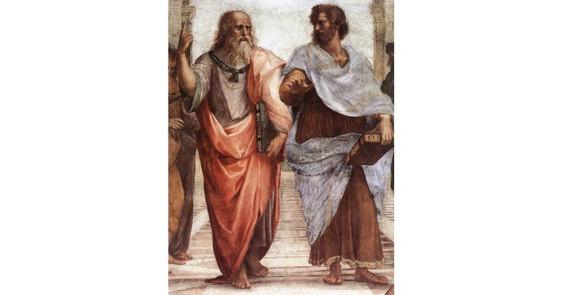
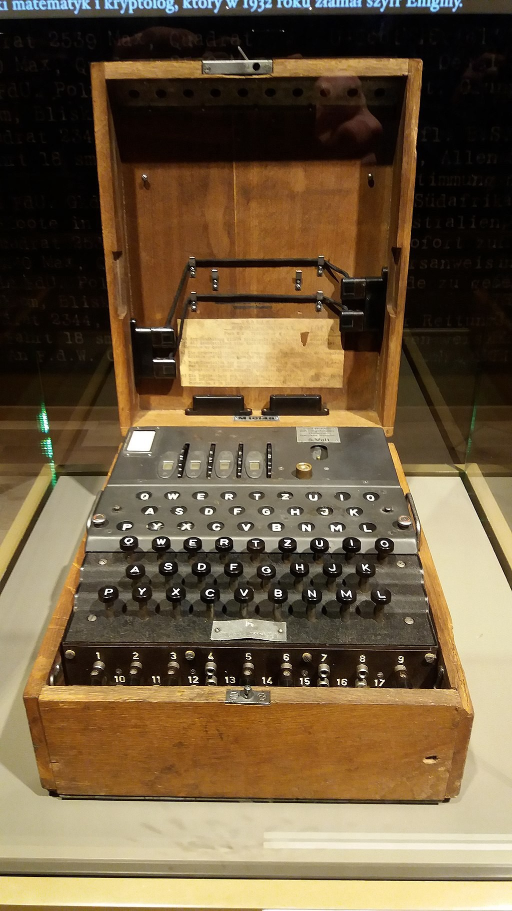
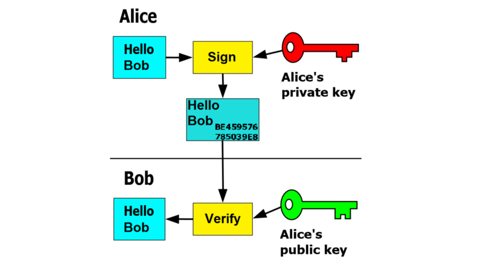

> *作者：Hugo Nguyen*
> 
> *来源：<https://medium.com/@hugonguyen/how-cryptography-redefines-private-property-34cd93d86036>*

密码学是一门研究保护及破译密码的艺术。比特币运用一种叫作[公钥密码学](https://en.wikipedia.org/wiki/Public-key_cryptography)的特殊密码学来使其价值储存及转移系统更为便利。正是通过这一机制， Alice 才能保证其比特币无轻易失盗之虞，或将一部分比特币发送给 Bob，又或[ coinbase 奖励](https://www.mycryptopedia.com/coinbase-transaction-explained/)才能发给矿工。“Cryptocurrency”这一术语正是来源于“crypto-”（校对注：原意为“隐写术”，代指密码学）和“currency”的结合。在比特币基础教程系列的这第三部分里，我们将探讨在创造数字硬通货及其在社会影响的过程中，公钥密码学所发挥的作用。

为了充分理解公钥密码学的重要性，我们必须先退几步来理一下，从原理上讲，我们的社会是如何围绕财产的概念组织起来的。

## 什么是财产？

> *财产从未被废除，也永远不会被废除，只不过主人会变而已。有史以来最公平的制度是每个人，而非没有人，[都] 拥有财产。 --- A. N. Wilson*

财产的范围非常广泛，并且，由于社会认同和环境的变化，财产概念的构成部分经常会变。比如，早期所讨论的财产几乎一直都只指土地。因为那时土地是导致冲突及权力争夺现象不断出现的主要源头，所以土地自然就占据着古代思想家们的头脑。之后，随着社会的发展，财产就扩展到包括无形资产，如专利和版权，然后又延伸到包括一切被认为是生存及自由所必需的东西。

给个正式定义的话，财产是一个由[当地主权国家](https://en.wikipedia.org/wiki/Property#Overview)所定义和实施的法律概念。具体实施依据政治制度，从君主制到共产主义再到民主制等各有差异。

关于财产的讨论要追溯到希腊文明时期。柏拉图 (Plato) 和亚里士多德 (Aristotle) 这两位西方哲学之父为后来绵延 2500 年的激烈且有时极度血腥的争论奠定了基础。

柏拉图可能受了斯巴达人 (Spartans) 的影响，他反对任何种类的私有财产，包括男性的老婆和孩子。他抵制“我的”和“不是我的”以及“他的”和“不是他的”这些概念。他认为私有财产会腐蚀人的灵魂：它会使人贪婪、嫉妒和暴戾。一个理想的柏拉图式社会将彻底消灭私有财产。这一学派后来发展成了一个成熟的体系，共产主义之父卡尔·马克思 (Karl Marx) 对此多有建树。

亚里士多德，即柏拉图最优秀的学生，则持不同想法。亚里士多德反对柏拉图认为公共财产能消除恶习及暴力的观点，他认为共享财产的人会比那些自己享有私有财产的人更容易发生冲突。亚里士多德还认为私有制对社会进步至关重要，因为只有关系到个人切身利益时，人才会努力争取。而且，只有当个人的私有财产权受到尊重，人们才有机会充分成长、成为品行端正的人。正如史学家理查德·派普斯 (Richard Pipes) 雄辩地指出：“人类必须有所得，才会付出行动。”

    

- 柏拉图（公元前 427-347 年）和亚里士多德 （公元前 384-322 年) -

柏拉图反对私有财产的中心论点建立在道德的基础上。亚里士多德也以道德为基础回应了柏拉图。但是亚里士多德的一些论点超出了道德范畴，可归于经济实证领域。（有趣的是，亚里士多德和他的老师一样，[反对贸易和追逐利润](https://mises.org/library/aristotle-private-property-and-money)，因此他没有建立一个自洽的经济学框架。）

自柏拉图和亚里士多德以来，关于财产的讨论主要包括四个方面：道德、政治学、心理学和经济学 [1]。其中关于私有财产的心理学和经济学理论可能是最重要的，因为它们想解释真实世界为何如此，而非构想世界应该是什么样子。

**关于财产的一个基本问题是，财产和主权到底哪个更先产生？**

一些有影响力的思想家，如哈林顿 (Harrington) 和洛克 (Locke) 就认为财产要先于主权。他们认为即使国家不存在，人类也能凭直觉理解财产。

对于他们而言，国家的主要职能就是保护产权。评价一个主权国家的标准是该国对这一职责的履行程度。洛克进一步推论：如果一个国家未能履行其保护产权的职能，那么个人有权反抗国家。资本主义和现代经济学之父亚当·斯密 (Adam Smith) 持有类似观点。斯密意识到财产与政府彼此依赖，但仍主张“没有财产，文明的政府是不可能存在的，因为其主要职能就是保护财产所有权”。（然而，在产权是否是“自然的”这一问题上，史密斯与洛克的观点不同——他认为产权是“获得的”权利，而非“自然的”权利）。

相反，其他思想家们，尤其是霍布斯 (Hobbes)，则认为恰恰相反，财产是由国家创造出来的。他认为财产只是权威的产物，是对权威的认可 [2]。

尤其是在 20 世纪后半期，越来越多的证据证明哈林顿和洛克的观点是正确的。20 世纪发生的一场大规模的社会实验试图通过传播共产主义来废除私有财产。这一实验引发了冷战和世界上数不胜数的代理战争（校对注：proxy war，意思是指使第三者来发动的战争），于 1962 年古巴导弹危机时达到高潮，并最终于 1991 年苏联解体时戏剧性收尾。苏联解体后，其余的共产主义国家分为两大阵营。有些转向了资本主义，如很多中欧和东欧的国家。有些则只是名义上的共产主义，如中国和越南——在这些国家，政治体制自称代表“资产阶级”，但经济的运行方式与资本主义国家很相似。几乎所有幸存的共产主义国家都已经采用了自由市场意识形态，且被迫要（在一定程度上）尊重产权以便存活下来。

总之， 20 世纪向我们展示了一点，即那些未能发挥保护产权作用的政府要么下台了要么最终被迫尊重私有财产。这就证明了国家服从财产需要，且是其衍生物，而非相反。总的来说，财产先于国家。

虽然这样，但在短期到中期，个人确实还是要依赖国家来保护他们的产权，而且如果国家未做到这点，个人会承受很多痛苦。我们来看看密码学是如何帮助打破这个依赖循环的。但是首先，我们要快速回顾一下现代密码学是如何产生的。

## 公钥密码学

在近代以前，密码学的发展一直是由战争和相互竞争的国家来推动的。

在二战 (WW2) 以前，古典密码学给人的感觉更多是晦涩难懂，而非数学上的严谨。如果里面涉及任何数学，那只是偶然。这一点随着技术的发展出现了变化：

-  电报的发明极大地增加了要保护的数据量
-  无线电的发明提高了对公共通信渠道加密的需求，因为求助于低可侦测性技术并不可靠
-  计算机的发明给密码分析带来了令人难以置信的算力；破解密文也变得容易多了

这些发展到二战期间达到高潮，盟军在艾伦·图灵 (Alan Turing) 的鼎力帮助之下，英勇地破解了德国最先进的密码装置恩尼格玛密码机 (the Enigma machine)。[恩尼格玛密码机的破解](https://en.wikipedia.org/wiki/Cryptanalysis_of_the_Enigma)毫无疑问终结了古典密码时代（校对注：此处及下文的“密码”（cipher）指的都是某种加密及解密方法，而非 password（登录系统用的口令）或者一段具体的密文），并呼唤密码学家寻找更强大的密码——建立在更坚实的数学基础上的密码。

- 一个时代的终结：恩尼格玛密码机——图片来源：<a href="https://commons.wikimedia.org/wiki/User:LukaszKatlewa">LukaszKatlewa</a>, <a href="https://creativecommons.org/licenses/by-sa/3.0">CC 3.0</a> -

幸运的是，我们有探索前进道路的线索。古典密码的一个主要问题是所谓的[密钥分发](https://en.wikipedia.org/wiki/Key_distribution)问题——一个对所有[对称密码](https://en.wikipedia.org/wiki/Symmetric-key_algorithm)而言都很普遍的问题（对称密码是指用同一个钥匙去加密和解密的密码学技术）。在对称密码使用过程中，由于不推荐密钥重用，（发送一次密文就需要一个密码，因此）要分发的密钥数量就与要被保护的数据量成正比——如前所述，需要保护的数据量以前所未有的速度激增。因此，当时的一大研究领域是寻找廉价而安全的大规模分发密钥的方法。对非对称密码的洞见始于一些密码学家们反过来思考这个问题：我们真的需要分发密钥吗?

这一研究方向最终把搜索范围缩小到了[单向函数](https://en.wikipedia.org/wiki/One-way_function)，且不久就找到了全新的解决办法——一个不需要分发密钥的解决办法。 Diffie、Hellman 和 Merkle 于 1976 年发现了公钥密码学，即有史以来第一个非对称密码。一年后，Rivest、 Shamir 和 Adleman 发布了第一个实现，即现在著名的 [RSA 算法](https://en.wikipedia.org/wiki/RSA_%28cryptosystem%29)。在 RSA 算法发明的几年前，英国的 Ellis 和 Cocks 独立发现了公钥密码学，但并没有实现。而且， Ellis 和 Cocks 的研究是保密的，长达 27 年都没有公开承认过。

至此，公钥密码学这一现今被认为是 2000 年来最伟大的密码学成就诞生了。这一技术花了几十年才渗透到大众当中，这在很大程度上要归功于[密码朋克](https://en.wikipedia.org/wiki/Cypherpunk)运动的努力。密码朋克预见到国家垄断这项新技术会造成巨大的权力不对等和对个人自由的潜在威胁，便承担着令人难以置信的风险把公钥密码学带给平民百姓。他们成功以后，大门便一直敞开、再也不受人控制了。有史以来第一次，个人可以负担得起军用级加密技术了。

但是直到比特币被发明出来，公钥加密学才得以发挥其所有潜能。其在数字硬通货里的运用将重新定义私有财产。

## 私有数字产品：一个自相矛盾的说法？

个人电脑和网络的出现带来了一个新的资产类别：[数字产品](https://en.wikipedia.org/wiki/Digital_goods)。数字产品是用不同编码格式打包的无形信息数字[位](https://en.wikipedia.org/wiki/Bit)，比如维基百科文章、MP3 文件、软件等等。

数字产品开创了一个以前从未见过的信息分享新时代。任何信息都可以以几乎为零的边际成本迅速复制并大规模分发。

然而，早期数字产品并没有显著改变私有财产的属性。事实证明，数字产品是出了名地难以保持隐私性。

建立对数字产品排他所有权的问题在于数字产品是可复制的。但这并没有使人们停止尝试。国家和企业对数字产品施加控制的首选方法是制度。比如，美国制定了一项复杂的[出口管制和法规](https://www.state.gov/strategictrade/overview/)计划来防止机密（尤其是先进技术的知识）被泄露给其他国家。在企业中，[三大唱片公司](https://en.wikipedia.org/wiki/Music_industry)和[五大电影制片厂](https://en.wikipedia.org/wiki/Film_studio)花了一大笔钱为反盗版法游说，以及控告那些违法的人。同样，大型软件公司也在学习如何建立专利战资金。在这过程中，他们利用专利制度来削弱小公司。在最好的情况下，实施数字资产排他性的监管解决方案也是既昂贵又无效。而在最坏的情况下，他们创造了一种只有少数玩家才能[钻制度的空子](https://en.wikipedia.org/wiki/Patent_troll)的环境。

非监管解决方案同样无效。有一个这样的例子就是[数字版权管理](https://en.wikipedia.org/wiki/Digital_rights_management) (DRM),一种旨在限制数字产品使用的访问控制技术。 DRM 确实提供了一些基本的安全措施来防止盗版。然而， DRM 有一个致命的弱点：只要安全措施被攻破一次，就没有追索权了。

我们在创造数字排他性方面看到的有限成功来自游戏行业。游戏开发者发现如果他们可以在自己设计的游戏里创造[虚拟物品](https://en.wikipedia.org/wiki/Virtual_goods)（数字产品的一个子集），这些物品可加到游戏设定里去，也可以是一个不错的奖金收入来源。由于游戏开发者 100% 控制着这些虚拟物品的运作环境，他们可以对这些虚拟物品施加一些限制，而这些限制在其他情况下是不可能的，包括让这些虚拟物品难以访问或极为稀罕。然而，游戏内虚拟物品的应用有限，且游戏用户依赖游戏开发者不要改变游戏规则。

这样看来，数字产品和私有财产似乎是相悖的。如果某物是数字化的，则该物几乎不可能成为私人的或只归某人所有。私有数字产品听起来就像是一个自相矛盾的说法。

无法排他地拥有数字产品意味着所有人都可以利用它们。个人可以利用数字产品来提高自己的能力，但国家也可以通过数据收集、监管和宣传来使自己更强大——有了数字产品，一切都更容易了。纯粹的数字产品不会改变个人与国家之间的权力结构。

但是，只要我们克服了两大主要障碍，数字产品就能成为私有财产：

- **稀缺性**：无限量复制和分发数字产品的便利性正是使得排他性所有权难以实现的原因。
- **可转移性**：通过销售来处置资产的能力是所有权的重要组成部分。没有了这种能力，所有权就没什么用处了。

结果证明这两个所需属性也是货币的[先决条件](https://nakamotoinstitute.org/shelling-out/#attributes-of-collectibles)。如果我们能创造一种稀有且可转移的数字产品，那这种产品不仅可以为私人所有，它还会变成一种很好的价值储存手段，而且最终会成为一种新的货币形态，即数字“[硬](https://en.wikipedia.org/wiki/Hard_currency)”通货。

比特币解决了这两个问题。比特币创造了数字稀缺性，它在软件中给自己强加了一个固定的供应量上限（作为一种共识规则)，然后通过一个去中心化的[挖矿机器](https://en.bitcoin.it/wiki/Mining_rig)网络用很多能量（以[工作证明](https://en.bitcoin.it/wiki/Proof_of_work)的形式）来保护共识规则。只要挖矿的权力是足够去中心化的，就几乎不可能改变这一先定的供应规则或使网络瘫痪。我们在[本系列的第一部分](https://bitcointechtalk.com/the-anatomy-of-proof-of-work-98c85b6f6667)深入讨论了这一关键性创新。

另一方面，可转移性的问题可通过利用公钥密码学来解决。具体说来，公钥密码学的一个独特应用就是生成难以伪造的[数字签名](https://en.wikipedia.org/wiki/Digital_signature)。数字资产可以与一个公私密钥对结合在一起。这个钥匙对之后可以根据需要生成任意数量的数字签名，每个数字签名代表一件标的资产。这些数字签名有效地“标记”了资产，使之能在个体间进行转移 [4]。

总之，公钥密码学，加上数字稀缺性，给了我们数字硬通货。数字硬通货继承了数字产品的所有优点：即时、无国界性和不可调控或控制性。最重要的是，这一硬通货可以为私人所有。

- 使用公私密钥对的数字签名——图片来源：维基百科，<a href="https://creativecommons.org/licenses/by-sa/4.0">CC 4.0</a> -

此中的革命性，无论如何夸大都不过分。

有史以来第一次出现了一种完全独立于司法权和法律的私有财产形式 [5]。私钥及其控制的比特币是 *事实上的* 私有财产，而非 *法律上的*。

公钥密码学在数字硬通货中的应用极大地改变了束缚了人类社会数千年的社会契约：个体需要国家来保护财产，而国家反过来需要个体为其持续存在提供资金。人们不禁要问，如果保障财产的安全性是一个国家的主要职能，那么在一个依靠数字硬通货来运转的世界里，国家的作用——和权力会显著减弱吗？

总之，公钥密码学在数字硬通货中的应用重新定义了私有财产，并有可能根除我们所知的社会基础。其后果可能需要几十年才能显现，但一旦发生，其影响便会极其深远。

### 致谢

特别感谢 [Jimmy Song](https://medium.com/@jimmysong)、 [Hasu](https://medium.com/@hasufly)、 [Nic Carter](https://medium.com/@nic__carter) 和 [Steve Lee](https://medium.com/@moneyball) 的极具价值的反馈。

*[1]:* [*Property and Freedom,*](https://www.amazon.com/Property-Freedom-Richard-Pipes-ebook/dp/B000XU4UI0) *Richard Pipes*

*[2]:* [*Property and Ownership*](https://plato.stanford.edu/entries/property)*, Jeremy Waldon*

*[3]:* [*The Code Book: The Science of Secrecy from Ancient Egypt to Quantum Cryptography*](https://www.amazon.com/Code-Book-Science-Secrecy-Cryptography/dp/0385495323)*, Simon Singh*

*[4]: 很可能公钥密码学是标记数字化资产的唯一方法。想象一下，你能用对称密码实现比特币吗。*

*\[5]: 像黄金这样的实物资产可以且经常受到严格监管。例如，在大萧条时期，*[*罗斯福 (FDR) 宣布私人黄金非法并没收*](https://mises.org/library/great-gold-robbery-1933)*。*

